# Introduction
0. [Prompt](#prompt)
1. [Strategy](#dsa-mental-model-for-java-backend--full-stack-interviews)
2. [HashMap](#hashmap-complete-postmortem-for-dsa-interviews)
3. [HashMap Problems](#master-hashmap-pattern-map)
4. [2-Pointers](#2-pointers-complete-postmortem-for-dsa-interviews)
5. [Sliding Window](#sliding-window--complete-postmortem-for-dsa-interviews)


# Prompt
I am preparing for Java Backend / Full Stack Java interviews with around 7 years of experience.

My target roles are:

* Java Backend Developer
* Senior Java Developer
* Microservices Developer
* Java Full Stack Developer

My target technology stack includes:

* Java 8/11/17
* Spring Core
* Spring Boot
* Spring Security
* Spring Batch
* Hibernate/JPA
* REST APIs
* Microservices
* Kafka
* Docker
* Kubernetes
* Jenkins
* AWS
* MySQL/Oracle/DB2
* React
* DSA
* System Design

My hands-on/project experience includes:

1. Spring Boot Blog Application:

   * Spring Boot
   * Spring Security + JWT
   * REST APIs
   * JPA/Hibernate
   * MySQL
   * DTOs and validations
   * Global exception handling
   * Pagination and sorting
   * Swagger/OpenAPI
   * Actuator
   * AWS Lightsail/cloud deployment

2. React frontend integrated with Spring Boot backend.

3. Planned/ongoing microservices version:

   * API Gateway
   * Eureka Service Discovery
   * user-service, post-service, category-service
   * Docker
   * Kubernetes
   * Jenkins CI/CD
   * AWS deployment

Technology / Topic:
DSA


My requirement:

I want to prepare this technology using a strong mental-model-first approach.

Just like:

* For Design Patterns, UML diagrams help me memorize structure and then understand Java code.
* For Spring Security, request-flow diagrams help me understand how filters, authentication, authorization, JWT, and SecurityContext work.
* Similarly, for this technology, I want the best possible visual/mental model that suits the topic.

Please analyze the technology and create the most effective mental model for interview preparation, revision, and project explanation.

Important:
Do not give only theory.
Do not give a generic syllabus.
Do not explain everything randomly.
First identify the best mental model format for this technology, then explain the topic through that model.

The output should help me:

* Understand the topic quickly
* Revise the topic easily
* Remember the internal flow/structure
* Connect theory with Java/Spring Boot/microservices project usage
* Explain it confidently in interviews
* Prepare code/program examples after understanding the diagram/model
* Validate my 7 years of experience in this specific technology

Please prepare the answer in the following structure:

## 1. Best Mental Model for This Technology

First decide which mental model is best suited for this technology.

Choose the right format based on the topic:

* UML class diagram
* Request flow diagram
* Lifecycle diagram
* Architecture diagram
* Component interaction diagram
* Data flow diagram
* Execution flow diagram
* Thread/memory model
* State transition diagram
* Pipeline diagram
* Sequence diagram
* Decision tree
* Pattern map
* Layered architecture diagram
* Deployment diagram
* Troubleshooting/debugging flow
* Interview revision map

Explain why this mental model is suitable for this technology.

## 2. Master Mental Model Diagram

Create one master diagram for the complete topic.

Use Mermaid diagram format wherever possible.

Use the most suitable Mermaid type:

* classDiagram
* flowchart TD
* sequenceDiagram
* stateDiagram-v2
* mindmap
* graph TD

The diagram should show:

* Main components
* Flow of execution
* Important relationships
* Where this technology fits in a real project
* How a request/data/event/job moves through the system
* Where failures or interview scenarios usually appear

The diagram should be simple enough for revision but strong enough for interview explanation.

## 3. One-Line Mental Shortcut

Give me a very short memory shortcut.

Example format:

* Spring Security = Request → Filter Chain → Authentication → SecurityContext → Authorization → Controller
* Kafka = Producer → Topic/Partition → Broker → Consumer Group → Offset → Processing
* Spring Batch = Job → Step → Reader → Processor → Writer → Metadata
* React = Component → Props/State → Render → Event → Re-render
* Hibernate = Entity → Persistence Context → Dirty Checking → SQL Flush → DB
* Microservices = Service → API Gateway → Discovery → Communication → Resilience → Observability

Create a similar shortcut for this technology.

## 4. Topic Breakdown Using Mental Model

Break the complete topic into small blocks using the mental model.

For each block, explain:

* What it means
* Why it exists
* How it works
* Where it is used in a real project
* What interviewers ask from this block
* What code/practical example is required

Use this table:

| Mental Model Block | Meaning | Why It Is Important | Project Usage | Interview Focus |
| ------------------ | ------- | ------------------- | ------------- | --------------- |

## 5. Visual Notes for Each Important Subtopic

For every important subtopic, create a small diagram.

Examples:

* For Java Collections: internal HashMap flow, ArrayList resize flow, ConcurrentHashMap locking/bin flow
* For Multithreading: thread lifecycle, synchronized lock flow, executor service flow
* For Spring Boot: startup flow, auto-configuration flow, request-to-controller flow
* For Spring Security: login flow, JWT filter flow, 401/403 flow
* For Hibernate/JPA: entity lifecycle, persistence context, lazy loading proxy, transaction flow
* For Kafka: producer flow, partitioning, consumer group, offset commit, retry/DLQ
* For Spring Batch: job/step/chunk flow, retry/skip flow
* For Microservices: API Gateway flow, service discovery, circuit breaker, saga/event flow
* For Docker: image build flow, container lifecycle, volume/network flow
* For Kubernetes: pod lifecycle, deployment/replica set flow, service discovery flow
* For Jenkins: CI/CD pipeline flow
* For AWS: request/deployment architecture flow
* For React: component lifecycle, hooks flow, API call flow, routing flow
* For DSA: pattern decision tree and problem-solving templates
* For System Design: read/write flow, scaling flow, caching flow, queue flow

If the topic is different, choose the best matching visual style.

## 6. Theory Required Behind the Mental Model

Explain only the theory that is necessary to understand the diagrams.

For each theory point, explain:

* Simple definition
* Why it matters
* Internal working
* Interview explanation
* Real project example

Avoid unnecessary academic depth unless it is commonly asked in interviews.

## 7. Code / Program Mapping

After explaining the mental model, map it to code or practical implementation.

Use this table:

| Mental Model Concept | Code/Program Needed? | What To Implement | Why It Helps |
| -------------------- | -------------------- | ----------------- | ------------ |

Then provide small, clean, interview-friendly code examples.

Important:

* Do not generate very long project code unless required.
* First help me understand the structure and flow.
* Then provide code snippets that match the mental model.

## 8. Project Usage Mapping

Connect this topic with my project experience.

Use examples from:

* Spring Boot Blog Application
* JWT Security
* REST APIs
* JPA/Hibernate
* MySQL
* React frontend
* AWS deployment
* Planned microservices architecture
* API Gateway
* Eureka
* Docker
* Kubernetes
* Jenkins

Use this format:

| Concept | How I Can Use/Explain It In My Project | Interview Line |
| ------- | -------------------------------------- | -------------- |

Keep it realistic. Do not fake production experience, but help me frame my hands-on knowledge professionally.

## 9. Scenario-Based Mental Models

Create scenario-based flows that interviewers commonly ask.

Examples:

* What happens when request comes?
* What happens when authentication fails?
* What happens when DB transaction fails?
* What happens when Kafka consumer fails?
* What happens when pod crashes?
* What happens when API is slow?
* What happens when lazy loading fails?
* What happens when React state changes?
* What happens when two threads update same object?
* What happens when system load increases?

Use diagrams or step flows wherever useful.

For each scenario, include:

* Flow
* Problem
* Root cause
* Fix
* Interview explanation

## 10. Debugging / Production Issue Flow

Create a troubleshooting mental model.

Use this format:

Issue → Possible Cause → Where To Check → Fix → Interview Explanation

Examples:

* 401/403 in Spring Security
* LazyInitializationException in Hibernate
* Duplicate Kafka messages
* Consumer lag
* Docker container not starting
* Kubernetes pod CrashLoopBackOff
* Jenkins pipeline failure
* Slow SQL query
* React blank page/API failure

Customize based on the selected technology.

## 11. 60–70% Most Important Interview Coverage

From this technology, identify the topics that cover 60–70% of most interview questions.

Use this table:

| Priority | Topic | Mental Model Needed | Code Needed | Scenario Needed | Interview Weight |
| -------- | ----- | ------------------- | ----------- | --------------- | ---------------- |

Priority:

* P0 = Must cover first
* P1 = Very important
* P2 = Can cover after interviews start
* P3 = Optional/later

Focus mostly on P0 and P1.

## 12. Revision Format

Create a quick revision section.

Include:

* Master shortcut
* 5 key diagrams
* 10 must-remember points
* 10 common interview lines
* 10 common mistakes
* 5 debugging flows
* 5 project explanation points

Make this suitable for mobile/laptop quick revision.

## 13. Interview Answer Templates

Give me ready-made answers using this style:

“As per my project experience...”

“In my Spring Boot application...”

“In microservices architecture...”

“In production, this is usually handled by...”

“The flow starts from...”

“The main issue here is...”

“The reason we use this approach is...”

Create 8–10 strong answers that I can directly speak in interviews.

## 14. Final Learning Strategy

Tell me how to prepare this technology using the mental model.

Give me this order:

1. First memorize the master diagram.
2. Then understand each block.
3. Then write small code/programs.
4. Then connect it with project examples.
5. Then practice scenario questions.
6. Then revise using shortcuts.

Also tell me:

* What to learn first
* What to code first
* What to skip initially
* What is enough to start interviews
* What to continue later in parallel

Important instructions:

* Use a mental-model-first approach.
* Choose the diagram/model according to the technology.
* Do not force the same diagram type for every topic.
* Use Mermaid diagrams wherever possible.
* Keep the explanation practical and interview-focused.
* Explain as per 7 years Java Backend / Full Stack Java experience.
* Connect with Java, Spring Boot, Microservices, REST API, React, Docker, Kubernetes, Jenkins, AWS only where relevant.
* Avoid unnecessary theory.
* Focus on memorization, understanding, interview explanation, and project mapping.


# DSA Mental Model for Java Backend / Full Stack Interviews

For DSA, the best mental model is **not one diagram like UML**. DSA is best prepared using a **Pattern Decision Tree + Problem-Solving Pipeline + Code Templates**.

Why? Because in interviews, the real challenge is not memorizing 300 problems. The real challenge is:

> “Given a new problem, can I quickly identify the pattern and apply the correct template?”

For your 7 years Java Backend profile, DSA should be prepared like this:

> **Problem Shape → Pattern → Data Structure → Template → Complexity → Edge Cases → Project Usage**

---

# 1. Best Mental Model for This Technology

## Best model for DSA

Use this combination:

| DSA Area                | Best Mental Model                            |
| ----------------------- | -------------------------------------------- |
| Overall DSA preparation | Pattern decision tree                        |
| Solving any problem     | Execution flow diagram                       |
| Arrays/Strings          | Two pointer / sliding window flow            |
| HashMap problems        | Frequency / lookup map flow                  |
| Stack/Queue             | Processing pipeline                          |
| Linked List             | Pointer movement diagram                     |
| Trees/Graphs            | Traversal flow                               |
| DP                      | State transition diagram                     |
| Backtracking            | Decision tree                                |
| Heap                    | Priority processing model                    |
| Debugging DSA           | Constraint → complexity troubleshooting flow |

## Why this model is best

DSA interviews usually follow this flow:

```text
Problem statement
   ↓
Constraints
   ↓
Can brute force work?
   ↓
Choose optimized pattern
   ↓
Choose data structure
   ↓
Write template-based code
   ↓
Dry run
   ↓
Complexity
   ↓
Edge cases
```

So your preparation should also follow the same flow.

---

# 2. Master Mental Model Diagram

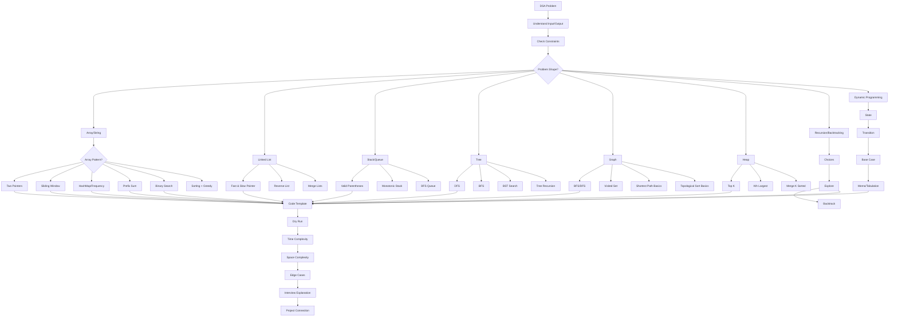

---

# 3. One-Line Mental Shortcut

## DSA shortcut

```text
DSA = Problem Shape → Constraints → Pattern → Data Structure → Template → Dry Run → Complexity → Edge Cases
```

Or even shorter:

```text
DSA = Identify Pattern → Apply Template → Explain Complexity
```

For interview speaking:

```text
First I understand constraints, then choose the right pattern, implement using suitable data structure, dry run edge cases, and explain time-space complexity.
```

---

# 4. Topic Breakdown Using Mental Model

| Mental Model Block | Meaning                                                     | Why It Is Important            | Project Usage                                                  | Interview Focus                      |
| ------------------ | ----------------------------------------------------------- | ------------------------------ | -------------------------------------------------------------- | ------------------------------------ |
| Problem Shape      | Identify if problem is array, string, tree, graph, DP, etc. | Decides the pattern quickly    | Search, filtering, pagination, tree category, dependency graph | “How did you identify the approach?” |
| Constraints        | Input size, time limit, memory limit                        | Helps reject brute force       | Large API result sets, DB result processing                    | O(n²) vs O(n log n) vs O(n)          |
| Pattern            | Reusable solving approach                                   | Reduces memorization           | Sliding window for rate limit, HashMap for lookup              | “Which pattern applies here?”        |
| Data Structure     | Array, Map, Set, Stack, Queue, Heap, Tree                   | Core tool for solving          | Caching, deduplication, queue processing                       | Internal working and complexity      |
| Template           | Standard code skeleton                                      | Makes coding faster            | Java implementation confidence                                 | Clean Java code                      |
| Dry Run            | Test with sample input                                      | Finds logic bugs               | Prevents production bugs                                       | Interviewer checks thought process   |
| Complexity         | Time and space analysis                                     | Shows seniority                | Performance of backend APIs                                    | Big-O explanation                    |
| Edge Cases         | Empty input, duplicates, overflow, nulls                    | Avoids wrong answers           | API validation and defensive coding                            | “What if input is empty?”            |
| Optimization       | Improve brute force                                         | Shows problem-solving maturity | Slow API optimization                                          | Brute force to optimal               |
| Project Connection | Relate DSA to backend work                                  | Validates experience           | REST, DB, microservices, caching                               | “Where have you used this?”          |

---

# 5. Visual Notes for Each Important Subtopic

## 5.1 General DSA Problem Solving Flow

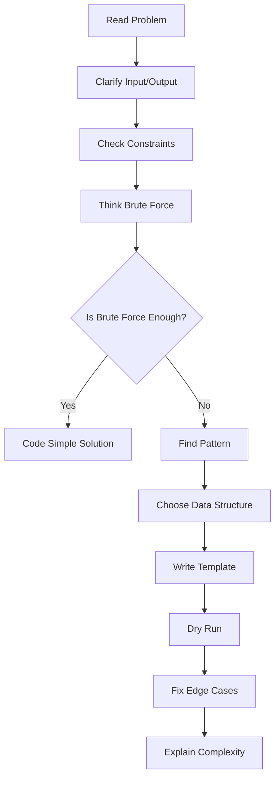

Interview line:

> “I usually start with brute force, check constraints, then optimize using the correct pattern.”

---

## 5.2 Pattern Decision Tree

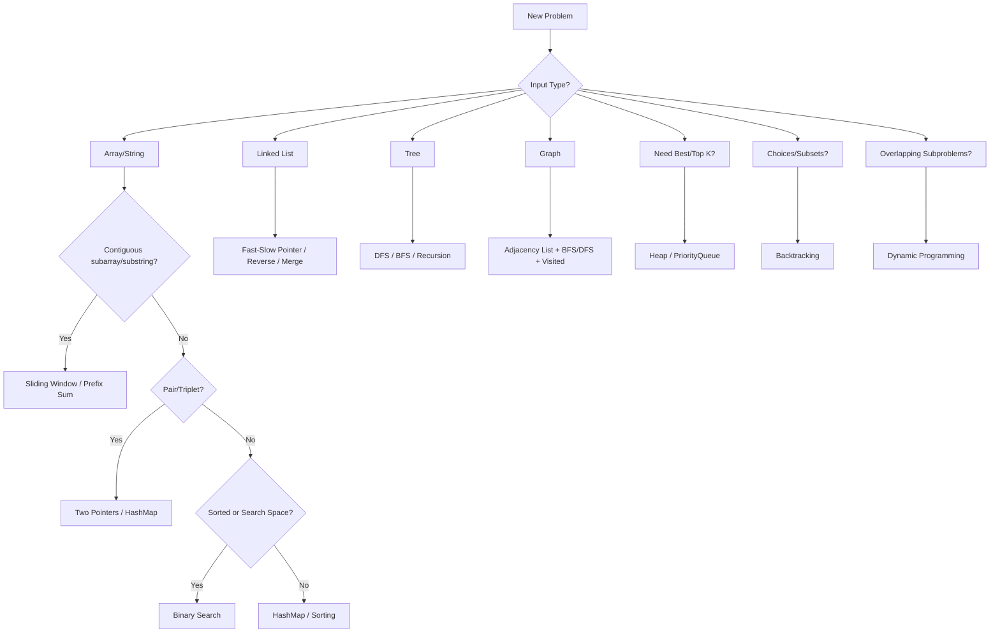

This is the most important diagram for DSA.

---

## 5.3 Arrays and Strings Mental Model

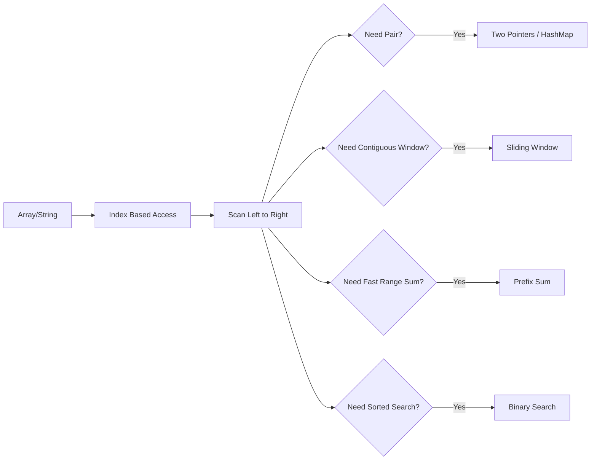

Must-code examples:

```text
Two Sum
Best Time to Buy and Sell Stock
Move Zeroes
Maximum Subarray
Longest Substring Without Repeating Characters
Subarray Sum Equals K
```

---

## 5.4 Two Pointers Flow

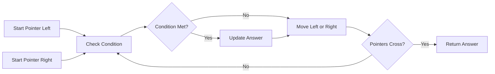

Used when:

```text
Sorted array
Pair sum
Palindrome
Reverse array/string
Remove duplicates
Container with most water
```

Mental shortcut:

```text
Two Pointers = Left + Right → Compare → Move smarter pointer
```

---

## 5.5 Sliding Window Flow

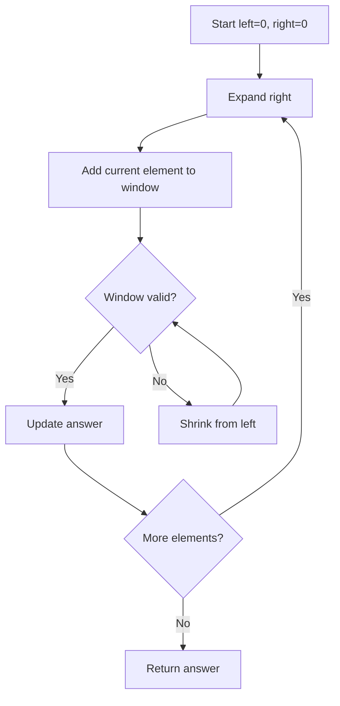

Used when:

```text
Longest substring
Maximum sum subarray of size K
Minimum window substring
Rate limiter logic
Contiguous subarray/substring problems
```

Backend project connection:

> Sliding window is also the mental model behind API rate limiting: maintain requests in a time window and reject if threshold exceeds.

---

## 5.6 HashMap / Frequency Map Flow

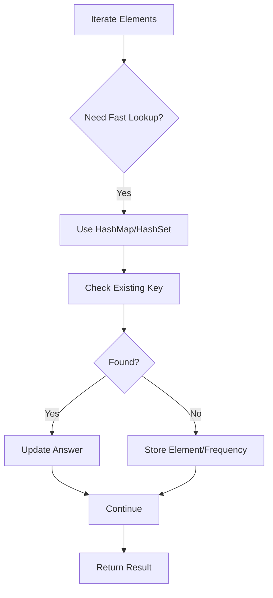

Used when:

```text
Two Sum
Anagram
Frequency count
Duplicates
Subarray sum
First non-repeating character
```

Project usage:

```text
Deduplicate records
Count category frequency
Group response data
Cache lookup
Token/session lookup
```

---

## 5.7 Prefix Sum Flow

```mermaid
flowchart TD
    A[Original Array] --> B[Build Running Sum]
    B --> C[Store prefixSum]
    C --> D[Range Query]
    D --> E[sum L to R = prefix[R] - prefix[L-1]]
```

Used when:

```text
Range sum
Subarray sum equals K
Count subarrays
Difference array
```

Mental shortcut:

```text
Prefix Sum = Convert repeated range calculation into O(1) lookup
```

---

## 5.8 Binary Search Flow

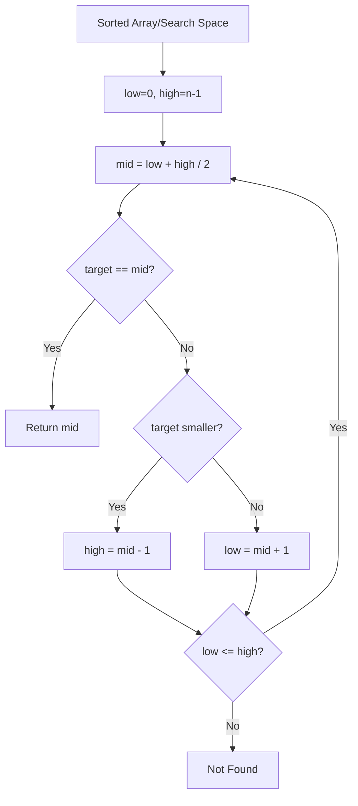

Used when:

```text
Sorted arrays
First/last occurrence
Search insert position
Minimum in rotated sorted array
Search on answer
```

Important interview point:

> Binary search is not only for arrays; it is also used when the answer space is monotonic.

---

## 5.9 Stack Flow

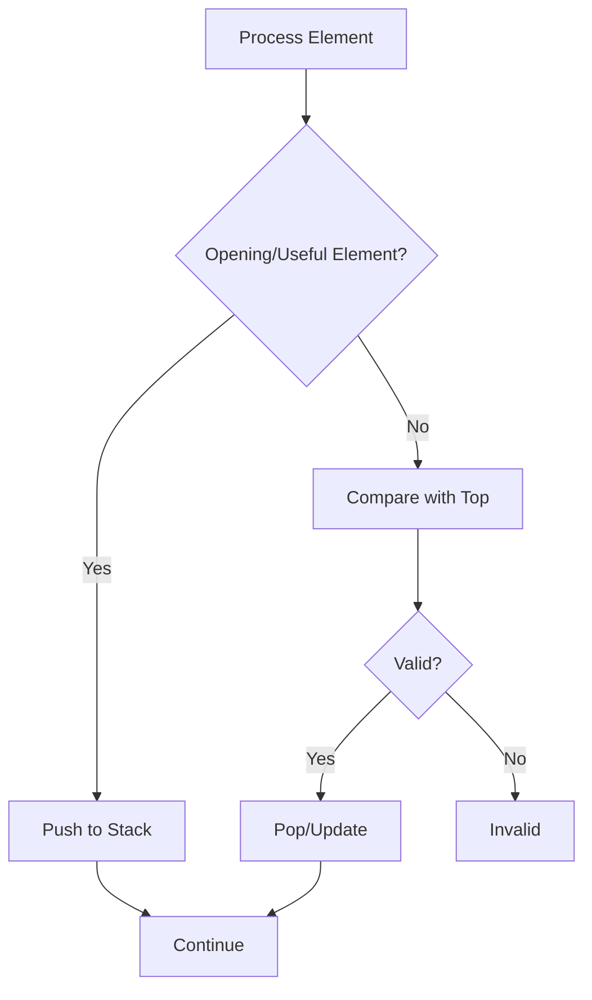

Used when:

```text
Valid parentheses
Next greater element
Min stack
Monotonic stack
Undo operations
Expression evaluation
```

Project usage:

```text
Function call stack
Undo/redo feature
Expression parsing
Nested JSON/XML validation
```

---

## 5.10 Queue / BFS Flow

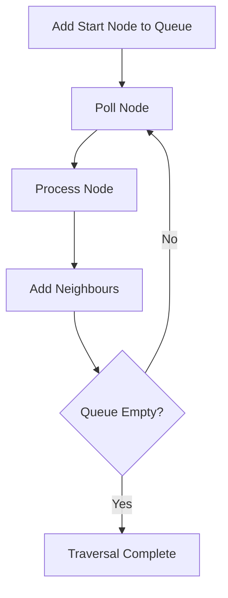

Used when:

```text
Level order traversal
Shortest path in unweighted graph
Message processing
Task scheduling
```

Microservices connection:

> Queue-based processing is similar to Kafka/SQS consumer flow: add work, consume work, process, retry/fail if needed.

---

## 5.11 Linked List Pointer Model

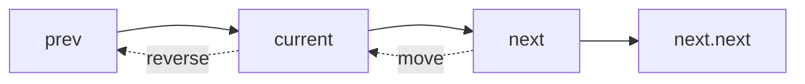

Important patterns:

```text
Reverse linked list
Detect cycle
Find middle
Merge two lists
Remove nth node from end
```

Mental shortcut:

```text
Linked List = Manage prev, current, next carefully
```

---

## 5.12 Tree DFS Model

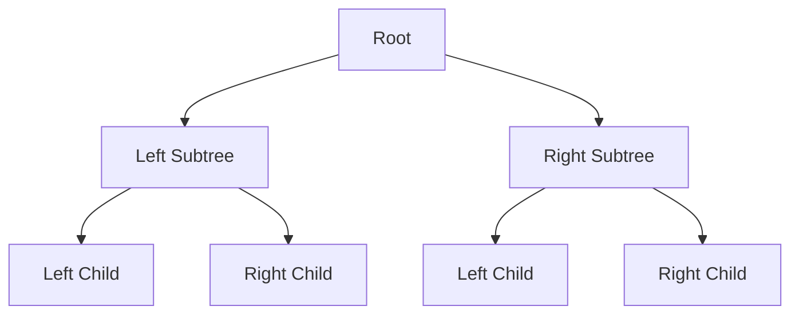

DFS traversal:

```text
Preorder  = Root → Left → Right
Inorder   = Left → Root → Right
Postorder = Left → Right → Root
```

Interview focus:

```text
Height of tree
Diameter
Balanced tree
Lowest common ancestor
BST validation
Path sum
```

---

## 5.13 Graph Traversal Model

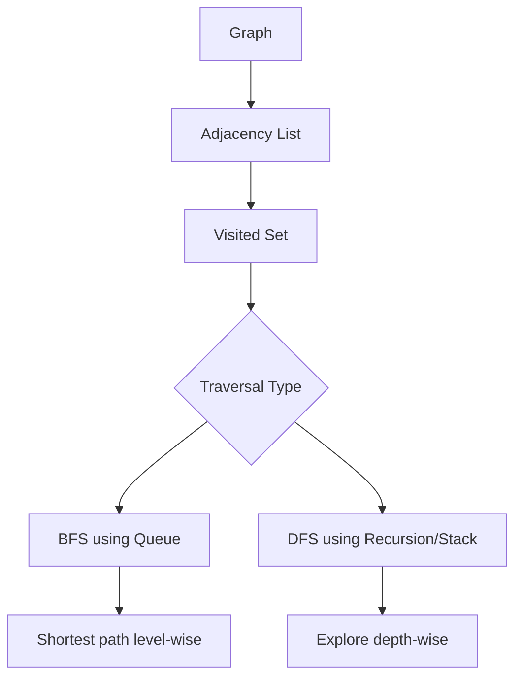

Must understand:

```text
Visited set prevents infinite loop
BFS is level-wise
DFS is depth-wise
Graph may be directed/undirected
Graph may have cycles
```

Project usage:

```text
Service dependency graph
User connection graph
Workflow dependency
Build pipeline dependency
```

---

## 5.14 Heap / PriorityQueue Model

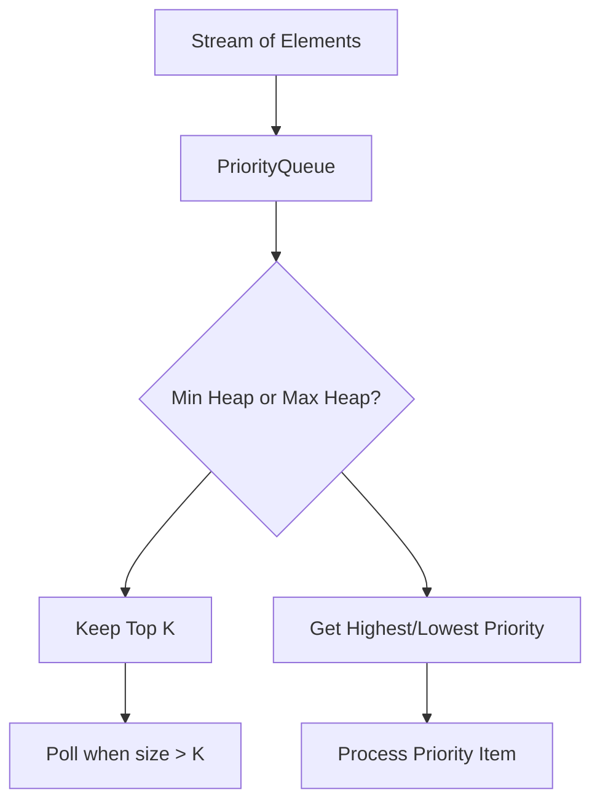

Used when:

```text
Top K frequent elements
Kth largest
Merge K sorted lists
Task scheduling
Priority processing
```

Java class:

```java
PriorityQueue<Integer> minHeap = new PriorityQueue<>();
PriorityQueue<Integer> maxHeap = new PriorityQueue<>((a, b) -> b - a);
```

---

## 5.15 Recursion / Backtracking Model

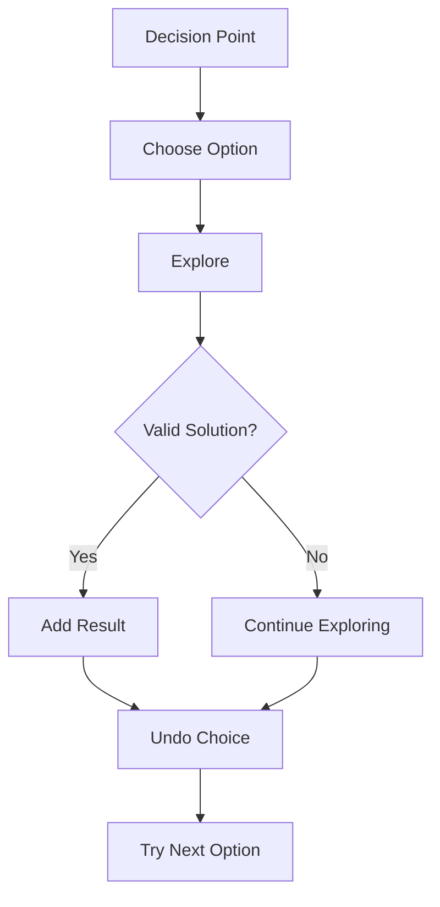

Used when:

```text
Subsets
Permutations
Combination Sum
N-Queens
Word search
Generate parentheses
```

Mental shortcut:

```text
Backtracking = Choose → Explore → Undo
```

---

## 5.16 Dynamic Programming Model

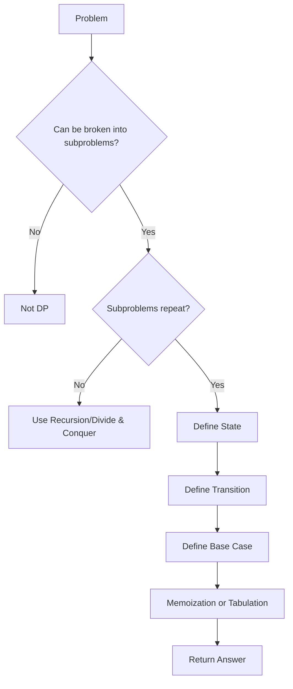

Mental shortcut:

```text
DP = State + Transition + Base Case + Memoization
```

Common beginner DP examples:

```text
Fibonacci
Climbing stairs
House robber
Coin change
Longest common subsequence
0/1 knapsack basics
```

For your current interview target, learn DP basics, not advanced hard DP first.

---

# 6. Theory Required Behind the Mental Model

## 6.1 Big-O Complexity

| Concept    | Simple Definition            | Why It Matters              | Interview Explanation                                | Project Example                            |
| ---------- | ---------------------------- | --------------------------- | ---------------------------------------------------- | ------------------------------------------ |
| O(1)       | Constant time                | Fastest                     | Accessing array index or HashMap lookup average case | Fetching cached user by key                |
| O(log n)   | Reduces search space by half | Efficient search            | Binary search                                        | Searching sorted data                      |
| O(n)       | Single pass                  | Usually acceptable          | Loop through list once                               | Filtering posts                            |
| O(n log n) | Sorting level complexity     | Common optimal for ordering | Merge sort, quick sort average                       | Sorting API response                       |
| O(n²)      | Nested loops                 | Dangerous for large data    | Pair comparison brute force                          | Comparing every post with every other post |
| O(2ⁿ)      | Exponential                  | Usually backtracking        | Subsets/permutations                                 | Avoid for large input                      |
| O(n!)      | Factorial                    | Very expensive              | Permutations                                         | Only small input                           |

Interview line:

> “I first check input size. If n is around 10⁵, O(n²) is risky, so I try O(n log n) or O(n).”

---

## 6.2 Arrays

Definition:

> Array is a contiguous memory structure with index-based access.

Why it matters:

```text
Fast access: O(1)
Insertion/deletion in middle: O(n)
Good for scanning and sorting
```

Java:

```java
int[] arr = new int[10];
```

Project example:

```text
Processing list of post IDs
Sorting comments
Pagination result processing
```

---

## 6.3 String

String in Java is immutable.

Why it matters:

```text
Repeated string concatenation creates new objects
Use StringBuilder for modification-heavy problems
```

Interview example:

```java
StringBuilder sb = new StringBuilder();
sb.append("abc");
```

Project example:

```text
Building slug from blog title
Validating request parameters
Parsing JWT token sections
```

---

## 6.4 HashMap and HashSet

Definition:

> HashMap stores key-value pairs for fast lookup.

Why it matters:

```text
Average lookup: O(1)
Worst case: O(log n) in Java 8+ for treeified buckets
Used for frequency, lookup, grouping, caching
```

Interview line:

> “I used HashMap because I needed constant-time lookup instead of scanning repeatedly.”

Project example:

```text
Map userId to user details
Deduplicate category names
Count post frequency by category
```

---

## 6.5 Stack

Definition:

> Stack follows LIFO: Last In First Out.

Used for:

```text
Parentheses
Undo
Recursion
Monotonic problems
```

Java:

```java
Deque<Character> stack = new ArrayDeque<>();
```

Prefer `ArrayDeque` over old `Stack`.

---

## 6.6 Queue

Definition:

> Queue follows FIFO: First In First Out.

Used for:

```text
BFS
Task scheduling
Message processing
```

Java:

```java
Queue<Integer> queue = new LinkedList<>();
```

Project example:

```text
Kafka/SQS style processing
Background jobs
Batch item processing
```

---

## 6.7 Recursion

Definition:

> Function calls itself with smaller input.

Required components:

```text
Base case
Recursive case
Progress toward base case
```

Risk:

```text
StackOverflowError if recursion is too deep
```

Interview line:

> “Tree problems naturally fit recursion because every subtree is itself a smaller tree.”

---

## 6.8 Dynamic Programming

Definition:

> DP is used when a problem has repeated subproblems and optimal substructure.

Steps:

```text
Define state
Define transition
Define base case
Store result
```

Interview line:

> “I chose DP because the recursive solution recalculates the same subproblems.”

---

## 6.9 Graphs

Definition:

> Graph has nodes and edges.

Core components:

```text
Adjacency list
Visited set
BFS/DFS
Cycle detection
```

Project example:

```text
Microservice dependency graph
Workflow pipeline
Build dependency
User relationship network
```

---

# 7. Code / Program Mapping

| Mental Model Concept | Code/Program Needed? | What To Implement                        | Why It Helps                       |
| -------------------- | -------------------- | ---------------------------------------- | ---------------------------------- |
| Two Pointers         | Yes                  | Pair sum / palindrome                    | Builds pointer confidence          |
| Sliding Window       | Yes                  | Longest substring / max sum              | Very common in interviews          |
| HashMap              | Yes                  | Two sum / frequency count                | Most used DSA tool                 |
| Prefix Sum           | Yes                  | Subarray sum equals K                    | Handles range/subarray problems    |
| Binary Search        | Yes                  | Search / lower bound                     | Must know for optimization         |
| Stack                | Yes                  | Valid parentheses                        | Easy but commonly asked            |
| Monotonic Stack      | Later                | Next greater element                     | Medium-level pattern               |
| Linked List          | Yes                  | Reverse / cycle detection                | Pointer handling                   |
| Tree DFS/BFS         | Yes                  | Max depth / level order                  | Core recursion and BFS             |
| Graph BFS/DFS        | Yes                  | Number of islands / connected components | Important for mid-level interviews |
| Heap                 | Yes                  | Top K frequent                           | Common backend-style problem       |
| DP Basics            | Yes                  | Climbing stairs / house robber           | Basic DP confidence                |
| Backtracking         | P1/P2                | Subsets / permutations                   | Asked but not always               |
| Advanced DP          | Later                | LCS / knapsack                           | Learn after core patterns          |

---

## 7.1 Two Sum Using HashMap

```java
import java.util.*;

public class TwoSum {
    public int[] twoSum(int[] nums, int target) {
        Map<Integer, Integer> map = new HashMap<>();

        for (int i = 0; i < nums.length; i++) {
            int required = target - nums[i];

            if (map.containsKey(required)) {
                return new int[]{map.get(required), i};
            }

            map.put(nums[i], i);
        }

        return new int[]{-1, -1};
    }
}
```

Mental model:

```text
For every number, check whether its required pair already exists.
```

Complexity:

```text
Time: O(n)
Space: O(n)
```

---

## 7.2 Two Pointers: Check Palindrome

```java
public class PalindromeCheck {
    public boolean isPalindrome(String s) {
        int left = 0;
        int right = s.length() - 1;

        while (left < right) {
            if (s.charAt(left) != s.charAt(right)) {
                return false;
            }
            left++;
            right--;
        }

        return true;
    }
}
```

Mental model:

```text
Compare both ends and move inward.
```

---

## 7.3 Sliding Window: Longest Substring Without Repeating Characters

```java
import java.util.*;

public class LongestSubstring {
    public int lengthOfLongestSubstring(String s) {
        Set<Character> set = new HashSet<>();
        int left = 0;
        int maxLength = 0;

        for (int right = 0; right < s.length(); right++) {
            char current = s.charAt(right);

            while (set.contains(current)) {
                set.remove(s.charAt(left));
                left++;
            }

            set.add(current);
            maxLength = Math.max(maxLength, right - left + 1);
        }

        return maxLength;
    }
}
```

Mental model:

```text
Expand right, shrink left when duplicate appears.
```

---

## 7.4 Prefix Sum: Subarray Sum Equals K

```java
import java.util.*;

public class SubarraySumEqualsK {
    public int subarraySum(int[] nums, int k) {
        Map<Integer, Integer> prefixCount = new HashMap<>();
        prefixCount.put(0, 1);

        int prefixSum = 0;
        int count = 0;

        for (int num : nums) {
            prefixSum += num;

            if (prefixCount.containsKey(prefixSum - k)) {
                count += prefixCount.get(prefixSum - k);
            }

            prefixCount.put(prefixSum, prefixCount.getOrDefault(prefixSum, 0) + 1);
        }

        return count;
    }
}
```

Mental model:

```text
If currentPrefix - oldPrefix = k, then subarray sum is k.
```

---

## 7.5 Binary Search Template

```java
public class BinarySearch {
    public int search(int[] nums, int target) {
        int low = 0;
        int high = nums.length - 1;

        while (low <= high) {
            int mid = low + (high - low) / 2;

            if (nums[mid] == target) {
                return mid;
            } else if (nums[mid] < target) {
                low = mid + 1;
            } else {
                high = mid - 1;
            }
        }

        return -1;
    }
}
```

Important line:

```java
int mid = low + (high - low) / 2;
```

Why?

```text
Avoids integer overflow compared to (low + high) / 2.
```

---

## 7.6 Stack: Valid Parentheses

```java
import java.util.*;

public class ValidParentheses {
    public boolean isValid(String s) {
        Deque<Character> stack = new ArrayDeque<>();

        for (char ch : s.toCharArray()) {
            if (ch == '(' || ch == '{' || ch == '[') {
                stack.push(ch);
            } else {
                if (stack.isEmpty()) {
                    return false;
                }

                char top = stack.pop();

                if ((ch == ')' && top != '(') ||
                    (ch == '}' && top != '{') ||
                    (ch == ']' && top != '[')) {
                    return false;
                }
            }
        }

        return stack.isEmpty();
    }
}
```

Mental model:

```text
Opening bracket waits in stack until matching closing bracket appears.
```

---

## 7.7 Linked List Reverse

```java
public class ReverseLinkedList {

    static class ListNode {
        int val;
        ListNode next;

        ListNode(int val) {
            this.val = val;
        }
    }

    public ListNode reverseList(ListNode head) {
        ListNode prev = null;
        ListNode current = head;

        while (current != null) {
            ListNode next = current.next;
            current.next = prev;
            prev = current;
            current = next;
        }

        return prev;
    }
}
```

Mental model:

```text
Save next → reverse pointer → move prev/current.
```

---

## 7.8 Tree DFS: Maximum Depth

```java
public class MaxDepthTree {

    static class TreeNode {
        int val;
        TreeNode left;
        TreeNode right;

        TreeNode(int val) {
            this.val = val;
        }
    }

    public int maxDepth(TreeNode root) {
        if (root == null) {
            return 0;
        }

        int leftDepth = maxDepth(root.left);
        int rightDepth = maxDepth(root.right);

        return 1 + Math.max(leftDepth, rightDepth);
    }
}
```

Mental model:

```text
Depth of tree = 1 + max depth of left and right subtree.
```

---

## 7.9 BFS: Level Order Traversal

```java
import java.util.*;

public class LevelOrderTraversal {

    static class TreeNode {
        int val;
        TreeNode left;
        TreeNode right;

        TreeNode(int val) {
            this.val = val;
        }
    }

    public List<List<Integer>> levelOrder(TreeNode root) {
        List<List<Integer>> result = new ArrayList<>();

        if (root == null) {
            return result;
        }

        Queue<TreeNode> queue = new LinkedList<>();
        queue.offer(root);

        while (!queue.isEmpty()) {
            int size = queue.size();
            List<Integer> level = new ArrayList<>();

            for (int i = 0; i < size; i++) {
                TreeNode node = queue.poll();
                level.add(node.val);

                if (node.left != null) {
                    queue.offer(node.left);
                }

                if (node.right != null) {
                    queue.offer(node.right);
                }
            }

            result.add(level);
        }

        return result;
    }
}
```

Mental model:

```text
Queue holds current level nodes.
```

---

## 7.10 Graph DFS

```java
import java.util.*;

public class GraphDFS {
    public void dfs(int node, Map<Integer, List<Integer>> graph, Set<Integer> visited) {
        if (visited.contains(node)) {
            return;
        }

        visited.add(node);
        System.out.println(node);

        for (int neighbour : graph.getOrDefault(node, new ArrayList<>())) {
            dfs(neighbour, graph, visited);
        }
    }
}
```

Mental model:

```text
Visit node → mark visited → visit neighbours.
```

---

## 7.11 Heap: Top K Largest Elements

```java
import java.util.*;

public class TopKLargest {
    public List<Integer> topK(int[] nums, int k) {
        PriorityQueue<Integer> minHeap = new PriorityQueue<>();

        for (int num : nums) {
            minHeap.offer(num);

            if (minHeap.size() > k) {
                minHeap.poll();
            }
        }

        return new ArrayList<>(minHeap);
    }
}
```

Mental model:

```text
Keep only K largest elements in min heap.
```

Complexity:

```text
Time: O(n log k)
Space: O(k)
```

---

## 7.12 DP: Climbing Stairs

```java
public class ClimbingStairs {
    public int climbStairs(int n) {
        if (n <= 2) {
            return n;
        }

        int first = 1;
        int second = 2;

        for (int i = 3; i <= n; i++) {
            int third = first + second;
            first = second;
            second = third;
        }

        return second;
    }
}
```

Mental model:

```text
Ways to reach step n = ways(n-1) + ways(n-2)
```

---

# 8. Project Usage Mapping

| Concept        | How I Can Use/Explain It In My Project                                     | Interview Line                                                                                                                     |
| -------------- | -------------------------------------------------------------------------- | ---------------------------------------------------------------------------------------------------------------------------------- |
| Array/List     | Used in REST responses like list of posts, comments, categories            | “In my blog application, API responses often return lists, and I handle filtering, sorting, and pagination on collections.”        |
| HashMap        | Useful for quick lookup, grouping, frequency counting, DTO mapping support | “For fast lookup and grouping logic, HashMap is useful because average access is O(1).”                                            |
| HashSet        | Used for uniqueness validation                                             | “For duplicate detection like unique category names or unique tags, Set-based lookup is efficient.”                                |
| Sorting        | Used in pagination and sorting posts by date/title                         | “Pagination and sorting are common in REST APIs, and internally sorting is usually O(n log n).”                                    |
| Binary Search  | Useful when searching sorted data or optimizing monotonic answers          | “Although DB handles most search, binary search is useful when working with sorted in-memory data.”                                |
| Sliding Window | Can explain rate limiter in API Gateway/microservices                      | “Sliding window is useful in rate limiting where requests are tracked within a time window.”                                       |
| Queue          | Similar to async processing and Kafka consumer model                       | “Queue follows FIFO and is similar to how background jobs or message consumers process events.”                                    |
| Stack          | Useful for nested validation and function call understanding               | “Stack is useful for problems like valid parentheses and also helps understand recursion internally.”                              |
| Tree           | Category/subcategory hierarchy                                             | “If categories become hierarchical, tree traversal can be used to fetch parent-child category structures.”                         |
| Graph          | Microservice dependency graph                                              | “In microservices, service dependencies can be visualized as a graph where services are nodes and calls are edges.”                |
| BFS/DFS        | Service dependency traversal or category tree traversal                    | “DFS/BFS helps when we need to traverse connected components or hierarchical structures.”                                          |
| Heap           | Top posts, top categories, top K search results                            | “For top K style problems, PriorityQueue is better than sorting entire data.”                                                      |
| DP             | Less direct in CRUD apps, but useful in optimization problems              | “DP is more common in algorithmic interviews than typical CRUD code, but I understand it using state and transition.”              |
| Complexity     | API performance discussion                                                 | “As a backend developer, I always consider whether logic is O(n), O(n log n), or O(n²), especially for large response processing.” |

---

# 9. Scenario-Based Mental Models

## Scenario 1: Given an array, find two numbers with target sum

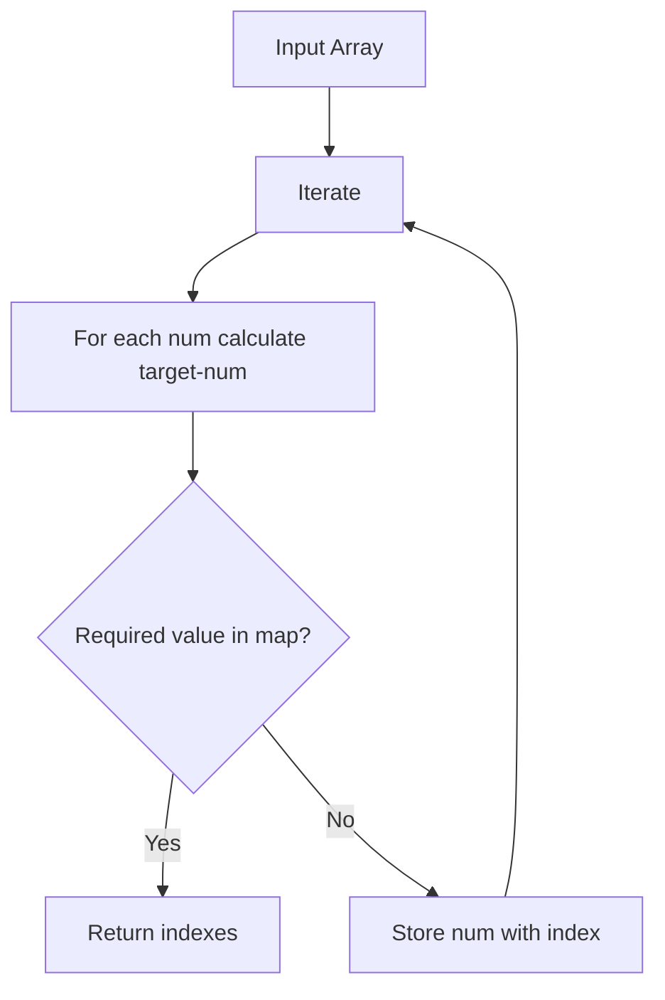

| Part                  | Explanation                                                                |
| --------------------- | -------------------------------------------------------------------------- |
| Flow                  | Iterate once, store visited numbers                                        |
| Problem               | Brute force takes O(n²)                                                    |
| Root Cause            | Checking every pair repeatedly                                             |
| Fix                   | Use HashMap for O(1) lookup                                                |
| Interview Explanation | “I optimized pair search using HashMap, reducing time from O(n²) to O(n).” |

---

## Scenario 2: Longest substring without duplicate characters

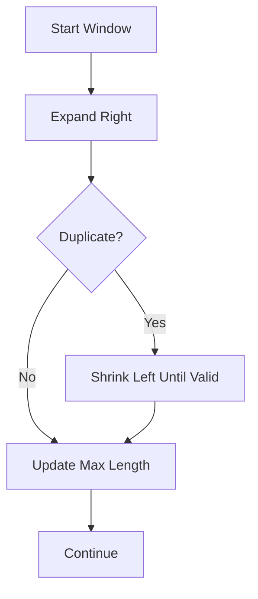

| Part                  | Explanation                                                                 |
| --------------------- | --------------------------------------------------------------------------- |
| Flow                  | Maintain valid window                                                       |
| Problem               | Rechecking substrings is expensive                                          |
| Root Cause            | Brute force generates many substrings                                       |
| Fix                   | Sliding window                                                              |
| Interview Explanation | “Since the problem asks for a contiguous substring, I used sliding window.” |

---

## Scenario 3: Search in sorted data

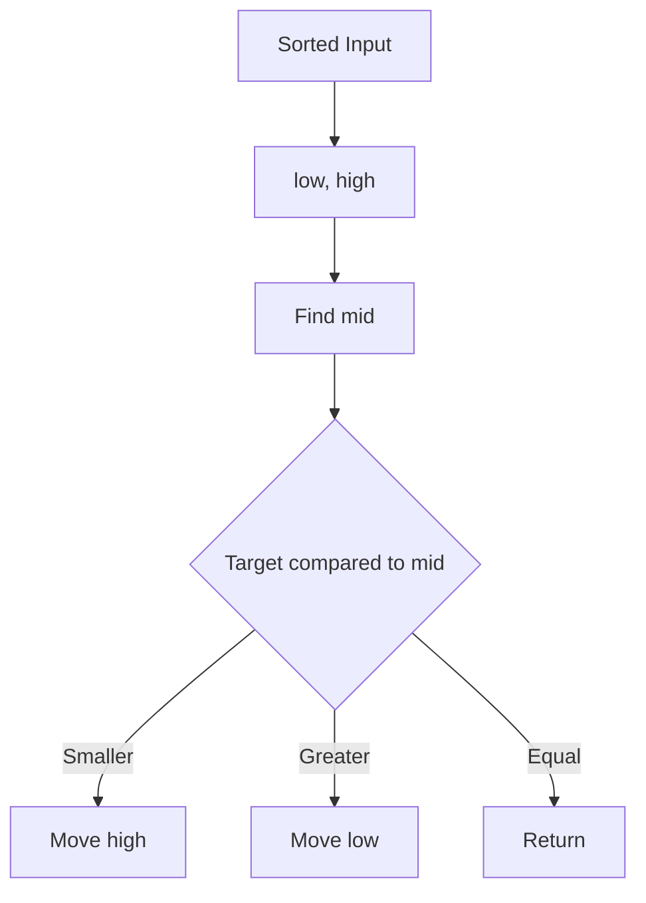

| Part                  | Explanation                                                                  |
| --------------------- | ---------------------------------------------------------------------------- |
| Flow                  | Divide search space                                                          |
| Problem               | Linear search is O(n)                                                        |
| Root Cause            | Not using sorted property                                                    |
| Fix                   | Binary search                                                                |
| Interview Explanation | “Because the input is sorted, binary search reduces complexity to O(log n).” |

---

## Scenario 4: API rate limiter using sliding window

```mermaid
flowchart TD
    A[Incoming Request] --> B[Get User/IP Key]
    B --> C[Fetch Request Timestamps]
    C --> D[Remove Old Timestamps]
    D --> E{Count within window < limit?}
    E -- Yes --> F[Allow Request]
    E -- No --> G[Reject 429]
```

| Part                  | Explanation                                                                                             |
| --------------------- | ------------------------------------------------------------------------------------------------------- |
| Flow                  | Track requests within time window                                                                       |
| Problem               | Too many requests overload API                                                                          |
| Root Cause            | No throttling                                                                                           |
| Fix                   | Sliding window / token bucket                                                                           |
| Interview Explanation | “For API rate limiting, sliding window keeps requests within a time window and rejects extra requests.” |

---

## Scenario 5: Find cycle in linked list

```mermaid
flowchart TD
    A[Start slow=head, fast=head] --> B[slow moves 1 step]
    B --> C[fast moves 2 steps]
    C --> D{slow == fast?}
    D -- Yes --> E[Cycle Exists]
    D -- No --> F{fast reaches null?}
    F -- Yes --> G[No Cycle]
    F -- No --> B
```

| Part                  | Explanation                                                                                   |
| --------------------- | --------------------------------------------------------------------------------------------- |
| Flow                  | Fast pointer catches slow pointer if cycle exists                                             |
| Problem               | Infinite traversal possible                                                                   |
| Root Cause            | Linked list may point back                                                                    |
| Fix                   | Floyd cycle detection                                                                         |
| Interview Explanation | “I used fast and slow pointer because if a cycle exists, both pointers will eventually meet.” |

---

## Scenario 6: Category hierarchy traversal

```mermaid
flowchart TD
    A[Root Category] --> B[Child Category 1]
    A --> C[Child Category 2]
    B --> D[Subcategory]
    C --> E[Subcategory]
```

| Part                  | Explanation                                                                                                         |
| --------------------- | ------------------------------------------------------------------------------------------------------------------- |
| Flow                  | Traverse category tree                                                                                              |
| Problem               | Need parent-child hierarchy                                                                                         |
| Root Cause            | Flat category list is not enough                                                                                    |
| Fix                   | DFS/BFS traversal                                                                                                   |
| Interview Explanation | “If my blog categories become hierarchical, I can model them as a tree and use DFS/BFS to fetch nested categories.” |

---

## Scenario 7: Microservice dependency traversal

```mermaid
flowchart TD
    A[API Gateway] --> B[user-service]
    A --> C[post-service]
    C --> D[category-service]
    C --> E[file-service]
```

| Part                  | Explanation                                                                            |
| --------------------- | -------------------------------------------------------------------------------------- |
| Flow                  | Services call other services                                                           |
| Problem               | Need to understand dependency chain                                                    |
| Root Cause            | Multiple service interactions                                                          |
| Fix                   | Graph model                                                                            |
| Interview Explanation | “In microservices, services can be modeled as graph nodes, and dependencies as edges.” |

---

## Scenario 8: Top K most viewed posts

```mermaid
flowchart TD
    A[Post View Counts] --> B[Min Heap of size K]
    B --> C{Heap size > K?}
    C -- Yes --> D[Remove smallest]
    C -- No --> E[Continue]
    D --> E
    E --> F[Top K Posts]
```

| Part                  | Explanation                                                                          |
| --------------------- | ------------------------------------------------------------------------------------ |
| Flow                  | Maintain only K top items                                                            |
| Problem               | Sorting all posts may be unnecessary                                                 |
| Root Cause            | Need only top K, not full order                                                      |
| Fix                   | PriorityQueue                                                                        |
| Interview Explanation | “For top K problems, I use heap to reduce complexity from O(n log n) to O(n log k).” |

---

## Scenario 9: DP problem like climbing stairs

```mermaid
flowchart TD
    A[Step n] --> B[Can come from n-1]
    A --> C[Can come from n-2]
    B --> D[ways n-1]
    C --> E[ways n-2]
    D --> F[ways n = ways n-1 + ways n-2]
    E --> F
```

| Part                  | Explanation                                                                          |
| --------------------- | ------------------------------------------------------------------------------------ |
| Flow                  | Current answer depends on previous answers                                           |
| Problem               | Recursion repeats calculations                                                       |
| Root Cause            | Overlapping subproblems                                                              |
| Fix                   | DP memoization/tabulation                                                            |
| Interview Explanation | “I used DP because the same subproblems are calculated multiple times in recursion.” |

---

# 10. Debugging / Production Issue Flow

| Issue                               | Possible Cause                      | Where To Check              | Fix                                      | Interview Explanation                                              |
| ----------------------------------- | ----------------------------------- | --------------------------- | ---------------------------------------- | ------------------------------------------------------------------ |
| Code gives TLE                      | O(n²) or worse                      | Nested loops, constraints   | Use HashMap, sorting, two pointers, heap | “I checked constraints and optimized brute force.”                 |
| Memory Limit Exceeded               | Storing too much data               | Extra arrays/maps/recursion | Reduce space, use in-place logic         | “I optimized space from O(n) to O(1) where possible.”              |
| Wrong answer in sliding window      | Not shrinking window correctly      | left/right movement         | Maintain valid condition carefully       | “Sliding window needs a clear valid/invalid condition.”            |
| Binary search infinite loop         | Wrong low/high update               | mid calculation             | Ensure low/high always move              | “Binary search bugs usually come from boundary handling.”          |
| Stack empty error                   | Popping without checking            | Stack condition             | Check `isEmpty()` first                  | “Before popping, I validate stack state.”                          |
| NullPointerException in linked list | Accessing `next` without null check | Pointer movement            | Check current/fast/fast.next             | “Pointer problems require careful null checks.”                    |
| StackOverflowError                  | Deep recursion                      | Recursive function          | Use iterative BFS/DFS                    | “For deep trees/graphs, iterative approach avoids stack overflow.” |
| Duplicate processing in graph       | Missing visited set                 | BFS/DFS traversal           | Add visited set                          | “Visited set prevents cycles and repeated processing.”             |
| Wrong DP answer                     | Bad state/transition                | DP formula                  | Redefine state clearly                   | “DP should start with state definition.”                           |
| Slow top K solution                 | Sorting all data                    | Sorting logic               | Use heap                                 | “Heap is better when only top K results are needed.”               |

---

# 11. 60–70% Most Important Interview Coverage

| Priority | Topic              | Mental Model Needed        | Code Needed | Scenario Needed                 | Interview Weight |
| -------- | ------------------ | -------------------------- | ----------- | ------------------------------- | ---------------- |
| P0       | Big-O Complexity   | Constraint → complexity    | Yes         | TLE optimization                | Very High        |
| P0       | Arrays             | Scan/index model           | Yes         | Filtering, max/min, duplicates  | Very High        |
| P0       | Strings            | Character scan             | Yes         | Palindrome, substring           | Very High        |
| P0       | HashMap/HashSet    | Fast lookup/frequency      | Yes         | Two Sum, Anagram                | Very High        |
| P0       | Two Pointers       | Left-right movement        | Yes         | Pair sum, palindrome            | Very High        |
| P0       | Sliding Window     | Expand-shrink window       | Yes         | Longest substring, rate limiter | Very High        |
| P0       | Binary Search      | Divide search space        | Yes         | Sorted search, search on answer | High             |
| P0       | Stack/Queue        | LIFO/FIFO processing       | Yes         | Parentheses, BFS                | High             |
| P0       | Linked List        | prev-current-next          | Yes         | Reverse, cycle                  | High             |
| P1       | Tree DFS/BFS       | Recursive traversal        | Yes         | Category hierarchy              | High             |
| P1       | Graph BFS/DFS      | Node-edge-visited          | Yes         | Service dependencies            | Medium-High      |
| P1       | Heap/PriorityQueue | Top K priority model       | Yes         | Top viewed posts                | Medium-High      |
| P1       | Recursion          | Base case + recursive case | Yes         | Tree recursion                  | Medium           |
| P1       | DP Basics          | State-transition           | Yes         | Climbing stairs, house robber   | Medium           |
| P2       | Backtracking       | Choose-explore-undo        | Yes         | Subsets/permutations            | Medium           |
| P2       | Greedy             | Local best choice          | Yes         | Intervals, jump game            | Medium           |
| P2       | Trie               | Prefix tree                | Later       | Search autocomplete             | Low-Medium       |
| P3       | Segment Tree       | Range query tree           | Later       | Advanced range queries          | Low              |
| P3       | Advanced Graph     | Dijkstra, Union Find       | Later       | Network/path problems           | Low-Medium       |
| P3       | Advanced DP        | LCS, knapsack variants     | Later       | Hard problems                   | Low-Medium       |

## For your immediate interview preparation

Focus this order:

```text
1. Big-O
2. Array/String
3. HashMap/HashSet
4. Two Pointers
5. Sliding Window
6. Binary Search
7. Stack/Queue
8. Linked List
9. Trees
10. Graph basics
11. Heap
12. Basic DP
```

This will cover most mid-level Java backend DSA rounds.

---

# 12. Revision Format

## Master shortcut

```text
DSA = Problem Shape → Constraints → Pattern → Data Structure → Template → Dry Run → Complexity → Edge Cases
```

---

## 5 key diagrams to memorize

### 1. Pattern decision tree

```text
Array/String?
  → Pair? Two pointers/HashMap
  → Contiguous? Sliding Window/Prefix Sum
  → Sorted? Binary Search
  → Frequency? HashMap
Tree?
  → DFS/BFS
Graph?
  → BFS/DFS + visited
Top K?
  → Heap
Repeating subproblems?
  → DP
Choices?
  → Backtracking
```

### 2. Sliding window

```text
right expands → add element → invalid? shrink left → update answer
```

### 3. Binary search

```text
low/high → mid → compare → discard half
```

### 4. DFS/BFS

```text
DFS = Go deep
BFS = Go level by level
```

### 5. DP

```text
State → Transition → Base Case → Memo/Tabulation
```

---

## 10 must-remember points

1. Always check constraints before choosing approach.
2. Brute force is okay to explain first, but optimize quickly.
3. HashMap reduces repeated lookup.
4. Sliding window works for contiguous subarray/substring.
5. Two pointers often needs sorted input or opposite-end movement.
6. Binary search needs sorted data or monotonic answer space.
7. BFS uses queue; DFS uses recursion or stack.
8. Graph traversal needs visited set.
9. DP needs repeated subproblems.
10. Always explain time and space complexity.

---

## 10 common interview lines

1. “I will first clarify input, output, and constraints.”
2. “The brute force approach would be O(n²), but we can optimize it.”
3. “Since we need fast lookup, I will use HashMap.”
4. “Since the problem asks for contiguous substring, sliding window fits here.”
5. “Since the array is sorted, binary search is better.”
6. “For top K elements, heap is more efficient than sorting everything.”
7. “For tree traversal, DFS is natural because each subtree is a smaller problem.”
8. “For graph traversal, I will maintain a visited set to avoid cycles.”
9. “This problem has overlapping subproblems, so DP can be applied.”
10. “The final complexity is O(n) time and O(n) space.”

---

## 10 common mistakes

1. Jumping to code without understanding constraints.
2. Not explaining brute force.
3. Forgetting edge cases.
4. Wrong binary search boundary.
5. Not moving sliding window left pointer correctly.
6. Using `Stack` instead of `ArrayDeque`.
7. Forgetting visited set in graph.
8. Not checking null in linked list.
9. Confusing subsequence and substring.
10. Not explaining space complexity.

---

## 5 debugging flows

```text
TLE → Check nested loops → Use map/window/sorting/binary search
Wrong binary search → Check low/high/mid update
Sliding window wrong → Define valid window condition
Graph infinite loop → Add visited set
DP wrong → Redefine state and transition
```

---

## 5 project explanation points

1. “In my Spring Boot APIs, I use collections like List, Map, and Set for response processing.”
2. “For pagination and sorting, understanding sorting and complexity helps.”
3. “For duplicate validation, HashSet/HashMap-based lookup is efficient.”
4. “For microservice dependencies, graph traversal is a useful mental model.”
5. “For API rate limiting, sliding window is a practical DSA concept.”

---

# 13. Interview Answer Templates

## Answer 1: General DSA approach

> “I usually start by understanding the input, output, and constraints. Then I think of a brute force approach and check if it fits the constraints. If not, I identify the pattern, like HashMap, sliding window, two pointers, binary search, DFS, BFS, heap, or DP. After that, I write clean Java code, dry run it with edge cases, and explain time and space complexity.”

---

## Answer 2: HashMap usage

> “As per my project experience, HashMap is useful when we need fast lookup or grouping. In interview problems like Two Sum or frequency count, HashMap avoids repeated scanning and reduces time complexity from O(n²) to O(n). In backend applications, the same idea is useful for lookup, deduplication, grouping DTOs, or caching-like behavior.”

---

## Answer 3: Sliding window

> “The flow starts from maintaining a window using left and right pointers. I expand the right pointer to include new elements. If the window becomes invalid, I shrink it from the left. This is useful for contiguous subarray or substring problems. In production systems, a similar concept is used in API rate limiting where we track requests inside a time window.”

---

## Answer 4: Binary search

> “If the input is sorted or the answer space is monotonic, I prefer binary search. It reduces the search space by half in every step, so the complexity becomes O(log n). I also take care of boundary conditions and calculate mid using `low + (high - low) / 2` to avoid overflow.”

---

## Answer 5: Stack

> “Stack is useful when the latest element needs to be processed first. For example, in valid parentheses, every opening bracket is pushed, and when a closing bracket comes, it should match the top of the stack. In Java, I prefer `ArrayDeque` over legacy `Stack`.”

---

## Answer 6: Tree traversal

> “For tree problems, I usually think recursively. A tree is naturally divided into root, left subtree, and right subtree. For DFS, recursion is clean. For level-wise traversal, I use BFS with a queue. If categories in my blog application become hierarchical, the same tree traversal model can be used.”

---

## Answer 7: Graph traversal

> “In graph problems, I represent connections using an adjacency list and maintain a visited set to avoid cycles. BFS is useful for level-wise or shortest path in unweighted graphs, while DFS is useful for deep traversal and connected components. In microservices, service dependencies can also be visualized as a graph.”

---

## Answer 8: Heap / PriorityQueue

> “When we need top K elements, sorting the full list is not always required. A heap can maintain only K elements and reduce complexity to O(n log k). In Java, I use `PriorityQueue`. For example, top viewed posts or top frequent categories can be solved using this approach.”

---

## Answer 9: DP

> “I identify DP when the problem has overlapping subproblems and optimal substructure. My first step is to define the state, then the transition, then base cases. For example, in climbing stairs, ways to reach step n depends on ways to reach n-1 and n-2.”

---

## Answer 10: Project + DSA connection

> “In my Spring Boot blog application, most DSA concepts appear through collections, filtering, sorting, pagination, duplicate checks, and lookup operations. In the planned microservices version, graph thinking helps explain service dependencies, queue thinking helps explain async processing, and sliding window helps explain rate limiting.”

---

# 14. Final Learning Strategy

## Step 1: First memorize the master diagram

Memorize this:

```text
Problem → Constraints → Pattern → Data Structure → Template → Dry Run → Complexity → Edge Cases
```

And this:

```text
Array/String → HashMap / Two Pointers / Sliding Window / Prefix Sum / Binary Search
Tree → DFS/BFS
Graph → BFS/DFS + visited
Top K → Heap
Choices → Backtracking
Repeated subproblem → DP
```

---

## Step 2: Then understand each block

Do not start with 300 LeetCode questions.

Start with patterns:

```text
1. HashMap
2. Two Pointers
3. Sliding Window
4. Prefix Sum
5. Binary Search
6. Stack/Queue
7. Linked List
8. Tree DFS/BFS
9. Graph BFS/DFS
10. Heap
11. Basic DP
12. Backtracking
```

---

## Step 3: Then write small programs

First code these 20 problems/templates:

| Pattern        | Problems to Code First                                       |
| -------------- | ------------------------------------------------------------ |
| HashMap        | Two Sum, Valid Anagram, First Unique Character               |
| Two Pointers   | Palindrome, Move Zeroes, Remove Duplicates                   |
| Sliding Window | Longest Substring Without Repeating, Max Sum Subarray Size K |
| Prefix Sum     | Subarray Sum Equals K                                        |
| Binary Search  | Binary Search, First/Last Occurrence                         |
| Stack          | Valid Parentheses, Min Stack                                 |
| Linked List    | Reverse List, Detect Cycle                                   |
| Tree           | Max Depth, Level Order Traversal, Validate BST               |
| Graph          | Number of Islands, Connected Components                      |
| Heap           | Kth Largest, Top K Frequent                                  |
| DP             | Climbing Stairs, House Robber                                |
| Backtracking   | Subsets, Permutations                                        |

---

## Step 4: Connect with project examples

For every pattern, prepare one project line.

Example:

```text
HashMap → fast lookup/deduplication
Sliding Window → rate limiting
Queue → async processing/Kafka model
Tree → category hierarchy
Graph → microservice dependencies
Heap → top K posts/categories
Sorting → pagination/sorting APIs
Complexity → slow API optimization
```

---

## Step 5: Practice scenario questions

Practice explaining:

```text
Why HashMap?
Why sliding window?
Why binary search?
Why heap instead of sorting?
Why visited set in graph?
Why DP here?
What is the time complexity?
What are edge cases?
How will this fail?
How will you optimize?
```

---

## Step 6: Revise using shortcuts

Daily quick revision:

```text
15 min: Pattern decision tree
30 min: 2 problems
15 min: Dry run + complexity explanation
10 min: Project connection lines
```

---

# What to learn first

Start with:

```text
Big-O
Array/String
HashMap
Two Pointers
Sliding Window
Binary Search
Stack/Queue
Linked List
Tree BFS/DFS
```

This is enough to start most Java backend interviews.

---

# What to code first

Code these first:

```text
Two Sum
Valid Anagram
Longest Substring Without Repeating Characters
Binary Search
Valid Parentheses
Reverse Linked List
Detect Cycle
Max Depth of Binary Tree
Level Order Traversal
Top K Frequent Elements
Climbing Stairs
```

---

# What to skip initially

Skip these in the beginning:

```text
Segment Tree
Fenwick Tree
Advanced DP
Hard graph algorithms
Trie advanced problems
Bitmask DP
Advanced math problems
Competitive programming tricks
```

---

# What is enough to start interviews

For Java Backend / Full Stack Java roles, you are interview-ready for DSA basics when you can confidently do:

```text
Array/String: easy-medium
HashMap: easy-medium
Sliding Window: medium basics
Two Pointers: easy-medium
Binary Search: easy-medium
Stack/Queue: easy-medium
Linked List: easy-medium
Tree BFS/DFS: easy-medium
Graph BFS/DFS: basic-medium
Heap: basic top K
DP: basic 1D DP
```

You do not need FAANG-level hard DSA before starting interviews for most mid-range product/service-plus-product companies.

---

# What to continue later in parallel

After interviews start, continue:

```text
Advanced DP
Backtracking medium
Graph topological sort
Dijkstra basics
Union Find
Trie
System design + DSA mixed scenarios
Java collection internals
Concurrency-related coding
```

---

# Final DSA Mental Model Summary

```text
DSA is not memorizing problems.

DSA is:

1. Recognize problem shape
2. Identify constraints
3. Select pattern
4. Choose data structure
5. Apply template
6. Dry run
7. Explain complexity
8. Handle edge cases
9. Connect to real backend usage
```

For your profile, speak like this:

> “As a Java backend developer, I approach DSA from a practical optimization perspective. I first check constraints, then choose the right data structure or pattern. In real projects, these same ideas appear in API filtering, pagination, deduplication, caching, rate limiting, queue processing, category hierarchy, and microservice dependency flows.”

# HashMap Complete Postmortem for DSA Interviews

For DSA, HashMap ka mental model simple hai:

```text
HashMap = Memory of what I have already seen
```

Interview me HashMap mostly tab use hota hai jab problem me repeated scanning avoid karna ho.

Brute force usually:

```java
for i
   for j
      compare
```

HashMap optimized version:

```java
for i
   check in map
   store/update in map
```

So HashMap ka main power hai:

```text
O(n²) ko O(n) banana
```

---

# 1. HashMap Mental Model

## One-line shortcut

```text
HashMap = Key se direct lookup → repeated search avoid → O(1) average access
```

## DSA shortcut

```text
Need fast lookup / count / grouping / previous value / complement? → Think HashMap
```

## Master mental diagram

```mermaid
flowchart TD
    A[Problem Statement] --> B{Repeated search ho raha hai?}
    B -- Yes --> C[Use HashMap]

    A --> D{Need frequency/count?}
    D -- Yes --> E[Map<Element, Count>]

    A --> F{Need pair/complement?}
    F -- Yes --> G[Map<Value, Index>]

    A --> H{Need first/last occurrence?}
    H -- Yes --> I[Map<Value, Index>]

    A --> J{Need subarray sum/count?}
    J -- Yes --> K[Map<PrefixSum, Frequency>]

    A --> L{Need group by?}
    L -- Yes --> M[Map<Key, List<Value>>]

    A --> N{Need duplicate check?}
    N -- Yes --> O[HashSet]

    C --> P[Single pass solution]
    E --> P
    G --> P
    I --> P
    K --> P
    M --> P
    O --> P

    P --> Q[Time: O(n)]
    Q --> R[Space: O(n)]
```

---

# 2. How to Identify HashMap Problems

Whenever you read a problem, look for these signals.

| Signal in Problem                     | HashMap Pattern           | Example                    |
| ------------------------------------- | ------------------------- | -------------------------- |
| “Find pair with target sum”           | Complement lookup         | Two Sum                    |
| “Count frequency”                     | Frequency map             | Valid Anagram              |
| “Find duplicates”                     | Seen set / frequency map  | Contains Duplicate         |
| “Find first non-repeating”            | Frequency + order         | First Unique Character     |
| “Group items”                         | Grouping map              | Group Anagrams             |
| “Find subarray sum equals K”          | Prefix sum + map          | Subarray Sum Equals K      |
| “Longest substring without repeating” | Character index map / set | Sliding Window + Map       |
| “Need O(1) lookup”                    | Value → index map         | Two Sum, Isomorphic String |
| “Need last seen position”             | Character → last index    | Longest substring          |
| “Need count of previous states”       | State → frequency map     | Prefix sum problems        |

---

# 3. HashMap Problem Identification Decision Tree

```mermaid
flowchart TD
    A[New DSA Problem] --> B{Do I need to remember previous elements?}

    B -- No --> C[Maybe Array/Two Pointer/Sorting]
    B -- Yes --> D{What to remember?}

    D --> E[Element exists or not]
    E --> E1[Use HashSet]

    D --> F[Element count]
    F --> F1[Use HashMap<Element, Frequency>]

    D --> G[Element index]
    G --> G1[Use HashMap<Element, Index>]

    D --> H[Prefix sum count]
    H --> H1[Use HashMap<PrefixSum, Frequency>]

    D --> I[Group by key]
    I --> I1[Use HashMap<Key, List<Value>>]

    D --> J[Latest/earliest occurrence]
    J --> J1[Use HashMap<Element, First/Last Index>]
```

---

# 4. Core HashMap Patterns for Interviews

HashMap-related problems usually fall into these patterns.

## Pattern 1: Existence / Duplicate Check

Use when:

```text
Kya ye element pehle aaya hai?
```

Data structure:

```java
Set<Integer> seen = new HashSet<>();
```

Example problems:

```text
Contains Duplicate
Intersection of Two Arrays
Happy Number
```

---

## Pattern 2: Frequency Count

Use when:

```text
Kitni baar aaya?
Character count?
Element count?
```

Data structure:

```java
Map<Character, Integer> freq = new HashMap<>();
```

Example problems:

```text
Valid Anagram
First Unique Character
Majority Element
Top K Frequent Elements
Sort Characters by Frequency
```

---

## Pattern 3: Complement Lookup

Use when:

```text
Mujhe current element ka partner chahiye
target - current
```

Data structure:

```java
Map<Integer, Integer> map = new HashMap<>();
```

Example problems:

```text
Two Sum
Pairs with given sum
4Sum II
```

---

## Pattern 4: Index Tracking

Use when:

```text
Pehle ye element kis index par aaya tha?
First occurrence?
Last occurrence?
Distance between duplicates?
```

Data structure:

```java
Map<Character, Integer> indexMap = new HashMap<>();
```

Example problems:

```text
Longest Substring Without Repeating Characters
Isomorphic Strings
Word Pattern
Contains Duplicate II
```

---

## Pattern 5: Prefix Sum + HashMap

Use when:

```text
Subarray ka sum K hai?
Count of subarrays?
Continuous range?
```

Data structure:

```java
Map<Integer, Integer> prefixCount = new HashMap<>();
```

Example problems:

```text
Subarray Sum Equals K
Continuous Subarray Sum
Longest Subarray with Sum K
```

This is very important because yahi HashMap ka slightly advanced pattern hai.

---

## Pattern 6: Grouping

Use when:

```text
Same type ke elements ko group karna hai
```

Data structure:

```java
Map<String, List<String>> groups = new HashMap<>();
```

Example problems:

```text
Group Anagrams
Group by frequency
Group employees by department
```

Backend project connection bhi strong hai.

---

# 5. Example 1: Two Sum — Complement Lookup

## Problem

Given array and target, find two indices whose values add up to target.

Example:

```text
nums = [2, 7, 11, 15], target = 9
answer = [0, 1]
```

## Brute force thinking

```text
2 + 7
2 + 11
2 + 15
7 + 11
...
```

Time complexity:

```text
O(n²)
```

## HashMap thinking

For every number:

```text
required = target - current
```

If required already exists in map, answer found.

## Flow

```mermaid
flowchart TD
    A[Start array scan] --> B[Current number]
    B --> C[required = target - current]
    C --> D{required present in map?}
    D -- Yes --> E[Return required index and current index]
    D -- No --> F[Store current number and index]
    F --> G[Move to next number]
    G --> B
```

## Java code

```java
import java.util.*;

public class TwoSumExample {

    public int[] twoSum(int[] nums, int target) {
        Map<Integer, Integer> map = new HashMap<>();

        for (int i = 0; i < nums.length; i++) {
            int required = target - nums[i];

            if (map.containsKey(required)) {
                return new int[] { map.get(required), i };
            }

            map.put(nums[i], i);
        }

        return new int[] { -1, -1 };
    }
}
```

## Dry run

```text
nums = [2, 7, 11, 15], target = 9

i=0, current=2
required=7
map does not contain 7
store 2 → 0

i=1, current=7
required=2
map contains 2
return [0, 1]
```

## Interview explanation

> “The brute force approach checks every pair and takes O(n²). I optimized it using HashMap. For each element, I calculate the required complement and check if it already exists. This gives O(n) time and O(n) space.”

---

# 6. Example 2: Valid Anagram — Frequency Map

## Problem

Check whether two strings are anagrams.

Example:

```text
s = "listen"
t = "silent"
answer = true
```

## HashMap thinking

Anagram means:

```text
Same characters
Same frequency
Different order allowed
```

## Flow

```mermaid
flowchart TD
    A[Read first string] --> B[Count each character]
    B --> C[Read second string]
    C --> D[Decrease each character count]
    D --> E{Any count mismatch?}
    E -- Yes --> F[Not anagram]
    E -- No --> G[Anagram]
```

## Java code using HashMap

```java
import java.util.*;

public class ValidAnagram {

    public boolean isAnagram(String s, String t) {
        if (s.length() != t.length()) {
            return false;
        }

        Map<Character, Integer> freq = new HashMap<>();

        for (char ch : s.toCharArray()) {
            freq.put(ch, freq.getOrDefault(ch, 0) + 1);
        }

        for (char ch : t.toCharArray()) {
            if (!freq.containsKey(ch)) {
                return false;
            }

            freq.put(ch, freq.get(ch) - 1);

            if (freq.get(ch) == 0) {
                freq.remove(ch);
            }
        }

        return freq.isEmpty();
    }
}
```

## Interview explanation

> “Anagram is a frequency-count problem. I count characters from the first string and reduce counts using the second string. If the map becomes empty, both strings have the same character frequency.”

## Complexity

```text
Time: O(n)
Space: O(k), where k = number of unique characters
```

For lowercase English letters only, you can also use array:

```java
int[] freq = new int[26];
```

Interview line:

> “If the character set is fixed like lowercase English letters, array is better. If the character set is dynamic or Unicode, HashMap is more flexible.”

---

# 7. Example 3: Subarray Sum Equals K — Prefix Sum + HashMap

This is the most important advanced HashMap pattern.

## Problem

Find number of subarrays whose sum equals `k`.

Example:

```text
nums = [1, 1, 1], k = 2
answer = 2

Subarrays:
[1,1] at index 0-1
[1,1] at index 1-2
```

## Why normal sliding window may fail?

Sliding window works well mostly when all numbers are positive.

But if array contains negative numbers:

```text
[1, -1, 1, 2, -2]
```

Window sum can increase/decrease unpredictably.

So use prefix sum.

## Core formula

```text
currentPrefix - oldPrefix = k

So,

oldPrefix = currentPrefix - k
```

Meaning:

> Agar pehle kabhi `currentPrefix - k` mila hai, then beech ka subarray sum `k` hoga.

## Flow

```mermaid
flowchart TD
    A[Start prefixSum = 0] --> B[Map stores prefixSum frequency]
    B --> C[Initialize map with 0 → 1]
    C --> D[Iterate array]
    D --> E[prefixSum += current number]
    E --> F[need = prefixSum - k]
    F --> G{need exists in map?}
    G -- Yes --> H[Add its frequency to count]
    G -- No --> I[No subarray ending here]
    H --> J[Store/update current prefixSum]
    I --> J
    J --> K[Move next]
```

## Java code

```java
import java.util.*;

public class SubarraySumEqualsK {

    public int subarraySum(int[] nums, int k) {
        Map<Integer, Integer> prefixCount = new HashMap<>();

        prefixCount.put(0, 1);

        int prefixSum = 0;
        int count = 0;

        for (int num : nums) {
            prefixSum += num;

            int required = prefixSum - k;

            if (prefixCount.containsKey(required)) {
                count += prefixCount.get(required);
            }

            prefixCount.put(prefixSum, prefixCount.getOrDefault(prefixSum, 0) + 1);
        }

        return count;
    }
}
```

## Dry run

```text
nums = [1, 1, 1], k = 2

prefixCount = {0=1}

num=1
prefixSum=1
required = -1
not found
store 1 → 1

num=1
prefixSum=2
required = 0
found 0 once
count = 1
store 2 → 1

num=1
prefixSum=3
required = 1
found 1 once
count = 2
store 3 → 1

answer = 2
```

## Interview explanation

> “This is a prefix sum plus HashMap problem. For each index, I calculate the running sum. If `prefixSum - k` was seen earlier, it means the subarray between that earlier prefix and current index has sum k. The map stores frequency of prefix sums because the same prefix sum can occur multiple times.”

## Complexity

```text
Time: O(n)
Space: O(n)
```

---

# 8. HashMap Pattern Templates

## Template 1: Frequency Map

```java
Map<Integer, Integer> freq = new HashMap<>();

for (int num : nums) {
    freq.put(num, freq.getOrDefault(num, 0) + 1);
}
```

Use for:

```text
Count frequency
Find duplicates
Find majority
Top K frequent
Anagram
```

---

## Template 2: Complement Lookup

```java
Map<Integer, Integer> map = new HashMap<>();

for (int i = 0; i < nums.length; i++) {
    int required = target - nums[i];

    if (map.containsKey(required)) {
        // answer found
    }

    map.put(nums[i], i);
}
```

Use for:

```text
Two Sum
Pair with target
Difference equals K
```

---

## Template 3: First/Last Index Map

```java
Map<Character, Integer> indexMap = new HashMap<>();

for (int i = 0; i < s.length(); i++) {
    char ch = s.charAt(i);

    if (indexMap.containsKey(ch)) {
        // seen before
    }

    indexMap.put(ch, i);
}
```

Use for:

```text
Longest substring
First repeating
Distance between duplicates
Isomorphic strings
```

---

## Template 4: Prefix Sum Map

```java
Map<Integer, Integer> prefixCount = new HashMap<>();
prefixCount.put(0, 1);

int prefixSum = 0;
int count = 0;

for (int num : nums) {
    prefixSum += num;

    if (prefixCount.containsKey(prefixSum - k)) {
        count += prefixCount.get(prefixSum - k);
    }

    prefixCount.put(prefixSum, prefixCount.getOrDefault(prefixSum, 0) + 1);
}
```

Use for:

```text
Subarray sum equals K
Count subarrays
Longest subarray with sum K
```

---

## Template 5: Grouping Map

```java
Map<String, List<String>> map = new HashMap<>();

for (String word : words) {
    String key = getKey(word);

    map.computeIfAbsent(key, x -> new ArrayList<>()).add(word);
}
```

Use for:

```text
Group anagrams
Group by department
Group by category
```

---

# 9. Important HashMap Problems to Finish

For your interviews, do this order.

## P0 — Must complete first

| Pattern              | Problem                                        | Why Important                   |
| -------------------- | ---------------------------------------------- | ------------------------------- |
| Existence            | Contains Duplicate                             | Basic Set usage                 |
| Complement           | Two Sum                                        | Most common HashMap problem     |
| Frequency            | Valid Anagram                                  | Character count                 |
| Frequency            | First Unique Character                         | Frequency + order               |
| Frequency            | Majority Element                               | Count-based thinking            |
| Index Map            | Contains Duplicate II                          | Last seen index                 |
| Sliding Window + Set | Longest Substring Without Repeating Characters | Very common medium              |
| Prefix Sum           | Subarray Sum Equals K                          | Most important advanced HashMap |
| Grouping             | Group Anagrams                                 | Backend-style grouping          |
| Frequency + Heap     | Top K Frequent Elements                        | Map + PriorityQueue combo       |

---

## P1 — Very important after P0

| Pattern    | Problem                       | Why Important           |
| ---------- | ----------------------------- | ----------------------- |
| Index Map  | Isomorphic Strings            | Character mapping       |
| Index Map  | Word Pattern                  | Mapping consistency     |
| Frequency  | Intersection of Two Arrays II | Count reduce pattern    |
| Prefix Sum | Longest Subarray with Sum K   | Prefix + index map      |
| Prefix Sum | Contiguous Array              | Convert 0 to -1 pattern |
| Grouping   | Find Duplicate File in System | Group by content        |
| Frequency  | Sort Characters by Frequency  | Map + sorting/heap      |
| Frequency  | Ransom Note                   | Count availability      |
| State Map  | Happy Number                  | Detect cycle using set  |

---

## P2 — Later

| Pattern            | Problem                      | Why Later               |
| ------------------ | ---------------------------- | ----------------------- |
| Advanced Prefix    | Continuous Subarray Sum      | Modulo + map            |
| Advanced Count     | 4Sum II                      | Multi-map counting      |
| Sliding Window Map | Minimum Window Substring     | Harder window           |
| LRU Cache          | HashMap + Doubly Linked List | Design-level problem    |
| RandomizedSet      | HashMap + ArrayList          | System-design style DSA |

---

# 10. HashMap Internal Working for Java Interviews

Since you are Java backend candidate, HashMap internals are also important.

## Basic internal model

```mermaid
flowchart TD
    A[put key,value] --> B[Calculate hashCode]
    B --> C[Apply hash function]
    C --> D[Find bucket index]
    D --> E{Bucket empty?}
    E -- Yes --> F[Store node]
    E -- No --> G[Check key using equals]
    G --> H{Same key?}
    H -- Yes --> I[Replace value]
    H -- No --> J[Collision handling]
    J --> K[LinkedList or TreeNode]
```

## Important terms

| Term        | Meaning                                          |
| ----------- | ------------------------------------------------ |
| Key         | Used for lookup                                  |
| Value       | Data stored against key                          |
| hashCode    | Integer hash generated from key                  |
| Bucket      | Internal array location                          |
| Collision   | Two keys go to same bucket                       |
| equals      | Used to check actual key equality                |
| Load Factor | Resize threshold                                 |
| Rehashing   | Creating bigger table and redistributing entries |

---

## HashMap complexity

| Operation   | Average Case | Worst Case                           |
| ----------- | ------------ | ------------------------------------ |
| put         | O(1)         | O(log n) in Java 8+ treeified bucket |
| get         | O(1)         | O(log n) in Java 8+                  |
| remove      | O(1)         | O(log n)                             |
| containsKey | O(1)         | O(log n)                             |

Simple interview line:

> “HashMap gives O(1) average time because it uses hashing to locate the bucket directly. In case of collisions, Java 8 can convert long bucket chains into balanced trees, improving worst-case lookup.”

---

## Important Java HashMap points

```text
Default capacity = 16
Default load factor = 0.75
Resize happens when size exceeds capacity * load factor
Allows one null key
Allows multiple null values
Not synchronized
Does not maintain insertion order
```

For order:

```text
LinkedHashMap maintains insertion/access order
TreeMap maintains sorted order
ConcurrentHashMap is thread-safe
```

---

# 11. Common Interview Questions on HashMap

## Q1. Why is HashMap lookup O(1)?

Answer:

> “HashMap calculates hashCode of the key, converts it into bucket index, and directly checks that bucket. That is why average lookup is O(1).”

---

## Q2. What happens when two keys have same hash?

Answer:

> “That is called collision. HashMap stores multiple entries in the same bucket. It checks actual key equality using equals method. In Java 8, if collision chain becomes large, bucket can be converted into a tree structure.”

---

## Q3. Difference between `hashCode()` and `equals()`?

Answer:

> “hashCode decides bucket location. equals checks actual logical equality of keys. If two objects are equal, their hashCode must be same.”

---

## Q4. Can mutable objects be HashMap keys?

Answer:

> “Technically yes, but it is dangerous. If the fields used in hashCode or equals change after insertion, the key may not be found again.”

Example:

```text
User object as key
user.id changes after put
hashCode changes
get(user) may fail
```

---

## Q5. Difference between HashMap and HashSet?

Answer:

> “HashSet internally uses HashMap. HashSet stores only keys, while HashMap stores key-value pairs.”

---

## Q6. Difference between HashMap and ConcurrentHashMap?

Answer:

> “HashMap is not thread-safe. ConcurrentHashMap is designed for concurrent access and is used in multithreaded scenarios.”

---

# 12. Project Usage Mapping

| HashMap Concept    | How You Can Explain in Your Project               | Interview Line                                                                       |
| ------------------ | ------------------------------------------------- | ------------------------------------------------------------------------------------ |
| Fast lookup        | Lookup DTO/user/category by ID                    | “For in-memory lookup, Map avoids repeated list scanning.”                           |
| Frequency count    | Count posts by category/status                    | “Frequency map can be used to count grouped data efficiently.”                       |
| Grouping           | Group posts by category                           | “This is similar to SQL group by, but in Java collection processing.”                |
| Deduplication      | Avoid duplicate category/tag/user email in memory | “HashSet helps check duplicates in O(1) average time.”                               |
| Cache-like lookup  | Store token/user details temporarily              | “HashMap gives cache-like access, though production cache would use Redis/Caffeine.” |
| Sliding window map | API rate limiter                                  | “For rate limiting, we can maintain user/IP request timestamps or count per window.” |
| Prefix idea        | Running aggregates                                | “Prefix sum is useful when repeated range calculation needs optimization.”           |
| ConcurrentHashMap  | Shared data in multithreaded service              | “In concurrent code, I would use ConcurrentHashMap instead of HashMap.”              |

---

# 13. How to Speak About HashMap in Interviews

## General answer

> “HashMap is useful when I need fast lookup, frequency counting, grouping, or remembering previous values. In DSA, it usually helps optimize nested-loop brute force solutions to single-pass O(n) solutions.”

## For Two Sum

> “I used HashMap to store visited numbers and their indices. For every current element, I check whether target minus current already exists.”

## For frequency problems

> “This is a count-based problem, so I maintain a frequency map. After counting, I use the frequency information to validate duplicates, anagrams, or unique elements.”

## For prefix sum

> “In subarray sum problems, I store previous prefix sums in a HashMap. If current prefix minus k exists, then a valid subarray exists.”

## For project

> “In backend applications, HashMap thinking appears in grouping responses, deduplication, DTO lookup, caching-like operations, and reducing repeated processing.”

---

# 14. Common Mistakes in HashMap Problems

| Mistake                                   | Example                   | Fix                                   |
| ----------------------------------------- | ------------------------- | ------------------------------------- |
| Using `get()` directly without null check | `map.get(key) + 1`        | Use `getOrDefault()`                  |
| Updating map before checking complement   | Two Sum with same element | Check first, then put                 |
| Forgetting initial prefix `0 → 1`         | Subarray sum              | Always initialize                     |
| Confusing key and value                   | Map value to index        | Clearly define map meaning            |
| Not handling duplicates                   | Frequency problems        | Store count, not just existence       |
| Using HashMap where HashSet enough        | Contains Duplicate        | Use Set                               |
| Forgetting space complexity               | O(n) extra map            | Mention it                            |
| Assuming order in HashMap                 | First unique char         | Use string order or LinkedHashMap     |
| Mutable key usage                         | Custom object key         | Use immutable key fields              |
| Wrong equality logic                      | Custom class              | Override equals and hashCode properly |

---

# 15. HashMap Debugging Flow

```mermaid
flowchart TD
    A[HashMap solution wrong] --> B{What is map storing?}
    B --> C[Key?]
    B --> D[Value?]

    C --> E{Is key correct?}
    E -- No --> F[Redefine map meaning]

    D --> G{Is value count/index/list?}
    G -- Wrong --> H[Fix value type]

    A --> I{Duplicate issue?}
    I -- Yes --> J[Use frequency instead of boolean]

    A --> K{Prefix sum issue?}
    K -- Yes --> L[Check 0 to 1 initialization]

    A --> M{Two Sum issue?}
    M -- Yes --> N[Check before put]

    A --> O{Order issue?}
    O -- Yes --> P[Use input order or LinkedHashMap]
```

---

# 16. The 5 HashMap Patterns You Must Master

For interview preparation, finish these 5 patterns properly.

## Pattern A: Set for duplicate

```java
Set<Integer> seen = new HashSet<>();

for (int num : nums) {
    if (seen.contains(num)) {
        return true;
    }
    seen.add(num);
}
return false;
```

Use in:

```text
Contains Duplicate
Happy Number
Detect repeated state
```

---

## Pattern B: Frequency Map

```java
Map<Character, Integer> freq = new HashMap<>();

for (char ch : s.toCharArray()) {
    freq.put(ch, freq.getOrDefault(ch, 0) + 1);
}
```

Use in:

```text
Anagram
First unique
Ransom note
Majority count
```

---

## Pattern C: Complement Map

```java
Map<Integer, Integer> map = new HashMap<>();

for (int i = 0; i < nums.length; i++) {
    int need = target - nums[i];

    if (map.containsKey(need)) {
        return true;
    }

    map.put(nums[i], i);
}
```

Use in:

```text
Two Sum
Pair exists
Difference pair
```

---

## Pattern D: Index Map

```java
Map<Character, Integer> lastSeen = new HashMap<>();

for (int right = 0; right < s.length(); right++) {
    char ch = s.charAt(right);

    if (lastSeen.containsKey(ch)) {
        // use lastSeen.get(ch)
    }

    lastSeen.put(ch, right);
}
```

Use in:

```text
Longest substring without repeat
Contains nearby duplicate
Isomorphic string
```

---

## Pattern E: Prefix Sum Map

```java
Map<Integer, Integer> prefixMap = new HashMap<>();
prefixMap.put(0, 1);

int sum = 0;

for (int num : nums) {
    sum += num;

    // check sum - k

    prefixMap.put(sum, prefixMap.getOrDefault(sum, 0) + 1);
}
```

Use in:

```text
Subarray Sum Equals K
Longest Subarray Sum K
Contiguous Array
```

---

# 17. Your HashMap Study Plan

## Day 1: Basic HashMap + Set

Code:

```text
Contains Duplicate
Two Sum
Valid Anagram
First Unique Character
```

Goal:

```text
Existence, frequency, complement
```

---

## Day 2: Index Map + Sliding Window

Code:

```text
Contains Duplicate II
Longest Substring Without Repeating Characters
Isomorphic Strings
Word Pattern
```

Goal:

```text
Index tracking and last seen logic
```

---

## Day 3: Prefix Sum + HashMap

Code:

```text
Subarray Sum Equals K
Longest Subarray with Sum K
Contiguous Array
```

Goal:

```text
Understand prefix sum deeply
```

---

## Day 4: Grouping + Map Combination

Code:

```text
Group Anagrams
Top K Frequent Elements
Intersection of Two Arrays II
```

Goal:

```text
Map + List
Map + Heap
Map + Count Reduce
```

---

# 18. Minimum HashMap Problem Set Before Interviews

Agar time kam hai, bas ye 10 finish karo:

```text
1. Contains Duplicate
2. Two Sum
3. Valid Anagram
4. First Unique Character in a String
5. Contains Duplicate II
6. Longest Substring Without Repeating Characters
7. Subarray Sum Equals K
8. Group Anagrams
9. Top K Frequent Elements
10. Isomorphic Strings
```

Ye 10 karne ke baad HashMap ka 60–70% interview coverage ho jayega.

---

# 19. Final HashMap Mental Shortcut

```text
HashMap = Store what I have seen so far
```

More detailed:

```text
Pair problem?       → Store value/index
Frequency problem?  → Store value/count
Subarray problem?   → Store prefixSum/count
Grouping problem?   → Store key/list
Duplicate problem?  → Store seen values
Index problem?      → Store value/lastIndex
```

Interview-ready line:

> “Whenever I see a problem where I need to repeatedly search previous elements, count frequency, find complement, track index, or group data, I immediately think about HashMap because it can reduce repeated scanning and often converts O(n²) brute force into O(n) solution.”

This is the core postmortem of HashMap for DSA interviews.

Below is your **HashMap problem-solving sheet**. For every problem, focus on this first:

```text
1. What do I need to remember?
2. What should be the key?
3. What should be the value?
4. Do I need existence, count, index, prefix sum, or grouping?
```

---

# Master HashMap Pattern Map

```text
Set for Duplicate      → remember seen values
Frequency Map          → remember value count
Complement Map         → remember value/index for target-current
Index Map              → remember first/last index
Prefix Sum Map         → remember previous running sums
Grouping Map           → remember key → list of values
```

---

# A. Set for Duplicate Pattern

## Pattern mental model

```text
Set = Have I seen this before?
```

Use when problem says:

```text
duplicate
repeated
cycle
visited
seen before
same state again
```

---

## 1. Contains Duplicate

### Identify pattern

Problem asks:

```text
Does any number appear more than once?
```

So we only need existence, not count.

Use:

```java
Set<Integer> seen
```

### Java solution

```java
import java.util.*;

public class ContainsDuplicate {

    public boolean containsDuplicate(int[] nums) {
        Set<Integer> seen = new HashSet<>();

        for (int num : nums) {
            if (seen.contains(num)) {
                return true;
            }

            seen.add(num);
        }

        return false;
    }
}
```

### Pattern usage

```text
num already in set? duplicate found
otherwise store num
```

### Complexity

```text
Time: O(n)
Space: O(n)
```

### Interview line

> “Since I only need to know whether an element appeared before, I used HashSet. It gives average O(1) lookup and avoids nested loop comparison.”

---

## 2. Happy Number

### Problem idea

A number is happy if repeatedly replacing it by the sum of squares of digits eventually becomes `1`.

Example:

```text
19 → 82 → 68 → 100 → 1
```

If a number enters a loop, it is not happy.

### Identify pattern

Repeated state/cycle detection.

Use:

```java
Set<Integer> seen
```

### Java solution

```java
import java.util.*;

public class HappyNumber {

    public boolean isHappy(int n) {
        Set<Integer> seen = new HashSet<>();

        while (n != 1) {
            if (seen.contains(n)) {
                return false;
            }

            seen.add(n);
            n = getSquareSum(n);
        }

        return true;
    }

    private int getSquareSum(int n) {
        int sum = 0;

        while (n > 0) {
            int digit = n % 10;
            sum += digit * digit;
            n = n / 10;
        }

        return sum;
    }
}
```

### Pattern usage

```text
Current number becomes a state.
If same state appears again, cycle exists.
```

### Interview line

> “This is a repeated-state problem. If the number becomes 1, it is happy. If any previous number appears again, it means we entered a cycle, so I return false.”

---

## 3. Detect Repeated State

This is a generic pattern used in problems like:

```text
Happy Number
Robot movement cycle
Game state repetition
Visited grid position
Repeated transformation
```

### Generic mental model

```text
state generated → already seen? cycle/repetition
```

### Java template

```java
import java.util.*;

public class RepeatedStateDetector {

    public boolean hasRepeatedState(String[] states) {
        Set<String> seen = new HashSet<>();

        for (String state : states) {
            if (seen.contains(state)) {
                return true;
            }

            seen.add(state);
        }

        return false;
    }
}
```

### Example

```text
states = ["A", "B", "C", "B"]
B appears again → repeated state
```

### Interview line

> “Whenever the same state can be generated again, I store visited states in a HashSet. If I see the same state again, there is repetition or cycle.”

---

# B. Frequency Map Pattern

## Pattern mental model

```text
Frequency Map = How many times did this value appear?
```

Use when problem says:

```text
count
frequency
anagram
majority
duplicate count
top frequent
available characters
```

---

## 1. Valid Anagram

### Identify pattern

Anagram means:

```text
same characters + same frequency
```

Use:

```java
Map<Character, Integer>
```

### Java solution

```java
import java.util.*;

public class ValidAnagram {

    public boolean isAnagram(String s, String t) {
        if (s.length() != t.length()) {
            return false;
        }

        Map<Character, Integer> freq = new HashMap<>();

        for (char ch : s.toCharArray()) {
            freq.put(ch, freq.getOrDefault(ch, 0) + 1);
        }

        for (char ch : t.toCharArray()) {
            if (!freq.containsKey(ch)) {
                return false;
            }

            freq.put(ch, freq.get(ch) - 1);

            if (freq.get(ch) == 0) {
                freq.remove(ch);
            }
        }

        return freq.isEmpty();
    }
}
```

### Pattern usage

```text
First string → increase count
Second string → decrease count
Final map empty → valid anagram
```

### Interview line

> “Anagram is a frequency comparison problem, so I count characters from one string and reduce using the second string.”

---

## 2. First Unique Character

### Identify pattern

Need character whose frequency is exactly `1`.

Use:

```java
Map<Character, Integer>
```

### Java solution

```java
import java.util.*;

public class FirstUniqueCharacter {

    public int firstUniqChar(String s) {
        Map<Character, Integer> freq = new HashMap<>();

        for (char ch : s.toCharArray()) {
            freq.put(ch, freq.getOrDefault(ch, 0) + 1);
        }

        for (int i = 0; i < s.length(); i++) {
            if (freq.get(s.charAt(i)) == 1) {
                return i;
            }
        }

        return -1;
    }
}
```

### Pattern usage

```text
First pass  → count frequency
Second pass → find first character with count 1
```

### Interview line

> “I used two passes. First to count frequency, second to preserve original order and find the first unique character.”

---

## 3. First Duplicate Character

### Identify pattern

Need first character that appears again while scanning.

Use:

```java
Set<Character>
```

Because count is not needed; only seen/not seen.

### Java solution

```java
import java.util.*;

public class FirstDuplicateCharacter {

    public Character firstDuplicate(String s) {
        Set<Character> seen = new HashSet<>();

        for (char ch : s.toCharArray()) {
            if (seen.contains(ch)) {
                return ch;
            }

            seen.add(ch);
        }

        return null;
    }
}
```

### Example

```text
s = "abcbd"
first duplicate during scan = b
```

### Interview line

> “For first duplicate, I only need to know if a character has already appeared, so HashSet is enough.”

---

## 4. Majority Element Using Frequency Map

### Problem

Find element appearing more than `n / 2` times.

### Java solution

```java
import java.util.*;

public class MajorityElementUsingMap {

    public int majorityElement(int[] nums) {
        Map<Integer, Integer> freq = new HashMap<>();
        int majorityLimit = nums.length / 2;

        for (int num : nums) {
            int count = freq.getOrDefault(num, 0) + 1;

            if (count > majorityLimit) {
                return num;
            }

            freq.put(num, count);
        }

        return -1;
    }
}
```

### Pattern usage

```text
Count each number.
When count > n/2, return it.
```

### Interview line

> “I used frequency map to count occurrences. Once any element count becomes more than n/2, it is the majority element.”

### Senior note

For optimized space, Boyer-Moore voting gives O(1) space. But HashMap is easier and valid.

---

## 5. Ransom Note

### Problem

Can we construct ransom note using magazine characters?

Example:

```text
ransomNote = "aa"
magazine = "aab"
true
```

### Identify pattern

Need available character count.

Use:

```java
Map<Character, Integer>
```

### Java solution

```java
import java.util.*;

public class RansomNote {

    public boolean canConstruct(String ransomNote, String magazine) {
        Map<Character, Integer> freq = new HashMap<>();

        for (char ch : magazine.toCharArray()) {
            freq.put(ch, freq.getOrDefault(ch, 0) + 1);
        }

        for (char ch : ransomNote.toCharArray()) {
            if (!freq.containsKey(ch) || freq.get(ch) == 0) {
                return false;
            }

            freq.put(ch, freq.get(ch) - 1);
        }

        return true;
    }
}
```

### Pattern usage

```text
Magazine provides characters.
Ransom note consumes characters.
If any needed character is unavailable, return false.
```

### Interview line

> “This is an availability-count problem. I count magazine characters and consume them while reading ransom note.”

---

## 6. Count Frequency

### Problem

Count how many times each element appears.

### Java solution for integer array

```java
import java.util.*;

public class CountFrequency {

    public Map<Integer, Integer> countFrequency(int[] nums) {
        Map<Integer, Integer> freq = new HashMap<>();

        for (int num : nums) {
            freq.put(num, freq.getOrDefault(num, 0) + 1);
        }

        return freq;
    }
}
```

### Java solution for string

```java
import java.util.*;

public class CharacterFrequency {

    public Map<Character, Integer> countCharacters(String s) {
        Map<Character, Integer> freq = new HashMap<>();

        for (char ch : s.toCharArray()) {
            freq.put(ch, freq.getOrDefault(ch, 0) + 1);
        }

        return freq;
    }
}
```

### Interview line

> “Frequency map is the base template for anagram, duplicate count, top K frequent, majority, and availability problems.”

---

## 7. Top K Frequent Elements

### Identify pattern

Need frequency first, then top K.

Use:

```text
HashMap + PriorityQueue
```

Map stores:

```java
number → frequency
```

Heap stores top K by frequency.

### Java solution

```java
import java.util.*;

public class TopKFrequentElements {

    public int[] topKFrequent(int[] nums, int k) {
        Map<Integer, Integer> freq = new HashMap<>();

        for (int num : nums) {
            freq.put(num, freq.getOrDefault(num, 0) + 1);
        }

        PriorityQueue<Integer> minHeap = new PriorityQueue<>(
            (a, b) -> freq.get(a) - freq.get(b)
        );

        for (int num : freq.keySet()) {
            minHeap.offer(num);

            if (minHeap.size() > k) {
                minHeap.poll();
            }
        }

        int[] result = new int[k];

        for (int i = k - 1; i >= 0; i--) {
            result[i] = minHeap.poll();
        }

        return result;
    }
}
```

### Pattern usage

```text
Step 1: Count frequency using HashMap
Step 2: Maintain top K using min heap
```

### Complexity

```text
Time: O(n log k)
Space: O(n)
```

### Interview line

> “I first count frequency using HashMap. Then I use a min heap of size K so that I do not need to sort all elements.”

---

# C. Complement Map Pattern

## Pattern mental model

```text
Complement Map = current ko complete karne wala value kya hai?
```

Use when problem says:

```text
pair sum
target sum
two numbers
difference equals k
```

---

## 1. Two Sum

### Identify pattern

Need two numbers:

```text
a + b = target
```

For current number:

```text
required = target - current
```

### Java solution

```java
import java.util.*;

public class TwoSum {

    public int[] twoSum(int[] nums, int target) {
        Map<Integer, Integer> map = new HashMap<>();

        for (int i = 0; i < nums.length; i++) {
            int required = target - nums[i];

            if (map.containsKey(required)) {
                return new int[] { map.get(required), i };
            }

            map.put(nums[i], i);
        }

        return new int[] { -1, -1 };
    }
}
```

### Important mistake

Do not put first and check later.

Correct:

```text
check required first → then put current
```

Otherwise same element can be reused incorrectly.

### Interview line

> “For each number, I check whether its complement already exists in the map. This converts O(n²) pair checking into O(n).”

---

## 2. Pair Exists / Pair With Target

### Problem

Return true if any pair exists with given target sum.

### Java solution

```java
import java.util.*;

public class PairWithTarget {

    public boolean pairExists(int[] nums, int target) {
        Set<Integer> seen = new HashSet<>();

        for (int num : nums) {
            int required = target - num;

            if (seen.contains(required)) {
                return true;
            }

            seen.add(num);
        }

        return false;
    }
}
```

### Pattern usage

```text
No need index.
So HashSet is enough.
```

### Interview line

> “Since I only need existence of pair and not indices, I used HashSet instead of HashMap.”

---

## 3. Difference Pairs / Difference Equals K

### Problem

Count unique pairs where:

```text
abs(a - b) = k
```

Example:

```text
nums = [3,1,4,1,5], k = 2
pairs = (1,3), (3,5)
answer = 2
```

### Identify pattern

Need frequency because duplicate handling matters.

Use:

```java
Map<Integer, Integer> freq
```

### Java solution

```java
import java.util.*;

public class DifferenceEqualsK {

    public int findPairs(int[] nums, int k) {
        if (k < 0) {
            return 0;
        }

        Map<Integer, Integer> freq = new HashMap<>();

        for (int num : nums) {
            freq.put(num, freq.getOrDefault(num, 0) + 1);
        }

        int count = 0;

        for (int num : freq.keySet()) {
            if (k == 0) {
                if (freq.get(num) > 1) {
                    count++;
                }
            } else {
                if (freq.containsKey(num + k)) {
                    count++;
                }
            }
        }

        return count;
    }
}
```

### Pattern usage

```text
k > 0 → check num + k exists
k = 0 → same number must appear at least twice
```

### Interview line

> “For difference pairs, I used frequency map because duplicate handling is important. For k=0, the same number must occur more than once.”

---

# D. Index Map Pattern

## Pattern mental model

```text
Index Map = Ye value pehle kis index par aayi thi?
```

Use when problem says:

```text
distance
last seen
first index
nearby duplicate
longest substring
mapping consistency
```

---

## 1. Longest Substring Without Repeating Characters

### Identify pattern

Need longest substring with no repeated characters.

Use:

```java
Map<Character, Integer> lastSeen
```

Map stores:

```text
character → last index
```

### Java solution

```java
import java.util.*;

public class LongestSubstringWithoutRepeat {

    public int lengthOfLongestSubstring(String s) {
        Map<Character, Integer> lastSeen = new HashMap<>();

        int left = 0;
        int maxLength = 0;

        for (int right = 0; right < s.length(); right++) {
            char ch = s.charAt(right);

            if (lastSeen.containsKey(ch) && lastSeen.get(ch) >= left) {
                left = lastSeen.get(ch) + 1;
            }

            lastSeen.put(ch, right);

            maxLength = Math.max(maxLength, right - left + 1);
        }

        return maxLength;
    }
}
```

### Pattern usage

```text
right expands window
duplicate found inside current window
move left after previous duplicate index
```

### Important condition

```java
lastSeen.get(ch) >= left
```

Why?

Because old duplicate may be outside current window.

### Interview line

> “This is sliding window plus index map. The map stores last seen index of each character. When duplicate appears inside the current window, I move left pointer.”

---

## 2. Contains Nearby Duplicate / Difference Between Duplicates

### Problem

Return true if same value appears within distance `k`.

Example:

```text
nums = [1,2,3,1], k = 3
true because 1 appears at index 0 and 3
```

### Identify pattern

Need previous index of same number.

Use:

```java
Map<Integer, Integer> lastIndex
```

### Java solution

```java
import java.util.*;

public class ContainsNearbyDuplicate {

    public boolean containsNearbyDuplicate(int[] nums, int k) {
        Map<Integer, Integer> lastIndex = new HashMap<>();

        for (int i = 0; i < nums.length; i++) {
            int num = nums[i];

            if (lastIndex.containsKey(num)) {
                int previousIndex = lastIndex.get(num);

                if (i - previousIndex <= k) {
                    return true;
                }
            }

            lastIndex.put(num, i);
        }

        return false;
    }
}
```

### Pattern usage

```text
number → last index
current index - previous index <= k
```

### Interview line

> “I used HashMap to track last index of each number. Whenever the number repeats, I check the distance.”

---

## 3. Isomorphic String

### Problem

Two strings are isomorphic if characters in one string can be consistently mapped to characters in the other.

Example:

```text
egg → add
e → a
g → d
true
```

Example false:

```text
foo → bar
o cannot map to both a and r
```

### Identify pattern

Need consistent mapping both ways.

Use:

```text
Map<Character, Character> sToT
Map<Character, Character> tToS
```

### Java solution

```java
import java.util.*;

public class IsomorphicStrings {

    public boolean isIsomorphic(String s, String t) {
        if (s.length() != t.length()) {
            return false;
        }

        Map<Character, Character> sToT = new HashMap<>();
        Map<Character, Character> tToS = new HashMap<>();

        for (int i = 0; i < s.length(); i++) {
            char ch1 = s.charAt(i);
            char ch2 = t.charAt(i);

            if (sToT.containsKey(ch1) && sToT.get(ch1) != ch2) {
                return false;
            }

            if (tToS.containsKey(ch2) && tToS.get(ch2) != ch1) {
                return false;
            }

            sToT.put(ch1, ch2);
            tToS.put(ch2, ch1);
        }

        return true;
    }
}
```

### Pattern usage

```text
s char should map to only one t char
t char should map to only one s char
```

### Interview line

> “This is a mapping consistency problem. I maintain two maps to ensure one-to-one mapping in both directions.”

---

## 4. First Repeating Character

There are two common versions.

---

### Version A: First character that repeats while scanning

Example:

```text
s = "abcbd"
answer = b
```

Code:

```java
import java.util.*;

public class FirstRepeatingDuringScan {

    public Character firstRepeating(String s) {
        Set<Character> seen = new HashSet<>();

        for (char ch : s.toCharArray()) {
            if (seen.contains(ch)) {
                return ch;
            }

            seen.add(ch);
        }

        return null;
    }
}
```

---

### Version B: First character in original order whose frequency is more than 1

Example:

```text
s = "abcaad"
a is first character whose total frequency > 1
```

Code:

```java
import java.util.*;

public class FirstRepeatingByOrder {

    public Character firstRepeatingByOrder(String s) {
        Map<Character, Integer> freq = new HashMap<>();

        for (char ch : s.toCharArray()) {
            freq.put(ch, freq.getOrDefault(ch, 0) + 1);
        }

        for (char ch : s.toCharArray()) {
            if (freq.get(ch) > 1) {
                return ch;
            }
        }

        return null;
    }
}
```

### Interview line

> “I will clarify whether interviewer wants first repeated during scan or first character by original order whose frequency is greater than one.”

---

# E. Prefix Sum Map Pattern

## Pattern mental model

```text
Prefix Sum Map = Pehle ka running sum yaad rakho
```

Use when problem says:

```text
subarray
continuous
sum equals k
count subarrays
longest subarray
0 and 1 equal count
```

Important:

```text
Subarray = continuous part
Subsequence = not necessarily continuous
```

---

## 1. Subarray Sum Equals K

### Problem

Count subarrays whose sum equals `k`.

### Core formula

```text
currentPrefix - oldPrefix = k

oldPrefix = currentPrefix - k
```

Use:

```java
Map<Integer, Integer> prefixCount
```

### Java solution

```java
import java.util.*;

public class SubarraySumEqualsK {

    public int subarraySum(int[] nums, int k) {
        Map<Integer, Integer> prefixCount = new HashMap<>();

        prefixCount.put(0, 1);

        int prefixSum = 0;
        int count = 0;

        for (int num : nums) {
            prefixSum += num;

            int required = prefixSum - k;

            if (prefixCount.containsKey(required)) {
                count += prefixCount.get(required);
            }

            prefixCount.put(prefixSum, prefixCount.getOrDefault(prefixSum, 0) + 1);
        }

        return count;
    }
}
```

### Why `0 → 1`?

Because if prefix sum itself equals k, then subarray starts from index 0.

Example:

```text
nums = [3], k = 3
prefixSum = 3
required = 0
map should contain 0
```

### Interview line

> “I store frequency of previous prefix sums. If currentPrefix - k exists, then a subarray ending at current index has sum k.”

---

## 2. Longest Subarray Sum K

### Problem

Find maximum length of subarray whose sum equals `k`.

### Difference from count problem

For count:

```text
prefixSum → frequency
```

For longest length:

```text
prefixSum → first index
```

Because earliest index gives longest length.

### Java solution

```java
import java.util.*;

public class LongestSubarraySumK {

    public int longestSubarraySumK(int[] nums, int k) {
        Map<Integer, Integer> firstIndex = new HashMap<>();

        firstIndex.put(0, -1);

        int prefixSum = 0;
        int maxLength = 0;

        for (int i = 0; i < nums.length; i++) {
            prefixSum += nums[i];

            int required = prefixSum - k;

            if (firstIndex.containsKey(required)) {
                int length = i - firstIndex.get(required);
                maxLength = Math.max(maxLength, length);
            }

            if (!firstIndex.containsKey(prefixSum)) {
                firstIndex.put(prefixSum, i);
            }
        }

        return maxLength;
    }
}
```

### Important point

Do not update prefix index if already present.

Why?

```text
For longest length, we need earliest occurrence of prefix sum.
```

### Interview line

> “For longest subarray, I store first occurrence index of each prefix sum. This gives the maximum distance when the required prefix is found.”

---

## 3. Contiguous Array

### Problem

Given binary array, find longest subarray with equal number of `0` and `1`.

Example:

```text
nums = [0,1,0]
answer = 2
```

### Trick

Convert:

```text
0 → -1
1 → +1
```

Then equal number of 0 and 1 means:

```text
subarray sum = 0
```

Use:

```java
Map<Integer, Integer> firstIndex
```

### Java solution

```java
import java.util.*;

public class ContiguousArray {

    public int findMaxLength(int[] nums) {
        Map<Integer, Integer> firstIndex = new HashMap<>();

        firstIndex.put(0, -1);

        int sum = 0;
        int maxLength = 0;

        for (int i = 0; i < nums.length; i++) {
            if (nums[i] == 0) {
                sum += -1;
            } else {
                sum += 1;
            }

            if (firstIndex.containsKey(sum)) {
                int length = i - firstIndex.get(sum);
                maxLength = Math.max(maxLength, length);
            } else {
                firstIndex.put(sum, i);
            }
        }

        return maxLength;
    }
}
```

### Pattern usage

```text
Same prefix sum appearing again means sum between those two indexes is 0.
```

### Interview line

> “I converted 0 to -1 and 1 to +1. Then equal zeros and ones becomes a zero-sum subarray problem.”

---

## 4. Count Subarrays

Usually this means:

```text
Count subarrays with sum K
```

That is same as Subarray Sum Equals K.

### Generic reusable code

```java
import java.util.*;

public class CountSubarraysWithSumK {

    public int countSubarrays(int[] nums, int k) {
        Map<Integer, Integer> prefixCount = new HashMap<>();

        prefixCount.put(0, 1);

        int sum = 0;
        int count = 0;

        for (int num : nums) {
            sum += num;

            count += prefixCount.getOrDefault(sum - k, 0);

            prefixCount.put(sum, prefixCount.getOrDefault(sum, 0) + 1);
        }

        return count;
    }
}
```

### For count zero-sum subarrays

Just call:

```java
countSubarrays(nums, 0);
```

### Interview line

> “For counting subarrays, I store prefix sum frequency because the same prefix sum can appear multiple times and each occurrence can form a valid subarray.”

---

# F. Grouping Map Pattern

## Pattern mental model

```text
Grouping Map = Same key wale items ko ek bucket me daalo
```

Use when problem says:

```text
group
category wise
department wise
same pattern
same signature
anagram group
```

---

## 1. Group Anagrams

### Identify pattern

Anagrams have same sorted character signature.

Example:

```text
eat → aet
tea → aet
ate → aet
```

Use:

```java
Map<String, List<String>>
```

### Java solution

```java
import java.util.*;

public class GroupAnagrams {

    public List<List<String>> groupAnagrams(String[] words) {
        Map<String, List<String>> map = new HashMap<>();

        for (String word : words) {
            char[] chars = word.toCharArray();
            Arrays.sort(chars);

            String key = new String(chars);

            if (!map.containsKey(key)) {
                map.put(key, new ArrayList<>());
            }

            map.get(key).add(word);
        }

        return new ArrayList<>(map.values());
    }
}
```

### Java 8 shorter version

```java
import java.util.*;

public class GroupAnagramsShort {

    public List<List<String>> groupAnagrams(String[] words) {
        Map<String, List<String>> map = new HashMap<>();

        for (String word : words) {
            char[] chars = word.toCharArray();
            Arrays.sort(chars);

            String key = new String(chars);

            map.computeIfAbsent(key, k -> new ArrayList<>()).add(word);
        }

        return new ArrayList<>(map.values());
    }
}
```

### Pattern usage

```text
key = sorted word
value = list of words having same sorted key
```

### Interview line

> “I create a signature for each word by sorting its characters. Words with the same signature are grouped together in a HashMap.”

---

## 2. Group by Department

### Backend-style example

Employee list:

```text
Employee(id, name, department)
```

Need:

```text
department → list of employees
```

### Java solution

```java
import java.util.*;

public class GroupByDepartment {

    static class Employee {
        int id;
        String name;
        String department;

        Employee(int id, String name, String department) {
            this.id = id;
            this.name = name;
            this.department = department;
        }
    }

    public Map<String, List<Employee>> groupByDepartment(List<Employee> employees) {
        Map<String, List<Employee>> map = new HashMap<>();

        for (Employee employee : employees) {
            String department = employee.department;

            map.computeIfAbsent(department, k -> new ArrayList<>()).add(employee);
        }

        return map;
    }
}
```

### Pattern usage

```text
key = department
value = employees belonging to that department
```

### Interview line

> “This is similar to SQL GROUP BY, but performed in Java using Map. The department becomes key and employees are stored in a list.”

---

## 3. Group by Category

### Your project-style example

Post list:

```text
Post(id, title, category)
```

Need:

```text
category → list of posts
```

### Java solution

```java
import java.util.*;

public class GroupByCategory {

    static class Post {
        int id;
        String title;
        String category;

        Post(int id, String title, String category) {
            this.id = id;
            this.title = title;
            this.category = category;
        }
    }

    public Map<String, List<Post>> groupByCategory(List<Post> posts) {
        Map<String, List<Post>> map = new HashMap<>();

        for (Post post : posts) {
            String category = post.category;

            map.computeIfAbsent(category, k -> new ArrayList<>()).add(post);
        }

        return map;
    }
}
```

### Count posts by category

```java
import java.util.*;

public class CountPostsByCategory {

    static class Post {
        int id;
        String title;
        String category;

        Post(int id, String title, String category) {
            this.id = id;
            this.title = title;
            this.category = category;
        }
    }

    public Map<String, Integer> countByCategory(List<Post> posts) {
        Map<String, Integer> countMap = new HashMap<>();

        for (Post post : posts) {
            countMap.put(post.category, countMap.getOrDefault(post.category, 0) + 1);
        }

        return countMap;
    }
}
```

### Interview line

> “In my Spring Boot blog application, if I need to group posts by category in memory, I can use `Map<Category, List<Post>>` or `Map<String, List<Post>>`. For counts, I can use `Map<Category, Integer>`.”

---

# Complete Pattern Revision Table

| Problem               | Pattern            | Map/Set Stores          | Key         | Value          |
| --------------------- | ------------------ | ----------------------- | ----------- | -------------- |
| Contains Duplicate    | Set duplicate      | Seen numbers            | number      | none           |
| Happy Number          | Repeated state     | Seen states             | number      | none           |
| Detect Repeated State | Repeated state     | Seen states             | state       | none           |
| Anagram               | Frequency          | Character count         | character   | count          |
| First Unique          | Frequency + order  | Character count         | character   | count          |
| First Duplicate       | Set duplicate      | Seen characters         | character   | none           |
| Majority Element      | Frequency          | Number count            | number      | count          |
| Ransom Note           | Availability count | Character count         | character   | count          |
| Count Frequency       | Frequency          | Element count           | element     | count          |
| Top K Frequent        | Frequency + heap   | Element count           | element     | count          |
| Two Sum               | Complement         | Number index            | number      | index          |
| Pair Exists           | Complement         | Seen numbers            | number      | none           |
| Difference Equals K   | Frequency          | Number count            | number      | count          |
| Longest Substring     | Index map + window | Last seen index         | character   | index          |
| Nearby Duplicate      | Index map          | Last index              | number      | index          |
| Isomorphic String     | Mapping            | Character mapping       | char        | char           |
| First Repeating       | Set/Frequency      | Seen/count              | char        | none/count     |
| Subarray Sum K        | Prefix sum         | Prefix frequency        | prefixSum   | count          |
| Longest Subarray K    | Prefix sum         | First prefix index      | prefixSum   | index          |
| Contiguous Array      | Prefix sum         | First sum index         | sum         | index          |
| Count Subarrays       | Prefix sum         | Prefix frequency        | prefixSum   | count          |
| Group Anagram         | Grouping           | Key to list             | sorted word | words list     |
| Group by Department   | Grouping           | Department to employees | department  | employees list |
| Group by Category     | Grouping           | Category to posts       | category    | posts list     |

---

# How to Decide the Pattern in Interview

## Ask this mentally

```text
Do I need only seen/not seen?
→ HashSet

Do I need how many times?
→ Frequency Map

Do I need target-current?
→ Complement Map

Do I need previous index?
→ Index Map

Do I need continuous subarray sum?
→ Prefix Sum Map

Do I need same type items together?
→ Grouping Map
```

---

# Most Important Interview Explanation Template

Use this answer for almost every HashMap problem:

> “The brute force approach would require repeated scanning, which can become O(n²). Since I need fast lookup/count/index tracking, I use HashMap. The key stores the searchable value and the value stores the required information like count, index, frequency, or list. This usually reduces the solution to O(n) time with O(n) extra space.”

---

# Your Practice Order

Do in this exact order:

```text
1. Contains Duplicate
2. Two Sum
3. Valid Anagram
4. First Unique Character
5. Ransom Note
6. Contains Nearby Duplicate
7. Longest Substring Without Repeating
8. Subarray Sum Equals K
9. Longest Subarray Sum K
10. Contiguous Array
11. Group Anagrams
12. Top K Frequent Elements
13. Difference Equals K
14. Isomorphic String
15. Group by Category / Department
```

After these, your HashMap coverage for Java backend DSA interviews will be strong.

---

# Final Memory Shortcut

```text
HashMap problems are not random.

Duplicate?     → Set
Count?         → Frequency Map
Pair?          → Complement Map
Distance?      → Index Map
Subarray Sum?  → Prefix Sum Map
Group?         → Grouping Map
Top K?         → Frequency Map + Heap
```

This is the complete HashMap problem family you should master before moving to Two Pointers or Sliding Window deeply.


# 2-Pointers Complete Postmortem for DSA Interviews

2-pointers ka simplest mental model:

```text
2-Pointers = Two positions ko maintain karo + condition ke basis par smartly move karo
```

Brute force usually hota hai:

```java
for (int i = 0; i < n; i++) {
    for (int j = i + 1; j < n; j++) {
        // compare pair
    }
}
```

2-pointers optimized version:

```java
int left = 0;
int right = n - 1;

while (left < right) {
    // compare
    // move left or right smartly
}
```

Main benefit:

```text
O(n²) pair checking ko O(n) me convert karna
```

---

# 1. What is 2-Pointers?

2-pointers means hum ek array, string, linked list ya sorted structure par **2 references** maintain karte hain.

Pointers can move:

```text
1. Opposite direction: left → ← right
2. Same direction: slow → fast →
3. Window style: left and right both move forward
4. Merge style: i on array1, j on array2
5. Fast-slow style: slow one step, fast two steps
```

---

# 2. One-Line Shortcut

```text
2-Pointers = left/right ya slow/fast pointer se search space reduce karo
```

Interview line:

> “I use two pointers when I can make a decision about which side to move based on the current comparison, usually in sorted arrays, strings, linked lists, or in-place modification problems.”

---

# 3. Best Mental Model Diagram

```mermaid
flowchart TD
    A[New Problem] --> B{Input Type?}

    B --> C[Array/String]
    B --> D[Linked List]
    B --> E[Two Sorted Inputs]

    C --> F{Sorted?}
    F -- Yes --> G[Opposite Direction Two Pointers]
    F -- No --> H{Need in-place movement?}

    H -- Yes --> I[Slow-Fast Pointer]
    H -- No --> J{Contiguous window?}

    J -- Yes --> K[Sliding Window]
    J -- No --> L[May need HashMap/Sorting]

    D --> M{Cycle/Middle/Nth Node?}
    M -- Yes --> N[Fast-Slow Pointer]

    E --> O[Merge Two Pointers]

    G --> P[Pair Sum / Palindrome / Container]
    I --> Q[Remove Duplicates / Move Zeroes / Partition]
    K --> R[Longest/Smallest Subarray]
    N --> S[Cycle Detection / Middle Node]
    O --> T[Merge Sorted Arrays / Intersection]
```

---

# 4. How to Identify a 2-Pointers Problem

Whenever you read a problem, look for these signals.

| Problem Signal                | 2-Pointer Pattern                          |
| ----------------------------- | ------------------------------------------ |
| Sorted array given            | Left-right pointer                         |
| Find pair/triplet with target | Left-right after sorting                   |
| Palindrome check              | Left-right comparison                      |
| Reverse array/string          | Left-right swap                            |
| Remove duplicates in-place    | Slow-fast pointer                          |
| Move zeroes/non-zeroes        | Slow-fast pointer                          |
| Partition array               | Slow-fast / left-right                     |
| Merge two sorted arrays       | Two input pointers                         |
| Linked list middle            | Fast-slow pointer                          |
| Linked list cycle             | Fast-slow pointer                          |
| Container/water area          | Left-right pointer                         |
| Contiguous substring/subarray | Sliding window, which is also two pointers |

---

# 5. Main Types of 2-Pointers

## Type 1: Opposite Direction

Used when:

```text
left starts from beginning
right starts from end
move based on condition
```

Template:

```java
int left = 0;
int right = nums.length - 1;

while (left < right) {
    if (condition) {
        // answer/update
    } else if (need bigger value) {
        left++;
    } else {
        right--;
    }
}
```

Common problems:

```text
Two Sum in sorted array
Valid Palindrome
Reverse String
Container With Most Water
3Sum after sorting
```

---

## Type 2: Same Direction / Slow-Fast

Used when:

```text
fast scans all elements
slow maintains correct position
```

Template:

```java
int slow = 0;

for (int fast = 0; fast < nums.length; fast++) {
    if (condition) {
        nums[slow] = nums[fast];
        slow++;
    }
}
```

Common problems:

```text
Remove duplicates from sorted array
Move zeroes
Remove element
Partition array
```

---

## Type 3: Sliding Window

Sliding window is also a two-pointer technique, but usually treated separately.

Used when:

```text
contiguous subarray/substring
left and right move forward
window valid/invalid condition
```

Template:

```java
int left = 0;

for (int right = 0; right < nums.length; right++) {
    // add nums[right]

    while (window invalid) {
        // remove nums[left]
        left++;
    }

    // update answer
}
```

Common problems:

```text
Longest substring without repeating
Minimum size subarray sum
Max sum subarray of size K
```

---

## Type 4: Merge Two Sorted Inputs

Used when:

```text
two sorted arrays/lists need to be merged or compared
```

Template:

```java
int i = 0;
int j = 0;

while (i < arr1.length && j < arr2.length) {
    if (arr1[i] <= arr2[j]) {
        // take arr1[i]
        i++;
    } else {
        // take arr2[j]
        j++;
    }
}
```

Common problems:

```text
Merge sorted arrays
Intersection of two sorted arrays
Merge two sorted linked lists
```

---

## Type 5: Fast-Slow Pointer in Linked List

Used when:

```text
slow moves 1 step
fast moves 2 steps
```

Template:

```java
ListNode slow = head;
ListNode fast = head;

while (fast != null && fast.next != null) {
    slow = slow.next;
    fast = fast.next.next;
}
```

Common problems:

```text
Middle of linked list
Detect cycle
Find start of cycle
Remove nth node from end
```

---

# 6. 2-Pointers vs HashMap

This is important.

## Example: Two Sum

### Unsorted array

```text
nums = [2, 7, 11, 15], target = 9
```

Best:

```text
HashMap
```

Why?

```text
Array is not sorted.
HashMap gives O(n) time.
```

---

### Sorted array

```text
nums = [2, 7, 11, 15], target = 9
```

Best:

```text
2-Pointers
```

Why?

```text
Sorted property lets us move left/right intelligently.
O(n) time, O(1) space.
```

---

## Decision

| Situation                                | Best Choice         |
| ---------------------------------------- | ------------------- |
| Need original indices and array unsorted | HashMap             |
| Sorted array and pair sum                | Two pointers        |
| Can sort and indices not important       | Sort + two pointers |
| Need frequency/count                     | HashMap             |
| Need in-place modification               | Two pointers        |
| Need contiguous window                   | Sliding window      |

Interview line:

> “If the array is sorted, I prefer two pointers because it gives O(n) time and O(1) space. If the array is unsorted and original indices matter, HashMap is usually better.”

---

# 7. Core 2-Pointer Problems with Solutions

---

## Problem 1: Two Sum II — Sorted Array

### Problem

Given sorted array, find two numbers whose sum equals target.

```text
nums = [2, 7, 11, 15], target = 9
answer = [1, 2] // 1-based index in LeetCode version
```

### How to identify 2-pointers?

Signal:

```text
Sorted array + pair sum
```

So use:

```text
left = 0
right = n - 1
```

### Logic

```text
sum = nums[left] + nums[right]

if sum == target → answer
if sum < target  → need bigger sum → left++
if sum > target  → need smaller sum → right--
```

### Diagram

```mermaid
flowchart TD
    A[Sorted Array] --> B[left = 0, right = n-1]
    B --> C[sum = nums[left] + nums[right]]
    C --> D{sum == target?}
    D -- Yes --> E[Return answer]
    D -- No --> F{sum < target?}
    F -- Yes --> G[left++]
    F -- No --> H[right--]
    G --> C
    H --> C
```

### Java Code

```java
public class TwoSumSorted {

    public int[] twoSum(int[] nums, int target) {
        int left = 0;
        int right = nums.length - 1;

        while (left < right) {
            int sum = nums[left] + nums[right];

            if (sum == target) {
                return new int[] { left, right };
            } else if (sum < target) {
                left++;
            } else {
                right--;
            }
        }

        return new int[] { -1, -1 };
    }
}
```

### Complexity

```text
Time: O(n)
Space: O(1)
```

### Interview line

> “Because the array is sorted, I can use two pointers. If the sum is small, I move left to increase it. If the sum is large, I move right to decrease it.”

---

## Problem 2: Valid Palindrome

### Problem

Check if string is palindrome.

```text
madam → true
racecar → true
hello → false
```

### How to identify 2-pointers?

Signal:

```text
Compare start and end characters
```

Use:

```text
left from start
right from end
```

### Diagram

```mermaid
flowchart TD
    A[String] --> B[left start, right end]
    B --> C{chars equal?}
    C -- No --> D[Return false]
    C -- Yes --> E[left++, right--]
    E --> F{left < right?}
    F -- Yes --> C
    F -- No --> G[Return true]
```

### Java Code

```java
public class ValidPalindrome {

    public boolean isPalindrome(String s) {
        int left = 0;
        int right = s.length() - 1;

        while (left < right) {
            if (s.charAt(left) != s.charAt(right)) {
                return false;
            }

            left++;
            right--;
        }

        return true;
    }
}
```

### Interview line

> “Palindrome naturally fits two pointers because we compare characters from both ends and move inward.”

---

## Problem 3: Valid Palindrome Ignoring Non-Alphanumeric

### Problem

```text
"A man, a plan, a canal: Panama" → true
```

### Java Code

```java
public class ValidPalindromeClean {

    public boolean isPalindrome(String s) {
        int left = 0;
        int right = s.length() - 1;

        while (left < right) {
            while (left < right && !Character.isLetterOrDigit(s.charAt(left))) {
                left++;
            }

            while (left < right && !Character.isLetterOrDigit(s.charAt(right))) {
                right--;
            }

            char leftChar = Character.toLowerCase(s.charAt(left));
            char rightChar = Character.toLowerCase(s.charAt(right));

            if (leftChar != rightChar) {
                return false;
            }

            left++;
            right--;
        }

        return true;
    }
}
```

### Pattern usage

```text
left/right pointer
skip invalid chars
compare valid chars
```

### Interview line

> “I use two pointers, but before comparing I skip non-alphanumeric characters and compare lowercase values.”

---

## Problem 4: Reverse String / Array

### How to identify?

Signal:

```text
Reverse in-place
```

Use:

```text
left-right swap
```

### Java Code

```java
public class ReverseString {

    public void reverseString(char[] s) {
        int left = 0;
        int right = s.length - 1;

        while (left < right) {
            char temp = s[left];
            s[left] = s[right];
            s[right] = temp;

            left++;
            right--;
        }
    }
}
```

### Interview line

> “For in-place reverse, two pointers are ideal because each swap fixes two positions.”

---

## Problem 5: Remove Duplicates from Sorted Array

### Problem

Given sorted array, remove duplicates in-place and return new length.

```text
nums = [1,1,2,2,3]
after operation = [1,2,3,...]
return 3
```

### How to identify 2-pointers?

Signals:

```text
Sorted array
Remove duplicates
In-place
Return new length
```

Use:

```text
slow = position for next unique element
fast = scanner
```

### Diagram

```mermaid
flowchart TD
    A[Sorted Array] --> B[slow points to last unique]
    B --> C[fast scans from index 1]
    C --> D{nums[fast] != nums[slow]?}
    D -- Yes --> E[slow++ and copy nums[fast]]
    D -- No --> F[Skip duplicate]
    E --> G[fast++]
    F --> G
    G --> H{fast reached end?}
    H -- No --> C
    H -- Yes --> I[Return slow + 1]
```

### Java Code

```java
public class RemoveDuplicatesSortedArray {

    public int removeDuplicates(int[] nums) {
        if (nums.length == 0) {
            return 0;
        }

        int slow = 0;

        for (int fast = 1; fast < nums.length; fast++) {
            if (nums[fast] != nums[slow]) {
                slow++;
                nums[slow] = nums[fast];
            }
        }

        return slow + 1;
    }
}
```

### Pattern usage

```text
slow = last unique element position
fast = scans array
```

### Interview line

> “Since the array is sorted, duplicates are adjacent. I use fast to scan and slow to maintain the position of unique elements.”

---

## Problem 6: Move Zeroes

### Problem

Move all zeroes to the end while maintaining order of non-zero elements.

```text
[0,1,0,3,12] → [1,3,12,0,0]
```

### How to identify?

Signals:

```text
Move elements in-place
Maintain relative order
```

Use:

```text
slow = next position for non-zero
fast = scanner
```

### Java Code

```java
public class MoveZeroes {

    public void moveZeroes(int[] nums) {
        int slow = 0;

        for (int fast = 0; fast < nums.length; fast++) {
            if (nums[fast] != 0) {
                int temp = nums[slow];
                nums[slow] = nums[fast];
                nums[fast] = temp;

                slow++;
            }
        }
    }
}
```

### Alternative cleaner version

```java
public class MoveZeroesClean {

    public void moveZeroes(int[] nums) {
        int slow = 0;

        for (int fast = 0; fast < nums.length; fast++) {
            if (nums[fast] != 0) {
                nums[slow] = nums[fast];
                slow++;
            }
        }

        while (slow < nums.length) {
            nums[slow] = 0;
            slow++;
        }
    }
}
```

### Interview line

> “I use slow pointer to track where the next non-zero should be placed. Fast pointer scans all elements.”

---

## Problem 7: Remove Element

### Problem

Remove all occurrences of `val` in-place.

```text
nums = [3,2,2,3], val = 3
result length = 2
array starts with [2,2]
```

### Java Code

```java
public class RemoveElement {

    public int removeElement(int[] nums, int val) {
        int slow = 0;

        for (int fast = 0; fast < nums.length; fast++) {
            if (nums[fast] != val) {
                nums[slow] = nums[fast];
                slow++;
            }
        }

        return slow;
    }
}
```

### Pattern usage

```text
fast scans
slow keeps valid elements
```

### Interview line

> “This is an in-place filtering problem. Fast scans all elements, and slow writes only elements that should remain.”

---

## Problem 8: Container With Most Water

### Problem

Given heights, find max water area.

```text
area = min(height[left], height[right]) * width
```

### How to identify?

Signal:

```text
Need best pair from both ends
Area depends on left and right boundary
```

Use opposite direction pointers.

### Why move smaller height?

Because area is limited by smaller height.

```text
If height[left] < height[right], moving right cannot improve height limit.
So move left.
```

### Diagram

```mermaid
flowchart TD
    A[left=0, right=n-1] --> B[Calculate area]
    B --> C[Update maxArea]
    C --> D{height[left] < height[right]?}
    D -- Yes --> E[left++]
    D -- No --> F[right--]
    E --> G{left < right?}
    F --> G
    G -- Yes --> B
    G -- No --> H[Return maxArea]
```

### Java Code

```java
public class ContainerWithMostWater {

    public int maxArea(int[] height) {
        int left = 0;
        int right = height.length - 1;

        int maxArea = 0;

        while (left < right) {
            int width = right - left;
            int currentHeight = Math.min(height[left], height[right]);
            int area = width * currentHeight;

            maxArea = Math.max(maxArea, area);

            if (height[left] < height[right]) {
                left++;
            } else {
                right--;
            }
        }

        return maxArea;
    }
}
```

### Interview line

> “The area is limited by the smaller height. So I move the pointer with smaller height, hoping to find a taller boundary.”

---

## Problem 9: 3Sum

### Problem

Find unique triplets whose sum is zero.

```text
nums = [-1,0,1,2,-1,-4]
answer = [[-1,-1,2],[-1,0,1]]
```

### How to identify?

Signals:

```text
Triplet sum
Need unique combinations
Can sort
```

Approach:

```text
Sort array
Fix one number
Use two pointers for remaining pair
```

### Diagram

```mermaid
flowchart TD
    A[Sort Array] --> B[Fix i]
    B --> C[left = i+1, right = n-1]
    C --> D[sum = nums[i]+nums[left]+nums[right]]
    D --> E{sum == 0?}
    E -- Yes --> F[Add triplet and skip duplicates]
    E -- No --> G{sum < 0?}
    G -- Yes --> H[left++]
    G -- No --> I[right--]
    F --> J[Move both pointers]
    H --> D
    I --> D
    J --> D
```

### Java Code

```java
import java.util.*;

public class ThreeSum {

    public List<List<Integer>> threeSum(int[] nums) {
        Arrays.sort(nums);

        List<List<Integer>> result = new ArrayList<>();

        for (int i = 0; i < nums.length - 2; i++) {

            if (i > 0 && nums[i] == nums[i - 1]) {
                continue;
            }

            int left = i + 1;
            int right = nums.length - 1;

            while (left < right) {
                int sum = nums[i] + nums[left] + nums[right];

                if (sum == 0) {
                    result.add(Arrays.asList(nums[i], nums[left], nums[right]));

                    left++;
                    right--;

                    while (left < right && nums[left] == nums[left - 1]) {
                        left++;
                    }

                    while (left < right && nums[right] == nums[right + 1]) {
                        right--;
                    }

                } else if (sum < 0) {
                    left++;
                } else {
                    right--;
                }
            }
        }

        return result;
    }
}
```

### Complexity

```text
Time: O(n²)
Space: O(1) extra, excluding result
```

### Interview line

> “For 3Sum, I sort the array, fix one element, and apply two pointers on the remaining part. Sorting also helps skip duplicate triplets.”

---

## Problem 10: Merge Two Sorted Arrays

### Problem

Merge two sorted arrays.

```text
arr1 = [1,3,5]
arr2 = [2,4,6]
result = [1,2,3,4,5,6]
```

### How to identify?

Signal:

```text
Two sorted inputs
Need merge/comparison
```

Use:

```text
i for first array
j for second array
```

### Java Code

```java
public class MergeSortedArrays {

    public int[] merge(int[] arr1, int[] arr2) {
        int i = 0;
        int j = 0;
        int k = 0;

        int[] result = new int[arr1.length + arr2.length];

        while (i < arr1.length && j < arr2.length) {
            if (arr1[i] <= arr2[j]) {
                result[k] = arr1[i];
                i++;
            } else {
                result[k] = arr2[j];
                j++;
            }

            k++;
        }

        while (i < arr1.length) {
            result[k] = arr1[i];
            i++;
            k++;
        }

        while (j < arr2.length) {
            result[k] = arr2[j];
            j++;
            k++;
        }

        return result;
    }
}
```

### Interview line

> “Since both arrays are sorted, I use one pointer on each array and always pick the smaller current element.”  
> "suppose first array has 3 elements and another has 6 elements then after first while loop may be iterate till 3 elements of first and second array"  
> "In that case 2 elements would be remaining in the second array then another 2 while loops are for these remaining elements"

---

## Problem 11: Intersection of Two Sorted Arrays

### Problem

Find common elements from two sorted arrays.

```text
arr1 = [1,2,3,4]
arr2 = [2,4,6]
answer = [2,4]
```

### Java Code

```java
import java.util.*;

public class IntersectionSortedArrays {

    public List<Integer> intersection(int[] arr1, int[] arr2) {
        int i = 0;
        int j = 0;

        List<Integer> result = new ArrayList<>();

        while (i < arr1.length && j < arr2.length) {
            if (arr1[i] == arr2[j]) {
                result.add(arr1[i]);
                i++;
                j++;
            } else if (arr1[i] < arr2[j]) {
                i++;
            } else {
                j++;
            }
        }

        return result;
    }
}
```

### Interview line

> “For two sorted arrays, I compare current elements. If equal, add to result. Otherwise move the pointer pointing to smaller value.”

---

# 8. Linked List Fast-Slow Pointer

## Problem 12: Middle of Linked List

### How to identify?

Signal:

```text
Find middle in one pass
```

Use:

```text
slow moves 1 step
fast moves 2 steps
```

### Diagram

```mermaid
flowchart TD
    A[slow=head, fast=head] --> B{fast and fast.next not null?}
    B -- Yes --> C[slow = slow.next]
    C --> D[fast = fast.next.next]
    D --> B
    B -- No --> E[slow is middle]
```

### Java Code

```java
public class MiddleOfLinkedList {

    static class ListNode {
        int val;
        ListNode next;

        ListNode(int val) {
            this.val = val;
        }
    }

    public ListNode middleNode(ListNode head) {
        ListNode slow = head;
        ListNode fast = head;

        while (fast != null && fast.next != null) {
            slow = slow.next;
            fast = fast.next.next;
        }

        return slow;
    }
}
```

### Interview line

> “Fast moves twice as fast as slow. When fast reaches the end, slow reaches the middle.”

---

## Problem 13: Linked List Cycle

### How to identify?

Signal:

```text
Detect cycle in linked list
```

Use:

```text
Floyd cycle detection
slow and fast pointer
```

### Java Code

```java
public class LinkedListCycle {

    static class ListNode {
        int val;
        ListNode next;

        ListNode(int val) {
            this.val = val;
        }
    }

    public boolean hasCycle(ListNode head) {
        ListNode slow = head;
        ListNode fast = head;

        while (fast != null && fast.next != null) {
            slow = slow.next;
            fast = fast.next.next;

            if (slow == fast) {
                return true;
            }
        }

        return false;
    }
}
```

### Interview line

> “If there is a cycle, fast pointer will eventually meet slow pointer. If fast reaches null, there is no cycle.”

---

## Problem 14: Remove Nth Node From End

### How to identify?

Signal:

```text
Need nth node from end in one pass
```

Use:

```text
fast pointer moves n steps ahead
then slow and fast move together
```

### Java Code

```java
public class RemoveNthNodeFromEnd {

    static class ListNode {
        int val;
        ListNode next;

        ListNode(int val) {
            this.val = val;
        }
    }

    public ListNode removeNthFromEnd(ListNode head, int n) {
        ListNode dummy = new ListNode(0);
        dummy.next = head;

        ListNode slow = dummy;
        ListNode fast = dummy;

        for (int i = 0; i < n; i++) {
            fast = fast.next;
        }

        while (fast.next != null) {
            slow = slow.next;
            fast = fast.next;
        }

        slow.next = slow.next.next;

        return dummy.next;
    }
}
```

### Interview line

> “I keep fast pointer n steps ahead. Then when fast reaches the end, slow is just before the node to remove.”

---

# 9. 2-Pointer Pattern Templates

## Template 1: Opposite Direction

```java
int left = 0;
int right = nums.length - 1;

while (left < right) {
    if (condition) {
        // answer
    } else if (needToIncrease) {
        left++;
    } else {
        right--;
    }
}
```

Use for:

```text
Pair sum in sorted array
Palindrome
Container with most water
Reverse
```

---

## Template 2: Slow-Fast for In-Place Filtering

```java
int slow = 0;

for (int fast = 0; fast < nums.length; fast++) {
    if (isValid(nums[fast])) {
        nums[slow] = nums[fast];
        slow++;
    }
}

return slow;
```

Use for:

```text
Remove element
Move zeroes
Remove duplicates
Partition
```

---

## Template 3: Merge Two Sorted Inputs

```java
int i = 0;
int j = 0;

while (i < arr1.length && j < arr2.length) {
    if (arr1[i] <= arr2[j]) {
        i++;
    } else {
        j++;
    }
}
```

Use for:

```text
Merge sorted arrays
Intersection
Merge sorted linked lists
```

---

## Template 4: Linked List Fast-Slow

```java
ListNode slow = head;
ListNode fast = head;

while (fast != null && fast.next != null) {
    slow = slow.next;
    fast = fast.next.next;
}
```

Use for:

```text
Middle node
Cycle detection
Palindrome linked list
```

---

## Template 5: Sliding Window

```java
int left = 0;

for (int right = 0; right < nums.length; right++) {
    // add nums[right]

    while (windowInvalid) {
        // remove nums[left]
        left++;
    }

    // update answer
}
```

Use for:

```text
Longest substring
Minimum subarray
Max window
```

---

# 10. 2-Pointer Decision Table

| Problem Type               | Pointer Type       | Movement Rule                           |
| -------------------------- | ------------------ | --------------------------------------- |
| Pair sum sorted array      | left-right         | sum small → left++, sum large → right-- |
| Palindrome                 | left-right         | chars equal → both move inward          |
| Reverse                    | left-right         | swap then move inward                   |
| Remove duplicates          | slow-fast          | fast finds unique, slow writes          |
| Move zeroes                | slow-fast          | fast finds non-zero, slow writes        |
| Remove element             | slow-fast          | fast scans valid elements               |
| Merge sorted arrays        | i-j                | move pointer with smaller value         |
| Intersection sorted arrays | i-j                | equal add, smaller moves                |
| Middle linked list         | slow-fast          | slow 1 step, fast 2 steps               |
| Cycle linked list          | slow-fast          | if meet, cycle exists                   |
| Sliding window             | left-right forward | expand right, shrink left               |

---

# 11. Common Mistakes in 2-Pointers

| Mistake                                          | Example                            | Fix                                       |
| ------------------------------------------------ | ---------------------------------- | ----------------------------------------- |
| Moving wrong pointer                             | Pair sum                           | Decide based on sum                       |
| Using two pointers on unsorted array incorrectly | Two Sum                            | Sort first or use HashMap                 |
| Forgetting duplicate skip                        | 3Sum                               | Skip duplicate i, left, right             |
| Off-by-one error                                 | `left <= right` vs `left < right`  | Use based on problem                      |
| Not handling empty input                         | Remove duplicates                  | Check length                              |
| Losing original order                            | Sorting when original index needed | Use HashMap instead                       |
| Not preserving relative order                    | Move zeroes                        | Use slow-fast write approach              |
| Null pointer in linked list                      | Fast-slow                          | Check `fast != null && fast.next != null` |
| Infinite loop                                    | left/right not moving              | Ensure movement in every branch           |
| Confusing sliding window with opposite pointers  | Longest substring                  | Both pointers move forward                |

---

# 12. Debugging Flow for 2-Pointers

```mermaid
flowchart TD
    A[2-Pointer solution wrong] --> B{Is input sorted?}
    B -- No --> C[Can sort? If indices needed, use HashMap]

    A --> D{Pointer movement correct?}
    D -- No --> E[Define rule: when left moves? when right moves?]

    A --> F{Infinite loop?}
    F -- Yes --> G[Ensure pointer moves in every branch]

    A --> H{Duplicates issue?}
    H -- Yes --> I[Skip duplicates after sorting]

    A --> J{In-place issue?}
    J -- Yes --> K[Define slow as write position]

    A --> L{LinkedList issue?}
    L -- Yes --> M[Check fast and fast.next before moving]
```

---

# 13. Project Usage Mapping

2-pointers are more common in coding rounds than direct Spring Boot CRUD projects, but you can still connect them professionally.

| Concept                    | Project Connection                        | Interview Line                                                                        |
| -------------------------- | ----------------------------------------- | ------------------------------------------------------------------------------------- |
| Merge sorted arrays        | Merge sorted API results/logs/events      | “Two-pointer merge is useful when combining two sorted streams or result sets.”       |
| Remove duplicates          | Deduplicate sorted records                | “If records are already sorted by ID, duplicates can be removed in one pass.”         |
| Sliding window             | API rate limiting                         | “Sliding window is a practical two-pointer style concept used in rate limiting.”      |
| Fast-slow                  | Linked list cycle/middle                  | “Mostly interview-focused, but it shows pointer reasoning and one-pass optimization.” |
| In-place filtering         | Process arrays/lists without extra memory | “Slow-fast pointer helps filter data while minimizing extra space.”                   |
| Pair sum sorted            | Optimized search in sorted data           | “If data is sorted, two pointers avoid HashMap space.”                                |
| Intersection sorted arrays | Common IDs between two sorted lists       | “Two sorted lists can be compared in O(n + m) time.”                                  |

---

# 14. Most Important 2-Pointer Problems

## P0 — Must Do First

| Problem                        | Pattern            | Why Important           |
| ------------------------------ | ------------------ | ----------------------- |
| Two Sum II Sorted              | Opposite pointer   | Basic sorted pair logic |
| Valid Palindrome               | Opposite pointer   | Basic string pointer    |
| Reverse String                 | Opposite pointer   | In-place swap           |
| Remove Duplicates Sorted Array | Slow-fast          | In-place unique write   |
| Move Zeroes                    | Slow-fast          | In-place filtering      |
| Remove Element                 | Slow-fast          | Basic filtering         |
| Merge Sorted Arrays            | Two input pointers | Merge pattern           |
| Middle of Linked List          | Fast-slow          | Linked list pointer     |
| Linked List Cycle              | Fast-slow          | Cycle detection         |

---

## P1 — Very Important

| Problem                           | Pattern                | Why Important             |
| --------------------------------- | ---------------------- | ------------------------- |
| Container With Most Water         | Opposite pointer       | Greedy pointer movement   |
| 3Sum                              | Sorting + two pointers | Common medium problem     |
| Intersection of Two Sorted Arrays | Merge pointer          | Common comparison pattern |
| Sort Colors                       | Partition pointer      | Dutch national flag       |
| Remove Nth Node From End          | Gap pointer            | Linked list one-pass      |
| Palindrome Linked List            | Fast-slow + reverse    | Combination problem       |

---

## P2 — Later

| Problem                  | Pattern                       | Why Later          |
| ------------------------ | ----------------------------- | ------------------ |
| Trapping Rain Water      | Two pointers                  | Slightly tricky    |
| 4Sum                     | Sorting + nested two pointers | Extension of 3Sum  |
| Minimum Window Substring | Sliding window map            | Harder             |
| Linked List Cycle II     | Fast-slow math                | Advanced cycle     |
| Partition List           | Pointer manipulation          | Linked list medium |

---

# 15. 2-Pointers Interview Answer Templates

## General 2-pointer answer

> “I choose two pointers when I can reduce the search space by moving one of two indexes based on a condition. In sorted arrays, if the sum is smaller, I move left; if it is larger, I move right. This avoids nested loops and gives O(n) time.”

---

## Sorted pair answer

> “Since the array is sorted, I use left and right pointers. If the current sum is less than target, I move left to increase the sum. If the sum is greater, I move right to decrease it.”

---

## Palindrome answer

> “Palindrome can be checked by comparing characters from both ends. If any mismatch occurs, it is not a palindrome. Otherwise, both pointers move inward.”

---

## In-place filtering answer

> “I use fast pointer to scan and slow pointer to write valid elements. This allows me to modify the array in-place without extra space.”

---

## Linked list fast-slow answer

> “Fast pointer moves two steps and slow pointer moves one step. For middle node, slow reaches the middle when fast reaches the end. For cycle detection, if fast meets slow, a cycle exists.”

---

## 3Sum answer

> “For 3Sum, I sort the array, fix one element, and then use two pointers to find the remaining pair. Sorting helps both pointer movement and duplicate handling.”

---

# 16. How to Approach Any 2-Pointer Problem

Use this checklist:

```text
1. Is array/string sorted?
2. Do I need pair/triplet?
3. Do I need in-place modification?
4. Do I need compare from both ends?
5. Do I need merge two sorted inputs?
6. Is it linked list middle/cycle?
7. Can I define when left moves and when right moves?
8. Can I solve in O(n) instead of O(n²)?
```

---

# 17. Comparison with Other Patterns

| Situation                                           | Prefer         |
| --------------------------------------------------- | -------------- |
| Unsorted pair with target and original index needed | HashMap        |
| Sorted pair with target                             | Two pointers   |
| Contiguous subarray/string                          | Sliding window |
| Count frequency                                     | HashMap        |
| Top K frequent                                      | HashMap + Heap |
| Remove in-place                                     | Two pointers   |
| Find middle/cycle in linked list                    | Fast-slow      |
| Range sum                                           | Prefix sum     |
| Search sorted array                                 | Binary search  |
| Merge sorted data                                   | Two pointers   |

---

# 18. 2-Pointers Master Revision

```text
2-Pointers = two positions + smart movement
```

## Main forms

```text
left-right        → sorted pair, palindrome, reverse
slow-fast array   → remove duplicates, move zeroes
i-j merge         → merge sorted arrays
slow-fast linked  → middle, cycle
left-right window → sliding window
```

## Most important movement rules

```text
Pair sum:
sum < target → left++
sum > target → right--

Palindrome:
equal → both move
not equal → false

Remove duplicates:
unique found → slow++, copy

Move zeroes:
non-zero found → write/swap at slow

Merge:
smaller value pointer moves

Linked list:
slow 1 step, fast 2 steps
```

---

# 19. Minimum Practice Set

For interviews, solve in this exact order:

```text
1. Valid Palindrome
2. Reverse String
3. Two Sum II Sorted
4. Remove Duplicates from Sorted Array
5. Move Zeroes
6. Remove Element
7. Merge Sorted Arrays
8. Intersection of Two Sorted Arrays
9. Middle of Linked List
10. Linked List Cycle
11. Container With Most Water
12. 3Sum
13. Remove Nth Node From End
14. Sort Colors
15. Trapping Rain Water
```

After these, your 2-pointer coverage will be strong for Java backend / full stack interviews.

---

# 20. Final Mental Shortcut

```text
Sorted pair?        → left-right
Palindrome/reverse? → left-right inward
In-place filter?    → slow-fast
Merge sorted?       → i-j pointers
Linked list cycle?  → slow-fast
Contiguous window?  → sliding window
Triplet sum?        → sort + fix one + two pointers
```

Final interview-ready line:

> “Two-pointer problems are about reducing unnecessary comparisons. I first identify whether pointers should move from both ends, same direction, across two sorted inputs, or fast-slow in a linked list. Then I define the exact movement rule. Once pointer movement is clear, the code becomes simple and usually runs in O(n) time with O(1) extra space.”

Absolutely. These are the **remaining important 2-pointer problems**. Some are pure 2-pointers, and some are **sliding-window**, which is also a two-pointer style because `left` and `right` move forward.

# Master Table

| Problem                             | Pattern Type                     | Main Idea                              |
| ----------------------------------- | -------------------------------- | -------------------------------------- |
| Sort Colors                         | 3 pointers / Dutch National Flag | 0 left, 2 right, 1 middle              |
| Trapping Rain Water                 | Left-right pointers              | Move smaller height side               |
| Partition Array                     | Slow-fast / left-right           | Put valid/smaller elements on one side |
| Merge Two Sorted Linked Lists       | Two sorted pointers              | Compare and attach smaller node        |
| Find Start of Cycle                 | Fast-slow pointer                | Detect meeting, then find entry        |
| Longest Substring Without Repeating | Sliding window + HashMap         | Move left when duplicate appears       |
| Minimum Size Subarray Sum           | Sliding window                   | Shrink when sum is enough              |
| Max Sum Subarray of Size K          | Fixed-size sliding window        | Maintain window of size K              |

---

# 1. Sort Colors

## Problem

Given array containing only `0`, `1`, and `2`, sort it in-place.

```text
Input:  [2,0,2,1,1,0]
Output: [0,0,1,1,2,2]
```

## How to identify?

Signal:

```text
Only 0, 1, 2
Sort in-place
One pass expected
```

This is called:

```text
Dutch National Flag Algorithm
```

## Mental Model

```text
0s should go left
2s should go right
1s stay in middle
```

We use 3 pointers:

```text
low  = position for next 0
mid  = current scanning pointer
high = position for next 2
```

## Flow

```text
nums[mid] == 0 → swap low and mid, low++, mid++
nums[mid] == 1 → mid++
nums[mid] == 2 → swap mid and high, high--
```

Important:
When swapping with `high`, do **not** increment `mid`, because the swapped element from right side is still unchecked.

## Java Code

```java
public class SortColors {

    public void sortColors(int[] nums) {
        int low = 0;
        int mid = 0;
        int high = nums.length - 1;

        while (mid <= high) {
            if (nums[mid] == 0) {
                swap(nums, low, mid);
                low++;
                mid++;
            } else if (nums[mid] == 1) {
                mid++;
            } else {
                swap(nums, mid, high);
                high--;
            }
        }
    }

    private void swap(int[] nums, int i, int j) {
        int temp = nums[i];
        nums[i] = nums[j];
        nums[j] = temp;
    }
}
```

## Complexity

```text
Time: O(n)
Space: O(1)
```

## Interview Line

> “This is a three-pointer problem. I keep 0s on the left, 2s on the right, and scan with mid. This sorts the array in one pass with constant space.”

---

# 2. Trapping Rain Water

## Problem

Given heights, calculate how much water can be trapped.

```text
Input:  [0,1,0,2,1,0,1,3,2,1,2,1]
Output: 6
```

## How to identify?

Signal:

```text
Water trapped between bars
Need left boundary and right boundary
Can be solved from both ends
```

## Core Formula

At any index:

```text
water = min(maxLeft, maxRight) - height[i]
```

But instead of precomputing arrays, we use two pointers.

## Mental Model

```text
Water depends on smaller boundary.
Move the side with smaller height.
```

## Java Code

```java
public class TrappingRainWater {

    public int trap(int[] height) {
        int left = 0;
        int right = height.length - 1;

        int leftMax = 0;
        int rightMax = 0;

        int water = 0;

        while (left < right) {
            if (height[left] < height[right]) {
                if (height[left] >= leftMax) {
                    leftMax = height[left];
                } else {
                    water += leftMax - height[left];
                }
                left++;
            } else {
                if (height[right] >= rightMax) {
                    rightMax = height[right];
                } else {
                    water += rightMax - height[right];
                }
                right--;
            }
        }

        return water;
    }
}
```

## Complexity

```text
Time: O(n)
Space: O(1)
```

## Interview Line

> “Water at any point depends on the smaller of left max and right max. So I move the pointer with smaller height and maintain max boundary from both sides.”

---

# 3. Partition Array

Partition array can have multiple versions. The common interview version is:

```text
Move all elements less than pivot to left side,
and greater/equal elements to right side.
```

Example:

```text
Input: nums = [9,12,3,5,14,10,10], pivot = 10
Output possible: [9,3,5,12,14,10,10]
```

Order does not need to be preserved.

## How to identify?

Signal:

```text
Partition
Move smaller elements left
Move larger elements right
In-place
```

## Pattern

Use left-right pointers.

```text
left finds element >= pivot
right finds element < pivot
swap them
```

## Java Code

```java
public class PartitionArray {

    public int partitionArray(int[] nums, int pivot) {
        int left = 0;
        int right = nums.length - 1;

        while (left <= right) {
            while (left <= right && nums[left] < pivot) {
                left++;
            }

            while (left <= right && nums[right] >= pivot) {
                right--;
            }

            if (left <= right) {
                swap(nums, left, right);
                left++;
                right--;
            }
        }

        return left;
    }

    private void swap(int[] nums, int i, int j) {
        int temp = nums[i];
        nums[i] = nums[j];
        nums[j] = temp;
    }
}
```

## What does it return?

```text
left = first index where elements >= pivot start
```

Example:

```text
All elements before left are < pivot
All elements from left onwards are >= pivot
```

## Complexity

```text
Time: O(n)
Space: O(1)
```

## Interview Line

> “This is an in-place partitioning problem. I use left pointer to find misplaced large elements and right pointer to find misplaced small elements, then swap them.”

---

# 4. Merge Two Sorted Linked Lists

## Problem

Merge two sorted linked lists.

```text
list1 = 1 → 2 → 4
list2 = 1 → 3 → 4

output = 1 → 1 → 2 → 3 → 4 → 4
```

## How to identify?

Signal:

```text
Two sorted linked lists
Need sorted merged list
```

This is same as merge two sorted arrays, but with nodes.

## Mental Model

```text
Compare current node of both lists.
Attach smaller node to result.
Move that list pointer.
```

## Java Code

```java
public class MergeTwoSortedLists {

    static class ListNode {
        int val;
        ListNode next;

        ListNode(int val) {
            this.val = val;
        }
    }

    public ListNode mergeTwoLists(ListNode list1, ListNode list2) {
        ListNode dummy = new ListNode(-1);
        ListNode current = dummy;

        while (list1 != null && list2 != null) {
            if (list1.val <= list2.val) {
                current.next = list1;
                list1 = list1.next;
            } else {
                current.next = list2;
                list2 = list2.next;
            }

            current = current.next;
        }

        if (list1 != null) {
            current.next = list1;
        }

        if (list2 != null) {
            current.next = list2;
        }

        return dummy.next;
    }
}
```

## Complexity

```text
Time: O(n + m)
Space: O(1)
```

## Interview Line

> “Since both linked lists are sorted, I compare both current nodes and attach the smaller one to the result list. Dummy node helps simplify edge cases.”

---

# 5. Find Start of Cycle in Linked List

## Problem

Given a linked list, return the node where cycle begins.

```text
If no cycle, return null.
```

## How to identify?

Signal:

```text
Linked list cycle
Find cycle starting point
```

This is advanced fast-slow pointer.

## Step 1: Detect cycle

```text
slow moves 1 step
fast moves 2 steps
if slow == fast, cycle exists
```

## Step 2: Find start of cycle

After meeting point:

```text
Move one pointer to head.
Keep other at meeting point.
Move both one step.
Where they meet = cycle start.
```

## Java Code

```java
public class LinkedListCycleStart {

    static class ListNode {
        int val;
        ListNode next;

        ListNode(int val) {
            this.val = val;
        }
    }

    public ListNode detectCycle(ListNode head) {
        ListNode slow = head;
        ListNode fast = head;

        boolean hasCycle = false;

        while (fast != null && fast.next != null) {
            slow = slow.next;
            fast = fast.next.next;

            if (slow == fast) {
                hasCycle = true;
                break;
            }
        }

        if (!hasCycle) {
            return null;
        }

        ListNode pointer1 = head;
        ListNode pointer2 = slow;

        while (pointer1 != pointer2) {
            pointer1 = pointer1.next;
            pointer2 = pointer2.next;
        }

        return pointer1;
    }
}
```

## Complexity

```text
Time: O(n)
Space: O(1)
```

## Interview Line

> “First I detect the cycle using fast and slow pointers. Once they meet, I move one pointer to head and keep one at meeting point. Moving both one step gives the cycle start.”

---

# 6. Longest Substring Without Repeating Characters

This one is technically **Sliding Window + HashMap**, but sliding window is also two pointers.

## Problem

```text
Input: "abcabcbb"
Output: 3

Longest substring = "abc"
```

## How to identify?

Signal:

```text
Longest substring
Without repeating
Contiguous string part
```

Whenever you see:

```text
longest / smallest + substring/subarray + condition
```

Think:

```text
Sliding Window
```

## Mental Model

```text
right expands window
left removes invalid part
HashMap stores last seen index
```

## Java Code

```java
import java.util.*;

public class LongestSubstringWithoutRepeating {

    public int lengthOfLongestSubstring(String s) {
        Map<Character, Integer> lastSeen = new HashMap<>();

        int left = 0;
        int maxLength = 0;

        for (int right = 0; right < s.length(); right++) {
            char currentChar = s.charAt(right);

            if (lastSeen.containsKey(currentChar) && lastSeen.get(currentChar) >= left) {
                left = lastSeen.get(currentChar) + 1;
            }

            lastSeen.put(currentChar, right);

            int currentLength = right - left + 1;
            maxLength = Math.max(maxLength, currentLength);
        }

        return maxLength;
    }
}
```

## Why this condition is important?

```java
lastSeen.get(currentChar) >= left
```

Because the duplicate may be outside the current window.

Example:

```text
s = "abba"
```

Without this condition, `left` can move backward incorrectly.

## Complexity

```text
Time: O(n)
Space: O(k), where k = unique characters
```

## Interview Line

> “This is a sliding window problem. I maintain a valid window without duplicates. If current character already exists inside the window, I move left after its previous index.”

---

# 7. Minimum Size Subarray Sum

## Problem

Given positive integers and target, find minimum length of contiguous subarray whose sum is at least target.

```text
Input: target = 7, nums = [2,3,1,2,4,3]
Output: 2

Because [4,3] has sum 7
```

## How to identify?

Signal:

```text
Minimum length
Subarray
Sum at least target
All positive numbers
```

This is sliding window.

Important:

```text
Works because all numbers are positive.
```

If negative numbers are present, sliding window may fail because sum can decrease unpredictably.

## Mental Model

```text
Expand right until sum >= target.
Then shrink left to minimize window.
```

## Java Code

```java
public class MinimumSizeSubarraySum {

    public int minSubArrayLen(int target, int[] nums) {
        int left = 0;
        int sum = 0;

        int minLength = Integer.MAX_VALUE;

        for (int right = 0; right < nums.length; right++) {
            sum += nums[right];

            while (sum >= target) {
                int currentLength = right - left + 1;
                minLength = Math.min(minLength, currentLength);

                sum -= nums[left];
                left++;
            }
        }

        return minLength == Integer.MAX_VALUE ? 0 : minLength;
    }
}
```

## Complexity

```text
Time: O(n)
Space: O(1)
```

## Interview Line

> “Since all numbers are positive and the problem asks for minimum length contiguous subarray, I use sliding window. I expand right to reach target and shrink left to minimize length.”

---

# 8. Max Sum Subarray of Size K

## Problem

Find maximum sum of any contiguous subarray of size `k`.

```text
Input: nums = [2,1,5,1,3,2], k = 3
Output: 9

Because [5,1,3] = 9
```

## How to identify?

Signal:

```text
Subarray
Fixed size K
Maximum sum
```

This is fixed-size sliding window.

## Mental Model

```text
Maintain window of exactly size k.
Add right element.
If window size > k, remove left element.
Update max when size == k.
```

## Java Code

```java
public class MaxSumSubarraySizeK {

    public int maxSumSubarrayOfSizeK(int[] nums, int k) {
        int left = 0;
        int sum = 0;

        int maxSum = Integer.MIN_VALUE;

        for (int right = 0; right < nums.length; right++) {
            sum += nums[right];

            if (right - left + 1 == k) {
                maxSum = Math.max(maxSum, sum);

                sum -= nums[left];
                left++;
            }
        }

        return maxSum;
    }
}
```

## Edge Case

If all numbers are positive, `maxSum = 0` also works.
But if array can contain negative numbers, use:

```java
int maxSum = Integer.MIN_VALUE;
```

## Complexity

```text
Time: O(n)
Space: O(1)
```

## Interview Line

> “Since the window size is fixed as K, I maintain a running sum of exactly K elements. After each window, I update max and slide the window by removing left element.”

---

# Fixed vs Variable Sliding Window

This is very important.

| Problem                              | Window Type     | Movement                               |
| ------------------------------------ | --------------- | -------------------------------------- |
| Max sum subarray of size K           | Fixed window    | Window size always K                   |
| Minimum size subarray sum            | Variable window | Expand until valid, shrink to optimize |
| Longest substring without repeat     | Variable window | Expand until duplicate, move left      |
| Longest ones after flipping K zeroes | Variable window | Maintain invalid count                 |
| Permutation in string                | Fixed window    | Compare frequency in window            |

---

# Revision Table

| Problem                   | Identify Signal                | Pointer Rule                       | Complexity   |
| ------------------------- | ------------------------------ | ---------------------------------- | ------------ |
| Sort Colors               | 0,1,2 in-place sort            | 0 left, 2 right, 1 middle          | O(n), O(1)   |
| Trapping Rain Water       | Water between bars             | Move smaller height side           | O(n), O(1)   |
| Partition Array           | Smaller left, larger right     | Swap misplaced values              | O(n), O(1)   |
| Merge Sorted Linked Lists | Two sorted lists               | Attach smaller node                | O(n+m), O(1) |
| Find Start of Cycle       | Linked list cycle start        | Detect meet, then head + meet move | O(n), O(1)   |
| Longest Substring         | Longest substring no duplicate | Move left after duplicate index    | O(n), O(k)   |
| Minimum Size Subarray Sum | Min length with sum target     | Expand right, shrink left          | O(n), O(1)   |
| Max Sum Size K            | Fixed K subarray               | Add right, remove left             | O(n), O(1)   |

---

# Final 2-Pointer Shortcut for These Problems

```text
Sort Colors                 → low/mid/high
Trapping Rain Water          → left/right + leftMax/rightMax
Partition Array              → left finds large, right finds small
Merge Sorted Linked Lists     → compare list1 and list2 nodes
Find Start of Cycle           → fast-slow meet, then head + meet
Longest Substring No Repeat   → sliding window + lastSeen map
Minimum Size Subarray Sum      → variable window, shrink when sum >= target
Max Sum Subarray Size K        → fixed window of size K
```

# Interview-Ready Final Line

> “Two-pointer problems are mainly about defining pointer meaning and pointer movement rule. For sorted pair problems, I move left/right based on comparison. For in-place problems, slow writes and fast scans. For linked lists, fast-slow solves middle and cycle. For substring/subarray problems, sliding window uses left and right to maintain a valid window.”

# Sliding Window — Complete Postmortem for DSA Interviews

Your learning order is correct:

```text
HashMap → Two Pointers → Sliding Window
```

Sliding Window is built on top of two pointers and frequently uses a HashMap, HashSet, frequency array, running sum, or deque to maintain information about the current window. Your existing notes also classify it immediately after HashMap and Two Pointers, which is the right progression. 

---

# 1. Sliding Window Mental Model

The simplest mental model is:

```text
Sliding Window = Maintain one contiguous range
               + expand from right
               + remove from left
               + reuse previous calculation
```

Imagine this array:

```text
[2, 1, 5, 1, 3, 2]
```

For a window of size `3`:

```text
[2, 1, 5] 1, 3, 2
 2,[1, 5, 1],3, 2
 2, 1,[5, 1, 3],2
 2, 1, 5,[1, 3, 2]
```

Instead of recalculating every window:

```text
2 + 1 + 5
1 + 5 + 1
5 + 1 + 3
1 + 3 + 2
```

we reuse the previous result:

```text
newWindowSum = oldWindowSum
             - outgoingElement
             + incomingElement
```

That is the core power of Sliding Window.

---

# 2. One-Line Mental Shortcut

```text
Sliding Window = Expand Right → Update State → Shrink Left → Update Answer
```

Even more precisely:

```text
Contiguous range + reusable state + movable boundaries = Sliding Window
```

Interview line:

> “I use Sliding Window when the problem asks about a contiguous subarray or substring and the current range can be updated incrementally by adding the right element and removing the left element.”

---

# 3. Master Mental Model

```mermaid
flowchart TD
    A[Array or String Problem] --> B{Contiguous range required?}

    B -- No --> C[Not normally Sliding Window]
    B -- Yes --> D{Window size fixed?}

    D -- Yes --> E[Fixed Sliding Window]
    E --> E1[Add right element]
    E1 --> E2{Window reached size K?}
    E2 -- Yes --> E3[Calculate or update answer]
    E3 --> E4[Remove left element]
    E4 --> E5[Move left]

    D -- No --> F[Variable Sliding Window]
    F --> G[Expand right]
    G --> H[Update window state]
    H --> I{What does problem ask?}

    I --> J[Longest Valid Window]
    I --> K[Smallest Valid Window]
    I --> L[Count Valid Windows]

    J --> J1{Window invalid?}
    J1 -- Yes --> J2[Shrink until valid]
    J1 -- No --> J3[Update maximum]

    K --> K1{Window valid?}
    K1 -- Yes --> K2[Update minimum]
    K2 --> K3[Shrink to find smaller window]

    L --> L1[Shrink until valid]
    L1 --> L2[Add right-left+1]

    H --> M{State required?}
    M --> M1[Running Sum]
    M --> M2[HashSet]
    M --> M3[Frequency Map]
    M --> M4[Frequency Array]
    M --> M5[Monotonic Deque]
```

---

# 4. What Exactly Is a Window?

A window is a contiguous section between two indexes:

```text
Window = [left ... right]
```

For example:

```text
Array:  [4, 2, 1, 7, 8, 1, 2, 8, 1, 0]
Index:   0  1  2  3  4  5  6  7  8  9

left = 2
right = 5

Window = [1, 7, 8, 1]
```

Window length:

```java
int windowLength = right - left + 1;
```

The `+1` is necessary because both `left` and `right` are included.

---

# 5. Sliding Window Has Four Components

Every Sliding Window problem contains these four things:

| Component          | Meaning                              | Example                           |
| ------------------ | ------------------------------------ | --------------------------------- |
| `left`             | Start of current window              | Character to remove               |
| `right`            | End of current window                | Character to add                  |
| Window state       | Information about current window     | Sum, frequency, unique characters |
| Validity condition | Whether current window is acceptable | Sum ≥ target, no duplicates       |

Mental model:

```text
right adds something
left removes something
state describes the window
condition decides whether left should move
```

For example, in “longest substring without repeating characters”:

```text
left         = beginning of substring
right        = newly included character
state        = HashSet of characters
invalid      = duplicate exists
answer       = maximum valid window length
```

---

# 6. The Most Important Concept: Window Invariant

An **invariant** is the condition you continuously maintain for the window.

Examples:

```text
Window contains no duplicate characters
Window sum is less than or equal to K
Window contains at most K distinct characters
Window contains all required characters
Window has at most K zeroes
```

In Sliding Window, pointer movement is not random.

```text
Expand right → possibly break invariant
Shrink left → restore invariant
```

Example:

```text
Problem: Longest substring without repeating characters

Invariant:
Current window must contain unique characters only.
```

As soon as a duplicate appears:

```text
Window invalid
→ remove characters from left
→ continue until duplicate disappears
→ window becomes valid again
```

This is the real Sliding Window thinking.

---

# 7. How to Identify a Sliding Window Problem

Look for these strong signals.

## 7.1 Signal 1: Subarray or Substring

These words usually indicate contiguous elements:

```text
Subarray
Substring
Contiguous elements
Consecutive elements
Continuous sequence
```

Examples:

```text
Longest substring without repeating characters
Maximum sum subarray of size K
Minimum length subarray with sum at least target
Longest sequence of ones
```

Important:

```text
Substring/Subarray  = Contiguous
Subsequence         = Not necessarily contiguous
Subset              = Any selection
```

Sliding Window usually applies to:

```text
Subarray / Substring
```

It normally does not directly apply to:

```text
Subsequence / Subset
```

---

## 7.2 Signal 2: Longest or Maximum Valid Range

Examples:

```text
Longest substring with no duplicates
Longest subarray with at most K zeroes
Longest substring with at most K distinct characters
Maximum consecutive ones after K replacements
```

Typical template:

```text
Expand right
While invalid:
    shrink left
Update maximum length
```

---

## 7.3 Signal 3: Smallest or Minimum Satisfying Range

Examples:

```text
Minimum size subarray with sum at least target
Minimum window containing all characters
Smallest substring satisfying a condition
```

Typical template:

```text
Expand right
While valid:
    update minimum
    shrink left
```

Notice the difference:

```text
Longest problem → shrink while invalid
Smallest problem → shrink while valid
```

This distinction is extremely important.

---

## 7.4 Signal 4: Fixed Size K

Examples:

```text
Maximum sum of any subarray of size K
Average of every window of size K
First negative integer in every window of size K
Maximum element in every window of size K
Find anagrams of length pattern.length()
```

Typical template:

```text
Add right
When size == K:
    calculate answer
    remove left
    move left
```

---

## 7.5 Signal 5: At Most K or Exactly K

Examples:

```text
At most K distinct characters
At most K zeroes
At most K replacements
Exactly K distinct integers
```

These are strong Sliding Window signals.

Useful transformation:

```text
Exactly K = AtMost(K) - AtMost(K - 1)
```

---

## 7.6 Signal 6: Repeated Calculation Over Overlapping Ranges

Brute force may repeatedly calculate:

```text
sum(i...j)
characters(i...j)
frequency(i...j)
max(i...j)
```

Because neighbouring ranges overlap heavily, Sliding Window can reuse most of the previous state.

---

# 8. Sliding Window Identification Decision Tree

```mermaid
flowchart TD
    A[New Array/String Problem] --> B{Does answer involve contiguous elements?}

    B -- No --> C[Think HashMap, Two Pointers, DP, Prefix Sum etc.]
    B -- Yes --> D{Fixed window size K given?}

    D -- Yes --> E[Fixed Sliding Window]
    D -- No --> F{Longest or maximum valid range?}

    F -- Yes --> G[Variable Window: Shrink While Invalid]
    F -- No --> H{Smallest or minimum satisfying range?}

    H -- Yes --> I[Variable Window: Shrink While Valid]
    H -- No --> J{Count subarrays/substrings?}

    J -- Yes --> K{At most K condition?}
    K -- Yes --> L[Count using right-left+1]
    K -- No --> M{Exactly K?}
    M -- Yes --> N[AtMost K - AtMost K-1]
    M -- No --> O[May need Prefix Sum + HashMap]

    E --> P{What state is needed?}
    G --> P
    I --> P
    L --> P

    P --> Q[Sum/Count]
    P --> R[HashSet]
    P --> S[Frequency Map/Array]
    P --> T[Deque]
```

---

# 9. Main Sliding Window Families

Sliding Window problems can be divided into five important families.

| Family                     | Window Movement       | Common Question                           |
| -------------------------- | --------------------- | ----------------------------------------- |
| Fixed-size window          | Size always equals K  | Maximum/average of every K elements       |
| Longest valid window       | Shrink while invalid  | Longest substring/subarray                |
| Smallest satisfying window | Shrink while valid    | Minimum window/length                     |
| Count valid windows        | Add `right-left+1`    | Number of subarrays satisfying constraint |
| Monotonic window           | Deque maintains order | Maximum/minimum in every window           |

---

# 10. Pattern 1: Fixed-Size Sliding Window

Use when the problem explicitly gives:

```text
Window size = K
Subarray of length K
Every K consecutive elements
```

## Mental flow

```mermaid
flowchart TD
    A[right adds element] --> B[Update window state]
    B --> C{Window size less than K?}
    C -- Yes --> D[Continue expanding]
    C -- No --> E[Use current window]
    E --> F[Remove nums left]
    F --> G[Move left]
    G --> H[Continue with next right]
```

## Universal fixed-window template

```java
public void fixedWindow(int[] nums, int k) {
    int left = 0;
    int windowState = 0;

    for (int right = 0; right < nums.length; right++) {
        // 1. Include nums[right]
        windowState += nums[right];

        // 2. Window is too large
        if (right - left + 1 > k) {
            windowState -= nums[left];
            left++;
        }

        // 3. Exact window size reached
        if (right - left + 1 == k) {
            // update answer
        }
    }
}
```

An alternative common style:

```java
for (int right = 0; right < nums.length; right++) {
    windowSum += nums[right];

    if (right >= k - 1) {
        // use window
        windowSum -= nums[left];
        left++;
    }
}
```

---

# 11. Example 1: Maximum Sum Subarray of Size K

## Problem

```text
nums = [2, 1, 5, 1, 3, 2]
k = 3

Answer = 9
Window = [5, 1, 3]
```

## Brute force

For every possible starting position, calculate K elements.

```text
Time: O(n × k)
```

## Sliding Window

```java
public int maxSumSubarrayOfSizeK(int[] nums, int k) {
    if (nums == null || k <= 0 || k > nums.length) {
        throw new IllegalArgumentException("Invalid input");
    }

    int left = 0;
    int windowSum = 0;
    int maxSum = Integer.MIN_VALUE;

    for (int right = 0; right < nums.length; right++) {
        windowSum += nums[right];

        if (right - left + 1 == k) {
            maxSum = Math.max(maxSum, windowSum);

            windowSum -= nums[left];
            left++;
        }
    }

    return maxSum;
}
```

## Dry run

| Right | Added | Window    | Sum | Action                   |
| ----: | ----: | --------- | --: | ------------------------ |
|     0 |     2 | `[2]`     |   2 | Size below 3             |
|     1 |     1 | `[2,1]`   |   3 | Size below 3             |
|     2 |     5 | `[2,1,5]` |   8 | Update max = 8, remove 2 |
|     3 |     1 | `[1,5,1]` |   7 | Max remains 8, remove 1  |
|     4 |     3 | `[5,1,3]` |   9 | Update max = 9           |
|     5 |     2 | `[1,3,2]` |   6 | Max remains 9            |

Complexity:

```text
Time:  O(n)
Space: O(1)
```

---

# 12. Pattern 2: Variable Window — Longest Valid Window

Use when the problem asks:

```text
Longest
Maximum length
Largest valid substring/subarray
At most K
Without repeating
```

## Correct mental flow

```text
1. Expand right.
2. Add the new element to window state.
3. If window becomes invalid, shrink from left.
4. Once valid again, update maximum length.
```

## Master template

```java
public int longestValidWindow(int[] nums) {
    int left = 0;
    int maxLength = 0;

    for (int right = 0; right < nums.length; right++) {
        // Add nums[right] to state

        while (/* window is invalid */) {
            // Remove nums[left] from state
            left++;
        }

        maxLength = Math.max(maxLength, right - left + 1);
    }

    return maxLength;
}
```

Key point:

```text
Update answer after restoring validity.
```

---

# 13. Example 2: Longest Substring Without Repeating Characters

## Problem

```text
Input: "abcabcbb"
Output: 3
Answer substring: "abc"
```

## Window invariant

```text
All characters inside the current window must be unique.
```

## Using HashSet

```java
import java.util.HashSet;
import java.util.Set;

public int lengthOfLongestSubstring(String s) {
    if (s == null || s.isEmpty()) {
        return 0;
    }

    Set<Character> window = new HashSet<>();
    int left = 0;
    int maxLength = 0;

    for (int right = 0; right < s.length(); right++) {
        char current = s.charAt(right);

        while (window.contains(current)) {
            window.remove(s.charAt(left));
            left++;
        }

        window.add(current);

        maxLength = Math.max(
                maxLength,
                right - left + 1
        );
    }

    return maxLength;
}
```

## Dry run for `"abca"`

| Right | Character | Window before shrinking | Action                  | Final Window |
| ----: | --------- | ----------------------- | ----------------------- | ------------ |
|     0 | a         | `{}`                    | Add a                   | `"a"`        |
|     1 | b         | `"a"`                   | Add b                   | `"ab"`       |
|     2 | c         | `"ab"`                  | Add c                   | `"abc"`      |
|     3 | a         | `"abc"`                 | Duplicate; remove old a | `"bca"`      |

Answer:

```text
Maximum length = 3
```

## Optimized last-seen-index version

Instead of removing one character at a time, jump `left` directly.

```java
import java.util.HashMap;
import java.util.Map;

public int lengthOfLongestSubstringOptimized(String s) {
    Map<Character, Integer> lastSeen = new HashMap<>();

    int left = 0;
    int maxLength = 0;

    for (int right = 0; right < s.length(); right++) {
        char current = s.charAt(right);

        if (lastSeen.containsKey(current)) {
            left = Math.max(
                    left,
                    lastSeen.get(current) + 1
            );
        }

        lastSeen.put(current, right);

        maxLength = Math.max(
                maxLength,
                right - left + 1
        );
    }

    return maxLength;
}
```

Why `Math.max()`?

Consider:

```text
"abba"
```

Without `Math.max()`, `left` could incorrectly move backwards.

Complexity:

```text
Time:  O(n)
Space: O(min(n, characterSetSize))
```

---

# 14. Pattern 3: Variable Window — Smallest Satisfying Window

Use when the problem asks:

```text
Minimum length
Smallest substring
Minimum window
Shortest valid subarray
```

## Correct mental flow

```text
1. Expand right until window satisfies the condition.
2. Once valid, record answer.
3. Keep shrinking left while still valid.
4. Stop shrinking when window becomes invalid.
5. Expand right again.
```

## Master template

```java
public int smallestValidWindow(int[] nums) {
    int left = 0;
    int minLength = Integer.MAX_VALUE;

    for (int right = 0; right < nums.length; right++) {
        // Add nums[right] to window state

        while (/* window is valid */) {
            minLength = Math.min(
                    minLength,
                    right - left + 1
            );

            // Remove nums[left]
            left++;
        }
    }

    return minLength == Integer.MAX_VALUE ? 0 : minLength;
}
```

Compare both templates:

```text
Longest valid:
while invalid → shrink
then update maximum

Smallest satisfying:
while valid → update minimum
then shrink
```

---

# 15. Example 3: Minimum Size Subarray Sum

## Problem

Given positive integers, find the minimum length of a contiguous subarray whose sum is at least `target`.

```text
nums = [2, 3, 1, 2, 4, 3]
target = 7

Answer = 2
Subarray = [4, 3]
```

## Code

```java
public int minSubArrayLen(int target, int[] nums) {
    int left = 0;
    int windowSum = 0;
    int minLength = Integer.MAX_VALUE;

    for (int right = 0; right < nums.length; right++) {
        windowSum += nums[right];

        while (windowSum >= target) {
            minLength = Math.min(
                    minLength,
                    right - left + 1
            );

            windowSum -= nums[left];
            left++;
        }
    }

    return minLength == Integer.MAX_VALUE ? 0 : minLength;
}
```

## Why do we shrink while valid?

Suppose:

```text
Window sum = 10
Target = 7
```

The window is valid, but there may be a smaller valid window inside it.

Therefore:

```text
Record current length
Remove from left
Check again
```

Complexity:

```text
Time:  O(n)
Space: O(1)
```

## Critical limitation

This standard solution assumes:

```text
All numbers are positive or non-negative.
```

With negative numbers, removing an element from the left does not predictably decrease the sum.

For example:

```text
[5, -10, 8]
```

Therefore, for arbitrary positive and negative numbers, you may need:

```text
Prefix Sum + HashMap
Prefix Sum + Monotonic Deque
Other specialized approach
```

---

# 16. Pattern 4: Longest Window with At Most K Violations

Many problems are secretly the same pattern:

```text
Longest window with at most K bad elements
```

Examples:

```text
Maximum consecutive ones after flipping at most K zeroes
Longest substring after replacing at most K characters
Longest subarray containing at most K distinct elements
```

Mental model:

```text
Right adds a violation
If violations > K:
    remove from left
When violations <= K:
    window is valid
```

---

# 17. Example 4: Max Consecutive Ones III

## Problem

You can flip at most `k` zeroes. Find the longest sequence of ones.

```text
nums = [1,1,1,0,0,0,1,1,1,1,0]
k = 2

Answer = 6
```

## Window invariant

```text
Number of zeroes inside window <= k
```

## Code

```java
public int longestOnes(int[] nums, int k) {
    int left = 0;
    int zeroCount = 0;
    int maxLength = 0;

    for (int right = 0; right < nums.length; right++) {
        if (nums[right] == 0) {
            zeroCount++;
        }

        while (zeroCount > k) {
            if (nums[left] == 0) {
                zeroCount--;
            }
            left++;
        }

        maxLength = Math.max(
                maxLength,
                right - left + 1
        );
    }

    return maxLength;
}
```

Pattern translation:

```text
At most K zeroes
→ Track zeroCount
→ Invalid when zeroCount > K
→ Shrink until zeroCount <= K
```

---

# 18. Pattern 5: At Most K Distinct Elements

Example problem:

```text
Longest substring with at most K distinct characters
```

## Window state

```text
Frequency Map<Character, Count>
```

Why not only a HashSet?

Because when removing a character, another occurrence may still remain inside the window.

Example:

```text
Window = "aab"

Remove first 'a'
'a' is still present
```

Therefore, maintain counts.

## Code

```java
import java.util.HashMap;
import java.util.Map;

public int longestSubstringAtMostKDistinct(String s, int k) {
    if (s == null || s.isEmpty() || k <= 0) {
        return 0;
    }

    Map<Character, Integer> frequency = new HashMap<>();

    int left = 0;
    int maxLength = 0;

    for (int right = 0; right < s.length(); right++) {
        char current = s.charAt(right);

        frequency.put(
                current,
                frequency.getOrDefault(current, 0) + 1
        );

        while (frequency.size() > k) {
            char outgoing = s.charAt(left);

            frequency.put(
                    outgoing,
                    frequency.get(outgoing) - 1
            );

            if (frequency.get(outgoing) == 0) {
                frequency.remove(outgoing);
            }

            left++;
        }

        maxLength = Math.max(
                maxLength,
                right - left + 1
        );
    }

    return maxLength;
}
```

The map size represents:

```text
Current number of distinct characters
```

---

# 19. Pattern 6: Count Valid Subarrays

This is a different use of Sliding Window.

Suppose after shrinking, the current valid window is:

```text
[left ... right]
```

Then all subarrays ending at `right` and starting between `left` and `right` are valid:

```text
[right]
[right-1 ... right]
[right-2 ... right]
...
[left ... right]
```

Number of such subarrays:

```java
right - left + 1
```

Therefore:

```java
count += right - left + 1;
```

## Generic template

```java
public long countValidSubarrays(int[] nums) {
    int left = 0;
    long count = 0;

    for (int right = 0; right < nums.length; right++) {
        // Add nums[right]

        while (/* window invalid */) {
            // Remove nums[left]
            left++;
        }

        count += right - left + 1;
    }

    return count;
}
```

This is commonly used for:

```text
Subarrays with at most K distinct integers
Subarrays with product less than K
Subarrays with at most K odd numbers
Binary subarrays under a constraint
```

---

# 20. Exactly K Using At Most K

Counting exactly K is often difficult directly.

Use:

```text
Exactly K = AtMost(K) - AtMost(K - 1)
```

Example:

```text
Subarrays with exactly 2 distinct values
=
Subarrays with at most 2 distinct
-
Subarrays with at most 1 distinct
```

Why?

```text
AtMost(2) includes windows with:
0, 1 or 2 distinct values

AtMost(1) includes windows with:
0 or 1 distinct values

Difference leaves:
exactly 2 distinct values
```

## Java structure

```java
public int subarraysWithKDistinct(int[] nums, int k) {
    return atMostKDistinct(nums, k)
            - atMostKDistinct(nums, k - 1);
}
```

```java
import java.util.HashMap;
import java.util.Map;

private int atMostKDistinct(int[] nums, int k) {
    if (k < 0) {
        return 0;
    }

    Map<Integer, Integer> frequency = new HashMap<>();

    int left = 0;
    int count = 0;

    for (int right = 0; right < nums.length; right++) {
        frequency.put(
                nums[right],
                frequency.getOrDefault(nums[right], 0) + 1
        );

        while (frequency.size() > k) {
            int outgoing = nums[left];

            frequency.put(
                    outgoing,
                    frequency.get(outgoing) - 1
            );

            if (frequency.get(outgoing) == 0) {
                frequency.remove(outgoing);
            }

            left++;
        }

        count += right - left + 1;
    }

    return count;
}
```

---

# 21. Pattern 7: Minimum Window with Frequency Matching

This is the advanced form of Sliding Window.

Example:

```text
Minimum Window Substring
```

Input:

```text
s = "ADOBECODEBANC"
t = "ABC"
```

Output:

```text
"BANC"
```

## Mental model

```text
Need frequency = target character requirements
Window frequency = current characters
formed = number of requirements currently satisfied
required = number of different required characters
```

## Flow

```mermaid
flowchart TD
    A[Build required frequency] --> B[Expand right]
    B --> C[Add character to window]
    C --> D{Did a required frequency become satisfied?}
    D -- Yes --> E[Increment formed]
    D -- No --> F[Continue]

    E --> G{formed == required?}
    F --> G

    G -- No --> B
    G -- Yes --> H[Update minimum answer]
    H --> I[Remove left character]
    I --> J{Did a requirement become unsatisfied?}
    J -- Yes --> K[Decrement formed]
    J -- No --> H
    K --> B
```

## Code

```java
import java.util.HashMap;
import java.util.Map;

public String minWindow(String s, String t) {
    if (s == null || t == null || s.length() < t.length()) {
        return "";
    }

    Map<Character, Integer> requiredFrequency = new HashMap<>();

    for (char ch : t.toCharArray()) {
        requiredFrequency.put(
                ch,
                requiredFrequency.getOrDefault(ch, 0) + 1
        );
    }

    Map<Character, Integer> windowFrequency = new HashMap<>();

    int required = requiredFrequency.size();
    int formed = 0;

    int left = 0;
    int bestStart = 0;
    int minLength = Integer.MAX_VALUE;

    for (int right = 0; right < s.length(); right++) {
        char incoming = s.charAt(right);

        windowFrequency.put(
                incoming,
                windowFrequency.getOrDefault(incoming, 0) + 1
        );

        if (requiredFrequency.containsKey(incoming)
                && windowFrequency.get(incoming)
                .intValue() == requiredFrequency.get(incoming).intValue()) {
            formed++;
        }

        while (formed == required) {
            int currentLength = right - left + 1;

            if (currentLength < minLength) {
                minLength = currentLength;
                bestStart = left;
            }

            char outgoing = s.charAt(left);

            windowFrequency.put(
                    outgoing,
                    windowFrequency.get(outgoing) - 1
            );

            if (requiredFrequency.containsKey(outgoing)
                    && windowFrequency.get(outgoing)
                    < requiredFrequency.get(outgoing)) {
                formed--;
            }

            left++;
        }
    }

    return minLength == Integer.MAX_VALUE
            ? ""
            : s.substring(bestStart, bestStart + minLength);
}
```

This is a P1/P2 problem. First master simpler variable windows.

---

# 22. Pattern 8: Sliding Window Maximum Using Monotonic Deque

Problem:

```text
Find maximum value in every window of size K.
```

A running sum can be updated easily:

```text
Add incoming
Remove outgoing
```

But maximum cannot be updated that easily.

Suppose the outgoing element was the current maximum. We need to know the next maximum.

A monotonic deque solves this.

## Deque invariant

```text
Indexes inside deque are maintained in decreasing value order.
```

The front always contains the maximum element’s index.

## Code

```java
import java.util.ArrayDeque;
import java.util.Deque;

public int[] maxSlidingWindow(int[] nums, int k) {
    if (nums == null || nums.length == 0 || k <= 0) {
        return new int[0];
    }

    int[] result = new int[nums.length - k + 1];
    int resultIndex = 0;

    Deque<Integer> deque = new ArrayDeque<>();

    for (int right = 0; right < nums.length; right++) {

        // Remove indexes outside the current window
        while (!deque.isEmpty()
                && deque.peekFirst() < right - k + 1) {
            deque.pollFirst();
        }

        // Remove smaller values from the back
        while (!deque.isEmpty()
                && nums[deque.peekLast()] <= nums[right]) {
            deque.pollLast();
        }

        deque.offerLast(right);

        if (right >= k - 1) {
            result[resultIndex++] = nums[deque.peekFirst()];
        }
    }

    return result;
}
```

Complexity:

```text
Time:  O(n)
Space: O(k)
```

Each index enters and leaves the deque at most once.

---

# 23. The Three Most Important Templates

## Template A: Fixed Size

```java
int left = 0;

for (int right = 0; right < n; right++) {
    add(right);

    if (right - left + 1 == k) {
        updateAnswer();

        remove(left);
        left++;
    }
}
```

---

## Template B: Longest Valid Window

```java
int left = 0;
int maxLength = 0;

for (int right = 0; right < n; right++) {
    add(right);

    while (windowIsInvalid()) {
        remove(left);
        left++;
    }

    maxLength = Math.max(
            maxLength,
            right - left + 1
    );
}
```

Remember:

```text
Shrink invalid → update maximum
```

---

## Template C: Smallest Satisfying Window

```java
int left = 0;
int minLength = Integer.MAX_VALUE;

for (int right = 0; right < n; right++) {
    add(right);

    while (windowIsValid()) {
        minLength = Math.min(
                minLength,
                right - left + 1
        );

        remove(left);
        left++;
    }
}
```

Remember:

```text
While valid → update minimum → shrink
```

---

# 24. How to Decide What State to Store

| Problem Condition           | Window State              |
| --------------------------- | ------------------------- |
| Sum of elements             | Running sum               |
| Number of zeroes            | Integer counter           |
| Number of odd values        | Integer counter           |
| Unique characters           | HashSet                   |
| Character frequencies       | HashMap or array          |
| Distinct characters         | Frequency map size        |
| Required pattern characters | Required map + window map |
| Maximum/minimum per window  | Monotonic deque           |
| Product                     | Running product           |
| Last seen position          | HashMap of value → index  |

Mental question:

```text
What information about [left...right] tells me whether the window is valid?
```

That information becomes your window state.

---

# 25. Sliding Window vs Two Pointers

Sliding Window is a specialized form of two pointers, but not every two-pointer problem is Sliding Window.

| Two Pointers                            | Sliding Window                 |
| --------------------------------------- | ------------------------------ |
| Two positions are maintained            | Two boundaries define a range  |
| May move toward each other              | Usually both move forward      |
| Window state may not exist              | Window state is central        |
| Used for pairs, partition, linked lists | Used for contiguous ranges     |
| Example: Two Sum sorted                 | Example: longest substring     |
| Example: palindrome                     | Example: minimum subarray sum  |
| Example: cycle detection                | Example: maximum sum of size K |

Examples:

```text
Palindrome:
left and right compare individual positions
No maintained contiguous state
→ Two Pointers

Longest substring:
left and right define current substring
HashSet describes current substring
→ Sliding Window
```

Memory shortcut:

```text
Two Pointers = Manage two positions
Sliding Window = Manage everything between two positions
```

---

# 26. Sliding Window vs HashMap

HashMap is a data structure. Sliding Window is an algorithmic pattern.

They are frequently combined.

```text
Sliding Window decides:
Which contiguous elements are currently active?

HashMap decides:
What frequency/index/state exists inside that active range?
```

Example:

```text
Longest substring without repetition
Sliding Window → current substring
HashSet/HashMap → duplicate tracking
```

Another example:

```text
At most K distinct characters
Sliding Window → current substring
HashMap → character frequencies
```

---

# 27. Sliding Window vs Prefix Sum

Both are used for contiguous subarray problems, but their use differs.

| Sliding Window                        | Prefix Sum                                |
| ------------------------------------- | ----------------------------------------- |
| Maintains an active range             | Stores cumulative history                 |
| Usually online movement               | Often calculates range sum mathematically |
| Best when condition is monotonic      | Works with positive and negative values   |
| Excellent for longest/minimum windows | Excellent for exact sum/count queries     |
| Usually O(1) or O(k) state            | Usually O(n) map/array state              |

Example:

```text
Minimum subarray sum >= target
Positive values
→ Sliding Window

Count subarrays whose sum equals K
Positive and negative values
→ Prefix Sum + HashMap
```

Why does regular Sliding Window fail for exact sum with negative numbers?

Because window sum does not move predictably:

```text
Adding an element may decrease the sum.
Removing an element may increase the sum.
```

---

# 28. Sliding Window vs Kadane’s Algorithm

Both work on contiguous arrays.

| Sliding Window                     | Kadane                                     |
| ---------------------------------- | ------------------------------------------ |
| Maintains `[left...right]`         | Maintains best sum ending at current index |
| Usually controlled by a constraint | Restarts when previous sum becomes harmful |
| Often fixed size or validity based | Specifically maximum/minimum subarray sum  |
| Example: size K                    | Example: maximum sum of any size           |

Problem:

```text
Maximum sum subarray of fixed size K
→ Sliding Window

Maximum sum subarray of any size
→ Kadane
```

---

# 29. Sliding Window vs Brute Force

## Brute force

```java
for (int start = 0; start < n; start++) {
    for (int end = start; end < n; end++) {
        // Process subarray start...end
    }
}
```

Possible complexities:

```text
O(n²)
O(n³) if each subarray is recalculated
```

## Sliding Window

```java
for (int right = 0; right < n; right++) {
    add(right);

    while (invalid) {
        remove(left);
        left++;
    }
}
```

Complexity:

```text
O(n)
```

---

# 30. Why Nested `while` Still Gives O(n)

Sliding Window often contains:

```java
for (...) {
    while (...) {
        left++;
    }
}
```

It looks like O(n²), but usually it is O(n).

Why?

```text
right moves from 0 to n-1 only once
left moves from 0 to n-1 only once
```

Total pointer movements:

```text
right: at most n
left:  at most n

Total: at most 2n
Therefore: O(n)
```

The `left` pointer never moves backwards.

Interview answer:

> “Although there is a while loop inside the for loop, the complexity remains O(n) because each element enters the window once and leaves the window at most once.”

---

# 31. When Sliding Window Does Not Work

Do not force Sliding Window merely because the question mentions a subarray.

## Case 1: Not contiguous

```text
Longest increasing subsequence
Subset sum
```

These are not standard Sliding Window problems.

---

## Case 2: No monotonic validity

Sliding Window works best when:

```text
Expanding makes the condition progressively harder/easier
Shrinking can restore validity
```

For positive sums:

```text
Adding elements increases sum
Removing elements decreases sum
```

This is predictable.

With arbitrary negative values:

```text
Adding can decrease sum
Removing can increase sum
```

The pointer decision becomes unreliable.

---

## Case 3: Need all arbitrary pairs

Example:

```text
Two Sum in unsorted array
```

Use:

```text
HashMap
```

not Sliding Window, because the answer is not necessarily a contiguous range.

---

## Case 4: Need maximum subarray with any length and negative values

Use:

```text
Kadane’s algorithm
```

---

## Case 5: Exact sum/count with negative values

Use:

```text
Prefix Sum + HashMap
```

---

# 32. Common Mistakes

## Mistake 1: Confusing substring with subsequence

```text
Substring  → contiguous → Sliding Window possible
Subsequence → may skip elements → usually not Sliding Window
```

---

## Mistake 2: Wrong window length

Wrong:

```java
right - left
```

Correct:

```java
right - left + 1
```

---

## Mistake 3: Using `if` instead of `while`

Wrong:

```java
if (windowIsInvalid()) {
    left++;
}
```

One removal may not restore validity.

Correct:

```java
while (windowIsInvalid()) {
    remove(left);
    left++;
}
```

---

## Mistake 4: Moving left without removing its state

Wrong:

```java
left++;
```

Correct:

```java
windowSum -= nums[left];
left++;
```

Or:

```java
frequency.put(value, frequency.get(value) - 1);
left++;
```

The state must always match `[left...right]`.

---

## Mistake 5: Updating answer at the wrong position

For longest valid window:

```text
First restore validity
Then update maximum
```

For minimum satisfying window:

```text
While valid:
    update minimum
    shrink
```

---

## Mistake 6: Removing a map key too early

Wrong:

```java
frequency.remove(outgoing);
```

Correct:

```java
frequency.put(outgoing, frequency.get(outgoing) - 1);

if (frequency.get(outgoing) == 0) {
    frequency.remove(outgoing);
}
```

---

## Mistake 7: Not distinguishing fixed and variable windows

Fixed:

```text
Window size decides movement
```

Variable:

```text
Validity condition decides movement
```

---

## Mistake 8: Applying positive-sum logic to negative numbers

This can produce incorrect results.

Always inspect constraints:

```text
nums[i] > 0?
nums[i] >= 0?
Can nums[i] be negative?
```

---

## Mistake 9: Forgetting no-answer handling

For minimum window problems:

```java
int minLength = Integer.MAX_VALUE;
```

Final result:

```java
return minLength == Integer.MAX_VALUE ? 0 : minLength;
```

---

## Mistake 10: Rebuilding state for every window

This defeats the purpose of Sliding Window.

Wrong:

```java
for every window:
    rebuild HashMap
```

Correct:

```text
Add incoming
Remove outgoing
```

---

# 33. Sliding Window Debugging Flow

```mermaid
flowchart TD
    A[Sliding Window answer is wrong] --> B{Window boundaries correct?}
    B -- No --> B1[Check left/right and +1 length]
    B -- Yes --> C{State matches current window?}

    C -- No --> C1[Check add/remove operations]
    C -- Yes --> D{Validity condition correct?}

    D -- No --> D1[Clearly define valid vs invalid]
    D -- Yes --> E{Using while or if?}

    E -- If --> E1[Use while if multiple removals may be needed]
    E -- While --> F{Answer updated at correct location?}

    F -- No --> F1[Longest: after valid, Minimum: while valid]
    F -- Yes --> G{Negative values involved?}

    G -- Yes --> G1[Sliding Window may not apply]
    G -- No --> H[Dry run left/right/state table]
```

---

# 34. How to Approach a New Sliding Window Problem

Use this seven-question checklist.

## Question 1

```text
Is the answer based on a contiguous subarray or substring?
```

If no, Sliding Window is unlikely.

## Question 2

```text
Is the window size fixed or variable?
```

## Question 3

```text
What makes the window valid?
```

Examples:

```text
No duplicates
At most K zeroes
At most K distinct values
Sum >= target
All required characters present
```

## Question 4

```text
What state tells me whether it is valid?
```

Examples:

```text
sum
zeroCount
HashSet
frequency Map
formed/required
```

## Question 5

```text
What happens when right moves?
```

Add incoming element.

## Question 6

```text
What happens when left moves?
```

Remove outgoing element.

## Question 7

```text
When should the answer be updated?
```

```text
Fixed window        → when size == K
Longest valid       → after shrinking invalid window
Smallest satisfying → while window is valid
Count valid         → add right-left+1 after validity
```

---

# 35. Problem Statement Translation Table

| Problem Wording                    | Translate It Into                        |
| ---------------------------------- | ---------------------------------------- |
| “Maximum sum of size K”            | Fixed window + running sum               |
| “Longest without repeating”        | Variable window + HashSet                |
| “Longest with at most K distinct”  | Variable window + frequency map          |
| “Longest after K flips”            | Variable window + violation count        |
| “Minimum length with sum ≥ target” | Smallest satisfying + running sum        |
| “Find all anagrams”                | Fixed window + frequency comparison      |
| “Minimum substring containing T”   | Smallest satisfying + frequency matching |
| “Exactly K distinct”               | AtMost(K) − AtMost(K−1)                  |
| “Maximum of every K elements”      | Fixed window + monotonic deque           |
| “Count product less than K”        | Variable counting window                 |

---

# 36. Important Problems to Prepare

## P0 — Must Complete First

| Problem                                        | Sliding Window Type | State           |
| ---------------------------------------------- | ------------------- | --------------- |
| Maximum Sum Subarray of Size K                 | Fixed               | Running sum     |
| Maximum Average Subarray                       | Fixed               | Running sum     |
| Longest Substring Without Repeating Characters | Longest valid       | Set/last index  |
| Minimum Size Subarray Sum                      | Smallest satisfying | Running sum     |
| Max Consecutive Ones III                       | Longest valid       | Zero count      |
| Permutation in String                          | Fixed               | Frequency array |
| Find All Anagrams in a String                  | Fixed               | Frequency array |
| Fruit Into Baskets                             | At most K distinct  | Frequency map   |

## P1 — Very Important

| Problem                                   | Sliding Window Type              | State                     |
| ----------------------------------------- | -------------------------------- | ------------------------- |
| Longest Repeating Character Replacement   | Longest valid                    | Frequency + max frequency |
| Longest Substring with At Most K Distinct | Longest valid                    | Frequency map             |
| Minimum Window Substring                  | Smallest satisfying              | Two frequency maps        |
| Subarray Product Less Than K              | Counting                         | Running product           |
| Binary Subarrays with Sum                 | AtMost transformation/prefix sum | Count                     |
| Subarrays with K Distinct Integers        | Exactly K transformation         | Frequency map             |
| Count Number of Nice Subarrays            | Exactly K transformation         | Odd count                 |
| Sliding Window Maximum                    | Fixed advanced                   | Monotonic deque           |

## P2 — After Interviews Start

```text
Minimum Size Subarray Sum with negative values
Shortest Subarray with Sum at Least K
Longest Continuous Subarray with absolute difference limit
Frequency of Most Frequent Element
Maximum Erasure Value
Substring with Concatenation of All Words
```

---

# 37. Recommended Practice Order

Follow this sequence:

```text
1. Maximum Sum Subarray of Size K
2. Maximum Average Subarray
3. Longest Substring Without Repeating Characters
4. Minimum Size Subarray Sum
5. Max Consecutive Ones III
6. Fruit Into Baskets
7. Permutation in String
8. Find All Anagrams in a String
9. Longest Repeating Character Replacement
10. Longest Substring with At Most K Distinct
11. Subarray Product Less Than K
12. Minimum Window Substring
13. Subarrays with Exactly K Distinct
14. Sliding Window Maximum
```

After the first eight problems, your core Sliding Window recognition should be strong.

---

# 38. Project Usage Mapping

Sliding Window appears less directly in CRUD code than HashMap, but its underlying concept is used in backend systems.

| Concept                   | Realistic Project Usage                  | Interview Line                                                      |
| ------------------------- | ---------------------------------------- | ------------------------------------------------------------------- |
| Time-based sliding window | API rate limiting                        | “Requests are tracked for the most recent time interval.”           |
| Rolling metrics           | Last 5-minute request/error rate         | “Old events leave the window and new events enter it.”              |
| Log monitoring            | Count failures in recent period          | “We can maintain recent failures without rescanning all logs.”      |
| Kafka stream processing   | Events in a time window                  | “Stream processors group events into tumbling or sliding windows.”  |
| Fraud detection           | Number of transactions in recent minutes | “We can detect unusually high activity in a moving period.”         |
| Session analytics         | Recent user activity                     | “The active window contains only recent events.”                    |
| Circuit-breaker metrics   | Recent failure percentage                | “A recent-call window can help decide whether to open the circuit.” |

Important professional wording:

> “I understand Sliding Window mainly as an algorithmic pattern. Similar window-based thinking is also used in rate limiting and streaming metrics, although production implementations generally use Redis, distributed counters, time buckets, or stream-processing frameworks rather than a simple in-memory array.”

This avoids falsely claiming production experience.

---

# 39. API Rate Limiter Mental Model

```mermaid
flowchart TD
    A[Incoming API Request] --> B[Identify user/IP/API key]
    B --> C[Load recent request timestamps or buckets]
    C --> D[Remove requests older than configured window]
    D --> E{Requests in current window below limit?}

    E -- Yes --> F[Add current request]
    F --> G[Allow Request]

    E -- No --> H[Reject with HTTP 429]
```

Array-style Sliding Window:

```text
Remove outgoing element
Add incoming element
```

Time-based rate limiter:

```text
Remove expired timestamps
Add current timestamp
```

The mental model is the same.

---

# 40. Interview Answer Templates

## General Identification Answer

> “The problem asks for a contiguous subarray or substring, and neighbouring ranges overlap significantly. Therefore, instead of recalculating every range, I can maintain a window using left and right pointers and incrementally update its state.”

---

## Fixed Window Answer

> “Since the problem gives a fixed size K, I maintain exactly K elements. For each new element, I add it to the current state, process the window when its size becomes K, and remove the outgoing left element before moving forward.”

---

## Longest Window Answer

> “I expand the right boundary and maintain the required state. Whenever the window becomes invalid, I shrink it from the left until the invariant is restored. I then update the maximum valid window length.”

---

## Minimum Window Answer

> “I expand the window until it satisfies the requirement. Once valid, I update the minimum answer and continue shrinking from the left to find the smallest possible valid window.”

---

## Complexity Answer

> “The complexity is O(n), even though there is a while loop inside the for loop, because each element enters the window once and exits the window at most once.”

---

## HashMap Combination Answer

> “Sliding Window controls the active contiguous range, while HashMap stores the frequency state inside that range. When a character enters or leaves, I increment or decrement its count.”

---

## Negative Numbers Answer

> “This sum-based Sliding Window works because the input values are positive, so expanding increases the sum and shrinking decreases it. With negative values, that monotonic property breaks, so I would consider Prefix Sum or another approach.”

---

## Exact K Answer

> “Counting exactly K directly is difficult, so I transform it into `atMost(K) - atMost(K-1)`. The difference removes all windows containing fewer than K distinct values.”

---

# 41. Quick Revision Card

## Master shortcut

```text
Sliding Window =
Contiguous range
→ Add right
→ Update state
→ Shrink left based on condition
→ Update answer
```

## Fixed Window

```text
Add right
If size == K:
    process
    remove left
    left++
```

## Longest Valid

```text
Add right
While invalid:
    remove left
    left++
Update max
```

## Smallest Satisfying

```text
Add right
While valid:
    update min
    remove left
    left++
```

## Count Valid

```text
Add right
While invalid:
    shrink
count += right-left+1
```

## Exactly K

```text
Exactly(K) = AtMost(K) - AtMost(K-1)
```

---

# 42. Ten Must-Remember Points

1. Sliding Window normally works on contiguous subarrays or substrings.
2. A window is represented by inclusive indexes `[left...right]`.
3. Window length is `right - left + 1`.
4. `right` adds an element; `left` removes an element.
5. Fixed window movement is controlled by size.
6. Variable window movement is controlled by validity.
7. For longest valid problems, shrink while invalid.
8. For minimum satisfying problems, shrink while valid.
9. Each element enters and leaves at most once, producing O(n).
10. Sum-based variable windows may fail when negative numbers destroy monotonicity.

---

# 43. Final Pattern Map

```text
Contiguous?
│
├── No
│   └── Not normally Sliding Window
│
└── Yes
    │
    ├── Fixed size K?
    │   └── Fixed Window
    │       ├── Sum/Average → Running Sum
    │       ├── Anagram → Frequency Array
    │       └── Maximum → Monotonic Deque
    │
    └── Variable size
        │
        ├── Longest valid?
        │   └── Shrink While Invalid
        │       ├── No duplicate → Set
        │       ├── At most K distinct → Frequency Map
        │       ├── At most K zeroes → Counter
        │       └── At most K replacements → Frequency
        │
        ├── Smallest satisfying?
        │   └── Shrink While Valid
        │       ├── Sum >= target → Running Sum
        │       └── Contains pattern → Frequency Maps
        │
        └── Count windows?
            ├── At most K → right-left+1
            └── Exactly K → AtMost(K)-AtMost(K-1)
```

# Final Mental Model

```text
Sliding Window is not simply moving two pointers.

It is:

1. Define a contiguous window.
2. Define the state of that window.
3. Define what valid means.
4. Expand right to explore.
5. Shrink left to restore or optimize.
6. Reuse previous state instead of recalculating.
7. Update max, min, or count at the correct position.
```

For interview recognition, remember this sentence:

> “When the problem asks for the longest, shortest, maximum, minimum, or count of a contiguous range—and I can update the range by adding one element and removing one element—I should strongly consider Sliding Window.”
