# Introduction
0. [Prompt](#prompt)
1. [Strategy](#dsa-mental-model-for-java-backend--full-stack-interviews)
2. [HashMap](#hashmap-complete-postmortem-for-dsa-interviews)
3. [HashMap Problems](#master-hashmap-pattern-map)
4. [2-Pointers](#2-pointers-complete-postmortem-for-dsa-interviews)
5. [Sliding Window](#sliding-window--complete-postmortem-for-dsa-interviews)
6. [Sliding Window Problems](#sliding-window-problems-using-only-3-templates)
7. [Prefix Sum](#prefix-sum--complete-postmortem-for-dsa-interviews)
8. [Prefix Sum Problem](#prefix-sum-problems-using-only-3-important-templates)
9. [Kadane's Algorithm](#kadanes-algorithm--complete-postmortem-for-dsa-interviews)
10. [Binary Search](#binary-search--complete-postmortem-for-dsa-interviews)
11. [Sorting and Searching Techniques](#sorting-and-searching-techniques--complete-postmortem-for-dsa-interviews)
12. [Priority Queue](#priority-queue--heap--complete-postmortem-for-dsa-interviews)
13. [Time and Space Complexity](#time--space-complexity--complete-postmortem)
14. [Greedy Algorithm](#greedy-algorithm--complete-postmortem-for-dsa-interviews)
15. [Tree BFS/DFS](#tree-bfsdfs--complete-postmortem)
16. [Linked List](#linked-list--complete-postmortem)


# Prompt
I am preparing for Java Backend / Full Stack Java interviews with around 7 years of experience.

My target roles are:

* Java Backend Developer
* Senior Java Developer
* Microservices Developer
* Java Full Stack Developer

My target technology stack includes:

* Java 8/11/17
* Spring Core
* Spring Boot
* Spring Security
* Spring Batch
* Hibernate/JPA
* REST APIs
* Microservices
* Kafka
* Docker
* Kubernetes
* Jenkins
* AWS
* MySQL/Oracle/DB2
* React
* DSA
* System Design

My hands-on/project experience includes:

1. Spring Boot Blog Application:

   * Spring Boot
   * Spring Security + JWT
   * REST APIs
   * JPA/Hibernate
   * MySQL
   * DTOs and validations
   * Global exception handling
   * Pagination and sorting
   * Swagger/OpenAPI
   * Actuator
   * AWS Lightsail/cloud deployment

2. React frontend integrated with Spring Boot backend.

3. Planned/ongoing microservices version:

   * API Gateway
   * Eureka Service Discovery
   * user-service, post-service, category-service
   * Docker
   * Kubernetes
   * Jenkins CI/CD
   * AWS deployment

Technology / Topic:
DSA


My requirement:

I want to prepare this technology using a strong mental-model-first approach.

Just like:

* For Design Patterns, UML diagrams help me memorize structure and then understand Java code.
* For Spring Security, request-flow diagrams help me understand how filters, authentication, authorization, JWT, and SecurityContext work.
* Similarly, for this technology, I want the best possible visual/mental model that suits the topic.

Please analyze the technology and create the most effective mental model for interview preparation, revision, and project explanation.

Important:
Do not give only theory.
Do not give a generic syllabus.
Do not explain everything randomly.
First identify the best mental model format for this technology, then explain the topic through that model.

The output should help me:

* Understand the topic quickly
* Revise the topic easily
* Remember the internal flow/structure
* Connect theory with Java/Spring Boot/microservices project usage
* Explain it confidently in interviews
* Prepare code/program examples after understanding the diagram/model
* Validate my 7 years of experience in this specific technology

Please prepare the answer in the following structure:

## 1. Best Mental Model for This Technology

First decide which mental model is best suited for this technology.

Choose the right format based on the topic:

* UML class diagram
* Request flow diagram
* Lifecycle diagram
* Architecture diagram
* Component interaction diagram
* Data flow diagram
* Execution flow diagram
* Thread/memory model
* State transition diagram
* Pipeline diagram
* Sequence diagram
* Decision tree
* Pattern map
* Layered architecture diagram
* Deployment diagram
* Troubleshooting/debugging flow
* Interview revision map

Explain why this mental model is suitable for this technology.

## 2. Master Mental Model Diagram

Create one master diagram for the complete topic.

Use Mermaid diagram format wherever possible.

Use the most suitable Mermaid type:

* classDiagram
* flowchart TD
* sequenceDiagram
* stateDiagram-v2
* mindmap
* graph TD

The diagram should show:

* Main components
* Flow of execution
* Important relationships
* Where this technology fits in a real project
* How a request/data/event/job moves through the system
* Where failures or interview scenarios usually appear

The diagram should be simple enough for revision but strong enough for interview explanation.

## 3. One-Line Mental Shortcut

Give me a very short memory shortcut.

Example format:

* Spring Security = Request → Filter Chain → Authentication → SecurityContext → Authorization → Controller
* Kafka = Producer → Topic/Partition → Broker → Consumer Group → Offset → Processing
* Spring Batch = Job → Step → Reader → Processor → Writer → Metadata
* React = Component → Props/State → Render → Event → Re-render
* Hibernate = Entity → Persistence Context → Dirty Checking → SQL Flush → DB
* Microservices = Service → API Gateway → Discovery → Communication → Resilience → Observability

Create a similar shortcut for this technology.

## 4. Topic Breakdown Using Mental Model

Break the complete topic into small blocks using the mental model.

For each block, explain:

* What it means
* Why it exists
* How it works
* Where it is used in a real project
* What interviewers ask from this block
* What code/practical example is required

Use this table:

| Mental Model Block | Meaning | Why It Is Important | Project Usage | Interview Focus |
| ------------------ | ------- | ------------------- | ------------- | --------------- |

## 5. Visual Notes for Each Important Subtopic

For every important subtopic, create a small diagram.

Examples:

* For Java Collections: internal HashMap flow, ArrayList resize flow, ConcurrentHashMap locking/bin flow
* For Multithreading: thread lifecycle, synchronized lock flow, executor service flow
* For Spring Boot: startup flow, auto-configuration flow, request-to-controller flow
* For Spring Security: login flow, JWT filter flow, 401/403 flow
* For Hibernate/JPA: entity lifecycle, persistence context, lazy loading proxy, transaction flow
* For Kafka: producer flow, partitioning, consumer group, offset commit, retry/DLQ
* For Spring Batch: job/step/chunk flow, retry/skip flow
* For Microservices: API Gateway flow, service discovery, circuit breaker, saga/event flow
* For Docker: image build flow, container lifecycle, volume/network flow
* For Kubernetes: pod lifecycle, deployment/replica set flow, service discovery flow
* For Jenkins: CI/CD pipeline flow
* For AWS: request/deployment architecture flow
* For React: component lifecycle, hooks flow, API call flow, routing flow
* For DSA: pattern decision tree and problem-solving templates
* For System Design: read/write flow, scaling flow, caching flow, queue flow

If the topic is different, choose the best matching visual style.

## 6. Theory Required Behind the Mental Model

Explain only the theory that is necessary to understand the diagrams.

For each theory point, explain:

* Simple definition
* Why it matters
* Internal working
* Interview explanation
* Real project example

Avoid unnecessary academic depth unless it is commonly asked in interviews.

## 7. Code / Program Mapping

After explaining the mental model, map it to code or practical implementation.

Use this table:

| Mental Model Concept | Code/Program Needed? | What To Implement | Why It Helps |
| -------------------- | -------------------- | ----------------- | ------------ |

Then provide small, clean, interview-friendly code examples.

Important:

* Do not generate very long project code unless required.
* First help me understand the structure and flow.
* Then provide code snippets that match the mental model.

## 8. Project Usage Mapping

Connect this topic with my project experience.

Use examples from:

* Spring Boot Blog Application
* JWT Security
* REST APIs
* JPA/Hibernate
* MySQL
* React frontend
* AWS deployment
* Planned microservices architecture
* API Gateway
* Eureka
* Docker
* Kubernetes
* Jenkins

Use this format:

| Concept | How I Can Use/Explain It In My Project | Interview Line |
| ------- | -------------------------------------- | -------------- |

Keep it realistic. Do not fake production experience, but help me frame my hands-on knowledge professionally.

## 9. Scenario-Based Mental Models

Create scenario-based flows that interviewers commonly ask.

Examples:

* What happens when request comes?
* What happens when authentication fails?
* What happens when DB transaction fails?
* What happens when Kafka consumer fails?
* What happens when pod crashes?
* What happens when API is slow?
* What happens when lazy loading fails?
* What happens when React state changes?
* What happens when two threads update same object?
* What happens when system load increases?

Use diagrams or step flows wherever useful.

For each scenario, include:

* Flow
* Problem
* Root cause
* Fix
* Interview explanation

## 10. Debugging / Production Issue Flow

Create a troubleshooting mental model.

Use this format:

Issue → Possible Cause → Where To Check → Fix → Interview Explanation

Examples:

* 401/403 in Spring Security
* LazyInitializationException in Hibernate
* Duplicate Kafka messages
* Consumer lag
* Docker container not starting
* Kubernetes pod CrashLoopBackOff
* Jenkins pipeline failure
* Slow SQL query
* React blank page/API failure

Customize based on the selected technology.

## 11. 60–70% Most Important Interview Coverage

From this technology, identify the topics that cover 60–70% of most interview questions.

Use this table:

| Priority | Topic | Mental Model Needed | Code Needed | Scenario Needed | Interview Weight |
| -------- | ----- | ------------------- | ----------- | --------------- | ---------------- |

Priority:

* P0 = Must cover first
* P1 = Very important
* P2 = Can cover after interviews start
* P3 = Optional/later

Focus mostly on P0 and P1.

## 12. Revision Format

Create a quick revision section.

Include:

* Master shortcut
* 5 key diagrams
* 10 must-remember points
* 10 common interview lines
* 10 common mistakes
* 5 debugging flows
* 5 project explanation points

Make this suitable for mobile/laptop quick revision.

## 13. Interview Answer Templates

Give me ready-made answers using this style:

“As per my project experience...”

“In my Spring Boot application...”

“In microservices architecture...”

“In production, this is usually handled by...”

“The flow starts from...”

“The main issue here is...”

“The reason we use this approach is...”

Create 8–10 strong answers that I can directly speak in interviews.

## 14. Final Learning Strategy

Tell me how to prepare this technology using the mental model.

Give me this order:

1. First memorize the master diagram.
2. Then understand each block.
3. Then write small code/programs.
4. Then connect it with project examples.
5. Then practice scenario questions.
6. Then revise using shortcuts.

Also tell me:

* What to learn first
* What to code first
* What to skip initially
* What is enough to start interviews
* What to continue later in parallel

Important instructions:

* Use a mental-model-first approach.
* Choose the diagram/model according to the technology.
* Do not force the same diagram type for every topic.
* Use Mermaid diagrams wherever possible.
* Keep the explanation practical and interview-focused.
* Explain as per 7 years Java Backend / Full Stack Java experience.
* Connect with Java, Spring Boot, Microservices, REST API, React, Docker, Kubernetes, Jenkins, AWS only where relevant.
* Avoid unnecessary theory.
* Focus on memorization, understanding, interview explanation, and project mapping.


# DSA Mental Model for Java Backend / Full Stack Interviews

For DSA, the best mental model is **not one diagram like UML**. DSA is best prepared using a **Pattern Decision Tree + Problem-Solving Pipeline + Code Templates**.

Why? Because in interviews, the real challenge is not memorizing 300 problems. The real challenge is:

> “Given a new problem, can I quickly identify the pattern and apply the correct template?”

For your 7 years Java Backend profile, DSA should be prepared like this:

> **Problem Shape → Pattern → Data Structure → Template → Complexity → Edge Cases → Project Usage**

---

# 1. Best Mental Model for This Technology

## Best model for DSA

Use this combination:

| DSA Area                | Best Mental Model                            |
| ----------------------- | -------------------------------------------- |
| Overall DSA preparation | Pattern decision tree                        |
| Solving any problem     | Execution flow diagram                       |
| Arrays/Strings          | Two pointer / sliding window flow            |
| HashMap problems        | Frequency / lookup map flow                  |
| Stack/Queue             | Processing pipeline                          |
| Linked List             | Pointer movement diagram                     |
| Trees/Graphs            | Traversal flow                               |
| DP                      | State transition diagram                     |
| Backtracking            | Decision tree                                |
| Heap                    | Priority processing model                    |
| Debugging DSA           | Constraint → complexity troubleshooting flow |

## Why this model is best

DSA interviews usually follow this flow:

```text
Problem statement
   ↓
Constraints
   ↓
Can brute force work?
   ↓
Choose optimized pattern
   ↓
Choose data structure
   ↓
Write template-based code
   ↓
Dry run
   ↓
Complexity
   ↓
Edge cases
```

So your preparation should also follow the same flow.

---

# 2. Master Mental Model Diagram

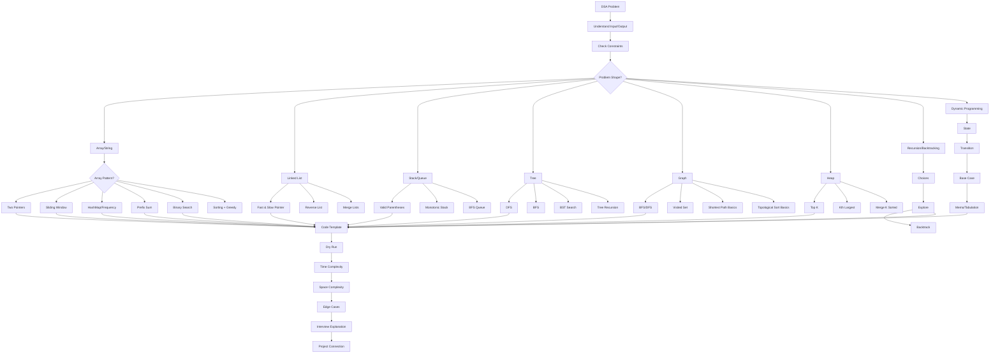

---

# 3. One-Line Mental Shortcut

## DSA shortcut

```text
DSA = Problem Shape → Constraints → Pattern → Data Structure → Template → Dry Run → Complexity → Edge Cases
```

Or even shorter:

```text
DSA = Identify Pattern → Apply Template → Explain Complexity
```

For interview speaking:

```text
First I understand constraints, then choose the right pattern, implement using suitable data structure, dry run edge cases, and explain time-space complexity.
```

---

# 4. Topic Breakdown Using Mental Model

| Mental Model Block | Meaning                                                     | Why It Is Important            | Project Usage                                                  | Interview Focus                      |
| ------------------ | ----------------------------------------------------------- | ------------------------------ | -------------------------------------------------------------- | ------------------------------------ |
| Problem Shape      | Identify if problem is array, string, tree, graph, DP, etc. | Decides the pattern quickly    | Search, filtering, pagination, tree category, dependency graph | “How did you identify the approach?” |
| Constraints        | Input size, time limit, memory limit                        | Helps reject brute force       | Large API result sets, DB result processing                    | O(n²) vs O(n log n) vs O(n)          |
| Pattern            | Reusable solving approach                                   | Reduces memorization           | Sliding window for rate limit, HashMap for lookup              | “Which pattern applies here?”        |
| Data Structure     | Array, Map, Set, Stack, Queue, Heap, Tree                   | Core tool for solving          | Caching, deduplication, queue processing                       | Internal working and complexity      |
| Template           | Standard code skeleton                                      | Makes coding faster            | Java implementation confidence                                 | Clean Java code                      |
| Dry Run            | Test with sample input                                      | Finds logic bugs               | Prevents production bugs                                       | Interviewer checks thought process   |
| Complexity         | Time and space analysis                                     | Shows seniority                | Performance of backend APIs                                    | Big-O explanation                    |
| Edge Cases         | Empty input, duplicates, overflow, nulls                    | Avoids wrong answers           | API validation and defensive coding                            | “What if input is empty?”            |
| Optimization       | Improve brute force                                         | Shows problem-solving maturity | Slow API optimization                                          | Brute force to optimal               |
| Project Connection | Relate DSA to backend work                                  | Validates experience           | REST, DB, microservices, caching                               | “Where have you used this?”          |

---

# 5. Visual Notes for Each Important Subtopic

## 5.1 General DSA Problem Solving Flow

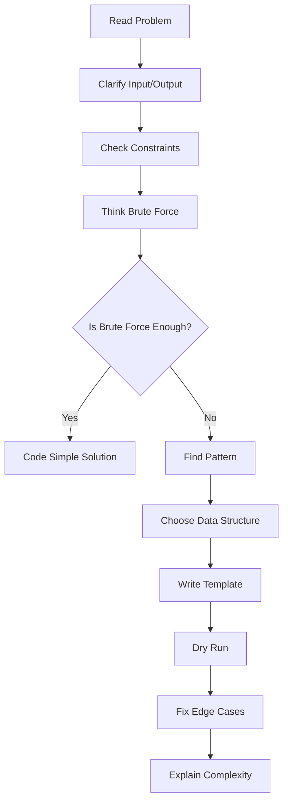

Interview line:

> “I usually start with brute force, check constraints, then optimize using the correct pattern.”

---

## 5.2 Pattern Decision Tree

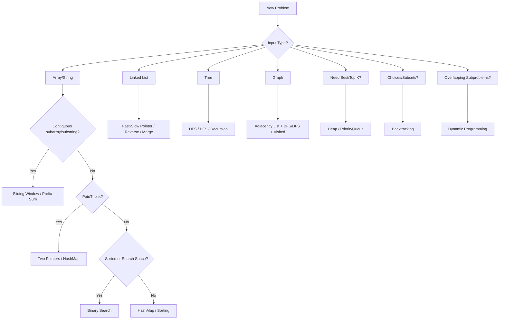

This is the most important diagram for DSA.

---

## 5.3 Arrays and Strings Mental Model

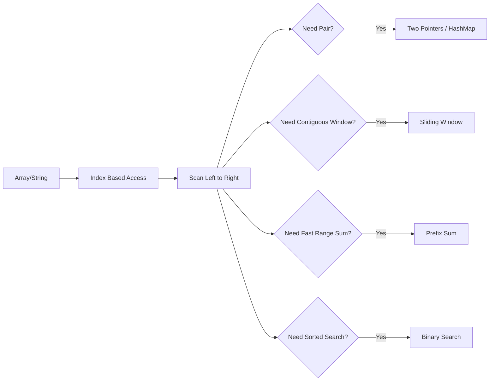

Must-code examples:

```text
Two Sum
Best Time to Buy and Sell Stock
Move Zeroes
Maximum Subarray
Longest Substring Without Repeating Characters
Subarray Sum Equals K
```

---

## 5.4 Two Pointers Flow

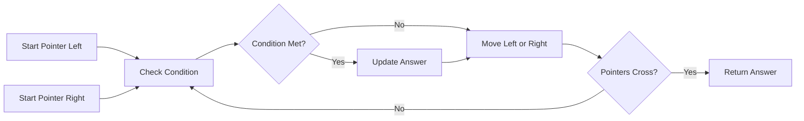

Used when:

```text
Sorted array
Pair sum
Palindrome
Reverse array/string
Remove duplicates
Container with most water
```

Mental shortcut:

```text
Two Pointers = Left + Right → Compare → Move smarter pointer
```

---

## 5.5 Sliding Window Flow

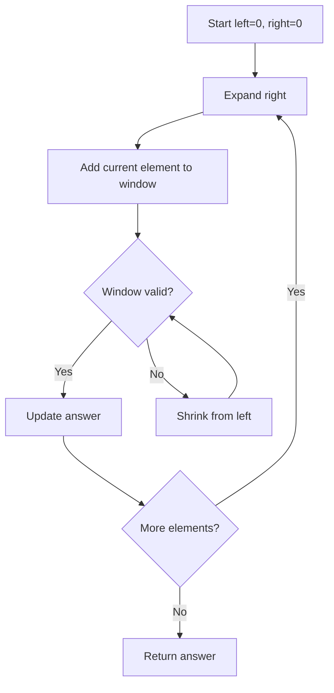

Used when:

```text
Longest substring
Maximum sum subarray of size K
Minimum window substring
Rate limiter logic
Contiguous subarray/substring problems
```

Backend project connection:

> Sliding window is also the mental model behind API rate limiting: maintain requests in a time window and reject if threshold exceeds.

---

## 5.6 HashMap / Frequency Map Flow

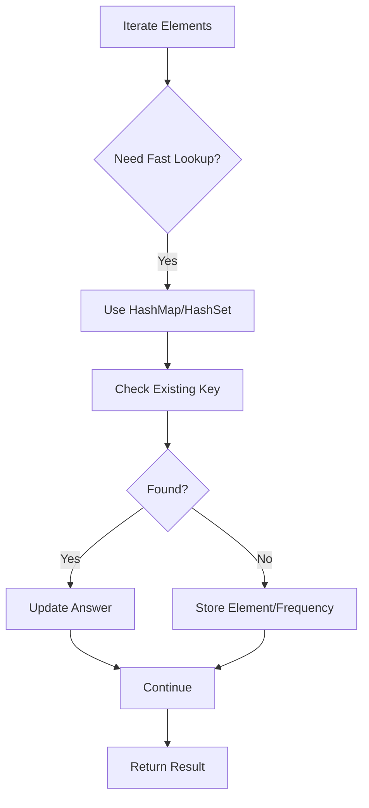

Used when:

```text
Two Sum
Anagram
Frequency count
Duplicates
Subarray sum
First non-repeating character
```

Project usage:

```text
Deduplicate records
Count category frequency
Group response data
Cache lookup
Token/session lookup
```

---

## 5.7 Prefix Sum Flow

```mermaid
flowchart TD
    A[Original Array] --> B[Build Running Sum]
    B --> C[Store prefixSum]
    C --> D[Range Query]
    D --> E[sum L to R = prefix[R] - prefix[L-1]]
```

Used when:

```text
Range sum
Subarray sum equals K
Count subarrays
Difference array
```

Mental shortcut:

```text
Prefix Sum = Convert repeated range calculation into O(1) lookup
```

---

## 5.8 Binary Search Flow

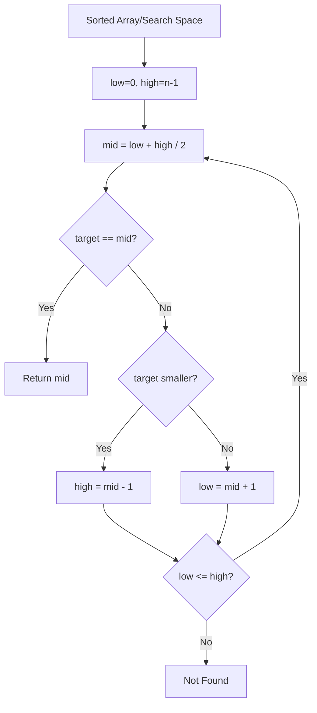

Used when:

```text
Sorted arrays
First/last occurrence
Search insert position
Minimum in rotated sorted array
Search on answer
```

Important interview point:

> Binary search is not only for arrays; it is also used when the answer space is monotonic.

---

## 5.9 Stack Flow

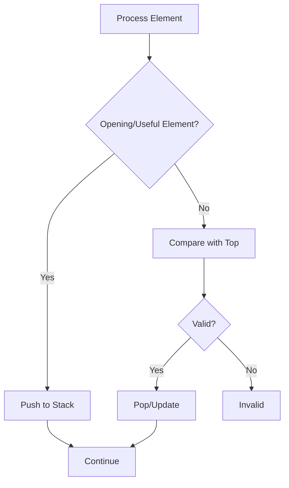

Used when:

```text
Valid parentheses
Next greater element
Min stack
Monotonic stack
Undo operations
Expression evaluation
```

Project usage:

```text
Function call stack
Undo/redo feature
Expression parsing
Nested JSON/XML validation
```

---

## 5.10 Queue / BFS Flow

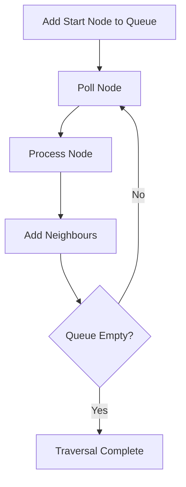

Used when:

```text
Level order traversal
Shortest path in unweighted graph
Message processing
Task scheduling
```

Microservices connection:

> Queue-based processing is similar to Kafka/SQS consumer flow: add work, consume work, process, retry/fail if needed.

---

## 5.11 Linked List Pointer Model

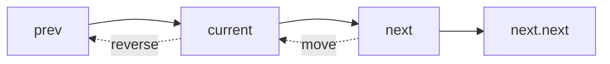

Important patterns:

```text
Reverse linked list
Detect cycle
Find middle
Merge two lists
Remove nth node from end
```

Mental shortcut:

```text
Linked List = Manage prev, current, next carefully
```

---

## 5.12 Tree DFS Model

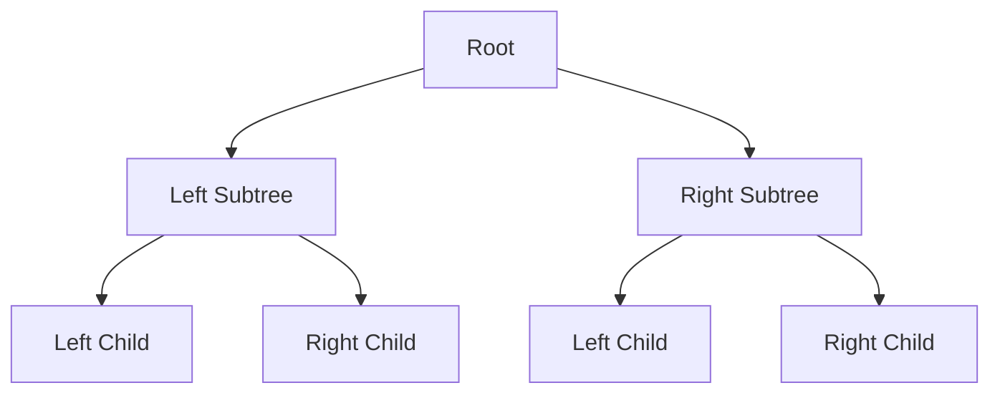

DFS traversal:

```text
Preorder  = Root → Left → Right
Inorder   = Left → Root → Right
Postorder = Left → Right → Root
```

Interview focus:

```text
Height of tree
Diameter
Balanced tree
Lowest common ancestor
BST validation
Path sum
```

---

## 5.13 Graph Traversal Model

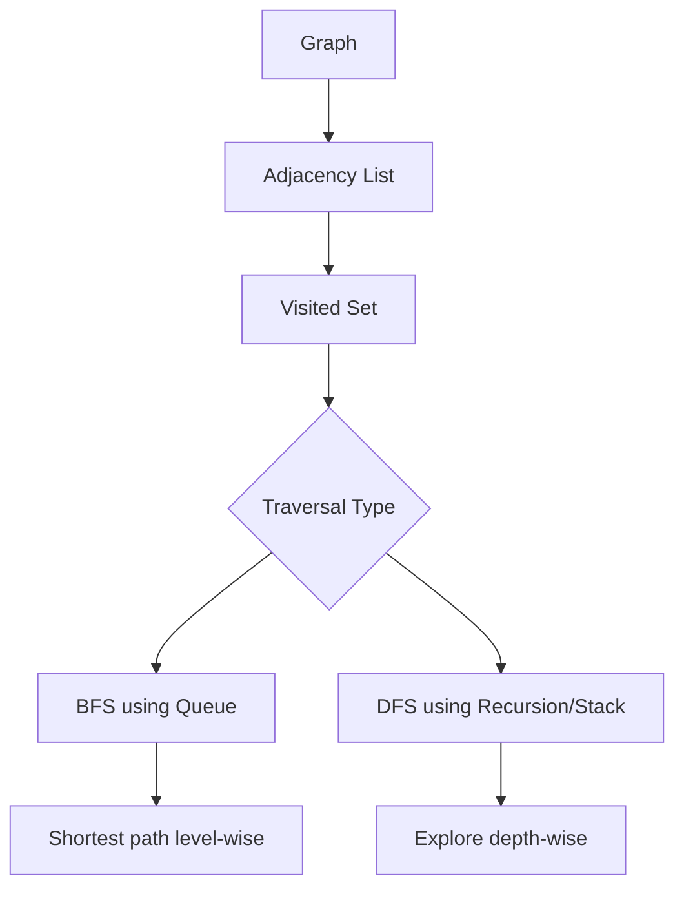

Must understand:

```text
Visited set prevents infinite loop
BFS is level-wise
DFS is depth-wise
Graph may be directed/undirected
Graph may have cycles
```

Project usage:

```text
Service dependency graph
User connection graph
Workflow dependency
Build pipeline dependency
```

---

## 5.14 Heap / PriorityQueue Model

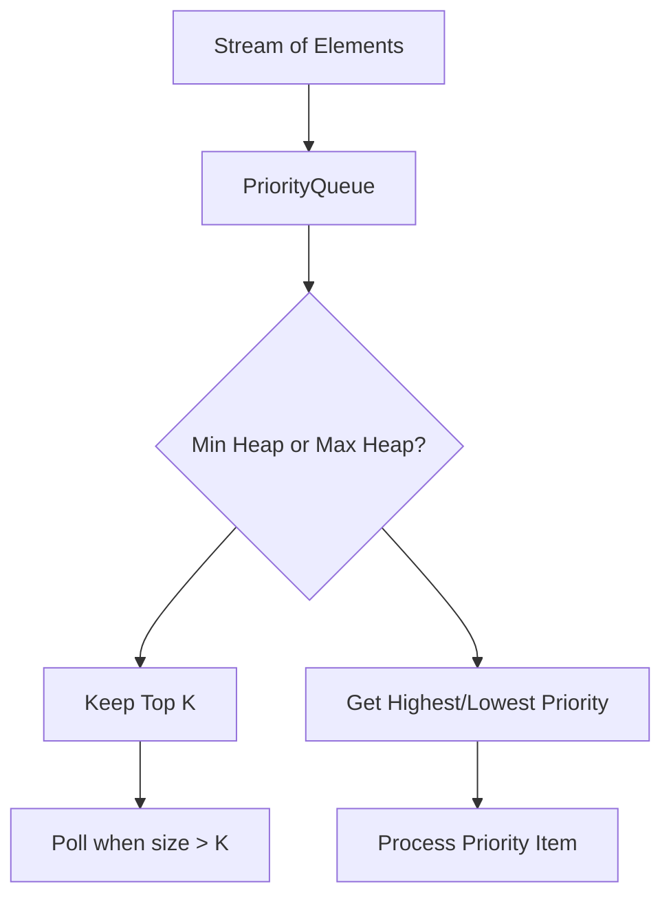

Used when:

```text
Top K frequent elements
Kth largest
Merge K sorted lists
Task scheduling
Priority processing
```

Java class:

```java
PriorityQueue<Integer> minHeap = new PriorityQueue<>();
PriorityQueue<Integer> maxHeap = new PriorityQueue<>((a, b) -> b - a);
```

---

## 5.15 Recursion / Backtracking Model

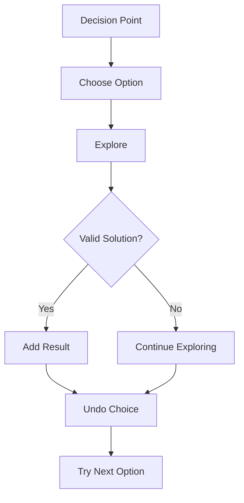

Used when:

```text
Subsets
Permutations
Combination Sum
N-Queens
Word search
Generate parentheses
```

Mental shortcut:

```text
Backtracking = Choose → Explore → Undo
```

---

## 5.16 Dynamic Programming Model

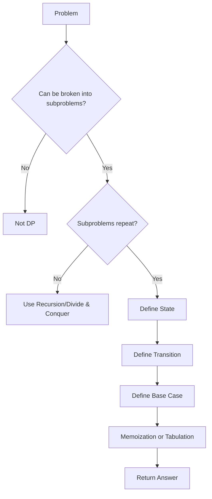

Mental shortcut:

```text
DP = State + Transition + Base Case + Memoization
```

Common beginner DP examples:

```text
Fibonacci
Climbing stairs
House robber
Coin change
Longest common subsequence
0/1 knapsack basics
```

For your current interview target, learn DP basics, not advanced hard DP first.

---

# 6. Theory Required Behind the Mental Model

## 6.1 Big-O Complexity

| Concept    | Simple Definition            | Why It Matters              | Interview Explanation                                | Project Example                            |
| ---------- | ---------------------------- | --------------------------- | ---------------------------------------------------- | ------------------------------------------ |
| O(1)       | Constant time                | Fastest                     | Accessing array index or HashMap lookup average case | Fetching cached user by key                |
| O(log n)   | Reduces search space by half | Efficient search            | Binary search                                        | Searching sorted data                      |
| O(n)       | Single pass                  | Usually acceptable          | Loop through list once                               | Filtering posts                            |
| O(n log n) | Sorting level complexity     | Common optimal for ordering | Merge sort, quick sort average                       | Sorting API response                       |
| O(n²)      | Nested loops                 | Dangerous for large data    | Pair comparison brute force                          | Comparing every post with every other post |
| O(2ⁿ)      | Exponential                  | Usually backtracking        | Subsets/permutations                                 | Avoid for large input                      |
| O(n!)      | Factorial                    | Very expensive              | Permutations                                         | Only small input                           |

Interview line:

> “I first check input size. If n is around 10⁵, O(n²) is risky, so I try O(n log n) or O(n).”

---

## 6.2 Arrays

Definition:

> Array is a contiguous memory structure with index-based access.

Why it matters:

```text
Fast access: O(1)
Insertion/deletion in middle: O(n)
Good for scanning and sorting
```

Java:

```java
int[] arr = new int[10];
```

Project example:

```text
Processing list of post IDs
Sorting comments
Pagination result processing
```

---

## 6.3 String

String in Java is immutable.

Why it matters:

```text
Repeated string concatenation creates new objects
Use StringBuilder for modification-heavy problems
```

Interview example:

```java
StringBuilder sb = new StringBuilder();
sb.append("abc");
```

Project example:

```text
Building slug from blog title
Validating request parameters
Parsing JWT token sections
```

---

## 6.4 HashMap and HashSet

Definition:

> HashMap stores key-value pairs for fast lookup.

Why it matters:

```text
Average lookup: O(1)
Worst case: O(log n) in Java 8+ for treeified buckets
Used for frequency, lookup, grouping, caching
```

Interview line:

> “I used HashMap because I needed constant-time lookup instead of scanning repeatedly.”

Project example:

```text
Map userId to user details
Deduplicate category names
Count post frequency by category
```

---

## 6.5 Stack

Definition:

> Stack follows LIFO: Last In First Out.

Used for:

```text
Parentheses
Undo
Recursion
Monotonic problems
```

Java:

```java
Deque<Character> stack = new ArrayDeque<>();
```

Prefer `ArrayDeque` over old `Stack`.

---

## 6.6 Queue

Definition:

> Queue follows FIFO: First In First Out.

Used for:

```text
BFS
Task scheduling
Message processing
```

Java:

```java
Queue<Integer> queue = new LinkedList<>();
```

Project example:

```text
Kafka/SQS style processing
Background jobs
Batch item processing
```

---

## 6.7 Recursion

Definition:

> Function calls itself with smaller input.

Required components:

```text
Base case
Recursive case
Progress toward base case
```

Risk:

```text
StackOverflowError if recursion is too deep
```

Interview line:

> “Tree problems naturally fit recursion because every subtree is itself a smaller tree.”

---

## 6.8 Dynamic Programming

Definition:

> DP is used when a problem has repeated subproblems and optimal substructure.

Steps:

```text
Define state
Define transition
Define base case
Store result
```

Interview line:

> “I chose DP because the recursive solution recalculates the same subproblems.”

---

## 6.9 Graphs

Definition:

> Graph has nodes and edges.

Core components:

```text
Adjacency list
Visited set
BFS/DFS
Cycle detection
```

Project example:

```text
Microservice dependency graph
Workflow pipeline
Build dependency
User relationship network
```

---

# 7. Code / Program Mapping

| Mental Model Concept | Code/Program Needed? | What To Implement                        | Why It Helps                       |
| -------------------- | -------------------- | ---------------------------------------- | ---------------------------------- |
| Two Pointers         | Yes                  | Pair sum / palindrome                    | Builds pointer confidence          |
| Sliding Window       | Yes                  | Longest substring / max sum              | Very common in interviews          |
| HashMap              | Yes                  | Two sum / frequency count                | Most used DSA tool                 |
| Prefix Sum           | Yes                  | Subarray sum equals K                    | Handles range/subarray problems    |
| Binary Search        | Yes                  | Search / lower bound                     | Must know for optimization         |
| Stack                | Yes                  | Valid parentheses                        | Easy but commonly asked            |
| Monotonic Stack      | Later                | Next greater element                     | Medium-level pattern               |
| Linked List          | Yes                  | Reverse / cycle detection                | Pointer handling                   |
| Tree DFS/BFS         | Yes                  | Max depth / level order                  | Core recursion and BFS             |
| Graph BFS/DFS        | Yes                  | Number of islands / connected components | Important for mid-level interviews |
| Heap                 | Yes                  | Top K frequent                           | Common backend-style problem       |
| DP Basics            | Yes                  | Climbing stairs / house robber           | Basic DP confidence                |
| Backtracking         | P1/P2                | Subsets / permutations                   | Asked but not always               |
| Advanced DP          | Later                | LCS / knapsack                           | Learn after core patterns          |

---

## 7.1 Two Sum Using HashMap

```java
import java.util.*;

public class TwoSum {
    public int[] twoSum(int[] nums, int target) {
        Map<Integer, Integer> map = new HashMap<>();

        for (int i = 0; i < nums.length; i++) {
            int required = target - nums[i];

            if (map.containsKey(required)) {
                return new int[]{map.get(required), i};
            }

            map.put(nums[i], i);
        }

        return new int[]{-1, -1};
    }
}
```

Mental model:

```text
For every number, check whether its required pair already exists.
```

Complexity:

```text
Time: O(n)
Space: O(n)
```

---

## 7.2 Two Pointers: Check Palindrome

```java
public class PalindromeCheck {
    public boolean isPalindrome(String s) {
        int left = 0;
        int right = s.length() - 1;

        while (left < right) {
            if (s.charAt(left) != s.charAt(right)) {
                return false;
            }
            left++;
            right--;
        }

        return true;
    }
}
```

Mental model:

```text
Compare both ends and move inward.
```

---

## 7.3 Sliding Window: Longest Substring Without Repeating Characters

```java
import java.util.*;

public class LongestSubstring {
    public int lengthOfLongestSubstring(String s) {
        Set<Character> set = new HashSet<>();
        int left = 0;
        int maxLength = 0;

        for (int right = 0; right < s.length(); right++) {
            char current = s.charAt(right);

            while (set.contains(current)) {
                set.remove(s.charAt(left));
                left++;
            }

            set.add(current);
            maxLength = Math.max(maxLength, right - left + 1);
        }

        return maxLength;
    }
}
```

Mental model:

```text
Expand right, shrink left when duplicate appears.
```

---

## 7.4 Prefix Sum: Subarray Sum Equals K

```java
import java.util.*;

public class SubarraySumEqualsK {
    public int subarraySum(int[] nums, int k) {
        Map<Integer, Integer> prefixCount = new HashMap<>();
        prefixCount.put(0, 1);

        int prefixSum = 0;
        int count = 0;

        for (int num : nums) {
            prefixSum += num;

            if (prefixCount.containsKey(prefixSum - k)) {
                count += prefixCount.get(prefixSum - k);
            }

            prefixCount.put(prefixSum, prefixCount.getOrDefault(prefixSum, 0) + 1);
        }

        return count;
    }
}
```

Mental model:

```text
If currentPrefix - oldPrefix = k, then subarray sum is k.
```

---

## 7.5 Binary Search Template

```java
public class BinarySearch {
    public int search(int[] nums, int target) {
        int low = 0;
        int high = nums.length - 1;

        while (low <= high) {
            int mid = low + (high - low) / 2;

            if (nums[mid] == target) {
                return mid;
            } else if (nums[mid] < target) {
                low = mid + 1;
            } else {
                high = mid - 1;
            }
        }

        return -1;
    }
}
```

Important line:

```java
int mid = low + (high - low) / 2;
```

Why?

```text
Avoids integer overflow compared to (low + high) / 2.
```

---

## 7.6 Stack: Valid Parentheses

```java
import java.util.*;

public class ValidParentheses {
    public boolean isValid(String s) {
        Deque<Character> stack = new ArrayDeque<>();

        for (char ch : s.toCharArray()) {
            if (ch == '(' || ch == '{' || ch == '[') {
                stack.push(ch);
            } else {
                if (stack.isEmpty()) {
                    return false;
                }

                char top = stack.pop();

                if ((ch == ')' && top != '(') ||
                    (ch == '}' && top != '{') ||
                    (ch == ']' && top != '[')) {
                    return false;
                }
            }
        }

        return stack.isEmpty();
    }
}
```

Mental model:

```text
Opening bracket waits in stack until matching closing bracket appears.
```

---

## 7.7 Linked List Reverse

```java
public class ReverseLinkedList {

    static class ListNode {
        int val;
        ListNode next;

        ListNode(int val) {
            this.val = val;
        }
    }

    public ListNode reverseList(ListNode head) {
        ListNode prev = null;
        ListNode current = head;

        while (current != null) {
            ListNode next = current.next;
            current.next = prev;
            prev = current;
            current = next;
        }

        return prev;
    }
}
```

Mental model:

```text
Save next → reverse pointer → move prev/current.
```

---

## 7.8 Tree DFS: Maximum Depth

```java
public class MaxDepthTree {

    static class TreeNode {
        int val;
        TreeNode left;
        TreeNode right;

        TreeNode(int val) {
            this.val = val;
        }
    }

    public int maxDepth(TreeNode root) {
        if (root == null) {
            return 0;
        }

        int leftDepth = maxDepth(root.left);
        int rightDepth = maxDepth(root.right);

        return 1 + Math.max(leftDepth, rightDepth);
    }
}
```

Mental model:

```text
Depth of tree = 1 + max depth of left and right subtree.
```

---

## 7.9 BFS: Level Order Traversal

```java
import java.util.*;

public class LevelOrderTraversal {

    static class TreeNode {
        int val;
        TreeNode left;
        TreeNode right;

        TreeNode(int val) {
            this.val = val;
        }
    }

    public List<List<Integer>> levelOrder(TreeNode root) {
        List<List<Integer>> result = new ArrayList<>();

        if (root == null) {
            return result;
        }

        Queue<TreeNode> queue = new LinkedList<>();
        queue.offer(root);

        while (!queue.isEmpty()) {
            int size = queue.size();
            List<Integer> level = new ArrayList<>();

            for (int i = 0; i < size; i++) {
                TreeNode node = queue.poll();
                level.add(node.val);

                if (node.left != null) {
                    queue.offer(node.left);
                }

                if (node.right != null) {
                    queue.offer(node.right);
                }
            }

            result.add(level);
        }

        return result;
    }
}
```

Mental model:

```text
Queue holds current level nodes.
```

---

## 7.10 Graph DFS

```java
import java.util.*;

public class GraphDFS {
    public void dfs(int node, Map<Integer, List<Integer>> graph, Set<Integer> visited) {
        if (visited.contains(node)) {
            return;
        }

        visited.add(node);
        System.out.println(node);

        for (int neighbour : graph.getOrDefault(node, new ArrayList<>())) {
            dfs(neighbour, graph, visited);
        }
    }
}
```

Mental model:

```text
Visit node → mark visited → visit neighbours.
```

---

## 7.11 Heap: Top K Largest Elements

```java
import java.util.*;

public class TopKLargest {
    public List<Integer> topK(int[] nums, int k) {
        PriorityQueue<Integer> minHeap = new PriorityQueue<>();

        for (int num : nums) {
            minHeap.offer(num);

            if (minHeap.size() > k) {
                minHeap.poll();
            }
        }

        return new ArrayList<>(minHeap);
    }
}
```

Mental model:

```text
Keep only K largest elements in min heap.
```

Complexity:

```text
Time: O(n log k)
Space: O(k)
```

---

## 7.12 DP: Climbing Stairs

```java
public class ClimbingStairs {
    public int climbStairs(int n) {
        if (n <= 2) {
            return n;
        }

        int first = 1;
        int second = 2;

        for (int i = 3; i <= n; i++) {
            int third = first + second;
            first = second;
            second = third;
        }

        return second;
    }
}
```

Mental model:

```text
Ways to reach step n = ways(n-1) + ways(n-2)
```

---

# 8. Project Usage Mapping

| Concept        | How I Can Use/Explain It In My Project                                     | Interview Line                                                                                                                     |
| -------------- | -------------------------------------------------------------------------- | ---------------------------------------------------------------------------------------------------------------------------------- |
| Array/List     | Used in REST responses like list of posts, comments, categories            | “In my blog application, API responses often return lists, and I handle filtering, sorting, and pagination on collections.”        |
| HashMap        | Useful for quick lookup, grouping, frequency counting, DTO mapping support | “For fast lookup and grouping logic, HashMap is useful because average access is O(1).”                                            |
| HashSet        | Used for uniqueness validation                                             | “For duplicate detection like unique category names or unique tags, Set-based lookup is efficient.”                                |
| Sorting        | Used in pagination and sorting posts by date/title                         | “Pagination and sorting are common in REST APIs, and internally sorting is usually O(n log n).”                                    |
| Binary Search  | Useful when searching sorted data or optimizing monotonic answers          | “Although DB handles most search, binary search is useful when working with sorted in-memory data.”                                |
| Sliding Window | Can explain rate limiter in API Gateway/microservices                      | “Sliding window is useful in rate limiting where requests are tracked within a time window.”                                       |
| Queue          | Similar to async processing and Kafka consumer model                       | “Queue follows FIFO and is similar to how background jobs or message consumers process events.”                                    |
| Stack          | Useful for nested validation and function call understanding               | “Stack is useful for problems like valid parentheses and also helps understand recursion internally.”                              |
| Tree           | Category/subcategory hierarchy                                             | “If categories become hierarchical, tree traversal can be used to fetch parent-child category structures.”                         |
| Graph          | Microservice dependency graph                                              | “In microservices, service dependencies can be visualized as a graph where services are nodes and calls are edges.”                |
| BFS/DFS        | Service dependency traversal or category tree traversal                    | “DFS/BFS helps when we need to traverse connected components or hierarchical structures.”                                          |
| Heap           | Top posts, top categories, top K search results                            | “For top K style problems, PriorityQueue is better than sorting entire data.”                                                      |
| DP             | Less direct in CRUD apps, but useful in optimization problems              | “DP is more common in algorithmic interviews than typical CRUD code, but I understand it using state and transition.”              |
| Complexity     | API performance discussion                                                 | “As a backend developer, I always consider whether logic is O(n), O(n log n), or O(n²), especially for large response processing.” |

---

# 9. Scenario-Based Mental Models

## Scenario 1: Given an array, find two numbers with target sum

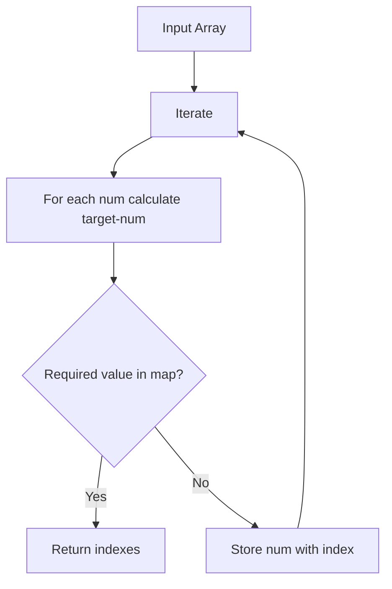

| Part                  | Explanation                                                                |
| --------------------- | -------------------------------------------------------------------------- |
| Flow                  | Iterate once, store visited numbers                                        |
| Problem               | Brute force takes O(n²)                                                    |
| Root Cause            | Checking every pair repeatedly                                             |
| Fix                   | Use HashMap for O(1) lookup                                                |
| Interview Explanation | “I optimized pair search using HashMap, reducing time from O(n²) to O(n).” |

---

## Scenario 2: Longest substring without duplicate characters

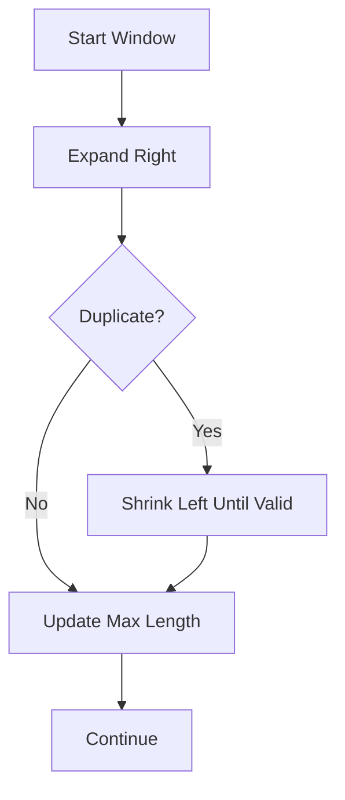

| Part                  | Explanation                                                                 |
| --------------------- | --------------------------------------------------------------------------- |
| Flow                  | Maintain valid window                                                       |
| Problem               | Rechecking substrings is expensive                                          |
| Root Cause            | Brute force generates many substrings                                       |
| Fix                   | Sliding window                                                              |
| Interview Explanation | “Since the problem asks for a contiguous substring, I used sliding window.” |

---

## Scenario 3: Search in sorted data

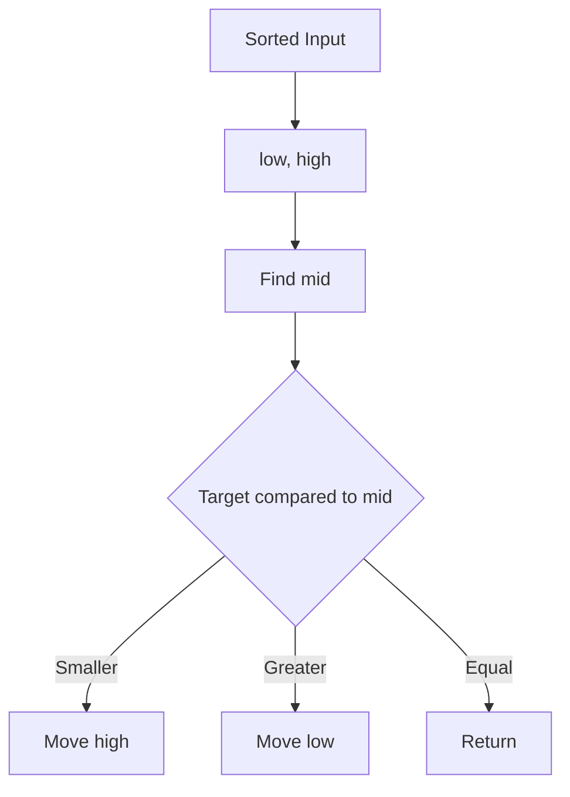

| Part                  | Explanation                                                                  |
| --------------------- | ---------------------------------------------------------------------------- |
| Flow                  | Divide search space                                                          |
| Problem               | Linear search is O(n)                                                        |
| Root Cause            | Not using sorted property                                                    |
| Fix                   | Binary search                                                                |
| Interview Explanation | “Because the input is sorted, binary search reduces complexity to O(log n).” |

---

## Scenario 4: API rate limiter using sliding window

```mermaid
flowchart TD
    A[Incoming Request] --> B[Get User/IP Key]
    B --> C[Fetch Request Timestamps]
    C --> D[Remove Old Timestamps]
    D --> E{Count within window < limit?}
    E -- Yes --> F[Allow Request]
    E -- No --> G[Reject 429]
```

| Part                  | Explanation                                                                                             |
| --------------------- | ------------------------------------------------------------------------------------------------------- |
| Flow                  | Track requests within time window                                                                       |
| Problem               | Too many requests overload API                                                                          |
| Root Cause            | No throttling                                                                                           |
| Fix                   | Sliding window / token bucket                                                                           |
| Interview Explanation | “For API rate limiting, sliding window keeps requests within a time window and rejects extra requests.” |

---

## Scenario 5: Find cycle in linked list

```mermaid
flowchart TD
    A[Start slow=head, fast=head] --> B[slow moves 1 step]
    B --> C[fast moves 2 steps]
    C --> D{slow == fast?}
    D -- Yes --> E[Cycle Exists]
    D -- No --> F{fast reaches null?}
    F -- Yes --> G[No Cycle]
    F -- No --> B
```

| Part                  | Explanation                                                                                   |
| --------------------- | --------------------------------------------------------------------------------------------- |
| Flow                  | Fast pointer catches slow pointer if cycle exists                                             |
| Problem               | Infinite traversal possible                                                                   |
| Root Cause            | Linked list may point back                                                                    |
| Fix                   | Floyd cycle detection                                                                         |
| Interview Explanation | “I used fast and slow pointer because if a cycle exists, both pointers will eventually meet.” |

---

## Scenario 6: Category hierarchy traversal

```mermaid
flowchart TD
    A[Root Category] --> B[Child Category 1]
    A --> C[Child Category 2]
    B --> D[Subcategory]
    C --> E[Subcategory]
```

| Part                  | Explanation                                                                                                         |
| --------------------- | ------------------------------------------------------------------------------------------------------------------- |
| Flow                  | Traverse category tree                                                                                              |
| Problem               | Need parent-child hierarchy                                                                                         |
| Root Cause            | Flat category list is not enough                                                                                    |
| Fix                   | DFS/BFS traversal                                                                                                   |
| Interview Explanation | “If my blog categories become hierarchical, I can model them as a tree and use DFS/BFS to fetch nested categories.” |

---

## Scenario 7: Microservice dependency traversal

```mermaid
flowchart TD
    A[API Gateway] --> B[user-service]
    A --> C[post-service]
    C --> D[category-service]
    C --> E[file-service]
```

| Part                  | Explanation                                                                            |
| --------------------- | -------------------------------------------------------------------------------------- |
| Flow                  | Services call other services                                                           |
| Problem               | Need to understand dependency chain                                                    |
| Root Cause            | Multiple service interactions                                                          |
| Fix                   | Graph model                                                                            |
| Interview Explanation | “In microservices, services can be modeled as graph nodes, and dependencies as edges.” |

---

## Scenario 8: Top K most viewed posts

```mermaid
flowchart TD
    A[Post View Counts] --> B[Min Heap of size K]
    B --> C{Heap size > K?}
    C -- Yes --> D[Remove smallest]
    C -- No --> E[Continue]
    D --> E
    E --> F[Top K Posts]
```

| Part                  | Explanation                                                                          |
| --------------------- | ------------------------------------------------------------------------------------ |
| Flow                  | Maintain only K top items                                                            |
| Problem               | Sorting all posts may be unnecessary                                                 |
| Root Cause            | Need only top K, not full order                                                      |
| Fix                   | PriorityQueue                                                                        |
| Interview Explanation | “For top K problems, I use heap to reduce complexity from O(n log n) to O(n log k).” |

---

## Scenario 9: DP problem like climbing stairs

```mermaid
flowchart TD
    A[Step n] --> B[Can come from n-1]
    A --> C[Can come from n-2]
    B --> D[ways n-1]
    C --> E[ways n-2]
    D --> F[ways n = ways n-1 + ways n-2]
    E --> F
```

| Part                  | Explanation                                                                          |
| --------------------- | ------------------------------------------------------------------------------------ |
| Flow                  | Current answer depends on previous answers                                           |
| Problem               | Recursion repeats calculations                                                       |
| Root Cause            | Overlapping subproblems                                                              |
| Fix                   | DP memoization/tabulation                                                            |
| Interview Explanation | “I used DP because the same subproblems are calculated multiple times in recursion.” |

---

# 10. Debugging / Production Issue Flow

| Issue                               | Possible Cause                      | Where To Check              | Fix                                      | Interview Explanation                                              |
| ----------------------------------- | ----------------------------------- | --------------------------- | ---------------------------------------- | ------------------------------------------------------------------ |
| Code gives TLE                      | O(n²) or worse                      | Nested loops, constraints   | Use HashMap, sorting, two pointers, heap | “I checked constraints and optimized brute force.”                 |
| Memory Limit Exceeded               | Storing too much data               | Extra arrays/maps/recursion | Reduce space, use in-place logic         | “I optimized space from O(n) to O(1) where possible.”              |
| Wrong answer in sliding window      | Not shrinking window correctly      | left/right movement         | Maintain valid condition carefully       | “Sliding window needs a clear valid/invalid condition.”            |
| Binary search infinite loop         | Wrong low/high update               | mid calculation             | Ensure low/high always move              | “Binary search bugs usually come from boundary handling.”          |
| Stack empty error                   | Popping without checking            | Stack condition             | Check `isEmpty()` first                  | “Before popping, I validate stack state.”                          |
| NullPointerException in linked list | Accessing `next` without null check | Pointer movement            | Check current/fast/fast.next             | “Pointer problems require careful null checks.”                    |
| StackOverflowError                  | Deep recursion                      | Recursive function          | Use iterative BFS/DFS                    | “For deep trees/graphs, iterative approach avoids stack overflow.” |
| Duplicate processing in graph       | Missing visited set                 | BFS/DFS traversal           | Add visited set                          | “Visited set prevents cycles and repeated processing.”             |
| Wrong DP answer                     | Bad state/transition                | DP formula                  | Redefine state clearly                   | “DP should start with state definition.”                           |
| Slow top K solution                 | Sorting all data                    | Sorting logic               | Use heap                                 | “Heap is better when only top K results are needed.”               |

---

# 11. 60–70% Most Important Interview Coverage

| Priority | Topic              | Mental Model Needed        | Code Needed | Scenario Needed                 | Interview Weight |
| -------- | ------------------ | -------------------------- | ----------- | ------------------------------- | ---------------- |
| P0       | Big-O Complexity   | Constraint → complexity    | Yes         | TLE optimization                | Very High        |
| P0       | Arrays             | Scan/index model           | Yes         | Filtering, max/min, duplicates  | Very High        |
| P0       | Strings            | Character scan             | Yes         | Palindrome, substring           | Very High        |
| P0       | HashMap/HashSet    | Fast lookup/frequency      | Yes         | Two Sum, Anagram                | Very High        |
| P0       | Two Pointers       | Left-right movement        | Yes         | Pair sum, palindrome            | Very High        |
| P0       | Sliding Window     | Expand-shrink window       | Yes         | Longest substring, rate limiter | Very High        |
| P0       | Binary Search      | Divide search space        | Yes         | Sorted search, search on answer | High             |
| P0       | Stack/Queue        | LIFO/FIFO processing       | Yes         | Parentheses, BFS                | High             |
| P0       | Linked List        | prev-current-next          | Yes         | Reverse, cycle                  | High             |
| P1       | Tree DFS/BFS       | Recursive traversal        | Yes         | Category hierarchy              | High             |
| P1       | Graph BFS/DFS      | Node-edge-visited          | Yes         | Service dependencies            | Medium-High      |
| P1       | Heap/PriorityQueue | Top K priority model       | Yes         | Top viewed posts                | Medium-High      |
| P1       | Recursion          | Base case + recursive case | Yes         | Tree recursion                  | Medium           |
| P1       | DP Basics          | State-transition           | Yes         | Climbing stairs, house robber   | Medium           |
| P2       | Backtracking       | Choose-explore-undo        | Yes         | Subsets/permutations            | Medium           |
| P2       | Greedy             | Local best choice          | Yes         | Intervals, jump game            | Medium           |
| P2       | Trie               | Prefix tree                | Later       | Search autocomplete             | Low-Medium       |
| P3       | Segment Tree       | Range query tree           | Later       | Advanced range queries          | Low              |
| P3       | Advanced Graph     | Dijkstra, Union Find       | Later       | Network/path problems           | Low-Medium       |
| P3       | Advanced DP        | LCS, knapsack variants     | Later       | Hard problems                   | Low-Medium       |

## For your immediate interview preparation

Focus this order:

```text
1. Big-O
2. Array/String
3. HashMap/HashSet
4. Two Pointers
5. Sliding Window
6. Binary Search
7. Stack/Queue
8. Linked List
9. Trees
10. Graph basics
11. Heap
12. Basic DP
```

This will cover most mid-level Java backend DSA rounds.

---

# 12. Revision Format

## Master shortcut

```text
DSA = Problem Shape → Constraints → Pattern → Data Structure → Template → Dry Run → Complexity → Edge Cases
```

---

## 5 key diagrams to memorize

### 1. Pattern decision tree

```text
Array/String?
  → Pair? Two pointers/HashMap
  → Contiguous? Sliding Window/Prefix Sum
  → Sorted? Binary Search
  → Frequency? HashMap
Tree?
  → DFS/BFS
Graph?
  → BFS/DFS + visited
Top K?
  → Heap
Repeating subproblems?
  → DP
Choices?
  → Backtracking
```

### 2. Sliding window

```text
right expands → add element → invalid? shrink left → update answer
```

### 3. Binary search

```text
low/high → mid → compare → discard half
```

### 4. DFS/BFS

```text
DFS = Go deep
BFS = Go level by level
```

### 5. DP

```text
State → Transition → Base Case → Memo/Tabulation
```

---

## 10 must-remember points

1. Always check constraints before choosing approach.
2. Brute force is okay to explain first, but optimize quickly.
3. HashMap reduces repeated lookup.
4. Sliding window works for contiguous subarray/substring.
5. Two pointers often needs sorted input or opposite-end movement.
6. Binary search needs sorted data or monotonic answer space.
7. BFS uses queue; DFS uses recursion or stack.
8. Graph traversal needs visited set.
9. DP needs repeated subproblems.
10. Always explain time and space complexity.

---

## 10 common interview lines

1. “I will first clarify input, output, and constraints.”
2. “The brute force approach would be O(n²), but we can optimize it.”
3. “Since we need fast lookup, I will use HashMap.”
4. “Since the problem asks for contiguous substring, sliding window fits here.”
5. “Since the array is sorted, binary search is better.”
6. “For top K elements, heap is more efficient than sorting everything.”
7. “For tree traversal, DFS is natural because each subtree is a smaller problem.”
8. “For graph traversal, I will maintain a visited set to avoid cycles.”
9. “This problem has overlapping subproblems, so DP can be applied.”
10. “The final complexity is O(n) time and O(n) space.”

---

## 10 common mistakes

1. Jumping to code without understanding constraints.
2. Not explaining brute force.
3. Forgetting edge cases.
4. Wrong binary search boundary.
5. Not moving sliding window left pointer correctly.
6. Using `Stack` instead of `ArrayDeque`.
7. Forgetting visited set in graph.
8. Not checking null in linked list.
9. Confusing subsequence and substring.
10. Not explaining space complexity.

---

## 5 debugging flows

```text
TLE → Check nested loops → Use map/window/sorting/binary search
Wrong binary search → Check low/high/mid update
Sliding window wrong → Define valid window condition
Graph infinite loop → Add visited set
DP wrong → Redefine state and transition
```

---

## 5 project explanation points

1. “In my Spring Boot APIs, I use collections like List, Map, and Set for response processing.”
2. “For pagination and sorting, understanding sorting and complexity helps.”
3. “For duplicate validation, HashSet/HashMap-based lookup is efficient.”
4. “For microservice dependencies, graph traversal is a useful mental model.”
5. “For API rate limiting, sliding window is a practical DSA concept.”

---

# 13. Interview Answer Templates

## Answer 1: General DSA approach

> “I usually start by understanding the input, output, and constraints. Then I think of a brute force approach and check if it fits the constraints. If not, I identify the pattern, like HashMap, sliding window, two pointers, binary search, DFS, BFS, heap, or DP. After that, I write clean Java code, dry run it with edge cases, and explain time and space complexity.”

---

## Answer 2: HashMap usage

> “As per my project experience, HashMap is useful when we need fast lookup or grouping. In interview problems like Two Sum or frequency count, HashMap avoids repeated scanning and reduces time complexity from O(n²) to O(n). In backend applications, the same idea is useful for lookup, deduplication, grouping DTOs, or caching-like behavior.”

---

## Answer 3: Sliding window

> “The flow starts from maintaining a window using left and right pointers. I expand the right pointer to include new elements. If the window becomes invalid, I shrink it from the left. This is useful for contiguous subarray or substring problems. In production systems, a similar concept is used in API rate limiting where we track requests inside a time window.”

---

## Answer 4: Binary search

> “If the input is sorted or the answer space is monotonic, I prefer binary search. It reduces the search space by half in every step, so the complexity becomes O(log n). I also take care of boundary conditions and calculate mid using `low + (high - low) / 2` to avoid overflow.”

---

## Answer 5: Stack

> “Stack is useful when the latest element needs to be processed first. For example, in valid parentheses, every opening bracket is pushed, and when a closing bracket comes, it should match the top of the stack. In Java, I prefer `ArrayDeque` over legacy `Stack`.”

---

## Answer 6: Tree traversal

> “For tree problems, I usually think recursively. A tree is naturally divided into root, left subtree, and right subtree. For DFS, recursion is clean. For level-wise traversal, I use BFS with a queue. If categories in my blog application become hierarchical, the same tree traversal model can be used.”

---

## Answer 7: Graph traversal

> “In graph problems, I represent connections using an adjacency list and maintain a visited set to avoid cycles. BFS is useful for level-wise or shortest path in unweighted graphs, while DFS is useful for deep traversal and connected components. In microservices, service dependencies can also be visualized as a graph.”

---

## Answer 8: Heap / PriorityQueue

> “When we need top K elements, sorting the full list is not always required. A heap can maintain only K elements and reduce complexity to O(n log k). In Java, I use `PriorityQueue`. For example, top viewed posts or top frequent categories can be solved using this approach.”

---

## Answer 9: DP

> “I identify DP when the problem has overlapping subproblems and optimal substructure. My first step is to define the state, then the transition, then base cases. For example, in climbing stairs, ways to reach step n depends on ways to reach n-1 and n-2.”

---

## Answer 10: Project + DSA connection

> “In my Spring Boot blog application, most DSA concepts appear through collections, filtering, sorting, pagination, duplicate checks, and lookup operations. In the planned microservices version, graph thinking helps explain service dependencies, queue thinking helps explain async processing, and sliding window helps explain rate limiting.”

---

# 14. Final Learning Strategy

## Step 1: First memorize the master diagram

Memorize this:

```text
Problem → Constraints → Pattern → Data Structure → Template → Dry Run → Complexity → Edge Cases
```

And this:

```text
Array/String → HashMap / Two Pointers / Sliding Window / Prefix Sum / Binary Search
Tree → DFS/BFS
Graph → BFS/DFS + visited
Top K → Heap
Choices → Backtracking
Repeated subproblem → DP
```

---

## Step 2: Then understand each block

Do not start with 300 LeetCode questions.

Start with patterns:

```text
1. HashMap
2. Two Pointers
3. Sliding Window
4. Prefix Sum
5. Binary Search
6. Stack/Queue
7. Linked List
8. Tree DFS/BFS
9. Graph BFS/DFS
10. Heap
11. Basic DP
12. Backtracking
```

---

## Step 3: Then write small programs

First code these 20 problems/templates:

| Pattern        | Problems to Code First                                       |
| -------------- | ------------------------------------------------------------ |
| HashMap        | Two Sum, Valid Anagram, First Unique Character               |
| Two Pointers   | Palindrome, Move Zeroes, Remove Duplicates                   |
| Sliding Window | Longest Substring Without Repeating, Max Sum Subarray Size K |
| Prefix Sum     | Subarray Sum Equals K                                        |
| Binary Search  | Binary Search, First/Last Occurrence                         |
| Stack          | Valid Parentheses, Min Stack                                 |
| Linked List    | Reverse List, Detect Cycle                                   |
| Tree           | Max Depth, Level Order Traversal, Validate BST               |
| Graph          | Number of Islands, Connected Components                      |
| Heap           | Kth Largest, Top K Frequent                                  |
| DP             | Climbing Stairs, House Robber                                |
| Backtracking   | Subsets, Permutations                                        |

---

## Step 4: Connect with project examples

For every pattern, prepare one project line.

Example:

```text
HashMap → fast lookup/deduplication
Sliding Window → rate limiting
Queue → async processing/Kafka model
Tree → category hierarchy
Graph → microservice dependencies
Heap → top K posts/categories
Sorting → pagination/sorting APIs
Complexity → slow API optimization
```

---

## Step 5: Practice scenario questions

Practice explaining:

```text
Why HashMap?
Why sliding window?
Why binary search?
Why heap instead of sorting?
Why visited set in graph?
Why DP here?
What is the time complexity?
What are edge cases?
How will this fail?
How will you optimize?
```

---

## Step 6: Revise using shortcuts

Daily quick revision:

```text
15 min: Pattern decision tree
30 min: 2 problems
15 min: Dry run + complexity explanation
10 min: Project connection lines
```

---

# What to learn first

Start with:

```text
Big-O
Array/String
HashMap
Two Pointers
Sliding Window
Binary Search
Stack/Queue
Linked List
Tree BFS/DFS
```

This is enough to start most Java backend interviews.

---

# What to code first

Code these first:

```text
Two Sum
Valid Anagram
Longest Substring Without Repeating Characters
Binary Search
Valid Parentheses
Reverse Linked List
Detect Cycle
Max Depth of Binary Tree
Level Order Traversal
Top K Frequent Elements
Climbing Stairs
```

---

# What to skip initially

Skip these in the beginning:

```text
Segment Tree
Fenwick Tree
Advanced DP
Hard graph algorithms
Trie advanced problems
Bitmask DP
Advanced math problems
Competitive programming tricks
```

---

# What is enough to start interviews

For Java Backend / Full Stack Java roles, you are interview-ready for DSA basics when you can confidently do:

```text
Array/String: easy-medium
HashMap: easy-medium
Sliding Window: medium basics
Two Pointers: easy-medium
Binary Search: easy-medium
Stack/Queue: easy-medium
Linked List: easy-medium
Tree BFS/DFS: easy-medium
Graph BFS/DFS: basic-medium
Heap: basic top K
DP: basic 1D DP
```

You do not need FAANG-level hard DSA before starting interviews for most mid-range product/service-plus-product companies.

---

# What to continue later in parallel

After interviews start, continue:

```text
Advanced DP
Backtracking medium
Graph topological sort
Dijkstra basics
Union Find
Trie
System design + DSA mixed scenarios
Java collection internals
Concurrency-related coding
```

---

# Final DSA Mental Model Summary

```text
DSA is not memorizing problems.

DSA is:

1. Recognize problem shape
2. Identify constraints
3. Select pattern
4. Choose data structure
5. Apply template
6. Dry run
7. Explain complexity
8. Handle edge cases
9. Connect to real backend usage
```

For your profile, speak like this:

> “As a Java backend developer, I approach DSA from a practical optimization perspective. I first check constraints, then choose the right data structure or pattern. In real projects, these same ideas appear in API filtering, pagination, deduplication, caching, rate limiting, queue processing, category hierarchy, and microservice dependency flows.”

# HashMap Complete Postmortem for DSA Interviews

For DSA, HashMap ka mental model simple hai:

```text
HashMap = Memory of what I have already seen
```

Interview me HashMap mostly tab use hota hai jab problem me repeated scanning avoid karna ho.

Brute force usually:

```java
for i
   for j
      compare
```

HashMap optimized version:

```java
for i
   check in map
   store/update in map
```

So HashMap ka main power hai:

```text
O(n²) ko O(n) banana
```

---

# 1. HashMap Mental Model

## One-line shortcut

```text
HashMap = Key se direct lookup → repeated search avoid → O(1) average access
```

## DSA shortcut

```text
Need fast lookup / count / grouping / previous value / complement? → Think HashMap
```

## Master mental diagram

```mermaid
flowchart TD
    A[Problem Statement] --> B{Repeated search ho raha hai?}
    B -- Yes --> C[Use HashMap]

    A --> D{Need frequency/count?}
    D -- Yes --> E[Map<Element, Count>]

    A --> F{Need pair/complement?}
    F -- Yes --> G[Map<Value, Index>]

    A --> H{Need first/last occurrence?}
    H -- Yes --> I[Map<Value, Index>]

    A --> J{Need subarray sum/count?}
    J -- Yes --> K[Map<PrefixSum, Frequency>]

    A --> L{Need group by?}
    L -- Yes --> M[Map<Key, List<Value>>]

    A --> N{Need duplicate check?}
    N -- Yes --> O[HashSet]

    C --> P[Single pass solution]
    E --> P
    G --> P
    I --> P
    K --> P
    M --> P
    O --> P

    P --> Q[Time: O(n)]
    Q --> R[Space: O(n)]
```

---

# 2. How to Identify HashMap Problems

Whenever you read a problem, look for these signals.

| Signal in Problem                     | HashMap Pattern           | Example                    |
| ------------------------------------- | ------------------------- | -------------------------- |
| “Find pair with target sum”           | Complement lookup         | Two Sum                    |
| “Count frequency”                     | Frequency map             | Valid Anagram              |
| “Find duplicates”                     | Seen set / frequency map  | Contains Duplicate         |
| “Find first non-repeating”            | Frequency + order         | First Unique Character     |
| “Group items”                         | Grouping map              | Group Anagrams             |
| “Find subarray sum equals K”          | Prefix sum + map          | Subarray Sum Equals K      |
| “Longest substring without repeating” | Character index map / set | Sliding Window + Map       |
| “Need O(1) lookup”                    | Value → index map         | Two Sum, Isomorphic String |
| “Need last seen position”             | Character → last index    | Longest substring          |
| “Need count of previous states”       | State → frequency map     | Prefix sum problems        |

---

# 3. HashMap Problem Identification Decision Tree

```mermaid
flowchart TD
    A[New DSA Problem] --> B{Do I need to remember previous elements?}

    B -- No --> C[Maybe Array/Two Pointer/Sorting]
    B -- Yes --> D{What to remember?}

    D --> E[Element exists or not]
    E --> E1[Use HashSet]

    D --> F[Element count]
    F --> F1[Use HashMap<Element, Frequency>]

    D --> G[Element index]
    G --> G1[Use HashMap<Element, Index>]

    D --> H[Prefix sum count]
    H --> H1[Use HashMap<PrefixSum, Frequency>]

    D --> I[Group by key]
    I --> I1[Use HashMap<Key, List<Value>>]

    D --> J[Latest/earliest occurrence]
    J --> J1[Use HashMap<Element, First/Last Index>]
```

---

# 4. Core HashMap Patterns for Interviews

HashMap-related problems usually fall into these patterns.

## Pattern 1: Existence / Duplicate Check

Use when:

```text
Kya ye element pehle aaya hai?
```

Data structure:

```java
Set<Integer> seen = new HashSet<>();
```

Example problems:

```text
Contains Duplicate
Intersection of Two Arrays
Happy Number
```

---

## Pattern 2: Frequency Count

Use when:

```text
Kitni baar aaya?
Character count?
Element count?
```

Data structure:

```java
Map<Character, Integer> freq = new HashMap<>();
```

Example problems:

```text
Valid Anagram
First Unique Character
Majority Element
Top K Frequent Elements
Sort Characters by Frequency
```

---

## Pattern 3: Complement Lookup

Use when:

```text
Mujhe current element ka partner chahiye
target - current
```

Data structure:

```java
Map<Integer, Integer> map = new HashMap<>();
```

Example problems:

```text
Two Sum
Pairs with given sum
4Sum II
```

---

## Pattern 4: Index Tracking

Use when:

```text
Pehle ye element kis index par aaya tha?
First occurrence?
Last occurrence?
Distance between duplicates?
```

Data structure:

```java
Map<Character, Integer> indexMap = new HashMap<>();
```

Example problems:

```text
Longest Substring Without Repeating Characters
Isomorphic Strings
Word Pattern
Contains Duplicate II
```

---

## Pattern 5: Prefix Sum + HashMap

Use when:

```text
Subarray ka sum K hai?
Count of subarrays?
Continuous range?
```

Data structure:

```java
Map<Integer, Integer> prefixCount = new HashMap<>();
```

Example problems:

```text
Subarray Sum Equals K
Continuous Subarray Sum
Longest Subarray with Sum K
```

This is very important because yahi HashMap ka slightly advanced pattern hai.

---

## Pattern 6: Grouping

Use when:

```text
Same type ke elements ko group karna hai
```

Data structure:

```java
Map<String, List<String>> groups = new HashMap<>();
```

Example problems:

```text
Group Anagrams
Group by frequency
Group employees by department
```

Backend project connection bhi strong hai.

---

# 5. Example 1: Two Sum — Complement Lookup

## Problem

Given array and target, find two indices whose values add up to target.

Example:

```text
nums = [2, 7, 11, 15], target = 9
answer = [0, 1]
```

## Brute force thinking

```text
2 + 7
2 + 11
2 + 15
7 + 11
...
```

Time complexity:

```text
O(n²)
```

## HashMap thinking

For every number:

```text
required = target - current
```

If required already exists in map, answer found.

## Flow

```mermaid
flowchart TD
    A[Start array scan] --> B[Current number]
    B --> C[required = target - current]
    C --> D{required present in map?}
    D -- Yes --> E[Return required index and current index]
    D -- No --> F[Store current number and index]
    F --> G[Move to next number]
    G --> B
```

## Java code

```java
import java.util.*;

public class TwoSumExample {

    public int[] twoSum(int[] nums, int target) {
        Map<Integer, Integer> map = new HashMap<>();

        for (int i = 0; i < nums.length; i++) {
            int required = target - nums[i];

            if (map.containsKey(required)) {
                return new int[] { map.get(required), i };
            }

            map.put(nums[i], i);
        }

        return new int[] { -1, -1 };
    }
}
```

## Dry run

```text
nums = [2, 7, 11, 15], target = 9

i=0, current=2
required=7
map does not contain 7
store 2 → 0

i=1, current=7
required=2
map contains 2
return [0, 1]
```

## Interview explanation

> “The brute force approach checks every pair and takes O(n²). I optimized it using HashMap. For each element, I calculate the required complement and check if it already exists. This gives O(n) time and O(n) space.”

---

# 6. Example 2: Valid Anagram — Frequency Map

## Problem

Check whether two strings are anagrams.

Example:

```text
s = "listen"
t = "silent"
answer = true
```

## HashMap thinking

Anagram means:

```text
Same characters
Same frequency
Different order allowed
```

## Flow

```mermaid
flowchart TD
    A[Read first string] --> B[Count each character]
    B --> C[Read second string]
    C --> D[Decrease each character count]
    D --> E{Any count mismatch?}
    E -- Yes --> F[Not anagram]
    E -- No --> G[Anagram]
```

## Java code using HashMap

```java
import java.util.*;

public class ValidAnagram {

    public boolean isAnagram(String s, String t) {
        if (s.length() != t.length()) {
            return false;
        }

        Map<Character, Integer> freq = new HashMap<>();

        for (char ch : s.toCharArray()) {
            freq.put(ch, freq.getOrDefault(ch, 0) + 1);
        }

        for (char ch : t.toCharArray()) {
            if (!freq.containsKey(ch)) {
                return false;
            }

            freq.put(ch, freq.get(ch) - 1);

            if (freq.get(ch) == 0) {
                freq.remove(ch);
            }
        }

        return freq.isEmpty();
    }
}
```

## Interview explanation

> “Anagram is a frequency-count problem. I count characters from the first string and reduce counts using the second string. If the map becomes empty, both strings have the same character frequency.”

## Complexity

```text
Time: O(n)
Space: O(k), where k = number of unique characters
```

For lowercase English letters only, you can also use array:

```java
int[] freq = new int[26];
```

Interview line:

> “If the character set is fixed like lowercase English letters, array is better. If the character set is dynamic or Unicode, HashMap is more flexible.”

---

# 7. Example 3: Subarray Sum Equals K — Prefix Sum + HashMap

This is the most important advanced HashMap pattern.

## Problem

Find number of subarrays whose sum equals `k`.

Example:

```text
nums = [1, 1, 1], k = 2
answer = 2

Subarrays:
[1,1] at index 0-1
[1,1] at index 1-2
```

## Why normal sliding window may fail?

Sliding window works well mostly when all numbers are positive.

But if array contains negative numbers:

```text
[1, -1, 1, 2, -2]
```

Window sum can increase/decrease unpredictably.

So use prefix sum.

## Core formula

```text
currentPrefix - oldPrefix = k

So,

oldPrefix = currentPrefix - k
```

Meaning:

> Agar pehle kabhi `currentPrefix - k` mila hai, then beech ka subarray sum `k` hoga.

## Flow

```mermaid
flowchart TD
    A[Start prefixSum = 0] --> B[Map stores prefixSum frequency]
    B --> C[Initialize map with 0 → 1]
    C --> D[Iterate array]
    D --> E[prefixSum += current number]
    E --> F[need = prefixSum - k]
    F --> G{need exists in map?}
    G -- Yes --> H[Add its frequency to count]
    G -- No --> I[No subarray ending here]
    H --> J[Store/update current prefixSum]
    I --> J
    J --> K[Move next]
```

## Java code

```java
import java.util.*;

public class SubarraySumEqualsK {

    public int subarraySum(int[] nums, int k) {
        Map<Integer, Integer> prefixCount = new HashMap<>();

        prefixCount.put(0, 1);

        int prefixSum = 0;
        int count = 0;

        for (int num : nums) {
            prefixSum += num;

            int required = prefixSum - k;

            if (prefixCount.containsKey(required)) {
                count += prefixCount.get(required);
            }

            prefixCount.put(prefixSum, prefixCount.getOrDefault(prefixSum, 0) + 1);
        }

        return count;
    }
}
```

## Dry run

```text
nums = [1, 1, 1], k = 2

prefixCount = {0=1}

num=1
prefixSum=1
required = -1
not found
store 1 → 1

num=1
prefixSum=2
required = 0
found 0 once
count = 1
store 2 → 1

num=1
prefixSum=3
required = 1
found 1 once
count = 2
store 3 → 1

answer = 2
```

## Interview explanation

> “This is a prefix sum plus HashMap problem. For each index, I calculate the running sum. If `prefixSum - k` was seen earlier, it means the subarray between that earlier prefix and current index has sum k. The map stores frequency of prefix sums because the same prefix sum can occur multiple times.”

## Complexity

```text
Time: O(n)
Space: O(n)
```

---

# 8. HashMap Pattern Templates

## Template 1: Frequency Map

```java
Map<Integer, Integer> freq = new HashMap<>();

for (int num : nums) {
    freq.put(num, freq.getOrDefault(num, 0) + 1);
}
```

Use for:

```text
Count frequency
Find duplicates
Find majority
Top K frequent
Anagram
```

---

## Template 2: Complement Lookup

```java
Map<Integer, Integer> map = new HashMap<>();

for (int i = 0; i < nums.length; i++) {
    int required = target - nums[i];

    if (map.containsKey(required)) {
        // answer found
    }

    map.put(nums[i], i);
}
```

Use for:

```text
Two Sum
Pair with target
Difference equals K
```

---

## Template 3: First/Last Index Map

```java
Map<Character, Integer> indexMap = new HashMap<>();

for (int i = 0; i < s.length(); i++) {
    char ch = s.charAt(i);

    if (indexMap.containsKey(ch)) {
        // seen before
    }

    indexMap.put(ch, i);
}
```

Use for:

```text
Longest substring
First repeating
Distance between duplicates
Isomorphic strings
```

---

## Template 4: Prefix Sum Map

```java
Map<Integer, Integer> prefixCount = new HashMap<>();
prefixCount.put(0, 1);

int prefixSum = 0;
int count = 0;

for (int num : nums) {
    prefixSum += num;

    if (prefixCount.containsKey(prefixSum - k)) {
        count += prefixCount.get(prefixSum - k);
    }

    prefixCount.put(prefixSum, prefixCount.getOrDefault(prefixSum, 0) + 1);
}
```

Use for:

```text
Subarray sum equals K
Count subarrays
Longest subarray with sum K
```

---

## Template 5: Grouping Map

```java
Map<String, List<String>> map = new HashMap<>();

for (String word : words) {
    String key = getKey(word);

    map.computeIfAbsent(key, x -> new ArrayList<>()).add(word);
}
```

Use for:

```text
Group anagrams
Group by department
Group by category
```

---

# 9. Important HashMap Problems to Finish

For your interviews, do this order.

## P0 — Must complete first

| Pattern              | Problem                                        | Why Important                   |
| -------------------- | ---------------------------------------------- | ------------------------------- |
| Existence            | Contains Duplicate                             | Basic Set usage                 |
| Complement           | Two Sum                                        | Most common HashMap problem     |
| Frequency            | Valid Anagram                                  | Character count                 |
| Frequency            | First Unique Character                         | Frequency + order               |
| Frequency            | Majority Element                               | Count-based thinking            |
| Index Map            | Contains Duplicate II                          | Last seen index                 |
| Sliding Window + Set | Longest Substring Without Repeating Characters | Very common medium              |
| Prefix Sum           | Subarray Sum Equals K                          | Most important advanced HashMap |
| Grouping             | Group Anagrams                                 | Backend-style grouping          |
| Frequency + Heap     | Top K Frequent Elements                        | Map + PriorityQueue combo       |

---

## P1 — Very important after P0

| Pattern    | Problem                       | Why Important           |
| ---------- | ----------------------------- | ----------------------- |
| Index Map  | Isomorphic Strings            | Character mapping       |
| Index Map  | Word Pattern                  | Mapping consistency     |
| Frequency  | Intersection of Two Arrays II | Count reduce pattern    |
| Prefix Sum | Longest Subarray with Sum K   | Prefix + index map      |
| Prefix Sum | Contiguous Array              | Convert 0 to -1 pattern |
| Grouping   | Find Duplicate File in System | Group by content        |
| Frequency  | Sort Characters by Frequency  | Map + sorting/heap      |
| Frequency  | Ransom Note                   | Count availability      |
| State Map  | Happy Number                  | Detect cycle using set  |

---

## P2 — Later

| Pattern            | Problem                      | Why Later               |
| ------------------ | ---------------------------- | ----------------------- |
| Advanced Prefix    | Continuous Subarray Sum      | Modulo + map            |
| Advanced Count     | 4Sum II                      | Multi-map counting      |
| Sliding Window Map | Minimum Window Substring     | Harder window           |
| LRU Cache          | HashMap + Doubly Linked List | Design-level problem    |
| RandomizedSet      | HashMap + ArrayList          | System-design style DSA |

---

# 10. HashMap Internal Working for Java Interviews

Since you are Java backend candidate, HashMap internals are also important.

## Basic internal model

```mermaid
flowchart TD
    A[put key,value] --> B[Calculate hashCode]
    B --> C[Apply hash function]
    C --> D[Find bucket index]
    D --> E{Bucket empty?}
    E -- Yes --> F[Store node]
    E -- No --> G[Check key using equals]
    G --> H{Same key?}
    H -- Yes --> I[Replace value]
    H -- No --> J[Collision handling]
    J --> K[LinkedList or TreeNode]
```

## Important terms

| Term        | Meaning                                          |
| ----------- | ------------------------------------------------ |
| Key         | Used for lookup                                  |
| Value       | Data stored against key                          |
| hashCode    | Integer hash generated from key                  |
| Bucket      | Internal array location                          |
| Collision   | Two keys go to same bucket                       |
| equals      | Used to check actual key equality                |
| Load Factor | Resize threshold                                 |
| Rehashing   | Creating bigger table and redistributing entries |

---

## HashMap complexity

| Operation   | Average Case | Worst Case                           |
| ----------- | ------------ | ------------------------------------ |
| put         | O(1)         | O(log n) in Java 8+ treeified bucket |
| get         | O(1)         | O(log n) in Java 8+                  |
| remove      | O(1)         | O(log n)                             |
| containsKey | O(1)         | O(log n)                             |

Simple interview line:

> “HashMap gives O(1) average time because it uses hashing to locate the bucket directly. In case of collisions, Java 8 can convert long bucket chains into balanced trees, improving worst-case lookup.”

---

## Important Java HashMap points

```text
Default capacity = 16
Default load factor = 0.75
Resize happens when size exceeds capacity * load factor
Allows one null key
Allows multiple null values
Not synchronized
Does not maintain insertion order
```

For order:

```text
LinkedHashMap maintains insertion/access order
TreeMap maintains sorted order
ConcurrentHashMap is thread-safe
```

---

# 11. Common Interview Questions on HashMap

## Q1. Why is HashMap lookup O(1)?

Answer:

> “HashMap calculates hashCode of the key, converts it into bucket index, and directly checks that bucket. That is why average lookup is O(1).”

---

## Q2. What happens when two keys have same hash?

Answer:

> “That is called collision. HashMap stores multiple entries in the same bucket. It checks actual key equality using equals method. In Java 8, if collision chain becomes large, bucket can be converted into a tree structure.”

---

## Q3. Difference between `hashCode()` and `equals()`?

Answer:

> “hashCode decides bucket location. equals checks actual logical equality of keys. If two objects are equal, their hashCode must be same.”

---

## Q4. Can mutable objects be HashMap keys?

Answer:

> “Technically yes, but it is dangerous. If the fields used in hashCode or equals change after insertion, the key may not be found again.”

Example:

```text
User object as key
user.id changes after put
hashCode changes
get(user) may fail
```

---

## Q5. Difference between HashMap and HashSet?

Answer:

> “HashSet internally uses HashMap. HashSet stores only keys, while HashMap stores key-value pairs.”

---

## Q6. Difference between HashMap and ConcurrentHashMap?

Answer:

> “HashMap is not thread-safe. ConcurrentHashMap is designed for concurrent access and is used in multithreaded scenarios.”

---

# 12. Project Usage Mapping

| HashMap Concept    | How You Can Explain in Your Project               | Interview Line                                                                       |
| ------------------ | ------------------------------------------------- | ------------------------------------------------------------------------------------ |
| Fast lookup        | Lookup DTO/user/category by ID                    | “For in-memory lookup, Map avoids repeated list scanning.”                           |
| Frequency count    | Count posts by category/status                    | “Frequency map can be used to count grouped data efficiently.”                       |
| Grouping           | Group posts by category                           | “This is similar to SQL group by, but in Java collection processing.”                |
| Deduplication      | Avoid duplicate category/tag/user email in memory | “HashSet helps check duplicates in O(1) average time.”                               |
| Cache-like lookup  | Store token/user details temporarily              | “HashMap gives cache-like access, though production cache would use Redis/Caffeine.” |
| Sliding window map | API rate limiter                                  | “For rate limiting, we can maintain user/IP request timestamps or count per window.” |
| Prefix idea        | Running aggregates                                | “Prefix sum is useful when repeated range calculation needs optimization.”           |
| ConcurrentHashMap  | Shared data in multithreaded service              | “In concurrent code, I would use ConcurrentHashMap instead of HashMap.”              |

---

# 13. How to Speak About HashMap in Interviews

## General answer

> “HashMap is useful when I need fast lookup, frequency counting, grouping, or remembering previous values. In DSA, it usually helps optimize nested-loop brute force solutions to single-pass O(n) solutions.”

## For Two Sum

> “I used HashMap to store visited numbers and their indices. For every current element, I check whether target minus current already exists.”

## For frequency problems

> “This is a count-based problem, so I maintain a frequency map. After counting, I use the frequency information to validate duplicates, anagrams, or unique elements.”

## For prefix sum

> “In subarray sum problems, I store previous prefix sums in a HashMap. If current prefix minus k exists, then a valid subarray exists.”

## For project

> “In backend applications, HashMap thinking appears in grouping responses, deduplication, DTO lookup, caching-like operations, and reducing repeated processing.”

---

# 14. Common Mistakes in HashMap Problems

| Mistake                                   | Example                   | Fix                                   |
| ----------------------------------------- | ------------------------- | ------------------------------------- |
| Using `get()` directly without null check | `map.get(key) + 1`        | Use `getOrDefault()`                  |
| Updating map before checking complement   | Two Sum with same element | Check first, then put                 |
| Forgetting initial prefix `0 → 1`         | Subarray sum              | Always initialize                     |
| Confusing key and value                   | Map value to index        | Clearly define map meaning            |
| Not handling duplicates                   | Frequency problems        | Store count, not just existence       |
| Using HashMap where HashSet enough        | Contains Duplicate        | Use Set                               |
| Forgetting space complexity               | O(n) extra map            | Mention it                            |
| Assuming order in HashMap                 | First unique char         | Use string order or LinkedHashMap     |
| Mutable key usage                         | Custom object key         | Use immutable key fields              |
| Wrong equality logic                      | Custom class              | Override equals and hashCode properly |

---

# 15. HashMap Debugging Flow

```mermaid
flowchart TD
    A[HashMap solution wrong] --> B{What is map storing?}
    B --> C[Key?]
    B --> D[Value?]

    C --> E{Is key correct?}
    E -- No --> F[Redefine map meaning]

    D --> G{Is value count/index/list?}
    G -- Wrong --> H[Fix value type]

    A --> I{Duplicate issue?}
    I -- Yes --> J[Use frequency instead of boolean]

    A --> K{Prefix sum issue?}
    K -- Yes --> L[Check 0 to 1 initialization]

    A --> M{Two Sum issue?}
    M -- Yes --> N[Check before put]

    A --> O{Order issue?}
    O -- Yes --> P[Use input order or LinkedHashMap]
```

---

# 16. The 5 HashMap Patterns You Must Master

For interview preparation, finish these 5 patterns properly.

## Pattern A: Set for duplicate

```java
Set<Integer> seen = new HashSet<>();

for (int num : nums) {
    if (seen.contains(num)) {
        return true;
    }
    seen.add(num);
}
return false;
```

Use in:

```text
Contains Duplicate
Happy Number
Detect repeated state
```

---

## Pattern B: Frequency Map

```java
Map<Character, Integer> freq = new HashMap<>();

for (char ch : s.toCharArray()) {
    freq.put(ch, freq.getOrDefault(ch, 0) + 1);
}
```

Use in:

```text
Anagram
First unique
Ransom note
Majority count
```

---

## Pattern C: Complement Map

```java
Map<Integer, Integer> map = new HashMap<>();

for (int i = 0; i < nums.length; i++) {
    int need = target - nums[i];

    if (map.containsKey(need)) {
        return true;
    }

    map.put(nums[i], i);
}
```

Use in:

```text
Two Sum
Pair exists
Difference pair
```

---

## Pattern D: Index Map

```java
Map<Character, Integer> lastSeen = new HashMap<>();

for (int right = 0; right < s.length(); right++) {
    char ch = s.charAt(right);

    if (lastSeen.containsKey(ch)) {
        // use lastSeen.get(ch)
    }

    lastSeen.put(ch, right);
}
```

Use in:

```text
Longest substring without repeat
Contains nearby duplicate
Isomorphic string
```

---

## Pattern E: Prefix Sum Map

```java
Map<Integer, Integer> prefixMap = new HashMap<>();
prefixMap.put(0, 1);

int sum = 0;

for (int num : nums) {
    sum += num;

    // check sum - k

    prefixMap.put(sum, prefixMap.getOrDefault(sum, 0) + 1);
}
```

Use in:

```text
Subarray Sum Equals K
Longest Subarray Sum K
Contiguous Array
```

---

# 17. Your HashMap Study Plan

## Day 1: Basic HashMap + Set

Code:

```text
Contains Duplicate
Two Sum
Valid Anagram
First Unique Character
```

Goal:

```text
Existence, frequency, complement
```

---

## Day 2: Index Map + Sliding Window

Code:

```text
Contains Duplicate II
Longest Substring Without Repeating Characters
Isomorphic Strings
Word Pattern
```

Goal:

```text
Index tracking and last seen logic
```

---

## Day 3: Prefix Sum + HashMap

Code:

```text
Subarray Sum Equals K
Longest Subarray with Sum K
Contiguous Array
```

Goal:

```text
Understand prefix sum deeply
```

---

## Day 4: Grouping + Map Combination

Code:

```text
Group Anagrams
Top K Frequent Elements
Intersection of Two Arrays II
```

Goal:

```text
Map + List
Map + Heap
Map + Count Reduce
```

---

# 18. Minimum HashMap Problem Set Before Interviews

Agar time kam hai, bas ye 10 finish karo:

```text
1. Contains Duplicate
2. Two Sum
3. Valid Anagram
4. First Unique Character in a String
5. Contains Duplicate II
6. Longest Substring Without Repeating Characters
7. Subarray Sum Equals K
8. Group Anagrams
9. Top K Frequent Elements
10. Isomorphic Strings
```

Ye 10 karne ke baad HashMap ka 60–70% interview coverage ho jayega.

---

# 19. Final HashMap Mental Shortcut

```text
HashMap = Store what I have seen so far
```

More detailed:

```text
Pair problem?       → Store value/index
Frequency problem?  → Store value/count
Subarray problem?   → Store prefixSum/count
Grouping problem?   → Store key/list
Duplicate problem?  → Store seen values
Index problem?      → Store value/lastIndex
```

Interview-ready line:

> “Whenever I see a problem where I need to repeatedly search previous elements, count frequency, find complement, track index, or group data, I immediately think about HashMap because it can reduce repeated scanning and often converts O(n²) brute force into O(n) solution.”

This is the core postmortem of HashMap for DSA interviews.

Below is your **HashMap problem-solving sheet**. For every problem, focus on this first:

```text
1. What do I need to remember?
2. What should be the key?
3. What should be the value?
4. Do I need existence, count, index, prefix sum, or grouping?
```

---

# Master HashMap Pattern Map

```text
Set for Duplicate      → remember seen values
Frequency Map          → remember value count
Complement Map         → remember value/index for target-current
Index Map              → remember first/last index
Prefix Sum Map         → remember previous running sums
Grouping Map           → remember key → list of values
```

---

# A. Set for Duplicate Pattern

## Pattern mental model

```text
Set = Have I seen this before?
```

Use when problem says:

```text
duplicate
repeated
cycle
visited
seen before
same state again
```

---

## 1. Contains Duplicate

### Identify pattern

Problem asks:

```text
Does any number appear more than once?
```

So we only need existence, not count.

Use:

```java
Set<Integer> seen
```

### Java solution

```java
import java.util.*;

public class ContainsDuplicate {

    public boolean containsDuplicate(int[] nums) {
        Set<Integer> seen = new HashSet<>();

        for (int num : nums) {
            if (seen.contains(num)) {
                return true;
            }

            seen.add(num);
        }

        return false;
    }
}
```

### Pattern usage

```text
num already in set? duplicate found
otherwise store num
```

### Complexity

```text
Time: O(n)
Space: O(n)
```

### Interview line

> “Since I only need to know whether an element appeared before, I used HashSet. It gives average O(1) lookup and avoids nested loop comparison.”

---

## 2. Happy Number

### Problem idea

A number is happy if repeatedly replacing it by the sum of squares of digits eventually becomes `1`.

Example:

```text
19 → 82 → 68 → 100 → 1
```

If a number enters a loop, it is not happy.

### Identify pattern

Repeated state/cycle detection.

Use:

```java
Set<Integer> seen
```

### Java solution

```java
import java.util.*;

public class HappyNumber {

    public boolean isHappy(int n) {
        Set<Integer> seen = new HashSet<>();

        while (n != 1) {
            if (seen.contains(n)) {
                return false;
            }

            seen.add(n);
            n = getSquareSum(n);
        }

        return true;
    }

    private int getSquareSum(int n) {
        int sum = 0;

        while (n > 0) {
            int digit = n % 10;
            sum += digit * digit;
            n = n / 10;
        }

        return sum;
    }
}
```

### Pattern usage

```text
Current number becomes a state.
If same state appears again, cycle exists.
```

### Interview line

> “This is a repeated-state problem. If the number becomes 1, it is happy. If any previous number appears again, it means we entered a cycle, so I return false.”

---

## 3. Detect Repeated State

This is a generic pattern used in problems like:

```text
Happy Number
Robot movement cycle
Game state repetition
Visited grid position
Repeated transformation
```

### Generic mental model

```text
state generated → already seen? cycle/repetition
```

### Java template

```java
import java.util.*;

public class RepeatedStateDetector {

    public boolean hasRepeatedState(String[] states) {
        Set<String> seen = new HashSet<>();

        for (String state : states) {
            if (seen.contains(state)) {
                return true;
            }

            seen.add(state);
        }

        return false;
    }
}
```

### Example

```text
states = ["A", "B", "C", "B"]
B appears again → repeated state
```

### Interview line

> “Whenever the same state can be generated again, I store visited states in a HashSet. If I see the same state again, there is repetition or cycle.”

---

# B. Frequency Map Pattern

## Pattern mental model

```text
Frequency Map = How many times did this value appear?
```

Use when problem says:

```text
count
frequency
anagram
majority
duplicate count
top frequent
available characters
```

---

## 1. Valid Anagram

### Identify pattern

Anagram means:

```text
same characters + same frequency
```

Use:

```java
Map<Character, Integer>
```

### Java solution

```java
import java.util.*;

public class ValidAnagram {

    public boolean isAnagram(String s, String t) {
        if (s.length() != t.length()) {
            return false;
        }

        Map<Character, Integer> freq = new HashMap<>();

        for (char ch : s.toCharArray()) {
            freq.put(ch, freq.getOrDefault(ch, 0) + 1);
        }

        for (char ch : t.toCharArray()) {
            if (!freq.containsKey(ch)) {
                return false;
            }

            freq.put(ch, freq.get(ch) - 1);

            if (freq.get(ch) == 0) {
                freq.remove(ch);
            }
        }

        return freq.isEmpty();
    }
}
```

### Pattern usage

```text
First string → increase count
Second string → decrease count
Final map empty → valid anagram
```

### Interview line

> “Anagram is a frequency comparison problem, so I count characters from one string and reduce using the second string.”

---

## 2. First Unique Character

### Identify pattern

Need character whose frequency is exactly `1`.

Use:

```java
Map<Character, Integer>
```

### Java solution

```java
import java.util.*;

public class FirstUniqueCharacter {

    public int firstUniqChar(String s) {
        Map<Character, Integer> freq = new HashMap<>();

        for (char ch : s.toCharArray()) {
            freq.put(ch, freq.getOrDefault(ch, 0) + 1);
        }

        for (int i = 0; i < s.length(); i++) {
            if (freq.get(s.charAt(i)) == 1) {
                return i;
            }
        }

        return -1;
    }
}
```

### Pattern usage

```text
First pass  → count frequency
Second pass → find first character with count 1
```

### Interview line

> “I used two passes. First to count frequency, second to preserve original order and find the first unique character.”

---

## 3. First Duplicate Character

### Identify pattern

Need first character that appears again while scanning.

Use:

```java
Set<Character>
```

Because count is not needed; only seen/not seen.

### Java solution

```java
import java.util.*;

public class FirstDuplicateCharacter {

    public Character firstDuplicate(String s) {
        Set<Character> seen = new HashSet<>();

        for (char ch : s.toCharArray()) {
            if (seen.contains(ch)) {
                return ch;
            }

            seen.add(ch);
        }

        return null;
    }
}
```

### Example

```text
s = "abcbd"
first duplicate during scan = b
```

### Interview line

> “For first duplicate, I only need to know if a character has already appeared, so HashSet is enough.”

---

## 4. Majority Element Using Frequency Map

### Problem

Find element appearing more than `n / 2` times.

### Java solution

```java
import java.util.*;

public class MajorityElementUsingMap {

    public int majorityElement(int[] nums) {
        Map<Integer, Integer> freq = new HashMap<>();
        int majorityLimit = nums.length / 2;

        for (int num : nums) {
            int count = freq.getOrDefault(num, 0) + 1;

            if (count > majorityLimit) {
                return num;
            }

            freq.put(num, count);
        }

        return -1;
    }
}
```

### Pattern usage

```text
Count each number.
When count > n/2, return it.
```

### Interview line

> “I used frequency map to count occurrences. Once any element count becomes more than n/2, it is the majority element.”

### Senior note

For optimized space, Boyer-Moore voting gives O(1) space. But HashMap is easier and valid.

---

## 5. Ransom Note

### Problem

Can we construct ransom note using magazine characters?

Example:

```text
ransomNote = "aa"
magazine = "aab"
true
```

### Identify pattern

Need available character count.

Use:

```java
Map<Character, Integer>
```

### Java solution

```java
import java.util.*;

public class RansomNote {

    public boolean canConstruct(String ransomNote, String magazine) {
        Map<Character, Integer> freq = new HashMap<>();

        for (char ch : magazine.toCharArray()) {
            freq.put(ch, freq.getOrDefault(ch, 0) + 1);
        }

        for (char ch : ransomNote.toCharArray()) {
            if (!freq.containsKey(ch) || freq.get(ch) == 0) {
                return false;
            }

            freq.put(ch, freq.get(ch) - 1);
        }

        return true;
    }
}
```

### Pattern usage

```text
Magazine provides characters.
Ransom note consumes characters.
If any needed character is unavailable, return false.
```

### Interview line

> “This is an availability-count problem. I count magazine characters and consume them while reading ransom note.”

---

## 6. Count Frequency

### Problem

Count how many times each element appears.

### Java solution for integer array

```java
import java.util.*;

public class CountFrequency {

    public Map<Integer, Integer> countFrequency(int[] nums) {
        Map<Integer, Integer> freq = new HashMap<>();

        for (int num : nums) {
            freq.put(num, freq.getOrDefault(num, 0) + 1);
        }

        return freq;
    }
}
```

### Java solution for string

```java
import java.util.*;

public class CharacterFrequency {

    public Map<Character, Integer> countCharacters(String s) {
        Map<Character, Integer> freq = new HashMap<>();

        for (char ch : s.toCharArray()) {
            freq.put(ch, freq.getOrDefault(ch, 0) + 1);
        }

        return freq;
    }
}
```

### Interview line

> “Frequency map is the base template for anagram, duplicate count, top K frequent, majority, and availability problems.”

---

## 7. Top K Frequent Elements

### Identify pattern

Need frequency first, then top K.

Use:

```text
HashMap + PriorityQueue
```

Map stores:

```java
number → frequency
```

Heap stores top K by frequency.

### Java solution

```java
import java.util.*;

public class TopKFrequentElements {

    public int[] topKFrequent(int[] nums, int k) {
        Map<Integer, Integer> freq = new HashMap<>();

        for (int num : nums) {
            freq.put(num, freq.getOrDefault(num, 0) + 1);
        }

        PriorityQueue<Integer> minHeap = new PriorityQueue<>(
            (a, b) -> freq.get(a) - freq.get(b)
        );

        for (int num : freq.keySet()) {
            minHeap.offer(num);

            if (minHeap.size() > k) {
                minHeap.poll();
            }
        }

        int[] result = new int[k];

        for (int i = k - 1; i >= 0; i--) {
            result[i] = minHeap.poll();
        }

        return result;
    }
}
```

### Pattern usage

```text
Step 1: Count frequency using HashMap
Step 2: Maintain top K using min heap
```

### Complexity

```text
Time: O(n log k)
Space: O(n)
```

### Interview line

> “I first count frequency using HashMap. Then I use a min heap of size K so that I do not need to sort all elements.”

---

# C. Complement Map Pattern

## Pattern mental model

```text
Complement Map = current ko complete karne wala value kya hai?
```

Use when problem says:

```text
pair sum
target sum
two numbers
difference equals k
```

---

## 1. Two Sum

### Identify pattern

Need two numbers:

```text
a + b = target
```

For current number:

```text
required = target - current
```

### Java solution

```java
import java.util.*;

public class TwoSum {

    public int[] twoSum(int[] nums, int target) {
        Map<Integer, Integer> map = new HashMap<>();

        for (int i = 0; i < nums.length; i++) {
            int required = target - nums[i];

            if (map.containsKey(required)) {
                return new int[] { map.get(required), i };
            }

            map.put(nums[i], i);
        }

        return new int[] { -1, -1 };
    }
}
```

### Important mistake

Do not put first and check later.

Correct:

```text
check required first → then put current
```

Otherwise same element can be reused incorrectly.

### Interview line

> “For each number, I check whether its complement already exists in the map. This converts O(n²) pair checking into O(n).”

---

## 2. Pair Exists / Pair With Target

### Problem

Return true if any pair exists with given target sum.

### Java solution

```java
import java.util.*;

public class PairWithTarget {

    public boolean pairExists(int[] nums, int target) {
        Set<Integer> seen = new HashSet<>();

        for (int num : nums) {
            int required = target - num;

            if (seen.contains(required)) {
                return true;
            }

            seen.add(num);
        }

        return false;
    }
}
```

### Pattern usage

```text
No need index.
So HashSet is enough.
```

### Interview line

> “Since I only need existence of pair and not indices, I used HashSet instead of HashMap.”

---

## 3. Difference Pairs / Difference Equals K

### Problem

Count unique pairs where:

```text
abs(a - b) = k
```

Example:

```text
nums = [3,1,4,1,5], k = 2
pairs = (1,3), (3,5)
answer = 2
```

### Identify pattern

Need frequency because duplicate handling matters.

Use:

```java
Map<Integer, Integer> freq
```

### Java solution

```java
import java.util.*;

public class DifferenceEqualsK {

    public int findPairs(int[] nums, int k) {
        if (k < 0) {
            return 0;
        }

        Map<Integer, Integer> freq = new HashMap<>();

        for (int num : nums) {
            freq.put(num, freq.getOrDefault(num, 0) + 1);
        }

        int count = 0;

        for (int num : freq.keySet()) {
            if (k == 0) {
                if (freq.get(num) > 1) {
                    count++;
                }
            } else {
                if (freq.containsKey(num + k)) {
                    count++;
                }
            }
        }

        return count;
    }
}
```

### Pattern usage

```text
k > 0 → check num + k exists
k = 0 → same number must appear at least twice
```

### Interview line

> “For difference pairs, I used frequency map because duplicate handling is important. For k=0, the same number must occur more than once.”

---

# D. Index Map Pattern

## Pattern mental model

```text
Index Map = Ye value pehle kis index par aayi thi?
```

Use when problem says:

```text
distance
last seen
first index
nearby duplicate
longest substring
mapping consistency
```

---

## 1. Longest Substring Without Repeating Characters

### Identify pattern

Need longest substring with no repeated characters.

Use:

```java
Map<Character, Integer> lastSeen
```

Map stores:

```text
character → last index
```

### Java solution

```java
import java.util.*;

public class LongestSubstringWithoutRepeat {

    public int lengthOfLongestSubstring(String s) {
        Map<Character, Integer> lastSeen = new HashMap<>();

        int left = 0;
        int maxLength = 0;

        for (int right = 0; right < s.length(); right++) {
            char ch = s.charAt(right);

            if (lastSeen.containsKey(ch) && lastSeen.get(ch) >= left) {
                left = lastSeen.get(ch) + 1;
            }

            lastSeen.put(ch, right);

            maxLength = Math.max(maxLength, right - left + 1);
        }

        return maxLength;
    }
}
```

### Pattern usage

```text
right expands window
duplicate found inside current window
move left after previous duplicate index
```

### Important condition

```java
lastSeen.get(ch) >= left
```

Why?

Because old duplicate may be outside current window.

### Interview line

> “This is sliding window plus index map. The map stores last seen index of each character. When duplicate appears inside the current window, I move left pointer.”

---

## 2. Contains Nearby Duplicate / Difference Between Duplicates

### Problem

Return true if same value appears within distance `k`.

Example:

```text
nums = [1,2,3,1], k = 3
true because 1 appears at index 0 and 3
```

### Identify pattern

Need previous index of same number.

Use:

```java
Map<Integer, Integer> lastIndex
```

### Java solution

```java
import java.util.*;

public class ContainsNearbyDuplicate {

    public boolean containsNearbyDuplicate(int[] nums, int k) {
        Map<Integer, Integer> lastIndex = new HashMap<>();

        for (int i = 0; i < nums.length; i++) {
            int num = nums[i];

            if (lastIndex.containsKey(num)) {
                int previousIndex = lastIndex.get(num);

                if (i - previousIndex <= k) {
                    return true;
                }
            }

            lastIndex.put(num, i);
        }

        return false;
    }
}
```

### Pattern usage

```text
number → last index
current index - previous index <= k
```

### Interview line

> “I used HashMap to track last index of each number. Whenever the number repeats, I check the distance.”

---

## 3. Isomorphic String

### Problem

Two strings are isomorphic if characters in one string can be consistently mapped to characters in the other.

Example:

```text
egg → add
e → a
g → d
true
```

Example false:

```text
foo → bar
o cannot map to both a and r
```

### Identify pattern

Need consistent mapping both ways.

Use:

```text
Map<Character, Character> sToT
Map<Character, Character> tToS
```

### Java solution

```java
import java.util.*;

public class IsomorphicStrings {

    public boolean isIsomorphic(String s, String t) {
        if (s.length() != t.length()) {
            return false;
        }

        Map<Character, Character> sToT = new HashMap<>();
        Map<Character, Character> tToS = new HashMap<>();

        for (int i = 0; i < s.length(); i++) {
            char ch1 = s.charAt(i);
            char ch2 = t.charAt(i);

            if (sToT.containsKey(ch1) && sToT.get(ch1) != ch2) {
                return false;
            }

            if (tToS.containsKey(ch2) && tToS.get(ch2) != ch1) {
                return false;
            }

            sToT.put(ch1, ch2);
            tToS.put(ch2, ch1);
        }

        return true;
    }
}
```

### Pattern usage

```text
s char should map to only one t char
t char should map to only one s char
```

### Interview line

> “This is a mapping consistency problem. I maintain two maps to ensure one-to-one mapping in both directions.”

---

## 4. First Repeating Character

There are two common versions.

---

### Version A: First character that repeats while scanning

Example:

```text
s = "abcbd"
answer = b
```

Code:

```java
import java.util.*;

public class FirstRepeatingDuringScan {

    public Character firstRepeating(String s) {
        Set<Character> seen = new HashSet<>();

        for (char ch : s.toCharArray()) {
            if (seen.contains(ch)) {
                return ch;
            }

            seen.add(ch);
        }

        return null;
    }
}
```

---

### Version B: First character in original order whose frequency is more than 1

Example:

```text
s = "abcaad"
a is first character whose total frequency > 1
```

Code:

```java
import java.util.*;

public class FirstRepeatingByOrder {

    public Character firstRepeatingByOrder(String s) {
        Map<Character, Integer> freq = new HashMap<>();

        for (char ch : s.toCharArray()) {
            freq.put(ch, freq.getOrDefault(ch, 0) + 1);
        }

        for (char ch : s.toCharArray()) {
            if (freq.get(ch) > 1) {
                return ch;
            }
        }

        return null;
    }
}
```

### Interview line

> “I will clarify whether interviewer wants first repeated during scan or first character by original order whose frequency is greater than one.”

---

# E. Prefix Sum Map Pattern

## Pattern mental model

```text
Prefix Sum Map = Pehle ka running sum yaad rakho
```

Use when problem says:

```text
subarray
continuous
sum equals k
count subarrays
longest subarray
0 and 1 equal count
```

Important:

```text
Subarray = continuous part
Subsequence = not necessarily continuous
```

---

## 1. Subarray Sum Equals K

### Problem

Count subarrays whose sum equals `k`.

### Core formula

```text
currentPrefix - oldPrefix = k

oldPrefix = currentPrefix - k
```

Use:

```java
Map<Integer, Integer> prefixCount
```

### Java solution

```java
import java.util.*;

public class SubarraySumEqualsK {

    public int subarraySum(int[] nums, int k) {
        Map<Integer, Integer> prefixCount = new HashMap<>();

        prefixCount.put(0, 1);

        int prefixSum = 0;
        int count = 0;

        for (int num : nums) {
            prefixSum += num;

            int required = prefixSum - k;

            if (prefixCount.containsKey(required)) {
                count += prefixCount.get(required);
            }

            prefixCount.put(prefixSum, prefixCount.getOrDefault(prefixSum, 0) + 1);
        }

        return count;
    }
}
```

### Why `0 → 1`?

Because if prefix sum itself equals k, then subarray starts from index 0.

Example:

```text
nums = [3], k = 3
prefixSum = 3
required = 0
map should contain 0
```

### Interview line

> “I store frequency of previous prefix sums. If currentPrefix - k exists, then a subarray ending at current index has sum k.”

---

## 2. Longest Subarray Sum K

### Problem

Find maximum length of subarray whose sum equals `k`.

### Difference from count problem

For count:

```text
prefixSum → frequency
```

For longest length:

```text
prefixSum → first index
```

Because earliest index gives longest length.

### Java solution

```java
import java.util.*;

public class LongestSubarraySumK {

    public int longestSubarraySumK(int[] nums, int k) {
        Map<Integer, Integer> firstIndex = new HashMap<>();

        firstIndex.put(0, -1);

        int prefixSum = 0;
        int maxLength = 0;

        for (int i = 0; i < nums.length; i++) {
            prefixSum += nums[i];

            int required = prefixSum - k;

            if (firstIndex.containsKey(required)) {
                int length = i - firstIndex.get(required);
                maxLength = Math.max(maxLength, length);
            }

            if (!firstIndex.containsKey(prefixSum)) {
                firstIndex.put(prefixSum, i);
            }
        }

        return maxLength;
    }
}
```

### Important point

Do not update prefix index if already present.

Why?

```text
For longest length, we need earliest occurrence of prefix sum.
```

### Interview line

> “For longest subarray, I store first occurrence index of each prefix sum. This gives the maximum distance when the required prefix is found.”

---

## 3. Contiguous Array

### Problem

Given binary array, find longest subarray with equal number of `0` and `1`.

Example:

```text
nums = [0,1,0]
answer = 2
```

### Trick

Convert:

```text
0 → -1
1 → +1
```

Then equal number of 0 and 1 means:

```text
subarray sum = 0
```

Use:

```java
Map<Integer, Integer> firstIndex
```

### Java solution

```java
import java.util.*;

public class ContiguousArray {

    public int findMaxLength(int[] nums) {
        Map<Integer, Integer> firstIndex = new HashMap<>();

        firstIndex.put(0, -1);

        int sum = 0;
        int maxLength = 0;

        for (int i = 0; i < nums.length; i++) {
            if (nums[i] == 0) {
                sum += -1;
            } else {
                sum += 1;
            }

            if (firstIndex.containsKey(sum)) {
                int length = i - firstIndex.get(sum);
                maxLength = Math.max(maxLength, length);
            } else {
                firstIndex.put(sum, i);
            }
        }

        return maxLength;
    }
}
```

### Pattern usage

```text
Same prefix sum appearing again means sum between those two indexes is 0.
```

### Interview line

> “I converted 0 to -1 and 1 to +1. Then equal zeros and ones becomes a zero-sum subarray problem.”

---

## 4. Count Subarrays

Usually this means:

```text
Count subarrays with sum K
```

That is same as Subarray Sum Equals K.

### Generic reusable code

```java
import java.util.*;

public class CountSubarraysWithSumK {

    public int countSubarrays(int[] nums, int k) {
        Map<Integer, Integer> prefixCount = new HashMap<>();

        prefixCount.put(0, 1);

        int sum = 0;
        int count = 0;

        for (int num : nums) {
            sum += num;

            count += prefixCount.getOrDefault(sum - k, 0);

            prefixCount.put(sum, prefixCount.getOrDefault(sum, 0) + 1);
        }

        return count;
    }
}
```

### For count zero-sum subarrays

Just call:

```java
countSubarrays(nums, 0);
```

### Interview line

> “For counting subarrays, I store prefix sum frequency because the same prefix sum can appear multiple times and each occurrence can form a valid subarray.”

---

# F. Grouping Map Pattern

## Pattern mental model

```text
Grouping Map = Same key wale items ko ek bucket me daalo
```

Use when problem says:

```text
group
category wise
department wise
same pattern
same signature
anagram group
```

---

## 1. Group Anagrams

### Identify pattern

Anagrams have same sorted character signature.

Example:

```text
eat → aet
tea → aet
ate → aet
```

Use:

```java
Map<String, List<String>>
```

### Java solution

```java
import java.util.*;

public class GroupAnagrams {

    public List<List<String>> groupAnagrams(String[] words) {
        Map<String, List<String>> map = new HashMap<>();

        for (String word : words) {
            char[] chars = word.toCharArray();
            Arrays.sort(chars);

            String key = new String(chars);

            if (!map.containsKey(key)) {
                map.put(key, new ArrayList<>());
            }

            map.get(key).add(word);
        }

        return new ArrayList<>(map.values());
    }
}
```

### Java 8 shorter version

```java
import java.util.*;

public class GroupAnagramsShort {

    public List<List<String>> groupAnagrams(String[] words) {
        Map<String, List<String>> map = new HashMap<>();

        for (String word : words) {
            char[] chars = word.toCharArray();
            Arrays.sort(chars);

            String key = new String(chars);

            map.computeIfAbsent(key, k -> new ArrayList<>()).add(word);
        }

        return new ArrayList<>(map.values());
    }
}
```

### Pattern usage

```text
key = sorted word
value = list of words having same sorted key
```

### Interview line

> “I create a signature for each word by sorting its characters. Words with the same signature are grouped together in a HashMap.”

---

## 2. Group by Department

### Backend-style example

Employee list:

```text
Employee(id, name, department)
```

Need:

```text
department → list of employees
```

### Java solution

```java
import java.util.*;

public class GroupByDepartment {

    static class Employee {
        int id;
        String name;
        String department;

        Employee(int id, String name, String department) {
            this.id = id;
            this.name = name;
            this.department = department;
        }
    }

    public Map<String, List<Employee>> groupByDepartment(List<Employee> employees) {
        Map<String, List<Employee>> map = new HashMap<>();

        for (Employee employee : employees) {
            String department = employee.department;

            map.computeIfAbsent(department, k -> new ArrayList<>()).add(employee);
        }

        return map;
    }
}
```

### Pattern usage

```text
key = department
value = employees belonging to that department
```

### Interview line

> “This is similar to SQL GROUP BY, but performed in Java using Map. The department becomes key and employees are stored in a list.”

---

## 3. Group by Category

### Your project-style example

Post list:

```text
Post(id, title, category)
```

Need:

```text
category → list of posts
```

### Java solution

```java
import java.util.*;

public class GroupByCategory {

    static class Post {
        int id;
        String title;
        String category;

        Post(int id, String title, String category) {
            this.id = id;
            this.title = title;
            this.category = category;
        }
    }

    public Map<String, List<Post>> groupByCategory(List<Post> posts) {
        Map<String, List<Post>> map = new HashMap<>();

        for (Post post : posts) {
            String category = post.category;

            map.computeIfAbsent(category, k -> new ArrayList<>()).add(post);
        }

        return map;
    }
}
```

### Count posts by category

```java
import java.util.*;

public class CountPostsByCategory {

    static class Post {
        int id;
        String title;
        String category;

        Post(int id, String title, String category) {
            this.id = id;
            this.title = title;
            this.category = category;
        }
    }

    public Map<String, Integer> countByCategory(List<Post> posts) {
        Map<String, Integer> countMap = new HashMap<>();

        for (Post post : posts) {
            countMap.put(post.category, countMap.getOrDefault(post.category, 0) + 1);
        }

        return countMap;
    }
}
```

### Interview line

> “In my Spring Boot blog application, if I need to group posts by category in memory, I can use `Map<Category, List<Post>>` or `Map<String, List<Post>>`. For counts, I can use `Map<Category, Integer>`.”

---

# Complete Pattern Revision Table

| Problem               | Pattern            | Map/Set Stores          | Key         | Value          |
| --------------------- | ------------------ | ----------------------- | ----------- | -------------- |
| Contains Duplicate    | Set duplicate      | Seen numbers            | number      | none           |
| Happy Number          | Repeated state     | Seen states             | number      | none           |
| Detect Repeated State | Repeated state     | Seen states             | state       | none           |
| Anagram               | Frequency          | Character count         | character   | count          |
| First Unique          | Frequency + order  | Character count         | character   | count          |
| First Duplicate       | Set duplicate      | Seen characters         | character   | none           |
| Majority Element      | Frequency          | Number count            | number      | count          |
| Ransom Note           | Availability count | Character count         | character   | count          |
| Count Frequency       | Frequency          | Element count           | element     | count          |
| Top K Frequent        | Frequency + heap   | Element count           | element     | count          |
| Two Sum               | Complement         | Number index            | number      | index          |
| Pair Exists           | Complement         | Seen numbers            | number      | none           |
| Difference Equals K   | Frequency          | Number count            | number      | count          |
| Longest Substring     | Index map + window | Last seen index         | character   | index          |
| Nearby Duplicate      | Index map          | Last index              | number      | index          |
| Isomorphic String     | Mapping            | Character mapping       | char        | char           |
| First Repeating       | Set/Frequency      | Seen/count              | char        | none/count     |
| Subarray Sum K        | Prefix sum         | Prefix frequency        | prefixSum   | count          |
| Longest Subarray K    | Prefix sum         | First prefix index      | prefixSum   | index          |
| Contiguous Array      | Prefix sum         | First sum index         | sum         | index          |
| Count Subarrays       | Prefix sum         | Prefix frequency        | prefixSum   | count          |
| Group Anagram         | Grouping           | Key to list             | sorted word | words list     |
| Group by Department   | Grouping           | Department to employees | department  | employees list |
| Group by Category     | Grouping           | Category to posts       | category    | posts list     |

---

# How to Decide the Pattern in Interview

## Ask this mentally

```text
Do I need only seen/not seen?
→ HashSet

Do I need how many times?
→ Frequency Map

Do I need target-current?
→ Complement Map

Do I need previous index?
→ Index Map

Do I need continuous subarray sum?
→ Prefix Sum Map

Do I need same type items together?
→ Grouping Map
```

---

# Most Important Interview Explanation Template

Use this answer for almost every HashMap problem:

> “The brute force approach would require repeated scanning, which can become O(n²). Since I need fast lookup/count/index tracking, I use HashMap. The key stores the searchable value and the value stores the required information like count, index, frequency, or list. This usually reduces the solution to O(n) time with O(n) extra space.”

---

# Your Practice Order

Do in this exact order:

```text
1. Contains Duplicate
2. Two Sum
3. Valid Anagram
4. First Unique Character
5. Ransom Note
6. Contains Nearby Duplicate
7. Longest Substring Without Repeating
8. Subarray Sum Equals K
9. Longest Subarray Sum K
10. Contiguous Array
11. Group Anagrams
12. Top K Frequent Elements
13. Difference Equals K
14. Isomorphic String
15. Group by Category / Department
```

After these, your HashMap coverage for Java backend DSA interviews will be strong.

---

# Final Memory Shortcut

```text
HashMap problems are not random.

Duplicate?     → Set
Count?         → Frequency Map
Pair?          → Complement Map
Distance?      → Index Map
Subarray Sum?  → Prefix Sum Map
Group?         → Grouping Map
Top K?         → Frequency Map + Heap
```

This is the complete HashMap problem family you should master before moving to Two Pointers or Sliding Window deeply.


# 2-Pointers Complete Postmortem for DSA Interviews

2-pointers ka simplest mental model:

```text
2-Pointers = Two positions ko maintain karo + condition ke basis par smartly move karo
```

Brute force usually hota hai:

```java
for (int i = 0; i < n; i++) {
    for (int j = i + 1; j < n; j++) {
        // compare pair
    }
}
```

2-pointers optimized version:

```java
int left = 0;
int right = n - 1;

while (left < right) {
    // compare
    // move left or right smartly
}
```

Main benefit:

```text
O(n²) pair checking ko O(n) me convert karna
```

---

# 1. What is 2-Pointers?

2-pointers means hum ek array, string, linked list ya sorted structure par **2 references** maintain karte hain.

Pointers can move:

```text
1. Opposite direction: left → ← right
2. Same direction: slow → fast →
3. Window style: left and right both move forward
4. Merge style: i on array1, j on array2
5. Fast-slow style: slow one step, fast two steps
```

---

# 2. One-Line Shortcut

```text
2-Pointers = left/right ya slow/fast pointer se search space reduce karo
```

Interview line:

> “I use two pointers when I can make a decision about which side to move based on the current comparison, usually in sorted arrays, strings, linked lists, or in-place modification problems.”

---

# 3. Best Mental Model Diagram

```mermaid
flowchart TD
    A[New Problem] --> B{Input Type?}

    B --> C[Array/String]
    B --> D[Linked List]
    B --> E[Two Sorted Inputs]

    C --> F{Sorted?}
    F -- Yes --> G[Opposite Direction Two Pointers]
    F -- No --> H{Need in-place movement?}

    H -- Yes --> I[Slow-Fast Pointer]
    H -- No --> J{Contiguous window?}

    J -- Yes --> K[Sliding Window]
    J -- No --> L[May need HashMap/Sorting]

    D --> M{Cycle/Middle/Nth Node?}
    M -- Yes --> N[Fast-Slow Pointer]

    E --> O[Merge Two Pointers]

    G --> P[Pair Sum / Palindrome / Container]
    I --> Q[Remove Duplicates / Move Zeroes / Partition]
    K --> R[Longest/Smallest Subarray]
    N --> S[Cycle Detection / Middle Node]
    O --> T[Merge Sorted Arrays / Intersection]
```

---

# 4. How to Identify a 2-Pointers Problem

Whenever you read a problem, look for these signals.

| Problem Signal                | 2-Pointer Pattern                          |
| ----------------------------- | ------------------------------------------ |
| Sorted array given            | Left-right pointer                         |
| Find pair/triplet with target | Left-right after sorting                   |
| Palindrome check              | Left-right comparison                      |
| Reverse array/string          | Left-right swap                            |
| Remove duplicates in-place    | Slow-fast pointer                          |
| Move zeroes/non-zeroes        | Slow-fast pointer                          |
| Partition array               | Slow-fast / left-right                     |
| Merge two sorted arrays       | Two input pointers                         |
| Linked list middle            | Fast-slow pointer                          |
| Linked list cycle             | Fast-slow pointer                          |
| Container/water area          | Left-right pointer                         |
| Contiguous substring/subarray | Sliding window, which is also two pointers |

---

# 5. Main Types of 2-Pointers

## Type 1: Opposite Direction

Used when:

```text
left starts from beginning
right starts from end
move based on condition
```

Template:

```java
int left = 0;
int right = nums.length - 1;

while (left < right) {
    if (condition) {
        // answer/update
    } else if (need bigger value) {
        left++;
    } else {
        right--;
    }
}
```

Common problems:

```text
Two Sum in sorted array
Valid Palindrome
Reverse String
Container With Most Water
3Sum after sorting
```

---

## Type 2: Same Direction / Slow-Fast

Used when:

```text
fast scans all elements
slow maintains correct position
```

Template:

```java
int slow = 0;

for (int fast = 0; fast < nums.length; fast++) {
    if (condition) {
        nums[slow] = nums[fast];
        slow++;
    }
}
```

Common problems:

```text
Remove duplicates from sorted array
Move zeroes
Remove element
Partition array
```

---

## Type 3: Sliding Window

Sliding window is also a two-pointer technique, but usually treated separately.

Used when:

```text
contiguous subarray/substring
left and right move forward
window valid/invalid condition
```

Template:

```java
int left = 0;

for (int right = 0; right < nums.length; right++) {
    // add nums[right]

    while (window invalid) {
        // remove nums[left]
        left++;
    }

    // update answer
}
```

Common problems:

```text
Longest substring without repeating
Minimum size subarray sum
Max sum subarray of size K
```

---

## Type 4: Merge Two Sorted Inputs

Used when:

```text
two sorted arrays/lists need to be merged or compared
```

Template:

```java
int i = 0;
int j = 0;

while (i < arr1.length && j < arr2.length) {
    if (arr1[i] <= arr2[j]) {
        // take arr1[i]
        i++;
    } else {
        // take arr2[j]
        j++;
    }
}
```

Common problems:

```text
Merge sorted arrays
Intersection of two sorted arrays
Merge two sorted linked lists
```

---

## Type 5: Fast-Slow Pointer in Linked List

Used when:

```text
slow moves 1 step
fast moves 2 steps
```

Template:

```java
ListNode slow = head;
ListNode fast = head;

while (fast != null && fast.next != null) {
    slow = slow.next;
    fast = fast.next.next;
}
```

Common problems:

```text
Middle of linked list
Detect cycle
Find start of cycle
Remove nth node from end
```

---

# 6. 2-Pointers vs HashMap

This is important.

## Example: Two Sum

### Unsorted array

```text
nums = [2, 7, 11, 15], target = 9
```

Best:

```text
HashMap
```

Why?

```text
Array is not sorted.
HashMap gives O(n) time.
```

---

### Sorted array

```text
nums = [2, 7, 11, 15], target = 9
```

Best:

```text
2-Pointers
```

Why?

```text
Sorted property lets us move left/right intelligently.
O(n) time, O(1) space.
```

---

## Decision

| Situation                                | Best Choice         |
| ---------------------------------------- | ------------------- |
| Need original indices and array unsorted | HashMap             |
| Sorted array and pair sum                | Two pointers        |
| Can sort and indices not important       | Sort + two pointers |
| Need frequency/count                     | HashMap             |
| Need in-place modification               | Two pointers        |
| Need contiguous window                   | Sliding window      |

Interview line:

> “If the array is sorted, I prefer two pointers because it gives O(n) time and O(1) space. If the array is unsorted and original indices matter, HashMap is usually better.”

---

# 7. Core 2-Pointer Problems with Solutions

---

## Problem 1: Two Sum II — Sorted Array

### Problem

Given sorted array, find two numbers whose sum equals target.

```text
nums = [2, 7, 11, 15], target = 9
answer = [1, 2] // 1-based index in LeetCode version
```

### How to identify 2-pointers?

Signal:

```text
Sorted array + pair sum
```

So use:

```text
left = 0
right = n - 1
```

### Logic

```text
sum = nums[left] + nums[right]

if sum == target → answer
if sum < target  → need bigger sum → left++
if sum > target  → need smaller sum → right--
```

### Diagram

```mermaid
flowchart TD
    A[Sorted Array] --> B[left = 0, right = n-1]
    B --> C[sum = nums[left] + nums[right]]
    C --> D{sum == target?}
    D -- Yes --> E[Return answer]
    D -- No --> F{sum < target?}
    F -- Yes --> G[left++]
    F -- No --> H[right--]
    G --> C
    H --> C
```

### Java Code

```java
public class TwoSumSorted {

    public int[] twoSum(int[] nums, int target) {
        int left = 0;
        int right = nums.length - 1;

        while (left < right) {
            int sum = nums[left] + nums[right];

            if (sum == target) {
                return new int[] { left, right };
            } else if (sum < target) {
                left++;
            } else {
                right--;
            }
        }

        return new int[] { -1, -1 };
    }
}
```

### Complexity

```text
Time: O(n)
Space: O(1)
```

### Interview line

> “Because the array is sorted, I can use two pointers. If the sum is small, I move left to increase it. If the sum is large, I move right to decrease it.”

---

## Problem 2: Valid Palindrome

### Problem

Check if string is palindrome.

```text
madam → true
racecar → true
hello → false
```

### How to identify 2-pointers?

Signal:

```text
Compare start and end characters
```

Use:

```text
left from start
right from end
```

### Diagram

```mermaid
flowchart TD
    A[String] --> B[left start, right end]
    B --> C{chars equal?}
    C -- No --> D[Return false]
    C -- Yes --> E[left++, right--]
    E --> F{left < right?}
    F -- Yes --> C
    F -- No --> G[Return true]
```

### Java Code

```java
public class ValidPalindrome {

    public boolean isPalindrome(String s) {
        int left = 0;
        int right = s.length() - 1;

        while (left < right) {
            if (s.charAt(left) != s.charAt(right)) {
                return false;
            }

            left++;
            right--;
        }

        return true;
    }
}
```

### Interview line

> “Palindrome naturally fits two pointers because we compare characters from both ends and move inward.”

---

## Problem 3: Valid Palindrome Ignoring Non-Alphanumeric

### Problem

```text
"A man, a plan, a canal: Panama" → true
```

### Java Code

```java
public class ValidPalindromeClean {

    public boolean isPalindrome(String s) {
        int left = 0;
        int right = s.length() - 1;

        while (left < right) {
            while (left < right && !Character.isLetterOrDigit(s.charAt(left))) {
                left++;
            }

            while (left < right && !Character.isLetterOrDigit(s.charAt(right))) {
                right--;
            }

            char leftChar = Character.toLowerCase(s.charAt(left));
            char rightChar = Character.toLowerCase(s.charAt(right));

            if (leftChar != rightChar) {
                return false;
            }

            left++;
            right--;
        }

        return true;
    }
}
```

### Pattern usage

```text
left/right pointer
skip invalid chars
compare valid chars
```

### Interview line

> “I use two pointers, but before comparing I skip non-alphanumeric characters and compare lowercase values.”

---

## Problem 4: Reverse String / Array

### How to identify?

Signal:

```text
Reverse in-place
```

Use:

```text
left-right swap
```

### Java Code

```java
public class ReverseString {

    public void reverseString(char[] s) {
        int left = 0;
        int right = s.length - 1;

        while (left < right) {
            char temp = s[left];
            s[left] = s[right];
            s[right] = temp;

            left++;
            right--;
        }
    }
}
```

### Interview line

> “For in-place reverse, two pointers are ideal because each swap fixes two positions.”

---

## Problem 5: Remove Duplicates from Sorted Array

### Problem

Given sorted array, remove duplicates in-place and return new length.

```text
nums = [1,1,2,2,3]
after operation = [1,2,3,...]
return 3
```

### How to identify 2-pointers?

Signals:

```text
Sorted array
Remove duplicates
In-place
Return new length
```

Use:

```text
slow = position for next unique element
fast = scanner
```

### Diagram

```mermaid
flowchart TD
    A[Sorted Array] --> B[slow points to last unique]
    B --> C[fast scans from index 1]
    C --> D{nums[fast] != nums[slow]?}
    D -- Yes --> E[slow++ and copy nums[fast]]
    D -- No --> F[Skip duplicate]
    E --> G[fast++]
    F --> G
    G --> H{fast reached end?}
    H -- No --> C
    H -- Yes --> I[Return slow + 1]
```

### Java Code

```java
public class RemoveDuplicatesSortedArray {

    public int removeDuplicates(int[] nums) {
        if (nums.length == 0) {
            return 0;
        }

        int slow = 0;

        for (int fast = 1; fast < nums.length; fast++) {
            if (nums[fast] != nums[slow]) {
                slow++;
                nums[slow] = nums[fast];
            }
        }

        return slow + 1;
    }
}
```

### Pattern usage

```text
slow = last unique element position
fast = scans array
```

### Interview line

> “Since the array is sorted, duplicates are adjacent. I use fast to scan and slow to maintain the position of unique elements.”

---

## Problem 6: Move Zeroes

### Problem

Move all zeroes to the end while maintaining order of non-zero elements.

```text
[0,1,0,3,12] → [1,3,12,0,0]
```

### How to identify?

Signals:

```text
Move elements in-place
Maintain relative order
```

Use:

```text
slow = next position for non-zero
fast = scanner
```

### Java Code

```java
public class MoveZeroes {

    public void moveZeroes(int[] nums) {
        int slow = 0;

        for (int fast = 0; fast < nums.length; fast++) {
            if (nums[fast] != 0) {
                int temp = nums[slow];
                nums[slow] = nums[fast];
                nums[fast] = temp;

                slow++;
            }
        }
    }
}
```

### Alternative cleaner version

```java
public class MoveZeroesClean {

    public void moveZeroes(int[] nums) {
        int slow = 0;

        for (int fast = 0; fast < nums.length; fast++) {
            if (nums[fast] != 0) {
                nums[slow] = nums[fast];
                slow++;
            }
        }

        while (slow < nums.length) {
            nums[slow] = 0;
            slow++;
        }
    }
}
```

### Interview line

> “I use slow pointer to track where the next non-zero should be placed. Fast pointer scans all elements.”

---

## Problem 7: Remove Element

### Problem

Remove all occurrences of `val` in-place.

```text
nums = [3,2,2,3], val = 3
result length = 2
array starts with [2,2]
```

### Java Code

```java
public class RemoveElement {

    public int removeElement(int[] nums, int val) {
        int slow = 0;

        for (int fast = 0; fast < nums.length; fast++) {
            if (nums[fast] != val) {
                nums[slow] = nums[fast];
                slow++;
            }
        }

        return slow;
    }
}
```

### Pattern usage

```text
fast scans
slow keeps valid elements
```

### Interview line

> “This is an in-place filtering problem. Fast scans all elements, and slow writes only elements that should remain.”

---

## Problem 8: Container With Most Water

### Problem

Given heights, find max water area.

```text
area = min(height[left], height[right]) * width
```

### How to identify?

Signal:

```text
Need best pair from both ends
Area depends on left and right boundary
```

Use opposite direction pointers.

### Why move smaller height?

Because area is limited by smaller height.

```text
If height[left] < height[right], moving right cannot improve height limit.
So move left.
```

### Diagram

```mermaid
flowchart TD
    A[left=0, right=n-1] --> B[Calculate area]
    B --> C[Update maxArea]
    C --> D{height[left] < height[right]?}
    D -- Yes --> E[left++]
    D -- No --> F[right--]
    E --> G{left < right?}
    F --> G
    G -- Yes --> B
    G -- No --> H[Return maxArea]
```

### Java Code

```java
public class ContainerWithMostWater {

    public int maxArea(int[] height) {
        int left = 0;
        int right = height.length - 1;

        int maxArea = 0;

        while (left < right) {
            int width = right - left;
            int currentHeight = Math.min(height[left], height[right]);
            int area = width * currentHeight;

            maxArea = Math.max(maxArea, area);

            if (height[left] < height[right]) {
                left++;
            } else {
                right--;
            }
        }

        return maxArea;
    }
}
```

### Interview line

> “The area is limited by the smaller height. So I move the pointer with smaller height, hoping to find a taller boundary.”

---

## Problem 9: 3Sum

### Problem

Find unique triplets whose sum is zero.

```text
nums = [-1,0,1,2,-1,-4]
answer = [[-1,-1,2],[-1,0,1]]
```

### How to identify?

Signals:

```text
Triplet sum
Need unique combinations
Can sort
```

Approach:

```text
Sort array
Fix one number
Use two pointers for remaining pair
```

### Diagram

```mermaid
flowchart TD
    A[Sort Array] --> B[Fix i]
    B --> C[left = i+1, right = n-1]
    C --> D[sum = nums[i]+nums[left]+nums[right]]
    D --> E{sum == 0?}
    E -- Yes --> F[Add triplet and skip duplicates]
    E -- No --> G{sum < 0?}
    G -- Yes --> H[left++]
    G -- No --> I[right--]
    F --> J[Move both pointers]
    H --> D
    I --> D
    J --> D
```

### Java Code

```java
import java.util.*;

public class ThreeSum {

    public List<List<Integer>> threeSum(int[] nums) {
        Arrays.sort(nums);

        List<List<Integer>> result = new ArrayList<>();

        for (int i = 0; i < nums.length - 2; i++) {

            if (i > 0 && nums[i] == nums[i - 1]) {
                continue;
            }

            int left = i + 1;
            int right = nums.length - 1;

            while (left < right) {
                int sum = nums[i] + nums[left] + nums[right];

                if (sum == 0) {
                    result.add(Arrays.asList(nums[i], nums[left], nums[right]));

                    left++;
                    right--;

                    while (left < right && nums[left] == nums[left - 1]) {
                        left++;
                    }

                    while (left < right && nums[right] == nums[right + 1]) {
                        right--;
                    }

                } else if (sum < 0) {
                    left++;
                } else {
                    right--;
                }
            }
        }

        return result;
    }
}
```

### Complexity

```text
Time: O(n²)
Space: O(1) extra, excluding result
```

### Interview line

> “For 3Sum, I sort the array, fix one element, and apply two pointers on the remaining part. Sorting also helps skip duplicate triplets.”

---

## Problem 10: Merge Two Sorted Arrays

### Problem

Merge two sorted arrays.

```text
arr1 = [1,3,5]
arr2 = [2,4,6]
result = [1,2,3,4,5,6]
```

### How to identify?

Signal:

```text
Two sorted inputs
Need merge/comparison
```

Use:

```text
i for first array
j for second array
```

### Java Code

```java
public class MergeSortedArrays {

    public int[] merge(int[] arr1, int[] arr2) {
        int i = 0;
        int j = 0;
        int k = 0;

        int[] result = new int[arr1.length + arr2.length];

        while (i < arr1.length && j < arr2.length) {
            if (arr1[i] <= arr2[j]) {
                result[k] = arr1[i];
                i++;
            } else {
                result[k] = arr2[j];
                j++;
            }

            k++;
        }

        while (i < arr1.length) {
            result[k] = arr1[i];
            i++;
            k++;
        }

        while (j < arr2.length) {
            result[k] = arr2[j];
            j++;
            k++;
        }

        return result;
    }
}
```

### Interview line

> “Since both arrays are sorted, I use one pointer on each array and always pick the smaller current element.”  
> "suppose first array has 3 elements and another has 6 elements then after first while loop may be iterate till 3 elements of first and second array"  
> "In that case 2 elements would be remaining in the second array then another 2 while loops are for these remaining elements"

---

## Problem 11: Intersection of Two Sorted Arrays

### Problem

Find common elements from two sorted arrays.

```text
arr1 = [1,2,3,4]
arr2 = [2,4,6]
answer = [2,4]
```

### Java Code

```java
import java.util.*;

public class IntersectionSortedArrays {

    public List<Integer> intersection(int[] arr1, int[] arr2) {
        int i = 0;
        int j = 0;

        List<Integer> result = new ArrayList<>();

        while (i < arr1.length && j < arr2.length) {
            if (arr1[i] == arr2[j]) {
                result.add(arr1[i]);
                i++;
                j++;
            } else if (arr1[i] < arr2[j]) {
                i++;
            } else {
                j++;
            }
        }

        return result;
    }
}
```

### Interview line

> “For two sorted arrays, I compare current elements. If equal, add to result. Otherwise move the pointer pointing to smaller value.”

---

# 8. Linked List Fast-Slow Pointer

## Problem 12: Middle of Linked List

### How to identify?

Signal:

```text
Find middle in one pass
```

Use:

```text
slow moves 1 step
fast moves 2 steps
```

### Diagram

```mermaid
flowchart TD
    A[slow=head, fast=head] --> B{fast and fast.next not null?}
    B -- Yes --> C[slow = slow.next]
    C --> D[fast = fast.next.next]
    D --> B
    B -- No --> E[slow is middle]
```

### Java Code

```java
public class MiddleOfLinkedList {

    static class ListNode {
        int val;
        ListNode next;

        ListNode(int val) {
            this.val = val;
        }
    }

    public ListNode middleNode(ListNode head) {
        ListNode slow = head;
        ListNode fast = head;

        while (fast != null && fast.next != null) {
            slow = slow.next;
            fast = fast.next.next;
        }

        return slow;
    }
}
```

### Interview line

> “Fast moves twice as fast as slow. When fast reaches the end, slow reaches the middle.”

---

## Problem 13: Linked List Cycle

### How to identify?

Signal:

```text
Detect cycle in linked list
```

Use:

```text
Floyd cycle detection
slow and fast pointer
```

### Java Code

```java
public class LinkedListCycle {

    static class ListNode {
        int val;
        ListNode next;

        ListNode(int val) {
            this.val = val;
        }
    }

    public boolean hasCycle(ListNode head) {
        ListNode slow = head;
        ListNode fast = head;

        while (fast != null && fast.next != null) {
            slow = slow.next;
            fast = fast.next.next;

            if (slow == fast) {
                return true;
            }
        }

        return false;
    }
}
```

### Interview line

> “If there is a cycle, fast pointer will eventually meet slow pointer. If fast reaches null, there is no cycle.”

---

## Problem 14: Remove Nth Node From End

### How to identify?

Signal:

```text
Need nth node from end in one pass
```

Use:

```text
fast pointer moves n steps ahead
then slow and fast move together
```

### Java Code

```java
public class RemoveNthNodeFromEnd {

    static class ListNode {
        int val;
        ListNode next;

        ListNode(int val) {
            this.val = val;
        }
    }

    public ListNode removeNthFromEnd(ListNode head, int n) {
        ListNode dummy = new ListNode(0);
        dummy.next = head;

        ListNode slow = dummy;
        ListNode fast = dummy;

        for (int i = 0; i < n; i++) {
            fast = fast.next;
        }

        while (fast.next != null) {
            slow = slow.next;
            fast = fast.next;
        }

        slow.next = slow.next.next;

        return dummy.next;
    }
}
```

### Interview line

> “I keep fast pointer n steps ahead. Then when fast reaches the end, slow is just before the node to remove.”

---

# 9. 2-Pointer Pattern Templates

## Template 1: Opposite Direction

```java
int left = 0;
int right = nums.length - 1;

while (left < right) {
    if (condition) {
        // answer
    } else if (needToIncrease) {
        left++;
    } else {
        right--;
    }
}
```

Use for:

```text
Pair sum in sorted array
Palindrome
Container with most water
Reverse
```

---

## Template 2: Slow-Fast for In-Place Filtering

```java
int slow = 0;

for (int fast = 0; fast < nums.length; fast++) {
    if (isValid(nums[fast])) {
        nums[slow] = nums[fast];
        slow++;
    }
}

return slow;
```

Use for:

```text
Remove element
Move zeroes
Remove duplicates
Partition
```

---

## Template 3: Merge Two Sorted Inputs

```java
int i = 0;
int j = 0;

while (i < arr1.length && j < arr2.length) {
    if (arr1[i] <= arr2[j]) {
        i++;
    } else {
        j++;
    }
}
```

Use for:

```text
Merge sorted arrays
Intersection
Merge sorted linked lists
```

---

## Template 4: Linked List Fast-Slow

```java
ListNode slow = head;
ListNode fast = head;

while (fast != null && fast.next != null) {
    slow = slow.next;
    fast = fast.next.next;
}
```

Use for:

```text
Middle node
Cycle detection
Palindrome linked list
```

---

## Template 5: Sliding Window

```java
int left = 0;

for (int right = 0; right < nums.length; right++) {
    // add nums[right]

    while (windowInvalid) {
        // remove nums[left]
        left++;
    }

    // update answer
}
```

Use for:

```text
Longest substring
Minimum subarray
Max window
```

---

# 10. 2-Pointer Decision Table

| Problem Type               | Pointer Type       | Movement Rule                           |
| -------------------------- | ------------------ | --------------------------------------- |
| Pair sum sorted array      | left-right         | sum small → left++, sum large → right-- |
| Palindrome                 | left-right         | chars equal → both move inward          |
| Reverse                    | left-right         | swap then move inward                   |
| Remove duplicates          | slow-fast          | fast finds unique, slow writes          |
| Move zeroes                | slow-fast          | fast finds non-zero, slow writes        |
| Remove element             | slow-fast          | fast scans valid elements               |
| Merge sorted arrays        | i-j                | move pointer with smaller value         |
| Intersection sorted arrays | i-j                | equal add, smaller moves                |
| Middle linked list         | slow-fast          | slow 1 step, fast 2 steps               |
| Cycle linked list          | slow-fast          | if meet, cycle exists                   |
| Sliding window             | left-right forward | expand right, shrink left               |

---

# 11. Common Mistakes in 2-Pointers

| Mistake                                          | Example                            | Fix                                       |
| ------------------------------------------------ | ---------------------------------- | ----------------------------------------- |
| Moving wrong pointer                             | Pair sum                           | Decide based on sum                       |
| Using two pointers on unsorted array incorrectly | Two Sum                            | Sort first or use HashMap                 |
| Forgetting duplicate skip                        | 3Sum                               | Skip duplicate i, left, right             |
| Off-by-one error                                 | `left <= right` vs `left < right`  | Use based on problem                      |
| Not handling empty input                         | Remove duplicates                  | Check length                              |
| Losing original order                            | Sorting when original index needed | Use HashMap instead                       |
| Not preserving relative order                    | Move zeroes                        | Use slow-fast write approach              |
| Null pointer in linked list                      | Fast-slow                          | Check `fast != null && fast.next != null` |
| Infinite loop                                    | left/right not moving              | Ensure movement in every branch           |
| Confusing sliding window with opposite pointers  | Longest substring                  | Both pointers move forward                |

---

# 12. Debugging Flow for 2-Pointers

```mermaid
flowchart TD
    A[2-Pointer solution wrong] --> B{Is input sorted?}
    B -- No --> C[Can sort? If indices needed, use HashMap]

    A --> D{Pointer movement correct?}
    D -- No --> E[Define rule: when left moves? when right moves?]

    A --> F{Infinite loop?}
    F -- Yes --> G[Ensure pointer moves in every branch]

    A --> H{Duplicates issue?}
    H -- Yes --> I[Skip duplicates after sorting]

    A --> J{In-place issue?}
    J -- Yes --> K[Define slow as write position]

    A --> L{LinkedList issue?}
    L -- Yes --> M[Check fast and fast.next before moving]
```

---

# 13. Project Usage Mapping

2-pointers are more common in coding rounds than direct Spring Boot CRUD projects, but you can still connect them professionally.

| Concept                    | Project Connection                        | Interview Line                                                                        |
| -------------------------- | ----------------------------------------- | ------------------------------------------------------------------------------------- |
| Merge sorted arrays        | Merge sorted API results/logs/events      | “Two-pointer merge is useful when combining two sorted streams or result sets.”       |
| Remove duplicates          | Deduplicate sorted records                | “If records are already sorted by ID, duplicates can be removed in one pass.”         |
| Sliding window             | API rate limiting                         | “Sliding window is a practical two-pointer style concept used in rate limiting.”      |
| Fast-slow                  | Linked list cycle/middle                  | “Mostly interview-focused, but it shows pointer reasoning and one-pass optimization.” |
| In-place filtering         | Process arrays/lists without extra memory | “Slow-fast pointer helps filter data while minimizing extra space.”                   |
| Pair sum sorted            | Optimized search in sorted data           | “If data is sorted, two pointers avoid HashMap space.”                                |
| Intersection sorted arrays | Common IDs between two sorted lists       | “Two sorted lists can be compared in O(n + m) time.”                                  |

---

# 14. Most Important 2-Pointer Problems

## P0 — Must Do First

| Problem                        | Pattern            | Why Important           |
| ------------------------------ | ------------------ | ----------------------- |
| Two Sum II Sorted              | Opposite pointer   | Basic sorted pair logic |
| Valid Palindrome               | Opposite pointer   | Basic string pointer    |
| Reverse String                 | Opposite pointer   | In-place swap           |
| Remove Duplicates Sorted Array | Slow-fast          | In-place unique write   |
| Move Zeroes                    | Slow-fast          | In-place filtering      |
| Remove Element                 | Slow-fast          | Basic filtering         |
| Merge Sorted Arrays            | Two input pointers | Merge pattern           |
| Middle of Linked List          | Fast-slow          | Linked list pointer     |
| Linked List Cycle              | Fast-slow          | Cycle detection         |

---

## P1 — Very Important

| Problem                           | Pattern                | Why Important             |
| --------------------------------- | ---------------------- | ------------------------- |
| Container With Most Water         | Opposite pointer       | Greedy pointer movement   |
| 3Sum                              | Sorting + two pointers | Common medium problem     |
| Intersection of Two Sorted Arrays | Merge pointer          | Common comparison pattern |
| Sort Colors                       | Partition pointer      | Dutch national flag       |
| Remove Nth Node From End          | Gap pointer            | Linked list one-pass      |
| Palindrome Linked List            | Fast-slow + reverse    | Combination problem       |

---

## P2 — Later

| Problem                  | Pattern                       | Why Later          |
| ------------------------ | ----------------------------- | ------------------ |
| Trapping Rain Water      | Two pointers                  | Slightly tricky    |
| 4Sum                     | Sorting + nested two pointers | Extension of 3Sum  |
| Minimum Window Substring | Sliding window map            | Harder             |
| Linked List Cycle II     | Fast-slow math                | Advanced cycle     |
| Partition List           | Pointer manipulation          | Linked list medium |

---

# 15. 2-Pointers Interview Answer Templates

## General 2-pointer answer

> “I choose two pointers when I can reduce the search space by moving one of two indexes based on a condition. In sorted arrays, if the sum is smaller, I move left; if it is larger, I move right. This avoids nested loops and gives O(n) time.”

---

## Sorted pair answer

> “Since the array is sorted, I use left and right pointers. If the current sum is less than target, I move left to increase the sum. If the sum is greater, I move right to decrease it.”

---

## Palindrome answer

> “Palindrome can be checked by comparing characters from both ends. If any mismatch occurs, it is not a palindrome. Otherwise, both pointers move inward.”

---

## In-place filtering answer

> “I use fast pointer to scan and slow pointer to write valid elements. This allows me to modify the array in-place without extra space.”

---

## Linked list fast-slow answer

> “Fast pointer moves two steps and slow pointer moves one step. For middle node, slow reaches the middle when fast reaches the end. For cycle detection, if fast meets slow, a cycle exists.”

---

## 3Sum answer

> “For 3Sum, I sort the array, fix one element, and then use two pointers to find the remaining pair. Sorting helps both pointer movement and duplicate handling.”

---

# 16. How to Approach Any 2-Pointer Problem

Use this checklist:

```text
1. Is array/string sorted?
2. Do I need pair/triplet?
3. Do I need in-place modification?
4. Do I need compare from both ends?
5. Do I need merge two sorted inputs?
6. Is it linked list middle/cycle?
7. Can I define when left moves and when right moves?
8. Can I solve in O(n) instead of O(n²)?
```

---

# 17. Comparison with Other Patterns

| Situation                                           | Prefer         |
| --------------------------------------------------- | -------------- |
| Unsorted pair with target and original index needed | HashMap        |
| Sorted pair with target                             | Two pointers   |
| Contiguous subarray/string                          | Sliding window |
| Count frequency                                     | HashMap        |
| Top K frequent                                      | HashMap + Heap |
| Remove in-place                                     | Two pointers   |
| Find middle/cycle in linked list                    | Fast-slow      |
| Range sum                                           | Prefix sum     |
| Search sorted array                                 | Binary search  |
| Merge sorted data                                   | Two pointers   |

---

# 18. 2-Pointers Master Revision

```text
2-Pointers = two positions + smart movement
```

## Main forms

```text
left-right        → sorted pair, palindrome, reverse
slow-fast array   → remove duplicates, move zeroes
i-j merge         → merge sorted arrays
slow-fast linked  → middle, cycle
left-right window → sliding window
```

## Most important movement rules

```text
Pair sum:
sum < target → left++
sum > target → right--

Palindrome:
equal → both move
not equal → false

Remove duplicates:
unique found → slow++, copy

Move zeroes:
non-zero found → write/swap at slow

Merge:
smaller value pointer moves

Linked list:
slow 1 step, fast 2 steps
```

---

# 19. Minimum Practice Set

For interviews, solve in this exact order:

```text
1. Valid Palindrome
2. Reverse String
3. Two Sum II Sorted
4. Remove Duplicates from Sorted Array
5. Move Zeroes
6. Remove Element
7. Merge Sorted Arrays
8. Intersection of Two Sorted Arrays
9. Middle of Linked List
10. Linked List Cycle
11. Container With Most Water
12. 3Sum
13. Remove Nth Node From End
14. Sort Colors
15. Trapping Rain Water
```

After these, your 2-pointer coverage will be strong for Java backend / full stack interviews.

---

# 20. Final Mental Shortcut

```text
Sorted pair?        → left-right
Palindrome/reverse? → left-right inward
In-place filter?    → slow-fast
Merge sorted?       → i-j pointers
Linked list cycle?  → slow-fast
Contiguous window?  → sliding window
Triplet sum?        → sort + fix one + two pointers
```

Final interview-ready line:

> “Two-pointer problems are about reducing unnecessary comparisons. I first identify whether pointers should move from both ends, same direction, across two sorted inputs, or fast-slow in a linked list. Then I define the exact movement rule. Once pointer movement is clear, the code becomes simple and usually runs in O(n) time with O(1) extra space.”

Absolutely. These are the **remaining important 2-pointer problems**. Some are pure 2-pointers, and some are **sliding-window**, which is also a two-pointer style because `left` and `right` move forward.

# Master Table

| Problem                             | Pattern Type                     | Main Idea                              |
| ----------------------------------- | -------------------------------- | -------------------------------------- |
| Sort Colors                         | 3 pointers / Dutch National Flag | 0 left, 2 right, 1 middle              |
| Trapping Rain Water                 | Left-right pointers              | Move smaller height side               |
| Partition Array                     | Slow-fast / left-right           | Put valid/smaller elements on one side |
| Merge Two Sorted Linked Lists       | Two sorted pointers              | Compare and attach smaller node        |
| Find Start of Cycle                 | Fast-slow pointer                | Detect meeting, then find entry        |
| Longest Substring Without Repeating | Sliding window + HashMap         | Move left when duplicate appears       |
| Minimum Size Subarray Sum           | Sliding window                   | Shrink when sum is enough              |
| Max Sum Subarray of Size K          | Fixed-size sliding window        | Maintain window of size K              |

---

# 1. Sort Colors

## Problem

Given array containing only `0`, `1`, and `2`, sort it in-place.

```text
Input:  [2,0,2,1,1,0]
Output: [0,0,1,1,2,2]
```

## How to identify?

Signal:

```text
Only 0, 1, 2
Sort in-place
One pass expected
```

This is called:

```text
Dutch National Flag Algorithm
```

## Mental Model

```text
0s should go left
2s should go right
1s stay in middle
```

We use 3 pointers:

```text
low  = position for next 0
mid  = current scanning pointer
high = position for next 2
```

## Flow

```text
nums[mid] == 0 → swap low and mid, low++, mid++
nums[mid] == 1 → mid++
nums[mid] == 2 → swap mid and high, high--
```

Important:
When swapping with `high`, do **not** increment `mid`, because the swapped element from right side is still unchecked.

## Java Code

```java
public class SortColors {

    public void sortColors(int[] nums) {
        int low = 0;
        int mid = 0;
        int high = nums.length - 1;

        while (mid <= high) {
            if (nums[mid] == 0) {
                swap(nums, low, mid);
                low++;
                mid++;
            } else if (nums[mid] == 1) {
                mid++;
            } else {
                swap(nums, mid, high);
                high--;
            }
        }
    }

    private void swap(int[] nums, int i, int j) {
        int temp = nums[i];
        nums[i] = nums[j];
        nums[j] = temp;
    }
}
```

## Complexity

```text
Time: O(n)
Space: O(1)
```

## Interview Line

> “This is a three-pointer problem. I keep 0s on the left, 2s on the right, and scan with mid. This sorts the array in one pass with constant space.”

---

# 2. Trapping Rain Water

## Problem

Given heights, calculate how much water can be trapped.

```text
Input:  [0,1,0,2,1,0,1,3,2,1,2,1]
Output: 6
```

## How to identify?

Signal:

```text
Water trapped between bars
Need left boundary and right boundary
Can be solved from both ends
```

## Core Formula

At any index:

```text
water = min(maxLeft, maxRight) - height[i]
```

But instead of precomputing arrays, we use two pointers.

## Mental Model

```text
Water depends on smaller boundary.
Move the side with smaller height.
```

## Java Code

```java
public class TrappingRainWater {

    public int trap(int[] height) {
        int left = 0;
        int right = height.length - 1;

        int leftMax = 0;
        int rightMax = 0;

        int water = 0;

        while (left < right) {
            if (height[left] < height[right]) {
                if (height[left] >= leftMax) {
                    leftMax = height[left];
                } else {
                    water += leftMax - height[left];
                }
                left++;
            } else {
                if (height[right] >= rightMax) {
                    rightMax = height[right];
                } else {
                    water += rightMax - height[right];
                }
                right--;
            }
        }

        return water;
    }
}
```

## Complexity

```text
Time: O(n)
Space: O(1)
```

## Interview Line

> “Water at any point depends on the smaller of left max and right max. So I move the pointer with smaller height and maintain max boundary from both sides.”

---

# 3. Partition Array

Partition array can have multiple versions. The common interview version is:

```text
Move all elements less than pivot to left side,
and greater/equal elements to right side.
```

Example:

```text
Input: nums = [9,12,3,5,14,10,10], pivot = 10
Output possible: [9,3,5,12,14,10,10]
```

Order does not need to be preserved.

## How to identify?

Signal:

```text
Partition
Move smaller elements left
Move larger elements right
In-place
```

## Pattern

Use left-right pointers.

```text
left finds element >= pivot
right finds element < pivot
swap them
```

## Java Code

```java
public class PartitionArray {

    public int partitionArray(int[] nums, int pivot) {
        int left = 0;
        int right = nums.length - 1;

        while (left <= right) {
            while (left <= right && nums[left] < pivot) {
                left++;
            }

            while (left <= right && nums[right] >= pivot) {
                right--;
            }

            if (left <= right) {
                swap(nums, left, right);
                left++;
                right--;
            }
        }

        return left;
    }

    private void swap(int[] nums, int i, int j) {
        int temp = nums[i];
        nums[i] = nums[j];
        nums[j] = temp;
    }
}
```

## What does it return?

```text
left = first index where elements >= pivot start
```

Example:

```text
All elements before left are < pivot
All elements from left onwards are >= pivot
```

## Complexity

```text
Time: O(n)
Space: O(1)
```

## Interview Line

> “This is an in-place partitioning problem. I use left pointer to find misplaced large elements and right pointer to find misplaced small elements, then swap them.”

---

# 4. Merge Two Sorted Linked Lists

## Problem

Merge two sorted linked lists.

```text
list1 = 1 → 2 → 4
list2 = 1 → 3 → 4

output = 1 → 1 → 2 → 3 → 4 → 4
```

## How to identify?

Signal:

```text
Two sorted linked lists
Need sorted merged list
```

This is same as merge two sorted arrays, but with nodes.

## Mental Model

```text
Compare current node of both lists.
Attach smaller node to result.
Move that list pointer.
```

## Java Code

```java
public class MergeTwoSortedLists {

    static class ListNode {
        int val;
        ListNode next;

        ListNode(int val) {
            this.val = val;
        }
    }

    public ListNode mergeTwoLists(ListNode list1, ListNode list2) {
        ListNode dummy = new ListNode(-1);
        ListNode current = dummy;

        while (list1 != null && list2 != null) {
            if (list1.val <= list2.val) {
                current.next = list1;
                list1 = list1.next;
            } else {
                current.next = list2;
                list2 = list2.next;
            }

            current = current.next;
        }

        if (list1 != null) {
            current.next = list1;
        }

        if (list2 != null) {
            current.next = list2;
        }

        return dummy.next;
    }
}
```

## Complexity

```text
Time: O(n + m)
Space: O(1)
```

## Interview Line

> “Since both linked lists are sorted, I compare both current nodes and attach the smaller one to the result list. Dummy node helps simplify edge cases.”

---

# 5. Find Start of Cycle in Linked List

## Problem

Given a linked list, return the node where cycle begins.

```text
If no cycle, return null.
```

## How to identify?

Signal:

```text
Linked list cycle
Find cycle starting point
```

This is advanced fast-slow pointer.

## Step 1: Detect cycle

```text
slow moves 1 step
fast moves 2 steps
if slow == fast, cycle exists
```

## Step 2: Find start of cycle

After meeting point:

```text
Move one pointer to head.
Keep other at meeting point.
Move both one step.
Where they meet = cycle start.
```

## Java Code

```java
public class LinkedListCycleStart {

    static class ListNode {
        int val;
        ListNode next;

        ListNode(int val) {
            this.val = val;
        }
    }

    public ListNode detectCycle(ListNode head) {
        ListNode slow = head;
        ListNode fast = head;

        boolean hasCycle = false;

        while (fast != null && fast.next != null) {
            slow = slow.next;
            fast = fast.next.next;

            if (slow == fast) {
                hasCycle = true;
                break;
            }
        }

        if (!hasCycle) {
            return null;
        }

        ListNode pointer1 = head;
        ListNode pointer2 = slow;

        while (pointer1 != pointer2) {
            pointer1 = pointer1.next;
            pointer2 = pointer2.next;
        }

        return pointer1;
    }
}
```

## Complexity

```text
Time: O(n)
Space: O(1)
```

## Interview Line

> “First I detect the cycle using fast and slow pointers. Once they meet, I move one pointer to head and keep one at meeting point. Moving both one step gives the cycle start.”

---

# 6. Longest Substring Without Repeating Characters

This one is technically **Sliding Window + HashMap**, but sliding window is also two pointers.

## Problem

```text
Input: "abcabcbb"
Output: 3

Longest substring = "abc"
```

## How to identify?

Signal:

```text
Longest substring
Without repeating
Contiguous string part
```

Whenever you see:

```text
longest / smallest + substring/subarray + condition
```

Think:

```text
Sliding Window
```

## Mental Model

```text
right expands window
left removes invalid part
HashMap stores last seen index
```

## Java Code

```java
import java.util.*;

public class LongestSubstringWithoutRepeating {

    public int lengthOfLongestSubstring(String s) {
        Map<Character, Integer> lastSeen = new HashMap<>();

        int left = 0;
        int maxLength = 0;

        for (int right = 0; right < s.length(); right++) {
            char currentChar = s.charAt(right);

            if (lastSeen.containsKey(currentChar) && lastSeen.get(currentChar) >= left) {
                left = lastSeen.get(currentChar) + 1;
            }

            lastSeen.put(currentChar, right);

            int currentLength = right - left + 1;
            maxLength = Math.max(maxLength, currentLength);
        }

        return maxLength;
    }
}
```

## Why this condition is important?

```java
lastSeen.get(currentChar) >= left
```

Because the duplicate may be outside the current window.

Example:

```text
s = "abba"
```

Without this condition, `left` can move backward incorrectly.

## Complexity

```text
Time: O(n)
Space: O(k), where k = unique characters
```

## Interview Line

> “This is a sliding window problem. I maintain a valid window without duplicates. If current character already exists inside the window, I move left after its previous index.”

---

# 7. Minimum Size Subarray Sum

## Problem

Given positive integers and target, find minimum length of contiguous subarray whose sum is at least target.

```text
Input: target = 7, nums = [2,3,1,2,4,3]
Output: 2

Because [4,3] has sum 7
```

## How to identify?

Signal:

```text
Minimum length
Subarray
Sum at least target
All positive numbers
```

This is sliding window.

Important:

```text
Works because all numbers are positive.
```

If negative numbers are present, sliding window may fail because sum can decrease unpredictably.

## Mental Model

```text
Expand right until sum >= target.
Then shrink left to minimize window.
```

## Java Code

```java
public class MinimumSizeSubarraySum {

    public int minSubArrayLen(int target, int[] nums) {
        int left = 0;
        int sum = 0;

        int minLength = Integer.MAX_VALUE;

        for (int right = 0; right < nums.length; right++) {
            sum += nums[right];

            while (sum >= target) {
                int currentLength = right - left + 1;
                minLength = Math.min(minLength, currentLength);

                sum -= nums[left];
                left++;
            }
        }

        return minLength == Integer.MAX_VALUE ? 0 : minLength;
    }
}
```

## Complexity

```text
Time: O(n)
Space: O(1)
```

## Interview Line

> “Since all numbers are positive and the problem asks for minimum length contiguous subarray, I use sliding window. I expand right to reach target and shrink left to minimize length.”

---

# 8. Max Sum Subarray of Size K

## Problem

Find maximum sum of any contiguous subarray of size `k`.

```text
Input: nums = [2,1,5,1,3,2], k = 3
Output: 9

Because [5,1,3] = 9
```

## How to identify?

Signal:

```text
Subarray
Fixed size K
Maximum sum
```

This is fixed-size sliding window.

## Mental Model

```text
Maintain window of exactly size k.
Add right element.
If window size > k, remove left element.
Update max when size == k.
```

## Java Code

```java
public class MaxSumSubarraySizeK {

    public int maxSumSubarrayOfSizeK(int[] nums, int k) {
        int left = 0;
        int sum = 0;

        int maxSum = Integer.MIN_VALUE;

        for (int right = 0; right < nums.length; right++) {
            sum += nums[right];

            if (right - left + 1 == k) {
                maxSum = Math.max(maxSum, sum);

                sum -= nums[left];
                left++;
            }
        }

        return maxSum;
    }
}
```

## Edge Case

If all numbers are positive, `maxSum = 0` also works.
But if array can contain negative numbers, use:

```java
int maxSum = Integer.MIN_VALUE;
```

## Complexity

```text
Time: O(n)
Space: O(1)
```

## Interview Line

> “Since the window size is fixed as K, I maintain a running sum of exactly K elements. After each window, I update max and slide the window by removing left element.”

---

# Fixed vs Variable Sliding Window

This is very important.

| Problem                              | Window Type     | Movement                               |
| ------------------------------------ | --------------- | -------------------------------------- |
| Max sum subarray of size K           | Fixed window    | Window size always K                   |
| Minimum size subarray sum            | Variable window | Expand until valid, shrink to optimize |
| Longest substring without repeat     | Variable window | Expand until duplicate, move left      |
| Longest ones after flipping K zeroes | Variable window | Maintain invalid count                 |
| Permutation in string                | Fixed window    | Compare frequency in window            |

---

# Revision Table

| Problem                   | Identify Signal                | Pointer Rule                       | Complexity   |
| ------------------------- | ------------------------------ | ---------------------------------- | ------------ |
| Sort Colors               | 0,1,2 in-place sort            | 0 left, 2 right, 1 middle          | O(n), O(1)   |
| Trapping Rain Water       | Water between bars             | Move smaller height side           | O(n), O(1)   |
| Partition Array           | Smaller left, larger right     | Swap misplaced values              | O(n), O(1)   |
| Merge Sorted Linked Lists | Two sorted lists               | Attach smaller node                | O(n+m), O(1) |
| Find Start of Cycle       | Linked list cycle start        | Detect meet, then head + meet move | O(n), O(1)   |
| Longest Substring         | Longest substring no duplicate | Move left after duplicate index    | O(n), O(k)   |
| Minimum Size Subarray Sum | Min length with sum target     | Expand right, shrink left          | O(n), O(1)   |
| Max Sum Size K            | Fixed K subarray               | Add right, remove left             | O(n), O(1)   |

---

# Final 2-Pointer Shortcut for These Problems

```text
Sort Colors                 → low/mid/high
Trapping Rain Water          → left/right + leftMax/rightMax
Partition Array              → left finds large, right finds small
Merge Sorted Linked Lists     → compare list1 and list2 nodes
Find Start of Cycle           → fast-slow meet, then head + meet
Longest Substring No Repeat   → sliding window + lastSeen map
Minimum Size Subarray Sum      → variable window, shrink when sum >= target
Max Sum Subarray Size K        → fixed window of size K
```

# Interview-Ready Final Line

> “Two-pointer problems are mainly about defining pointer meaning and pointer movement rule. For sorted pair problems, I move left/right based on comparison. For in-place problems, slow writes and fast scans. For linked lists, fast-slow solves middle and cycle. For substring/subarray problems, sliding window uses left and right to maintain a valid window.”

# Sliding Window — Complete Postmortem for DSA Interviews

Your learning order is correct:

```text
HashMap → Two Pointers → Sliding Window
```

Sliding Window is built on top of two pointers and frequently uses a HashMap, HashSet, frequency array, running sum, or deque to maintain information about the current window. Your existing notes also classify it immediately after HashMap and Two Pointers, which is the right progression. 

---

# 1. Sliding Window Mental Model

The simplest mental model is:

```text
Sliding Window = Maintain one contiguous range
               + expand from right
               + remove from left
               + reuse previous calculation
```

Imagine this array:

```text
[2, 1, 5, 1, 3, 2]
```

For a window of size `3`:

```text
[2, 1, 5] 1, 3, 2
 2,[1, 5, 1],3, 2
 2, 1,[5, 1, 3],2
 2, 1, 5,[1, 3, 2]
```

Instead of recalculating every window:

```text
2 + 1 + 5
1 + 5 + 1
5 + 1 + 3
1 + 3 + 2
```

we reuse the previous result:

```text
newWindowSum = oldWindowSum
             - outgoingElement
             + incomingElement
```

That is the core power of Sliding Window.

---

# 2. One-Line Mental Shortcut

```text
Sliding Window = Expand Right → Update State → Shrink Left → Update Answer
```

Even more precisely:

```text
Contiguous range + reusable state + movable boundaries = Sliding Window
```

Interview line:

> “I use Sliding Window when the problem asks about a contiguous subarray or substring and the current range can be updated incrementally by adding the right element and removing the left element.”

---

# 3. Master Mental Model

```mermaid
flowchart TD
    A[Array or String Problem] --> B{Contiguous range required?}

    B -- No --> C[Not normally Sliding Window]
    B -- Yes --> D{Window size fixed?}

    D -- Yes --> E[Fixed Sliding Window]
    E --> E1[Add right element]
    E1 --> E2{Window reached size K?}
    E2 -- Yes --> E3[Calculate or update answer]
    E3 --> E4[Remove left element]
    E4 --> E5[Move left]

    D -- No --> F[Variable Sliding Window]
    F --> G[Expand right]
    G --> H[Update window state]
    H --> I{What does problem ask?}

    I --> J[Longest Valid Window]
    I --> K[Smallest Valid Window]
    I --> L[Count Valid Windows]

    J --> J1{Window invalid?}
    J1 -- Yes --> J2[Shrink until valid]
    J1 -- No --> J3[Update maximum]

    K --> K1{Window valid?}
    K1 -- Yes --> K2[Update minimum]
    K2 --> K3[Shrink to find smaller window]

    L --> L1[Shrink until valid]
    L1 --> L2[Add right-left+1]

    H --> M{State required?}
    M --> M1[Running Sum]
    M --> M2[HashSet]
    M --> M3[Frequency Map]
    M --> M4[Frequency Array]
    M --> M5[Monotonic Deque]
```

---

# 4. What Exactly Is a Window?

A window is a contiguous section between two indexes:

```text
Window = [left ... right]
```

For example:

```text
Array:  [4, 2, 1, 7, 8, 1, 2, 8, 1, 0]
Index:   0  1  2  3  4  5  6  7  8  9

left = 2
right = 5

Window = [1, 7, 8, 1]
```

Window length:

```java
int windowLength = right - left + 1;
```

The `+1` is necessary because both `left` and `right` are included.

---

# 5. Sliding Window Has Four Components

Every Sliding Window problem contains these four things:

| Component          | Meaning                              | Example                           |
| ------------------ | ------------------------------------ | --------------------------------- |
| `left`             | Start of current window              | Character to remove               |
| `right`            | End of current window                | Character to add                  |
| Window state       | Information about current window     | Sum, frequency, unique characters |
| Validity condition | Whether current window is acceptable | Sum ≥ target, no duplicates       |

Mental model:

```text
right adds something
left removes something
state describes the window
condition decides whether left should move
```

For example, in “longest substring without repeating characters”:

```text
left         = beginning of substring
right        = newly included character
state        = HashSet of characters
invalid      = duplicate exists
answer       = maximum valid window length
```

---

# 6. The Most Important Concept: Window Invariant

An **invariant** is the condition you continuously maintain for the window.

Examples:

```text
Window contains no duplicate characters
Window sum is less than or equal to K
Window contains at most K distinct characters
Window contains all required characters
Window has at most K zeroes
```

In Sliding Window, pointer movement is not random.

```text
Expand right → possibly break invariant
Shrink left → restore invariant
```

Example:

```text
Problem: Longest substring without repeating characters

Invariant:
Current window must contain unique characters only.
```

As soon as a duplicate appears:

```text
Window invalid
→ remove characters from left
→ continue until duplicate disappears
→ window becomes valid again
```

This is the real Sliding Window thinking.

---

# 7. How to Identify a Sliding Window Problem

Look for these strong signals.

## 7.1 Signal 1: Subarray or Substring

These words usually indicate contiguous elements:

```text
Subarray
Substring
Contiguous elements
Consecutive elements
Continuous sequence
```

Examples:

```text
Longest substring without repeating characters
Maximum sum subarray of size K
Minimum length subarray with sum at least target
Longest sequence of ones
```

Important:

```text
Substring/Subarray  = Contiguous
Subsequence         = Not necessarily contiguous
Subset              = Any selection
```

Sliding Window usually applies to:

```text
Subarray / Substring
```

It normally does not directly apply to:

```text
Subsequence / Subset
```

---

## 7.2 Signal 2: Longest or Maximum Valid Range

Examples:

```text
Longest substring with no duplicates
Longest subarray with at most K zeroes
Longest substring with at most K distinct characters
Maximum consecutive ones after K replacements
```

Typical template:

```text
Expand right
While invalid:
    shrink left
Update maximum length
```

---

## 7.3 Signal 3: Smallest or Minimum Satisfying Range

Examples:

```text
Minimum size subarray with sum at least target
Minimum window containing all characters
Smallest substring satisfying a condition
```

Typical template:

```text
Expand right
While valid:
    update minimum
    shrink left
```

Notice the difference:

```text
Longest problem → shrink while invalid
Smallest problem → shrink while valid
```

This distinction is extremely important.

---

## 7.4 Signal 4: Fixed Size K

Examples:

```text
Maximum sum of any subarray of size K
Average of every window of size K
First negative integer in every window of size K
Maximum element in every window of size K
Find anagrams of length pattern.length()
```

Typical template:

```text
Add right
When size == K:
    calculate answer
    remove left
    move left
```

---

## 7.5 Signal 5: At Most K or Exactly K

Examples:

```text
At most K distinct characters
At most K zeroes
At most K replacements
Exactly K distinct integers
```

These are strong Sliding Window signals.

Useful transformation:

```text
Exactly K = AtMost(K) - AtMost(K - 1)
```

---

## 7.6 Signal 6: Repeated Calculation Over Overlapping Ranges

Brute force may repeatedly calculate:

```text
sum(i...j)
characters(i...j)
frequency(i...j)
max(i...j)
```

Because neighbouring ranges overlap heavily, Sliding Window can reuse most of the previous state.

---

# 8. Sliding Window Identification Decision Tree

```mermaid
flowchart TD
    A[New Array/String Problem] --> B{Does answer involve contiguous elements?}

    B -- No --> C[Think HashMap, Two Pointers, DP, Prefix Sum etc.]
    B -- Yes --> D{Fixed window size K given?}

    D -- Yes --> E[Fixed Sliding Window]
    D -- No --> F{Longest or maximum valid range?}

    F -- Yes --> G[Variable Window: Shrink While Invalid]
    F -- No --> H{Smallest or minimum satisfying range?}

    H -- Yes --> I[Variable Window: Shrink While Valid]
    H -- No --> J{Count subarrays/substrings?}

    J -- Yes --> K{At most K condition?}
    K -- Yes --> L[Count using right-left+1]
    K -- No --> M{Exactly K?}
    M -- Yes --> N[AtMost K - AtMost K-1]
    M -- No --> O[May need Prefix Sum + HashMap]

    E --> P{What state is needed?}
    G --> P
    I --> P
    L --> P

    P --> Q[Sum/Count]
    P --> R[HashSet]
    P --> S[Frequency Map/Array]
    P --> T[Deque]
```

---

# 9. Main Sliding Window Families

Sliding Window problems can be divided into five important families.

| Family                     | Window Movement       | Common Question                           |
| -------------------------- | --------------------- | ----------------------------------------- |
| Fixed-size window          | Size always equals K  | Maximum/average of every K elements       |
| Longest valid window       | Shrink while invalid  | Longest substring/subarray                |
| Smallest satisfying window | Shrink while valid    | Minimum window/length                     |
| Count valid windows        | Add `right-left+1`    | Number of subarrays satisfying constraint |
| Monotonic window           | Deque maintains order | Maximum/minimum in every window           |

---

# 10. Pattern 1: Fixed-Size Sliding Window

Use when the problem explicitly gives:

```text
Window size = K
Subarray of length K
Every K consecutive elements
```

## Mental flow

```mermaid
flowchart TD
    A[right adds element] --> B[Update window state]
    B --> C{Window size less than K?}
    C -- Yes --> D[Continue expanding]
    C -- No --> E[Use current window]
    E --> F[Remove nums left]
    F --> G[Move left]
    G --> H[Continue with next right]
```

## Universal fixed-window template

```java
public void fixedWindow(int[] nums, int k) {
    int left = 0;
    int windowState = 0;

    for (int right = 0; right < nums.length; right++) {
        // 1. Include nums[right]
        windowState += nums[right];

        // 2. Window is too large
        if (right - left + 1 > k) {
            windowState -= nums[left];
            left++;
        }

        // 3. Exact window size reached
        if (right - left + 1 == k) {
            // update answer
        }
    }
}
```

An alternative common style:

```java
for (int right = 0; right < nums.length; right++) {
    windowSum += nums[right];

    if (right >= k - 1) {
        // use window
        windowSum -= nums[left];
        left++;
    }
}
```

---

# 11. Example 1: Maximum Sum Subarray of Size K

## Problem

```text
nums = [2, 1, 5, 1, 3, 2]
k = 3

Answer = 9
Window = [5, 1, 3]
```

## Brute force

For every possible starting position, calculate K elements.

```text
Time: O(n × k)
```

## Sliding Window

```java
public int maxSumSubarrayOfSizeK(int[] nums, int k) {
    if (nums == null || k <= 0 || k > nums.length) {
        throw new IllegalArgumentException("Invalid input");
    }

    int left = 0;
    int windowSum = 0;
    int maxSum = Integer.MIN_VALUE;

    for (int right = 0; right < nums.length; right++) {
        windowSum += nums[right];

        if (right - left + 1 == k) {
            maxSum = Math.max(maxSum, windowSum);

            windowSum -= nums[left];
            left++;
        }
    }

    return maxSum;
}
```

## Dry run

| Right | Added | Window    | Sum | Action                   |
| ----: | ----: | --------- | --: | ------------------------ |
|     0 |     2 | `[2]`     |   2 | Size below 3             |
|     1 |     1 | `[2,1]`   |   3 | Size below 3             |
|     2 |     5 | `[2,1,5]` |   8 | Update max = 8, remove 2 |
|     3 |     1 | `[1,5,1]` |   7 | Max remains 8, remove 1  |
|     4 |     3 | `[5,1,3]` |   9 | Update max = 9           |
|     5 |     2 | `[1,3,2]` |   6 | Max remains 9            |

Complexity:

```text
Time:  O(n)
Space: O(1)
```

---

# 12. Pattern 2: Variable Window — Longest Valid Window

Use when the problem asks:

```text
Longest
Maximum length
Largest valid substring/subarray
At most K
Without repeating
```

## Correct mental flow

```text
1. Expand right.
2. Add the new element to window state.
3. If window becomes invalid, shrink from left.
4. Once valid again, update maximum length.
```

## Master template

```java
public int longestValidWindow(int[] nums) {
    int left = 0;
    int maxLength = 0;

    for (int right = 0; right < nums.length; right++) {
        // Add nums[right] to state

        while (/* window is invalid */) {
            // Remove nums[left] from state
            left++;
        }

        maxLength = Math.max(maxLength, right - left + 1);
    }

    return maxLength;
}
```

Key point:

```text
Update answer after restoring validity.
```

---

# 13. Example 2: Longest Substring Without Repeating Characters

## Problem

```text
Input: "abcabcbb"
Output: 3
Answer substring: "abc"
```

## Window invariant

```text
All characters inside the current window must be unique.
```

## Using HashSet

```java
import java.util.HashSet;
import java.util.Set;

public int lengthOfLongestSubstring(String s) {
    if (s == null || s.isEmpty()) {
        return 0;
    }

    Set<Character> window = new HashSet<>();
    int left = 0;
    int maxLength = 0;

    for (int right = 0; right < s.length(); right++) {
        char current = s.charAt(right);

        while (window.contains(current)) {
            window.remove(s.charAt(left));
            left++;
        }

        window.add(current);

        maxLength = Math.max(
                maxLength,
                right - left + 1
        );
    }

    return maxLength;
}
```

## Dry run for `"abca"`

| Right | Character | Window before shrinking | Action                  | Final Window |
| ----: | --------- | ----------------------- | ----------------------- | ------------ |
|     0 | a         | `{}`                    | Add a                   | `"a"`        |
|     1 | b         | `"a"`                   | Add b                   | `"ab"`       |
|     2 | c         | `"ab"`                  | Add c                   | `"abc"`      |
|     3 | a         | `"abc"`                 | Duplicate; remove old a | `"bca"`      |

Answer:

```text
Maximum length = 3
```

## Optimized last-seen-index version

Instead of removing one character at a time, jump `left` directly.

```java
import java.util.HashMap;
import java.util.Map;

public int lengthOfLongestSubstringOptimized(String s) {
    Map<Character, Integer> lastSeen = new HashMap<>();

    int left = 0;
    int maxLength = 0;

    for (int right = 0; right < s.length(); right++) {
        char current = s.charAt(right);

        if (lastSeen.containsKey(current)) {
            left = Math.max(
                    left,
                    lastSeen.get(current) + 1
            );
        }

        lastSeen.put(current, right);

        maxLength = Math.max(
                maxLength,
                right - left + 1
        );
    }

    return maxLength;
}
```

Why `Math.max()`?

Consider:

```text
"abba"
```

Without `Math.max()`, `left` could incorrectly move backwards.

Complexity:

```text
Time:  O(n)
Space: O(min(n, characterSetSize))
```

---

# 14. Pattern 3: Variable Window — Smallest Satisfying Window

Use when the problem asks:

```text
Minimum length
Smallest substring
Minimum window
Shortest valid subarray
```

## Correct mental flow

```text
1. Expand right until window satisfies the condition.
2. Once valid, record answer.
3. Keep shrinking left while still valid.
4. Stop shrinking when window becomes invalid.
5. Expand right again.
```

## Master template

```java
public int smallestValidWindow(int[] nums) {
    int left = 0;
    int minLength = Integer.MAX_VALUE;

    for (int right = 0; right < nums.length; right++) {
        // Add nums[right] to window state

        while (/* window is valid */) {
            minLength = Math.min(
                    minLength,
                    right - left + 1
            );

            // Remove nums[left]
            left++;
        }
    }

    return minLength == Integer.MAX_VALUE ? 0 : minLength;
}
```

Compare both templates:

```text
Longest valid:
while invalid → shrink
then update maximum

Smallest satisfying:
while valid → update minimum
then shrink
```

---

# 15. Example 3: Minimum Size Subarray Sum

## Problem

Given positive integers, find the minimum length of a contiguous subarray whose sum is at least `target`.

```text
nums = [2, 3, 1, 2, 4, 3]
target = 7

Answer = 2
Subarray = [4, 3]
```

## Code

```java
public int minSubArrayLen(int target, int[] nums) {
    int left = 0;
    int windowSum = 0;
    int minLength = Integer.MAX_VALUE;

    for (int right = 0; right < nums.length; right++) {
        windowSum += nums[right];

        while (windowSum >= target) {
            minLength = Math.min(
                    minLength,
                    right - left + 1
            );

            windowSum -= nums[left];
            left++;
        }
    }

    return minLength == Integer.MAX_VALUE ? 0 : minLength;
}
```

## Why do we shrink while valid?

Suppose:

```text
Window sum = 10
Target = 7
```

The window is valid, but there may be a smaller valid window inside it.

Therefore:

```text
Record current length
Remove from left
Check again
```

Complexity:

```text
Time:  O(n)
Space: O(1)
```

## Critical limitation

This standard solution assumes:

```text
All numbers are positive or non-negative.
```

With negative numbers, removing an element from the left does not predictably decrease the sum.

For example:

```text
[5, -10, 8]
```

Therefore, for arbitrary positive and negative numbers, you may need:

```text
Prefix Sum + HashMap
Prefix Sum + Monotonic Deque
Other specialized approach
```

---

# 16. Pattern 4: Longest Window with At Most K Violations

Many problems are secretly the same pattern:

```text
Longest window with at most K bad elements
```

Examples:

```text
Maximum consecutive ones after flipping at most K zeroes
Longest substring after replacing at most K characters
Longest subarray containing at most K distinct elements
```

Mental model:

```text
Right adds a violation
If violations > K:
    remove from left
When violations <= K:
    window is valid
```

---

# 17. Example 4: Max Consecutive Ones III

## Problem

You can flip at most `k` zeroes. Find the longest sequence of ones.

```text
nums = [1,1,1,0,0,0,1,1,1,1,0]
k = 2

Answer = 6
```

## Window invariant

```text
Number of zeroes inside window <= k
```

## Code

```java
public int longestOnes(int[] nums, int k) {
    int left = 0;
    int zeroCount = 0;
    int maxLength = 0;

    for (int right = 0; right < nums.length; right++) {
        if (nums[right] == 0) {
            zeroCount++;
        }

        while (zeroCount > k) {
            if (nums[left] == 0) {
                zeroCount--;
            }
            left++;
        }

        maxLength = Math.max(
                maxLength,
                right - left + 1
        );
    }

    return maxLength;
}
```

Pattern translation:

```text
At most K zeroes
→ Track zeroCount
→ Invalid when zeroCount > K
→ Shrink until zeroCount <= K
```

---

# 18. Pattern 5: At Most K Distinct Elements

Example problem:

```text
Longest substring with at most K distinct characters
```

## Window state

```text
Frequency Map<Character, Count>
```

Why not only a HashSet?

Because when removing a character, another occurrence may still remain inside the window.

Example:

```text
Window = "aab"

Remove first 'a'
'a' is still present
```

Therefore, maintain counts.

## Code

```java
import java.util.HashMap;
import java.util.Map;

public int longestSubstringAtMostKDistinct(String s, int k) {
    if (s == null || s.isEmpty() || k <= 0) {
        return 0;
    }

    Map<Character, Integer> frequency = new HashMap<>();

    int left = 0;
    int maxLength = 0;

    for (int right = 0; right < s.length(); right++) {
        char current = s.charAt(right);

        frequency.put(
                current,
                frequency.getOrDefault(current, 0) + 1
        );

        while (frequency.size() > k) {
            char outgoing = s.charAt(left);

            frequency.put(
                    outgoing,
                    frequency.get(outgoing) - 1
            );

            if (frequency.get(outgoing) == 0) {
                frequency.remove(outgoing);
            }

            left++;
        }

        maxLength = Math.max(
                maxLength,
                right - left + 1
        );
    }

    return maxLength;
}
```

The map size represents:

```text
Current number of distinct characters
```

---

# 19. Pattern 6: Count Valid Subarrays

This is a different use of Sliding Window.

Suppose after shrinking, the current valid window is:

```text
[left ... right]
```

Then all subarrays ending at `right` and starting between `left` and `right` are valid:

```text
[right]
[right-1 ... right]
[right-2 ... right]
...
[left ... right]
```

Number of such subarrays:

```java
right - left + 1
```

Therefore:

```java
count += right - left + 1;
```

## Generic template

```java
public long countValidSubarrays(int[] nums) {
    int left = 0;
    long count = 0;

    for (int right = 0; right < nums.length; right++) {
        // Add nums[right]

        while (/* window invalid */) {
            // Remove nums[left]
            left++;
        }

        count += right - left + 1;
    }

    return count;
}
```

This is commonly used for:

```text
Subarrays with at most K distinct integers
Subarrays with product less than K
Subarrays with at most K odd numbers
Binary subarrays under a constraint
```

---

# 20. Exactly K Using At Most K

Counting exactly K is often difficult directly.

Use:

```text
Exactly K = AtMost(K) - AtMost(K - 1)
```

Example:

```text
Subarrays with exactly 2 distinct values
=
Subarrays with at most 2 distinct
-
Subarrays with at most 1 distinct
```

Why?

```text
AtMost(2) includes windows with:
0, 1 or 2 distinct values

AtMost(1) includes windows with:
0 or 1 distinct values

Difference leaves:
exactly 2 distinct values
```

## Java structure

```java
public int subarraysWithKDistinct(int[] nums, int k) {
    return atMostKDistinct(nums, k)
            - atMostKDistinct(nums, k - 1);
}
```

```java
import java.util.HashMap;
import java.util.Map;

private int atMostKDistinct(int[] nums, int k) {
    if (k < 0) {
        return 0;
    }

    Map<Integer, Integer> frequency = new HashMap<>();

    int left = 0;
    int count = 0;

    for (int right = 0; right < nums.length; right++) {
        frequency.put(
                nums[right],
                frequency.getOrDefault(nums[right], 0) + 1
        );

        while (frequency.size() > k) {
            int outgoing = nums[left];

            frequency.put(
                    outgoing,
                    frequency.get(outgoing) - 1
            );

            if (frequency.get(outgoing) == 0) {
                frequency.remove(outgoing);
            }

            left++;
        }

        count += right - left + 1;
    }

    return count;
}
```

---

# 21. Pattern 7: Minimum Window with Frequency Matching

This is the advanced form of Sliding Window.

Example:

```text
Minimum Window Substring
```

Input:

```text
s = "ADOBECODEBANC"
t = "ABC"
```

Output:

```text
"BANC"
```

## Mental model

```text
Need frequency = target character requirements
Window frequency = current characters
formed = number of requirements currently satisfied
required = number of different required characters
```

## Flow

```mermaid
flowchart TD
    A[Build required frequency] --> B[Expand right]
    B --> C[Add character to window]
    C --> D{Did a required frequency become satisfied?}
    D -- Yes --> E[Increment formed]
    D -- No --> F[Continue]

    E --> G{formed == required?}
    F --> G

    G -- No --> B
    G -- Yes --> H[Update minimum answer]
    H --> I[Remove left character]
    I --> J{Did a requirement become unsatisfied?}
    J -- Yes --> K[Decrement formed]
    J -- No --> H
    K --> B
```

## Code

```java
import java.util.HashMap;
import java.util.Map;

public String minWindow(String s, String t) {
    if (s == null || t == null || s.length() < t.length()) {
        return "";
    }

    Map<Character, Integer> requiredFrequency = new HashMap<>();

    for (char ch : t.toCharArray()) {
        requiredFrequency.put(
                ch,
                requiredFrequency.getOrDefault(ch, 0) + 1
        );
    }

    Map<Character, Integer> windowFrequency = new HashMap<>();

    int required = requiredFrequency.size();
    int formed = 0;

    int left = 0;
    int bestStart = 0;
    int minLength = Integer.MAX_VALUE;

    for (int right = 0; right < s.length(); right++) {
        char incoming = s.charAt(right);

        windowFrequency.put(
                incoming,
                windowFrequency.getOrDefault(incoming, 0) + 1
        );

        if (requiredFrequency.containsKey(incoming)
                && windowFrequency.get(incoming)
                .intValue() == requiredFrequency.get(incoming).intValue()) {
            formed++;
        }

        while (formed == required) {
            int currentLength = right - left + 1;

            if (currentLength < minLength) {
                minLength = currentLength;
                bestStart = left;
            }

            char outgoing = s.charAt(left);

            windowFrequency.put(
                    outgoing,
                    windowFrequency.get(outgoing) - 1
            );

            if (requiredFrequency.containsKey(outgoing)
                    && windowFrequency.get(outgoing)
                    < requiredFrequency.get(outgoing)) {
                formed--;
            }

            left++;
        }
    }

    return minLength == Integer.MAX_VALUE
            ? ""
            : s.substring(bestStart, bestStart + minLength);
}
```

This is a P1/P2 problem. First master simpler variable windows.

---

# 22. Pattern 8: Sliding Window Maximum Using Monotonic Deque

Problem:

```text
Find maximum value in every window of size K.
```

A running sum can be updated easily:

```text
Add incoming
Remove outgoing
```

But maximum cannot be updated that easily.

Suppose the outgoing element was the current maximum. We need to know the next maximum.

A monotonic deque solves this.

## Deque invariant

```text
Indexes inside deque are maintained in decreasing value order.
```

The front always contains the maximum element’s index.

## Code

```java
import java.util.ArrayDeque;
import java.util.Deque;

public int[] maxSlidingWindow(int[] nums, int k) {
    if (nums == null || nums.length == 0 || k <= 0) {
        return new int[0];
    }

    int[] result = new int[nums.length - k + 1];
    int resultIndex = 0;

    Deque<Integer> deque = new ArrayDeque<>();

    for (int right = 0; right < nums.length; right++) {

        // Remove indexes outside the current window
        while (!deque.isEmpty()
                && deque.peekFirst() < right - k + 1) {
            deque.pollFirst();
        }

        // Remove smaller values from the back
        while (!deque.isEmpty()
                && nums[deque.peekLast()] <= nums[right]) {
            deque.pollLast();
        }

        deque.offerLast(right);

        if (right >= k - 1) {
            result[resultIndex++] = nums[deque.peekFirst()];
        }
    }

    return result;
}
```

Complexity:

```text
Time:  O(n)
Space: O(k)
```

Each index enters and leaves the deque at most once.

---

# 23. The Three Most Important Templates

## Template A: Fixed Size

```java
int left = 0;

for (int right = 0; right < n; right++) {
    add(right);

    if (right - left + 1 == k) {
        updateAnswer();

        remove(left);
        left++;
    }
}
```

---

## Template B: Longest Valid Window

```java
int left = 0;
int maxLength = 0;

for (int right = 0; right < n; right++) {
    add(right);

    while (windowIsInvalid()) {
        remove(left);
        left++;
    }

    maxLength = Math.max(
            maxLength,
            right - left + 1
    );
}
```

Remember:

```text
Shrink invalid → update maximum
```

---

## Template C: Smallest Satisfying Window

```java
int left = 0;
int minLength = Integer.MAX_VALUE;

for (int right = 0; right < n; right++) {
    add(right);

    while (windowIsValid()) {
        minLength = Math.min(
                minLength,
                right - left + 1
        );

        remove(left);
        left++;
    }
}
```

Remember:

```text
While valid → update minimum → shrink
```

---

# 24. How to Decide What State to Store

| Problem Condition           | Window State              |
| --------------------------- | ------------------------- |
| Sum of elements             | Running sum               |
| Number of zeroes            | Integer counter           |
| Number of odd values        | Integer counter           |
| Unique characters           | HashSet                   |
| Character frequencies       | HashMap or array          |
| Distinct characters         | Frequency map size        |
| Required pattern characters | Required map + window map |
| Maximum/minimum per window  | Monotonic deque           |
| Product                     | Running product           |
| Last seen position          | HashMap of value → index  |

Mental question:

```text
What information about [left...right] tells me whether the window is valid?
```

That information becomes your window state.

---

# 25. Sliding Window vs Two Pointers

Sliding Window is a specialized form of two pointers, but not every two-pointer problem is Sliding Window.

| Two Pointers                            | Sliding Window                 |
| --------------------------------------- | ------------------------------ |
| Two positions are maintained            | Two boundaries define a range  |
| May move toward each other              | Usually both move forward      |
| Window state may not exist              | Window state is central        |
| Used for pairs, partition, linked lists | Used for contiguous ranges     |
| Example: Two Sum sorted                 | Example: longest substring     |
| Example: palindrome                     | Example: minimum subarray sum  |
| Example: cycle detection                | Example: maximum sum of size K |

Examples:

```text
Palindrome:
left and right compare individual positions
No maintained contiguous state
→ Two Pointers

Longest substring:
left and right define current substring
HashSet describes current substring
→ Sliding Window
```

Memory shortcut:

```text
Two Pointers = Manage two positions
Sliding Window = Manage everything between two positions
```

---

# 26. Sliding Window vs HashMap

HashMap is a data structure. Sliding Window is an algorithmic pattern.

They are frequently combined.

```text
Sliding Window decides:
Which contiguous elements are currently active?

HashMap decides:
What frequency/index/state exists inside that active range?
```

Example:

```text
Longest substring without repetition
Sliding Window → current substring
HashSet/HashMap → duplicate tracking
```

Another example:

```text
At most K distinct characters
Sliding Window → current substring
HashMap → character frequencies
```

---

# 27. Sliding Window vs Prefix Sum

Both are used for contiguous subarray problems, but their use differs.

| Sliding Window                        | Prefix Sum                                |
| ------------------------------------- | ----------------------------------------- |
| Maintains an active range             | Stores cumulative history                 |
| Usually online movement               | Often calculates range sum mathematically |
| Best when condition is monotonic      | Works with positive and negative values   |
| Excellent for longest/minimum windows | Excellent for exact sum/count queries     |
| Usually O(1) or O(k) state            | Usually O(n) map/array state              |

Example:

```text
Minimum subarray sum >= target
Positive values
→ Sliding Window

Count subarrays whose sum equals K
Positive and negative values
→ Prefix Sum + HashMap
```

Why does regular Sliding Window fail for exact sum with negative numbers?

Because window sum does not move predictably:

```text
Adding an element may decrease the sum.
Removing an element may increase the sum.
```

---

# 28. Sliding Window vs Kadane’s Algorithm

Both work on contiguous arrays.

| Sliding Window                     | Kadane                                     |
| ---------------------------------- | ------------------------------------------ |
| Maintains `[left...right]`         | Maintains best sum ending at current index |
| Usually controlled by a constraint | Restarts when previous sum becomes harmful |
| Often fixed size or validity based | Specifically maximum/minimum subarray sum  |
| Example: size K                    | Example: maximum sum of any size           |

Problem:

```text
Maximum sum subarray of fixed size K
→ Sliding Window

Maximum sum subarray of any size
→ Kadane
```

---

# 29. Sliding Window vs Brute Force

## Brute force

```java
for (int start = 0; start < n; start++) {
    for (int end = start; end < n; end++) {
        // Process subarray start...end
    }
}
```

Possible complexities:

```text
O(n²)
O(n³) if each subarray is recalculated
```

## Sliding Window

```java
for (int right = 0; right < n; right++) {
    add(right);

    while (invalid) {
        remove(left);
        left++;
    }
}
```

Complexity:

```text
O(n)
```

---

# 30. Why Nested `while` Still Gives O(n)

Sliding Window often contains:

```java
for (...) {
    while (...) {
        left++;
    }
}
```

It looks like O(n²), but usually it is O(n).

Why?

```text
right moves from 0 to n-1 only once
left moves from 0 to n-1 only once
```

Total pointer movements:

```text
right: at most n
left:  at most n

Total: at most 2n
Therefore: O(n)
```

The `left` pointer never moves backwards.

Interview answer:

> “Although there is a while loop inside the for loop, the complexity remains O(n) because each element enters the window once and leaves the window at most once.”

---

# 31. When Sliding Window Does Not Work

Do not force Sliding Window merely because the question mentions a subarray.

## Case 1: Not contiguous

```text
Longest increasing subsequence
Subset sum
```

These are not standard Sliding Window problems.

---

## Case 2: No monotonic validity

Sliding Window works best when:

```text
Expanding makes the condition progressively harder/easier
Shrinking can restore validity
```

For positive sums:

```text
Adding elements increases sum
Removing elements decreases sum
```

This is predictable.

With arbitrary negative values:

```text
Adding can decrease sum
Removing can increase sum
```

The pointer decision becomes unreliable.

---

## Case 3: Need all arbitrary pairs

Example:

```text
Two Sum in unsorted array
```

Use:

```text
HashMap
```

not Sliding Window, because the answer is not necessarily a contiguous range.

---

## Case 4: Need maximum subarray with any length and negative values

Use:

```text
Kadane’s algorithm
```

---

## Case 5: Exact sum/count with negative values

Use:

```text
Prefix Sum + HashMap
```

---

# 32. Common Mistakes

## Mistake 1: Confusing substring with subsequence

```text
Substring  → contiguous → Sliding Window possible
Subsequence → may skip elements → usually not Sliding Window
```

---

## Mistake 2: Wrong window length

Wrong:

```java
right - left
```

Correct:

```java
right - left + 1
```

---

## Mistake 3: Using `if` instead of `while`

Wrong:

```java
if (windowIsInvalid()) {
    left++;
}
```

One removal may not restore validity.

Correct:

```java
while (windowIsInvalid()) {
    remove(left);
    left++;
}
```

---

## Mistake 4: Moving left without removing its state

Wrong:

```java
left++;
```

Correct:

```java
windowSum -= nums[left];
left++;
```

Or:

```java
frequency.put(value, frequency.get(value) - 1);
left++;
```

The state must always match `[left...right]`.

---

## Mistake 5: Updating answer at the wrong position

For longest valid window:

```text
First restore validity
Then update maximum
```

For minimum satisfying window:

```text
While valid:
    update minimum
    shrink
```

---

## Mistake 6: Removing a map key too early

Wrong:

```java
frequency.remove(outgoing);
```

Correct:

```java
frequency.put(outgoing, frequency.get(outgoing) - 1);

if (frequency.get(outgoing) == 0) {
    frequency.remove(outgoing);
}
```

---

## Mistake 7: Not distinguishing fixed and variable windows

Fixed:

```text
Window size decides movement
```

Variable:

```text
Validity condition decides movement
```

---

## Mistake 8: Applying positive-sum logic to negative numbers

This can produce incorrect results.

Always inspect constraints:

```text
nums[i] > 0?
nums[i] >= 0?
Can nums[i] be negative?
```

---

## Mistake 9: Forgetting no-answer handling

For minimum window problems:

```java
int minLength = Integer.MAX_VALUE;
```

Final result:

```java
return minLength == Integer.MAX_VALUE ? 0 : minLength;
```

---

## Mistake 10: Rebuilding state for every window

This defeats the purpose of Sliding Window.

Wrong:

```java
for every window:
    rebuild HashMap
```

Correct:

```text
Add incoming
Remove outgoing
```

---

# 33. Sliding Window Debugging Flow

```mermaid
flowchart TD
    A[Sliding Window answer is wrong] --> B{Window boundaries correct?}
    B -- No --> B1[Check left/right and +1 length]
    B -- Yes --> C{State matches current window?}

    C -- No --> C1[Check add/remove operations]
    C -- Yes --> D{Validity condition correct?}

    D -- No --> D1[Clearly define valid vs invalid]
    D -- Yes --> E{Using while or if?}

    E -- If --> E1[Use while if multiple removals may be needed]
    E -- While --> F{Answer updated at correct location?}

    F -- No --> F1[Longest: after valid, Minimum: while valid]
    F -- Yes --> G{Negative values involved?}

    G -- Yes --> G1[Sliding Window may not apply]
    G -- No --> H[Dry run left/right/state table]
```

---

# 34. How to Approach a New Sliding Window Problem

Use this seven-question checklist.

## Question 1

```text
Is the answer based on a contiguous subarray or substring?
```

If no, Sliding Window is unlikely.

## Question 2

```text
Is the window size fixed or variable?
```

## Question 3

```text
What makes the window valid?
```

Examples:

```text
No duplicates
At most K zeroes
At most K distinct values
Sum >= target
All required characters present
```

## Question 4

```text
What state tells me whether it is valid?
```

Examples:

```text
sum
zeroCount
HashSet
frequency Map
formed/required
```

## Question 5

```text
What happens when right moves?
```

Add incoming element.

## Question 6

```text
What happens when left moves?
```

Remove outgoing element.

## Question 7

```text
When should the answer be updated?
```

```text
Fixed window        → when size == K
Longest valid       → after shrinking invalid window
Smallest satisfying → while window is valid
Count valid         → add right-left+1 after validity
```

---

# 35. Problem Statement Translation Table

| Problem Wording                    | Translate It Into                        |
| ---------------------------------- | ---------------------------------------- |
| “Maximum sum of size K”            | Fixed window + running sum               |
| “Longest without repeating”        | Variable window + HashSet                |
| “Longest with at most K distinct”  | Variable window + frequency map          |
| “Longest after K flips”            | Variable window + violation count        |
| “Minimum length with sum ≥ target” | Smallest satisfying + running sum        |
| “Find all anagrams”                | Fixed window + frequency comparison      |
| “Minimum substring containing T”   | Smallest satisfying + frequency matching |
| “Exactly K distinct”               | AtMost(K) − AtMost(K−1)                  |
| “Maximum of every K elements”      | Fixed window + monotonic deque           |
| “Count product less than K”        | Variable counting window                 |

---

# 36. Important Problems to Prepare

## P0 — Must Complete First

| Problem                                        | Sliding Window Type | State           |
| ---------------------------------------------- | ------------------- | --------------- |
| Maximum Sum Subarray of Size K                 | Fixed               | Running sum     |
| Maximum Average Subarray                       | Fixed               | Running sum     |
| Longest Substring Without Repeating Characters | Longest valid       | Set/last index  |
| Minimum Size Subarray Sum                      | Smallest satisfying | Running sum     |
| Max Consecutive Ones III                       | Longest valid       | Zero count      |
| Permutation in String                          | Fixed               | Frequency array |
| Find All Anagrams in a String                  | Fixed               | Frequency array |
| Fruit Into Baskets                             | At most K distinct  | Frequency map   |

## P1 — Very Important

| Problem                                   | Sliding Window Type              | State                     |
| ----------------------------------------- | -------------------------------- | ------------------------- |
| Longest Repeating Character Replacement   | Longest valid                    | Frequency + max frequency |
| Longest Substring with At Most K Distinct | Longest valid                    | Frequency map             |
| Minimum Window Substring                  | Smallest satisfying              | Two frequency maps        |
| Subarray Product Less Than K              | Counting                         | Running product           |
| Binary Subarrays with Sum                 | AtMost transformation/prefix sum | Count                     |
| Subarrays with K Distinct Integers        | Exactly K transformation         | Frequency map             |
| Count Number of Nice Subarrays            | Exactly K transformation         | Odd count                 |
| Sliding Window Maximum                    | Fixed advanced                   | Monotonic deque           |

## P2 — After Interviews Start

```text
Minimum Size Subarray Sum with negative values
Shortest Subarray with Sum at Least K
Longest Continuous Subarray with absolute difference limit
Frequency of Most Frequent Element
Maximum Erasure Value
Substring with Concatenation of All Words
```

---

# 37. Recommended Practice Order

Follow this sequence:

```text
1. Maximum Sum Subarray of Size K
2. Maximum Average Subarray
3. Longest Substring Without Repeating Characters
4. Minimum Size Subarray Sum
5. Max Consecutive Ones III
6. Fruit Into Baskets
7. Permutation in String
8. Find All Anagrams in a String
9. Longest Repeating Character Replacement
10. Longest Substring with At Most K Distinct
11. Subarray Product Less Than K
12. Minimum Window Substring
13. Subarrays with Exactly K Distinct
14. Sliding Window Maximum
```

After the first eight problems, your core Sliding Window recognition should be strong.

---

# 38. Project Usage Mapping

Sliding Window appears less directly in CRUD code than HashMap, but its underlying concept is used in backend systems.

| Concept                   | Realistic Project Usage                  | Interview Line                                                      |
| ------------------------- | ---------------------------------------- | ------------------------------------------------------------------- |
| Time-based sliding window | API rate limiting                        | “Requests are tracked for the most recent time interval.”           |
| Rolling metrics           | Last 5-minute request/error rate         | “Old events leave the window and new events enter it.”              |
| Log monitoring            | Count failures in recent period          | “We can maintain recent failures without rescanning all logs.”      |
| Kafka stream processing   | Events in a time window                  | “Stream processors group events into tumbling or sliding windows.”  |
| Fraud detection           | Number of transactions in recent minutes | “We can detect unusually high activity in a moving period.”         |
| Session analytics         | Recent user activity                     | “The active window contains only recent events.”                    |
| Circuit-breaker metrics   | Recent failure percentage                | “A recent-call window can help decide whether to open the circuit.” |

Important professional wording:

> “I understand Sliding Window mainly as an algorithmic pattern. Similar window-based thinking is also used in rate limiting and streaming metrics, although production implementations generally use Redis, distributed counters, time buckets, or stream-processing frameworks rather than a simple in-memory array.”

This avoids falsely claiming production experience.

---

# 39. API Rate Limiter Mental Model

```mermaid
flowchart TD
    A[Incoming API Request] --> B[Identify user/IP/API key]
    B --> C[Load recent request timestamps or buckets]
    C --> D[Remove requests older than configured window]
    D --> E{Requests in current window below limit?}

    E -- Yes --> F[Add current request]
    F --> G[Allow Request]

    E -- No --> H[Reject with HTTP 429]
```

Array-style Sliding Window:

```text
Remove outgoing element
Add incoming element
```

Time-based rate limiter:

```text
Remove expired timestamps
Add current timestamp
```

The mental model is the same.

---

# 40. Interview Answer Templates

## General Identification Answer

> “The problem asks for a contiguous subarray or substring, and neighbouring ranges overlap significantly. Therefore, instead of recalculating every range, I can maintain a window using left and right pointers and incrementally update its state.”

---

## Fixed Window Answer

> “Since the problem gives a fixed size K, I maintain exactly K elements. For each new element, I add it to the current state, process the window when its size becomes K, and remove the outgoing left element before moving forward.”

---

## Longest Window Answer

> “I expand the right boundary and maintain the required state. Whenever the window becomes invalid, I shrink it from the left until the invariant is restored. I then update the maximum valid window length.”

---

## Minimum Window Answer

> “I expand the window until it satisfies the requirement. Once valid, I update the minimum answer and continue shrinking from the left to find the smallest possible valid window.”

---

## Complexity Answer

> “The complexity is O(n), even though there is a while loop inside the for loop, because each element enters the window once and exits the window at most once.”

---

## HashMap Combination Answer

> “Sliding Window controls the active contiguous range, while HashMap stores the frequency state inside that range. When a character enters or leaves, I increment or decrement its count.”

---

## Negative Numbers Answer

> “This sum-based Sliding Window works because the input values are positive, so expanding increases the sum and shrinking decreases it. With negative values, that monotonic property breaks, so I would consider Prefix Sum or another approach.”

---

## Exact K Answer

> “Counting exactly K directly is difficult, so I transform it into `atMost(K) - atMost(K-1)`. The difference removes all windows containing fewer than K distinct values.”

---

# 41. Quick Revision Card

## Master shortcut

```text
Sliding Window =
Contiguous range
→ Add right
→ Update state
→ Shrink left based on condition
→ Update answer
```

## Fixed Window

```text
Add right
If size == K:
    process
    remove left
    left++
```

## Longest Valid

```text
Add right
While invalid:
    remove left
    left++
Update max
```

## Smallest Satisfying

```text
Add right
While valid:
    update min
    remove left
    left++
```

## Count Valid

```text
Add right
While invalid:
    shrink
count += right-left+1
```

## Exactly K

```text
Exactly(K) = AtMost(K) - AtMost(K-1)
```

---

# 42. Ten Must-Remember Points

1. Sliding Window normally works on contiguous subarrays or substrings.
2. A window is represented by inclusive indexes `[left...right]`.
3. Window length is `right - left + 1`.
4. `right` adds an element; `left` removes an element.
5. Fixed window movement is controlled by size.
6. Variable window movement is controlled by validity.
7. For longest valid problems, shrink while invalid.
8. For minimum satisfying problems, shrink while valid.
9. Each element enters and leaves at most once, producing O(n).
10. Sum-based variable windows may fail when negative numbers destroy monotonicity.

---

# 43. Final Pattern Map

```text
Contiguous?
│
├── No
│   └── Not normally Sliding Window
│
└── Yes
    │
    ├── Fixed size K?
    │   └── Fixed Window
    │       ├── Sum/Average → Running Sum
    │       ├── Anagram → Frequency Array
    │       └── Maximum → Monotonic Deque
    │
    └── Variable size
        │
        ├── Longest valid?
        │   └── Shrink While Invalid
        │       ├── No duplicate → Set
        │       ├── At most K distinct → Frequency Map
        │       ├── At most K zeroes → Counter
        │       └── At most K replacements → Frequency
        │
        ├── Smallest satisfying?
        │   └── Shrink While Valid
        │       ├── Sum >= target → Running Sum
        │       └── Contains pattern → Frequency Maps
        │
        └── Count windows?
            ├── At most K → right-left+1
            └── Exactly K → AtMost(K)-AtMost(K-1)
```

# Final Mental Model

```text
Sliding Window is not simply moving two pointers.

It is:

1. Define a contiguous window.
2. Define the state of that window.
3. Define what valid means.
4. Expand right to explore.
5. Shrink left to restore or optimize.
6. Reuse previous state instead of recalculating.
7. Update max, min, or count at the correct position.
```

For interview recognition, remember this sentence:

> “When the problem asks for the longest, shortest, maximum, minimum, or count of a contiguous range—and I can update the range by adding one element and removing one element—I should strongly consider Sliding Window.”

# Sliding Window Problems Using Only 3 Templates

We will solve the P0/P1 problems from the earlier list using only:

```text
1. Fixed-Size Window
2. Longest Valid Window
3. Smallest Satisfying Window
```

This follows the pattern-first preparation strategy in your DSA notes. 

## Problems covered

| Template            | Problems                                                                                                                     |
| ------------------- | ---------------------------------------------------------------------------------------------------------------------------- |
| Fixed Size          | Maximum Sum Size K, Maximum Average, Permutation in String, Find All Anagrams, Sliding Window Maximum                        |
| Longest Valid       | Longest Substring Without Repeating, Max Consecutive Ones III, Fruit Into Baskets, Character Replacement, At Most K Distinct |
| Smallest Satisfying | Minimum Size Subarray Sum, Minimum Window Substring                                                                          |

Problems such as **Subarray Product Less Than K**, **Exactly K Distinct**, **Binary Subarrays with Sum**, and **Nice Subarrays** need the separate **counting-window template**, so they are intentionally not included here.

---

# Template 1: Fixed-Size Window

## Mental model

```text
Add right
→ If window becomes larger than K, remove left
→ When size == K, calculate answer
```

## Master template

```java
int left = 0;

for (int right = 0; right < n; right++) {

    // 1. Add incoming element
    add(right);

    // 2. Keep window size at most K
    if (right - left + 1 > k) {
        remove(left);
        left++;
    }

    // 3. Process complete window
    if (right - left + 1 == k) {
        updateAnswer();
    }
}
```

---

# 1. Maximum Sum Subarray of Size K

## Problem

```text
nums = [2, 1, 5, 1, 3, 2]
k = 3

Answer = 9
Window = [5, 1, 3]
```

## Window state

```text
Running sum
```

## Solution

```java
public int maxSumSubarrayOfSizeK(int[] nums, int k) {
    if (nums == null || k <= 0 || k > nums.length) {
        throw new IllegalArgumentException("Invalid input");
    }

    int left = 0;
    int windowSum = 0;
    int maxSum = Integer.MIN_VALUE;

    for (int right = 0; right < nums.length; right++) {

        // Add incoming element
        windowSum += nums[right];

        // Process exact-size window
        if (right - left + 1 == k) {
            maxSum = Math.max(maxSum, windowSum);

            // Remove outgoing element
            windowSum -= nums[left];
            left++;
        }
    }

    return maxSum;
}
```

## Complexity

```text
Time:  O(n)
Space: O(1)
```

---

# 2. Maximum Average Subarray of Size K

This is the same problem as maximum sum. Calculate the maximum sum first, then divide by `k`.

## Solution

```java
public double findMaxAverage(int[] nums, int k) {
    if (nums == null || k <= 0 || k > nums.length) {
        throw new IllegalArgumentException("Invalid input");
    }

    int left = 0;
    long windowSum = 0;
    long maxSum = Long.MIN_VALUE;

    for (int right = 0; right < nums.length; right++) {
        windowSum += nums[right];

        if (right - left + 1 == k) {
            maxSum = Math.max(maxSum, windowSum);

            windowSum -= nums[left];
            left++;
        }
    }

    return (double) maxSum / k;
}
```

Why use `long`?

```text
The sum of many integer values may exceed the int range.
```

## Complexity

```text
Time:  O(n)
Space: O(1)
```

---

# 3. Permutation in String

## Problem

Determine whether `s2` contains a permutation of `s1`.

```text
s1 = "ab"
s2 = "eidbaooo"

Answer = true
Matching window = "ba"
```

## Identification

The permutation length must equal `s1.length()`.

Therefore:

```text
Fixed window size = s1.length()
```

## Window state

```text
Required character frequency
Current window character frequency
```

## Solution

Assumption: Strings contain lowercase English letters.

```java
import java.util.Arrays;

public boolean checkInclusion(String s1, String s2) {
    if (s1 == null || s2 == null || s1.length() > s2.length()) {
        return false;
    }

    int[] requiredFrequency = new int[26];
    int[] windowFrequency = new int[26];

    for (char ch : s1.toCharArray()) {
        requiredFrequency[ch - 'a']++;
    }

    int left = 0;
    int k = s1.length();

    for (int right = 0; right < s2.length(); right++) {

        // Add incoming character
        windowFrequency[s2.charAt(right) - 'a']++;

        // Remove outgoing character if window is too large
        if (right - left + 1 > k) {
            windowFrequency[s2.charAt(left) - 'a']--;
            left++;
        }

        // Compare exact-size window
        if (right - left + 1 == k
                && Arrays.equals(requiredFrequency, windowFrequency)) {
            return true;
        }
    }

    return false;
}
```

## Complexity

```text
Time:  O(26 × n) = O(n)
Space: O(26) = O(1)
```

---

# 4. Find All Anagrams in a String

## Problem

```text
s = "cbaebabacd"
p = "abc"

Answer = [0, 6]

Windows:
"cba" at index 0
"bac" at index 6
```

This is nearly identical to Permutation in String.

Difference:

```text
Permutation in String → return true/false
Find All Anagrams     → store every matching left index
```

## Solution

```java
import java.util.ArrayList;
import java.util.Arrays;
import java.util.List;

public List<Integer> findAnagrams(String s, String p) {
    List<Integer> result = new ArrayList<>();

    if (s == null || p == null || p.length() > s.length()) {
        return result;
    }

    int[] requiredFrequency = new int[26];
    int[] windowFrequency = new int[26];

    for (char ch : p.toCharArray()) {
        requiredFrequency[ch - 'a']++;
    }

    int left = 0;
    int k = p.length();

    for (int right = 0; right < s.length(); right++) {

        // Add incoming character
        windowFrequency[s.charAt(right) - 'a']++;

        // Remove outgoing character
        if (right - left + 1 > k) {
            windowFrequency[s.charAt(left) - 'a']--;
            left++;
        }

        // Store matching window
        if (right - left + 1 == k
                && Arrays.equals(requiredFrequency, windowFrequency)) {
            result.add(left);
        }
    }

    return result;
}
```

## Complexity

```text
Time:  O(n)
Space: O(1)
```

---

# 5. Sliding Window Maximum

## Problem

Find the maximum value in every window of size `k`.

```text
nums = [1,3,-1,-3,5,3,6,7]
k = 3

Answer = [3,3,5,5,6,7]
```

## Why running maximum is insufficient

Suppose the outgoing element was the current maximum.

We then need to know the second-largest valid element. A simple variable cannot provide that.

Therefore, use:

```text
Fixed-size window + Monotonic Deque
```

The deque stores indexes in decreasing order of their values.

```text
Deque front = maximum element’s index
```

## Solution

```java
import java.util.ArrayDeque;
import java.util.Deque;

public int[] maxSlidingWindow(int[] nums, int k) {
    if (nums == null || nums.length == 0
            || k <= 0 || k > nums.length) {
        return new int[0];
    }

    int[] result = new int[nums.length - k + 1];
    int resultIndex = 0;

    Deque<Integer> deque = new ArrayDeque<>();

    for (int right = 0; right < nums.length; right++) {

        int left = right - k + 1;

        // Remove indexes that left the window
        while (!deque.isEmpty() && deque.peekFirst() < left) {
            deque.pollFirst();
        }

        // Remove values smaller than incoming value
        while (!deque.isEmpty()
                && nums[deque.peekLast()] <= nums[right]) {
            deque.pollLast();
        }

        deque.offerLast(right);

        // Window has reached size K
        if (right >= k - 1) {
            result[resultIndex++] = nums[deque.peekFirst()];
        }
    }

    return result;
}
```

## Why remove smaller values?

Suppose:

```text
Deque values = [5, 3, 2]
Incoming value = 4
```

Values `3` and `2` can never become maximum while `4` remains in the window, so remove them.

Result:

```text
[5, 4]
```

## Complexity

```text
Time:  O(n)
Space: O(k)
```

Each index is added and removed at most once.

---

# Template 2: Longest Valid Window

## Mental model

```text
Add right
→ If window is invalid, shrink left until valid
→ Update maximum length
```

## Master template

```java
int left = 0;
int maxLength = 0;

for (int right = 0; right < n; right++) {

    // Add incoming element
    add(right);

    // Restore validity
    while (windowIsInvalid()) {
        remove(left);
        left++;
    }

    // Current window is valid
    maxLength = Math.max(
            maxLength,
            right - left + 1
    );
}
```

Memory shortcut:

```text
Longest valid = Shrink while invalid → update maximum
```

---

# 6. Longest Substring Without Repeating Characters

## Problem

```text
Input: "abcabcbb"
Output: 3
Substring: "abc"
```

## Window invariant

```text
Every character in the current window must be unique.
```

## Window state

```text
HashSet<Character>
```

## Solution

```java
import java.util.HashSet;
import java.util.Set;

public int lengthOfLongestSubstring(String s) {
    if (s == null || s.isEmpty()) {
        return 0;
    }

    Set<Character> window = new HashSet<>();

    int left = 0;
    int maxLength = 0;

    for (int right = 0; right < s.length(); right++) {
        char incoming = s.charAt(right);

        // Shrink until duplicate is removed
        while (window.contains(incoming)) {
            window.remove(s.charAt(left));
            left++;
        }

        window.add(incoming);

        maxLength = Math.max(
                maxLength,
                right - left + 1
        );
    }

    return maxLength;
}
```

## Complexity

```text
Time:  O(n)
Space: O(character set size)
```

---

# 7. Max Consecutive Ones III

## Problem

You may convert at most `k` zeroes into ones.

```text
nums = [1,1,1,0,0,0,1,1,1,1,0]
k = 2

Answer = 6
```

## Window invariant

```text
Number of zeroes <= k
```

## Window state

```text
zeroCount
```

## Solution

```java
public int longestOnes(int[] nums, int k) {
    int left = 0;
    int zeroCount = 0;
    int maxLength = 0;

    for (int right = 0; right < nums.length; right++) {

        // Add incoming violation
        if (nums[right] == 0) {
            zeroCount++;
        }

        // Invalid when zero count exceeds K
        while (zeroCount > k) {
            if (nums[left] == 0) {
                zeroCount--;
            }
            left++;
        }

        maxLength = Math.max(
                maxLength,
                right - left + 1
        );
    }

    return maxLength;
}
```

## Translation

```text
At most K zeroes
→ Track zeroCount
→ Invalid when zeroCount > K
```

## Complexity

```text
Time:  O(n)
Space: O(1)
```

---

# 8. Fruit Into Baskets

## Problem interpretation

You have two baskets. Each basket can store only one fruit type.

Find the longest subarray containing at most two distinct values.

```text
fruits = [1,2,1]
Answer = 3
```

## Translation

```text
Two baskets = At most 2 distinct values
```

## Window invariant

```text
Distinct fruit types <= 2
```

## Solution

```java
import java.util.HashMap;
import java.util.Map;

public int totalFruit(int[] fruits) {
    Map<Integer, Integer> frequency = new HashMap<>();

    int left = 0;
    int maxLength = 0;

    for (int right = 0; right < fruits.length; right++) {

        // Add incoming fruit
        frequency.put(
                fruits[right],
                frequency.getOrDefault(fruits[right], 0) + 1
        );

        // Invalid when more than two fruit types
        while (frequency.size() > 2) {
            int outgoing = fruits[left];

            frequency.put(
                    outgoing,
                    frequency.get(outgoing) - 1
            );

            if (frequency.get(outgoing) == 0) {
                frequency.remove(outgoing);
            }

            left++;
        }

        maxLength = Math.max(
                maxLength,
                right - left + 1
        );
    }

    return maxLength;
}
```

## Complexity

```text
Time:  O(n)
Space: O(2), effectively O(1)
```

---

# 9. Longest Substring with At Most K Distinct Characters

This is the generic version of Fruit Into Baskets.

## Window invariant

```text
frequency.size() <= k
```

## Solution

```java
import java.util.HashMap;
import java.util.Map;

public int lengthOfLongestSubstringKDistinct(String s, int k) {
    if (s == null || s.isEmpty() || k <= 0) {
        return 0;
    }

    Map<Character, Integer> frequency = new HashMap<>();

    int left = 0;
    int maxLength = 0;

    for (int right = 0; right < s.length(); right++) {
        char incoming = s.charAt(right);

        frequency.put(
                incoming,
                frequency.getOrDefault(incoming, 0) + 1
        );

        while (frequency.size() > k) {
            char outgoing = s.charAt(left);

            frequency.put(
                    outgoing,
                    frequency.get(outgoing) - 1
            );

            if (frequency.get(outgoing) == 0) {
                frequency.remove(outgoing);
            }

            left++;
        }

        maxLength = Math.max(
                maxLength,
                right - left + 1
        );
    }

    return maxLength;
}
```

## Complexity

```text
Time:  O(n)
Space: O(k)
```

---

# 10. Longest Repeating Character Replacement

## Problem

You can replace at most `k` characters so that the complete window contains the same character.

```text
s = "AABABBA"
k = 1

Answer = 4
Example window = "AABA"
```

## Important formula

Inside a window:

```text
Characters requiring replacement
=
Window length - Frequency of most common character
```

Example:

```text
Window = "AABA"

Window length = 4
Maximum character frequency = 3 for 'A'

Required replacements = 4 - 3 = 1
```

## Window invariant

```text
windowLength - maxFrequency <= k
```

## Solution

Assumption: Uppercase English letters.

```java
public int characterReplacement(String s, int k) {
    int[] frequency = new int[26];

    int left = 0;
    int maxFrequency = 0;
    int maxLength = 0;

    for (int right = 0; right < s.length(); right++) {
        int incomingIndex = s.charAt(right) - 'A';

        frequency[incomingIndex]++;

        maxFrequency = Math.max(
                maxFrequency,
                frequency[incomingIndex]
        );

        // More than K replacements required
        while ((right - left + 1) - maxFrequency > k) {
            frequency[s.charAt(left) - 'A']--;
            left++;
        }

        maxLength = Math.max(
                maxLength,
                right - left + 1
        );
    }

    return maxLength;
}
```

## Why do we not decrease `maxFrequency`?

`maxFrequency` represents the highest useful frequency encountered for a candidate window size.

Even when the actual current frequency decreases, keeping the historical maximum does not create an incorrect larger answer. It only avoids unnecessary recomputation.

Interview-friendly explanation:

> “I track the highest frequency in the window. The remaining characters must be replaced. If replacements exceed K, I shrink the window.”

## Complexity

```text
Time:  O(n)
Space: O(26) = O(1)
```

---

# Template 3: Smallest Satisfying Window

## Mental model

```text
Add right until valid
→ While valid:
      update minimum
      remove left
```

## Master template

```java
int left = 0;
int minLength = Integer.MAX_VALUE;

for (int right = 0; right < n; right++) {

    // Add incoming element
    add(right);

    // Current window satisfies requirement
    while (windowIsValid()) {

        minLength = Math.min(
                minLength,
                right - left + 1
        );

        // Try to make it smaller
        remove(left);
        left++;
    }
}
```

Memory shortcut:

```text
Smallest satisfying = While valid → update minimum → shrink
```

---

# 11. Minimum Size Subarray Sum

## Problem

Find the minimum length of a contiguous subarray whose sum is at least `target`.

```text
target = 7
nums = [2,3,1,2,4,3]

Answer = 2
Window = [4,3]
```

## Window condition

```text
Valid when windowSum >= target
```

## Solution

```java
public int minSubArrayLen(int target, int[] nums) {
    int left = 0;
    int windowSum = 0;
    int minLength = Integer.MAX_VALUE;

    for (int right = 0; right < nums.length; right++) {

        // Add incoming element
        windowSum += nums[right];

        // While valid, try to make window smaller
        while (windowSum >= target) {
            minLength = Math.min(
                    minLength,
                    right - left + 1
            );

            windowSum -= nums[left];
            left++;
        }
    }

    return minLength == Integer.MAX_VALUE
            ? 0
            : minLength;
}
```

## Important constraint

This solution requires positive or non-negative numbers.

Why?

```text
Positive numbers:
Adding increases sum
Removing decreases sum

Negative numbers:
Adding may decrease sum
Removing may increase sum
```

With negative numbers, the window movement is not predictable.

## Complexity

```text
Time:  O(n)
Space: O(1)
```

---

# 12. Minimum Window Substring

## Problem

Find the smallest substring in `s` containing all characters of `t`, including duplicate requirements.

```text
s = "ADOBECODEBANC"
t = "ABC"

Answer = "BANC"
```

## Window state

```text
Required frequency
Current satisfied character count
```

## Mental model

```text
Expand until all required characters are present
→ Record answer
→ Remove left characters while requirement remains satisfied
→ Stop when a required character becomes missing
```

## Solution

The following version assumes standard ASCII characters.

```java
public String minWindow(String s, String t) {
    if (s == null || t == null
            || s.isEmpty() || t.isEmpty()
            || s.length() < t.length()) {
        return "";
    }

    int[] required = new int[128];

    for (char ch : t.toCharArray()) {
        required[ch]++;
    }

    int missingCharacters = t.length();

    int left = 0;
    int bestStart = 0;
    int minLength = Integer.MAX_VALUE;

    for (int right = 0; right < s.length(); right++) {
        char incoming = s.charAt(right);

        /*
         * Positive value means this character
         * was still required.
         */
        if (required[incoming] > 0) {
            missingCharacters--;
        }

        required[incoming]--;

        /*
         * Window contains all required characters.
         * Try to shrink it.
         */
        while (missingCharacters == 0) {
            int currentLength = right - left + 1;

            if (currentLength < minLength) {
                minLength = currentLength;
                bestStart = left;
            }

            char outgoing = s.charAt(left);
            required[outgoing]++;

            /*
             * Positive again means a required
             * character has become missing.
             */
            if (required[outgoing] > 0) {
                missingCharacters++;
            }

            left++;
        }
    }

    return minLength == Integer.MAX_VALUE
            ? ""
            : s.substring(bestStart, bestStart + minLength);
}
```

## Understanding the frequency trick

Initially:

```text
required['A'] = 1
required['B'] = 1
required['C'] = 1
missingCharacters = 3
```

When a needed character enters:

```text
required[incoming] > 0
→ decrease missingCharacters
```

Extra occurrences make frequency negative:

```text
Another unnecessary 'A'
required['A'] may become -1
```

When removing from the left:

```text
required[outgoing]++
```

If it becomes positive:

```text
We removed a required occurrence
→ window is no longer valid
```

## Complexity

```text
Time:  O(|s| + |t|)
Space: O(character set size)
```

---

# All Three Templates Side by Side

## Fixed Size

```java
int left = 0;

for (int right = 0; right < n; right++) {
    add(right);

    if (right - left + 1 > k) {
        remove(left);
        left++;
    }

    if (right - left + 1 == k) {
        updateAnswer();
    }
}
```

Used for:

```text
Maximum Sum Size K
Maximum Average
Permutation in String
Find All Anagrams
Sliding Window Maximum
```

---

## Longest Valid

```java
int left = 0;
int maxLength = 0;

for (int right = 0; right < n; right++) {
    add(right);

    while (windowIsInvalid()) {
        remove(left);
        left++;
    }

    maxLength = Math.max(
            maxLength,
            right - left + 1
    );
}
```

Used for:

```text
Longest Substring Without Repeating
Max Consecutive Ones III
Fruit Into Baskets
At Most K Distinct
Character Replacement
```

---

## Smallest Satisfying

```java
int left = 0;
int minLength = Integer.MAX_VALUE;

for (int right = 0; right < n; right++) {
    add(right);

    while (windowIsValid()) {
        minLength = Math.min(
                minLength,
                right - left + 1
        );

        remove(left);
        left++;
    }
}
```

Used for:

```text
Minimum Size Subarray Sum
Minimum Window Substring
```

---

# Final Problem Recognition Table

| Problem                        | Window Type | State                 | Invalid/Valid Condition          |
| ------------------------------ | ----------- | --------------------- | -------------------------------- |
| Maximum Sum Size K             | Fixed       | Running sum           | Size reaches K                   |
| Maximum Average                | Fixed       | Running sum           | Size reaches K                   |
| Permutation in String          | Fixed       | Frequency arrays      | Frequencies equal                |
| Find All Anagrams              | Fixed       | Frequency arrays      | Frequencies equal                |
| Sliding Window Maximum         | Fixed       | Monotonic deque       | Size reaches K                   |
| Longest No-Repeating Substring | Longest     | HashSet               | Duplicate exists                 |
| Max Consecutive Ones III       | Longest     | Zero count            | `zeroCount > k`                  |
| Fruit Into Baskets             | Longest     | Frequency map         | Distinct count > 2               |
| At Most K Distinct             | Longest     | Frequency map         | Distinct count > K               |
| Character Replacement          | Longest     | Frequency array       | `length-maxFreq > k`             |
| Minimum Size Subarray Sum      | Smallest    | Running sum           | Valid when `sum >= target`       |
| Minimum Window Substring       | Smallest    | Frequency requirement | Valid when no characters missing |

# One Final Shortcut

```text
Fixed Window:
Size controls left.

Longest Valid Window:
Invalidity controls left.

Smallest Satisfying Window:
Validity controls left.
```

And the most important code-position rule:

```text
Fixed:
Update when size == K

Longest:
Shrink while invalid
Then update maximum

Smallest:
While valid
Update minimum
Then shrink
```

# Prefix Sum — Complete Postmortem for DSA Interviews

# 1. Prefix Sum Mental Model

The simplest mental model is:

```text
Prefix Sum = Memory of everything accumulated before the current position
```

Instead of calculating a subarray sum repeatedly:

```text
sum(L...R)
```

we precompute cumulative sums and answer it using subtraction:

```text
sum(L...R) = prefix[R + 1] - prefix[L]
```

## One-line shortcut

```text
Prefix Sum = Accumulate once → subtract later → get any range result quickly
```

For subarray-sum problems:

```text
Current Prefix - Previous Prefix = Required Subarray Sum
```

For target `k`:

```text
Previous Prefix = Current Prefix - k
```

This single equation is the heart of most Prefix Sum interview problems.

---

# 2. Why Prefix Sum Exists

Suppose:

```text
nums = [2, 4, 1, 3, 6]
```

You are repeatedly asked:

```text
Sum from index 1 to 3
Sum from index 0 to 4
Sum from index 2 to 4
```

A normal approach loops through every requested range.

```text
Each query: O(n)
Q queries: O(Q × n)
```

With Prefix Sum:

```text
Build prefix array once: O(n)
Each range query: O(1)
Total: O(n + Q)
```

The main purpose is:

```text
Avoid recalculating overlapping ranges.
```

---

# 3. Master Prefix Sum Diagram

```mermaid
flowchart TD
    A[Array/String/Matrix Problem] --> B{Repeated range calculation?}

    B -- Yes --> C[Build Prefix State]
    B -- No --> D{Need exact subarray sum/count?}

    D -- Yes --> E[Running Prefix + HashMap]
    D -- No --> F{Need balance/equal categories?}

    F -- Yes --> G[Transform values and use Prefix State]
    F -- No --> H{Need many range updates?}

    H -- Yes --> I[Difference Array]
    H -- No --> J{2D Matrix range queries?}

    J -- Yes --> K[2D Prefix Sum]
    J -- No --> L[Consider Sliding Window / Two Pointers / DP]

    C --> M[Range Sum = Prefix R+1 - Prefix L]
    E --> N[Required Previous = Current Prefix - Target]
    G --> O[Same Prefix State means balanced middle range]
    I --> P[Mark boundaries then rebuild using Prefix Sum]
    K --> Q[Rectangle Sum using inclusion-exclusion]
```

---

# 4. The Mathematical Foundation

Assume:

```text
nums = [2, 4, 1, 3, 6]
```

Use an extra leading zero:

```text
prefix[0] = 0
prefix[i + 1] = prefix[i] + nums[i]
```

Therefore:

```text
prefix = [0, 2, 6, 7, 10, 16]
```

Meaning:

```text
prefix[0] = sum of first 0 elements = 0
prefix[1] = sum of first 1 element  = 2
prefix[2] = sum of first 2 elements = 6
prefix[3] = sum of first 3 elements = 7
```

To find the sum from index `L` to `R`:

```text
sum(L...R) = prefix[R + 1] - prefix[L]
```

Example:

```text
L = 1
R = 3

Required subarray = [4, 1, 3]
```

Calculation:

```text
prefix[4] - prefix[1]
= 10 - 2
= 8
```

Why subtraction works:

```text
prefix[R + 1] = Sum before L + Sum from L to R
prefix[L]     = Sum before L

Subtracting removes everything before L.
```

---

# 5. Recommended Prefix Array Convention

There are two common conventions.

## Convention 1: Inclusive Prefix

```java
prefix[i] = nums[0] + nums[1] + ... + nums[i];
```

Range formula:

```text
If L == 0:
    sum = prefix[R]
Else:
    sum = prefix[R] - prefix[L - 1]
```

This needs a special case for `L == 0`.

## Convention 2: Exclusive Prefix with Extra Zero

```java
prefix[i + 1] = prefix[i] + nums[i];
```

Range formula:

```text
sum(L...R) = prefix[R + 1] - prefix[L]
```

This is the recommended convention because:

```text
No special case for L = 0
Cleaner indexing
Works naturally for empty prefix
Easier to use in 2D Prefix Sum
```

Use this in interviews unless the problem specifically suggests another format.

---

# 6. Prefix Sum Has Four Core Components

Every Prefix Sum problem contains some combination of these components:

| Component      | Meaning                                     | Example                         |
| -------------- | ------------------------------------------- | ------------------------------- |
| Prefix state   | Accumulated information until current index | Running sum                     |
| Previous state | Accumulated information before a subarray   | `prefixSum - k`                 |
| Difference     | Information inside a range                  | Current prefix minus old prefix |
| Storage        | Array, HashMap, Set or variable             | Prefix array or frequency map   |

Mental model:

```text
Current state
-
Old state
=
State of middle range
```

For sums:

```text
Current prefix sum - Previous prefix sum = Subarray sum
```

For equal counts:

```text
Current balance - Previous balance = 0
```

For divisibility:

```text
Same remainder at two positions
→ difference is divisible by K
```

---

# 7. How to Identify Prefix Sum Problems

Look for the following signals.

## Signal 1: Repeated Range Sum Queries

Problem language:

```text
Find sum between L and R
Multiple range queries
Calculate total for different intervals
Immutable array with many queries
```

Think:

```text
Prefix Array
```

Example:

```text
Range Sum Query – Immutable
```

---

## Signal 2: Exact Subarray Sum

Problem language:

```text
Find a subarray whose sum equals K
Count subarrays with sum K
Longest subarray with sum K
Check whether a subarray sum exists
```

Think:

```text
Running Prefix Sum + HashMap
```

Especially when:

```text
Negative numbers are allowed
```

---

## Signal 3: Count All Subarrays

Problem language:

```text
How many subarrays...
Count the number of contiguous ranges...
Number of subarrays satisfying...
```

This is an important signal.

Sliding Window often finds:

```text
Longest or shortest window
```

Prefix Sum + HashMap often finds:

```text
How many exact subarrays exist
```

---

## Signal 4: Positive and Negative Numbers

Suppose the problem asks for:

```text
Subarray sum equals K
```

and numbers may include:

```text
Positive
Zero
Negative
```

Standard Sliding Window usually cannot reliably solve it.

Think:

```text
Prefix Sum + HashMap
```

---

## Signal 5: Balance or Equal Counts

Problem language:

```text
Equal number of zeroes and ones
Equal vowels and consonants
Equal positive and negative values
Same number of two categories
Net balance becomes zero
```

Think:

```text
Convert categories into +1 and -1
Then use Prefix Sum
```

Example:

```text
0 → -1
1 → +1
```

Now:

```text
Equal number of 0 and 1
=
Subarray sum equals 0
```

---

## Signal 6: Divisibility or Remainders

Problem language:

```text
Subarray sum divisible by K
Sum is a multiple of K
Count ranges having remainder condition
```

Think:

```text
Prefix Sum + Modulo + HashMap
```

Important equation:

```text
If two prefix sums have the same remainder modulo K,
their difference is divisible by K.
```

---

## Signal 7: Left Sum and Right Sum

Problem language:

```text
Pivot index
Equilibrium index
Left sum equals right sum
Find an index where both sides are balanced
```

Think:

```text
Total Sum + Running Prefix Sum
```

---

## Signal 8: Many Rectangle Sum Queries

Problem language:

```text
Matrix
Rectangle sum
Region sum
Submatrix total
Many 2D range queries
```

Think:

```text
2D Prefix Sum
```

---

## Signal 9: Many Range Updates

Problem language:

```text
Add X to every element from L to R
Perform multiple interval updates
Return final array after all range operations
```

Think:

```text
Difference Array + Prefix Sum
```

---

# 8. Prefix Sum Identification Decision Tree

```mermaid
flowchart TD
    A[New Array/String/Matrix Problem] --> B{Does it involve contiguous ranges?}

    B -- No --> C[Think HashMap, Sorting, Two Pointers, DP]
    B -- Yes --> D{Many fixed range queries?}

    D -- Yes --> E[Prefix Array]
    D -- No --> F{Need exact sum K?}

    F -- Yes --> G{Only positive numbers and need min/max length?}
    G -- Yes --> H[Sliding Window may work]
    G -- No --> I[Prefix Sum + HashMap]

    F -- No --> J{Need count of all valid subarrays?}
    J -- Yes --> K[Prefix State + Frequency Map]
    J -- No --> L{Need longest valid subarray?}

    L -- Yes --> M[Prefix State + Earliest Index]
    L -- No --> N{Equal categories or balance?}

    N -- Yes --> O[Transform to +1/-1 then Prefix Sum]
    N -- No --> P{Divisible by K?}

    P -- Yes --> Q[Prefix Remainder + HashMap]
    P -- No --> R{2D matrix ranges?}

    R -- Yes --> S[2D Prefix Sum]
    R -- No --> T{Many range updates?}

    T -- Yes --> U[Difference Array]
    T -- No --> V[Consider another pattern]
```

---

# 9. Prefix Sum vs Sliding Window

This distinction is extremely important.

| Situation                             | Sliding Window                         | Prefix Sum                                    |
| ------------------------------------- | -------------------------------------- | --------------------------------------------- |
| Contiguous data                       | Yes                                    | Yes                                           |
| Fixed-size window                     | Excellent                              | Possible, but usually unnecessary             |
| Longest/shortest range                | Excellent when condition is monotonic  | Useful when negatives break monotonicity      |
| Exact sum K                           | Works in limited positive-number cases | Works with positive, zero and negative values |
| Count all exact-sum subarrays         | Usually difficult                      | Excellent                                     |
| Many range queries                    | Not suitable                           | Excellent                                     |
| Negative numbers                      | Often fails                            | Works                                         |
| Need HashMap                          | Sometimes                              | Commonly                                      |
| Window is actively maintained         | Yes                                    | No                                            |
| Uses difference of accumulated states | No                                     | Yes                                           |

## Mental shortcut

```text
Sliding Window = Maintain one changing range.

Prefix Sum = Compare current accumulated state with a previous accumulated state.
```

---

# 10. Why Sliding Window Fails with Negative Numbers

Consider:

```text
nums = [3, -2, 5]
target = 5
```

In a positive-only array:

```text
Adding right increases sum.
Removing left decreases sum.
```

That gives Sliding Window predictable movement.

With negative values:

```text
Adding an element may decrease the sum.
Removing an element may increase the sum.
```

Example:

```text
Current window = [3, -2]
Sum = 1

Add 5:
Sum = 6

Remove 3:
Sum = 3
```

But in another case, removing a negative value may increase the sum.

Therefore, there is no reliable rule such as:

```text
Sum too large → always move left
```

Prefix Sum does not depend on monotonicity.

It only uses:

```text
Current Prefix - Previous Prefix = Target
```

Therefore it works with negative numbers.

---

# 11. Three Core Prefix Sum Templates

Most interview problems can be handled using three main templates.

```text
Template 1: Prefix Array for Range Queries
Template 2: Running Prefix + HashMap
Template 3: Prefix Transformation / Balance
```

Advanced extensions:

```text
2D Prefix Sum
Difference Array
Prefix/Suffix Accumulation
```

---

# Template 1: Prefix Array for Range Queries

## Use when

```text
Many queries ask sum from L to R
The array does not change frequently
```

## Mental model

```text
Build cumulative history once.
For every query, subtract unwanted history.
```

## Master template

```java
public class PrefixRangeSum {

    private final long[] prefix;

    public PrefixRangeSum(int[] nums) {
        prefix = new long[nums.length + 1];

        for (int i = 0; i < nums.length; i++) {
            prefix[i + 1] = prefix[i] + nums[i];
        }
    }

    public long rangeSum(int left, int right) {
        if (left < 0 || right >= prefix.length - 1 || left > right) {
            throw new IllegalArgumentException("Invalid range");
        }

        return prefix[right + 1] - prefix[left];
    }
}
```

Complexity:

```text
Construction: O(n)
Each query: O(1)
Space: O(n)
```

---

# 12. Problem 1: Range Sum Query – Immutable

## Problem

Given an integer array, answer multiple queries:

```text
sumRange(left, right)
```

Example:

```text
nums = [-2, 0, 3, -5, 2, -1]

sumRange(0, 2) = 1
sumRange(2, 5) = -1
sumRange(0, 5) = -3
```

## Java solution

```java
public class NumArray {

    private final long[] prefix;

    public NumArray(int[] nums) {
        prefix = new long[nums.length + 1];

        for (int i = 0; i < nums.length; i++) {
            prefix[i + 1] = prefix[i] + nums[i];
        }
    }

    public long sumRange(int left, int right) {
        return prefix[right + 1] - prefix[left];
    }
}
```

## Dry run

```text
nums   = [-2, 0, 3, -5, 2, -1]
prefix = [ 0,-2,-2, 1,-4,-2,-3]
```

Query:

```text
sumRange(2, 5)
```

Calculation:

```text
prefix[6] - prefix[2]
= -3 - (-2)
= -1
```

Complexity:

```text
Build: O(n)
Query: O(1)
Space: O(n)
```

## Interview line

> “Since the array is immutable and there are multiple range-sum queries, I preprocess a prefix array in O(n), after which every query is answered in O(1).”

---

# 13. Can Prefix Sum Handle Updates?

A normal Prefix Sum array is best when:

```text
The input is immutable
Updates are rare
Queries are frequent
```

If one element changes:

```text
nums[index] = newValue
```

all later prefix values may need updating.

That would cost:

```text
O(n) per update
```

For frequent point updates and range queries, consider:

```text
Fenwick Tree
Segment Tree
```

For frequent range updates with final reconstruction, consider:

```text
Difference Array
```

Interview distinction:

```text
Immutable range queries → Prefix Sum
Point updates + range queries → Fenwick/Segment Tree
Range updates + final array → Difference Array
```

---

# Template 2: Running Prefix Sum + HashMap

This is the most important Prefix Sum template for interviews.

## Use when

```text
Count subarrays with exact sum K
Find longest subarray with exact sum K
Check whether such a subarray exists
Negative values may be present
```

## Core equation

Suppose:

```text
Current prefix sum = P
Required subarray sum = K
```

We need an older prefix sum `X` such that:

```text
P - X = K
```

Rearrange:

```text
X = P - K
```

Therefore:

```text
At every index:
Check whether prefixSum - K appeared previously.
```

---

# 14. Visual Explanation of Prefix Difference

Suppose:

```text
nums = [1, 2, 3]
```

Prefix sums:

```text
Index boundary: 0  1  2  3
Prefix sum:     0  1  3  6
```

To find subarray sum from index `1` to `2`:

```text
[2, 3] = 5
```

Use:

```text
prefix[3] - prefix[1]
= 6 - 1
= 5
```

Visual model:

```text
[ Prefix before L ][ Required Subarray ]

Current Prefix = Prefix before L + Subarray
Subarray        = Current Prefix - Prefix before L
```

---

# 15. HashMap Meaning Changes by Question

The map does not always store the same thing.

| Question Type     | Map Stores                               | Why                                                |
| ----------------- | ---------------------------------------- | -------------------------------------------------- |
| Count subarrays   | Prefix sum → frequency                   | Every previous occurrence creates another subarray |
| Longest subarray  | Prefix sum → earliest index              | Earliest index gives maximum length                |
| Existence         | Prefix sums in Set/Map                   | Only need to know whether state occurred           |
| Shortest subarray | Prefix sums with ordered structure/deque | Need closest useful previous state                 |
| Divisibility      | Remainder → frequency or earliest index  | Same remainder creates divisible difference        |

This is one of the most important Prefix Sum distinctions.

---

# 16. Template 2A: Count Subarrays with Sum K

## Master template

```java
import java.util.HashMap;
import java.util.Map;

public int countSubarraysWithSumK(int[] nums, int k) {
    Map<Long, Integer> prefixFrequency = new HashMap<>();

    prefixFrequency.put(0L, 1);

    long prefixSum = 0;
    int count = 0;

    for (int num : nums) {
        prefixSum += num;

        long requiredPrefix = prefixSum - k;

        count += prefixFrequency.getOrDefault(requiredPrefix, 0);

        prefixFrequency.put(
                prefixSum,
                prefixFrequency.getOrDefault(prefixSum, 0) + 1
        );
    }

    return count;
}
```

---

# 17. Why Do We Store `0 → 1`?

This initialization is critical:

```java
prefixFrequency.put(0L, 1);
```

It represents:

```text
Before processing any element:
Prefix sum = 0
This state has occurred once.
```

Suppose:

```text
nums = [3]
k = 3
```

At index `0`:

```text
prefixSum = 3
requiredPrefix = 3 - 3 = 0
```

The required prefix `0` represents the empty prefix before the array.

Because it exists once:

```text
Subarray [0...0] is counted.
```

Without:

```java
map.put(0, 1);
```

subarrays starting from index `0` would be missed.

Mental shortcut:

```text
0 → 1 allows a valid subarray to start from index 0.
```

---

# 18. Why Check Before Updating the Current Prefix?

Correct order:

```java
count += map.getOrDefault(prefixSum - k, 0);
map.put(prefixSum, map.getOrDefault(prefixSum, 0) + 1);
```

Why?

The map should contain:

```text
Prefix states from positions before the current position.
```

If the current prefix is stored before checking, it may incorrectly use itself as a previous state.

For `k = 0`, that can create incorrect counting depending on implementation.

Correct flow:

```text
1. Add current element.
2. Search previous required prefix.
3. Count valid subarrays.
4. Store current prefix for future indexes.
```

---

# 19. Problem 2: Subarray Sum Equals K

## Problem

Count contiguous subarrays whose sum equals `k`.

Example:

```text
nums = [1, 1, 1]
k = 2

Valid subarrays:
indexes [0...1] → [1,1]
indexes [1...2] → [1,1]

Answer = 2
```

## Java solution

```java
import java.util.HashMap;
import java.util.Map;

public class SubarraySumEqualsK {

    public int subarraySum(int[] nums, int k) {
        Map<Long, Integer> prefixFrequency = new HashMap<>();
        prefixFrequency.put(0L, 1);

        long prefixSum = 0;
        int count = 0;

        for (int num : nums) {
            prefixSum += num;

            long requiredPrefix = prefixSum - k;

            count += prefixFrequency.getOrDefault(requiredPrefix, 0);

            prefixFrequency.put(
                    prefixSum,
                    prefixFrequency.getOrDefault(prefixSum, 0) + 1
            );
        }

        return count;
    }
}
```

## Dry run

```text
nums = [1, 1, 1]
k = 2
```

Initial state:

```text
map = {0=1}
prefixSum = 0
count = 0
```

| Current Number | Prefix Sum | Required Prefix | Frequency Found | Count | Map After              |
| -------------: | ---------: | --------------: | --------------: | ----: | ---------------------- |
|              1 |          1 |              -1 |               0 |     0 | `{0=1, 1=1}`           |
|              1 |          2 |               0 |               1 |     1 | `{0=1, 1=1, 2=1}`      |
|              1 |          3 |               1 |               1 |     2 | `{0=1, 1=1, 2=1, 3=1}` |

Answer:

```text
2
```

Complexity:

```text
Time: O(n)
Space: O(n)
```

## Interview line

> “For every current prefix sum, I look for `prefixSum - k`. Each previous occurrence of that value represents one subarray ending at the current index whose sum is K.”

---

# 20. Why Frequency Is Required Instead of Existence

Consider:

```text
nums = [0, 0]
k = 0
```

Valid subarrays:

```text
[0] at index 0
[0] at index 1
[0,0]
```

Answer:

```text
3
```

Prefix sum `0` occurs multiple times.

If the map only stored:

```text
Does 0 exist?
```

we would lose information.

We need:

```text
How many times has prefix 0 occurred?
```

Therefore:

```java
Map<PrefixSum, Frequency>
```

Mental shortcut:

```text
Count problem → Store frequency.
```

---

# 21. Template 2B: Longest Subarray with Sum K

For the longest subarray, frequency is not needed.

We need:

```text
The earliest index where a prefix sum appeared.
```

Why earliest?

Current length:

```text
currentIndex - previousIndex
```

To maximize length:

```text
Use the smallest previous index.
```

## Master template

```java
import java.util.HashMap;
import java.util.Map;

public int longestSubarrayWithSumK(int[] nums, long k) {
    Map<Long, Integer> firstIndex = new HashMap<>();

    firstIndex.put(0L, -1);

    long prefixSum = 0;
    int maxLength = 0;

    for (int i = 0; i < nums.length; i++) {
        prefixSum += nums[i];

        long requiredPrefix = prefixSum - k;

        if (firstIndex.containsKey(requiredPrefix)) {
            int length = i - firstIndex.get(requiredPrefix);
            maxLength = Math.max(maxLength, length);
        }

        firstIndex.putIfAbsent(prefixSum, i);
    }

    return maxLength;
}
```

Important:

```java
firstIndex.putIfAbsent(prefixSum, i);
```

Do not overwrite an earlier index.

---

# 22. Why Store `0 → -1` for Length Problems?

Suppose:

```text
nums = [1, 2, 3]
k = 6
```

The entire array has sum `6`.

At index `2`:

```text
prefixSum = 6
requiredPrefix = 6 - 6 = 0
```

To calculate the full-array length:

```text
2 - (-1) = 3
```

Therefore:

```java
firstIndex.put(0L, -1);
```

represents the position before index `0`.

Mental shortcut:

```text
Count problem  → 0 maps to frequency 1
Length problem → 0 maps to index -1
```

---

# 23. Problem 3: Longest Subarray with Sum K

## Java solution

```java
import java.util.HashMap;
import java.util.Map;

public class LongestSubarraySumK {

    public int longestSubarray(int[] nums, long k) {
        Map<Long, Integer> firstIndex = new HashMap<>();
        firstIndex.put(0L, -1);

        long prefixSum = 0;
        int maxLength = 0;

        for (int i = 0; i < nums.length; i++) {
            prefixSum += nums[i];

            long requiredPrefix = prefixSum - k;

            if (firstIndex.containsKey(requiredPrefix)) {
                int startBefore = firstIndex.get(requiredPrefix);
                int currentLength = i - startBefore;

                maxLength = Math.max(maxLength, currentLength);
            }

            firstIndex.putIfAbsent(prefixSum, i);
        }

        return maxLength;
    }
}
```

Example:

```text
nums = [10, 5, 2, 7, 1, 9]
k = 15
```

One longest valid subarray:

```text
[5, 2, 7, 1]
sum = 15
length = 4
```

Complexity:

```text
Time: O(n)
Space: O(n)
```

## Interview line

> “For the longest subarray, I store the earliest index of every prefix sum. When `prefixSum - k` exists, the distance from its earliest index to the current index gives the maximum possible length.”

---

# 24. Count vs Longest Prefix Template

| Requirement       | Initial Map        | Map Value                   | Update Rule                         |
| ----------------- | ------------------ | --------------------------- | ----------------------------------- |
| Count subarrays   | `0 → 1`            | Frequency                   | Increment every occurrence          |
| Longest subarray  | `0 → -1`           | Earliest index              | Use `putIfAbsent`                   |
| Existence         | Add prefix `0`     | Boolean presence/index      | Any occurrence is enough            |
| Shortest subarray | Depends on problem | Latest/useful ordered index | Usually needs deque or latest index |

Memorize this table.

---

# 25. Template 2C: Check Whether a Subarray Sum Exists

If only existence is required:

```java
import java.util.HashSet;
import java.util.Set;

public boolean hasSubarrayWithSumK(int[] nums, long k) {
    Set<Long> seenPrefixSums = new HashSet<>();
    seenPrefixSums.add(0L);

    long prefixSum = 0;

    for (int num : nums) {
        prefixSum += num;

        if (seenPrefixSums.contains(prefixSum - k)) {
            return true;
        }

        seenPrefixSums.add(prefixSum);
    }

    return false;
}
```

Complexity:

```text
Time: O(n)
Space: O(n)
```

Mental shortcut:

```text
Existence problem → Prefix Set
Count problem → Prefix Frequency Map
Longest problem → Prefix Earliest-Index Map
```

---

# Template 3: Prefix Transformation / Balance

Many problems do not directly mention sums.

We transform the problem into a sum problem.

Examples:

```text
Equal number of zeroes and ones
Equal number of vowels and consonants
Equal number of positive and negative values
Even and odd balance
Gain and loss balance
```

## Mental model

```text
Category A → +1
Category B → -1
```

Then:

```text
Equal number of A and B
=
Net sum is 0
```

Now use:

```text
Prefix Sum + HashMap
```

---

# 26. Problem 4: Contiguous Array

## Problem

Given a binary array, find the longest contiguous subarray containing an equal number of `0` and `1`.

Example:

```text
nums = [0, 1, 0]

Answer = 2
```

## Transformation

```text
0 → -1
1 → +1
```

Then:

```text
Equal zeroes and ones
=
Subarray sum equals 0
```

## Java solution

```java
import java.util.HashMap;
import java.util.Map;

public class ContiguousArray {

    public int findMaxLength(int[] nums) {
        Map<Integer, Integer> firstIndex = new HashMap<>();
        firstIndex.put(0, -1);

        int balance = 0;
        int maxLength = 0;

        for (int i = 0; i < nums.length; i++) {
            balance += nums[i] == 0 ? -1 : 1;

            if (firstIndex.containsKey(balance)) {
                int length = i - firstIndex.get(balance);
                maxLength = Math.max(maxLength, length);
            } else {
                firstIndex.put(balance, i);
            }
        }

        return maxLength;
    }
}
```

## Why does repeated balance work?

Suppose balance was `2` at index `i` and again `2` at index `j`.

The net change between them is:

```text
2 - 2 = 0
```

Therefore, between `i + 1` and `j`:

```text
Number of +1 values = Number of -1 values
```

Meaning:

```text
Equal number of 1 and 0
```

Complexity:

```text
Time: O(n)
Space: O(n)
```

## Interview line

> “I transform zero into minus one and one into plus one. Now an equal number of zeroes and ones produces a net sum of zero, so repeated prefix balance identifies a valid subarray.”

---

# 27. Same Prefix State Pattern

This is broader than sums.

Whenever the same cumulative state appears twice:

```text
State at j - State at i = 0
```

Therefore, the range between them is balanced.

Examples:

| Cumulative State               | Same State Means                |
| ------------------------------ | ------------------------------- |
| Running sum                    | Middle subarray sum is zero     |
| Zero-one balance               | Equal zeroes and ones           |
| Odd-even balance               | Equal odd and even count        |
| Vowel-consonant balance        | Equal vowel and consonant count |
| Prefix remainder               | Middle sum divisible by K       |
| Character frequency difference | Two categories balanced         |

Mental shortcut:

```text
Same prefix state twice → middle range contributes zero net change.
```

---

# 28. Prefix Sum + Modulo Pattern

Suppose we need:

```text
Subarray sum divisible by K
```

A number is divisible by `K` if its remainder is zero:

```text
subarraySum % K = 0
```

For two prefix sums:

```text
currentPrefix - previousPrefix
```

We want:

```text
(currentPrefix - previousPrefix) % K = 0
```

This is true when:

```text
currentPrefix % K = previousPrefix % K
```

Therefore:

```text
Same remainder at two prefix positions
→ Difference between them is divisible by K
```

---

# 29. Problem 5: Subarray Sums Divisible by K

## Problem

Count subarrays whose sum is divisible by `k`.

Example:

```text
nums = [4, 5, 0, -2, -3, 1]
k = 5

Answer = 7
```

## Java solution

```java
import java.util.HashMap;
import java.util.Map;

public class SubarraySumsDivisibleByK {

    public int subarraysDivByK(int[] nums, int k) {
        Map<Integer, Integer> remainderFrequency = new HashMap<>();
        remainderFrequency.put(0, 1);

        long prefixSum = 0;
        int count = 0;

        for (int num : nums) {
            prefixSum += num;

            int remainder = (int) ((prefixSum % k + k) % k);

            count += remainderFrequency.getOrDefault(remainder, 0);

            remainderFrequency.put(
                    remainder,
                    remainderFrequency.getOrDefault(remainder, 0) + 1
            );
        }

        return count;
    }
}
```

Complexity:

```text
Time: O(n)
Space: O(k) in terms of possible remainders
```

---

# 30. Why Normalize Negative Remainders?

In Java:

```java
-2 % 5 = -2
```

But mathematically, we often want remainder values in:

```text
0 to k - 1
```

Normalize using:

```java
int remainder = (int) ((prefixSum % k + k) % k);
```

Example:

```text
prefixSum = -2
k = 5

(-2 % 5 + 5) % 5
= (-2 + 5) % 5
= 3
```

Both `-2` and `3` represent the same modulo class, but normalization ensures consistent HashMap keys.

---

# 31. Problem 6: Continuous Subarray Sum

## Problem

Check whether there is a continuous subarray of length at least `2` whose sum is a multiple of `k`.

## Important differences

We need:

```text
Existence
Length at least 2
Same remainder
Earliest index
```

## Java solution

```java
import java.util.HashMap;
import java.util.Map;

public class ContinuousSubarraySum {

    public boolean checkSubarraySum(int[] nums, int k) {
        Map<Integer, Integer> firstIndex = new HashMap<>();
        firstIndex.put(0, -1);

        long prefixSum = 0;

        for (int i = 0; i < nums.length; i++) {
            prefixSum += nums[i];

            int remainder;

            if (k == 0) {
                remainder = (int) prefixSum;
            } else {
                remainder = (int) ((prefixSum % k + k) % k);
            }

            if (firstIndex.containsKey(remainder)) {
                if (i - firstIndex.get(remainder) >= 2) {
                    return true;
                }
            } else {
                firstIndex.put(remainder, i);
            }
        }

        return false;
    }
}
```

Why store the earliest index?

```text
A larger distance makes it easier to satisfy length >= 2.
```

Complexity:

```text
Time: O(n)
Space: O(min(n, k)) when k is non-zero
```

---

# 32. Pivot Index Pattern

## Problem

Find an index where:

```text
Sum of elements on left
=
Sum of elements on right
```

## Mental model

At index `i`:

```text
leftSum = sum before i
rightSum = totalSum - leftSum - nums[i]
```

Condition:

```text
leftSum == rightSum
```

## Java solution

```java
public class PivotIndex {

    public int pivotIndex(int[] nums) {
        long totalSum = 0;

        for (int num : nums) {
            totalSum += num;
        }

        long leftSum = 0;

        for (int i = 0; i < nums.length; i++) {
            long rightSum = totalSum - leftSum - nums[i];

            if (leftSum == rightSum) {
                return i;
            }

            leftSum += nums[i];
        }

        return -1;
    }
}
```

Complexity:

```text
Time: O(n)
Space: O(1)
```

## Interview line

> “I calculate the total sum first. While traversing, I maintain the left sum and derive the right sum as `total - left - current`, avoiding a separate suffix array.”

---

# 33. Running Prefix Without an Array

You do not always need to build:

```java
long[] prefix
```

Use a single running variable when:

```text
You process the array once
You do not need arbitrary future range queries
You only compare the current prefix with earlier stored states
```

Example:

```java
long prefixSum = 0;

for (int num : nums) {
    prefixSum += num;
}
```

Use a full prefix array when:

```text
Many later queries need direct prefix values
You need arbitrary range sums
You need to inspect prefix values by index
You are building a 2D Prefix Sum
```

Decision:

```text
Queries later? → Prefix array
Single online scan? → Running prefix variable
```

---

# 34. Prefix Sum with Strings and Characters

Prefix Sum is not limited to numeric arrays.

You can build prefix counts.

Example:

```text
For each index, store how many vowels appeared before it.
```

Then:

```text
Vowels between L and R
=
vowelPrefix[R + 1] - vowelPrefix[L]
```

## Java example

```java
public class VowelRangeCounter {

    private final int[] vowelPrefix;

    public VowelRangeCounter(String text) {
        vowelPrefix = new int[text.length() + 1];

        for (int i = 0; i < text.length(); i++) {
            vowelPrefix[i + 1] =
                    vowelPrefix[i] + (isVowel(text.charAt(i)) ? 1 : 0);
        }
    }

    public int countVowels(int left, int right) {
        return vowelPrefix[right + 1] - vowelPrefix[left];
    }

    private boolean isVowel(char ch) {
        char normalized = Character.toLowerCase(ch);

        return normalized == 'a'
                || normalized == 'e'
                || normalized == 'i'
                || normalized == 'o'
                || normalized == 'u';
    }
}
```

This pattern can count:

```text
Vowels
Digits
Uppercase characters
Special characters
Specific categories
Valid/invalid records
```

---

# 35. Multiple Prefix Arrays

Sometimes you need one prefix array per category.

Example:

```text
Count occurrences of every letter from L to R
```

Use:

```java
int[][] prefixFrequency = new int[26][n + 1];
```

Or:

```java
int[][] prefix = new int[n + 1][26];
```

Formula:

```text
count of character c from L to R
=
prefix[R + 1][c] - prefix[L][c]
```

This is useful for:

```text
Range frequency queries
Palindrome rearrangement queries
Character distribution queries
Category-count queries
```

---

# 36. 2D Prefix Sum

Use for matrix rectangle-sum queries.

Suppose:

```text
matrix:
1 2 3
4 5 6
7 8 9
```

We build:

```text
prefix[r + 1][c + 1]
```

where each cell contains the sum of the rectangle from:

```text
(0,0) to (r,c)
```

## Formula to build

```text
prefix[r + 1][c + 1]
=
matrix[r][c]
+ prefix[r][c + 1]
+ prefix[r + 1][c]
- prefix[r][c]
```

Why subtract?

The top-left overlapping rectangle was added twice.

---

# 37. 2D Prefix Sum Mental Diagram

```mermaid
flowchart TD
    A[Target Rectangle] --> B[Take Sum Until Bottom-Right]
    B --> C[Subtract Area Above]
    C --> D[Subtract Area Left]
    D --> E[Add Back Double-Subtracted Top-Left]
    E --> F[Rectangle Sum]
```

Rectangle formula:

```text
sum(row1...row2, col1...col2)
=
prefix[row2 + 1][col2 + 1]
- prefix[row1][col2 + 1]
- prefix[row2 + 1][col1]
+ prefix[row1][col1]
```

Mental shortcut:

```text
Whole
- Top
- Left
+ Top-Left overlap
```

---

# 38. Problem 7: Range Sum Query 2D – Immutable

## Java solution

```java
public class NumMatrix {

    private final long[][] prefix;

    public NumMatrix(int[][] matrix) {
        int rows = matrix.length;
        int columns = rows == 0 ? 0 : matrix[0].length;

        prefix = new long[rows + 1][columns + 1];

        for (int row = 0; row < rows; row++) {
            for (int column = 0; column < columns; column++) {
                prefix[row + 1][column + 1] =
                        matrix[row][column]
                        + prefix[row][column + 1]
                        + prefix[row + 1][column]
                        - prefix[row][column];
            }
        }
    }

    public long sumRegion(
            int row1,
            int column1,
            int row2,
            int column2
    ) {
        return prefix[row2 + 1][column2 + 1]
                - prefix[row1][column2 + 1]
                - prefix[row2 + 1][column1]
                + prefix[row1][column1];
    }
}
```

Complexity:

```text
Construction: O(rows × columns)
Each query: O(1)
Space: O(rows × columns)
```

---

# 39. Difference Array

Difference Array is closely related to Prefix Sum.

It is used when:

```text
There are many range updates.
```

Problem:

```text
Add value X to every index from L to R.
```

Updating each index would cost:

```text
O(R - L + 1)
```

Instead, mark only the boundaries:

```text
difference[L] += X
difference[R + 1] -= X
```

Then reconstruct the final array using Prefix Sum.

---

# 40. Difference Array Mental Model

```text
Range update [L...R] by X:

Start effect at L:
difference[L] += X

Stop effect after R:
difference[R + 1] -= X
```

Then:

```text
Running prefix of difference
=
Total active update at each index
```

Visual:

```mermaid
flowchart LR
    A[Range Update L to R by X] --> B[Add X at L]
    B --> C[Subtract X at R+1]
    C --> D[Process all updates]
    D --> E[Take Prefix Sum]
    E --> F[Final Updated Array]
```

---

# 41. Problem 8: Range Addition

## Java solution

```java
public class RangeAddition {

    public long[] applyUpdates(int length, int[][] updates) {
        long[] difference = new long[length + 1];

        for (int[] update : updates) {
            int left = update[0];
            int right = update[1];
            int value = update[2];

            difference[left] += value;

            if (right + 1 < length) {
                difference[right + 1] -= value;
            }
        }

        long[] result = new long[length];
        long runningUpdate = 0;

        for (int i = 0; i < length; i++) {
            runningUpdate += difference[i];
            result[i] = runningUpdate;
        }

        return result;
    }
}
```

Complexity:

```text
U updates: O(U)
Reconstruction: O(n)
Total: O(U + n)
Space: O(n)
```

Without Difference Array:

```text
Worst case: O(U × n)
```

---

# 42. Difference Array vs Prefix Sum

| Prefix Sum                             | Difference Array                    |
| -------------------------------------- | ----------------------------------- |
| Optimizes range queries                | Optimizes range updates             |
| Converts values into cumulative totals | Stores where changes start and stop |
| Query by subtraction                   | Reconstruct by cumulative addition  |
| Many queries, few updates              | Many updates, final result needed   |
| Forward cumulative view                | Boundary-change view                |

Mental shortcut:

```text
Prefix Sum answers ranges.
Difference Array applies ranges.
```

---

# 43. Prefix and Suffix Accumulation

Some problems use both:

```text
Information before index i
Information after index i
```

Examples:

```text
Product of Array Except Self
Left-right sum difference
Trapping Rain Water using prefix/suffix maximum
Minimum removals based on both sides
```

This is related to Prefix Sum but is better called:

```text
Prefix/Suffix Accumulation
```

It may accumulate:

```text
Sum
Product
Maximum
Minimum
Frequency
Boolean condition
```

Not every prefix structure must contain a sum.

General concept:

```text
prefix[i] = combined information before or until i
suffix[i] = combined information after or from i
```

---

# 44. Problem 9: Product of Array Except Self

This is not a Prefix Sum problem, but it uses the same prefix/suffix accumulation idea.

## Mental model

At index `i`:

```text
Answer =
Product of everything left of i
×
Product of everything right of i
```

## Java solution

```java
public class ProductExceptSelf {

    public int[] productExceptSelf(int[] nums) {
        int length = nums.length;
        int[] result = new int[length];

        result[0] = 1;

        for (int i = 1; i < length; i++) {
            result[i] = result[i - 1] * nums[i - 1];
        }

        int suffixProduct = 1;

        for (int i = length - 1; i >= 0; i--) {
            result[i] *= suffixProduct;
            suffixProduct *= nums[i];
        }

        return result;
    }
}
```

Complexity:

```text
Time: O(n)
Extra space excluding output: O(1)
```

Important classification:

```text
Core concept: Prefix/Suffix accumulation
Not specifically Prefix Sum
```

---

# 45. Prefix Sum Problem Families

| Family                           | Required State           | Typical Problem              |
| -------------------------------- | ------------------------ | ---------------------------- |
| Range query                      | Prefix array             | Range Sum Query              |
| Exact target count               | Prefix frequency         | Subarray Sum Equals K        |
| Exact target longest             | Prefix earliest index    | Longest Subarray Sum K       |
| Existence                        | Prefix Set               | Check subarray sum           |
| Zero-sum range                   | Repeated prefix sum      | Longest Zero-Sum Subarray    |
| Equal categories                 | +1/-1 balance            | Contiguous Array             |
| Divisible by K count             | Remainder frequency      | Subarray Sums Divisible by K |
| Divisible by K longest/existence | Remainder earliest index | Continuous Subarray Sum      |
| Left/right balance               | Total + running sum      | Pivot Index                  |
| Matrix ranges                    | 2D prefix                | Range Sum Query 2D           |
| Range updates                    | Difference array         | Range Addition               |
| Before/after information         | Prefix and suffix        | Product Except Self          |

---

# 46. Common Transformations

## Equal zeroes and ones

```text
0 → -1
1 → +1
Find zero-sum subarray
```

## Equal two categories

```text
Category A → +1
Category B → -1
Find zero-sum subarray
```

## Count odd numbers in range

```text
Odd → 1
Even → 0
Build prefix count
```

## Number of values satisfying condition

```text
Condition true  → 1
Condition false → 0
```

## Divisible by K

```text
Store normalized prefix remainder
```

## Exactly K odd numbers

Transform:

```text
Odd → 1
Even → 0
```

Then solve:

```text
Count subarrays with sum K
```

This is the problem:

```text
Count Number of Nice Subarrays
```

---

# 47. Problem 10: Count Number of Nice Subarrays

## Problem

Count subarrays containing exactly `k` odd numbers.

## Transformation

```text
Odd number → 1
Even number → 0
```

Now the problem becomes:

```text
Count subarrays with sum K
```

## Java solution

```java
import java.util.HashMap;
import java.util.Map;

public class NiceSubarrays {

    public int numberOfSubarrays(int[] nums, int k) {
        Map<Integer, Integer> prefixFrequency = new HashMap<>();
        prefixFrequency.put(0, 1);

        int oddCount = 0;
        int result = 0;

        for (int num : nums) {
            if ((num & 1) != 0) {
                oddCount++;
            }

            result += prefixFrequency.getOrDefault(oddCount - k, 0);

            prefixFrequency.put(
                    oddCount,
                    prefixFrequency.getOrDefault(oddCount, 0) + 1
            );
        }

        return result;
    }
}
```

Complexity:

```text
Time: O(n)
Space: O(n)
```

## Interview line

> “I convert every odd number to one and every even number to zero. The problem then becomes counting subarrays with sum K, which is the standard Prefix Sum plus frequency-map template.”

---

# 48. Binary Prefix Sum Optimization

When transformed prefix states have a small range, an array can sometimes replace HashMap.

Example:

```text
Prefix count ranges from 0 to n
```

Use:

```java
int[] frequency = new int[nums.length + 1];
```

instead of:

```java
Map<Integer, Integer>
```

Advantages:

```text
Lower constant factor
No hashing overhead
Simpler when state bounds are known
```

HashMap remains safer when:

```text
Prefix sums may be negative
Values may be very large
State range is unknown
```

---

# 49. Integer Overflow

Prefix sums can exceed `int`.

Suppose:

```text
n = 100000
nums[i] = 1000000000
```

Total sum can reach:

```text
10^5 × 10^9 = 10^14
```

This exceeds Java `int`.

Use:

```java
long prefixSum = 0;
long[] prefix = new long[n + 1];
Map<Long, Integer> map = new HashMap<>();
```

Interview line:

> “I use long for cumulative values because prefix sums can overflow an integer even when individual elements fit inside int.”

---

# 50. Complexity Mental Model

## Prefix array

```text
Build: O(n)
Query: O(1)
Space: O(n)
```

## Running Prefix + HashMap

```text
Time: O(n) average
Space: O(n)
```

## 2D Prefix Sum

```text
Build: O(rows × columns)
Query: O(1)
Space: O(rows × columns)
```

## Difference Array

```text
Updates: O(number of updates)
Reconstruction: O(n)
Total: O(updates + n)
```

---

# 51. Why Prefix Sum + HashMap Is O(n)

Even though a HashMap is used:

```text
Each element is processed once.
```

For every element:

```text
One prefix addition
One map lookup
One map update
```

Average HashMap operations are:

```text
O(1)
```

Therefore:

```text
n × O(1) = O(n)
```

Worst-case hashing complexity can theoretically degrade, but interview complexity is normally stated as:

```text
O(n) average time
```

---

# 52. Common Prefix Sum Mistakes

## Mistake 1: Wrong range formula

Wrong:

```java
prefix[right] - prefix[left];
```

when using an extra leading zero.

Correct:

```java
prefix[right + 1] - prefix[left];
```

---

## Mistake 2: Forgetting initial zero state

For counting:

```java
map.put(0L, 1);
```

For longest length:

```java
map.put(0L, -1);
```

Without these, subarrays starting from index `0` may be missed.

---

## Mistake 3: Storing frequency for a longest problem

Longest requires:

```text
Earliest index
```

not frequency.

---

## Mistake 4: Overwriting the earliest index

Wrong:

```java
firstIndex.put(prefixSum, i);
```

Correct:

```java
firstIndex.putIfAbsent(prefixSum, i);
```

---

## Mistake 5: Using a Set when duplicates matter

For count problems, one prefix value may occur several times.

Use:

```text
Frequency Map
```

not Set.

---

## Mistake 6: Using Sliding Window with negative numbers

For exact sum with arbitrary integers:

```text
Prefix Sum + HashMap
```

is generally the safer pattern.

---

## Mistake 7: Not normalizing negative remainders

Use:

```java
((remainder % k) + k) % k
```

---

## Mistake 8: Using `int` for cumulative sum

Use:

```java
long
```

when constraints may produce large totals.

---

## Mistake 9: Updating the map before checking

Correct order:

```text
Calculate prefix
Check required previous prefix
Update answer
Store current prefix
```

---

## Mistake 10: Confusing subarray and subsequence

Prefix Sum normally applies to:

```text
Contiguous ranges
```

It does not directly solve arbitrary subsequences.

---

# 53. Prefix Sum Debugging Flow

```mermaid
flowchart TD
    A[Wrong Prefix Sum Answer] --> B{Range query problem?}

    B -- Yes --> C[Check prefix convention]
    C --> D[Check R+1 and L indexes]

    B -- No --> E{Subarray target problem?}
    E -- Yes --> F[Verify equation: required = current - target]
    F --> G[Check initial map entry]
    G --> H{Count or longest?}

    H -- Count --> I[Store frequency]
    H -- Longest --> J[Store earliest index]

    E -- No --> K{Modulo problem?}
    K -- Yes --> L[Normalize negative remainder]

    K -- No --> M{Large values?}
    M -- Yes --> N[Use long]

    N --> O[Dry run prefix states]
    I --> O
    J --> O
    L --> O
    D --> O
```

---

# 54. Step-by-Step Approach for a New Prefix Sum Problem

Ask these questions in order.

## Question 1: Is the answer about a contiguous range?

```text
Subarray
Substring
Range
Interval
Rectangle
```

If no, Prefix Sum may not apply.

---

## Question 2: Are range values being recalculated repeatedly?

If yes:

```text
Build a prefix array.
```

---

## Question 3: Is the required subarray condition exact?

Examples:

```text
Sum equals K
Exactly K odd numbers
Equal zeroes and ones
Sum divisible by K
```

If yes:

```text
Running Prefix + HashMap
```

---

## Question 4: What does the map need to store?

```text
Count answer   → frequency
Longest answer → earliest index
Existence      → Set or any index
```

---

## Question 5: What is the prefix state?

It may be:

```text
Sum
Odd count
Balance
Remainder
Frequency difference
```

---

## Question 6: What is the required previous state?

For exact sum:

```text
currentPrefix - target
```

For zero balance:

```text
same current state
```

For divisibility:

```text
same remainder
```

---

## Question 7: What initial state is needed?

```text
Count → state 0 occurred once
Length → state 0 occurred at index -1
```

---

## Question 8: Can the sum overflow?

If yes:

```text
Use long.
```

---

# 55. Problem Statement Translation Table

| Problem Language           | Prefix Sum Translation           |
| -------------------------- | -------------------------------- |
| Sum from L to R            | `prefix[R + 1] - prefix[L]`      |
| Subarray sum equals K      | Find old prefix `current - K`    |
| Count subarrays sum K      | Prefix frequency map             |
| Longest subarray sum K     | Prefix earliest-index map        |
| Zero-sum subarray          | Find repeated prefix sum         |
| Equal 0 and 1              | Convert 0 to -1                  |
| Equal two categories       | Convert one to +1, another to -1 |
| Exactly K odd numbers      | Odd = 1, even = 0                |
| Sum divisible by K         | Find same prefix remainder       |
| Left sum equals right sum  | Total sum and running left sum   |
| Rectangle sum              | 2D inclusion-exclusion           |
| Many range additions       | Difference array                 |
| Information except current | Prefix + suffix                  |

---

# 56. Prefix Sum and HashMap Relationship

You have already covered HashMap, so remember:

```text
Prefix Sum defines the state.
HashMap remembers previous states.
```

The combined mental model is:

```text
Running Prefix = What has happened until now
HashMap         = Where/how often this state happened before
```

Examples:

```text
Subarray Sum Equals K
Prefix state: cumulative sum
Map: sum → frequency
```

```text
Longest Equal 0 and 1
Prefix state: zero-one balance
Map: balance → earliest index
```

```text
Subarray Divisible by K
Prefix state: cumulative remainder
Map: remainder → frequency
```

---

# 57. Prefix Sum and Two-Pointers Relationship

Two-Pointers moves indexes based on comparisons:

```text
left
right
```

Prefix Sum usually does not maintain a current window.

Instead:

```text
Current index scans once.
HashMap indirectly identifies a previous boundary.
```

For `Subarray Sum Equals K`:

```text
Current index = right boundary
Stored old prefix = boundary before left
```

The left boundary is not moved manually.

It is discovered through:

```text
prefixSum - k
```

---

# 58. Prefix Sum and Sliding Window Relationship

Both optimize contiguous-range problems.

Sliding Window:

```text
Explicitly maintains [left...right]
```

Prefix Sum:

```text
Computes a state at right and searches for a compatible old state
```

Example:

```text
Minimum-size subarray sum at least K
Positive numbers → Sliding Window
```

```text
Count subarrays sum exactly K
Negative numbers allowed → Prefix Sum + HashMap
```

---

# 59. When Prefix Sum Is Not the Correct Pattern

Do not force Prefix Sum when:

```text
The problem asks for arbitrary subsequences
The answer depends on element order but not contiguous ranges
The operation cannot be reversed or combined properly
Frequent updates invalidate the prefix array
The condition needs maximum/minimum inside every window
A simple running sum or Sliding Window is sufficient
```

Examples:

```text
Maximum element in every window
→ Monotonic Deque

Frequent point updates and range sum
→ Fenwick Tree / Segment Tree

Longest substring without repeating
→ Sliding Window

Two Sum
→ Complement HashMap
```

---

# 60. Prefix Sum Project Usage Mapping

Prefix Sum is primarily an interview pattern, but its idea appears in backend systems.

| Concept                | Realistic Project Usage                    | Interview Line                                                                                         |
| ---------------------- | ------------------------------------------ | ------------------------------------------------------------------------------------------------------ |
| Running totals         | Daily transaction/request totals           | “Running aggregation avoids recalculating totals repeatedly.”                                          |
| Range totals           | Reports between dates or periods           | “Prefix-style cumulative totals can answer repeated interval queries efficiently.”                     |
| Cumulative metrics     | Requests, posts, users or errors over time | “Cumulative counters help derive interval metrics through subtraction.”                                |
| Balance transformation | Credit/debit or success/failure balance    | “Two event types can be converted into positive and negative contributions.”                           |
| 2D prefix concept      | Analytics by time and category             | “For fixed multidimensional reports, precomputed cumulative aggregates reduce repeated calculations.”  |
| Difference array       | Bulk interval configuration updates        | “Boundary updates are useful when many interval changes must be applied before final materialization.” |

Important honesty:

```text
In most Spring Boot applications, databases and analytics systems perform these aggregations.
Prefix Sum is more commonly tested in coding interviews than manually implemented in CRUD services.
```

---

# 61. Blog Application Examples

## Posts created during a date range

Suppose daily post counts are:

```text
[4, 7, 2, 5, 3]
```

A cumulative array can answer:

```text
How many posts were created from day 2 to day 4?
```

using:

```text
prefix[5] - prefix[1]
```

In a real project, SQL would normally use:

```sql
SUM(...)
WHERE created_at BETWEEN ...
```

But Prefix Sum explains how repeated in-memory range aggregation could be optimized.

---

## API request analytics

For requests per minute:

```text
[100, 120, 90, 150, 130]
```

Prefix totals can calculate requests during any time interval.

Interview line:

> “For immutable time-series data, cumulative totals allow interval metrics to be calculated by subtracting two prefix values.”

---

## Success/failure balance

Transform:

```text
Success → +1
Failure → -1
```

A repeated balance means the middle interval has:

```text
Equal successes and failures
```

This is a conceptual project mapping, not necessarily a recommended production implementation.

---

# 62. Interview Answer Templates

## General identification answer

> “I identified Prefix Sum because the problem involves contiguous ranges and repeated cumulative calculations. Instead of recalculating each range, I accumulate the state once and derive a range by subtracting two prefix states.”

---

## Range-query answer

> “I use an extra leading zero in the prefix array. Therefore, the sum from L to R becomes `prefix[R + 1] - prefix[L]`, with no separate handling for L equal to zero.”

---

## Exact-sum answer

> “If the current prefix sum is P and the required subarray sum is K, I need a previous prefix equal to `P - K`. Therefore, I store previous prefix sums in a HashMap.”

---

## Count-subarrays answer

> “Since multiple previous indexes may have the same prefix sum, I store frequency rather than only existence. Every occurrence of `prefixSum - K` forms another valid subarray ending at the current index.”

---

## Longest-subarray answer

> “For the longest subarray, I store the earliest index of each prefix sum. The earlier the previous index, the greater the possible length, so I do not overwrite an existing index.”

---

## Initial-map answer

> “For counting, I initialize prefix zero with frequency one. For longest length, I initialize prefix zero at index minus one. This handles subarrays that begin at index zero.”

---

## Negative-number answer

> “Sliding Window depends on predictable movement of the sum, which usually requires non-negative values. Prefix Sum only compares cumulative states, so it also works when negative values are present.”

---

## Modulo answer

> “If two prefix sums have the same remainder modulo K, their difference is divisible by K. I normalize negative remainders before using them as HashMap keys.”

---

## Transformation answer

> “The original problem does not always mention sums. For equal zeroes and ones, I transform zero to minus one and one to plus one. Then the problem becomes finding a zero-sum subarray.”

---

## Complexity answer

> “The algorithm performs one scan, and each HashMap lookup and update takes O(1) average time. Therefore, the overall complexity is O(n) time and O(n) space.”

---

# 63. Most Important Interview Problems

## P0 — Must Complete First

| Problem                        | Core Template              | Important Learning    |
| ------------------------------ | -------------------------- | --------------------- |
| Range Sum Query – Immutable    | Prefix array               | Range formula         |
| Find Pivot Index               | Total + running prefix     | Left/right derivation |
| Subarray Sum Equals K          | Prefix frequency           | Count exact sums      |
| Longest Subarray with Sum K    | Prefix earliest index      | Longest exact sum     |
| Contiguous Array               | Prefix transformation      | Equal categories      |
| Subarray Sums Divisible by K   | Prefix remainder frequency | Modulo pattern        |
| Count Number of Nice Subarrays | Transform odd/even         | Hidden Prefix Sum     |

---

## P1 — Very Important

| Problem                            | Core Template            | Important Learning  |
| ---------------------------------- | ------------------------ | ------------------- |
| Continuous Subarray Sum            | Remainder earliest index | Length constraint   |
| Longest Zero Sum Subarray          | Repeated prefix          | Same-state pattern  |
| Binary Subarrays With Sum          | Prefix frequency         | Binary exact sum    |
| Maximum Size Subarray Sum Equals K | Earliest prefix index    | Negative values     |
| Range Sum Query 2D                 | 2D Prefix Sum            | Inclusion-exclusion |
| Corporate Flight Bookings          | Difference array         | Range updates       |
| Car Pooling                        | Difference / timeline    | Interval changes    |
| Number of Ways to Split Array      | Prefix vs suffix         | Balance             |

---

## P2 — After Interviews Start

| Problem                               | Pattern                               |
| ------------------------------------- | ------------------------------------- |
| Shortest Subarray with Sum at Least K | Prefix Sum + Monotonic Deque          |
| Count of Range Sum                    | Prefix Sum + Merge Sort/Balanced Tree |
| Maximum Sum Rectangle                 | 2D compression + Kadane               |
| Matrix Block Sum                      | 2D Prefix Sum                         |
| Ways to Make a Fair Array             | Prefix/suffix parity sums             |
| Product of Array Except Self          | Prefix/suffix accumulation            |
| Random Pick with Weight               | Prefix Sum + Binary Search            |
| NumArray with updates                 | Fenwick Tree / Segment Tree           |

---

# 64. Recommended Practice Order

```text
1. Running sum basics
2. Prefix array with extra zero
3. Range Sum Query
4. Pivot Index
5. Subarray Sum Equals K
6. Longest Subarray Sum K
7. Longest Zero-Sum Subarray
8. Contiguous Array
9. Nice Subarrays
10. Subarrays Divisible by K
11. Continuous Subarray Sum
12. 2D Prefix Sum
13. Difference Array
14. Prefix Sum + Monotonic Deque
```

---

# 65. Three Templates to Memorize

## Template 1: Range Query

```java
long[] prefix = new long[nums.length + 1];

for (int i = 0; i < nums.length; i++) {
    prefix[i + 1] = prefix[i] + nums[i];
}

long rangeSum = prefix[right + 1] - prefix[left];
```

Mental shortcut:

```text
Build once → subtract twice.
```

---

## Template 2: Count Exact Target

```java
Map<Long, Integer> frequency = new HashMap<>();
frequency.put(0L, 1);

long prefixSum = 0;
int count = 0;

for (int num : nums) {
    prefixSum += num;

    count += frequency.getOrDefault(prefixSum - target, 0);

    frequency.put(
            prefixSum,
            frequency.getOrDefault(prefixSum, 0) + 1
    );
}
```

Mental shortcut:

```text
Count → current - target → frequency.
```

---

## Template 3: Longest Exact Target

```java
Map<Long, Integer> firstIndex = new HashMap<>();
firstIndex.put(0L, -1);

long prefixSum = 0;
int maxLength = 0;

for (int i = 0; i < nums.length; i++) {
    prefixSum += nums[i];

    if (firstIndex.containsKey(prefixSum - target)) {
        maxLength = Math.max(
                maxLength,
                i - firstIndex.get(prefixSum - target)
        );
    }

    firstIndex.putIfAbsent(prefixSum, i);
}
```

Mental shortcut:

```text
Longest → current - target → earliest index.
```

---

# 66. Quick Revision Card

## Master mental model

```text
Current Prefix - Old Prefix = Middle Subarray
```

## Range query

```text
sum(L...R) = prefix[R + 1] - prefix[L]
```

## Exact target

```text
requiredOldPrefix = currentPrefix - target
```

## Count

```text
Map<Prefix, Frequency>
Initial: 0 → 1
```

## Longest

```text
Map<Prefix, Earliest Index>
Initial: 0 → -1
Use putIfAbsent
```

## Balance

```text
Category A → +1
Category B → -1
Repeated balance → valid middle range
```

## Divisibility

```text
Same remainder → difference divisible by K
```

## Range updates

```text
diff[L] += value
diff[R + 1] -= value
Build final result using prefix
```

## 2D range

```text
Whole - Top - Left + Overlap
```

---

# 67. Ten Must-Remember Points

1. Prefix Sum is used for contiguous ranges.
2. Prefer a prefix array of size `n + 1`.
3. Range sum is `prefix[R + 1] - prefix[L]`.
4. Exact subarray sum uses `currentPrefix - target`.
5. Count problems store prefix frequency.
6. Longest problems store the earliest prefix index.
7. `0 → 1` is used for counting.
8. `0 → -1` is used for longest length.
9. Negative numbers are a strong signal for Prefix Sum over ordinary Sliding Window.
10. Use `long` when cumulative sums may overflow.

---

# 68. Ten Common Interview Lines

1. “The problem involves contiguous ranges, so I am considering Prefix Sum.”
2. “I use an extra zero to simplify boundary handling.”
3. “The sum from L to R is the difference of two prefix sums.”
4. “For current prefix P, the required previous prefix is P minus K.”
5. “Since the question asks for count, I store frequency.”
6. “Since the question asks for maximum length, I store the earliest index.”
7. “The initial zero-prefix state handles ranges starting from index zero.”
8. “Negative numbers prevent reliable Sliding Window movement.”
9. “The same remainder means the difference is divisible by K.”
10. “The final complexity is O(n) time and O(n) auxiliary space.”

---

# 69. Final Pattern Map

```mermaid
flowchart TD
    A[Prefix Sum Problem] --> B{Question Type}

    B --> C[Range Sum Queries]
    C --> C1[Prefix Array]
    C1 --> C2[prefix R+1 - prefix L]

    B --> D[Count Exact Sum]
    D --> D1[Prefix Frequency Map]
    D1 --> D2[required = current - target]

    B --> E[Longest Exact Sum]
    E --> E1[Prefix Earliest Index]
    E1 --> E2[putIfAbsent]

    B --> F[Equal Categories]
    F --> F1[Transform +1/-1]
    F1 --> F2[Repeated Balance]

    B --> G[Divisible by K]
    G --> G1[Prefix Remainder]
    G1 --> G2[Same Remainder]

    B --> H[Left Right Balance]
    H --> H1[Total + Running Left]

    B --> I[2D Rectangle]
    I --> I1[2D Prefix]
    I1 --> I2[Whole - Top - Left + Overlap]

    B --> J[Many Range Updates]
    J --> J1[Difference Array]
    J1 --> J2[Boundary Marking + Prefix Reconstruction]
```

---

# 70. Final Mental Model

Do not memorize Prefix Sum as only:

```text
Keep adding numbers.
```

Memorize it as:

```text
Every index stores the history before it.

A contiguous range is the difference between two histories.
```

The complete pattern is:

```text
1. Define the cumulative state.
2. Calculate the current prefix state.
3. Determine which old state would produce the required range.
4. Search that state in an array, Set or HashMap.
5. Store frequency for count.
6. Store earliest index for longest.
7. Transform non-sum problems into cumulative-state problems.
```

Final shortcut:

```text
Prefix Sum =
Accumulate History
→ Compare Old History
→ Extract Middle Range
```

For interviews:

> “Prefix Sum converts a contiguous-range problem into a relationship between two cumulative states. For range queries I subtract two prefix-array values. For exact subarray conditions I combine a running prefix with a HashMap, storing frequency for counting problems and earliest index for longest-length problems.”

# Prefix Sum Problems Using Only 3 Important Templates

# Master Problem Map

```text
Template 1: Prefix Array for Range Queries
    → Precompute cumulative values
    → Answer ranges using subtraction

Template 2: Running Prefix + HashMap
    → Current Prefix - Previous Prefix = Required Value
    → Count, longest or existence problems

Template 3: Prefix Transformation / Balance
    → Convert the original condition into numbers
    → Then apply Running Prefix + HashMap
```

## Quick identification

| Problem wording               | Template   |
| ----------------------------- | ---------- |
| Sum between indexes L and R   | Template 1 |
| Multiple range-sum queries    | Template 1 |
| Left sum versus right sum     | Template 1 |
| Count subarrays with sum K    | Template 2 |
| Longest subarray with sum K   | Template 2 |
| Zero-sum subarray             | Template 2 |
| Sum divisible by K            | Template 2 |
| Equal number of 0 and 1       | Template 3 |
| Exactly K odd numbers         | Template 3 |
| Binary array sum equals goal  | Template 3 |
| Equal count of two categories | Template 3 |

---

# Template 1: Prefix Array for Range Queries

# Core Mental Model

```text
Build cumulative sum once.

Range Sum(L...R)
=
prefix[R + 1] - prefix[L]
```

## Master Template

```java
long[] prefix = new long[nums.length + 1];

for (int i = 0; i < nums.length; i++) {
    prefix[i + 1] = prefix[i] + nums[i];
}

long rangeSum = prefix[right + 1] - prefix[left];
```

The extra zero means:

```text
prefix[0] = sum of zero elements
```

Therefore, no special handling is required when `left == 0`.

---

# Problem 1: Range Sum Query – Immutable

## Problem

Given an integer array, answer multiple queries:

```text
sumRange(left, right)
```

Example:

```text
nums = [-2, 0, 3, -5, 2, -1]

sumRange(0, 2) = 1
sumRange(2, 5) = -1
sumRange(0, 5) = -3
```

## Identification

```text
Multiple range-sum queries
Array does not change
```

Therefore:

```text
Template 1: Prefix Array
```

## Java Solution

```java
public class NumArray {

    private final long[] prefix;

    public NumArray(int[] nums) {
        prefix = new long[nums.length + 1];

        for (int i = 0; i < nums.length; i++) {
            prefix[i + 1] = prefix[i] + nums[i];
        }
    }

    public long sumRange(int left, int right) {
        return prefix[right + 1] - prefix[left];
    }
}
```

## Dry Run

```text
nums   = [-2, 0, 3, -5, 2, -1]
prefix = [ 0,-2,-2, 1,-4,-2,-3]
```

Query:

```text
sumRange(2, 5)
```

Calculation:

```text
prefix[6] - prefix[2]
= -3 - (-2)
= -1
```

## Complexity

```text
Construction: O(n)
Each query: O(1)
Space: O(n)
```

## Interview Line

> “Since the array is immutable and there are multiple range queries, I preprocess a prefix array in O(n), after which every range sum is calculated in O(1).”

---

# Problem 2: Find Pivot Index

## Problem

Find an index where:

```text
Sum of elements on the left
=
Sum of elements on the right
```

Example:

```text
nums = [1, 7, 3, 6, 5, 6]

Pivot index = 3
```

At index `3`:

```text
Left sum  = 1 + 7 + 3 = 11
Right sum = 5 + 6     = 11
```

## Identification

The problem compares:

```text
Prefix before current index
Suffix after current index
```

We can calculate:

```text
rightSum = totalSum - leftSum - nums[i]
```

## Java Solution

```java
public class PivotIndex {

    public int pivotIndex(int[] nums) {
        long totalSum = 0;

        for (int num : nums) {
            totalSum += num;
        }

        long leftSum = 0;

        for (int i = 0; i < nums.length; i++) {
            long rightSum = totalSum - leftSum - nums[i];

            if (leftSum == rightSum) {
                return i;
            }

            leftSum += nums[i];
        }

        return -1;
    }
}
```

## Execution Flow

```text
totalSum = sum of complete array
leftSum  = sum before current index
rightSum = totalSum - leftSum - current element
```

## Complexity

```text
Time: O(n)
Space: O(1)
```

## Interview Line

> “I calculate the total sum first. During traversal, I maintain the left prefix sum and derive the right sum as total minus left minus the current element.”

---

# Problem 3: Number of Ways to Split Array

## Problem

Count indexes where the array can be split such that:

```text
Left-part sum >= Right-part sum
```

Both parts must be non-empty.

Example:

```text
nums = [10, 4, -8, 7]
```

Possible splits:

```text
[10] | [4, -8, 7]

left  = 10
right = 3
Valid
```

```text
[10, 4] | [-8, 7]

left  = 14
right = -1
Valid
```

Answer:

```text
2
```

## Identification

This is another:

```text
Left prefix versus remaining suffix
```

problem.

## Java Solution

```java
public class WaysToSplitArray {

    public int waysToSplitArray(int[] nums) {
        long totalSum = 0;

        for (int num : nums) {
            totalSum += num;
        }

        long leftSum = 0;
        int count = 0;

        // Stop at n - 2 because the right part must be non-empty.
        for (int i = 0; i < nums.length - 1; i++) {
            leftSum += nums[i];

            long rightSum = totalSum - leftSum;

            if (leftSum >= rightSum) {
                count++;
            }
        }

        return count;
    }
}
```

## Complexity

```text
Time: O(n)
Space: O(1)
```

## Interview Line

> “I maintain a running prefix sum for the left part and derive the right part from the total sum, so every split is checked in O(1).”

---

# Problem 4: Range Sum Query 2D – Immutable

This is the matrix extension of Template 1.

## Problem

Given a matrix, repeatedly calculate the sum of a rectangular region.

```text
(row1, col1) to (row2, col2)
```

## 2D Formula

```text
Rectangle Sum
=
Whole area until bottom-right
- Area above
- Area on the left
+ Double-subtracted top-left overlap
```

Formula:

```text
prefix[row2 + 1][col2 + 1]
- prefix[row1][col2 + 1]
- prefix[row2 + 1][col1]
+ prefix[row1][col1]
```

## Java Solution

```java
public class NumMatrix {

    private final long[][] prefix;

    public NumMatrix(int[][] matrix) {
        int rows = matrix.length;
        int columns = rows == 0 ? 0 : matrix[0].length;

        prefix = new long[rows + 1][columns + 1];

        for (int row = 0; row < rows; row++) {
            for (int column = 0; column < columns; column++) {
                prefix[row + 1][column + 1] =
                        matrix[row][column]
                        + prefix[row][column + 1]
                        + prefix[row + 1][column]
                        - prefix[row][column];
            }
        }
    }

    public long sumRegion(
            int row1,
            int column1,
            int row2,
            int column2
    ) {
        return prefix[row2 + 1][column2 + 1]
                - prefix[row1][column2 + 1]
                - prefix[row2 + 1][column1]
                + prefix[row1][column1];
    }
}
```

## Complexity

```text
Construction: O(rows × columns)
Each query: O(1)
Space: O(rows × columns)
```

## Interview Line

> “A 2D prefix matrix extends the same range-subtraction idea using inclusion-exclusion: whole minus top minus left plus overlap.”

---

# Template 1 Summary

```text
Problem 1: Range Sum Query
    → prefix[R + 1] - prefix[L]

Problem 2: Pivot Index
    → right = total - left - current

Problem 3: Ways to Split Array
    → right = total - runningLeft

Problem 4: Matrix Range Sum
    → whole - top - left + overlap
```

---

# Template 2: Running Prefix + HashMap

# Core Mental Model

Suppose:

```text
Current Prefix = P
Required subarray sum = K
```

We need a previous prefix `X` such that:

```text
P - X = K
```

Therefore:

```text
X = P - K
```

At every index:

```text
1. Update running prefix.
2. Find prefixSum - target.
3. Use its frequency or index.
4. Store the current prefix.
```

---

# Two Important Variants

## Count Variant

Use:

```java
Map<Long, Integer> prefixFrequency = new HashMap<>();
prefixFrequency.put(0L, 1);
```

Map meaning:

```text
Prefix Sum → Number of occurrences
```

## Longest Variant

Use:

```java
Map<Long, Integer> firstIndex = new HashMap<>();
firstIndex.put(0L, -1);
```

Map meaning:

```text
Prefix Sum → Earliest index
```

---

# Problem 5: Subarray Sum Equals K

## Problem

Count contiguous subarrays whose sum equals `k`.

Example:

```text
nums = [1, 1, 1]
k = 2

Valid:
[1,1] from indexes 0 to 1
[1,1] from indexes 1 to 2

Answer = 2
```

## Identification

```text
Count subarrays
Exact sum K
Negative values may be possible
```

Therefore:

```text
Running Prefix + Frequency Map
```

## Java Solution

```java
import java.util.HashMap;
import java.util.Map;

public class SubarraySumEqualsK {

    public int subarraySum(int[] nums, int k) {
        Map<Long, Integer> prefixFrequency = new HashMap<>();

        prefixFrequency.put(0L, 1);

        long prefixSum = 0;
        int count = 0;

        for (int num : nums) {
            prefixSum += num;

            long requiredPrefix = prefixSum - k;

            count += prefixFrequency.getOrDefault(requiredPrefix, 0);

            prefixFrequency.put(
                    prefixSum,
                    prefixFrequency.getOrDefault(prefixSum, 0) + 1
            );
        }

        return count;
    }
}
```

## Dry Run

```text
nums = [1, 1, 1]
k = 2
```

| Number | Prefix | Required `prefix-k` | Found | Count |
| -----: | -----: | ------------------: | ----: | ----: |
|      1 |      1 |                  -1 |     0 |     0 |
|      1 |      2 |                   0 |     1 |     1 |
|      1 |      3 |                   1 |     1 |     2 |

## Why `0 → 1`?

It represents the empty prefix before index `0`.

Example:

```text
nums = [3]
k = 3

prefix = 3
required = 3 - 3 = 0
```

The previous zero prefix allows `[3]` to be counted.

## Complexity

```text
Time: O(n)
Space: O(n)
```

## Interview Line

> “For each current prefix sum, I search for `prefixSum - k`. Every occurrence of that previous prefix represents a valid subarray ending at the current index.”

---

# Problem 6: Longest Subarray with Sum K

## Problem

Find the maximum length of a contiguous subarray whose sum equals `k`.

Example:

```text
nums = [10, 5, 2, 7, 1, 9]
k = 15
```

Longest valid subarray:

```text
[5, 2, 7, 1]

Sum = 15
Length = 4
```

## Identification

```text
Longest subarray
Exact sum K
Negative values may exist
```

Therefore:

```text
Running Prefix + Earliest Index Map
```

## Java Solution

```java
import java.util.HashMap;
import java.util.Map;

public class LongestSubarraySumK {

    public int longestSubarray(int[] nums, long k) {
        Map<Long, Integer> firstIndex = new HashMap<>();

        firstIndex.put(0L, -1);

        long prefixSum = 0;
        int maxLength = 0;

        for (int i = 0; i < nums.length; i++) {
            prefixSum += nums[i];

            long requiredPrefix = prefixSum - k;

            if (firstIndex.containsKey(requiredPrefix)) {
                int previousIndex = firstIndex.get(requiredPrefix);
                int currentLength = i - previousIndex;

                maxLength = Math.max(maxLength, currentLength);
            }

            firstIndex.putIfAbsent(prefixSum, i);
        }

        return maxLength;
    }
}
```

## Why Store the Earliest Index?

Length is:

```text
currentIndex - previousIndex
```

To maximize length, we need the smallest possible previous index.

Therefore:

```java
firstIndex.putIfAbsent(prefixSum, i);
```

We do not overwrite an earlier index.

## Why `0 → -1`?

If the complete range from index `0` to `i` has sum `k`:

```text
prefixSum - k = 0
```

Length becomes:

```text
i - (-1) = i + 1
```

## Complexity

```text
Time: O(n)
Space: O(n)
```

## Interview Line

> “For the longest subarray, I store the earliest index of each prefix sum. The earliest matching prefix produces the maximum possible length.”

---

# Problem 7: Longest Zero-Sum Subarray

## Problem

Find the longest contiguous subarray whose sum is zero.

Example:

```text
nums = [15, -2, 2, -8, 1, 7, 10, 23]
```

Longest zero-sum subarray:

```text
[-2, 2, -8, 1, 7]

Length = 5
```

## Core Observation

For target zero:

```text
currentPrefix - previousPrefix = 0
```

Therefore:

```text
currentPrefix = previousPrefix
```

Repeated Prefix Sum means the range between the two indexes has sum zero.

## Java Solution

```java
import java.util.HashMap;
import java.util.Map;

public class LongestZeroSumSubarray {

    public int maxLength(int[] nums) {
        Map<Long, Integer> firstIndex = new HashMap<>();

        firstIndex.put(0L, -1);

        long prefixSum = 0;
        int maxLength = 0;

        for (int i = 0; i < nums.length; i++) {
            prefixSum += nums[i];

            if (firstIndex.containsKey(prefixSum)) {
                int length = i - firstIndex.get(prefixSum);
                maxLength = Math.max(maxLength, length);
            } else {
                firstIndex.put(prefixSum, i);
            }
        }

        return maxLength;
    }
}
```

## Complexity

```text
Time: O(n)
Space: O(n)
```

## Interview Line

> “If the same prefix sum occurs at two indexes, the elements between those indexes contribute a net sum of zero.”

---

# Problem 8: Subarray Sums Divisible by K

## Problem

Count contiguous subarrays whose sum is divisible by `k`.

Example:

```text
nums = [4, 5, 0, -2, -3, 1]
k = 5

Answer = 7
```

## Core Observation

Suppose two prefix sums have the same remainder:

```text
prefixA % k = prefixB % k
```

Then:

```text
(prefixB - prefixA) % k = 0
```

Therefore, the subarray between them is divisible by `k`.

## Java Solution

```java
import java.util.HashMap;
import java.util.Map;

public class SubarraySumsDivisibleByK {

    public int subarraysDivByK(int[] nums, int k) {
        Map<Integer, Integer> remainderFrequency = new HashMap<>();

        remainderFrequency.put(0, 1);

        long prefixSum = 0;
        int count = 0;

        for (int num : nums) {
            prefixSum += num;

            int remainder = (int) ((prefixSum % k + k) % k);

            count += remainderFrequency.getOrDefault(remainder, 0);

            remainderFrequency.put(
                    remainder,
                    remainderFrequency.getOrDefault(remainder, 0) + 1
            );
        }

        return count;
    }
}
```

## Why Normalize the Remainder?

In Java:

```java
-2 % 5 == -2
```

We want equivalent remainders to use the same key:

```java
int remainder = (int) ((prefixSum % k + k) % k);
```

This converts the remainder into:

```text
0 to k - 1
```

## Complexity

```text
Time: O(n)
Space: O(k)
```

## Interview Line

> “Two equal prefix remainders mean their difference is divisible by K, so I store the frequency of every normalized remainder.”

---

# Problem 9: Continuous Subarray Sum

## Problem

Check whether the array contains a subarray:

```text
Length >= 2
Sum is a multiple of K
```

Example:

```text
nums = [23, 2, 4, 6, 7]
k = 6

[2,4] has sum 6
Answer = true
```

## Identification

This is:

```text
Divisibility
Existence
Minimum length constraint
```

We store:

```text
Remainder → Earliest index
```

## Java Solution

```java
import java.util.HashMap;
import java.util.Map;

public class ContinuousSubarraySum {

    public boolean checkSubarraySum(int[] nums, int k) {
        Map<Integer, Integer> firstIndex = new HashMap<>();

        firstIndex.put(0, -1);

        long prefixSum = 0;

        for (int i = 0; i < nums.length; i++) {
            prefixSum += nums[i];

            int remainder;

            if (k == 0) {
                remainder = (int) prefixSum;
            } else {
                remainder = (int) ((prefixSum % k + k) % k);
            }

            if (firstIndex.containsKey(remainder)) {
                if (i - firstIndex.get(remainder) >= 2) {
                    return true;
                }
            } else {
                firstIndex.put(remainder, i);
            }
        }

        return false;
    }
}
```

## Why Store Earliest Index?

We need a range of length at least two.

Keeping the earliest occurrence gives the greatest distance.

## Complexity

```text
Time: O(n)
Space: O(n)
```

---

# Template 2 Summary

```text
Count exact sum
    → Map<Prefix, Frequency>
    → Initial: 0 → 1

Longest exact sum
    → Map<Prefix, Earliest Index>
    → Initial: 0 → -1

Zero-sum range
    → Repeated prefix value

Divisible by K
    → Repeated prefix remainder
```

---

# Template 3: Prefix Transformation / Balance

# Core Mental Model

The problem may not directly mention sums.

We transform categories into numbers.

Example:

```text
Category A → +1
Category B → -1
```

Then:

```text
Equal number of A and B
=
Subarray sum is zero
```

Or:

```text
Condition satisfied → 1
Condition not satisfied → 0
```

Then:

```text
Exactly K satisfying elements
=
Subarray sum equals K
```

After transformation, use Template 2.

---

# Problem 10: Contiguous Array

## Problem

Given a binary array, find the longest contiguous subarray containing an equal number of `0` and `1`.

Example:

```text
nums = [0, 1, 0]

Answer = 2
```

Valid ranges:

```text
[0,1]
[1,0]
```

## Transformation

```text
0 → -1
1 → +1
```

Now:

```text
Equal number of zeroes and ones
=
Subarray sum equals zero
```

## Java Solution

```java
import java.util.HashMap;
import java.util.Map;

public class ContiguousArray {

    public int findMaxLength(int[] nums) {
        Map<Integer, Integer> firstIndex = new HashMap<>();

        firstIndex.put(0, -1);

        int balance = 0;
        int maxLength = 0;

        for (int i = 0; i < nums.length; i++) {
            balance += nums[i] == 0 ? -1 : 1;

            if (firstIndex.containsKey(balance)) {
                int length = i - firstIndex.get(balance);
                maxLength = Math.max(maxLength, length);
            } else {
                firstIndex.put(balance, i);
            }
        }

        return maxLength;
    }
}
```

## Why Repeated Balance Works

If balance is `2` at two different indexes:

```text
Current balance - Previous balance
= 2 - 2
= 0
```

The middle range has an equal number of `+1` and `-1`.

Therefore, it has equal zeroes and ones.

## Complexity

```text
Time: O(n)
Space: O(n)
```

## Interview Line

> “I transform zero into minus one and one into plus one. An equal number of zeroes and ones then produces a zero-sum range, identified by a repeated prefix balance.”

---

# Problem 11: Count Subarrays with Equal 0 and 1

## Problem

Count all contiguous subarrays containing an equal number of zeroes and ones.

Example:

```text
nums = [0, 1, 0]

Valid subarrays:
[0,1]
[1,0]

Answer = 2
```

## Transformation

```text
0 → -1
1 → +1
```

Equal counts mean:

```text
Subarray sum = 0
```

Because this is a count problem:

```text
Map<Balance, Frequency>
```

## Java Solution

```java
import java.util.HashMap;
import java.util.Map;

public class CountEqualZeroOneSubarrays {

    public int countSubarrays(int[] nums) {
        Map<Integer, Integer> balanceFrequency = new HashMap<>();

        balanceFrequency.put(0, 1);

        int balance = 0;
        int count = 0;

        for (int num : nums) {
            balance += num == 0 ? -1 : 1;

            count += balanceFrequency.getOrDefault(balance, 0);

            balanceFrequency.put(
                    balance,
                    balanceFrequency.getOrDefault(balance, 0) + 1
            );
        }

        return count;
    }
}
```

## Why Search the Same Balance?

Target is zero:

```text
currentBalance - previousBalance = 0
```

Therefore:

```text
currentBalance = previousBalance
```

Every previous occurrence creates another valid subarray.

## Complexity

```text
Time: O(n)
Space: O(n)
```

## Important Difference

```text
Longest equal 0/1
→ Store earliest index

Count equal 0/1
→ Store frequency
```

---

# Problem 12: Binary Subarrays with Sum

## Problem

Given a binary array, count subarrays whose sum equals `goal`.

Example:

```text
nums = [1, 0, 1, 0, 1]
goal = 2

Answer = 4
```

## Transformation

The array is already transformed:

```text
1 = contributes one
0 = contributes zero
```

Therefore, the problem becomes:

```text
Count subarrays with sum = goal
```

## Java Solution

```java
import java.util.HashMap;
import java.util.Map;

public class BinarySubarraysWithSum {

    public int numSubarraysWithSum(int[] nums, int goal) {
        Map<Integer, Integer> prefixFrequency = new HashMap<>();

        prefixFrequency.put(0, 1);

        int prefixSum = 0;
        int count = 0;

        for (int num : nums) {
            prefixSum += num;

            count += prefixFrequency.getOrDefault(
                    prefixSum - goal,
                    0
            );

            prefixFrequency.put(
                    prefixSum,
                    prefixFrequency.getOrDefault(prefixSum, 0) + 1
            );
        }

        return count;
    }
}
```

## Complexity

```text
Time: O(n)
Space: O(n)
```

## Interview Line

> “Because the array contains only zero and one, the running prefix directly represents the number of ones seen so far. I then use the exact-target Prefix Sum template.”

---

# Problem 13: Count Number of Nice Subarrays

## Problem

Count contiguous subarrays containing exactly `k` odd numbers.

Example:

```text
nums = [1, 1, 2, 1, 1]
k = 3

Answer = 2
```

Valid subarrays:

```text
[1,1,2,1]
[1,2,1,1]
```

## Transformation

```text
Odd  → 1
Even → 0
```

Now:

```text
Exactly K odd numbers
=
Subarray sum equals K
```

## Java Solution

```java
import java.util.HashMap;
import java.util.Map;

public class NiceSubarrays {

    public int numberOfSubarrays(int[] nums, int k) {
        Map<Integer, Integer> prefixFrequency = new HashMap<>();

        prefixFrequency.put(0, 1);

        int oddCount = 0;
        int result = 0;

        for (int num : nums) {
            if ((num & 1) != 0) {
                oddCount++;
            }

            result += prefixFrequency.getOrDefault(
                    oddCount - k,
                    0
            );

            prefixFrequency.put(
                    oddCount,
                    prefixFrequency.getOrDefault(oddCount, 0) + 1
            );
        }

        return result;
    }
}
```

## Complexity

```text
Time: O(n)
Space: O(n)
```

## Interview Line

> “I transform every odd number into one and every even number into zero. Then the problem becomes counting subarrays with sum K.”

---

# Problem 14: Longest Subarray with Equal Even and Odd Numbers

This is a common interview variation.

## Problem

Find the longest contiguous subarray having an equal number of even and odd values.

Example:

```text
nums = [2, 3, 4, 7, 8, 9]
```

The complete array contains:

```text
Even = 3
Odd  = 3
```

Answer:

```text
6
```

## Transformation

```text
Even → +1
Odd  → -1
```

Equal even and odd counts mean:

```text
Balance = 0
```

## Java Solution

```java
import java.util.HashMap;
import java.util.Map;

public class EqualEvenOddSubarray {

    public int longestEqualEvenOdd(int[] nums) {
        Map<Integer, Integer> firstIndex = new HashMap<>();

        firstIndex.put(0, -1);

        int balance = 0;
        int maxLength = 0;

        for (int i = 0; i < nums.length; i++) {
            if ((nums[i] & 1) == 0) {
                balance++;
            } else {
                balance--;
            }

            if (firstIndex.containsKey(balance)) {
                int length = i - firstIndex.get(balance);
                maxLength = Math.max(maxLength, length);
            } else {
                firstIndex.put(balance, i);
            }
        }

        return maxLength;
    }
}
```

## Complexity

```text
Time: O(n)
Space: O(n)
```

## Interview Line

> “I convert even values to plus one and odd values to minus one. Repeated balance means the middle subarray contributes equal numbers of both categories.”

---

# Template 3 Summary

```text
Equal 0 and 1
    → 0 becomes -1
    → 1 becomes +1

Exactly K odd numbers
    → Odd becomes 1
    → Even becomes 0

Binary sum equals goal
    → Existing 0/1 values act as contributions

Equal even and odd
    → Even becomes +1
    → Odd becomes -1
```

---

# The Three Templates Side by Side

| Template                 | State                           | Storage                     | Main Formula                       |
| ------------------------ | ------------------------------- | --------------------------- | ---------------------------------- |
| Prefix Array             | Cumulative sum by index         | Array                       | `prefix[R+1] - prefix[L]`          |
| Running Prefix + HashMap | Running sum/remainder           | Frequency or earliest index | `required = current - target`      |
| Transformation / Balance | Converted category contribution | Frequency or earliest index | Same balance or transformed target |

---

# The Most Important Map Decision

Whenever Template 2 or Template 3 uses HashMap, ask:

```text
What does the question want?
```

## If the question asks for count

Store:

```java
Map<State, Frequency>
```

Initialization:

```java
map.put(0, 1);
```

Example:

```text
Count subarrays sum K
Count equal zero-one subarrays
Count subarrays divisible by K
```

## If the question asks for longest

Store:

```java
Map<State, EarliestIndex>
```

Initialization:

```java
map.put(0, -1);
```

Example:

```text
Longest subarray sum K
Longest zero-sum subarray
Longest equal zero-one subarray
```

## If the question asks for existence

Store:

```java
Set<State>
```

or:

```java
Map<State, EarliestIndex>
```

Example:

```text
Does a subarray with sum K exist?
Continuous Subarray Sum
```

---

# Universal Template for Count Problems

```java
Map<Long, Integer> frequency = new HashMap<>();
frequency.put(0L, 1);

long state = 0;
int count = 0;

for (int num : nums) {
    state += num;

    long requiredState = state - target;

    count += frequency.getOrDefault(requiredState, 0);

    frequency.put(
            state,
            frequency.getOrDefault(state, 0) + 1
    );
}
```

Change only:

```text
How state is updated
What target means
```

Examples:

```text
Normal sum:
state += num

Odd count:
state += num is odd ? 1 : 0

Zero-one balance:
state += num == 0 ? -1 : 1

Even-odd balance:
state += num is even ? 1 : -1
```

---

# Universal Template for Longest Problems

```java
Map<Long, Integer> firstIndex = new HashMap<>();
firstIndex.put(0L, -1);

long state = 0;
int maxLength = 0;

for (int i = 0; i < nums.length; i++) {
    state += nums[i];

    long requiredState = state - target;

    if (firstIndex.containsKey(requiredState)) {
        int length = i - firstIndex.get(requiredState);
        maxLength = Math.max(maxLength, length);
    }

    firstIndex.putIfAbsent(state, i);
}
```

For a balance problem where target is zero:

```text
requiredState = state
```

Therefore, check whether the same state appeared before.

---

# Top Problems to Practice First

## Priority P0

```text
1. Range Sum Query – Immutable
2. Find Pivot Index
3. Subarray Sum Equals K
4. Longest Subarray with Sum K
5. Longest Zero-Sum Subarray
6. Contiguous Array
7. Count Number of Nice Subarrays
8. Subarray Sums Divisible by K
```

## Priority P1

```text
9. Number of Ways to Split Array
10. Binary Subarrays with Sum
11. Count Subarrays with Equal 0 and 1
12. Continuous Subarray Sum
13. Range Sum Query 2D
14. Equal Even-Odd Subarray
```

---

# Final Revision Sheet

## Template 1

```text
Prefix Array for Range Queries

prefix[i + 1] = prefix[i] + nums[i]

sum(L...R)
=
prefix[R + 1] - prefix[L]
```

Use for:

```text
Range Sum Query
Pivot Index
Ways to Split Array
2D Range Sum
```

---

## Template 2

```text
Running Prefix + HashMap

Current Prefix - Old Prefix = Target

Old Prefix = Current Prefix - Target
```

Use for:

```text
Subarray Sum Equals K
Longest Subarray Sum K
Longest Zero-Sum Subarray
Subarray Sums Divisible by K
```

---

## Template 3

```text
Transform the original condition into numeric contributions.

Category A → +1
Category B → -1

Condition true  → 1
Condition false → 0
```

Use for:

```text
Equal zeroes and ones
Equal even and odd
Exactly K odd values
Binary subarrays with target sum
```

---

# Final Mental Shortcut

```text
Range queries
→ Prefix Array

Exact sum/count/longest
→ Running Prefix + HashMap

Equal categories or hidden counting condition
→ Transform first, then use Prefix + HashMap
```

The single most important decision is:

```text
Count   → Store Frequency
Longest → Store Earliest Index
Range   → Store Prefix Array
```

# Kadane’s Algorithm — Complete Postmortem for DSA Interviews

# 1. Kadane’s Algorithm Mental Model

The simplest mental model is:

```text
Kadane = Keep extending the current subarray while it helps;
otherwise, discard it and start fresh.
```

At every element, Kadane asks only one question:

```text
Is it better to:

1. Extend the previous subarray?
2. Start a new subarray from the current element?
```

Mathematically:

```text
currentBest = max(currentElement, previousCurrentBest + currentElement)
```

Then:

```text
globalBest = max(globalBest, currentBest)
```

## One-line shortcut

```text
Kadane = Extend or Restart → Keep the best answer seen so far
```

## Stronger mental model

```text
currentBest = Best subarray ending exactly at the current index
globalBest  = Best subarray found anywhere until the current index
```

These two variables are the heart of Kadane’s Algorithm.

---

# 2. Why Kadane’s Algorithm Exists

Suppose:

```text
nums = [-2, 1, -3, 4, -1, 2, 1, -5, 4]
```

We need the maximum sum of a contiguous subarray.

The answer is:

```text
[4, -1, 2, 1]

Sum = 6
```

A brute-force solution generates every possible subarray.

For an array of size `n`:

```text
Number of subarrays = n × (n + 1) / 2
```

Possible complexities:

```text
Three loops: O(n³)
Two loops + running sum: O(n²)
Prefix Sum + two loops: O(n²)
Kadane: O(n)
```

Kadane exists because we do not need to remember every subarray.

We only need:

```text
1. The best subarray ending at the previous index.
2. The best answer found anywhere so far.
```

The main optimization is:

```text
Discard any previous running subarray that makes the future sum worse.
```

---

# 3. Master Kadane Diagram

```mermaid
flowchart TD
    A[Contiguous Array Problem] --> B{Need maximum or minimum value?}

    B -- No --> C[Consider another pattern]
    B -- Yes --> D{Can answer at index i depend on best ending at i-1?}

    D -- No --> C
    D -- Yes --> E[Define Current State]

    E --> F[Option 1: Start from current element]
    E --> G[Option 2: Extend previous segment]

    F --> H[currentBest = max current, previousCurrent + current]
    G --> H

    H --> I[Update globalBest]

    I --> J{More elements?}
    J -- Yes --> E
    J -- No --> K[Return globalBest]

    C --> L[Sliding Window / Prefix Sum / DP / Greedy]
```

---

# 4. The Fundamental Decision

At index `i`, assume:

```text
nums[i] = x
```

The maximum subarray ending exactly at index `i` has only two possibilities.

## Possibility 1: Start a new subarray

```text
[x]
```

Sum:

```text
x
```

## Possibility 2: Extend the previous subarray

```text
Previous best subarray ending at i - 1 + x
```

Sum:

```text
currentBest + x
```

Therefore:

```text
currentBest = max(x, currentBest + x)
```

After calculating the best ending at index `i`, compare it with the overall answer:

```text
globalBest = max(globalBest, currentBest)
```

This gives the complete recurrence:

```text
bestEndingAt[i] =
    max(
        nums[i],
        bestEndingAt[i - 1] + nums[i]
    )
```

And:

```text
answer = maximum value among all bestEndingAt[i]
```

---

# 5. The Two-State Mental Model

Kadane can be remembered using two states.

| State         | Meaning                                                  |
| ------------- | -------------------------------------------------------- |
| `currentBest` | Maximum subarray sum ending exactly at the current index |
| `globalBest`  | Maximum subarray sum found anywhere so far               |

Example:

```text
nums = [4, -1, 2]
```

At `4`:

```text
currentBest = 4
globalBest = 4
```

At `-1`:

```text
Start new:     -1
Extend old: 4 + -1 = 3

currentBest = 3
globalBest = 4
```

At `2`:

```text
Start new:   2
Extend old: 3 + 2 = 5

currentBest = 5
globalBest = 5
```

Final answer:

```text
5
```

---

# 6. What Does “Ending at Current Index” Mean?

This phrase is extremely important.

Suppose:

```text
nums = [5, -2, 3]
```

At index `2`, the subarray must include `nums[2]`.

Possible subarrays ending at index `2` are:

```text
[3]
[-2, 3]
[5, -2, 3]
```

Their sums are:

```text
3
1
6
```

Therefore:

```text
Best subarray ending at index 2 = [5, -2, 3]
Sum = 6
```

Kadane does not compare all these subarrays directly.

It uses:

```text
Best ending at index 1 = 3
```

Then:

```text
max(
    nums[2],
    bestEndingAtIndex1 + nums[2]
)

= max(3, 3 + 3)
= 6
```

The previous state already summarizes all useful history.

---

# 7. Why a Negative Running Sum Should Be Discarded

Suppose the running subarray has sum:

```text
-5
```

The next element is:

```text
8
```

You have two choices:

```text
Extend previous: -5 + 8 = 3
Start fresh:      8
```

Starting fresh is better.

More generally, when:

```text
previousCurrentBest < 0
```

Then:

```text
previousCurrentBest + nums[i] < nums[i]
```

Therefore, a negative previous sum can never help a future maximum-sum subarray.

This is the greedy intuition behind Kadane:

```text
Negative baggage should be discarded.
```

However, the safest implementation is not to manually reset blindly.

Use:

```java
currentBest = Math.max(nums[i], currentBest + nums[i]);
```

This automatically decides whether to extend or restart.

---

# 8. How to Identify Kadane’s Algorithm Problems

Look for a combination of these signals.

## Signal 1: Contiguous Segment

Problem words:

```text
Subarray
Contiguous segment
Consecutive elements
Continuous sequence
Range of adjacent elements
```

Kadane only works directly on contiguous selections.

It is not for arbitrary subsequences.

---

## Signal 2: Maximum or Minimum Aggregate

Problem asks for:

```text
Maximum subarray sum
Minimum subarray sum
Maximum profit over a continuous period
Maximum gain
Maximum score from consecutive elements
Largest continuous total
Best continuous streak
Maximum absolute subarray sum
```

Think:

```text
Kadane or a Kadane variation
```

---

## Signal 3: At Every Index, Extend or Restart

Ask:

```text
Can the best segment ending here be calculated from:

1. The current element alone?
2. The best segment ending at the previous index plus the current element?
```

If yes, Kadane is a strong possibility.

---

## Signal 4: Previous Bad Segment Can Be Discarded

If a previous running result makes every future answer worse, it can be discarded.

For maximum sum:

```text
Negative running sum is harmful.
```

For minimum sum:

```text
Positive running sum is harmful.
```

---

## Signal 5: Need Only the Best Value, Not Every Range

Kadane is useful when the problem asks for:

```text
One maximum/minimum answer
One best contiguous segment
```

If the problem asks for many arbitrary range queries, Prefix Sum may be more suitable.

---

# 9. Kadane Identification Decision Tree

```mermaid
flowchart TD
    A[Array Problem] --> B{Selection must be contiguous?}

    B -- No --> C[Not classic Kadane]
    B -- Yes --> D{Need maximum/minimum aggregate?}

    D -- No --> E[Sliding Window / Prefix Sum / Other]
    D -- Yes --> F{Fixed window size?}

    F -- Yes --> G[Fixed Sliding Window]
    F -- No --> H{Need exact target or count?}

    H -- Yes --> I[Prefix Sum + HashMap]
    H -- No --> J{Can each index choose extend or restart?}

    J -- Yes --> K[Kadane]
    J -- No --> L[General DP / Other Pattern]

    K --> M{Variation?}
    M --> M1[Maximum Sum]
    M --> M2[Minimum Sum]
    M --> M3[Circular Array]
    M --> M4[Maximum Product]
    M --> M5[One Deletion]
    M --> M6[2D Matrix]
```

---

# 10. Kadane vs Previously Covered Patterns

You have already covered:

```text
HashMap
Two Pointers
Sliding Window
Prefix Sum
```

Kadane is closely related to all of them, but its purpose is different.

## Comparison Table

| Pattern        | Main Question                                               | Typical Use                                    |
| -------------- | ----------------------------------------------------------- | ---------------------------------------------- |
| HashMap        | What have I seen before?                                    | Lookup, frequency, complement, grouping        |
| Two Pointers   | Which pointer should move?                                  | Pair, partition, sorted arrays, opposite ends  |
| Sliding Window | How do I maintain a valid window?                           | Longest/shortest window satisfying a condition |
| Prefix Sum     | Which previous cumulative state creates the required range? | Exact sum, count, range query                  |
| Kadane         | Should I extend the current segment or restart?             | Best maximum/minimum contiguous segment        |

---

# 11. Kadane vs Sliding Window

Both process contiguous ranges, but they solve different problem shapes.

## Sliding Window

Sliding Window maintains explicit boundaries:

```text
left
right
```

It usually has a validity condition:

```text
While window is invalid:
    shrink from left
```

Example:

```text
Longest substring without repeating characters
Minimum size subarray sum
Maximum sum subarray of fixed size K
```

## Kadane

Kadane normally does not maintain a validity condition.

It maintains the best score ending at the current index:

```text
currentBest = max(start fresh, extend previous)
```

Example:

```text
Maximum subarray sum
Minimum subarray sum
Maximum product subarray
```

## Quick Difference

```text
Sliding Window:
Expand → Check validity → Shrink

Kadane:
Extend → Compare with restart → Keep best
```

## Identification Rule

```text
Fixed size K
→ Fixed Sliding Window

Longest/smallest window satisfying a condition
→ Variable Sliding Window

Maximum unrestricted contiguous sum
→ Kadane
```

---

# 12. Kadane vs Prefix Sum

Prefix Sum calculates the value of a chosen range.

Kadane discovers which range is best.

## Prefix Sum

```text
sum(L...R) = prefix[R + 1] - prefix[L]
```

Useful when:

```text
L and R are given
Many range queries exist
Need exact target
Need number of subarrays
Need longest subarray with exact sum
```

## Kadane

```text
currentBest = max(nums[i], currentBest + nums[i])
```

Useful when:

```text
L and R are unknown
Need the maximum/minimum range
Only the best answer matters
```

## Important Relationship

Maximum subarray can also be expressed using Prefix Sum:

```text
Subarray sum ending at i
=
currentPrefix - minimumPrefixSeenEarlier
```

Therefore:

```text
Maximum Subarray Sum
=
Maximum of currentPrefix - minimumPreviousPrefix
```

Kadane compresses this idea into a simpler local-state transition.

---

# 13. Kadane vs Dynamic Programming

Kadane is technically a one-dimensional Dynamic Programming optimization.

The full DP definition is:

```text
dp[i] = Maximum subarray sum ending exactly at index i
```

Transition:

```text
dp[i] = max(nums[i], dp[i - 1] + nums[i])
```

Answer:

```text
max(dp[i])
```

Space using DP array:

```text
O(n)
```

But `dp[i]` depends only on `dp[i - 1]`.

Therefore, replace the array with one variable:

```text
currentBest
```

Space becomes:

```text
O(1)
```

So:

```text
Kadane = Space-optimized one-dimensional DP
```

It also has greedy intuition because it discards harmful negative history.

## Interview Answer

> “Kadane’s Algorithm can be viewed as a one-dimensional DP. The state represents the maximum subarray sum ending at the current index. Since the state depends only on the previous index, the DP array can be optimized to constant space.”

---

# 14. Brute Force to Kadane Evolution

Understanding the optimization journey is important in interviews.

## Approach 1: Generate Every Subarray

```java
public static int maxSubArrayBruteForce(int[] nums) {
    int maximum = Integer.MIN_VALUE;

    for (int left = 0; left < nums.length; left++) {
        for (int right = left; right < nums.length; right++) {
            int sum = 0;

            for (int i = left; i <= right; i++) {
                sum += nums[i];
            }

            maximum = Math.max(maximum, sum);
        }
    }

    return maximum;
}
```

Complexity:

```text
Time:  O(n³)
Space: O(1)
```

---

## Approach 2: Maintain Running Sum

```java
public static int maxSubArrayQuadratic(int[] nums) {
    int maximum = Integer.MIN_VALUE;

    for (int left = 0; left < nums.length; left++) {
        int sum = 0;

        for (int right = left; right < nums.length; right++) {
            sum += nums[right];
            maximum = Math.max(maximum, sum);
        }
    }

    return maximum;
}
```

Complexity:

```text
Time:  O(n²)
Space: O(1)
```

---

## Approach 3: Prefix Sum

Build prefix once and calculate each range in constant time.

However, there are still O(n²) possible ranges.

```text
Time:  O(n²)
Space: O(n)
```

---

## Approach 4: Dynamic Programming

```text
dp[i] = best sum ending at i
```

Complexity:

```text
Time:  O(n)
Space: O(n)
```

---

## Approach 5: Space-Optimized DP — Kadane

Store only the previous state.

Complexity:

```text
Time:  O(n)
Space: O(1)
```

---

# 15. Classic Kadane Dry Run

Input:

```text
nums = [-2, 1, -3, 4, -1, 2, 1, -5, 4]
```

Initialize:

```text
currentBest = -2
globalBest  = -2
```

| Index | Element | Start New | Extend Previous | `currentBest` | `globalBest` |
| ----: | ------: | --------: | --------------: | ------------: | -----------: |
|     0 |      -2 |        -2 |               — |            -2 |           -2 |
|     1 |       1 |         1 |     -2 + 1 = -1 |             1 |            1 |
|     2 |      -3 |        -3 |      1 - 3 = -2 |            -2 |            1 |
|     3 |       4 |         4 |      -2 + 4 = 2 |             4 |            4 |
|     4 |      -1 |        -1 |       4 - 1 = 3 |             3 |            4 |
|     5 |       2 |         2 |       3 + 2 = 5 |             5 |            5 |
|     6 |       1 |         1 |       5 + 1 = 6 |             6 |            6 |
|     7 |      -5 |        -5 |       6 - 5 = 1 |             1 |            6 |
|     8 |       4 |         4 |       1 + 4 = 5 |             5 |            6 |

Final answer:

```text
6
```

Subarray:

```text
[4, -1, 2, 1]
```

---

# 16. Visual Dry Run

```mermaid
flowchart LR
    A[-2] --> B[Restart at 1]
    B --> C[Extend with -3: current -2]
    C --> D[Restart at 4]
    D --> E[Extend with -1: current 3]
    E --> F[Extend with 2: current 5]
    F --> G[Extend with 1: current 6]
    G --> H[Extend with -5: current 1]
    H --> I[Extend with 4: current 5]

    G --> J[Global Best = 6]
```

---

# 17. Most Important Kadane Template

```java
public static int maxSubArray(int[] nums) {
    if (nums == null || nums.length == 0) {
        throw new IllegalArgumentException("Array must not be empty");
    }

    int currentBest = nums[0];
    int globalBest = nums[0];

    for (int i = 1; i < nums.length; i++) {
        currentBest = Math.max(
                nums[i],
                currentBest + nums[i]
        );

        globalBest = Math.max(globalBest, currentBest);
    }

    return globalBest;
}
```

Complexity:

```text
Time:  O(n)
Space: O(1)
```

## Template to Memorize

```java
current = nums[0];
answer = nums[0];

for (int i = 1; i < nums.length; i++) {
    current = Math.max(nums[i], current + nums[i]);
    answer = Math.max(answer, current);
}
```

Mental shortcut:

```text
Current = Best ending here
Answer  = Best found anywhere
```

---

# 18. Why Initialize with `nums[0]`?

A common incorrect implementation is:

```java
int current = 0;
int maximum = 0;
```

This fails for an all-negative array.

Example:

```text
nums = [-8, -3, -6, -2, -5]
```

The correct answer is:

```text
-2
```

But initialization with zero may return:

```text
0
```

There is no subarray with sum zero unless an empty subarray is allowed.

Classic Maximum Subarray requires a non-empty subarray.

Therefore use:

```java
int currentBest = nums[0];
int globalBest = nums[0];
```

---

# 19. All-Negative Array Dry Run

Input:

```text
[-8, -3, -6, -2, -5]
```

| Element | Start New | Extend | Current | Global |
| ------: | --------: | -----: | ------: | -----: |
|      -8 |        -8 |      — |      -8 |     -8 |
|      -3 |        -3 |    -11 |      -3 |     -3 |
|      -6 |        -6 |     -9 |      -6 |     -3 |
|      -2 |        -2 |     -8 |      -2 |     -2 |
|      -5 |        -5 |     -7 |      -5 |     -2 |

Answer:

```text
-2
```

Kadane automatically selects the least-negative element.

---

# 20. Alternative Reset-to-Zero Template

You may also see:

```java
public static int maxSubArrayResetStyle(int[] nums) {
    int runningSum = 0;
    int maximum = Integer.MIN_VALUE;

    for (int num : nums) {
        runningSum += num;
        maximum = Math.max(maximum, runningSum);

        if (runningSum < 0) {
            runningSum = 0;
        }
    }

    return maximum;
}
```

This works because:

```text
1. Update maximum before resetting.
2. Maximum starts from Integer.MIN_VALUE.
```

However, the extend-or-restart version is better for interviews:

```java
current = Math.max(num, current + num);
```

Why?

```text
It directly expresses the recurrence.
It handles all-negative input naturally.
It generalizes more easily to Kadane variations.
It is easier to explain as DP.
```

---

# 21. Finding the Actual Subarray Indices

Sometimes the interviewer asks:

```text
Return the maximum sum along with the start and end indices.
```

We need three types of tracking:

```text
candidateStart = Where the current candidate subarray starts
bestStart      = Start of the global best
bestEnd        = End of the global best
```

## Java Implementation

```java
public class KadaneWithIndices {

    public static final class Result {
        private final int maxSum;
        private final int startIndex;
        private final int endIndex;

        public Result(int maxSum, int startIndex, int endIndex) {
            this.maxSum = maxSum;
            this.startIndex = startIndex;
            this.endIndex = endIndex;
        }

        public int getMaxSum() {
            return maxSum;
        }

        public int getStartIndex() {
            return startIndex;
        }

        public int getEndIndex() {
            return endIndex;
        }

        @Override
        public String toString() {
            return "Result{" +
                    "maxSum=" + maxSum +
                    ", startIndex=" + startIndex +
                    ", endIndex=" + endIndex +
                    '}';
        }
    }

    public static Result maxSubArray(int[] nums) {
        if (nums == null || nums.length == 0) {
            throw new IllegalArgumentException("Array must not be empty");
        }

        int currentSum = nums[0];
        int maxSum = nums[0];

        int candidateStart = 0;
        int bestStart = 0;
        int bestEnd = 0;

        for (int i = 1; i < nums.length; i++) {
            if (nums[i] > currentSum + nums[i]) {
                currentSum = nums[i];
                candidateStart = i;
            } else {
                currentSum += nums[i];
            }

            if (currentSum > maxSum) {
                maxSum = currentSum;
                bestStart = candidateStart;
                bestEnd = i;
            }
        }

        return new Result(maxSum, bestStart, bestEnd);
    }
}
```

For:

```text
[-2, 1, -3, 4, -1, 2, 1, -5, 4]
```

Result:

```text
maxSum    = 6
startIndex = 3
endIndex   = 6
```

Subarray:

```text
[4, -1, 2, 1]
```

---

# 22. Index Tracking Mental Model

```mermaid
flowchart TD
    A[Process nums i] --> B{Start new is better?}

    B -- Yes --> C[currentSum = nums i]
    C --> D[candidateStart = i]

    B -- No --> E[currentSum += nums i]

    D --> F{currentSum beats globalBest?}
    E --> F

    F -- Yes --> G[bestStart = candidateStart]
    G --> H[bestEnd = i]
    H --> I[Update globalBest]

    F -- No --> J[Continue]
    I --> J
```

---

# 23. Tie-Breaking Rules

Sometimes multiple subarrays have the same maximum sum.

Example:

```text
[1, -1, 1]
```

Maximum sum:

```text
1
```

Possible answers:

```text
[1] at index 0
[1, -1, 1] from index 0 to 2
[1] at index 2
```

The problem may require:

```text
Earliest subarray
Shortest subarray
Longest subarray
Smallest starting index
Smallest ending index
```

Tie-breaking must be added explicitly.

## Preserve the First Maximum

Update only when:

```java
if (currentSum > maxSum)
```

Not:

```java
if (currentSum >= maxSum)
```

## Prefer the Latest Maximum

Use:

```java
if (currentSum >= maxSum)
```

## Prefer the Shortest Maximum Subarray

When sums are equal, compare lengths:

```java
int currentLength = i - candidateStart + 1;
int bestLength = bestEnd - bestStart + 1;

if (currentSum > maxSum ||
        (currentSum == maxSum && currentLength < bestLength)) {
    maxSum = currentSum;
    bestStart = candidateStart;
    bestEnd = i;
}
```

Always clarify tie-breaking requirements with the interviewer.

---

# 24. Correctness Invariant

An invariant is a statement that remains true after every iteration.

For Kadane:

```text
After processing index i:

currentBest =
maximum sum of every non-empty subarray ending exactly at i.

globalBest =
maximum sum of every non-empty subarray contained within indices 0...i.
```

## Why `currentBest` Is Correct

Every subarray ending at index `i` is either:

```text
1. Only nums[i]
2. A subarray ending at i - 1, extended by nums[i]
```

Among all subarrays from category 2, only the best one ending at `i - 1` matters.

Therefore:

```text
currentBest =
max(nums[i], previousCurrentBest + nums[i])
```

## Why `globalBest` Is Correct

Once `currentBest` is calculated, the global answer is either:

```text
1. The old global answer
2. The new best subarray ending at i
```

Therefore:

```text
globalBest = max(globalBest, currentBest)
```

---

# 25. Three Most Important Kadane Templates

Most Kadane-family problems can be understood using three templates.

## Template 1: Single-State Kadane

Used for:

```text
Maximum subarray sum
Minimum subarray sum
Best continuous gain
Maximum alternating state when only one previous state is needed
```

Shape:

```java
current = best(startNew, extendPrevious);
answer = best(answer, current);
```

---

## Template 2: Dual-State Kadane

Track two states simultaneously.

Used for:

```text
Maximum product subarray
Maximum absolute subarray sum
Circular maximum subarray
```

Examples:

```text
Track maximum and minimum ending here.
Track maximum and minimum total.
```

Shape:

```java
newMax = ...
newMin = ...

globalMax = ...
globalMin = ...
```

---

## Template 3: Multi-State Kadane

Track whether a special operation has been used.

Used for:

```text
Maximum subarray with one deletion
Maximum subarray with one replacement
Maximum subarray with one multiplication
Maximum subarray with at most K modifications
```

Shape:

```text
stateWithoutOperation
stateWithOperation
```

Transition:

```text
Continue same state
or
Use the special operation now
```

---

# 26. Template 1 — Minimum Subarray Sum

For maximum sum:

```java
currentMax = Math.max(num, currentMax + num);
```

For minimum sum, reverse `max` to `min`:

```java
currentMin = Math.min(num, currentMin + num);
```

## Java Code

```java
public static int minSubArray(int[] nums) {
    if (nums == null || nums.length == 0) {
        throw new IllegalArgumentException("Array must not be empty");
    }

    int currentMin = nums[0];
    int globalMin = nums[0];

    for (int i = 1; i < nums.length; i++) {
        currentMin = Math.min(nums[i], currentMin + nums[i]);
        globalMin = Math.min(globalMin, currentMin);
    }

    return globalMin;
}
```

Mental model:

```text
For minimum sum:

A positive previous segment is harmful.
A negative previous segment is helpful.
```

Complexity:

```text
Time:  O(n)
Space: O(1)
```

---

# 27. Maximum Circular Subarray Sum

In a circular array, a valid subarray may wrap from the end to the beginning.

Example:

```text
nums = [5, -3, 5]
```

Normal maximum:

```text
[5, -3, 5] = 7
```

Circular maximum:

```text
[5 from end] + [5 from beginning] = 10
```

## Core Idea

There are two cases.

### Case 1: Non-Wrapping Maximum

Use normal Kadane:

```text
normalMaximum = maxSubArray(nums)
```

### Case 2: Wrapping Maximum

A wrapping maximum contains:

```text
Suffix + Prefix
```

Equivalently, remove the minimum subarray from the middle:

```text
wrappingMaximum = totalSum - minimumSubarraySum
```

Final answer:

```text
max(normalMaximum, totalSum - minimumSubarraySum)
```

---

# 28. Circular Array Visual Model

```mermaid
flowchart TD
    A[Circular Maximum Subarray] --> B[Case 1: Does not wrap]
    A --> C[Case 2: Wraps]

    B --> D[Normal Maximum Kadane]

    C --> E[Take Whole Array]
    E --> F[Remove Minimum Middle Subarray]
    F --> G[Wrapping Maximum = Total - Minimum]

    D --> H[Answer = max Normal, Wrapping]
    G --> H
```

---

# 29. Circular Array All-Negative Trap

Consider:

```text
[-3, -2, -5]
```

Total:

```text
-10
```

Minimum subarray:

```text
-10
```

Then:

```text
total - minimum = -10 - (-10) = 0
```

But zero represents removing the entire array, leaving an empty subarray.

A non-empty subarray is required.

Therefore:

```text
If normalMaximum < 0:
    return normalMaximum
```

---

# 30. Maximum Circular Subarray Java Code

```java
public static int maxSubarraySumCircular(int[] nums) {
    if (nums == null || nums.length == 0) {
        throw new IllegalArgumentException("Array must not be empty");
    }

    int totalSum = nums[0];

    int currentMax = nums[0];
    int globalMax = nums[0];

    int currentMin = nums[0];
    int globalMin = nums[0];

    for (int i = 1; i < nums.length; i++) {
        int num = nums[i];

        currentMax = Math.max(num, currentMax + num);
        globalMax = Math.max(globalMax, currentMax);

        currentMin = Math.min(num, currentMin + num);
        globalMin = Math.min(globalMin, currentMin);

        totalSum += num;
    }

    if (globalMax < 0) {
        return globalMax;
    }

    int wrappingMax = totalSum - globalMin;

    return Math.max(globalMax, wrappingMax);
}
```

Complexity:

```text
Time:  O(n)
Space: O(1)
```

---

# 31. Maximum Product Subarray

Maximum Product Subarray looks similar to Maximum Sum, but multiplication introduces a complication:

```text
Negative × Negative = Positive
```

A very small negative product can become the largest positive product after multiplying by another negative number.

Therefore, we must track:

```text
currentMaxProduct
currentMinProduct
```

## Why Track Minimum?

Suppose:

```text
currentMin = -12
currentElement = -3
```

Then:

```text
-12 × -3 = 36
```

The previous minimum becomes the new maximum.

---

# 32. Maximum Product Transition

At each element `num`, the new maximum can be:

```text
1. num
2. previousMax × num
3. previousMin × num
```

Similarly, the new minimum can be:

```text
1. num
2. previousMax × num
3. previousMin × num
```

Formulas:

```text
newMax = max(num, previousMax × num, previousMin × num)
newMin = min(num, previousMax × num, previousMin × num)
```

---

# 33. Maximum Product Subarray Java Code

```java
public static int maxProductSubArray(int[] nums) {
    if (nums == null || nums.length == 0) {
        throw new IllegalArgumentException("Array must not be empty");
    }

    int currentMax = nums[0];
    int currentMin = nums[0];
    int globalMax = nums[0];

    for (int i = 1; i < nums.length; i++) {
        int num = nums[i];

        int previousMax = currentMax;
        int previousMin = currentMin;

        currentMax = Math.max(
                num,
                Math.max(previousMax * num, previousMin * num)
        );

        currentMin = Math.min(
                num,
                Math.min(previousMax * num, previousMin * num)
        );

        globalMax = Math.max(globalMax, currentMax);
    }

    return globalMax;
}
```

Complexity:

```text
Time:  O(n)
Space: O(1)
```

---

# 34. Maximum Product Shortcut

```text
Maximum Sum:
Track one current maximum.

Maximum Product:
Track current maximum and current minimum,
because a negative minimum may become a positive maximum.
```

---

# 35. Maximum Subarray Sum with One Deletion

Problem shape:

```text
Find the maximum contiguous subarray sum.
You may delete at most one element.
The remaining subarray must be non-empty.
```

Example:

```text
[1, -2, 0, 3]
```

Without deletion:

```text
[0, 3] = 3
```

Delete `-2`:

```text
[1, 0, 3] = 4
```

We need two states.

```text
keep = Best sum ending here without deletion
drop = Best sum ending here after using one deletion
```

## Transitions

Without deletion:

```text
newKeep = max(num, keep + num)
```

After one deletion:

```text
newDrop = max(
    oldDrop + num,  // deletion was used earlier
    oldKeep         // delete the current element
)
```

---

# 36. One-Deletion State Diagram

```mermaid
flowchart TD
    A[Process current number] --> B[State: No deletion used]
    A --> C[State: One deletion used]

    B --> D[Start new at current]
    B --> E[Extend without deletion]

    C --> F[Extend state where deletion was used earlier]
    C --> G[Delete current element using previous no-deletion state]

    D --> H[newKeep]
    E --> H

    F --> I[newDrop]
    G --> I

    H --> J[Update answer]
    I --> J
```

---

# 37. Maximum Subarray with One Deletion Java Code

```java
public static int maximumSumWithOneDeletion(int[] nums) {
    if (nums == null || nums.length == 0) {
        throw new IllegalArgumentException("Array must not be empty");
    }

    int keep = nums[0];
    int drop = Integer.MIN_VALUE;
    int answer = nums[0];

    for (int i = 1; i < nums.length; i++) {
        int num = nums[i];

        int previousKeep = keep;
        int previousDrop = drop;

        keep = Math.max(num, previousKeep + num);

        drop = Math.max(
                previousKeep,
                previousDrop == Integer.MIN_VALUE
                        ? Integer.MIN_VALUE
                        : previousDrop + num
        );

        answer = Math.max(answer, Math.max(keep, drop));
    }

    return answer;
}
```

Complexity:

```text
Time:  O(n)
Space: O(1)
```

This is Kadane extended with multiple DP states.

---

# 38. Maximum Absolute Subarray Sum

The absolute value of a subarray sum is:

```text
abs(sum)
```

The largest absolute value can come from:

```text
1. A very large positive subarray sum
2. A very large negative subarray sum
```

Therefore:

```text
answer = max(
    maximumSubarraySum,
    absoluteValue(minimumSubarraySum)
)
```

## Java Code

```java
public static int maxAbsoluteSubarraySum(int[] nums) {
    if (nums == null || nums.length == 0) {
        throw new IllegalArgumentException("Array must not be empty");
    }

    int currentMax = 0;
    int globalMax = 0;

    int currentMin = 0;
    int globalMin = 0;

    for (int num : nums) {
        currentMax = Math.max(0, currentMax + num);
        globalMax = Math.max(globalMax, currentMax);

        currentMin = Math.min(0, currentMin + num);
        globalMin = Math.min(globalMin, currentMin);
    }

    return Math.max(globalMax, Math.abs(globalMin));
}
```

Complexity:

```text
Time:  O(n)
Space: O(1)
```

---

# 39. Maximum Sum Submatrix

Kadane can be extended from a one-dimensional array to a two-dimensional matrix.

Problem:

```text
Find the rectangular submatrix with the maximum sum.
```

## Brute Force Problem

A matrix has many possible rectangles.

Checking every rectangle directly can become extremely expensive.

## Optimization

Fix two column boundaries:

```text
leftColumn
rightColumn
```

Compress all values between those columns into a one-dimensional row-sum array.

Then run Kadane on the compressed array.

---

# 40. Maximum Sum Submatrix Visual Model

```mermaid
flowchart TD
    A[2D Matrix] --> B[Choose left column]
    B --> C[Expand right column]

    C --> D[Compress values between left and right]
    D --> E[Create rowSum array]
    E --> F[Run 1D Kadane]
    F --> G[Update global rectangle maximum]

    G --> H{More right columns?}
    H -- Yes --> C
    H -- No --> I{More left columns?}
    I -- Yes --> B
    I -- No --> J[Return answer]
```

---

# 41. Maximum Sum Submatrix Java Code

```java
public static int maxSumSubmatrix(int[][] matrix) {
    if (matrix == null ||
            matrix.length == 0 ||
            matrix[0].length == 0) {
        throw new IllegalArgumentException("Matrix must not be empty");
    }

    int rows = matrix.length;
    int columns = matrix[0].length;
    int maximum = Integer.MIN_VALUE;

    for (int left = 0; left < columns; left++) {
        int[] compressedRows = new int[rows];

        for (int right = left; right < columns; right++) {
            for (int row = 0; row < rows; row++) {
                compressedRows[row] += matrix[row][right];
            }

            maximum = Math.max(
                    maximum,
                    maxSubArray(compressedRows)
            );
        }
    }

    return maximum;
}

private static int maxSubArray(int[] nums) {
    int current = nums[0];
    int maximum = nums[0];

    for (int i = 1; i < nums.length; i++) {
        current = Math.max(nums[i], current + nums[i]);
        maximum = Math.max(maximum, current);
    }

    return maximum;
}
```

Complexity when iterating column pairs:

```text
Time:  O(columns² × rows)
Space: O(rows)
```

To optimize based on matrix dimensions, square the smaller dimension when possible.

---

# 42. Best Time to Buy and Sell Stock Connection

Stock Buy and Sell with one transaction can be solved using a minimum-price approach.

However, it can also be transformed into Kadane.

Prices:

```text
[7, 1, 5, 3, 6, 4]
```

Daily differences:

```text
[-6, 4, -2, 3, -2]
```

Any buy-and-sell profit is the sum of a contiguous range of daily differences.

Example:

```text
Buy at 1
Sell at 6

Profit = 5
```

Corresponding differences:

```text
4 + -2 + 3 = 5
```

Therefore:

```text
Maximum one-transaction stock profit
=
Maximum subarray sum of daily differences
```

---

# 43. Stock Difference Diagram

```mermaid
flowchart LR
    A[Stock Prices] --> B[Calculate Daily Differences]
    B --> C[Find Best Consecutive Gain]
    C --> D[Run Kadane]
    D --> E[Maximum Profit]
```

This connection helps recognize hidden Kadane transformations.

---

# 44. Maximum Stock Profit Using Kadane

```java
public static int maxProfitUsingKadane(int[] prices) {
    if (prices == null || prices.length < 2) {
        return 0;
    }

    int currentProfit = 0;
    int maximumProfit = 0;

    for (int i = 1; i < prices.length; i++) {
        int dailyDifference = prices[i] - prices[i - 1];

        currentProfit = Math.max(
                0,
                currentProfit + dailyDifference
        );

        maximumProfit = Math.max(
                maximumProfit,
                currentProfit
        );
    }

    return maximumProfit;
}
```

Notice that an empty transaction is allowed here.

Therefore, zero is a valid answer when prices only decrease.

That is why initialization with zero is correct for this specific problem.

---

# 45. Hidden Kadane Transformation

Kadane is not limited to arrays directly containing gains and losses.

Sometimes the original problem can be transformed.

## Common Transformations

| Original Problem                   | Transformation                             |
| ---------------------------------- | ------------------------------------------ |
| Stock prices                       | Convert to daily differences               |
| Two strings/arrays comparison      | Convert match/mismatch into scores         |
| Maximum zero-one difference        | Convert `0 → -1`, `1 → +1`                 |
| Best continuous performance period | Convert each period into gain/loss         |
| Maximum beneficial replacement     | Convert improvement into difference array  |
| Flip bits to maximize ones         | Convert flipping benefit into `+1/-1` gain |

Mental model:

```text
Original values
→ Convert each decision into gain/loss
→ Find the best contiguous gain using Kadane
```

---

# 46. Flip Bits to Maximize Ones

Suppose a binary array allows flipping one contiguous segment:

```text
0 becomes 1
1 becomes 0
```

The benefit of flipping each value is:

```text
0 → Gain +1
1 → Loss -1
```

Transform:

```text
Original: [1, 0, 0, 1, 0]
Gain:     [-1, 1, 1, -1, 1]
```

Now find the maximum contiguous gain using Kadane.

Final answer:

```text
Original number of ones + maximum flipping gain
```

This is a classic hidden Kadane pattern.

---

# 47. Prefix-Minimum Version of Maximum Subarray

Kadane can also be derived through Prefix Sum.

Let:

```text
prefix[i] = sum of elements before index i
```

Then:

```text
sum(L...R) = prefix[R + 1] - prefix[L]
```

For each right boundary, maximize:

```text
currentPrefix - minimumPrefixSeenEarlier
```

## Java Code

```java
public static int maxSubArrayUsingPrefixMinimum(int[] nums) {
    if (nums == null || nums.length == 0) {
        throw new IllegalArgumentException("Array must not be empty");
    }

    int prefixSum = 0;
    int minimumPrefix = 0;
    int maximum = Integer.MIN_VALUE;

    for (int num : nums) {
        prefixSum += num;

        maximum = Math.max(
                maximum,
                prefixSum - minimumPrefix
        );

        minimumPrefix = Math.min(
                minimumPrefix,
                prefixSum
        );
    }

    return maximum;
}
```

Complexity:

```text
Time:  O(n)
Space: O(1)
```

This is useful because it connects your Prefix Sum knowledge with Kadane.

---

# 48. Kadane and Prefix Sum Relationship

```text
Prefix Sum asks:

Which old prefix should I subtract from the current prefix?

Kadane asks:

Is the previous running segment still worth carrying forward?
```

For maximum subarray:

```text
Kadane drops a harmful negative running segment.

Prefix-Minimum keeps the smallest prefix seen so far.
```

These are two views of the same optimization.

---

# 49. Kadane Problem Pattern Map

```mermaid
flowchart TD
    A[Kadane Family] --> B[Single State]
    A --> C[Dual State]
    A --> D[Multiple States]
    A --> E[Dimension Compression]
    A --> F[Transformation]

    B --> B1[Maximum Subarray Sum]
    B --> B2[Minimum Subarray Sum]
    B --> B3[Maximum Continuous Gain]

    C --> C1[Maximum Product]
    C --> C2[Circular Maximum]
    C --> C3[Maximum Absolute Sum]

    D --> D1[One Deletion]
    D --> D2[One Modification]
    D --> D3[Operation Used or Not Used]

    E --> E1[Maximum Sum Submatrix]
    E --> E2[Compress Rows or Columns]

    F --> F1[Stock Difference]
    F --> F2[Bit Flip Gain]
    F --> F3[Match/Mismatch Score]
```

---

# 50. Core Kadane Problems for Interviews

## P0 — Must Solve

| Problem                         | Main Concept                              |
| ------------------------------- | ----------------------------------------- |
| Maximum Subarray                | Classic Kadane                            |
| Maximum Subarray with indices   | Boundary tracking                         |
| Best Time to Buy and Sell Stock | Gain/loss transformation or minimum price |
| Maximum Product Subarray        | Track maximum and minimum                 |
| Maximum Sum Circular Subarray   | Maximum + minimum Kadane                  |

## P1 — Very Important

| Problem                                | Main Concept                 |
| -------------------------------------- | ---------------------------- |
| Maximum Absolute Sum of Any Subarray   | Maximum and minimum subarray |
| Maximum Subarray Sum with One Deletion | Two DP states                |
| Minimum Subarray Sum                   | Reverse Kadane               |
| Maximum Difference of Zeros and Ones   | Transform to `+1/-1`         |
| K-Concatenation Maximum Sum            | Kadane + total sum           |

## P2 — Learn Later

| Problem                                      | Main Concept                            |
| -------------------------------------------- | --------------------------------------- |
| Maximum Sum Rectangle                        | 2D compression + Kadane                 |
| Maximum Alternating Subarray Sum             | Modified states                         |
| Maximum Subarray with one multiplication     | Multi-state DP                          |
| Maximum Subarray with K modifications        | Generalized DP                          |
| Maximum Sum Subarray with length constraints | Prefix Sum + deque, not ordinary Kadane |

---

# 51. Problems That Look Like Kadane but Are Not Classic Kadane

## Maximum Sum Subarray of Size K

This has a fixed size.

Use:

```text
Fixed Sliding Window
```

Not ordinary Kadane.

---

## Subarray Sum Equals K

This asks for an exact target and possibly a count.

Use:

```text
Prefix Sum + HashMap
```

Not Kadane.

---

## Minimum Size Subarray Sum at Least K

For positive numbers:

```text
Variable Sliding Window
```

For negative numbers:

```text
Prefix Sum + Monotonic Deque
```

Not ordinary Kadane.

---

## Longest Subarray with Sum K

Use:

```text
Prefix Sum + earliest index map
```

Not Kadane.

---

## Maximum Sum Non-Adjacent Elements

Elements are not required to be contiguous.

Use:

```text
House Robber DP
```

Not Kadane.

---

## Maximum Subsequence Sum

A subsequence can skip arbitrary elements.

Usually:

```text
Take all positive elements
```

Not Kadane.

---

# 52. Subarray vs Subsequence

This distinction is essential.

## Subarray

```text
Elements must be contiguous.
```

Example from:

```text
[2, -5, 4, 3]
```

Valid subarray:

```text
[4, 3]
```

Invalid subarray:

```text
[2, 4, 3]
```

because `-5` was skipped.

## Subsequence

```text
Elements maintain order but may skip elements.
```

Valid subsequence:

```text
[2, 4, 3]
```

Kadane solves contiguous subarray problems.

It does not solve general subsequence problems.

---

# 53. Common Kadane Mistakes

## Mistake 1: Initializing the Answer to Zero

Wrong for all-negative arrays.

```java
int maxSum = 0;
```

Better:

```java
int maxSum = nums[0];
```

---

## Mistake 2: Returning `currentBest`

At the end:

```java
return currentBest;
```

is incorrect.

`currentBest` means:

```text
Best subarray ending at the last index
```

It may not be the best anywhere.

Return:

```java
return globalBest;
```

---

## Mistake 3: Confusing Subarray and Subsequence

Kadane requires contiguity.

---

## Mistake 4: Using Fixed Sliding Window

Maximum subarray length is unknown.

A fixed window cannot solve classic Maximum Subarray.

---

## Mistake 5: Resetting Before Updating the Answer

Incorrect order:

```java
runningSum += num;

if (runningSum < 0) {
    runningSum = 0;
}

maximum = Math.max(maximum, runningSum);
```

This can lose all-negative answers.

Correct reset-style order:

```java
runningSum += num;
maximum = Math.max(maximum, runningSum);

if (runningSum < 0) {
    runningSum = 0;
}
```

---

## Mistake 6: Not Saving Previous States

In Maximum Product Subarray or one-deletion problems, updating one state may destroy a value needed for another transition.

Use:

```java
int previousMax = currentMax;
int previousMin = currentMin;
```

---

## Mistake 7: Ignoring Integer Overflow

If:

```text
n is large
values are large
```

Use:

```java
long
```

instead of `int`.

---

## Mistake 8: Returning Zero for an Empty Input Without Clarifying

The classic problem normally assumes a non-empty array.

In production-style code, either:

```text
Throw an exception
Return Optional
Follow the API contract
```

Do not silently invent an answer.

---

# 54. Integer Overflow-Safe Version

```java
public static long maxSubArrayLong(int[] nums) {
    if (nums == null || nums.length == 0) {
        throw new IllegalArgumentException("Array must not be empty");
    }

    long currentBest = nums[0];
    long globalBest = nums[0];

    for (int i = 1; i < nums.length; i++) {
        long value = nums[i];

        currentBest = Math.max(
                value,
                currentBest + value
        );

        globalBest = Math.max(
                globalBest,
                currentBest
        );
    }

    return globalBest;
}
```

---

# 55. Edge Cases Checklist

Always dry run these cases.

## Case 1: One Element

```text
[5] → 5
[-5] → -5
```

## Case 2: All Positive

```text
[1, 2, 3, 4] → 10
```

The whole array is selected.

## Case 3: All Negative

```text
[-4, -2, -7] → -2
```

The least-negative element is selected.

## Case 4: Mixed Values

```text
[-2, 3, -1, 4, -5] → 6
```

## Case 5: Zeros

```text
[-2, 0, -1] → 0
```

## Case 6: Maximum at Beginning

```text
[5, 4, -20, 1] → 9
```

## Case 7: Maximum at End

```text
[-10, 2, 3, 4] → 9
```

## Case 8: Multiple Equal Answers

Clarify tie-breaking.

## Case 9: Large Values

Use `long` if needed.

## Case 10: Empty or Null Input

Follow the stated contract.

---

# 56. Debugging Mental Model

```mermaid
flowchart TD
    A[Kadane Answer Is Wrong] --> B{All-negative case failing?}

    B -- Yes --> C[Check initialization]
    C --> C1[Use nums 0, not zero]

    B -- No --> D{Returning wrong value?}
    D -- Yes --> E[Return globalBest, not currentBest]

    D -- No --> F{Indices incorrect?}
    F -- Yes --> G[Reset candidateStart only when starting fresh]

    F -- No --> H{Variation uses multiple states?}
    H -- Yes --> I[Save previous state before updating]

    H -- No --> J{Overflow possible?}
    J -- Yes --> K[Use long]

    J -- No --> L[Dry run extend-vs-restart decision]
```

---

# 57. Troubleshooting Table

| Issue                           | Possible Cause                | Where to Check     | Fix                                       |
| ------------------------------- | ----------------------------- | ------------------ | ----------------------------------------- |
| Returns zero for negative input | Initialized with zero         | Initial variables  | Initialize using `nums[0]`                |
| Misses earlier maximum          | Returning current state       | Return statement   | Return global maximum                     |
| Wrong start index               | Candidate start not reset     | Restart branch     | Set candidate start to current index      |
| Wrong circular result           | All-negative case ignored     | Circular formula   | Return normal maximum when it is negative |
| Wrong product result            | Minimum product not tracked   | Product transition | Track current max and min                 |
| One-deletion result wrong       | States updated in wrong order | DP transition      | Save previous states                      |
| Overflow                        | Sum exceeds `int`             | Constraints        | Use `long`                                |
| Fixed-size answer expected      | Wrong pattern selected        | Problem statement  | Use Sliding Window                        |
| Exact target/count expected     | Wrong pattern selected        | Problem statement  | Use Prefix Sum + HashMap                  |

---

# 58. Time and Space Complexity

## Classic Kadane

```text
Time: O(n)
```

Every element is processed once.

```text
Space: O(1)
```

Only a constant number of variables are maintained.

## Why It Cannot Generally Be Better Than O(n)

Every element may affect the answer.

Therefore, an algorithm must inspect all elements at least once:

```text
Lower bound: Ω(n)
```

Kadane runs in:

```text
O(n)
```

Therefore, it is asymptotically optimal.

---

# 59. Real-Project Usage Mapping

Kadane itself is more common in interviews and analytical systems than in ordinary CRUD code.

Do not claim that you used Kadane in production unless you actually did.

Instead, explain realistic conceptual usage.

| Concept                 | Realistic Project Connection                                     | Interview Line                                                                                    |
| ----------------------- | ---------------------------------------------------------------- | ------------------------------------------------------------------------------------------------- |
| Maximum continuous gain | Analyze consecutive daily traffic/revenue changes                | “Kadane can identify the most beneficial continuous period in a time series.”                     |
| Negative-state discard  | Stop carrying a harmful accumulated state                        | “The algorithm keeps only history that can improve future results.”                               |
| Daily differences       | Stock, request volume, latency or revenue changes                | “A time series can be converted into a gain/loss array before applying Kadane.”                   |
| Maximum error spike     | Find consecutive intervals with the largest cumulative deviation | “It can detect the most significant continuous degradation window.”                               |
| API latency analysis    | Analyze continuous positive/negative deviation from baseline     | “We can transform each interval into deviation from an SLA and find the worst continuous period.” |
| Log analytics           | Find the highest-scoring continuous sequence of events           | “Events can be mapped to positive and negative scores before applying Kadane.”                    |
| Matrix analytics        | Maximum-performing region in tabular data                        | “Two-dimensional Kadane can identify a maximum-sum rectangular region.”                           |
| Space-optimized DP      | Reduce previous-state storage                                    | “Kadane demonstrates how a DP array can be optimized to constant space.”                          |

---

# 60. Spring Boot / Microservices Project Mapping

## Scenario: API Traffic Deviation

Suppose you collect hourly API traffic:

```text
Actual requests - expected requests
```

Values:

```text
[-20, 10, 15, -5, 30, -40, 5]
```

Kadane can identify the continuous period with the greatest positive traffic deviation.

Professional explanation:

> “In a monitoring or analytics module, request counts can be transformed into deviations from a baseline. Kadane’s Algorithm can then identify the continuous interval with the highest cumulative increase.”

---

## Scenario: Latency Degradation

For every minute:

```text
latency - acceptableLatency
```

A positive number means degradation.

Kadane can find:

```text
The continuous period with the maximum accumulated latency degradation.
```

This is an analytical use case, not a normal request-processing use case.

---

## Scenario: Microservice Error Score

Map each time interval to:

```text
High error count    → positive penalty
Healthy interval    → negative recovery
```

Kadane can locate the worst continuous incident window.

Interview line:

> “Kadane is useful when operational data can be represented as a sequence of gains and losses and we need the highest-scoring contiguous period.”

---

# 61. Scenario-Based Interview Flow

## Scenario 1: Maximum Subarray Sum

### Flow

```text
At each element:
Start fresh or extend previous
Update global maximum
```

### Problem

Brute force checks every subarray.

### Root Cause

There are O(n²) possible subarrays.

### Fix

Keep only the best subarray ending at the previous index.

### Interview Explanation

> “I define the state as the maximum subarray sum ending at the current index. At each element, I either start a new subarray or extend the previous one. I separately maintain the best answer found globally.”

---

## Scenario 2: All Values Are Negative

### Problem

A zero-initialized solution returns zero.

### Root Cause

It accidentally allows an empty subarray.

### Fix

Initialize both states using the first element.

### Interview Explanation

> “Since the problem requires a non-empty subarray, I initialize from the first element rather than zero. This correctly handles all-negative arrays.”

---

## Scenario 3: Circular Array

### Flow

```text
Answer =
max(
    normal maximum,
    total sum - minimum subarray
)
```

### Problem

The best subarray may wrap.

### Root Cause

Classic Kadane considers only linear segments.

### Fix

Remove the minimum middle segment.

### Interview Explanation

> “A wrapping maximum contains a suffix and a prefix. This is equivalent to taking the whole array and removing the minimum-sum middle subarray.”

---

## Scenario 4: Maximum Product

### Problem

Tracking only maximum fails with negative values.

### Root Cause

A negative minimum can become a positive maximum after multiplication.

### Fix

Track both current maximum and current minimum.

### Interview Explanation

> “For products, sign changes matter. Therefore, I maintain both the maximum and minimum products ending at each index.”

---

## Scenario 5: One Deletion

### Problem

A single current state cannot represent whether deletion was used.

### Root Cause

The future answer depends on operation history.

### Fix

Track one state without deletion and one state with deletion.

### Interview Explanation

> “I extend Kadane using two DP states: the best sum ending here without deletion and the best sum ending here after one deletion.”

---

# 62. Interview Questions and Answers

## Q1. What is Kadane’s Algorithm?

> Kadane’s Algorithm finds the maximum sum of a non-empty contiguous subarray in O(n) time and O(1) space. At every index, it decides whether to start a new subarray from the current element or extend the best subarray ending at the previous index.

---

## Q2. What does `currentBest` represent?

> It represents the maximum sum of a subarray that must end exactly at the current index.

---

## Q3. What does `globalBest` represent?

> It represents the maximum subarray sum found anywhere in the portion of the array processed so far.

---

## Q4. Is Kadane greedy or Dynamic Programming?

> It can be viewed as both. Formally, it is a space-optimized one-dimensional DP where `dp[i]` stores the best subarray ending at index `i`. It also has a greedy interpretation because a harmful negative running sum is discarded.

---

## Q5. Why not initialize the maximum to zero?

> Because the array may contain only negative values. Initializing to zero incorrectly allows an empty subarray and may return zero even though the correct non-empty answer is negative.

---

## Q6. Can Kadane return the subarray itself?

> Yes. We maintain a candidate start index whenever starting fresh becomes better. When the current sum beats the global maximum, we store the candidate start and current end index.

---

## Q7. How is Kadane different from Sliding Window?

> Sliding Window maintains explicit left and right boundaries based on a validity condition. Kadane maintains the best score ending at the current index and decides whether to extend or restart.

---

## Q8. How is Kadane related to Prefix Sum?

> Maximum subarray can be written as the current prefix sum minus the minimum previous prefix. Kadane represents the same optimization through a local extend-or-restart recurrence.

---

## Q9. How do you solve Maximum Product Subarray?

> Track both the maximum and minimum products ending at the current index because multiplying by a negative number can swap their roles.

---

## Q10. How do you solve Maximum Circular Subarray?

> Calculate the normal maximum using Kadane. For the wrapping case, subtract the minimum subarray sum from the total sum. If all elements are negative, return the normal maximum.

---

## Q11. Can Kadane be used in two dimensions?

> Yes. Fix a pair of columns or rows, compress the values between them into a one-dimensional array, and run Kadane on that compressed array.

---

## Q12. What is the complexity?

> Classic Kadane runs in O(n) time and O(1) auxiliary space.

---

# 63. Ready-Made Interview Answer

> “Since the problem asks for the maximum sum of a contiguous subarray and the length is not fixed, I would use Kadane’s Algorithm. I define the current state as the maximum subarray sum ending at the current index. At each element, I decide whether to start a new subarray or extend the previous one using `max(nums[i], current + nums[i])`. I also maintain a global maximum. This gives O(n) time and O(1) space, and initializing from the first element correctly handles all-negative arrays.”

---

# 64. Senior-Level Interview Explanation

> “Kadane’s Algorithm is a space-optimized one-dimensional DP. The state `dp[i]` represents the best non-empty subarray ending at index `i`. Such a subarray either consists only of `nums[i]` or extends the best subarray ending at `i - 1`, giving the transition `dp[i] = max(nums[i], dp[i - 1] + nums[i])`. Since only the previous state is required, the DP array is reduced to one variable. A separate global state tracks the best result over all ending positions.”

---

# 65. Ten Must-Remember Points

1. Kadane works on contiguous subarrays.
2. The main decision is extend or restart.
3. `currentBest` means best subarray ending exactly here.
4. `globalBest` means best subarray found anywhere.
5. Initialize from the first element for non-empty subarrays.
6. Kadane is a space-optimized one-dimensional DP.
7. A negative running sum cannot help a future maximum-sum segment.
8. Circular maximum uses total sum minus minimum subarray.
9. Maximum product requires both maximum and minimum states.
10. Special operations such as deletion require additional DP states.

---

# 66. Ten Common Interview Lines

1. “The problem asks for a contiguous segment, so I am considering Kadane’s Algorithm.”
2. “The window size is unrestricted, so this is not a fixed Sliding Window problem.”
3. “My current state represents the best subarray ending at the current index.”
4. “At every index, I either extend the previous segment or start fresh.”
5. “I maintain a separate global answer because the best segment may end before the final index.”
6. “I initialize from the first element to handle all-negative input.”
7. “This is a one-dimensional DP optimized from O(n) space to O(1).”
8. “For the circular case, I remove the minimum middle subarray from the total.”
9. “For products, I track both the current maximum and minimum because of negative values.”
10. “The final complexity is O(n) time and O(1) auxiliary space.”

---

# 67. Ten Common Mistakes

1. Initializing the maximum to zero.
2. Returning `currentBest` instead of `globalBest`.
3. Forgetting that the subarray must be contiguous.
4. Using a fixed Sliding Window for an unrestricted length.
5. Resetting the running sum before updating the answer.
6. Not handling all-negative circular arrays.
7. Tracking only maximum in Maximum Product Subarray.
8. Updating multi-state DP variables without saving old values.
9. Ignoring index tie-breaking requirements.
10. Using `int` when cumulative values may overflow.

---

# 68. Five Quick Debugging Flows

```text
All-negative case fails
→ Check initialization
→ Use nums[0]
```

```text
Maximum occurs before last index but answer is wrong
→ Check return value
→ Return globalBest
```

```text
Subarray indices are wrong
→ Update candidateStart only when restarting
```

```text
Maximum Product fails on negative values
→ Track both current maximum and minimum
```

```text
Circular result becomes zero for all-negative input
→ Return normal maximum when global maximum is negative
```

---

# 69. Revision Cheat Sheet

## Classic Kadane

```java
current = nums[0];
answer = nums[0];

for (int i = 1; i < nums.length; i++) {
    current = Math.max(nums[i], current + nums[i]);
    answer = Math.max(answer, current);
}
```

## Minimum Kadane

```java
currentMin = Math.min(nums[i], currentMin + nums[i]);
globalMin = Math.min(globalMin, currentMin);
```

## Circular Kadane

```text
normal = maximum subarray
wrap   = total - minimum subarray

If all negative:
    return normal

Answer:
    max(normal, wrap)
```

## Product Kadane

```text
Track:
currentMax
currentMin
globalMax
```

## One-Deletion Kadane

```text
keep = no deletion used
drop = one deletion used
```

---

# 70. Pattern Comparison Cheat Sheet

```text
Maximum sum of any contiguous subarray
→ Kadane

Maximum sum of a fixed-size K subarray
→ Fixed Sliding Window

Minimum-length subarray satisfying condition
→ Variable Sliding Window

Count subarrays with exact sum K
→ Prefix Sum + HashMap

Longest subarray with exact sum K
→ Prefix Sum + earliest index

Maximum sum of non-adjacent elements
→ House Robber DP

Maximum product contiguous subarray
→ Dual-state Kadane

Maximum circular subarray
→ Maximum Kadane + Minimum Kadane
```

---

# 71. Practice Order

## Level 1: Understand the Classic State

Solve:

```text
1. Maximum Subarray
2. Maximum Subarray with start/end indices
3. Minimum Subarray Sum
```

Goal:

```text
Understand current versus global.
```

## Level 2: Learn Dual-State Variations

Solve:

```text
4. Maximum Product Subarray
5. Maximum Circular Subarray
6. Maximum Absolute Subarray Sum
```

Goal:

```text
Understand why one current state is sometimes insufficient.
```

## Level 3: Learn Multi-State Kadane

Solve:

```text
7. Maximum Subarray Sum with One Deletion
8. Maximum Subarray with One Modification
```

Goal:

```text
Understand operation-used and operation-not-used states.
```

## Level 4: Learn Transformations

Solve:

```text
9. Best Time to Buy and Sell Stock using differences
10. Flip bits to maximize ones
11. Maximum zero-one difference
```

Goal:

```text
Convert the original problem into a gain/loss array.
```

## Level 5: Learn Higher Dimensions

Solve:

```text
12. Maximum Sum Rectangle
```

Goal:

```text
Compress one dimension and run one-dimensional Kadane.
```

---

# 72. What Is Enough for Interviews?

For most mid-range product-based and Java Backend interviews, you should confidently know:

```text
P0:
Maximum Subarray
Return start/end indices
All-negative handling
Kadane vs Sliding Window
Kadane vs Prefix Sum
Time and space complexity

P1:
Maximum Product Subarray
Maximum Circular Subarray
Maximum Absolute Subarray Sum
One-deletion concept
```

You can start interviews without mastering advanced matrix and K-modification variants.

---

# 73. Final Pattern Map

```mermaid
flowchart TD
    A[Contiguous Optimization Problem] --> B{What is requested?}

    B --> C[Maximum Sum]
    C --> C1[Classic Kadane]
    C1 --> C2[Extend or Restart]

    B --> D[Minimum Sum]
    D --> D1[Minimum Kadane]

    B --> E[Circular Maximum]
    E --> E1[Normal Maximum]
    E --> E2[Total - Minimum]
    E1 --> E3[Take Maximum]
    E2 --> E3

    B --> F[Maximum Product]
    F --> F1[Track Current Max and Min]

    B --> G[One Special Operation]
    G --> G1[Multiple DP States]

    B --> H[Maximum Absolute Sum]
    H --> H1[Track Maximum and Minimum Sum]

    B --> I[2D Rectangle]
    I --> I1[Compress Rows or Columns]
    I1 --> I2[Run 1D Kadane]

    B --> J[Hidden Gain/Loss]
    J --> J1[Transform Input]
    J1 --> J2[Run Kadane]
```

---

# 74. Final Mental Model

Do not memorize Kadane only as:

```text
If sum becomes negative, reset it to zero.
```

That explanation is incomplete and causes all-negative-array mistakes.

Memorize Kadane as:

```text
At every index:

1. What is the best valid segment ending exactly here?
2. Should I extend the previous segment or start a new one?
3. Is this ending position better than every answer seen before?
```

The complete pattern is:

```text
Start with the first element
→ Compare Restart vs Extend
→ Store best ending here
→ Update best anywhere
→ Repeat
```

## Final Shortcut

```text
Kadane =
Best Ending Here
→ Extend or Restart
→ Best Anywhere
```

## Final Interview Line

> “Kadane’s Algorithm solves maximum or minimum contiguous-segment optimization by maintaining the best segment ending at each position. At every element, it decides between starting fresh and extending the previous segment, while a separate global state stores the best answer. It is a space-optimized one-dimensional DP with O(n) time and O(1) space.”

# Binary Search — Complete Postmortem for DSA Interviews

Binary Search is often taught as:

```text
Find a target in a sorted array.
```

That definition is correct but incomplete.

The stronger interview definition is:

```text
Binary Search finds a target or boundary inside an ordered,
monotonic search space by eliminating half of that space
after every decision.
```

The search space may be:

```text
Array indices
Possible speeds
Possible capacities
Possible days
Possible distances
Possible answers
```

Therefore, Binary Search is not just an array-searching algorithm.

It is a **decision-space reduction pattern**.

---

# 1. Best Mental Model

The best mental model for Binary Search is:

```text
Search Space
→ Choose Middle Candidate
→ Evaluate Condition
→ Discard One Impossible Half
→ Repeat
→ Stop at Target or Boundary
```

## One-line shortcut

```text
Binary Search = Mid → Decide → Discard Half → Repeat
```

For advanced problems:

```text
Binary Search on Answer =
Ordered Answers → Feasibility Check → Find First/Last Valid Answer
```

---

# 2. Master Mental Model

```mermaid
flowchart TD
    A[Problem] --> B{Is there an ordered search space?}

    B -- No --> C[Binary Search probably not applicable]
    B -- Yes --> D{What are we searching?}

    D --> E[Exact Target]
    D --> F[First or Last Position]
    D --> G[Minimum or Maximum Valid Answer]
    D --> H[Special Sorted Structure]

    E --> E1[Classic Binary Search]

    F --> F1[Lower Bound]
    F --> F2[Upper Bound]
    F --> F3[First True / Last True]

    G --> G1[Define Answer Range]
    G1 --> G2[Write Feasibility Function]
    G2 --> G3{Minimum feasible or maximum feasible?}
    G3 --> G4[First True]
    G3 --> G5[Last True]

    H --> H1[Rotated Array]
    H --> H2[Peak]
    H --> H3[Sorted Matrix]
    H --> H4[Nearly Sorted Data]

    E1 --> I[Choose low and high]
    F1 --> I
    F2 --> I
    F3 --> I
    G4 --> I
    G5 --> I
    H1 --> I
    H2 --> I
    H3 --> I

    I --> J[Calculate mid safely]
    J --> K[Evaluate mid]
    K --> L[Remove impossible half]
    L --> M{Search complete?}

    M -- No --> J
    M -- Yes --> N[Return target or boundary]
```

---

# 3. What Binary Search Actually Requires

Binary Search requires two properties.

## Property 1: Ordered search space

The possible candidates must have a meaningful order:

```text
1, 2, 3, 4, 5...
```

or:

```text
Minimum capacity ... Maximum capacity
```

## Property 2: A monotonic decision

The condition should change in one direction only.

Example:

```text
Capacity:  1  2  3  4  5  6  7
Possible:  F  F  F  T  T  T  T
```

Once the condition becomes true, it remains true.

Or:

```text
Distance:  1  2  3  4  5  6  7
Possible:  T  T  T  T  F  F  F
```

Once the condition becomes false, it remains false.

This is called a **monotonic predicate**.

---

# 4. The Most Important Binary Search Insight

Binary Search is applicable when you can answer:

> “After checking the middle candidate, can I prove that one entire half cannot contain the answer?”

If yes, Binary Search may be applicable.

If checking `mid` does not allow you to eliminate either half safely, ordinary Binary Search is not applicable.

---

# 5. Why Binary Search Is O(log n)

Suppose the search space contains 16 elements.

```text
16 → 8 → 4 → 2 → 1
```

It takes approximately four decisions.

For `n` candidates:

```text
Number of decisions ≈ log₂(n)
```

Therefore:

```text
Time Complexity: O(log n)
Space Complexity:
    Iterative: O(1)
    Recursive: O(log n) call stack
```

For one billion possible answers:

```text
log₂(1,000,000,000) ≈ 30
```

Binary Search can search a billion-value range in about 30 iterations.

---

# 6. How to Identify Binary Search Problems

Look for these signals.

| Problem Signal                       | Likely Binary Search Type                        |
| ------------------------------------ | ------------------------------------------------ |
| Sorted array and target              | Exact Binary Search                              |
| Find first occurrence                | Lower-bound search                               |
| Find last occurrence                 | Upper-bound/boundary search                      |
| Find insertion position              | Lower bound                                      |
| Find first value greater than target | Upper bound                                      |
| Minimum value satisfying a condition | First true                                       |
| Maximum value satisfying a condition | Last true                                        |
| Minimum speed/capacity/days          | Binary Search on answer                          |
| Maximum minimum distance             | Binary Search on answer                          |
| Rotated sorted array                 | Binary Search on sorted half                     |
| Peak or mountain array               | Direction-based Binary Search                    |
| Matrix behaves like one sorted array | Flattened Binary Search                          |
| Constraints are huge, such as `10^9` | Search on answer may apply                       |
| Checking one candidate takes O(n)    | Binary Search may reduce total to O(n log range) |

---

# 7. Binary Search Identification Decision Tree

```mermaid
flowchart TD
    A[New Problem] --> B{Is the array sorted?}

    B -- Yes --> C{Need exact target?}
    C -- Yes --> C1[Classic Binary Search]
    C -- No --> D{Need first or last position?}

    D -- First position --> D1[Lower Bound]
    D -- Last position --> D2[Upper Bound - 1]
    D -- Insertion position --> D1

    B -- No --> E{Are possible answers ordered?}

    E -- No --> F[Consider another pattern]
    E -- Yes --> G{Does feasibility change monotonically?}

    G -- No --> F
    G -- Yes --> H{What is requested?}

    H -- Minimum valid answer --> H1[First True]
    H -- Maximum valid answer --> H2[Last True]

    B --> I{Rotated or mountain structure?}
    I -- Rotated --> I1[Find sorted half]
    I -- Mountain or peak --> I2[Compare mid and mid + 1]
```

---

# 8. Three Master Binary Search Templates

Most interview questions can be organized under three templates.

```text
Template 1: Exact Target Search
Template 2: Boundary Search
Template 3: Binary Search on Answer
```

Special problems such as rotated arrays and peaks are variations of these templates.

---

# 9. Template 1 — Exact Target Search

Use this when:

```text
The data is sorted
The target may or may not exist
Any matching index is acceptable
```

## Mental model

```text
Target equals mid
→ Found

Target is smaller
→ Remove right half

Target is greater
→ Remove left half
```

## Java template

```java
public int binarySearch(int[] nums, int target) {
    int low = 0;
    int high = nums.length - 1;

    while (low <= high) {
        int mid = low + (high - low) / 2;

        if (nums[mid] == target) {
            return mid;
        }

        if (nums[mid] < target) {
            low = mid + 1;
        } else {
            high = mid - 1;
        }
    }

    return -1;
}
```

## Complexity

```text
Time: O(log n)
Space: O(1)
```

---

# 10. Why `low + (high - low) / 2` Is Used

Avoid:

```java
int mid = (low + high) / 2;
```

If both values are very large, `low + high` may overflow.

Prefer:

```java
int mid = low + (high - low) / 2;
```

For answer-space problems involving large values, use `long`:

```java
long mid = low + (high - low) / 2;
```

---

# 11. Dry Run of Exact Binary Search

Input:

```text
nums   = [2, 4, 7, 10, 15, 21, 30]
target = 15
```

| low | high | mid | nums[mid] | Decision                     |
| --: | ---: | --: | --------: | ---------------------------- |
|   0 |    6 |   3 |        10 | Target is greater, move low  |
|   4 |    6 |   5 |        21 | Target is smaller, move high |
|   4 |    4 |   4 |        15 | Found                        |

The important part is not calculating `mid`.

The important part is proving why one half can be discarded.

---

# 12. Binary Search Interval Models

There are multiple correct Binary Search styles.

The most common bugs happen when developers mix them.

## Model 1: Closed interval `[low, high]`

```text
Both low and high are valid candidates.
```

Initialization:

```java
int low = 0;
int high = nums.length - 1;
```

Loop:

```java
while (low <= high)
```

Updates:

```java
low = mid + 1;
high = mid - 1;
```

Use this for exact target search.

---

## Model 2: Half-open interval `[low, high)`

```text
low is included
high is excluded
```

Initialization:

```java
int low = 0;
int high = nums.length;
```

Loop:

```java
while (low < high)
```

Updates:

```java
low = mid + 1;
high = mid;
```

This is commonly used for lower-bound searches.

---

## Model 3: Converging candidates `[low, high]`

Both endpoints remain possible answers.

Loop:

```java
while (low < high)
```

Updates:

```java
high = mid;
low = mid + 1;
```

At completion:

```text
low == high
```

Use this for:

```text
First true
Minimum feasible answer
Rotated-array minimum
Peak element
```

## Rule

```text
Choose one interval model and remain consistent.
```

Do not combine:

```java
while (low < high)
```

with updates designed for:

```java
while (low <= high)
```

without understanding the invariant.

---

# 13. Template 2 — Boundary Search

Boundary search is used when finding an exact match is not enough.

Examples:

```text
First occurrence
Last occurrence
Insertion position
First value >= target
First value > target
First valid answer
Last valid answer
```

This template is more important than memorizing several separate solutions.

---

# 14. Lower Bound

Lower bound means:

```text
First index where value >= target
```

Example:

```text
Array  = [2, 4, 4, 4, 7, 10]
Target = 4

Lower bound = index 1
```

## Java implementation

```java
public int lowerBound(int[] nums, int target) {
    int low = 0;
    int high = nums.length;

    while (low < high) {
        int mid = low + (high - low) / 2;

        if (nums[mid] < target) {
            low = mid + 1;
        } else {
            high = mid;
        }
    }

    return low;
}
```

Possible return range:

```text
0 to nums.length
```

If every value is less than the target:

```text
lowerBound returns nums.length
```

---

# 15. Upper Bound

Upper bound means:

```text
First index where value > target
```

Example:

```text
Array  = [2, 4, 4, 4, 7, 10]
Target = 4

Upper bound = index 4
```

## Java implementation

```java
public int upperBound(int[] nums, int target) {
    int low = 0;
    int high = nums.length;

    while (low < high) {
        int mid = low + (high - low) / 2;

        if (nums[mid] <= target) {
            low = mid + 1;
        } else {
            high = mid;
        }
    }

    return low;
}
```

The only major difference is:

```text
Lower bound moves past values < target
Upper bound moves past values <= target
```

---

# 16. Boundary Glossary

Given a sorted array:

| Requirement                  | Formula                               |
| ---------------------------- | ------------------------------------- |
| First value `>= target`      | `lowerBound(target)`                  |
| First value `> target`       | `upperBound(target)`                  |
| First occurrence of target   | `lowerBound(target)`, then verify     |
| Last occurrence of target    | `upperBound(target) - 1`, then verify |
| Last value `< target`        | `lowerBound(target) - 1`              |
| Last value `<= target`       | `upperBound(target) - 1`              |
| Number of target occurrences | `upperBound - lowerBound`             |
| Insertion position           | `lowerBound(target)`                  |

This table converts many separate-looking problems into one pattern.

---

# 17. First and Last Occurrence

## Java solution

```java
public int[] searchRange(int[] nums, int target) {
    int first = lowerBound(nums, target);

    if (first == nums.length || nums[first] != target) {
        return new int[]{-1, -1};
    }

    int last = upperBound(nums, target) - 1;

    return new int[]{first, last};
}

private int lowerBound(int[] nums, int target) {
    int low = 0;
    int high = nums.length;

    while (low < high) {
        int mid = low + (high - low) / 2;

        if (nums[mid] < target) {
            low = mid + 1;
        } else {
            high = mid;
        }
    }

    return low;
}

private int upperBound(int[] nums, int target) {
    int low = 0;
    int high = nums.length;

    while (low < high) {
        int mid = low + (high - low) / 2;

        if (nums[mid] <= target) {
            low = mid + 1;
        } else {
            high = mid;
        }
    }

    return low;
}
```

## Mental model

```text
First occurrence:
Find the first position that is not smaller than target.

Last occurrence:
Find the first position greater than target, then move one step left.
```

---

# 18. Search Insert Position

Requirement:

```text
Return the target's index if found.
Otherwise return where it should be inserted.
```

This is exactly lower bound.

```java
public int searchInsert(int[] nums, int target) {
    return lowerBound(nums, target);
}
```

Example:

```text
[1, 3, 5, 6], target = 5 → 2
[1, 3, 5, 6], target = 2 → 1
[1, 3, 5, 6], target = 7 → 4
```

---

# 19. First True Boundary

Many problems can be converted into:

```text
F F F F T T T T
```

You need the first true position.

```mermaid
flowchart LR
    A[False] --> B[False]
    B --> C[False]
    C --> D[First True]
    D --> E[True]
    E --> F[True]
```

## Generic mental template

```java
int low = minimumPossible;
int high = maximumPossible;

while (low < high) {
    int mid = low + (high - low) / 2;

    if (isValid(mid)) {
        high = mid;
    } else {
        low = mid + 1;
    }
}

return low;
```

Meaning:

```text
If mid is valid:
    mid may be the first valid answer.
    Keep it and search left.

If mid is invalid:
    mid and everything before it are invalid.
    Search right.
```

---

# 20. Last True Boundary

Some problems have:

```text
T T T T F F F F
```

You need the last true position.

A simple interview-friendly template is:

```java
int low = minimumPossible;
int high = maximumPossible;
int answer = minimumPossible - 1;

while (low <= high) {
    int mid = low + (high - low) / 2;

    if (isValid(mid)) {
        answer = mid;
        low = mid + 1;
    } else {
        high = mid - 1;
    }
}

return answer;
```

Meaning:

```text
If mid is valid:
    Store it.
    Try to find a larger valid answer.

If mid is invalid:
    Search smaller answers.
```

---

# 21. Template 3 — Binary Search on Answer

This is the most important medium-level Binary Search pattern.

The input itself may not be sorted.

Instead, the **possible answers** are ordered.

Examples:

```text
Minimum eating speed
Minimum ship capacity
Minimum number of days
Minimum maximum workload
Maximum minimum distance
Maximum possible allocation
Integer square root
```

## Mental model

```text
Define candidate answer X
→ Check whether X can solve the problem
→ If possible, move toward a better answer
→ If impossible, move away from it
```

---

# 22. Conditions for Binary Search on Answer

Before applying it, verify all five points.

```text
1. There is a finite answer range.
2. The possible answers are ordered.
3. You can test one candidate answer.
4. The test is monotonic.
5. The problem asks for a minimum or maximum boundary.
```

Example:

```text
Minimum ship capacity
```

Possible capacities:

```text
1, 2, 3, 4, 5, ...
```

Feasibility:

```text
Small capacity  → impossible
Larger capacity → possible
```

Pattern:

```text
F F F F T T T T
```

Find the first true capacity.

---

# 23. Search-on-Answer Construction Process

When you suspect Binary Search on answer, ask these questions:

## Question 1: What is the answer?

Example:

```text
Koko Eating Bananas → eating speed
Ship Packages       → ship capacity
Aggressive Cows     → minimum distance
Split Array          → maximum partition sum
```

## Question 2: What is the smallest possible answer?

Example:

```text
Eating speed:
At least 1 banana/hour
```

## Question 3: What is the largest possible answer?

Example:

```text
Eating speed:
At most max pile size
```

## Question 4: How can I test a candidate?

Example:

```text
Can Koko finish all piles at speed mid within h hours?
```

## Question 5: Is the test monotonic?

```text
If speed 10 works,
speed 11, 12, 13... will also work.
```

Therefore:

```text
F F F T T T
```

Find the first true.

---

# 24. Feasibility Function Mental Model

The Binary Search loop is usually simple.

The real logic is inside:

```java
canComplete(mid)
```

```mermaid
flowchart TD
    A[Candidate Answer mid] --> B[Simulate or calculate result]
    B --> C{Does mid satisfy constraint?}

    C -- Yes --> D[Candidate is feasible]
    C -- No --> E[Candidate is infeasible]

    D --> F[Try to improve answer]
    E --> G[Move toward feasible side]
```

A correct feasibility function should:

```text
Answer only one question
Avoid changing external state
Use long where totals may overflow
Run efficiently, usually O(n)
```

---

# 25. Koko Eating Bananas

Requirement:

```text
Find the minimum eating speed that allows all piles
to be completed within h hours.
```

## Monotonic pattern

```text
Slow speed → impossible
Fast speed → possible
```

```text
F F F F T T T
```

Find first true.

## Java solution

```java
public int minEatingSpeed(int[] piles, int h) {
    int low = 1;
    int high = 0;

    for (int pile : piles) {
        high = Math.max(high, pile);
    }

    while (low < high) {
        int mid = low + (high - low) / 2;

        if (canFinish(piles, h, mid)) {
            high = mid;
        } else {
            low = mid + 1;
        }
    }

    return low;
}

private boolean canFinish(int[] piles, int h, int speed) {
    long hoursRequired = 0;

    for (int pile : piles) {
        hoursRequired += (pile + speed - 1L) / speed;

        if (hoursRequired > h) {
            return false;
        }
    }

    return true;
}
```

## Ceiling division

```java
(pile + speed - 1L) / speed
```

This calculates:

```text
ceil(pile / speed)
```

without floating-point arithmetic.

## Complexity

```text
n = number of piles
M = maximum pile

Time: O(n log M)
Space: O(1)
```

---

# 26. Capacity to Ship Packages Within D Days

Requirement:

```text
Find the minimum ship capacity required to deliver
all packages within the given number of days.
```

## Answer range

Minimum capacity:

```text
Maximum single package weight
```

The ship must carry every individual package.

Maximum capacity:

```text
Sum of all package weights
```

That allows everything to be shipped in one day.

## Java solution

```java
public int shipWithinDays(int[] weights, int days) {
    int low = 0;
    int high = 0;

    for (int weight : weights) {
        low = Math.max(low, weight);
        high += weight;
    }

    while (low < high) {
        int mid = low + (high - low) / 2;

        if (canShip(weights, days, mid)) {
            high = mid;
        } else {
            low = mid + 1;
        }
    }

    return low;
}

private boolean canShip(int[] weights, int allowedDays, int capacity) {
    int requiredDays = 1;
    int currentLoad = 0;

    for (int weight : weights) {
        if (currentLoad + weight > capacity) {
            requiredDays++;
            currentLoad = 0;
        }

        currentLoad += weight;

        if (requiredDays > allowedDays) {
            return false;
        }
    }

    return true;
}
```

## Mental model

```text
Capacity too small
→ More days required
→ Move right

Capacity works
→ Try smaller capacity
→ Move left
```

---

# 27. Maximum Minimum Problems

Some questions ask:

```text
Maximize the minimum distance
Maximize the minimum allocation
Maximize the minimum quality
```

These usually produce:

```text
T T T T F F F
```

Example:

```text
Can animals be placed at least distance X apart?
```

Small distances are easy:

```text
Possible
```

Very large distances become impossible:

```text
Impossible
```

Therefore, search for the **last true** distance.

Common problems:

```text
Aggressive Cows
Magnetic Force Between Two Balls
Allocate maximum minimum distance
```

---

# 28. Search in Rotated Sorted Array

Example:

```text
Original: [1, 2, 3, 4, 5, 6, 7]
Rotated:  [4, 5, 6, 7, 1, 2, 3]
```

The complete array is no longer sorted.

However, around any middle point, at least one half is sorted.

## Mental model

```text
Find which half is sorted
→ Check whether target lies inside that sorted half
→ Keep that half or discard it
```

## Java solution

```java
public int searchRotated(int[] nums, int target) {
    int low = 0;
    int high = nums.length - 1;

    while (low <= high) {
        int mid = low + (high - low) / 2;

        if (nums[mid] == target) {
            return mid;
        }

        // Left half is sorted.
        if (nums[low] <= nums[mid]) {
            if (nums[low] <= target && target < nums[mid]) {
                high = mid - 1;
            } else {
                low = mid + 1;
            }
        } else {
            // Right half is sorted.
            if (nums[mid] < target && target <= nums[high]) {
                low = mid + 1;
            } else {
                high = mid - 1;
            }
        }
    }

    return -1;
}
```

## Important boundary conditions

For the sorted left half:

```java
nums[low] <= target && target < nums[mid]
```

For the sorted right half:

```java
nums[mid] < target && target <= nums[high]
```

Using the wrong `<` or `<=` can exclude valid endpoints.

---

# 29. Rotated Array with Duplicates

Example:

```text
[1, 0, 1, 1, 1]
```

Sometimes:

```text
nums[low] == nums[mid] == nums[high]
```

You cannot determine which half is sorted.

A common approach is:

```java
low++;
high--;
```

This may reduce the worst-case complexity to:

```text
O(n)
```

Therefore:

```text
Rotated array without duplicates → O(log n)
Rotated array with duplicates    → O(n) worst case
```

---

# 30. Find Minimum in Rotated Sorted Array

Example:

```text
[4, 5, 6, 7, 0, 1, 2]
```

Compare `nums[mid]` with `nums[high]`.

```text
nums[mid] > nums[high]
→ Minimum must be on the right.

nums[mid] <= nums[high]
→ Minimum may be mid or on the left.
```

## Java solution

```java
public int findMin(int[] nums) {
    int low = 0;
    int high = nums.length - 1;

    while (low < high) {
        int mid = low + (high - low) / 2;

        if (nums[mid] > nums[high]) {
            low = mid + 1;
        } else {
            high = mid;
        }
    }

    return nums[low];
}
```

Why:

```java
high = mid;
```

and not:

```java
high = mid - 1;
```

Because `mid` itself may be the minimum.

---

# 31. Find Peak Element

A peak is greater than its neighbours.

Compare:

```java
nums[mid]
```

with:

```java
nums[mid + 1]
```

## Direction logic

```text
nums[mid] < nums[mid + 1]
→ We are on an upward slope.
→ A peak exists to the right.

nums[mid] > nums[mid + 1]
→ We are on a downward slope.
→ A peak exists at mid or to the left.
```

## Java solution

```java
public int findPeakElement(int[] nums) {
    int low = 0;
    int high = nums.length - 1;

    while (low < high) {
        int mid = low + (high - low) / 2;

        if (nums[mid] < nums[mid + 1]) {
            low = mid + 1;
        } else {
            high = mid;
        }
    }

    return low;
}
```

This demonstrates that Binary Search can work without a globally sorted array.

The direction information is sufficient.

---

# 32. Search a 2D Matrix

Suppose:

```text
Every row is sorted.
The first value of each row is greater than
the last value of the previous row.
```

The matrix behaves like one flattened sorted array.

For:

```text
rows = m
columns = n
```

Virtual index:

```text
0 to m*n - 1
```

Conversion:

```text
row = mid / columns
column = mid % columns
```

## Java solution

```java
public boolean searchMatrix(int[][] matrix, int target) {
    int rows = matrix.length;
    int columns = matrix[0].length;

    int low = 0;
    int high = rows * columns - 1;

    while (low <= high) {
        int mid = low + (high - low) / 2;

        int row = mid / columns;
        int column = mid % columns;
        int value = matrix[row][column];

        if (value == target) {
            return true;
        }

        if (value < target) {
            low = mid + 1;
        } else {
            high = mid - 1;
        }
    }

    return false;
}
```

Complexity:

```text
Time: O(log(m × n))
Space: O(1)
```

---

# 33. Integer Square Root

Requirement:

```text
Find floor(sqrt(x))
```

Possible answers:

```text
0 to x
```

Condition:

```text
mid * mid <= x
```

This gives:

```text
T T T T F F F
```

Find last true.

## Java solution

```java
public int mySqrt(int x) {
    int low = 0;
    int high = x;
    int answer = 0;

    while (low <= high) {
        int mid = low + (high - low) / 2;
        long square = (long) mid * mid;

        if (square <= x) {
            answer = mid;
            low = mid + 1;
        } else {
            high = mid - 1;
        }
    }

    return answer;
}
```

Using `long` prevents overflow in:

```java
mid * mid
```

---

# 34. Floating-Point Binary Search

Binary Search can also work over decimal answers.

Examples:

```text
Square root with decimal precision
Minimum geometric distance
Maximum average
```

Termination can be based on:

```text
A fixed number of iterations
```

or:

```text
high - low > epsilon
```

Example:

```java
for (int iteration = 0; iteration < 100; iteration++) {
    double mid = low + (high - low) / 2.0;

    if (isValid(mid)) {
        high = mid;
    } else {
        low = mid;
    }
}
```

Fixed iterations are often safer than relying only on equality with floating-point numbers.

---

# 35. Binary Search in Descending Arrays

For descending order:

```text
[20, 15, 10, 7, 3]
```

The comparison directions reverse.

```java
public int searchDescending(int[] nums, int target) {
    int low = 0;
    int high = nums.length - 1;

    while (low <= high) {
        int mid = low + (high - low) / 2;

        if (nums[mid] == target) {
            return mid;
        }

        if (nums[mid] > target) {
            low = mid + 1;
        } else {
            high = mid - 1;
        }
    }

    return -1;
}
```

The core principle remains:

```text
Use ordering to eliminate one half.
```

---

# 36. When Not to Use Binary Search

Do not use Binary Search merely because it is faster.

## Case 1: Unsorted data and only one search

```text
Linear search: O(n)
Sort + Binary Search: O(n log n) + O(log n)
```

Sorting first is more expensive unless:

```text
Multiple searches will be performed
The sorted order is needed for another reason
```

## Case 2: Condition is not monotonic

Example:

```text
T F T F T
```

A middle result does not prove anything about an entire half.

## Case 3: Search-space boundaries cannot be defined

If you do not know what `low` and `high` represent, the pattern is probably not ready.

## Case 4: Feasibility check is incorrect

Binary Search cannot repair a non-monotonic or incorrect `can(mid)` function.

---

# 37. Binary Search versus Previously Covered Patterns

| Pattern        | Main Question                                             |
| -------------- | --------------------------------------------------------- |
| HashMap        | What have I already seen?                                 |
| Two Pointers   | Which pointer should move?                                |
| Sliding Window | How do I expand or shrink a contiguous range?             |
| Prefix Sum     | How can previous cumulative state answer range questions? |
| Kadane         | Should I extend or restart the current segment?           |
| Binary Search  | Which half of the search space is impossible?             |

---

# 38. Binary Search versus Two Pointers

## Two Pointers

```text
Usually scans data from one or both ends.
Common complexity: O(n)
Often used for pairs, partitioning, or merging.
```

## Binary Search

```text
Jumps to the middle.
Common complexity: O(log n)
Used when half of the search space can be discarded.
```

Example:

```text
Find two numbers with target sum in sorted array
→ Two Pointers

Find one target in sorted array
→ Binary Search
```

---

# 39. Binary Search versus Sliding Window

## Sliding Window

```text
Maintains a contiguous interval.
Expands or shrinks based on window validity.
Usually O(n).
```

## Binary Search

```text
Searches a candidate value or position.
Removes half based on monotonicity.
Usually O(log n) decisions.
```

Example:

```text
Minimum-length subarray with sum >= target
→ Sliding Window when values are positive

Minimum capacity to process all values within D groups
→ Binary Search on answer
```

---

# 40. Binary Search versus Prefix Sum

Prefix Sum answers:

```text
What is the cumulative value over a range?
```

Binary Search answers:

```text
Where is the first or last position satisfying a condition?
```

They may be combined.

Example:

```text
Build prefix sums
→ Use Binary Search to find the earliest prefix
  reaching a required threshold
```

---

# 41. Binary Search versus Kadane

Kadane asks:

```text
What is the best contiguous segment ending here?
```

Binary Search asks:

```text
Which candidate half cannot contain the answer?
```

Example:

```text
Maximum sum of any contiguous subarray
→ Kadane

Minimum value X such that no partition sum exceeds X
→ Binary Search on answer
```

---

# 42. Java Library Support

Java provides:

```java
Arrays.binarySearch(array, key);
Collections.binarySearch(list, key);
```

Example:

```java
int index = Arrays.binarySearch(nums, target);
```

Return behaviour:

```text
Target found:
    Returns a non-negative index.

Target not found:
    Returns -(insertionPoint) - 1.
```

Recover insertion point:

```java
int insertionPoint = -index - 1;
```

Important:

```text
When duplicates exist, the library does not promise
the first or last matching occurrence.
```

For boundary questions, implement lower bound and upper bound manually.

---

# 43. Real Project Usage Mapping

Binary Search does not commonly appear directly inside ordinary Spring Boot CRUD code because databases perform most searching.

However, the concept appears in several practical areas.

| Concept               | Realistic Project Usage                   | Interview Line                                                                                                                                 |
| --------------------- | ----------------------------------------- | ---------------------------------------------------------------------------------------------------------------------------------------------- |
| Exact search          | Searching an in-memory sorted list        | “For sorted in-memory data, Binary Search reduces lookup from O(n) to O(log n).”                                                               |
| Lower bound           | Finding the first applicable threshold    | “Lower bound is useful when selecting the first configuration tier that meets a requirement.”                                                  |
| Upper bound           | Finding the first value exceeding a limit | “Upper bound helps identify where values cross a configured threshold.”                                                                        |
| Search on answer      | Capacity or batch-size planning           | “Binary Search on answer can optimize minimum capacity when feasibility is monotonic.”                                                         |
| Version ranges        | Find the applicable configuration/version | “For sorted version intervals, boundary search can identify the active configuration.”                                                         |
| Monitoring thresholds | Find the first threshold crossed          | “Boundary search can locate the first SLA or alert tier crossed by a metric.”                                                                  |
| Database indexes      | Conceptual divide-and-conquer search      | “Databases generally use B/B+ tree indexes rather than a simple array Binary Search, but both avoid full scans by narrowing the search space.” |
| Keyset pagination     | Seek within ordered indexed data          | “The database uses an index to seek near the requested ordered key instead of scanning all previous rows.”                                     |

Do not claim:

```text
“I implemented Binary Search in JPA repository methods.”
```

unless you actually did.

A professional explanation is:

> “Most application-level searches in my Spring Boot project are delegated to indexed database queries. Binary Search becomes directly relevant when processing already sorted data in memory or when solving an optimization problem over a monotonic range.”

---

# 44. Scenario 1 — Search in Sorted API Data

Suppose an API has already returned sorted transaction IDs.

```mermaid
flowchart TD
    A[Sorted Transaction IDs] --> B[Choose middle ID]
    B --> C{Compared with required ID}
    C -- Equal --> D[Return record]
    C -- Smaller --> E[Search right half]
    C -- Greater --> F[Search left half]
```

Interview explanation:

> “If the data is already sorted and I need repeated in-memory lookup, Binary Search is more efficient than scanning the list for every request.”

---

# 45. Scenario 2 — Find First Applicable Pricing Tier

Suppose limits are:

```text
[100, 500, 1000, 5000]
```

For usage `750`, find the first tier whose limit is at least `750`.

This is:

```text
First value >= 750
```

Therefore:

```text
Lower bound
```

Result:

```text
1000
```

---

# 46. Scenario 3 — Minimum Batch Capacity

Suppose a batch job must process items within a fixed number of runs.

```text
Small batch capacity
→ Too many runs

Large batch capacity
→ Acceptable number of runs
```

This produces:

```text
F F F T T T
```

Use first-true Binary Search.

Interview explanation:

> “I would define a candidate batch capacity, simulate the required number of runs, and Binary Search the minimum capacity that satisfies the operational limit.”

---

# 47. Scenario 4 — Maximum Allowed Delay

Suppose:

```text
Delay <= X keeps the system within SLA.
```

Small delays are valid, large delays become invalid:

```text
T T T T F F F
```

Find the last true delay.

---

# 48. Common Binary Search Bugs

## Bug 1: Infinite loop

Incorrect:

```java
low = mid;
```

When:

```text
low + 1 == high
```

then:

```text
mid == low
```

and `low` never changes.

Fix:

```java
low = mid + 1;
```

or use an upper-middle calculation for a last-true template.

---

## Bug 2: Wrong loop condition

Using:

```java
while (low < high)
```

for an exact search may skip the final candidate unless the post-loop state is checked.

---

## Bug 3: Incorrect high initialization

Closed interval:

```java
high = nums.length - 1;
```

Half-open interval:

```java
high = nums.length;
```

Mixing them causes out-of-bounds or missed answers.

---

## Bug 4: Returning immediately with duplicates

This returns any occurrence:

```java
if (nums[mid] == target) {
    return mid;
}
```

For first occurrence:

```text
Store or retain mid
Continue left
```

For last occurrence:

```text
Store or retain mid
Continue right
```

---

## Bug 5: Incorrect feasibility direction

For minimum feasible answer:

```text
Valid mid → move left
Invalid mid → move right
```

For maximum feasible answer:

```text
Valid mid → move right
Invalid mid → move left
```

---

## Bug 6: Incorrect answer range

For shipping capacity:

Incorrect lower bound:

```text
1
```

Better lower bound:

```text
Maximum package weight
```

A strong answer range improves correctness and reduces iterations.

---

## Bug 7: Integer overflow

Possible overflow locations:

```java
low + high
mid * mid
sum of array
hoursRequired
currentLoad
```

Use `long` where required.

---

## Bug 8: Assuming sorting is free

For one search in unsorted data:

```text
Linear search O(n)
```

may be better than:

```text
Sort O(n log n) + Binary Search O(log n)
```

---

# 49. Debugging Flow

```mermaid
flowchart TD
    A[Binary Search Wrong Answer] --> B{Infinite loop?}

    B -- Yes --> B1[Check whether low/high always move]
    B -- No --> C{Final element skipped?}

    C -- Yes --> C1[Check low < high versus low <= high]
    C -- No --> D{Index out of bounds?}

    D -- Yes --> D1[Check high = n or n - 1]
    D -- No --> E{Duplicate boundary wrong?}

    E -- Yes --> E1[Use lower or upper bound]
    E -- No --> F{Answer-search wrong?}

    F -- Yes --> F1[Validate monotonicity]
    F1 --> F2[Validate can mid function]
    F2 --> F3[Check movement direction]

    F -- No --> G[Check overflow and edge cases]
```

---

# 50. Five Quick Debugging Checks

```text
Infinite loop
→ Check whether low or high changes on every iteration
```

```text
Last element is never checked
→ Check while condition and interval model
```

```text
First/last occurrence is wrong
→ Use lower bound and upper bound
```

```text
Search-on-answer gives the opposite boundary
→ Check whether you need first true or last true
```

```text
Large test cases fail
→ Check int overflow in mid, product, sum, or feasibility count
```

---

# 51. Complexity Map

| Problem Type                  | Complexity                      |
| ----------------------------- | ------------------------------- |
| Exact search                  | O(log n)                        |
| Lower/upper bound             | O(log n)                        |
| Search in rotated array       | O(log n)                        |
| Rotated array with duplicates | O(n) worst case                 |
| Peak element                  | O(log n)                        |
| Sorted matrix                 | O(log(m × n))                   |
| Search on answer              | O(checkCost × log(answerRange)) |
| Koko                          | O(n log maxPile)                |
| Ship capacity                 | O(n log sumWeights)             |
| Recursive Binary Search       | O(log n) stack space            |
| Iterative Binary Search       | O(1) auxiliary space            |

---

# 52. Master Problem Map

## Template 1: Exact Target Search

```text
1. Binary Search
2. Search in a Sorted Array
3. Search in Descending Array
4. Search a 2D Matrix
5. Search in Rotated Sorted Array
6. Search in Rotated Sorted Array II
```

## Template 2: Boundary Search

```text
1. Search Insert Position
2. First and Last Position
3. Count Occurrences
4. Lower Bound
5. Upper Bound
6. First Bad Version
7. Find Minimum in Rotated Sorted Array
8. Find Peak Element
9. Peak Index in Mountain Array
10. Find Smallest Letter Greater Than Target
```

## Template 3: Search on Answer

```text
1. Sqrt(x)
2. Koko Eating Bananas
3. Capacity to Ship Packages Within D Days
4. Minimum Days to Make M Bouquets
5. Split Array Largest Sum
6. Allocate Minimum Number of Pages
7. Aggressive Cows
8. Magnetic Force Between Two Balls
9. Minimum Speed to Arrive on Time
10. Smallest Divisor Given a Threshold
```

---

# 53. Priority for Your Interviews

## P0 — Must Know

```text
1. Classic Binary Search
2. Search Insert Position
3. Lower Bound
4. Upper Bound
5. First and Last Occurrence
6. Search in Rotated Sorted Array
7. Find Minimum in Rotated Sorted Array
8. Find Peak Element
9. Koko Eating Bananas
10. Ship Packages Within D Days
```

## P1 — Very Important

```text
11. Sqrt(x)
12. Search a 2D Matrix
13. First Bad Version
14. Minimum Days to Make Bouquets
15. Split Array Largest Sum
16. Aggressive Cows / Magnetic Force
```

## P2 — After Interviews Start

```text
17. Rotated array with duplicates
18. Median of Two Sorted Arrays
19. Kth element of two sorted arrays
20. Floating-point Binary Search
21. Advanced partition Binary Search
```

---

# 54. Binary Search Interview Questions

## Q1. What is Binary Search?

> Binary Search is an algorithmic pattern that repeatedly evaluates the middle candidate of an ordered search space and eliminates one impossible half. It runs in O(log n) time when the decision is monotonic.

---

## Q2. Does Binary Search always require a sorted array?

> No. It requires an ordered search space and a monotonic decision. The array itself may not be sorted, as seen in peak-element problems or Binary Search on answer.

---

## Q3. What is a monotonic predicate?

> A monotonic predicate changes in only one direction across the search space, such as false-false-false-true-true or true-true-true-false-false.

---

## Q4. What is lower bound?

> Lower bound is the first index whose value is greater than or equal to the target.

---

## Q5. What is upper bound?

> Upper bound is the first index whose value is strictly greater than the target.

---

## Q6. How do you find the number of target occurrences?

> Calculate `upperBound(target) - lowerBound(target)`.

---

## Q7. Why do we use `low + (high - low) / 2`?

> It avoids possible integer overflow from `low + high`.

---

## Q8. Why is Binary Search O(log n)?

> Every decision removes approximately half of the remaining candidates, so only logarithmically many decisions are required.

---

## Q9. What is Binary Search on answer?

> It searches an ordered range of possible answers rather than array elements. A feasibility function determines whether a candidate works, and monotonicity allows one half of the answer range to be discarded.

---

## Q10. How do you identify minimum-feasible-answer problems?

> The problem usually asks for a minimum speed, capacity, time, or maximum workload. Smaller candidates fail and sufficiently large candidates work, producing a false-to-true monotonic sequence.

---

## Q11. How do you identify maximum-feasible-answer problems?

> The problem usually asks to maximize a distance, allocation, or minimum value. Smaller candidates work, while candidates beyond a boundary fail, producing a true-to-false sequence.

---

## Q12. Why does rotated-array search still work?

> Although the entire array is not sorted, at least one half around the middle is sorted. We identify that half and determine whether the target lies inside its range.

---

## Q13. Can Binary Search degrade to O(n)?

> Yes. In rotated arrays with many duplicates, equal boundary values may prevent us from identifying the sorted half, forcing the boundaries to shrink one step at a time.

---

## Q14. Iterative or recursive Binary Search?

> Iterative Binary Search is generally preferred because it uses O(1) auxiliary space, while the recursive version uses O(log n) call-stack space.

---

## Q15. What is the most common Binary Search mistake?

> Mixing interval conventions, such as using a half-open boundary initialization with closed-interval loop conditions and updates.

---

# 55. Senior-Level Interview Explanation

> “I do not limit Binary Search to exact lookup in sorted arrays. I model it as boundary discovery over a monotonic search space. First, I define what `low` and `high` represent. Then I identify whether I need an exact target, the first valid candidate, or the last valid candidate. For optimization problems, I write a feasibility function such as `canComplete(mid)` and verify that its result changes monotonically. Based on whether I need the minimum feasible or maximum feasible answer, I move toward the appropriate boundary. The resulting complexity is normally O(log range) Binary Search iterations multiplied by the cost of the feasibility check.”

---

# 56. Ten Must-Remember Points

1. Binary Search is about eliminating half, not merely calculating the middle.
2. It requires ordering and a monotonic decision.
3. Exact search, boundary search, and search on answer are the three main templates.
4. Use a closed interval for standard exact search.
5. Lower bound finds the first value greater than or equal to target.
6. Upper bound finds the first value strictly greater than target.
7. Minimum feasible answer means first true.
8. Maximum feasible answer means last true.
9. Never mix Binary Search interval conventions.
10. Use `long` when midpoint operations, sums, or products may overflow.

---

# 57. Ten Common Interview Lines

1. “Since the array is sorted, I can eliminate half of the search space.”
2. “I am maintaining a closed search interval from low to high.”
3. “The target is smaller than the middle value, so the right half is impossible.”
4. “This question requires a boundary rather than any matching occurrence.”
5. “I will use lower bound to find the first value greater than or equal to the target.”
6. “The possible answers form a monotonic search space.”
7. “I will define a feasibility function for the candidate answer.”
8. “Since we need the minimum feasible value, I will search for the first true position.”
9. “At least one half of the rotated array is sorted.”
10. “The total complexity is O(n log range), where O(n) is the feasibility-check cost.”

---

# 58. Ten Common Mistakes

1. Using Binary Search on unsorted data without a monotonic property.
2. Mixing `[low, high]` and `[low, high)` conventions.
3. Using the wrong loop condition.
4. Updating `low = mid` and creating an infinite loop.
5. Discarding `mid` when it may still be the answer.
6. Returning any duplicate occurrence when the first or last is required.
7. Choosing an incorrect answer range.
8. Reversing first-true and last-true movement.
9. Ignoring integer overflow.
10. Assuming `Arrays.binarySearch` returns the first duplicate.

---

# 59. Revision Cheat Sheet

## Exact target

```java
while (low <= high) {
    int mid = low + (high - low) / 2;

    if (nums[mid] == target) {
        return mid;
    } else if (nums[mid] < target) {
        low = mid + 1;
    } else {
        high = mid - 1;
    }
}
```

## Lower bound

```java
while (low < high) {
    int mid = low + (high - low) / 2;

    if (nums[mid] < target) {
        low = mid + 1;
    } else {
        high = mid;
    }
}
```

## Upper bound

```java
while (low < high) {
    int mid = low + (high - low) / 2;

    if (nums[mid] <= target) {
        low = mid + 1;
    } else {
        high = mid;
    }
}
```

## Minimum feasible answer

```java
while (low < high) {
    int mid = low + (high - low) / 2;

    if (can(mid)) {
        high = mid;
    } else {
        low = mid + 1;
    }
}
```

## Maximum feasible answer

```java
while (low <= high) {
    int mid = low + (high - low) / 2;

    if (can(mid)) {
        answer = mid;
        low = mid + 1;
    } else {
        high = mid - 1;
    }
}
```

---

# 60. Pattern Comparison Cheat Sheet

```text
Exact value in sorted array
→ Classic Binary Search

First value >= target
→ Lower Bound

First value > target
→ Upper Bound

First occurrence
→ Lower Bound + verification

Last occurrence
→ Upper Bound - 1 + verification

Minimum candidate that works
→ First True Binary Search

Maximum candidate that works
→ Last True Binary Search

Rotated array
→ Identify sorted half

Find minimum in rotated array
→ Compare mid with high

Peak element
→ Compare mid with mid + 1

Fixed-size contiguous range
→ Sliding Window

Maximum unrestricted contiguous sum
→ Kadane

Exact subarray sum/count
→ Prefix Sum + HashMap
```

---

# 61. Practice Order

## Level 1 — Learn the Exact Template

Solve:

```text
1. Binary Search
2. Search Insert Position
3. Sqrt(x)
```

Goal:

```text
Understand low, high, mid, and interval boundaries.
```

## Level 2 — Learn Boundaries

Solve:

```text
4. First and Last Position
5. Lower Bound
6. Upper Bound
7. First Bad Version
```

Goal:

```text
Stop searching for any match.
Start searching for the first or last valid position.
```

## Level 3 — Learn Structural Variants

Solve:

```text
8. Search in Rotated Sorted Array
9. Find Minimum in Rotated Sorted Array
10. Find Peak Element
11. Search a 2D Matrix
```

Goal:

```text
Learn how structure determines which half can be removed.
```

## Level 4 — Learn Search on Answer

Solve:

```text
12. Koko Eating Bananas
13. Ship Packages Within D Days
14. Smallest Divisor Given a Threshold
15. Minimum Days to Make Bouquets
```

Goal:

```text
Build correct answer ranges and feasibility functions.
```

## Level 5 — Learn Maximum Feasible Answer

Solve:

```text
16. Aggressive Cows
17. Magnetic Force Between Two Balls
18. Split Array Largest Sum
```

Goal:

```text
Differentiate first true from last true.
```

---

# 62. What Is Enough to Start Interviews?

For most mid-range product companies and Java Backend roles, confidently prepare:

```text
P0:
Classic Binary Search
Search Insert Position
Lower Bound
Upper Bound
First/Last Occurrence
Rotated Array Search
Minimum in Rotated Array
Peak Element
Koko Eating Bananas
Ship Capacity

Concepts:
Closed versus half-open interval
First true versus last true
Monotonic feasibility
Overflow handling
Time and space complexity
```

You can start interviews without mastering:

```text
Median of Two Sorted Arrays
Kth element across two sorted arrays
Complex floating-point searches
Advanced partition Binary Search
```

---

# 63. Final Pattern Map

```mermaid
flowchart TD
    A[Binary Search Problem] --> B{What is ordered?}

    B --> C[Array Elements]
    B --> D[Possible Answers]
    B --> E[Structural Direction]

    C --> C1{What is required?}
    C1 --> C2[Exact Target]
    C1 --> C3[First Position]
    C1 --> C4[Last Position]
    C1 --> C5[Insertion Position]

    C2 --> C6[Classic Search]
    C3 --> C7[Lower Bound]
    C4 --> C8[Upper Bound - 1]
    C5 --> C7

    D --> D1[Define low and high]
    D1 --> D2[Write can mid]
    D2 --> D3{Boundary type?}
    D3 --> D4[Minimum Feasible]
    D3 --> D5[Maximum Feasible]
    D4 --> D6[First True]
    D5 --> D7[Last True]

    E --> E1[Rotated Array]
    E --> E2[Peak/Mountain]
    E --> E3[Sorted Matrix]

    E1 --> E4[Identify Sorted Half]
    E2 --> E5[Follow Slope]
    E3 --> E6[Flatten Index Space]
```

---

# 64. Final Mental Model

Do not memorize Binary Search only as:

```text
Search for target in a sorted array.
```

Memorize it as:

```text
1. Define the ordered search space.
2. Define what low and high represent.
3. Evaluate the middle candidate.
4. Prove which half is impossible.
5. Retain the half that may contain the answer.
6. Continue until the target or boundary remains.
```

For optimization problems:

```text
1. What answer am I minimizing or maximizing?
2. What is the minimum possible answer?
3. What is the maximum possible answer?
4. How do I check whether a candidate works?
5. Does feasibility change monotonically?
6. Do I need first true or last true?
```

## Final shortcut

```text
Binary Search =
Ordered Space
→ Mid Candidate
→ Monotonic Decision
→ Discard Half
→ Find Boundary
```

## Final interview line

> “Binary Search is a boundary-finding pattern over an ordered or monotonic search space. I first define the search interval and determine whether I need an exact target, first valid candidate, or last valid candidate. At every middle value, I use the problem condition to eliminate one impossible half. For search-on-answer problems, I define a feasibility function and search the minimum or maximum candidate satisfying it. This usually gives O(log n) lookup or O(checkCost × log answerRange) for optimization problems.”

# Sorting and Searching Techniques — Complete Postmortem for DSA Interviews

Sorting and searching should not be memorized as a collection of unrelated algorithms.

The strongest interview mental model is:

```text
Sorting = Create useful order
Searching = Exploit structure to eliminate unnecessary work
```

Most interview problems are not asking:

> “Can you write Bubble Sort?”

They are actually asking:

> “Can you recognize that ordering the data will unlock a simpler or faster pattern?”

The complete mental model is:

```text
Raw Data
→ Decide whether order is useful
→ Sort or preserve existing order
→ Scan / Two Pointers / Greedy / Interval Merge / Binary Search
→ Handle duplicates and boundaries
→ Explain complexity and trade-offs
```

---

# 1. Best Mental Model

The best model for Sorting and Searching is a combination of:

```text
Transformation Pipeline
+
Decision Tree
+
Boundary Templates
```

Why?

Because these problems usually contain two separate decisions:

```text
Decision 1:
Should I sort the data?

Decision 2:
After sorting, how should I use the order?
```

The order may unlock:

```text
Adjacent comparison
Two pointers
Duplicate grouping
Interval processing
Greedy selection
Binary search
Sweep-line processing
```

Searching also has a separate decision:

```text
Unsorted and one query?
→ Linear search

Exact lookup with extra memory allowed?
→ HashMap/HashSet

Sorted data?
→ Binary search

Monotonic feasibility?
→ Binary search on answer

Hierarchy or connectivity?
→ BFS/DFS
```

---

# 2. Master Mental Model Diagram

```mermaid
flowchart TD
    A[New Problem] --> B[Understand Input, Output and Constraints]
    B --> C{Is useful order already present?}

    C -- Yes --> D[Preserve Sorted or Monotonic Structure]
    C -- No --> E{Would sorting simplify the relationship?}

    E -- No --> F[Use HashMap, Window, Prefix, DFS/BFS or Other Pattern]
    E -- Yes --> G[Sort Data or Sort Derived Records]

    D --> H{What becomes possible?}
    G --> H

    H --> I[Adjacent Scan]
    H --> J[Two Pointers]
    H --> K[Merge Intervals]
    H --> L[Greedy Selection]
    H --> M[Binary Search]
    H --> N[Group Duplicates]
    H --> O[Sweep Events]

    M --> P{Search Type?}
    P --> P1[Exact Match]
    P --> P2[First Valid Position]
    P --> P3[Last Valid Position]
    P --> P4[Rotated Array]
    P --> P5[Search on Answer]

    P1 --> Q[Boundary Template]
    P2 --> Q
    P3 --> Q
    P4 --> Q
    P5 --> Q

    I --> R[Dry Run]
    J --> R
    K --> R
    L --> R
    N --> R
    O --> R
    Q --> R

    R --> S[Handle Duplicates, Overflow and Edge Cases]
    S --> T[Time and Space Complexity]
    T --> U[Interview Explanation]
```

---

# 3. One-Line Mental Shortcut

```text
Sorting + Searching =
Create Order → Exploit Order → Eliminate Work → Handle Boundaries
```

An even shorter version:

```text
Sort to reveal structure; search to discard possibilities.
```

Interview speaking line:

> “I first check whether ordering the data exposes a useful relationship. If yes, I sort once and then use a linear scan, two pointers, interval processing, greedy logic, or binary search depending on the required output.”

---

# 4. Sorting Is Usually a Preprocessing Pattern

Sorting is rarely the whole solution.

It is usually this:

```text
Sort
→ Apply another pattern
```

The most important combinations are:

| Combination | Why Sorting Helps | Typical Problems |
|---|---|---|
| Sort + Scan | Related values become adjacent | Duplicates, minimum difference |
| Sort + Two Pointers | Pointer movement becomes meaningful | 3Sum, pair sum, closest sum |
| Sort + Intervals | Overlapping intervals become consecutive | Merge Intervals |
| Sort + Greedy | Local choice becomes safe | Meeting rooms, activity selection |
| Sort + Binary Search | Search space becomes ordered | Exact search, lower bound |
| Sort + Grouping | Equal values become contiguous | Frequency grouping |
| Sort + Sweep Line | Events can be processed chronologically | Maximum overlap |
| Sort + Custom Comparator | Objects are ordered by business rule | Largest number, scheduling |

Key insight:

```text
Sorting spends O(n log n)
to make the remaining work simple, predictable and often O(n).
```

So the final complexity is commonly:

```text
O(n log n) + O(n)
= O(n log n)
```

---

# 5. How to Identify Sorting Problems

Think about sorting when the problem contains signals such as:

| Problem Signal | Likely Use of Sorting |
|---|---|
| “Closest”, “minimum difference”, “maximum gap” | Sort and compare nearby values |
| “Pair”, “triplet”, “quadruplet” | Sort + two pointers |
| “Merge overlapping intervals” | Sort by start time |
| “Schedule maximum meetings/jobs” | Sort by finish time or deadline |
| “Remove duplicates” | Sort + adjacent scan |
| “Arrange to form largest/smallest number” | Custom comparator |
| “Process events chronologically” | Sort events |
| “Find missing or duplicate in 1..n” | Cyclic sort may fit |
| “Need ordered output” | Sort directly |
| “Many search queries on static data” | Sort once + binary search repeatedly |
| “Top K only” | Consider heap instead of full sorting |

The central question is:

```text
If related items were placed next to each other,
would the problem become easier?
```

If yes, sorting is a strong candidate.

---

# 6. How to Identify Searching Problems

Searching is broader than “find target in an array.”

Use this decision table:

| Problem Shape | Best First Thought |
|---|---|
| Unsorted data, one lookup | Linear search |
| Unsorted data, many exact lookups | HashMap / HashSet |
| Sorted array | Binary search |
| Sorted matrix | Matrix-specific search |
| First/last occurrence | Boundary binary search |
| Rotated sorted array | Modified binary search |
| Minimum feasible / maximum possible answer | Binary search on answer |
| Tree hierarchy | DFS / BFS |
| Graph connectivity | DFS / BFS |
| Top K / kth element | Heap, Quickselect, or binary search depending on constraints |

Search selection shortcut:

```text
Exact key lookup?
→ Hashing

Ordered index space?
→ Binary search

Connected structure?
→ BFS/DFS

Priority-ranked result?
→ Heap
```

---

# 7. Sorting and Searching Decision Tree

```mermaid
flowchart TD
    A[Need to organize or find something] --> B{Need ordering?}

    B -- Yes --> C{Need complete order?}
    C -- Yes --> D[Comparison Sort]
    C -- No --> E{Need only Top K or Kth?}
    E -- Top K --> F[Heap]
    E -- Kth only --> G[Quickselect / Heap]

    D --> H{Data characteristics?}
    H --> H1[General-purpose data]
    H1 --> H2[Merge / Quick / Library Sort]

    H --> H3[Small or nearly sorted]
    H3 --> H4[Insertion Sort]

    H --> H5[Small bounded integer range]
    H5 --> H6[Counting Sort]

    H --> H7[Values 1..n]
    H7 --> H8[Cyclic Sort Pattern]

    B -- No --> I{Need lookup?}
    I -- Unsorted, one query --> J[Linear Search]
    I -- Unsorted, repeated exact queries --> K[HashMap / HashSet]
    I -- Sorted or monotonic --> L[Binary Search]
    I -- Tree or graph --> M[BFS / DFS]

    L --> N{Binary Search Type}
    N --> N1[Exact Match]
    N --> N2[First True / Lower Bound]
    N --> N3[Last True / Upper Boundary]
    N --> N4[Rotated Search]
    N --> N5[Search on Answer]
```

---

# 8. Sorting Algorithm Family Map

```mermaid
flowchart TD
    A[Sorting Algorithms] --> B[Comparison Based]
    A --> C[Non-Comparison Based]

    B --> D[Simple O n squared]
    D --> D1[Bubble Sort]
    D --> D2[Selection Sort]
    D --> D3[Insertion Sort]

    B --> E[Efficient O n log n]
    E --> E1[Merge Sort]
    E --> E2[Quick Sort]
    E --> E3[Heap Sort]

    C --> F[Value Range Based]
    F --> F1[Counting Sort]
    F --> F2[Radix Sort]
    F --> F3[Bucket Sort]

    A --> G[Pattern-Specific Placement]
    G --> G1[Cyclic Sort]
```

---

# 9. Sorting Algorithm Comparison Table

| Algorithm | Best | Average | Worst | Extra Space | Stable? | In-place? | Interview Importance |
|---|---:|---:|---:|---:|---|---|---|
| Bubble Sort | O(n) with flag | O(n²) | O(n²) | O(1) | Yes | Yes | Low |
| Selection Sort | O(n²) | O(n²) | O(n²) | O(1) | Usually No | Yes | Low |
| Insertion Sort | O(n) | O(n²) | O(n²) | O(1) | Yes | Yes | Medium |
| Merge Sort | O(n log n) | O(n log n) | O(n log n) | O(n) | Yes | No for arrays | High |
| Quick Sort | O(n log n) | O(n log n) | O(n²) | O(log n) average recursion | Usually No | Mostly | High |
| Heap Sort | O(n log n) | O(n log n) | O(n log n) | O(1) | No | Yes | Medium |
| Counting Sort | O(n + k) | O(n + k) | O(n + k) | O(k) | Can be | No | Medium |
| Radix Sort | O(d(n + k)) | O(d(n + k)) | O(d(n + k)) | Depends | Yes if inner sort stable | Usually No | Low-Medium |
| Cyclic Sort | O(n) | O(n) | O(n) | O(1) | No | Yes | High as a pattern |

Where:

```text
n = number of elements
k = value range
d = number of digits or passes
```

Important interview distinction:

```text
Stable:
Equal elements preserve their original relative order.

In-place:
Uses constant or very small additional memory.
```

---

# 10. What You Actually Need to Code

For your interview target, divide algorithms into three groups.

## P0: Must code and explain

```text
Merge Sort
Quick Sort
Binary Search
Lower Bound / First Valid
Upper Boundary / Last Valid
Search on Answer
Custom Comparator
Merge Intervals
```

## P1: Understand and code once

```text
Insertion Sort
Heap Sort concept
Counting Sort
Cyclic Sort
Rotated Binary Search
```

## P2: Theory is enough initially

```text
Bubble Sort
Selection Sort
Radix Sort
Bucket Sort
Interpolation Search
External Merge Sort
```

Interview reality:

> Most interviewers care more about using sorting correctly inside a problem than writing all sorting algorithms from memory.

---

# 11. Bubble Sort Mental Model

```text
Repeatedly compare adjacent elements
→ Swap if out of order
→ Largest unsorted element moves to the end
```

```mermaid
flowchart LR
    A[Compare Adjacent Pair] --> B{Out of Order?}
    B -- Yes --> C[Swap]
    B -- No --> D[Move Forward]
    C --> D
    D --> E{Pass Complete?}
    E -- No --> A
    E -- Yes --> F[Last Unsorted Position Is Fixed]
```

```java
public static void bubbleSort(int[] nums) {
    for (int end = nums.length - 1; end > 0; end--) {
        boolean swapped = false;

        for (int i = 0; i < end; i++) {
            if (nums[i] > nums[i + 1]) {
                int temp = nums[i];
                nums[i] = nums[i + 1];
                nums[i + 1] = temp;
                swapped = true;
            }
        }

        if (!swapped) {
            break;
        }
    }
}
```

Usefulness:

```text
Good for learning swaps and invariants.
Rarely the correct production or interview optimization.
```

---

# 12. Selection Sort Mental Model

```text
Find the minimum remaining element
→ Place it at the current position
→ Expand sorted prefix
```

```java
public static void selectionSort(int[] nums) {
    for (int i = 0; i < nums.length - 1; i++) {
        int minIndex = i;

        for (int j = i + 1; j < nums.length; j++) {
            if (nums[j] < nums[minIndex]) {
                minIndex = j;
            }
        }

        int temp = nums[i];
        nums[i] = nums[minIndex];
        nums[minIndex] = temp;
    }
}
```

Important property:

```text
Selection sort performs few swaps,
but still performs O(n²) comparisons.
```

---

# 13. Insertion Sort Mental Model

```text
Maintain a sorted prefix
→ Take next element
→ Shift larger elements right
→ Insert element at correct position
```

```mermaid
flowchart LR
    A[Sorted Prefix] --> B[Pick Current Element]
    B --> C[Shift Larger Elements Right]
    C --> D[Insert Current Element]
    D --> E[Sorted Prefix Grows]
```

```java
public static void insertionSort(int[] nums) {
    for (int i = 1; i < nums.length; i++) {
        int current = nums[i];
        int j = i - 1;

        while (j >= 0 && nums[j] > current) {
            nums[j + 1] = nums[j];
            j--;
        }

        nums[j + 1] = current;
    }
}
```

Best use:

```text
Small arrays
Nearly sorted data
As a helper inside hybrid sorting implementations
```

Invariant:

```text
Before every outer iteration,
nums[0..i-1] is already sorted.
```

---

# 14. Merge Sort Complete Mental Model

Merge sort follows:

```text
Divide
→ Sort Left
→ Sort Right
→ Merge Two Sorted Halves
```

```mermaid
flowchart TD
    A[Array] --> B[Split into Left and Right]
    B --> C[Recursively Sort Left]
    B --> D[Recursively Sort Right]
    C --> E[Merge Sorted Halves]
    D --> E
    E --> F[Sorted Array]
```

## Why Merge Sort matters

```text
Guaranteed O(n log n)
Stable
Natural for linked lists
Useful for external sorting
Teaches divide-and-conquer
```

## Java implementation

```java
public static void mergeSort(int[] nums) {
    if (nums == null || nums.length < 2) {
        return;
    }

    int[] temp = new int[nums.length];
    mergeSort(nums, temp, 0, nums.length - 1);
}

private static void mergeSort(int[] nums, int[] temp, int left, int right) {
    if (left >= right) {
        return;
    }

    int mid = left + (right - left) / 2;

    mergeSort(nums, temp, left, mid);
    mergeSort(nums, temp, mid + 1, right);

    if (nums[mid] <= nums[mid + 1]) {
        return;
    }

    merge(nums, temp, left, mid, right);
}

private static void merge(
        int[] nums,
        int[] temp,
        int left,
        int mid,
        int right) {

    int i = left;
    int j = mid + 1;
    int k = left;

    while (i <= mid && j <= right) {
        if (nums[i] <= nums[j]) {
            temp[k++] = nums[i++];
        } else {
            temp[k++] = nums[j++];
        }
    }

    while (i <= mid) {
        temp[k++] = nums[i++];
    }

    while (j <= right) {
        temp[k++] = nums[j++];
    }

    for (int index = left; index <= right; index++) {
        nums[index] = temp[index];
    }
}
```

## Complexity

```text
Time: O(n log n)
Space: O(n)
Recursion depth: O(log n)
```

## Common interview applications

```text
Sort linked list
Count inversions
Merge K sorted structures
External sorting
```

---

# 15. Quick Sort Complete Mental Model

Quick sort follows:

```text
Choose Pivot
→ Partition into smaller and larger sides
→ Pivot reaches final position
→ Recursively sort both sides
```

```mermaid
flowchart TD
    A[Choose Pivot] --> B[Partition Array]
    B --> C[Elements <= Pivot]
    B --> D[Pivot Final Position]
    B --> E[Elements > Pivot]
    C --> F[Recursively Sort Left]
    E --> G[Recursively Sort Right]
```

## Java implementation using Lomuto partition

```java
public static void quickSort(int[] nums) {
    if (nums == null || nums.length < 2) {
        return;
    }

    quickSort(nums, 0, nums.length - 1);
}

private static void quickSort(int[] nums, int low, int high) {
    if (low >= high) {
        return;
    }

    int pivotIndex = partition(nums, low, high);

    quickSort(nums, low, pivotIndex - 1);
    quickSort(nums, pivotIndex + 1, high);
}

private static int partition(int[] nums, int low, int high) {
    int pivot = nums[high];
    int smaller = low;

    for (int current = low; current < high; current++) {
        if (nums[current] <= pivot) {
            swap(nums, smaller, current);
            smaller++;
        }
    }

    swap(nums, smaller, high);
    return smaller;
}

private static void swap(int[] nums, int i, int j) {
    int temp = nums[i];
    nums[i] = nums[j];
    nums[j] = temp;
}
```

## Complexity

```text
Average: O(n log n)
Worst: O(n²)
Average recursion space: O(log n)
Worst recursion space: O(n)
```

## Why worst case happens

```text
Bad pivot repeatedly produces:
0 elements on one side
n - 1 elements on the other side
```

Mitigations:

```text
Random pivot
Median-like pivot selection
Three-way partition for many duplicates
Introspective fallback in library implementations
```

Important distinction:

```text
Quick Sort:
Partition around a pivot.

Quickselect:
Partition only the side containing the kth answer.
```

---

# 16. Three-Way Partition for Duplicate-Heavy Data

When many values equal the pivot:

```text
< pivot | == pivot | > pivot
```

This avoids repeatedly processing equal values.

```java
public static void threeWayPartition(int[] nums, int pivot) {
    int smaller = 0;
    int current = 0;
    int greater = nums.length - 1;

    while (current <= greater) {
        if (nums[current] < pivot) {
            swap(nums, smaller++, current++);
        } else if (nums[current] > pivot) {
            swap(nums, current, greater--);
        } else {
            current++;
        }
    }
}
```

This is also the mental model behind:

```text
Dutch National Flag
Sort Colors
Partition around a value
```

Connection to your covered patterns:

```text
Three-way partition is a multi-pointer pattern.
```

---

# 17. Heap Sort Mental Model

```text
Build Max Heap
→ Largest value is at root
→ Swap root with last unsorted position
→ Restore heap
→ Repeat
```

```mermaid
flowchart TD
    A[Build Max Heap] --> B[Root Is Maximum]
    B --> C[Swap Root with End]
    C --> D[Reduce Heap Size]
    D --> E[Heapify Root]
    E --> F{More Than One Element?}
    F -- Yes --> B
    F -- No --> G[Sorted]
```

```java
public static void heapSort(int[] nums) {
    int n = nums.length;

    for (int i = n / 2 - 1; i >= 0; i--) {
        heapify(nums, n, i);
    }

    for (int end = n - 1; end > 0; end--) {
        swap(nums, 0, end);
        heapify(nums, end, 0);
    }
}

private static void heapify(int[] nums, int heapSize, int root) {
    int largest = root;
    int left = 2 * root + 1;
    int right = 2 * root + 2;

    if (left < heapSize && nums[left] > nums[largest]) {
        largest = left;
    }

    if (right < heapSize && nums[right] > nums[largest]) {
        largest = right;
    }

    if (largest != root) {
        swap(nums, root, largest);
        heapify(nums, heapSize, largest);
    }
}
```

Complexity:

```text
Build heap: O(n)
Sorting: O(n log n)
Extra array space: O(1)
```

Interview insight:

```text
Use heap when priority access or Top K matters.
Use heap sort when guaranteed O(n log n) and in-place sorting matters.
```

---

# 18. Counting Sort Mental Model

Counting sort does not compare elements.

It uses:

```text
Value
→ Frequency
→ Reconstruct sorted output
```

```mermaid
flowchart LR
    A[Input Values] --> B[Frequency Array]
    B --> C[Iterate Values in Order]
    C --> D[Write Each Value Frequency Times]
```

```java
public static void countingSort(int[] nums) {
    if (nums == null || nums.length < 2) {
        return;
    }

    int min = nums[0];
    int max = nums[0];

    for (int num : nums) {
        min = Math.min(min, num);
        max = Math.max(max, num);
    }

    int range = max - min + 1;
    int[] frequency = new int[range];

    for (int num : nums) {
        frequency[num - min]++;
    }

    int index = 0;

    for (int offset = 0; offset < range; offset++) {
        while (frequency[offset]-- > 0) {
            nums[index++] = offset + min;
        }
    }
}
```

Use only when:

```text
Values are integers
Range is reasonably small
O(k) memory is acceptable
```

Bad choice:

```text
n = 100
values range from -10^9 to 10^9
```

---

# 19. Cyclic Sort Pattern

Cyclic sort is not a general-purpose sort.

It is a special placement pattern for:

```text
Values belong to a known range,
usually 1..n or 0..n.
```

Mental model:

```text
Every value knows its correct index.
Put it there.
```

For values `1..n`:

```text
Correct index of value x = x - 1
```

```mermaid
flowchart TD
    A[At Index i] --> B[Calculate Correct Index]
    B --> C{Current Value at Correct Position?}
    C -- No --> D[Swap with Correct Index]
    D --> B
    C -- Yes --> E[Move i Forward]
```

```java
public static void cyclicSort(int[] nums) {
    int i = 0;

    while (i < nums.length) {
        int correctIndex = nums[i] - 1;

        if (nums[i] != nums[correctIndex]) {
            swap(nums, i, correctIndex);
        } else {
            i++;
        }
    }
}
```

Use for:

```text
Missing Number
Find All Missing Numbers
Find Duplicate Number
Set Mismatch
First Missing Positive
```

Identification signal:

```text
Array length n
+
values constrained around 1..n or 0..n
+
missing/duplicate question
```

---

# 20. Java Sorting Mental Model

In interview code, prefer library sorting unless the interviewer explicitly asks you to implement an algorithm.

```java
import java.util.Arrays;
import java.util.Comparator;
import java.util.List;

int[] numbers = {5, 2, 9, 1};
Arrays.sort(numbers);

Integer[] boxed = {5, 2, 9, 1};
Arrays.sort(boxed, Comparator.reverseOrder());

List<String> names = List.of("Danish", "Ali", "Zoya");
List<String> sorted = names.stream()
        .sorted()
        .toList();
```

Important caution:

```text
Do not depend on a specific internal sorting algorithm
unless discussing a particular JDK implementation.
Program against the documented ordering behavior and complexity expectations.
```

---

# 21. Custom Comparator Pattern

Custom comparator is one of the most important practical sorting skills.

Mental model:

```text
Comparator decides:
negative → first comes before second
zero     → equal ordering
positive → first comes after second
```

## Safe integer comparison

Avoid:

```java
(a, b) -> a - b
```

because subtraction can overflow.

Prefer:

```java
Integer.compare(a, b)
```

## Sort objects by multiple fields

```java
import java.util.Comparator;
import java.util.List;

record Post(long id, String title, int views, long createdAt) {}

public static void sortPosts(List<Post> posts) {
    posts.sort(
        Comparator.comparingInt(Post::views)
                  .reversed()
                  .thenComparingLong(Post::createdAt)
                  .thenComparingLong(Post::id)
    );
}
```

Interview explanation:

> “I use a deterministic tie-breaker so that equal primary values still have a predictable order.”

## Sort intervals

```java
Arrays.sort(intervals, Comparator.comparingInt(interval -> interval[0]));
```

## Largest Number comparator

For numbers represented as strings:

```text
a should come before b
when a+b is lexicographically larger than b+a
```

```java
public static String largestNumber(int[] nums) {
    String[] values = new String[nums.length];

    for (int i = 0; i < nums.length; i++) {
        values[i] = String.valueOf(nums[i]);
    }

    Arrays.sort(values, (a, b) -> (b + a).compareTo(a + b));

    if (values[0].equals("0")) {
        return "0";
    }

    return String.join("", values);
}
```

---

# 22. Core Sorting Pattern 1: Sort + Adjacent Scan

After sorting:

```text
Equal or close values become neighbours.
```

Use for:

```text
Contains Duplicate
Minimum Difference
Longest Consecutive-like sorted variant
Merge similar records
Check overlap
```

## Contains Duplicate

```java
public static boolean containsDuplicate(int[] nums) {
    Arrays.sort(nums);

    for (int i = 1; i < nums.length; i++) {
        if (nums[i] == nums[i - 1]) {
            return true;
        }
    }

    return false;
}
```

Complexity:

```text
Time: O(n log n)
Extra space: depends on sorting implementation
```

Compare with HashSet:

```text
HashSet:
O(n) average time, O(n) extra space

Sorting:
O(n log n) time, can use less explicit extra memory
```

---

# 23. Core Sorting Pattern 2: Sort + Two Pointers

Sorting creates directional meaning:

```text
Sum too small
→ Move left pointer right

Sum too large
→ Move right pointer left
```

## Pair Sum in Sorted Array

```java
public static boolean hasPairWithTarget(int[] nums, int target) {
    Arrays.sort(nums);

    int left = 0;
    int right = nums.length - 1;

    while (left < right) {
        long sum = (long) nums[left] + nums[right];

        if (sum == target) {
            return true;
        }

        if (sum < target) {
            left++;
        } else {
            right--;
        }
    }

    return false;
}
```

Use `long` for arithmetic when integer overflow is possible.

## 3Sum Mental Model

```text
Sort
→ Fix one number
→ Run two pointers on the remaining suffix
→ Skip duplicates
```

```java
public static List<List<Integer>> threeSum(int[] nums) {
    Arrays.sort(nums);
    List<List<Integer>> result = new java.util.ArrayList<>();

    for (int i = 0; i < nums.length - 2; i++) {
        if (i > 0 && nums[i] == nums[i - 1]) {
            continue;
        }

        if (nums[i] > 0) {
            break;
        }

        int left = i + 1;
        int right = nums.length - 1;

        while (left < right) {
            long sum = (long) nums[i] + nums[left] + nums[right];

            if (sum == 0) {
                result.add(List.of(nums[i], nums[left], nums[right]));
                left++;
                right--;

                while (left < right && nums[left] == nums[left - 1]) {
                    left++;
                }

                while (left < right && nums[right] == nums[right + 1]) {
                    right--;
                }
            } else if (sum < 0) {
                left++;
            } else {
                right--;
            }
        }
    }

    return result;
}
```

Connection to covered topics:

```text
Sorting gives order.
Two pointers exploit the order.
```

---

# 24. Core Sorting Pattern 3: Sort + Merge Intervals

Identification signals:

```text
Intervals
Overlapping ranges
Meeting times
Bookings
Schedules
Start and end values
```

Mental model:

```text
Sort by start
→ Keep current merged interval
→ If next overlaps, extend end
→ Otherwise, save current and start a new one
```

```mermaid
flowchart TD
    A[Sort Intervals by Start] --> B[Take First as Current]
    B --> C[Read Next Interval]
    C --> D{next.start <= current.end?}
    D -- Yes --> E[current.end = max ends]
    D -- No --> F[Save Current]
    F --> G[Next Becomes Current]
    E --> H{More Intervals?}
    G --> H
    H -- Yes --> C
    H -- No --> I[Save Final Current]
```

```java
public static int[][] mergeIntervals(int[][] intervals) {
    if (intervals.length <= 1) {
        return intervals;
    }

    Arrays.sort(intervals, Comparator.comparingInt(interval -> interval[0]));

    List<int[]> merged = new java.util.ArrayList<>();
    int currentStart = intervals[0][0];
    int currentEnd = intervals[0][1];

    for (int i = 1; i < intervals.length; i++) {
        int nextStart = intervals[i][0];
        int nextEnd = intervals[i][1];

        if (nextStart <= currentEnd) {
            currentEnd = Math.max(currentEnd, nextEnd);
        } else {
            merged.add(new int[]{currentStart, currentEnd});
            currentStart = nextStart;
            currentEnd = nextEnd;
        }
    }

    merged.add(new int[]{currentStart, currentEnd});

    return merged.toArray(new int[merged.size()][]);
}
```

Complexity:

```text
Sorting: O(n log n)
Merge scan: O(n)
Total: O(n log n)
```

---

# 25. Core Sorting Pattern 4: Sort + Greedy

Sorting is often required before a greedy choice becomes safe.

Example:

```text
Maximum number of non-overlapping meetings
```

Correct idea:

```text
Sort by earliest finish time
→ Select meeting
→ Skip meetings starting before selected finish
```

Why not sort by start time?

```text
A meeting that starts early may finish very late
and block many shorter meetings.
```

```java
record Meeting(int start, int end) {}

public static int maxNonOverlappingMeetings(List<Meeting> meetings) {
    meetings.sort(
        Comparator.comparingInt(Meeting::end)
                  .thenComparingInt(Meeting::start)
    );

    int count = 0;
    int lastEnd = Integer.MIN_VALUE;

    for (Meeting meeting : meetings) {
        if (meeting.start() >= lastEnd) {
            count++;
            lastEnd = meeting.end();
        }
    }

    return count;
}
```

Greedy proof intuition:

```text
Choosing the earliest finishing compatible meeting
leaves maximum remaining time for future meetings.
```

---

# 26. Core Sorting Pattern 5: Sort Events + Sweep Line

Some interval problems are easier when converted into events.

Example:

```text
Meeting starts at time t → +1
Meeting ends at time t   → -1
```

Then:

```text
Sort events by time
→ Maintain active count
→ Track maximum active count
```

This solves:

```text
Minimum meeting rooms
Maximum simultaneous users
Maximum overlapping bookings
```

Tie handling is critical:

```text
If an ending at time t frees a resource
before a new start at time t,
process end before start.
```

```java
public static int minMeetingRooms(int[][] intervals) {
    int[][] events = new int[intervals.length * 2][2];
    int index = 0;

    for (int[] interval : intervals) {
        events[index++] = new int[]{interval[0], 1};
        events[index++] = new int[]{interval[1], -1};
    }

    Arrays.sort(events, (a, b) -> {
        int byTime = Integer.compare(a[0], b[0]);

        if (byTime != 0) {
            return byTime;
        }

        return Integer.compare(a[1], b[1]); // -1 before +1
    });

    int active = 0;
    int maximum = 0;

    for (int[] event : events) {
        active += event[1];
        maximum = Math.max(maximum, active);
    }

    return maximum;
}
```

---

# 27. When Not to Sort

Do not sort automatically.

Sorting may destroy information or waste work.

| Situation | Better Choice |
|---|---|
| Need original indices | HashMap or store index-value pairs before sorting |
| Need only one minimum/maximum | Linear scan |
| Need Top K only | Heap or Quickselect |
| Need exact lookup in unsorted stream | HashSet/HashMap |
| Input is continuously changing | Balanced tree, heap, index, or streaming structure |
| Need stable original order in output | Use stable method or sort decorated records |
| n is huge and data is on disk | External sorting |
| Value range is tiny | Counting/frequency technique |
| Already sorted | Do not sort again |

Important interview line:

> “Sorting is not free. I use it only when the O(n log n) preprocessing unlocks a simpler or more efficient overall solution.”

---

# 28. Searching Technique Hierarchy

```mermaid
flowchart TD
    A[Need to Find Something] --> B{Data Structure?}

    B --> C[Unsorted Array/List]
    C --> C1{How many queries?}
    C1 -- One or few --> C2[Linear Search]
    C1 -- Many exact lookups --> C3[Build HashMap/HashSet]

    B --> D[Sorted Array/List]
    D --> D1[Binary Search]

    B --> E[Monotonic Answer Space]
    E --> E1[Binary Search on Answer]

    B --> F[Matrix]
    F --> F1[Flattened Binary Search]
    F --> F2[Staircase Search]

    B --> G[Tree]
    G --> G1[DFS/BFS]
    G --> G2[BST Search]

    B --> H[Graph]
    H --> H1[BFS/DFS + Visited]

    B --> I[Priority Data]
    I --> I1[Heap]
```

---

# 29. Linear Search

Use when:

```text
Data is unsorted
Only one or a few searches are needed
n is small
Preprocessing is not worth it
```

```java
public static int linearSearch(int[] nums, int target) {
    for (int i = 0; i < nums.length; i++) {
        if (nums[i] == target) {
            return i;
        }
    }

    return -1;
}
```

Complexity:

```text
Best: O(1)
Worst: O(n)
Space: O(1)
```

Trade-off:

```text
One query:
Linear search may be cheaper than sorting.

Many queries:
Sort once or build a HashMap.
```

Example:

```text
n items, q queries

Linear each time: O(qn)
Sort once + binary search: O(n log n + q log n)
Hash structure: O(n + q) average with O(n) extra memory
```

---

# 30. Binary Search Core Mental Model

Binary search is not about “middle element.”

It is about:

```text
A monotonic condition allows us to discard half of the search space.
```

The required invariant is:

```text
The answer, if it exists, remains inside the active search range.
```

Basic flow:

```mermaid
flowchart TD
    A[Initialize low and high] --> B{low <= high?}
    B -- No --> C[Not Found]
    B -- Yes --> D[Calculate mid]
    D --> E{Compare or Evaluate Predicate}
    E -- Found --> F[Return]
    E -- Go Right --> G[low = mid + 1]
    E -- Go Left --> H[high = mid - 1]
    G --> B
    H --> B
```

---

# 31. Binary Search Template 1: Exact Match

Use when:

```text
Sorted array
Need any index containing target
```

```java
public static int binarySearch(int[] nums, int target) {
    int low = 0;
    int high = nums.length - 1;

    while (low <= high) {
        int mid = low + (high - low) / 2;

        if (nums[mid] == target) {
            return mid;
        }

        if (nums[mid] < target) {
            low = mid + 1;
        } else {
            high = mid - 1;
        }
    }

    return -1;
}
```

Complexity:

```text
Time: O(log n)
Space: O(1)
```

---

# 32. Binary Search Template 2: Lower Bound / First Valid Position

Lower bound means:

```text
First index i such that nums[i] >= target
```

It is also the insertion position before existing equal values.

Mental model:

```text
False False False True True True
                  ↑
             first true
```

```java
public static int lowerBound(int[] nums, int target) {
    int low = 0;
    int high = nums.length; // exclusive

    while (low < high) {
        int mid = low + (high - low) / 2;

        if (nums[mid] >= target) {
            high = mid;
        } else {
            low = mid + 1;
        }
    }

    return low;
}
```

Possible result:

```text
0..n
```

If it returns `n`, no element is greater than or equal to the target.

Use for:

```text
Search Insert Position
First occurrence
First element >= x
Count values smaller than x
Scheduling insertion point
```

---

# 33. Binary Search Template 3: Upper Bound

Upper bound means:

```text
First index i such that nums[i] > target
```

```java
public static int upperBound(int[] nums, int target) {
    int low = 0;
    int high = nums.length;

    while (low < high) {
        int mid = low + (high - low) / 2;

        if (nums[mid] > target) {
            high = mid;
        } else {
            low = mid + 1;
        }
    }

    return low;
}
```

Powerful formulas:

```text
First occurrence of target:
lowerBound(target)

Last occurrence of target:
upperBound(target) - 1

Count of target:
upperBound(target) - lowerBound(target)

Count < target:
lowerBound(target)

Count <= target:
upperBound(target)
```

---

# 34. First and Last Position of Target

```java
public static int[] searchRange(int[] nums, int target) {
    int first = lowerBound(nums, target);

    if (first == nums.length || nums[first] != target) {
        return new int[]{-1, -1};
    }

    int last = upperBound(nums, target) - 1;

    return new int[]{first, last};
}
```

Mental shortcut:

```text
Do not stop at equality.
Equality may still have a better boundary on the left or right.
```

---

# 35. Binary Search Template 4: First True

This is the most reusable binary search abstraction.

Suppose a predicate changes like this:

```text
False False False False True True True
```

Goal:

```text
Find first True.
```

```java
public static int firstTrue(int low, int high) {
    int answer = high + 1;

    while (low <= high) {
        int mid = low + (high - low) / 2;

        if (isFeasible(mid)) {
            answer = mid;
            high = mid - 1;
        } else {
            low = mid + 1;
        }
    }

    return answer;
}

// Replace with problem-specific logic.
private static boolean isFeasible(int candidate) {
    throw new UnsupportedOperationException("Define feasibility");
}
```

For a real solution, the search range and feasibility function must be defined from the problem.

---

# 36. Binary Search Template 5: Last True

Predicate:

```text
True True True False False False
```

Goal:

```text
Find last True.
```

```java
public static int lastTrue(int low, int high) {
    int answer = low - 1;

    while (low <= high) {
        int mid = low + (high - low) / 2;

        if (isValid(mid)) {
            answer = mid;
            low = mid + 1;
        } else {
            high = mid - 1;
        }
    }

    return answer;
}

private static boolean isValid(int candidate) {
    throw new UnsupportedOperationException("Define validity");
}
```

Use for:

```text
Maximum possible minimum distance
Maximum feasible capacity
Last acceptable threshold
```

---

# 37. Binary Search on Answer

This is one of the most important medium-level searching patterns.

The array itself may not be searched.

Instead, search the possible answer values.

Mental model:

```text
Candidate Answer
→ Can this candidate work?
→ Feasibility is monotonic
→ Binary search the first or last feasible candidate
```

Identification signals:

```text
Minimum possible maximum
Maximum possible minimum
Smallest capacity
Minimum speed
Maximum distance
Can finish within D days
Can allocate within M groups
```

## Required conditions

```text
1. A numeric or ordered answer range exists.
2. We can test a candidate.
3. Feasibility changes monotonically.
```

Example monotonicity:

```text
Speed:
1 2 3 4 5 6 7
F F F T T T T
```

Once a speed is sufficient, every larger speed is also sufficient.

---

# 38. Search on Answer Example: Koko Eating Bananas

Goal:

```text
Find minimum eating speed that finishes all piles within h hours.
```

```java
public static int minEatingSpeed(int[] piles, int h) {
    int low = 1;
    int high = 0;

    for (int pile : piles) {
        high = Math.max(high, pile);
    }

    int answer = high;

    while (low <= high) {
        int speed = low + (high - low) / 2;

        if (canFinish(piles, h, speed)) {
            answer = speed;
            high = speed - 1;
        } else {
            low = speed + 1;
        }
    }

    return answer;
}

private static boolean canFinish(int[] piles, int h, int speed) {
    long hours = 0;

    for (int pile : piles) {
        hours += (pile + (long) speed - 1) / speed;

        if (hours > h) {
            return false;
        }
    }

    return true;
}
```

Complexity:

```text
Let M = maximum pile.
Each feasibility check: O(n)
Number of candidates checked: O(log M)

Total: O(n log M)
```

Critical expression:

```java
(pile + speed - 1) / speed
```

This performs ceiling division for positive values.

---

# 39. Search on Answer Example: Ship Packages Within D Days

Mental model:

```text
Capacity too small
→ Requires too many days

Capacity sufficient
→ Any larger capacity is also sufficient
```

```java
public static int shipWithinDays(int[] weights, int days) {
    int low = 0;
    int high = 0;

    for (int weight : weights) {
        low = Math.max(low, weight);
        high += weight;
    }

    int answer = high;

    while (low <= high) {
        int capacity = low + (high - low) / 2;

        if (canShip(weights, days, capacity)) {
            answer = capacity;
            high = capacity - 1;
        } else {
            low = capacity + 1;
        }
    }

    return answer;
}

private static boolean canShip(int[] weights, int allowedDays, int capacity) {
    int usedDays = 1;
    int currentLoad = 0;

    for (int weight : weights) {
        if (currentLoad + weight > capacity) {
            usedDays++;
            currentLoad = 0;
        }

        currentLoad += weight;

        if (usedDays > allowedDays) {
            return false;
        }
    }

    return true;
}
```

Search range design:

```text
Minimum possible capacity:
maximum single package

Maximum possible capacity:
sum of all packages
```

This search-range derivation is often the hardest interview part.

---

# 40. Rotated Sorted Array Search

A rotated array contains at least one sorted half around every midpoint.

Mental model:

```text
At mid:
Either left half is sorted
or right half is sorted.

Check whether target lies inside the sorted half.
Discard the other half.
```

```mermaid
flowchart TD
    A[Calculate Mid] --> B{Left Half Sorted?}
    B -- Yes --> C{Target Inside Left Range?}
    C -- Yes --> D[Search Left]
    C -- No --> E[Search Right]

    B -- No --> F[Right Half Sorted]
    F --> G{Target Inside Right Range?}
    G -- Yes --> E
    G -- No --> D
```

```java
public static int searchRotated(int[] nums, int target) {
    int low = 0;
    int high = nums.length - 1;

    while (low <= high) {
        int mid = low + (high - low) / 2;

        if (nums[mid] == target) {
            return mid;
        }

        if (nums[low] <= nums[mid]) {
            if (nums[low] <= target && target < nums[mid]) {
                high = mid - 1;
            } else {
                low = mid + 1;
            }
        } else {
            if (nums[mid] < target && target <= nums[high]) {
                low = mid + 1;
            } else {
                high = mid - 1;
            }
        }
    }

    return -1;
}
```

Duplicates make this harder because sorted-half detection may become ambiguous.

---

# 41. Find Minimum in Rotated Sorted Array

Mental model:

```text
Compare mid with high.

nums[mid] > nums[high]
→ Minimum must be right of mid.

nums[mid] <= nums[high]
→ Minimum is at mid or left of mid.
```

```java
public static int findMinRotated(int[] nums) {
    int low = 0;
    int high = nums.length - 1;

    while (low < high) {
        int mid = low + (high - low) / 2;

        if (nums[mid] > nums[high]) {
            low = mid + 1;
        } else {
            high = mid;
        }
    }

    return nums[low];
}
```

Notice:

```text
Loop condition is low < high,
because we are converging to one answer index.
```

---

# 42. Search in a Sorted Matrix

There are two common matrix shapes.

## Type 1: Each row sorted and next row starts after previous row ends

Treat matrix like a flattened sorted array.

```java
public static boolean searchMatrix(int[][] matrix, int target) {
    int rows = matrix.length;
    int columns = matrix[0].length;

    int low = 0;
    int high = rows * columns - 1;

    while (low <= high) {
        int mid = low + (high - low) / 2;
        int value = matrix[mid / columns][mid % columns];

        if (value == target) {
            return true;
        }

        if (value < target) {
            low = mid + 1;
        } else {
            high = mid - 1;
        }
    }

    return false;
}
```

Index mapping:

```text
row = index / columns
column = index % columns
```

## Type 2: Rows and columns independently sorted

Start from top-right:

```text
Current too large → move left
Current too small → move down
```

```java
public static boolean staircaseSearch(int[][] matrix, int target) {
    int row = 0;
    int column = matrix[0].length - 1;

    while (row < matrix.length && column >= 0) {
        int value = matrix[row][column];

        if (value == target) {
            return true;
        }

        if (value > target) {
            column--;
        } else {
            row++;
        }
    }

    return false;
}
```

Complexity:

```text
O(rows + columns)
```

---

# 43. Binary Search Boundary Choices

Most bugs come from mixing templates.

## Closed interval template

```text
Search range: [low, high]
Loop: low <= high
Discard mid with mid + 1 or mid - 1
```

## Half-open interval template

```text
Search range: [low, high)
Loop: low < high
Use high = mid or low = mid + 1
```

Rule:

```text
Choose one template.
State what low and high mean.
Do not mix the invariants.
```

---

# 44. Common Binary Search Bugs

| Bug | Why It Happens | Fix |
|---|---|---|
| Infinite loop | `low = mid` without upward-biased mid | Use `mid + 1` or correct bias |
| Missing first/last duplicate | Return immediately on equality | Continue toward boundary |
| Overflow in midpoint | `(low + high) / 2` can overflow | `low + (high - low) / 2` |
| Wrong search range | Minimum/maximum candidate not derived correctly | Prove lower and upper bounds |
| Non-monotonic predicate | Binary search assumption invalid | Verify true/false transition |
| Integer overflow in feasibility | Sum or multiplication exceeds int | Use `long` |
| Off-by-one result | Mixed closed and half-open templates | Write interval invariant |
| Empty input crash | Accessing first/last element | Validate input |
| Duplicate ambiguity in rotated array | Cannot identify sorted half | Shrink equal boundaries carefully |

---

# 45. Sorting Bugs and Comparator Bugs

| Bug | Root Cause | Fix |
|---|---|---|
| Original indices lost | Sorted values only | Sort `(value, originalIndex)` pairs |
| Comparator overflow | `a - b` | `Integer.compare(a, b)` |
| Comparator inconsistent | Violates transitivity | Define a strict deterministic order |
| Wrong interval sort field | Sorted by end when merge requires start | Match sort key to invariant |
| Duplicate results in 3Sum | Did not skip equal fixed/pointer values | Explicit duplicate skipping |
| Integer overflow in sum | Adding int values | Cast to `long` before addition |
| Unstable ordering surprises | Equal keys need original order | Use stable sort or explicit tie-breaker |
| Sorting unnecessary | Only min/max needed | Linear scan |
| Huge range counting array | Range much larger than n | Use comparison sort or map |

---

# 46. Sorting vs HashMap

Both often solve the same problem with different trade-offs.

## Duplicate detection

```text
HashSet:
Time O(n) average
Space O(n)
Preserves original array

Sorting:
Time O(n log n)
May mutate input
Can scan adjacent values
May use less explicit auxiliary memory
```

## Two Sum

```text
HashMap:
O(n) average
Can return original indices directly
O(n) space

Sort + Two Pointers:
O(n log n)
O(1) pointer space after sorting
Need index tracking if original indices required
```

Selection rule:

```text
Need original indices and fast lookup?
→ HashMap

Need ordered combinations or many duplicate rules?
→ Sort + two pointers
```

---

# 47. Sorting vs Two Pointers

Two pointers frequently depends on sorting.

Without order:

```text
sum < target
```

does not tell us which pointer movement is safe.

After sorting:

```text
Move left rightward
→ Value cannot decrease

Move right leftward
→ Value cannot increase
```

So:

```text
Sorting creates monotonic pointer movement.
```

---

# 48. Sorting vs Sliding Window

Both may process contiguous ranges, but they mean different things.

| Sliding Window | Sort + Scan |
|---|---|
| Original contiguity matters | Original order may be discarded |
| Window expands/shrinks | Values are reorganized |
| Typical O(n) | Usually O(n log n) |
| Subarray/substring | Value grouping/ordering |
| Cannot sort if original sequence meaning matters | Sorting is useful when value order matters more than original position |

Example:

```text
Longest substring without repeating:
Cannot sort because substring order would be destroyed.

Minimum difference between any two values:
Sort because original positions do not matter.
```

---

# 49. Sorting vs Prefix Sum

```text
Prefix Sum:
Preserves original order
Answers range aggregation questions

Sorting:
Changes order
Reveals relative value relationships
```

Use prefix sum when:

```text
Question is about sum/count over original index ranges.
```

Use sorting when:

```text
Question is about value order, proximity, grouping or interval structure.
```

---

# 50. Sorting vs Kadane

```text
Kadane:
Optimizes a contiguous segment in original order.

Sorting:
Reorders values and destroys original contiguity.
```

Therefore:

```text
Never sort before Maximum Subarray
unless the problem explicitly allows reordering.
```

This is a common pattern-identification mistake.

---

# 51. Searching vs HashMap

For repeated exact lookups:

```text
HashMap:
Build O(n), query O(1) average, space O(n)

Sort + Binary Search:
Build O(n log n), query O(log n), can preserve ordered traversal
```

Use HashMap when:

```text
Exact key lookup dominates
Extra memory is acceptable
No ordering queries are needed
```

Use sorted structure when:

```text
Need lower/upper bound
Need range queries
Need predecessor/successor
Need ordered output
```

---

# 52. Searching vs Heap

These are different question shapes.

```text
Binary Search:
Find position or threshold in ordered/monotonic space.

Heap:
Repeatedly retrieve minimum/maximum or maintain Top K.
```

Example:

```text
Find target in sorted array
→ Binary search

Find 10 highest viewed posts from a stream
→ Min heap of size 10
```

---

# 53. Search Strategy Cost Model

Suppose there are:

```text
n records
q search queries
```

Possible approaches:

| Approach | Preprocessing | Query | Total |
|---|---:|---:|---:|
| Linear search | O(1) | O(n) | O(qn) |
| Sort + binary search | O(n log n) | O(log n) | O(n log n + q log n) |
| HashMap | O(n) average | O(1) average | O(n + q) average |
| Balanced search tree | O(n log n) | O(log n) | O((n + q) log n) |

Decision depends on:

```text
Exact lookup vs range lookup
Memory limit
Mutation frequency
Need for ordering
Number of queries
```

This is a strong senior-level explanation.

---

# 54. Common Sorting and Searching Problem Map

| Problem | Primary Pattern | Secondary Pattern |
|---|---|---|
| Contains Duplicate | HashSet or Sort + Scan | — |
| Merge Sorted Arrays | Two Pointers | Sorted order |
| Sort Colors | Three Pointers | Partition |
| 3Sum | Sort + Two Pointers | Duplicate skipping |
| 3Sum Closest | Sort + Two Pointers | Best-distance tracking |
| Merge Intervals | Sort + Scan | Intervals |
| Insert Interval | Interval scan | Merge |
| Non-overlapping Intervals | Sort + Greedy | Intervals |
| Meeting Rooms | Sort + Scan | Intervals |
| Meeting Rooms II | Sort events / Heap | Sweep line |
| Largest Number | Custom Comparator | String ordering |
| Minimum Difference | Sort + Adjacent Scan | — |
| Missing Number | Cyclic Sort / XOR / Sum | Range property |
| Find All Duplicates | Cyclic Sort | Placement |
| Binary Search | Exact match | — |
| Search Insert Position | Lower Bound | — |
| First and Last Position | Lower + Upper Bound | Boundary search |
| Search Rotated Array | Modified Binary Search | Sorted-half detection |
| Find Minimum Rotated | Boundary Binary Search | — |
| Find Peak Element | Binary Search on slope | Local monotonicity |
| Koko Eating Bananas | Binary Search on Answer | Feasibility |
| Ship Packages | Binary Search on Answer | Greedy feasibility |
| Split Array Largest Sum | Binary Search on Answer | Greedy feasibility |
| Aggressive Cows | Binary Search on Answer | Sort + Greedy feasibility |
| Search 2D Matrix | Flattened Binary Search | Index mapping |
| Kth Smallest in Sorted Matrix | Heap or Answer Search | Counting predicate |
| Top K Frequent | Heap / Bucket Sort | Frequency Map |
| Kth Largest | Heap / Quickselect | Partition |

---

# 55. The Five Most Important Reusable Templates

For interviews, memorize these five.

## Template 1: Sort + Scan

```text
Sort
→ Compare current with previous
→ Group, merge or update answer
```

## Template 2: Sort + Two Pointers

```text
Sort
→ Fix optional anchor
→ Move left/right based on ordered condition
→ Skip duplicates
```

## Template 3: Sort + Intervals / Greedy

```text
Sort by the field that makes the greedy or merge invariant valid
→ Scan once
```

## Template 4: Boundary Binary Search

```text
Define monotonic condition
→ Search first true or last true
→ Do not stop at equality
```

## Template 5: Binary Search on Answer

```text
Derive minimum and maximum candidate
→ Write O(n) feasibility check
→ Prove monotonicity
→ Find minimum feasible or maximum feasible
```

These templates cover most practical sorting and searching interview questions.

---

# 56. Scenario 1: Many Searches on Static Data

Problem:

```text
An in-memory list is loaded once,
then thousands of target lookups are executed.
```

Options:

```text
Linear search each time
Sort once + binary search
Build HashSet
```

Decision:

```text
Only exact membership?
→ HashSet gives fast average lookup.

Need ranges, insertion position or nearest values?
→ Sort + binary search.
```

Interview explanation:

> “I choose preprocessing based on query type. For exact membership, hashing is usually best. For ordered queries such as lower bound, ranges, or predecessor/successor, sorting once and using binary search is more suitable.”

---

# 57. Scenario 2: API Results Must Be Sorted

Flow:

```mermaid
flowchart TD
    A[REST Request with Sort Field] --> B[Validate Allowed Sort Fields]
    B --> C{Can Database Sort?}
    C -- Yes --> D[ORDER BY with Indexed Column Where Appropriate]
    C -- No --> E[Fetch Data]
    E --> F[Sort DTOs In Memory]
    D --> G[Apply Pagination Consistently]
    F --> G
    G --> H[Return Deterministic Response]
```

Important production principle:

```text
Prefer database-side sorting and pagination for large datasets.
Do not fetch the entire table merely to sort it in Java.
```

Tie-breaker example:

```text
ORDER BY created_at DESC, id DESC
```

Why?

```text
Without a deterministic secondary key,
pagination may produce inconsistent page boundaries for equal timestamps.
```

---

# 58. Scenario 3: Merge Overlapping Bookings

Flow:

```text
Sort bookings by start time
→ Compare next start with current end
→ Extend current end if overlapping
→ Otherwise save current booking
```

Root cause of incorrect solution:

```text
Trying to merge unsorted intervals.
```

Fix:

```text
Sort first so every possible overlap appears next to the current merged interval.
```

---

# 59. Scenario 4: Find Minimum Processing Capacity

Example:

```text
Minimum batch size, worker capacity or throughput
needed to finish within a deadline.
```

Flow:

```mermaid
flowchart TD
    A[Derive Lowest Candidate] --> B[Derive Highest Candidate]
    B --> C[Test Middle Capacity]
    C --> D{Can Finish Within Limit?}
    D -- Yes --> E[Store Candidate and Search Smaller]
    D -- No --> F[Search Larger]
    E --> G{Search Complete?}
    F --> G
    G -- No --> C
    G -- Yes --> H[Minimum Feasible Capacity]
```

Interview line:

> “This is not searching the input array; it is searching the answer space. The key is that feasibility is monotonic.”

---

# 60. Scenario 5: Top K Posts

Possible strategies:

```text
Sort all posts:
O(n log n)

Min heap of size K:
O(n log k)

Quickselect:
O(n) average for kth boundary,
then additional work for ordered output
```

Decision:

```text
Need all results sorted?
→ Full sort

Need only Top K and k << n?
→ Heap

Need kth element only?
→ Quickselect
```

Project-safe explanation:

> “For a database-backed application, I would normally use an indexed query with ORDER BY and LIMIT. For an in-memory stream or algorithmic problem, a min heap of size K avoids sorting all records.”

---

# 61. Project Usage Mapping

| Concept | How It Connects to Your Project | Interview Line |
|---|---|---|
| Comparator | Sort post DTOs by views/date/title | “I define explicit comparators and tie-breakers for deterministic ordering.” |
| Pagination sorting | Stable page ordering | “I combine the primary sort field with a unique secondary key to avoid inconsistent pages.” |
| Binary search | Search ordered in-memory configuration/version ranges | “For sorted static data, binary search gives O(log n) lookup.” |
| HashMap vs binary search | Exact lookup vs ordered query | “I choose hashing for exact lookup and binary search for range or boundary queries.” |
| Merge intervals | Booking, maintenance-window, or schedule ranges | “Sorting by start time makes overlapping ranges mergeable in one scan.” |
| Sweep line | Concurrent requests/jobs/time windows | “Event sorting can calculate maximum simultaneous activity.” |
| Heap | Top K posts or priority jobs | “A bounded heap avoids sorting the whole dataset when only K results are needed.” |
| Counting sort idea | Small known status/category domains | “For a bounded value domain, frequency arrays can outperform comparison sorting.” |
| Search on answer | Capacity and threshold planning | “I use a monotonic feasibility check to search the smallest workable threshold.” |
| Database ORDER BY | Sort where data lives | “For large data, I push sorting and pagination to SQL instead of loading everything into application memory.” |

Do not claim that you implemented a production algorithm unless you actually did.

Professional framing:

> “In my project, sorting and pagination were mainly handled through Spring Data and SQL. I use these DSA patterns to reason about complexity, deterministic ordering, in-memory transformations, and interview problems.”

---

# 62. Spring Data Sorting Example

```java
import org.springframework.data.domain.Page;
import org.springframework.data.domain.PageRequest;
import org.springframework.data.domain.Sort;

PageRequest pageRequest = PageRequest.of(
    pageNumber,
    pageSize,
    Sort.by(
        Sort.Order.desc("createdAt"),
        Sort.Order.desc("id")
    )
);

Page<Post> page = postRepository.findAll(pageRequest);
```

Important explanation:

```text
createdAt gives business order.
id gives deterministic tie-breaking.
```

Security consideration:

```text
Do not blindly accept arbitrary sort-field strings from clients.
Map allowed API values to known entity fields.
```

---

# 63. Debugging / Production Issue Flow

```text
Issue
→ Is order assumption valid?
→ Is comparator correct?
→ Are duplicates handled?
→ Are boundaries correct?
→ Can arithmetic overflow?
→ Is sorting happening in the right layer?
→ Validate complexity
```

| Issue | Possible Cause | Where to Check | Fix |
|---|---|---|---|
| Wrong binary search answer | Boundary invariant is unclear | low/high updates | Use one standard template |
| Infinite loop | Search range does not shrink | mid and updates | Force progress |
| Duplicate triplets | Duplicate skipping absent | anchor and pointers | Skip repeated values |
| Missing interval merge | Intervals not sorted by start | comparator | Sort by start first |
| Unstable pagination | Non-deterministic tie order | SQL sort keys | Add unique tie-breaker |
| API slow | Sorting large result in Java | service layer and query | Sort/page in DB |
| Comparator exception/wrong order | Inconsistent comparator | comparator chain | Use `comparing`, `thenComparing` |
| Overflow | int sum/capacity | arithmetic | Use `long` |
| Memory issue | Counting range too large | min/max range | Use comparison sort/map |
| Rotated search fails with duplicates | Ambiguous halves | boundary values | Shrink duplicate boundaries or use revised logic |

---

# 64. Interview Questions and Ready Answers

## Q1. Why use sorting if it costs O(n log n)?

> “Sorting is useful when it transforms a difficult relationship into an ordered one. After sorting, duplicates become adjacent, intervals become mergeable, and two-pointer or greedy movement becomes valid. So an O(n log n) preprocessing step can replace an O(n²) brute-force solution.”

## Q2. Merge Sort vs Quick Sort?

> “Merge sort guarantees O(n log n), is stable, and needs O(n) auxiliary array space for arrays. Quick sort is usually fast in practice and mostly in-place, but its worst case is O(n²) without good pivot handling. The choice depends on stability, memory, data structure, and worst-case requirements.”

## Q3. When is Insertion Sort useful?

> “Insertion sort is useful for small or nearly sorted inputs because its best case is O(n), it is stable, and it has low overhead.”

## Q4. What is a stable sort?

> “A stable sort preserves the original relative order of records whose sort keys are equal. This matters when data is sorted by multiple keys in stages or when equal-key records must retain prior ordering.”

## Q5. Why use `Integer.compare` instead of subtraction?

> “Subtraction can overflow for extreme integer values and can violate comparator correctness. `Integer.compare` expresses the intended ordering safely.”

## Q6. What is the real requirement for binary search?

> “The real requirement is not merely a sorted array. It is a monotonic decision rule that lets us safely discard one half of the search space.”

## Q7. What is lower bound?

> “Lower bound is the first position whose value is greater than or equal to the target. It is also the insertion position before existing equal values.”

## Q8. What is binary search on answer?

> “Instead of searching the input, we search a candidate answer range. For each candidate, we run a feasibility check. If feasibility is monotonic, binary search finds the minimum feasible or maximum feasible answer.”

## Q9. HashMap or binary search?

> “For exact repeated lookup, HashMap is generally O(1) average after O(n) preprocessing but uses extra memory. Binary search needs sorted data and gives O(log n), while also supporting ordered queries such as lower bound and ranges.”

## Q10. Sorting or heap for Top K?

> “Sorting all elements costs O(n log n). A min heap of size K costs O(n log k), so it is preferable when K is much smaller than n and full ordering is unnecessary.”

---

# 65. 60–70% Interview Coverage

| Priority | Topic | Code Needed | Why It Matters |
|---|---|---|---|
| P0 | Java comparator and library sort | Yes | Practical coding |
| P0 | Sort + scan | Yes | Duplicate and gap problems |
| P0 | Sort + two pointers | Yes | 3Sum family |
| P0 | Merge intervals | Yes | Very common medium problem |
| P0 | Binary search exact | Yes | Foundation |
| P0 | Lower/upper bound | Yes | Boundary problems |
| P0 | Binary search on answer | Yes | Common medium pattern |
| P1 | Quick sort and partition | Yes | Core algorithm and Quickselect base |
| P1 | Merge sort | Yes | Divide and conquer |
| P1 | Rotated array search | Yes | Modified binary search |
| P1 | Cyclic sort | Yes | Missing/duplicate range problems |
| P1 | Sweep line | Yes | Interval concurrency |
| P1 | Heap vs sorting | Concept + code | Top K decisions |
| P2 | Heap sort | Code once | Algorithm theory |
| P2 | Counting sort | Code once | Range-based sorting |
| P3 | Bubble/selection/radix/bucket | Theory | Low interview return |

---

# 66. Must-Solve Problems

## Sorting Foundation

```text
1. Sort an Array using Merge Sort
2. Sort an Array using Quick Sort
3. Sort Colors
4. Largest Number
5. Minimum Difference Between Highest and Lowest
```

## Sort + Two Pointers

```text
6. Two Sum II
7. 3Sum
8. 3Sum Closest
9. 4Sum
10. Boats to Save People
```

## Intervals and Greedy

```text
11. Merge Intervals
12. Insert Interval
13. Non-overlapping Intervals
14. Meeting Rooms
15. Meeting Rooms II
16. Minimum Number of Arrows to Burst Balloons
```

## Binary Search Foundation

```text
17. Binary Search
18. Search Insert Position
19. First and Last Position
20. Find Peak Element
21. Search a 2D Matrix
```

## Modified Binary Search

```text
22. Search in Rotated Sorted Array
23. Find Minimum in Rotated Sorted Array
24. Single Element in a Sorted Array
25. Find First Bad Version
```

## Binary Search on Answer

```text
26. Koko Eating Bananas
27. Capacity to Ship Packages Within D Days
28. Split Array Largest Sum
29. Minimum Days to Make Bouquets
30. Aggressive Cows / Magnetic Force Between Two Balls
```

## Cyclic Sort Range Pattern

```text
31. Missing Number
32. Find All Numbers Disappeared in an Array
33. Find the Duplicate Number
34. Set Mismatch
35. First Missing Positive
```

This set is enough for strong mid-range interview coverage.

---

# 67. Ten Must-Remember Rules

1. Sorting is usually preprocessing, not the final pattern.
2. Do not sort when original order or contiguity is essential.
3. Related values become adjacent after sorting.
4. Two-pointer movement becomes safe only when order creates monotonicity.
5. Intervals should normally be sorted before merging or greedy selection.
6. Use a safe, deterministic comparator with tie-breakers.
7. Binary search requires a monotonic decision rule.
8. Lower bound is first `>= target`; upper bound is first `> target`.
9. Search-on-answer requires a proven feasible search range and predicate.
10. Use `long` where sums, capacities, counts, or midpoint-related arithmetic may overflow.

---

# 68. Ten Common Mistakes

1. Sorting before a subarray/substring problem and destroying original order.
2. Forgetting that sorting loses original indices.
3. Using `a - b` inside a comparator.
4. Returning immediately on equality when a boundary is required.
5. Mixing `[low, high]` and `[low, high)` binary-search templates.
6. Writing a non-monotonic feasibility function.
7. Choosing an invalid lower or upper search bound.
8. Failing to skip duplicates in 3Sum-like problems.
9. Sorting all elements when only Top K is required.
10. Fetching a huge dataset from the database to sort in application memory.

---

# 69. Five Diagrams to Memorize

## Diagram 1

```text
Raw Data
→ Sort
→ Scan / Two Pointers / Greedy / Intervals / Binary Search
```

## Diagram 2

```text
Sort + Two Pointers:
sum too small → left++
sum too large → right--
```

## Diagram 3

```text
Merge Intervals:
sort by start
→ overlap? extend
→ no overlap? save and restart
```

## Diagram 4

```text
Boundary Binary Search:
False False False True True
                  ↑
              first true
```

## Diagram 5

```text
Search on Answer:
candidate
→ feasible?
→ search smaller or larger candidate half
```

---

# 70. Five Debugging Flows

```text
Binary search wrong
→ Write exact meaning of low/high
→ Verify range shrinks
→ Test one element and two elements
```

```text
Sort + two pointers wrong
→ Check sorting
→ Check pointer movement
→ Check duplicate skipping
→ Check overflow
```

```text
Intervals wrong
→ Verify sort key
→ Verify touching-boundary rule
→ Save final interval
```

```text
Comparator wrong
→ Use safe comparisons
→ Add tie-breakers
→ Check transitivity
```

```text
Search-on-answer wrong
→ Recalculate candidate bounds
→ Prove predicate monotonicity
→ Test minimum and maximum candidate
```

---

# 71. Five Project Explanation Points

1. “In my Spring Boot application, pagination and sorting should generally be pushed to the database rather than performed after loading all rows.”
2. “I use deterministic secondary sort keys so equal primary values do not make pagination unstable.”
3. “For in-memory objects, I use comparator chains instead of unsafe subtraction-based comparators.”
4. “For Top K results, I compare full sorting with a bounded heap based on K and data size.”
5. “Binary search is useful not only for exact lookup but also for thresholds and minimum feasible capacity problems.”

---

# 72. Interview Answer Template

> “First I check whether the input already has an ordering property or whether sorting would expose one. If sorting makes related elements adjacent, I can often replace nested loops with a scan, two pointers, interval merging, or greedy processing. If the data or answer space is monotonic, I use binary search. I explicitly define the search interval, predicate, boundary requirement, duplicate handling, and final time-space complexity.”

---

# 73. Final Learning Strategy

Prepare in this order:

```text
Step 1:
Understand sorting as a transformation pattern.

Step 2:
Memorize:
Sort + Scan
Sort + Two Pointers
Sort + Intervals
Sort + Greedy

Step 3:
Code Merge Sort and Quick Sort once.

Step 4:
Master exact binary search.

Step 5:
Master lower bound and upper bound.

Step 6:
Master first true and last true.

Step 7:
Solve binary search on answer problems.

Step 8:
Learn rotated search and matrix search.

Step 9:
Practice comparator, duplicate and overflow edge cases.

Step 10:
Connect sorting to DB pagination, Top K and deterministic API ordering.
```

---

# 74. What Is Enough to Start Interviews?

You are ready to start most Java Backend / mid-range product interviews when you can confidently solve and explain:

```text
Sorting:
Library sort + Comparator
Merge Sort
Quick Sort concept
Sort + Scan
Sort + Two Pointers
Merge Intervals
Sort + Greedy

Searching:
Linear vs HashMap vs Binary Search
Exact Binary Search
Lower Bound
Upper Bound
First/Last Position
Rotated Search
Search on Answer
```

Continue later:

```text
Quickselect
Advanced sweep-line problems
External sorting
Radix/Bucket details
Kth element in multiple sorted structures
Advanced parametric search
```

---

# 75. Final Pattern Map

```mermaid
flowchart TD
    A[Sorting or Searching Problem] --> B{Does Original Order Matter?}

    B -- Yes --> C[Do Not Sort Blindly]
    C --> C1[Window / Prefix / Kadane / Index-Aware Method]

    B -- No --> D{Will Order Reveal Structure?}
    D -- Yes --> E[Sort]
    D -- No --> F[HashMap / Heap / Linear Scan / Graph Search]

    E --> G{After Sorting}
    G --> G1[Adjacent Values]
    G1 --> H1[Sort + Scan]

    G --> G2[Pair or Triplet]
    G2 --> H2[Sort + Two Pointers]

    G --> G3[Intervals]
    G3 --> H3[Merge / Greedy / Sweep]

    G --> G4[Target or Boundary]
    G4 --> H4[Binary Search]

    H4 --> I{Search Shape}
    I --> I1[Exact Match]
    I --> I2[Lower Bound]
    I --> I3[Upper Bound]
    I --> I4[Rotated Search]
    I --> I5[Answer Space]

    D --> J{Special Constraints}
    J --> J1[Values 1 to n]
    J1 --> K1[Cyclic Sort]

    J --> J2[Small Integer Range]
    J2 --> K2[Counting Sort]

    J --> J3[Only Top K]
    J3 --> K3[Heap]

    H1 --> L[Complexity and Edge Cases]
    H2 --> L
    H3 --> L
    I1 --> L
    I2 --> L
    I3 --> L
    I4 --> L
    I5 --> L
    K1 --> L
    K2 --> L
    K3 --> L
```

---

# 76. Final Mental Model

Do not memorize Sorting and Searching as:

```text
Bubble Sort
Selection Sort
Insertion Sort
Binary Search
```

Memorize the problem-solving system:

```text
1. Does original order matter?
2. Would sorting expose adjacency or monotonicity?
3. What pattern becomes available after sorting?
4. Do I need exact search, a boundary, or an answer threshold?
5. What invariant allows me to discard work?
6. How will I handle duplicates, indices and overflow?
```

## Final Shortcut

```text
Sorting =
Create Structure

Searching =
Use Structure to Eliminate Work
```

## Final Interview Line

> “Sorting is a transformation that exposes adjacency, ordering, and monotonicity. Searching then exploits that structure to avoid unnecessary comparisons. In interviews, I use sorting mainly with scans, two pointers, intervals, greedy logic, and custom comparators, while I use binary search for exact matches, boundaries, rotated arrays, and monotonic answer spaces.”

# Priority Queue / Heap — Complete Postmortem for DSA Interviews

# 1. Priority Queue Mental Model

The simplest mental model is:

```text
Priority Queue = Keep the most important element ready for immediate processing
```

A normal queue processes elements by arrival order:

```text
First In → First Out
```

A Priority Queue processes elements by priority:

```text
Highest/Lowest Priority → Process First
```

Examples:

```text
Normal Queue:
Task A arrived first → Task A processed first

Priority Queue:
Critical Task B arrived later
But Task B has higher priority
→ Task B processed first
```

In DSA, the priority normally means:

```text
Smallest value
Largest value
Highest frequency
Lowest distance
Earliest finishing time
Nearest point
Best candidate
```

---

## One-line shortcut

```text
Priority Queue = Insert candidates → keep best candidate at root → repeatedly process/remove the best
```

For Top K problems:

```text
Priority Queue = Keep only the best K elements and remove the weakest one
```

The most important mental shortcut:

```text
Need next best repeatedly? → Heap

Need only best K elements? → Fixed-size Heap
```

---

# 2. Master Mental Model

```mermaid
flowchart TD
    A[New Problem] --> B{What does the problem need?}

    B --> C[Repeated minimum or maximum]
    B --> D[Top K or Kth element]
    B --> E[Merge multiple sorted sources]
    B --> F[Process tasks by priority]
    B --> G[Continuously changing stream]
    B --> H[Best candidate from a frontier]

    C --> C1[Min-Heap or Max-Heap]

    D --> D1{Need K largest?}
    D1 -- Yes --> D2[Min-Heap of size K]
    D1 -- No --> D3[Max-Heap of size K for K smallest]

    E --> E1[Add first element from each source]
    E1 --> E2[Poll smallest]
    E2 --> E3[Add next from same source]

    F --> F1[Comparator defines task priority]
    F1 --> F2[Poll highest-priority task]

    G --> G1{Need Median?}
    G1 -- Yes --> G2[Max-Heap + Min-Heap]
    G1 -- No --> G3[Maintain Top K]

    H --> H1[Dijkstra / Best-First Search]
    H1 --> H2[Poll best current candidate]
    H2 --> H3[Add new reachable candidates]

    C1 --> I[PriorityQueue Operations]
    D2 --> I
    D3 --> I
    E3 --> I
    F2 --> I
    G2 --> I
    G3 --> I
    H3 --> I

    I --> J[offer: O log n]
    I --> K[poll: O log n]
    I --> L[peek: O 1]
```

---

# 3. Priority Queue vs Heap

These terms are related, but they are not exactly identical.

| Term                 | Meaning                                                                 |
| -------------------- | ----------------------------------------------------------------------- |
| Priority Queue       | An abstract data structure where elements are processed by priority     |
| Heap                 | A tree-based data structure commonly used to implement a Priority Queue |
| Java `PriorityQueue` | Java’s heap-based implementation of the Priority Queue concept          |

Mental model:

```text
Priority Queue = What behavior we need

Heap = How that behavior is implemented
```

Java:

```java
PriorityQueue<Integer> heap = new PriorityQueue<>();
```

Internally, Java uses a heap structure to keep the highest-priority element at the root.

---

# 4. Heap Internal Working

A heap is a:

```text
Complete Binary Tree
```

Complete means:

```text
Every level is completely filled
except possibly the last level,
which is filled from left to right.
```

However, Java does not need separate tree nodes.

The heap is stored inside an array.

Example Min-Heap:

```text
          2
        /   \
       5     4
      / \   /
     9   7  8
```

Array representation:

```text
[2, 5, 4, 9, 7, 8]
```

Index relationships:

```text
Parent of i      = (i - 1) / 2
Left child of i  = 2 * i + 1
Right child of i = 2 * i + 2
```

---

## Heap property

### Min-Heap

```text
Parent <= Children
```

The smallest element remains at the root.

```text
peek() returns minimum
```

### Max-Heap

```text
Parent >= Children
```

The largest element remains at the root.

```text
peek() returns maximum
```

Important:

```text
A heap is not completely sorted.
```

For example:

```text
[2, 5, 4, 9, 7, 8]
```

This is a valid Min-Heap even though:

```text
5 > 4
```

The only required guarantee is:

```text
Every parent follows the heap property with its children.
```

---

# 5. How Insertion Works

Suppose the current Min-Heap is:

```text
[2, 5, 4, 9, 7, 8]
```

Insert:

```text
1
```

Initially add it at the end:

```text
[2, 5, 4, 9, 7, 8, 1]
```

Now compare it with its parent.

```text
1 < 4
```

Swap:

```text
[2, 5, 1, 9, 7, 8, 4]
```

Again:

```text
1 < 2
```

Swap:

```text
[1, 5, 2, 9, 7, 8, 4]
```

This process is called:

```text
Heapify Up
Sift Up
Bubble Up
```

Diagram:

```mermaid
flowchart TD
    A[Insert element at end] --> B[Compare with parent]
    B --> C{Heap property violated?}
    C -- Yes --> D[Swap with parent]
    D --> B
    C -- No --> E[Insertion complete]
```

Complexity:

```text
O(log n)
```

Because the height of a complete binary tree is:

```text
log n
```

---

# 6. How Removal Works

In a Min-Heap, `poll()` removes the root.

Suppose:

```text
[1, 5, 2, 9, 7, 8, 4]
```

Remove root:

```text
1
```

Move the last element to the root:

```text
[4, 5, 2, 9, 7, 8]
```

Compare it with its smaller child:

```text
4 > 2
```

Swap:

```text
[2, 5, 4, 9, 7, 8]
```

This process is called:

```text
Heapify Down
Sift Down
Bubble Down
```

Diagram:

```mermaid
flowchart TD
    A[Remove root] --> B[Move last element to root]
    B --> C[Compare with highest-priority child]
    C --> D{Heap property violated?}
    D -- Yes --> E[Swap with child]
    E --> C
    D -- No --> F[Removal complete]
```

Complexity:

```text
O(log n)
```

---

# 7. Java PriorityQueue Behaviour

Java’s `PriorityQueue` is a Min-Heap by default.

```java
PriorityQueue<Integer> minHeap = new PriorityQueue<>();
```

Example:

```java
minHeap.offer(7);
minHeap.offer(2);
minHeap.offer(5);

System.out.println(minHeap.peek());
```

Output:

```text
2
```

---

## Max-Heap

Use reverse ordering:

```java
PriorityQueue<Integer> maxHeap =
        new PriorityQueue<>(Collections.reverseOrder());
```

Or:

```java
PriorityQueue<Integer> maxHeap =
        new PriorityQueue<>((a, b) -> Integer.compare(b, a));
```

Example:

```java
maxHeap.offer(7);
maxHeap.offer(2);
maxHeap.offer(5);

System.out.println(maxHeap.peek());
```

Output:

```text
7
```

---

## Never use subtraction carelessly

Avoid:

```java
(a, b) -> b - a
```

It may overflow for large integer values.

Prefer:

```java
(a, b) -> Integer.compare(b, a)
```

For ascending order:

```java
(a, b) -> Integer.compare(a, b)
```

---

# 8. PriorityQueue Operation Complexity

| Operation           | Complexity | Explanation                            |
| ------------------- | ---------: | -------------------------------------- |
| `peek()`            |       O(1) | Root is directly available             |
| `element()`         |       O(1) | Same as peek, but throws if empty      |
| `offer()`           |   O(log n) | Insert followed by heapify-up          |
| `add()`             |   O(log n) | Similar to offer                       |
| `poll()`            |   O(log n) | Remove root followed by heapify-down   |
| `remove()` root     |   O(log n) | Removes highest-priority element       |
| `contains(value)`   |       O(n) | Heap is not a lookup structure         |
| `remove(value)`     |       O(n) | Must first search for the element      |
| `size()`            |       O(1) | Stored internally                      |
| Build using heapify |       O(n) | More efficient than repeated insertion |
| Iteration           |       O(n) | But iteration is not in sorted order   |

Important interview point:

```text
PriorityQueue gives O(1) access only to the root.

It does not give O(1) access to arbitrary elements.
```

---

# 9. Queue Method Differences

| Safe Method | Exception Method | Behaviour when Empty/Failure           |
| ----------- | ---------------- | -------------------------------------- |
| `offer()`   | `add()`          | `offer` returns false; `add` may throw |
| `poll()`    | `remove()`       | `poll` returns null; `remove` throws   |
| `peek()`    | `element()`      | `peek` returns null; `element` throws  |

Interview preference:

```java
heap.offer(value);
heap.poll();
heap.peek();
```

These methods are generally safer for algorithmic coding.

---

# 10. How to Identify Priority Queue Problems

Priority Queue problems normally contain one or more of these signals.

## Signal 1: Top K

Problem language:

```text
Find K largest elements
Find K smallest elements
Top K frequent elements
K closest points
K most popular items
```

Think:

```text
Fixed-size Heap
```

---

## Signal 2: Kth Largest or Kth Smallest

Problem language:

```text
Find kth largest
Find kth smallest
Find kth highest score
Find kth nearest point
```

Think:

```text
Heap of size K
```

---

## Signal 3: Repeated Minimum or Maximum

Problem language:

```text
Repeatedly remove the smallest
Repeatedly process the largest
At every step choose the minimum cost
Always choose the maximum frequency
```

Think:

```text
Min-Heap or Max-Heap
```

Examples:

```text
Last Stone Weight
Connect Ropes
Huffman Coding
Reorganize String
```

---

## Signal 4: Best Next Candidate

Problem language:

```text
Process the nearest node
Choose the lowest current distance
Expand the cheapest candidate
Select the earliest available task
```

Think:

```text
Priority Queue as candidate frontier
```

Examples:

```text
Dijkstra
Prim’s Algorithm
A* Search
Best-First Search
```

---

## Signal 5: Merge K Sorted Sources

Problem language:

```text
Merge K sorted arrays
Merge K sorted linked lists
Find smallest element across multiple sorted sources
```

Think:

```text
Min-Heap containing one candidate from each source
```

---

## Signal 6: Streaming Data

Problem language:

```text
Numbers arrive continuously
After each insertion find kth largest
Find running median
Maintain top K values from a stream
```

Think:

```text
Heap or Two Heaps
```

---

## Signal 7: Scheduling

Problem language:

```text
Earliest finishing meeting
Next available room
Highest-priority task
Minimum processing time
Tasks with cooldown
```

Think:

```text
Heap ordered by time, priority or frequency
```

---

## Signal 8: Replace the Weakest Selected Item

Problem language:

```text
Maintain the best K items
When a better item arrives, replace the worst selected item
```

This is one of the strongest Heap signals.

Think:

```text
Keep a Heap of size K
Root represents the weakest selected element
```

---

# 11. Priority Queue Identification Decision Tree

```mermaid
flowchart TD
    A[New Problem] --> B{Need only one minimum or maximum once?}

    B -- Yes --> C[Use simple scan O n]
    B -- No --> D{Need complete sorted order?}

    D -- Yes --> E[Use sorting O n log n]
    D -- No --> F{Need Top K or Kth item?}

    F -- Yes --> G[Use fixed-size Heap]
    F -- No --> H{Need repeated min/max extraction?}

    H -- Yes --> I[Use Min-Heap or Max-Heap]
    H -- No --> J{Multiple sorted sources?}

    J -- Yes --> K[K-way merge using Heap]
    J -- No --> L{Streaming median?}

    L -- Yes --> M[Two Heaps]
    L -- No --> N{Best candidate frontier?}

    N -- Yes --> O[Priority Queue: Dijkstra/Best First]
    N -- No --> P{Sliding-window max/min?}

    P -- Yes --> Q[Usually Monotonic Deque]
    P -- No --> R{Need arbitrary search?}

    R -- Yes --> S[HashMap/TreeMap may be better]
    R -- No --> T[Consider another pattern]
```

---

# 12. Min-Heap vs Max-Heap Decision

| Requirement                | Heap to Use           | Root Represents                 |
| -------------------------- | --------------------- | ------------------------------- |
| Minimum element repeatedly | Min-Heap              | Smallest                        |
| Maximum element repeatedly | Max-Heap              | Largest                         |
| K largest elements         | Min-Heap of size K    | Weakest among K largest         |
| K smallest elements        | Max-Heap of size K    | Weakest among K smallest        |
| Kth largest                | Min-Heap of size K    | Kth largest                     |
| Kth smallest               | Max-Heap of size K    | Kth smallest                    |
| Top K frequent             | Min-Heap by frequency | Lowest frequency among selected |
| K closest points           | Max-Heap of size K    | Farthest among selected         |
| Merge sorted sources       | Min-Heap              | Smallest current source element |
| Running lower half         | Max-Heap              | Largest lower-half value        |
| Running upper half         | Min-Heap              | Smallest upper-half value       |

---

# 13. Why K Largest Uses a Min-Heap

This initially feels opposite.

Suppose we need:

```text
3 largest values
```

Input:

```text
[7, 2, 9, 4, 8, 1]
```

Maintain a Min-Heap of size 3.

After processing:

```text
[7, 8, 9]
```

The root is:

```text
7
```

This root is the weakest element among the selected largest values.

When a new value comes:

```text
10
```

Compare it conceptually with the weakest selected element.

```text
10 > 7
```

Remove 7 and include 10.

Selected values become:

```text
[8, 9, 10]
```

Mental model:

```text
K largest → Keep strongest K → Root should expose weakest selected item

Therefore:
Use Min-Heap
```

Similarly:

```text
K smallest → Root should expose largest selected item

Therefore:
Use Max-Heap
```

---

# 14. Five Core Priority Queue Templates

Most interview problems can be mapped to five reusable templates.

```text
Template 1: Repeated Priority Processing
Template 2: Fixed-Size Top K Selection
Template 3: Frequency Map + Heap
Template 4: K-Way Merge / Candidate Frontier
Template 5: Two Heaps for Median or Balance
```

---

# Template 1: Repeated Priority Processing

Use when:

```text
Insert all candidates
Repeatedly remove minimum or maximum
Process until Heap becomes empty
```

General structure:

```java
PriorityQueue<Integer> heap = new PriorityQueue<>();

for (int value : nums) {
    heap.offer(value);
}

while (!heap.isEmpty()) {
    int current = heap.poll();
    // Process current highest-priority item
}
```

For maximum-first processing:

```java
PriorityQueue<Integer> heap =
        new PriorityQueue<>(Collections.reverseOrder());
```

Common problems:

```text
Last Stone Weight
Connect Ropes With Minimum Cost
Huffman Coding
Reorganize String
Task Scheduler
Minimum Cost to Hire Workers
```

Complexity:

```text
Insert n elements: O(n log n)
Remove n elements: O(n log n)

Total: O(n log n)
```

---

# Template 2: Fixed-Size Top K Selection

Use when:

```text
Need Top K
Need Kth largest/smallest
Need best K from large input
Input may arrive as a stream
```

General pattern for K largest:

```java
PriorityQueue<Integer> minHeap = new PriorityQueue<>();

for (int value : nums) {
    minHeap.offer(value);

    if (minHeap.size() > k) {
        minHeap.poll();
    }
}
```

After processing:

```text
Heap contains K largest elements
Heap root is kth largest
```

Complexity:

```text
Time: O(n log k)
Space: O(k)
```

This is better than sorting everything when:

```text
K is much smaller than n
```

Sorting:

```text
O(n log n)
```

Heap:

```text
O(n log k)
```

---

# Template 3: Frequency Map + Heap

Use when the priority is not the value itself.

Priority may be:

```text
Frequency
Count
Score
Popularity
Occurrence
Weight
```

Flow:

```mermaid
flowchart LR
    A[Input] --> B[Build Frequency Map]
    B --> C[Add Map Entries to Heap]
    C --> D[Keep or Poll Based on Priority]
    D --> E[Top K Results]
```

General structure:

```java
Map<Integer, Integer> frequency = new HashMap<>();

for (int value : nums) {
    frequency.put(value, frequency.getOrDefault(value, 0) + 1);
}

PriorityQueue<Integer> minHeap =
        new PriorityQueue<>(
                (a, b) -> Integer.compare(
                        frequency.get(a),
                        frequency.get(b)
                )
        );

for (int value : frequency.keySet()) {
    minHeap.offer(value);

    if (minHeap.size() > k) {
        minHeap.poll();
    }
}
```

Common problems:

```text
Top K Frequent Elements
Top K Frequent Words
Sort Characters by Frequency
Reorganize String
Task Scheduler
```

---

# Template 4: K-Way Merge / Candidate Frontier

Use when there are:

```text
K sorted arrays
K sorted linked lists
K independently ordered sources
```

Mental model:

```text
Each sorted source contributes only its current smallest candidate.

Poll the smallest candidate.
Then add the next candidate from the same source.
```

Diagram:

```mermaid
flowchart TD
    A[Add first item from every source] --> B[Poll globally smallest item]
    B --> C[Add item to result]
    C --> D{Same source has next item?}
    D -- Yes --> E[Add next item from that source]
    D -- No --> F[Continue]
    E --> F
    F --> G{Heap empty?}
    G -- No --> B
    G -- Yes --> H[Merge complete]
```

Heap size remains approximately:

```text
K
```

Complexity for N total elements:

```text
O(N log K)
```

Common problems:

```text
Merge K Sorted Lists
Merge K Sorted Arrays
Kth Smallest in Sorted Matrix
Smallest Range Covering K Lists
Find K Pairs with Smallest Sums
```

---

# Template 5: Two Heaps

Use when data is divided into two ordered halves.

Most important example:

```text
Median from Data Stream
```

Maintain:

```text
Max-Heap → Lower half
Min-Heap → Upper half
```

Diagram:

```mermaid
flowchart TD
    A[New Number] --> B{Belongs to lower half?}
    B -- Yes --> C[Add to Max-Heap]
    B -- No --> D[Add to Min-Heap]

    C --> E[Rebalance Heaps]
    D --> E

    E --> F{Odd total count?}
    F -- Yes --> G[Median = root of larger Heap]
    F -- No --> H[Median = average of both roots]
```

Required invariants:

```text
1. Every value in lower half <= every value in upper half

2. Heap size difference must not exceed 1
```

Complexity:

```text
Insert: O(log n)
Median: O(1)
```

---

# 15. Java PriorityQueue Code Templates

## Min-Heap

```java
PriorityQueue<Integer> minHeap = new PriorityQueue<>();
```

---

## Max-Heap

```java
PriorityQueue<Integer> maxHeap =
        new PriorityQueue<>(Collections.reverseOrder());
```

---

## Custom Object: Lowest Priority Number First

```java
PriorityQueue<Task> tasks =
        new PriorityQueue<>(
                (a, b) -> Integer.compare(a.priority, b.priority)
        );
```

---

## Custom Object: Highest Priority Number First

```java
PriorityQueue<Task> tasks =
        new PriorityQueue<>(
                (a, b) -> Integer.compare(b.priority, a.priority)
        );
```

---

## Multiple Sorting Conditions

Suppose:

```text
Higher priority first
If priorities are equal, earlier sequence first
```

```java
PriorityQueue<Task> tasks = new PriorityQueue<>((a, b) -> {
    int priorityComparison =
            Integer.compare(b.priority, a.priority);

    if (priorityComparison != 0) {
        return priorityComparison;
    }

    return Long.compare(a.sequence, b.sequence);
});
```

This tie-breaker is important because Java PriorityQueue is not stable.

Without a tie-breaker:

```text
Equal-priority elements do not have guaranteed insertion order.
```

---

# 16. Problem 1: Kth Largest Element

## Identification

Problem says:

```text
Find kth largest
```

Think:

```text
Keep K largest values in a Min-Heap
```

The root becomes:

```text
Kth largest
```

## Java Solution

```java
import java.util.PriorityQueue;

public class KthLargestElement {

    public int findKthLargest(int[] nums, int k) {
        if (nums == null || k <= 0 || k > nums.length) {
            throw new IllegalArgumentException("Invalid input or k");
        }

        PriorityQueue<Integer> minHeap = new PriorityQueue<>();

        for (int num : nums) {
            minHeap.offer(num);

            if (minHeap.size() > k) {
                minHeap.poll();
            }
        }

        return minHeap.peek();
    }
}
```

Complexity:

```text
Time: O(n log k)
Space: O(k)
```

---

## Dry Run

Input:

```text
nums = [3, 2, 1, 5, 6, 4]
k = 2
```

| Current value | Heap after insertion/removal |
| ------------: | ---------------------------- |
|             3 | `[3]`                        |
|             2 | `[2, 3]`                     |
|             1 | Add 1, remove 1 → `[2, 3]`   |
|             5 | Add 5, remove 2 → `[3, 5]`   |
|             6 | Add 6, remove 3 → `[5, 6]`   |
|             4 | Add 4, remove 4 → `[5, 6]`   |

Root:

```text
5
```

Therefore:

```text
Second largest = 5
```

---

# 17. Problem 2: Top K Largest Elements

```java
import java.util.ArrayList;
import java.util.Collections;
import java.util.List;
import java.util.PriorityQueue;

public class TopKLargestElements {

    public List<Integer> findTopK(int[] nums, int k) {
        if (nums == null || k <= 0) {
            return Collections.emptyList();
        }

        PriorityQueue<Integer> minHeap = new PriorityQueue<>();

        for (int num : nums) {
            minHeap.offer(num);

            if (minHeap.size() > k) {
                minHeap.poll();
            }
        }

        List<Integer> result = new ArrayList<>(minHeap);
        result.sort(Collections.reverseOrder());

        return result;
    }
}
```

Important:

```text
new ArrayList<>(heap)
```

does not guarantee sorted order.

Therefore, either:

```text
Poll repeatedly
```

or:

```text
Sort the final K results
```

---

# 18. Problem 3: Top K Frequent Elements

## Identification

The problem contains:

```text
Top K
Frequency
```

Therefore:

```text
HashMap + Min-Heap of size K
```

## Java Solution

```java
import java.util.ArrayList;
import java.util.HashMap;
import java.util.List;
import java.util.Map;
import java.util.PriorityQueue;

public class TopKFrequentElements {

    public List<Integer> topKFrequent(int[] nums, int k) {
        Map<Integer, Integer> frequency = new HashMap<>();

        for (int num : nums) {
            frequency.put(
                    num,
                    frequency.getOrDefault(num, 0) + 1
            );
        }

        PriorityQueue<Integer> minHeap =
                new PriorityQueue<>(
                        (a, b) -> Integer.compare(
                                frequency.get(a),
                                frequency.get(b)
                        )
                );

        for (int value : frequency.keySet()) {
            minHeap.offer(value);

            if (minHeap.size() > k) {
                minHeap.poll();
            }
        }

        List<Integer> result = new ArrayList<>();

        while (!minHeap.isEmpty()) {
            result.add(minHeap.poll());
        }

        return result;
    }
}
```

Complexity:

Let:

```text
n = number of input elements
m = number of distinct values
```

Then:

```text
Frequency Map: O(n)
Heap: O(m log k)

Total: O(n + m log k)
Space: O(m + k)
```

---

# 19. Problem 4: K Closest Points to Origin

## Identification

Problem says:

```text
K closest
```

We need to keep the best K points.

Among selected points, we must quickly remove the farthest point.

Therefore:

```text
Max-Heap of size K
```

## Java Solution

```java
import java.util.PriorityQueue;

public class KClosestPoints {

    public int[][] kClosest(int[][] points, int k) {
        PriorityQueue<int[]> maxHeap =
                new PriorityQueue<>(
                        (a, b) -> Long.compare(
                                distanceSquared(b),
                                distanceSquared(a)
                        )
                );

        for (int[] point : points) {
            maxHeap.offer(point);

            if (maxHeap.size() > k) {
                maxHeap.poll();
            }
        }

        int[][] result = new int[k][2];

        for (int i = 0; i < k; i++) {
            result[i] = maxHeap.poll();
        }

        return result;
    }

    private long distanceSquared(int[] point) {
        long x = point[0];
        long y = point[1];

        return x * x + y * y;
    }
}
```

Why squared distance?

Instead of:

```text
sqrt(x² + y²)
```

compare:

```text
x² + y²
```

Square root is unnecessary because it preserves relative order.

Complexity:

```text
Time: O(n log k)
Space: O(k)
```

---

# 20. Problem 5: Merge K Sorted Linked Lists

## Identification

Problem says:

```text
K sorted lists
Merge them
```

At any time, the smallest remaining value must be one of the current list heads.

Therefore:

```text
Min-Heap containing current head of each list
```

## Java Solution

```java
import java.util.PriorityQueue;

public class MergeKSortedLists {

    static class ListNode {
        int value;
        ListNode next;

        ListNode(int value) {
            this.value = value;
        }
    }

    public ListNode mergeKLists(ListNode[] lists) {
        if (lists == null || lists.length == 0) {
            return null;
        }

        PriorityQueue<ListNode> minHeap =
                new PriorityQueue<>(
                        (a, b) -> Integer.compare(a.value, b.value)
                );

        for (ListNode head : lists) {
            if (head != null) {
                minHeap.offer(head);
            }
        }

        ListNode dummy = new ListNode(0);
        ListNode current = dummy;

        while (!minHeap.isEmpty()) {
            ListNode smallest = minHeap.poll();

            current.next = smallest;
            current = current.next;

            if (smallest.next != null) {
                minHeap.offer(smallest.next);
            }
        }

        return dummy.next;
    }
}
```

Complexity:

Let:

```text
N = total number of nodes
K = number of lists
```

Heap holds at most:

```text
K nodes
```

Therefore:

```text
Time: O(N log K)
Space: O(K)
```

---

# 21. Problem 6: Median from Data Stream

## Mental Model

```text
Lower half → Max-Heap
Upper half → Min-Heap
```

Example:

```text
Numbers: [1, 2, 3, 4, 5]

Lower half: [1, 2]
Upper half: [3, 4, 5]
```

The middle values are available at Heap roots.

## Java Solution

```java
import java.util.Collections;
import java.util.PriorityQueue;

public class MedianFinder {

    private final PriorityQueue<Integer> lowerHalf;
    private final PriorityQueue<Integer> upperHalf;

    public MedianFinder() {
        lowerHalf =
                new PriorityQueue<>(Collections.reverseOrder());

        upperHalf = new PriorityQueue<>();
    }

    public void addNumber(int number) {
        if (lowerHalf.isEmpty()
                || number <= lowerHalf.peek()) {
            lowerHalf.offer(number);
        } else {
            upperHalf.offer(number);
        }

        rebalance();
    }

    public double findMedian() {
        int totalSize = lowerHalf.size() + upperHalf.size();

        if (totalSize == 0) {
            throw new IllegalStateException("No values available");
        }

        if (lowerHalf.size() > upperHalf.size()) {
            return lowerHalf.peek();
        }

        if (upperHalf.size() > lowerHalf.size()) {
            return upperHalf.peek();
        }

        return ((long) lowerHalf.peek() + upperHalf.peek()) / 2.0;
    }

    private void rebalance() {
        if (lowerHalf.size() > upperHalf.size() + 1) {
            upperHalf.offer(lowerHalf.poll());
        } else if (upperHalf.size() > lowerHalf.size() + 1) {
            lowerHalf.offer(upperHalf.poll());
        }
    }
}
```

Complexity:

```text
Add number: O(log n)
Find median: O(1)
Space: O(n)
```

Important overflow protection:

```java
((long) lowerHalf.peek() + upperHalf.peek()) / 2.0
```

Without converting to `long`, adding two large integers could overflow.

---

# 22. Problem 7: Meeting Rooms II

## Identification

Problem asks:

```text
How many meetings overlap?
How many rooms are required?
Which meeting finishes earliest?
```

Use:

```text
Min-Heap of meeting end times
```

The root tells us:

```text
The room that becomes available first
```

## Java Solution

```java
import java.util.Arrays;
import java.util.PriorityQueue;

public class MeetingRooms {

    public int minMeetingRooms(int[][] intervals) {
        if (intervals == null || intervals.length == 0) {
            return 0;
        }

        Arrays.sort(
                intervals,
                (a, b) -> Integer.compare(a[0], b[0])
        );

        PriorityQueue<Integer> endTimes =
                new PriorityQueue<>();

        for (int[] meeting : intervals) {
            int start = meeting[0];
            int end = meeting[1];

            if (!endTimes.isEmpty()
                    && endTimes.peek() <= start) {
                endTimes.poll();
            }

            endTimes.offer(end);
        }

        return endTimes.size();
    }
}
```

Mental model:

```text
Sort meetings by start time.

For every new meeting:
Check the room that becomes free earliest.

If it is already free:
Reuse it.

Otherwise:
Create another room.
```

Complexity:

```text
Sorting: O(n log n)
Heap operations: O(n log n)
Space: O(n)
```

---

# 23. Problem 8: Last Stone Weight

## Identification

At every step:

```text
Take two largest values
```

Therefore:

```text
Max-Heap
```

## Java Solution

```java
import java.util.Collections;
import java.util.PriorityQueue;

public class LastStoneWeight {

    public int lastStoneWeight(int[] stones) {
        PriorityQueue<Integer> maxHeap =
                new PriorityQueue<>(Collections.reverseOrder());

        for (int stone : stones) {
            maxHeap.offer(stone);
        }

        while (maxHeap.size() > 1) {
            int first = maxHeap.poll();
            int second = maxHeap.poll();

            if (first != second) {
                maxHeap.offer(first - second);
            }
        }

        return maxHeap.isEmpty() ? 0 : maxHeap.peek();
    }
}
```

Complexity:

```text
Time: O(n log n)
Space: O(n)
```

---

# 24. Dijkstra’s Algorithm Priority Queue Model

Dijkstra is a Graph algorithm, but Priority Queue is its central optimization.

Problem language:

```text
Find shortest distance
All weights are non-negative
Always process currently nearest node
```

Mental model:

```text
Priority Queue stores candidate nodes ordered by current distance.
```

Flow:

```mermaid
flowchart TD
    A[Add source with distance 0] --> B[Poll node with smallest distance]
    B --> C{Is this entry stale?}
    C -- Yes --> B
    C -- No --> D[Relax neighbouring edges]
    D --> E{Found shorter distance?}
    E -- Yes --> F[Update distance and add new Heap entry]
    E -- No --> G[Skip]
    F --> H{Heap empty?}
    G --> H
    H -- No --> B
    H -- Yes --> I[Shortest distances complete]
```

Important Java limitation:

```text
PriorityQueue does not provide an efficient decrease-key operation.
```

Common approach:

```text
Insert a new entry with the updated distance.

When an old entry is polled:
Detect that it is stale and skip it.
```

Simplified template:

```java
PriorityQueue<State> minHeap =
        new PriorityQueue<>(
                (a, b) -> Integer.compare(a.distance, b.distance)
        );

minHeap.offer(new State(source, 0));

while (!minHeap.isEmpty()) {
    State current = minHeap.poll();

    if (current.distance != distance[current.node]) {
        continue;
    }

    for (Edge edge : graph.get(current.node)) {
        int newDistance =
                current.distance + edge.weight;

        if (newDistance < distance[edge.to]) {
            distance[edge.to] = newDistance;

            minHeap.offer(
                    new State(edge.to, newDistance)
            );
        }
    }
}
```

Complexity:

```text
O((V + E) log V)
```

Often simplified as:

```text
O(E log V)
```

---

# 25. Priority Queue vs Sorting

| Requirement              |                            Sorting |              Priority Queue |
| ------------------------ | ---------------------------------: | --------------------------: |
| Complete sorted result   |                          Excellent |                   Not ideal |
| One-time minimum/maximum |                        Unnecessary | Unnecessary; scan is enough |
| Repeated minimum/maximum |             Possible after sorting |                   Excellent |
| Top K where K is small   |                         O(n log n) |                  O(n log k) |
| Streaming data           |                          Difficult |                   Excellent |
| Dynamic insertion        | Expensive to maintain sorted array |                    O(log n) |
| Kth element              |              O(n log n) by sorting |                  O(n log k) |
| Random access by rank    |                 Easy after sorting |               Not supported |
| Sorted iteration         |                                Yes |                          No |

Interview line:

> “I would not use a heap merely because the question contains minimum or maximum. For a single minimum, a linear scan is enough. Heap is useful when minimum or maximum must be maintained dynamically or extracted repeatedly.”

---

# 26. Heap vs Quickselect

For Kth largest:

| Approach        |         Time |                 Space | Best Use                  |
| --------------- | -----------: | --------------------: | ------------------------- |
| Sorting         |   O(n log n) |               Depends | Need sorted result        |
| Heap            |   O(n log k) |                  O(k) | Stream or Top K           |
| Quickselect     | O(n) average | O(1) average/in-place | One-time kth element      |
| Counting/Bucket | O(n + range) |              O(range) | Small bounded value range |

Quickselect may be asymptotically faster for one-time Kth selection.

Heap is often preferred when:

```text
Input is streaming
Need all Top K elements
Need repeated updates
Need easier worst-case reasoning
K is small compared with N
```

---

# 27. Priority Queue vs TreeMap / TreeSet

| Requirement                | PriorityQueue            | TreeMap / TreeSet          |
| -------------------------- | ------------------------ | -------------------------- |
| Access minimum             | O(1) peek                | O(log n)                   |
| Access maximum             | Need Max-Heap comparator | O(log n)                   |
| Insert                     | O(log n)                 | O(log n)                   |
| Remove root                | O(log n)                 | O(log n)                   |
| Search arbitrary value     | O(n)                     | O(log n)                   |
| Remove arbitrary value     | O(n)                     | O(log n)                   |
| Sorted traversal           | No                       | Yes                        |
| Duplicate handling         | Yes                      | TreeMap frequency required |
| Best candidate repeatedly  | Excellent                | Possible                   |
| Ordered lookup/range query | Poor                     | Excellent                  |

Use `TreeMap` when you need:

```text
Arbitrary deletion
Floor/ceiling
Minimum and maximum together
Sorted keys
Range queries
```

Use PriorityQueue when you mainly need:

```text
The next highest-priority item
```

---

# 28. Priority Queue vs Monotonic Deque

Problem:

```text
Maximum in every sliding window
```

A Heap solution is possible using lazy deletion or indexes.

But the better pattern is normally:

```text
Monotonic Deque
```

| Approach        | Complexity |
| --------------- | ---------: |
| Heap            | O(n log k) |
| Monotonic Deque |       O(n) |

Therefore:

```text
Top K / global best candidates → Heap

Maximum/minimum for every contiguous window → Monotonic Deque
```

---

# 29. Priority Queue vs Normal Queue

| Structure      | Processing Rule        | Typical Use                      |
| -------------- | ---------------------- | -------------------------------- |
| Queue          | First arrival first    | BFS, task pipeline               |
| Priority Queue | Highest priority first | Scheduling, Top K, shortest path |
| Stack          | Most recent first      | DFS, parentheses, undo           |
| Deque          | Both ends              | Sliding window, BFS variants     |

Mental shortcut:

```text
Queue = Arrival order

Priority Queue = Importance order
```

---

# 30. When Not to Use Priority Queue

Do not automatically use a Heap whenever you see:

```text
Minimum
Maximum
Largest
Smallest
```

Avoid it in these situations.

## One-time minimum or maximum

Use:

```text
Single O(n) scan
```

---

## Need complete sorted output

Use:

```text
Sorting
```

---

## Need fast existence lookup

Use:

```text
HashSet or HashMap
```

PriorityQueue lookup is O(n).

---

## Need maximum for every sliding window

Usually use:

```text
Monotonic Deque
```

---

## Need arbitrary deletion

Consider:

```text
TreeMap
Indexed Heap
Heap + HashMap
Lazy deletion
```

---

## Small bounded integer range

Consider:

```text
Counting
Bucket Sort
Frequency Array
```

Example:

```text
Top K Frequent Elements
```

may also be solved using bucket sort in O(n).

---

## Distributed task processing

Java `PriorityQueue` is:

```text
In-memory
Non-durable
Single-process
Not thread-safe
```

For distributed systems, use suitable infrastructure such as:

```text
Kafka
SQS
RabbitMQ
Database-backed scheduler
Quartz
Redis-based queue
```

depending on requirements.

---

# 31. Important Java PriorityQueue Properties

## It allows duplicates

```java
heap.offer(5);
heap.offer(5);
```

Both values are stored.

---

## It does not allow null

```java
heap.offer(null);
```

throws:

```text
NullPointerException
```

---

## It is not thread-safe

For concurrent access, plain `PriorityQueue` requires external synchronization.

A concurrent alternative is:

```java
PriorityBlockingQueue
```

However, `PriorityBlockingQueue` is unbounded by default and has its own production considerations.

---

## Iteration is not sorted

This is incorrect:

```java
for (int value : heap) {
    System.out.println(value);
}
```

The iteration order is internal Heap order, not complete sorted order.

For priority order:

```java
while (!heap.isEmpty()) {
    System.out.println(heap.poll());
}
```

---

## It is not stable

Equal-priority elements may not be processed in insertion order.

For stable behaviour, store a sequence number.

```java
class Task {
    int priority;
    long sequence;
}
```

Comparator:

```java
(a, b) -> {
    int result = Integer.compare(b.priority, a.priority);

    if (result != 0) {
        return result;
    }

    return Long.compare(a.sequence, b.sequence);
}
```

---

## Do not mutate priority fields after insertion

Suppose an object is added with:

```text
priority = 5
```

Later, the object is changed to:

```text
priority = 100
```

The Heap will not automatically reposition it.

This can break logical ordering.

Correct approach:

```text
Remove and reinsert the element
```

or create immutable Heap entries.

---

# 32. Custom Object Example

```java
import java.util.PriorityQueue;

public class TaskSchedulerExample {

    static class Task {
        private final String name;
        private final int priority;
        private final long sequence;

        Task(String name, int priority, long sequence) {
            this.name = name;
            this.priority = priority;
            this.sequence = sequence;
        }
    }

    public static void main(String[] args) {
        PriorityQueue<Task> taskQueue =
                new PriorityQueue<>((a, b) -> {
                    int priorityResult =
                            Integer.compare(
                                    b.priority,
                                    a.priority
                            );

                    if (priorityResult != 0) {
                        return priorityResult;
                    }

                    return Long.compare(
                            a.sequence,
                            b.sequence
                    );
                });

        taskQueue.offer(new Task("Normal Report", 1, 1));
        taskQueue.offer(new Task("Critical Failure", 10, 2));
        taskQueue.offer(new Task("Security Alert", 10, 3));

        while (!taskQueue.isEmpty()) {
            Task task = taskQueue.poll();

            System.out.println(
                    task.name + " - " + task.priority
            );
        }
    }
}
```

Output:

```text
Critical Failure - 10
Security Alert - 10
Normal Report - 1
```

The sequence preserves FIFO order among equal priorities.

---

# 33. Core Priority Queue Problem Families

## Family 1: Top K / Kth Selection

```text
Kth Largest Element
Kth Smallest Element
Top K Largest Elements
Top K Frequent Elements
K Closest Points
Top K Frequent Words
K Weakest Rows
Kth Largest in a Stream
```

Main template:

```text
Fixed-size Heap of K
```

---

## Family 2: Repeated Min/Max Simulation

```text
Last Stone Weight
Connect Ropes
Huffman Coding
Minimum Cost to Connect Sticks
Reorganize String
Task Scheduler
Furthest Building You Can Reach
```

Main template:

```text
Add candidates → repeatedly poll best priority
```

---

## Family 3: K-Way Merge

```text
Merge K Sorted Lists
Merge K Sorted Arrays
Kth Smallest in Sorted Matrix
Smallest Range Covering K Lists
Find K Pairs with Smallest Sums
```

Main template:

```text
One current candidate per sorted source
```

---

## Family 4: Scheduling and Intervals

```text
Meeting Rooms II
Single-Threaded CPU
Process Tasks Using Servers
Maximum Performance of a Team
Task Scheduler
Minimum Number of Machines
```

Main priority:

```text
End time
Available time
Processing time
Task priority
```

---

## Family 5: Graph Frontier

```text
Dijkstra
Prim’s Minimum Spanning Tree
Network Delay Time
Path With Minimum Effort
Swim in Rising Water
A* Search
```

Main template:

```text
Poll best current state
Expand it
Add improved states
```

---

## Family 6: Two-Heap Problems

```text
Median from Data Stream
Sliding Window Median
IPO
Find Median from Running Stream
Balance lower and upper halves
```

Main template:

```text
Max-Heap lower half
Min-Heap upper half
```

---

# 34. Problem Recognition Map

| Problem wording               | Heap interpretation               |
| ----------------------------- | --------------------------------- |
| “K largest”                   | Min-Heap of size K                |
| “K smallest”                  | Max-Heap of size K                |
| “Kth largest”                 | Root of Min-Heap size K           |
| “Kth smallest”                | Root of Max-Heap size K           |
| “Most frequent”               | Max-Heap by frequency             |
| “Top K frequent”              | Frequency Map + Min-Heap size K   |
| “Closest K”                   | Max-Heap size K                   |
| “Repeatedly smallest”         | Min-Heap                          |
| “Repeatedly largest”          | Max-Heap                          |
| “Earliest finishing”          | Min-Heap by end time              |
| “Next available server”       | Min-Heap by available time        |
| “Merge sorted sources”        | Min-Heap with one item per source |
| “Running median”              | Two Heaps                         |
| “Shortest current distance”   | Min-Heap frontier                 |
| “Replace worst selected item” | Fixed-size Heap                   |
| “Stream of numbers”           | Heap maintained online            |

---

# 35. Scenario-Based Mental Models

## Scenario 1: Top K Viewed Posts

Suppose post views are:

```text
[120, 500, 70, 300, 900, 250]
```

Need:

```text
Top 3 viewed posts
```

Flow:

```mermaid
flowchart TD
    A[Read post view count] --> B[Add to Min-Heap]
    B --> C{Heap size > 3?}
    C -- Yes --> D[Remove smallest selected count]
    C -- No --> E[Continue]
    D --> E
    E --> F[Heap contains Top 3]
```

Why Min-Heap?

```text
The root represents the weakest post among the current Top 3.
```

Complexity:

```text
O(n log 3)
```

Real project note:

```text
For persisted production data, SQL ORDER BY views DESC LIMIT 3
would usually be more appropriate.

The Heap approach is useful for in-memory streams or aggregated events.
```

---

## Scenario 2: Retry Tasks by Next Execution Time

Each retry task has:

```text
nextRetryAt
```

Priority:

```text
Earliest nextRetryAt first
```

Use:

```text
Min-Heap ordered by retry time
```

Flow:

```text
Failed task
→ calculate next retry time
→ add to Priority Queue
→ poll earliest retry
→ execute when due
```

Production caution:

```text
An in-memory PriorityQueue loses tasks when the application restarts.

For durable retries, use a database, message broker,
distributed scheduler or delayed queue.
```

---

## Scenario 3: Highest-Priority Support Ticket

Ticket fields:

```text
Severity
Creation time
```

Priority rule:

```text
Higher severity first
For equal severity, older ticket first
```

Comparator:

```text
severity descending
creation time ascending
```

This requires a tie-breaker because PriorityQueue is not stable.

---

## Scenario 4: Merge Logs from Multiple Services

Suppose every service produces logs sorted by timestamp.

Need:

```text
One globally timestamp-ordered stream
```

Use:

```text
Min-Heap with the current earliest log from every service
```

After polling one log:

```text
Insert the next log from the same service
```

Complexity:

```text
O(N log K)

N = total logs
K = number of services
```

---

## Scenario 5: Shortest Network Route

Need:

```text
Process the node with smallest known distance
```

Use:

```text
Min-Heap ordered by tentative distance
```

This is the Dijkstra model.

---

# 36. Project Usage Mapping

| Concept              | Realistic Project Usage                                  | Interview Line                                                                                                                                      |
| -------------------- | -------------------------------------------------------- | --------------------------------------------------------------------------------------------------------------------------------------------------- |
| Top K                | Trending posts, highest error categories, most-used APIs | “For in-memory Top K aggregation, I can maintain a Min-Heap of size K instead of sorting every record.”                                             |
| Priority scheduling  | Local background tasks ordered by urgency                | “A PriorityQueue can process critical tasks before normal tasks inside one application instance.”                                                   |
| Retry ordering       | Execute retries according to next retry timestamp        | “Retry entries can be prioritized by their next eligible execution time, although durable production retries should use persistent infrastructure.” |
| K-way merge          | Merge timestamp-sorted data from several sources         | “A Min-Heap can merge K sorted streams in O(N log K).”                                                                                              |
| Median stream        | Running latency or response-time median                  | “Two Heaps can maintain a streaming median with O(log n) insertion and O(1) retrieval.”                                                             |
| Earliest completion  | Resource availability or job end times                   | “A Min-Heap of completion times identifies which resource becomes available first.”                                                                 |
| Shortest path        | Network/service routing model                            | “Dijkstra uses a PriorityQueue to process the currently nearest node.”                                                                              |
| Kafka/SQS comparison | PriorityQueue is local; brokers are distributed/durable  | “I would not replace a message broker with Java PriorityQueue because it is only an in-memory data structure.”                                      |
| Spring Boot          | Local task ordering or request aggregation               | “For a single-instance in-memory use case, PriorityQueue can order work by business priority.”                                                      |
| Microservices        | Merge events or model best-next candidate logic          | “For distributed workloads, queue durability and coordination must be handled outside the JVM.”                                                     |

---

# 37. Production Design Limitations

A Java PriorityQueue is appropriate when:

```text
Data is local to one JVM
Loss on restart is acceptable or state can be reconstructed
One process owns the queue
Queue size is controlled
```

It is not sufficient when you need:

```text
Durability
Distributed consumers
Exactly-once coordination
Cross-instance ordering
Persistence after restart
Dead-letter handling
Message acknowledgements
Horizontal scaling
```

For those requirements, use appropriate production infrastructure.

Interview line:

> “PriorityQueue solves ordering inside a process. It does not provide the durability, distribution, acknowledgements or fault tolerance of a message broker.”

---

# 38. Debugging and Common Failure Flow

| Issue                              | Possible Cause                           | Where to Check        | Fix                                              |
| ---------------------------------- | ---------------------------------------- | --------------------- | ------------------------------------------------ |
| Wrong Kth result                   | Wrong Heap direction                     | Min vs Max comparator | K largest uses Min-Heap size K                   |
| Results not sorted                 | Iterating directly over Heap             | `for-each` usage      | Poll repeatedly or sort final result             |
| Integer overflow                   | Comparator uses subtraction              | Comparator code       | Use `Integer.compare` or `Long.compare`          |
| Equal tasks processed randomly     | No tie-breaker                           | Comparator            | Add sequence/time comparison                     |
| Priority suddenly incorrect        | Object changed after insertion           | Mutable fields        | Remove/reinsert or use immutable entries         |
| Heap grows indefinitely            | No size bound                            | Offer logic           | Enforce K or capacity policy                     |
| Concurrent corruption              | Multiple threads use plain PriorityQueue | Thread access         | Synchronize or use suitable concurrent structure |
| `NullPointerException`             | Null inserted                            | Input validation      | Reject or handle null before insertion           |
| Unexpected exception on empty Heap | Used `remove`/`element`                  | Queue API             | Prefer `poll`/`peek`                             |
| Dijkstra processes node repeatedly | Old entries remain                       | Distance validation   | Skip stale Heap entries                          |
| Sliding-window solution is slow    | Heap used instead of deque               | Problem pattern       | Use monotonic deque where applicable             |
| Arbitrary removal is slow          | `remove(value)` is O(n)                  | Algorithm design      | Use TreeMap, indexed Heap or lazy deletion       |

---

# 39. Common Mistakes

## Mistake 1: Choosing the wrong Heap

Wrong:

```text
K largest → Max-Heap of size K
```

A Max-Heap exposes the largest selected element, but we need to remove the weakest selected element.

Correct:

```text
K largest → Min-Heap of size K
```

---

## Mistake 2: Forgetting the size limit

```java
heap.offer(value);
```

but no:

```java
if (heap.size() > k) {
    heap.poll();
}
```

Then the solution becomes:

```text
O(n) space
```

instead of:

```text
O(k) space
```

---

## Mistake 3: Assuming Heap is fully sorted

Only the root is guaranteed.

```text
Heap property != sorted array
```

---

## Mistake 4: Comparator subtraction

Avoid:

```java
(a, b) -> a - b
```

Use:

```java
Integer.compare(a, b)
```

---

## Mistake 5: Polling without checking

Safe:

```java
if (!heap.isEmpty()) {
    int value = heap.poll();
}
```

---

## Mistake 6: Forgetting tie-breaking

This matters in:

```text
Task scheduling
Top K words
Server assignment
Equal-frequency values
```

---

## Mistake 7: Using Heap when sorting is simpler

If the problem needs the complete sorted result:

```text
Sort directly
```

---

## Mistake 8: Using Heap for arbitrary lookup

PriorityQueue:

```text
contains → O(n)
```

Use HashMap/HashSet for lookup.

---

## Mistake 9: Mutating an inserted object

The Heap does not automatically re-heapify after an object's priority changes.

---

## Mistake 10: Faking production queue capability

Do not describe Java PriorityQueue as equivalent to Kafka or SQS.

---

# 40. Complexity Reasoning Patterns

## Full Heap

Insert all n elements:

```text
O(n log n)
```

Poll all n elements:

```text
O(n log n)
```

---

## Fixed Heap of K

For every one of n elements:

```text
Heap operation costs O(log k)
```

Therefore:

```text
O(n log k)
```

Space:

```text
O(k)
```

---

## K-Way Merge

Total elements:

```text
N
```

Maximum Heap size:

```text
K
```

Every element enters and leaves once:

```text
O(N log K)
```

---

## Two Heaps

Each insertion:

```text
O(log n)
```

Median:

```text
O(1)
```

---

## Dijkstra

Each edge may create a Heap operation:

```text
O(E log V)
```

depending on implementation and representation.

---

# 41. Priority Queue Interview Problem Roadmap

## P0 — Must Solve

| Problem                         | Core Template         | Main Learning             |
| ------------------------------- | --------------------- | ------------------------- |
| Kth Largest Element in an Array | Fixed Min-Heap        | K largest logic           |
| Top K Frequent Elements         | Frequency + Heap      | Map and Heap combination  |
| K Closest Points to Origin      | Fixed Max-Heap        | Keep K smallest distances |
| Last Stone Weight               | Repeated Max-Heap     | Priority simulation       |
| Merge K Sorted Lists            | K-way merge           | One candidate per source  |
| Meeting Rooms II                | End-time Min-Heap     | Resource allocation       |
| Kth Largest in a Stream         | Persistent fixed Heap | Online updates            |

---

## P1 — Very Important

| Problem                         | Core Template          | Main Learning              |
| ------------------------------- | ---------------------- | -------------------------- |
| Find Median from Data Stream    | Two Heaps              | Balance two halves         |
| Connect Sticks / Ropes          | Repeated Min-Heap      | Greedy minimum cost        |
| Task Scheduler                  | Frequency Max-Heap     | Cooldown scheduling        |
| Reorganize String               | Frequency Max-Heap     | Avoid adjacent duplicates  |
| Top K Frequent Words            | Frequency + comparator | Tie-breaking               |
| Kth Smallest in Sorted Matrix   | K-way merge            | Sorted rows as sources     |
| Find K Pairs with Smallest Sums | Candidate frontier     | Avoid generating all pairs |
| Furthest Building You Can Reach | Min-Heap allocation    | Save limited resources     |
| Single-Threaded CPU             | Scheduling Heap        | Multiple comparator fields |

---

## P2 — After Interviews Start

| Problem                         | Main Pattern                   |
| ------------------------------- | ------------------------------ |
| Network Delay Time              | Dijkstra                       |
| Path With Minimum Effort        | Minimax Dijkstra               |
| Swim in Rising Water            | Best-first search              |
| Smallest Range Covering K Lists | K-way merge + range            |
| Sliding Window Median           | Two Heaps + lazy deletion      |
| Maximum Performance of a Team   | Sorting + Min-Heap             |
| IPO                             | Two Heaps / sorting + Max-Heap |
| Minimum Cost to Hire K Workers  | Sorting ratio + Max-Heap       |
| Prim’s Minimum Spanning Tree    | Graph frontier                 |
| A* Search                       | Priority candidate frontier    |

---

## P3 — Optional Initially

```text
Indexed Heap implementation
Fibonacci Heap
Advanced decrease-key structures
External-memory heaps
Pairing Heap
Custom concurrent priority schedulers
Hard graph optimizations
```

These are not required before beginning most Java backend interviews.

---

# 42. 60–70% Priority Queue Interview Coverage

Focus on these five templates:

| Priority | Template                         | Interview Weight |
| -------- | -------------------------------- | ---------------- |
| P0       | Fixed-size Heap for Top K/Kth    | Very High        |
| P0       | Frequency Map + Heap             | Very High        |
| P0       | Repeated Min/Max processing      | High             |
| P1       | K-way merge                      | High             |
| P1       | Scheduling by end/available time | High             |
| P1       | Two Heaps                        | Medium-High      |
| P1       | Dijkstra frontier                | Medium-High      |
| P2       | Lazy deletion / indexed removal  | Medium           |
| P3       | Heap implementation from scratch | Low-Medium       |

For immediate preparation, master:

```text
1. Kth Largest
2. Top K Frequent
3. K Closest Points
4. Last Stone Weight
5. Merge K Sorted Lists
6. Meeting Rooms II
7. Median from Data Stream
```

---

# 43. Quick Revision Sheet

## Master shortcut

```text
Priority Queue = Keep the next best candidate at the root
```

---

## Top K shortcut

```text
K largest  → Min-Heap size K
K smallest → Max-Heap size K
```

---

## Core operation shortcut

```text
offer → O(log n)
poll  → O(log n)
peek  → O(1)
```

---

## Five templates

```text
1. Repeated best-item processing
2. Fixed-size Top K Heap
3. Frequency Map + Heap
4. K-way merge
5. Two Heaps
```

---

## Identification shortcut

```text
Top K?
Kth?
Repeated min/max?
Best next candidate?
Merge K sorted sources?
Streaming median?
Earliest finishing task?

→ Think Priority Queue
```

---

## Internal shortcut

```text
Heap = Complete Binary Tree stored as Array
```

```text
Parent = (i - 1) / 2
Left   = 2i + 1
Right  = 2i + 2
```

---

# 44. Ten Must-Remember Points

1. Java `PriorityQueue` is a Min-Heap by default.
2. A custom reverse comparator creates a Max-Heap.
3. A Heap is partially ordered, not completely sorted.
4. `peek()` is O(1).
5. `offer()` and `poll()` are O(log n).
6. Arbitrary search and removal are O(n).
7. K largest uses a Min-Heap of size K.
8. K smallest uses a Max-Heap of size K.
9. Iterating a PriorityQueue does not return sorted order.
10. PriorityQueue is in-memory and not a substitute for a distributed message broker.

---

# 45. Ten Common Interview Lines

1. “I identified a Heap because the problem repeatedly requires the next minimum or maximum candidate.”
2. “Since only the Top K values are needed, sorting the complete input is unnecessary.”
3. “I will maintain a Min-Heap of size K, where the root represents the weakest selected value.”
4. “Each insertion or removal costs O(log k), so the total complexity is O(n log k).”
5. “Java PriorityQueue is a Min-Heap by default.”
6. “For a Max-Heap, I use a reverse comparator with `Integer.compare` to avoid overflow.”
7. “A Heap guarantees ordering only between parents and children; it is not fully sorted.”
8. “For K sorted sources, I keep one current candidate from each source in a Min-Heap.”
9. “For a streaming median, I maintain a Max-Heap for the lower half and a Min-Heap for the upper half.”
10. “For distributed processing, I would use durable messaging infrastructure rather than an in-memory PriorityQueue.”

---

# 46. Interview Answer Templates

## General identification answer

> “I identified PriorityQueue because the problem requires the best available candidate repeatedly rather than a complete sorted result. A Heap keeps that candidate at the root, giving O(1) access and O(log n) insertion and removal.”

---

## Top K answer

> “Since the problem requires only K elements, I would not sort the complete input. I maintain a fixed-size Heap of K elements. Every new element is inserted, and when the size exceeds K, I remove the weakest selected element. This gives O(n log k) time and O(k) space.”

---

## K largest answer

> “For K largest elements, I use a Min-Heap of size K. The root is the smallest among the selected K values, so it represents the weakest current candidate and can be removed when a larger value arrives.”

---

## K smallest answer

> “For K smallest elements, I use a Max-Heap of size K. The root is the largest among the selected values, which is the first value that should be removed when a smaller candidate arrives.”

---

## Frequency answer

> “The priority is frequency rather than the value itself, so I first create a HashMap of frequencies and then maintain a Heap ordered by those frequencies.”

---

## K-way merge answer

> “Since every source is already sorted, I only need the current smallest value from each source. I keep those K candidates in a Min-Heap, poll the smallest, and insert the next value from the same source. The complexity becomes O(N log K).”

---

## Median answer

> “I divide the stream into two halves. A Max-Heap stores the lower half and a Min-Heap stores the upper half. After every insertion, I rebalance their sizes. The median is then available directly from one or both Heap roots.”

---

## Dijkstra answer

> “The PriorityQueue represents the graph frontier ordered by current distance. I always process the node with the smallest known distance and add improved neighbour states. Since Java PriorityQueue has no efficient decrease-key, I insert a new state and skip stale entries later.”

---

## Java-specific answer

> “Java PriorityQueue is Min-Heap-based, allows duplicates, does not allow nulls, is not thread-safe and does not provide sorted iteration. For a Max-Heap, I provide a reverse comparator.”

---

## Project answer

> “In a Spring Boot application, PriorityQueue can be useful for local in-memory ordering, such as choosing the next retry or maintaining Top K metrics. However, I would not use it as a distributed job queue because it provides no durability, acknowledgements or cross-instance coordination.”

---

# 47. Five Debugging Flows

```text
Wrong Kth answer
→ Check Min-Heap vs Max-Heap
→ Check size limit K
→ Check when poll is called
```

```text
Output not sorted
→ Check whether Heap was directly iterated
→ Poll repeatedly or sort final result
```

```text
Comparator behaves incorrectly
→ Check subtraction overflow
→ Use Integer.compare or Long.compare
```

```text
Task order changes unexpectedly
→ Check equal priorities
→ Add sequence/time tie-breaker
```

```text
Dijkstra processes old distances
→ Check for duplicate Heap states
→ Skip entries whose distance is stale
```

---

# 48. Priority Queue Pattern Comparison

| Problem characteristic    | Preferred pattern |
| ------------------------- | ----------------- |
| Pair or complement lookup | HashMap           |
| Opposite-end movement     | Two Pointers      |
| Contiguous valid range    | Sliding Window    |
| Exact range accumulation  | Prefix Sum        |
| Best contiguous sum       | Kadane            |
| Sorted/monotonic search   | Binary Search     |
| Repeated next min/max     | Priority Queue    |
| Top K / Kth               | Priority Queue    |
| Sliding-window maximum    | Monotonic Deque   |
| Complete sorting          | Sorting           |
| Arbitrary ordered lookup  | TreeMap/TreeSet   |
| FIFO processing           | Queue             |
| LIFO processing           | Stack             |

---

# 49. Pattern Interaction With Previously Covered Topics

## Priority Queue + HashMap

Used for:

```text
Top K Frequent Elements
Task Scheduler
Reorganize String
```

Flow:

```text
Frequency Map
→ Heap ordered by frequency
```

---

## Priority Queue + Sorting

Used for:

```text
Meeting Rooms II
Maximum Performance of a Team
IPO
Scheduling problems
```

Flow:

```text
Sort by one property
→ Heap by another property
```

Example:

```text
Sort meetings by start time
Heap by end time
```

---

## Priority Queue + Graph

Used for:

```text
Dijkstra
Prim
Best-first search
```

Flow:

```text
Graph neighbours
→ Candidate states
→ Heap chooses best candidate
```

---

## Priority Queue + Sliding Window

Sometimes used for:

```text
Sliding Window Median
Sliding Window Maximum using lazy deletion
```

But:

```text
Maximum/minimum only → Monotonic Deque is usually better
Median → Two Heaps
```

---

## Priority Queue + Greedy

Many Heap problems are actually:

```text
Greedy choice + Priority Queue implementation
```

Examples:

```text
Connect Ropes
Task Scheduler
Meeting Rooms
Furthest Building
Huffman Coding
```

Mental model:

```text
Greedy decides which candidate should be chosen.

Priority Queue finds that candidate efficiently.
```

---

# 50. Final Learning Strategy

## Step 1: Memorize the main identity

```text
Priority Queue = Next best candidate always available at root
```

---

## Step 2: Memorize Heap direction

```text
K largest  → Min-Heap size K
K smallest → Max-Heap size K
```

---

## Step 3: Understand the five templates

```text
1. Repeated priority processing
2. Fixed-size Top K
3. Frequency + Heap
4. K-way merge
5. Two Heaps
```

---

## Step 4: Code these first

```text
Kth Largest Element
Top K Frequent Elements
K Closest Points
Last Stone Weight
Merge K Sorted Lists
Meeting Rooms II
Median from Data Stream
```

---

## Step 5: Practice recognition

For every problem, ask:

```text
Do I need complete sorting?

Or do I need only:
- the next best item,
- the best K items,
- the kth item,
- or one candidate from every source?
```

If only partial priority information is needed:

```text
Think Heap
```

---

## Step 6: Explain complexity

Be able to say:

```text
The Heap contains at most K elements.
Each Heap operation takes O(log K).
We process N elements.
Therefore, time is O(N log K) and space is O(K).
```

---

## Step 7: Connect with backend experience honestly

Use:

```text
Top K metrics
Local retry ordering
Priority-based local tasks
Merging sorted streams
Running response-time median
Resource availability
Shortest-path algorithms
```

But clarify:

```text
Java PriorityQueue is an in-memory structure,
not a distributed durable queue.
```

---

# 51. What Is Enough to Start Interviews

You are sufficiently prepared for most Heap/PriorityQueue interview questions when you can:

```text
Explain Min-Heap and Max-Heap
Explain offer, poll and peek complexity
Identify Top K and repeated-min/max problems
Choose the correct Heap direction
Write fixed-size K Heap code
Use custom comparators safely
Solve Top K Frequent
Solve K Closest Points
Solve Merge K Sorted Lists
Explain Two Heaps for median
Explain why iteration is not sorted
Compare Heap with sorting and TreeMap
```

---

# 52. What to Skip Initially

Skip until the core templates are strong:

```text
Writing an indexed Heap from scratch
Fibonacci Heap
Advanced decrease-key structures
Hard sliding-window median implementation
Complex distributed priority schedulers
Advanced Prim/Dijkstra variations
Custom lock-free priority structures
```

---

# 53. Final Priority Queue Mental Model

```text
Priority Queue is not used because data must be sorted.

Priority Queue is used because:

1. The best candidate must be available repeatedly.
2. Only Top K candidates must be preserved.
3. New candidates arrive dynamically.
4. Multiple sorted sources must be merged.
5. Data must be processed according to priority.
```

Final shortcut:

```text
One min/max once       → Scan
Complete sorted result → Sort
Top K / Kth            → Fixed-size Heap
Repeated min/max       → Heap
K sorted sources       → K-way Heap
Running median         → Two Heaps
Shortest next state    → Priority Queue frontier
```

Interview-ready explanation:

> “A PriorityQueue is useful when I do not need complete ordering but repeatedly need the highest-priority candidate. Java implements it using a Heap, so the root is available in O(1), while insertion and removal take O(log n). For Top K problems, I keep the Heap size limited to K, which reduces the complexity to O(n log k).”

# Time & Space Complexity — Complete Postmortem

I added the complete chapter to your existing DSA strategy notes and updated the Introduction index with:

```text
13. Time and Space Complexity
```

The original notes were used as the base so the new chapter follows the same mental-model-first and interview-focused structure. 

## Master Mental Model

```text
Time Complexity
= Input Size
→ Dominant Operation
→ Total Execution Count
→ Remove Constants/Lower Terms
→ Big-O

Space Complexity
= Extra Collections
+ Temporary Buffers
+ Recursion Stack
+ Output Space when applicable
```

## Most Important Shortcut

```text
Do not count loops blindly.

Count how many times the operation executes
across the complete algorithm.
```

For example:

```java
for (int right = 0; right < n; right++) {
    while (windowInvalid()) {
        left++;
    }
}
```

Although one loop is inside another:

```text
right moves at most n times
left moves at most n times

Total = n + n = O(n)
```

It is **not automatically O(n²)**.

## What the Chapter Covers

The completed chapter includes:

* Big O, Big Theta and Big Omega
* Best, average and worst cases
* Constants and dominant terms
* Single, sequential and nested loops
* Triangular and logarithmic loops
* Sliding-window aggregate analysis
* Geometric-series loop calculations
* Recursion trees and recurrences
* Master Theorem at interview level
* Auxiliary, total and output space
* Recursion-stack calculation
* Amortized complexity
* Time-space trade-offs
* Java collection complexity tables
* Java String and StringBuilder traps
* Hidden costs of Java Streams and library methods
* Array, matrix, tree and graph complexity
* Backtracking and DP calculations
* Complexity of every pattern already covered:

  * HashMap
  * Two Pointers
  * Sliding Window
  * Prefix Sum
  * Kadane
  * Binary Search
  * Sorting
  * PriorityQueue
* Constraints-to-complexity decision map
* Backend project examples
* Production performance versus Big O
* Debugging flow
* Common mistakes
* Interview-ready answers
* Revision sheet and learning strategy

## Final Interview Answer

> “Time complexity describes how the number of operations grows with input size, while space complexity describes how the algorithm’s extra live memory grows. I first define the input variables, count the dominant operations—including collection and library-call costs—and then simplify constants and lower-order terms. For space, I count growing collections, temporary buffers and recursion depth, and I state separately whether output space is included.”

[Download the updated DSA Strategy notes](sandbox:/mnt/data/dsaStrategy%288%29-with-time-space-complexity.md)

Your existing DSA notes classify Greedy among the later interview patterns and already connect it with sorting, intervals, heaps, and feasibility checks. This section expands Greedy into a complete standalone mental model that you can add to those notes. 

# Greedy Algorithm — Complete Postmortem for DSA Interviews

# 1. What Is a Greedy Algorithm?

A Greedy algorithm builds the solution step by step by making the **best valid choice available at the current moment**, without revisiting previous decisions.

```text
Greedy = Best valid choice now → Commit → Move forward
```

Simple examples:

```text
Select the meeting that finishes earliest.
Give a cookie to the least-demanding child first.
At every index, maintain the farthest position reachable.
Choose the minimum number of intervals to remove.
```

The most important warning:

```text
Local best choice does not always produce the global best answer.
```

Therefore:

> Greedy is not simply “choose minimum” or “choose maximum.”
> Greedy works only when the local choice can be proven safe.

---

# 2. Core Mental Model

## One-line mental shortcut

```text
Greedy = Define the safest local choice → Commit permanently → Preserve future options
```

An even stronger shortcut:

```text
Greedy = Local best choice that leaves maximum freedom for the future
```

Examples:

```text
Meeting scheduling:
Choose the meeting ending earliest
→ leaves maximum time for future meetings.

Minimum arrows:
Shoot at the earliest ending balloon
→ maximizes the chance that the same arrow hits later balloons.

Assign cookies:
Use the smallest sufficient cookie
→ save larger cookies for more demanding children.
```

---

# 3. Master Greedy Mental Model

```mermaid
flowchart TD
    A[Optimization Problem] --> B[Understand Goal]

    B --> C{Can solution be built through choices?}
    C -- No --> D[Consider another pattern]
    C -- Yes --> E[Identify possible local choices]

    E --> F{Is there a safest or best current choice?}
    F -- No --> D
    F -- Yes --> G[Define Greedy Rule]

    G --> H{Does this choice preserve an optimal solution?}
    H -- No / Cannot Prove --> I[Try DP, Backtracking or Search]
    H -- Yes --> J[Sort or Select by Greedy Criterion]

    J --> K[Make Choice]
    K --> L[Update State / Boundary / Resources]

    L --> M{More candidates?}
    M -- Yes --> J
    M -- No --> N[Return Global Result]

    N --> O[Explain Correctness]
    O --> O1[Greedy Choice Property]
    O --> O2[Optimal Substructure]
    O --> O3[Exchange Argument]
```

---

# 4. What Greedy Actually Requires

A Greedy solution normally requires two properties.

## Property 1: Greedy-choice property

A globally optimal solution can be obtained after making the greedy choice first.

In simple language:

```text
The choice that looks best now is safe.
It does not destroy the possibility of reaching the optimal answer.
```

Example:

```text
Maximum number of non-overlapping meetings:

Choosing the meeting with the earliest finishing time is safe because
it leaves the largest remaining timeline for future meetings.
```

---

## Property 2: Optimal substructure

After making the greedy choice, the remaining problem should still be an optimization problem of the same type.

Example:

```text
After selecting the earliest-ending meeting,
we need to select the maximum number of meetings
from the remaining compatible meetings.
```

That is the same problem on a smaller input.

---

# 5. The Most Important Greedy Insight

Before applying Greedy, ask:

> “Why can I permanently commit to this choice without checking all future combinations?”

A valid Greedy explanation should contain:

```text
1. What choice am I making?
2. Why is this choice safe?
3. What future options does it preserve?
4. Why is reconsideration unnecessary?
```

Weak explanation:

> “I selected the smallest value because this is Greedy.”

Strong explanation:

> “I selected the interval with the earliest finishing time because it blocks the least amount of future timeline. Any optimal solution beginning with a later-finishing interval can replace it with this interval without reducing the number of selected intervals.”

---

# 6. How to Identify Greedy Problems

Look for the following signals.

| Problem Signal                       | Possible Greedy Interpretation            |
| ------------------------------------ | ----------------------------------------- |
| Maximum/minimum number of activities | Sort and select                           |
| Non-overlapping intervals            | Earliest finishing time                   |
| Minimum intervals to remove          | Keep maximum compatible intervals         |
| Minimum arrows/platforms/resources   | Sort boundaries or use heap               |
| Can reach the end                    | Maintain farthest reachable position      |
| Minimum jumps                        | Process current reachable range           |
| Assign resources to requests         | Match smallest sufficient resource        |
| Buy/sell multiple times              | Take every positive incremental gain      |
| Rearrange characters/tasks           | Select highest-frequency valid item       |
| Select maximum jobs before deadline  | Sort plus heap                            |
| Minimize total merging cost          | Repeatedly combine smallest values        |
| Circular start position              | Reset start when current balance fails    |
| Partition into valid segments        | Track last required boundary              |
| Every decision appears irreversible  | Greedy may apply                          |
| Need global combinations             | Greedy may fail; consider DP/backtracking |

---

# 7. Greedy Identification Decision Tree

```mermaid
flowchart TD
    A[New Problem] --> B{Optimization Goal?}

    B -- No --> C[Probably not Greedy]
    B -- Yes --> D{Can answer be built one decision at a time?}

    D -- No --> E[DP / Binary Search / Graph / Other]
    D -- Yes --> F{What kind of decision?}

    F --> G[Select intervals or activities]
    G --> G1[Sort by start/end time]

    F --> H[Assign limited resources]
    H --> H1[Sort both sides and match]

    F --> I[Reachability or movement]
    I --> I1[Maintain farthest boundary]

    F --> J[Maximize incremental profit]
    J --> J1[Take every safe positive gain]

    F --> K[Need best candidate dynamically]
    K --> K1[Greedy + Heap]

    F --> L[Need minimum groups/resources]
    L --> L1[Sort events / Heap / Sweep line]

    G1 --> M{Can local choice be proven safe?}
    H1 --> M
    I1 --> M
    J1 --> M
    K1 --> M
    L1 --> M

    M -- Yes --> N[Apply Greedy]
    M -- No --> O[Try DP or exhaustive search]
```

---

# 8. Greedy vs Other Patterns

## Greedy vs Dynamic Programming

| Greedy                                | Dynamic Programming                      |
| ------------------------------------- | ---------------------------------------- |
| Makes one choice and commits          | Evaluates multiple states/choices        |
| Does not reconsider decisions         | Stores and compares subproblem results   |
| Usually simpler and faster            | Usually more memory and state management |
| Requires greedy-choice proof          | Requires state and transition            |
| Often O(n) or O(n log n)              | Often O(n²), O(n × state), etc.          |
| May fail if choices interact globally | Handles interacting decisions            |

Mental shortcut:

```text
Greedy asks:
“What is the safest choice right now?”

DP asks:
“What are all meaningful states, and which transition gives the best answer?”
```

Example where Greedy works:

```text
Fractional Knapsack
→ choose maximum value/weight ratio.
```

Example where Greedy fails:

```text
0/1 Knapsack
→ taking the highest ratio item may block a better combination.
```

---

## Greedy vs Backtracking

```text
Greedy:
Choose one path and never undo.

Backtracking:
Choose → Explore → Undo → Try another choice.
```

Use Backtracking when:

```text
Multiple combinations may be valid
Choices can invalidate future possibilities
All possible arrangements may need exploration
```

---

## Greedy vs Binary Search on Answer

Binary Search on Answer often uses a Greedy function.

Example:

```text
Ship Packages Within D Days

Binary Search:
Guess capacity.

Greedy feasibility:
Load packages sequentially and count required days.
```

Mental model:

```text
Binary Search decides which answer to test.
Greedy decides whether that answer is feasible.
```

---

## Greedy vs Heap

A heap is a data structure, while Greedy is a strategy.

```text
Greedy rule:
Always process the best currently available candidate.

Heap:
Efficiently provides that candidate.
```

Examples:

```text
Task Scheduler
Course Schedule III
Minimum Cost to Connect Ropes
Reorganize String
Meeting Rooms II
```

---

# 9. The Four Most Important Greedy Templates

Most interview Greedy problems can be organized under four templates.

```text
Template 1: Sort + Select
Template 2: Greedy Boundary / Reachability
Template 3: Greedy Resource Matching
Template 4: Greedy + Heap
```

---

# 10. Template 1 — Sort + Select

Use when:

```text
Candidates must be chosen in a strategic order.
The original order does not help.
The correct order makes a safe decision obvious.
```

General flow:

```text
Sort by greedy criterion
→ Scan candidates
→ Accept candidate if compatible
→ Update last selected state
```

Java skeleton:

```java
Arrays.sort(items, comparator);

int answer = 0;
int boundary = initialBoundary;

for (Item item : items) {
    if (isCompatible(item, boundary)) {
        answer++;
        boundary = updateBoundary(item);
    }
}
```

Common problems:

```text
Activity Selection
Non-overlapping Intervals
Minimum Number of Arrows
Maximum Length Chain
Meeting Rooms
Job Sequencing
Fractional Knapsack
```

---

# 11. Choosing the Correct Sorting Criterion

Sorting itself is not the Greedy logic.

The critical question is:

> “Which field should I sort by, and why?”

| Objective                                | Common Sorting Criterion       | Reason                                             |
| ---------------------------------------- | ------------------------------ | -------------------------------------------------- |
| Select maximum non-overlapping intervals | End ascending                  | Finish early and preserve future space             |
| Remove minimum overlapping intervals     | End ascending                  | Equivalent to keeping maximum compatible intervals |
| Merge intervals                          | Start ascending                | Overlapping intervals become adjacent              |
| Minimum arrows for balloons              | End ascending                  | Shoot at earliest possible ending point            |
| Assign cookies                           | Requirement and size ascending | Use smallest sufficient resource                   |
| Fractional knapsack                      | Ratio descending               | Maximum value gained per unit capacity             |
| Job sequencing                           | Profit descending              | Consider valuable jobs first                       |
| Form largest number                      | Custom string comparator       | Choose concatenation order                         |
| Schedule maximum courses                 | End/deadline ascending         | Respect the earliest deadline first                |
| Minimum cost to connect ropes            | Value ascending through heap   | Merge smallest costs first                         |

A wrong comparator usually produces a wrong Greedy algorithm.

---

# 12. Template 2 — Greedy Boundary / Reachability

Use when:

```text
The problem asks how far we can reach.
Each element expands or restricts a boundary.
We do not need the exact path, only feasibility or minimum steps.
```

General flow:

```text
Maintain best boundary achieved so far
→ At each position, update boundary
→ If current position exceeds boundary, fail
```

Java skeleton:

```java
int farthest = 0;

for (int i = 0; i < nums.length; i++) {
    if (i > farthest) {
        return false;
    }

    farthest = Math.max(farthest, i + nums[i]);
}

return true;
```

Common problems:

```text
Jump Game
Jump Game II
Gas Station
Partition Labels
Candy
Can Place Flowers
Minimum Number of Taps
```

---

# 13. Template 3 — Greedy Resource Matching

Use when:

```text
There are requests and resources.
Each resource can satisfy certain requests.
We want to maximize satisfied requests or minimize waste.
```

General strategy:

```text
Sort requests
Sort resources
Use the smallest sufficient resource for the smallest pending request
```

Why?

```text
Using a larger resource unnecessarily may prevent a harder request
from being satisfied later.
```

Java skeleton:

```java
Arrays.sort(requirements);
Arrays.sort(resources);

int request = 0;
int resource = 0;

while (request < requirements.length &&
       resource < resources.length) {

    if (resources[resource] >= requirements[request]) {
        request++;
    }

    resource++;
}

return request;
```

Common problems:

```text
Assign Cookies
Boats to Save People
Minimum Platforms
Task Assignment
Matching workers and jobs
```

---

# 14. Template 4 — Greedy + Heap

Use when:

```text
The best candidate changes dynamically.
Several candidates become available over time.
We repeatedly need the smallest/largest valid candidate.
```

General flow:

```text
Sort by availability/deadline
→ Add eligible candidates to heap
→ Select or remove best candidate
→ Continue
```

Skeleton:

```java
Arrays.sort(items, comparator);
PriorityQueue<Integer> heap = new PriorityQueue<>();

for (Item item : items) {
    heap.offer(item.value);

    if (invalidState(heap, item)) {
        heap.poll();
    }
}
```

Common problems:

```text
Course Schedule III
Meeting Rooms II
Task Scheduler
Reorganize String
Minimum Cost to Connect Ropes
IPO
Maximum Performance of a Team
```

---

# 15. Three Ways to Prove a Greedy Solution

In interviews, you normally do not need a mathematical proof, but you should provide convincing reasoning.

## Method 1: Exchange argument

Show that any optimal solution can replace its first choice with your Greedy choice without becoming worse.

Example:

```text
Suppose an optimal meeting schedule starts with meeting X.

Greedy selected meeting G, which finishes no later than X.

Replace X with G.

The remaining meetings are still possible because G finishes earlier.

Therefore, an optimal solution exists that starts with G.
```

---

## Method 2: Staying-ahead argument

Show that after every step, the Greedy solution is at least as good as any competing solution.

Example:

```text
In Jump Game, farthest always represents the maximum position
reachable using all choices processed so far.
```

---

## Method 3: Contradiction

Assume that not making the Greedy choice is better, and show that it leads to an impossible or inferior result.

Example:

```text
If we use a larger cookie when a smaller cookie is sufficient,
the smaller cookie cannot help a more demanding child later,
but the larger cookie may have helped.

Therefore, using the smallest sufficient cookie is never worse.
```

---

# 16. Interval Greedy Mental Model

Intervals are the most important Greedy category.

```mermaid
flowchart TD
    A[Interval Problem] --> B{Objective?}

    B --> C[Merge all overlaps]
    C --> C1[Sort by start]

    B --> D[Maximum non-overlapping intervals]
    D --> D1[Sort by end]

    B --> E[Minimum intervals to remove]
    E --> E1[Keep maximum non-overlapping]
    E1 --> E2[Sort by end]

    B --> F[Minimum points/arrows to cover intervals]
    F --> F1[Sort by end]

    B --> G[Minimum simultaneous resources]
    G --> G1[Sort starts and ends / Min Heap]

    B --> H[Insert a new interval]
    H --> H1[Scan before, merge overlap, append after]
```

Critical distinction:

```text
Merge intervals:
Sort by start time.

Select maximum compatible intervals:
Sort by end time.
```

---

# 17. Problem 1 — Activity Selection

## Problem

Select the maximum number of non-overlapping activities.

## Greedy rule

```text
Always select the activity that finishes earliest.
```

## Why not earliest start?

A meeting may start early but occupy the entire day.

Example:

```text
A = [1, 10]
B = [2, 3]
C = [4, 5]
D = [6, 7]

Choosing earliest start:
A only

Choosing earliest end:
B, C, D
```

## Java solution

```java
import java.util.Arrays;

public class ActivitySelection {

    public static int maxActivities(int[][] activities) {
        if (activities == null || activities.length == 0) {
            return 0;
        }

        Arrays.sort(
            activities,
            (a, b) -> Integer.compare(a[1], b[1])
        );

        int count = 1;
        int previousEnd = activities[0][1];

        for (int i = 1; i < activities.length; i++) {
            if (activities[i][0] >= previousEnd) {
                count++;
                previousEnd = activities[i][1];
            }
        }

        return count;
    }
}
```

Complexity:

```text
Sorting: O(n log n)
Scanning: O(n)
Total: O(n log n)
Space: O(1), excluding sorting implementation
```

Interview explanation:

> “I sort activities by finishing time and always choose the earliest-finishing compatible activity. This leaves the maximum remaining time for future activities.”

---

# 18. Problem 2 — Non-overlapping Intervals

## Problem

Find the minimum number of intervals to remove so that the remaining intervals do not overlap.

## Transformation

```text
Minimum removals
= Total intervals − Maximum non-overlapping intervals
```

## Java solution

```java
import java.util.Arrays;

public class NonOverlappingIntervals {

    public int eraseOverlapIntervals(int[][] intervals) {
        if (intervals == null || intervals.length == 0) {
            return 0;
        }

        Arrays.sort(
            intervals,
            (a, b) -> Integer.compare(a[1], b[1])
        );

        int kept = 1;
        int previousEnd = intervals[0][1];

        for (int i = 1; i < intervals.length; i++) {
            if (intervals[i][0] >= previousEnd) {
                kept++;
                previousEnd = intervals[i][1];
            }
        }

        return intervals.length - kept;
    }
}
```

Alternative Greedy interpretation:

```text
When two intervals overlap,
remove the one ending later.
```

Why?

```text
The interval ending earlier leaves more room for future intervals.
```

---

# 19. Problem 3 — Minimum Number of Arrows

## Problem

Each balloon is represented by an interval. One arrow shot at coordinate `x` bursts every balloon containing `x`.

Find the minimum number of arrows.

## Greedy rule

```text
Sort balloons by ending position.
Shoot an arrow at the first balloon’s end.
Reuse the arrow while subsequent balloons contain that point.
```

## Java solution

```java
import java.util.Arrays;

public class MinimumArrows {

    public int findMinArrowShots(int[][] points) {
        if (points == null || points.length == 0) {
            return 0;
        }

        Arrays.sort(
            points,
            (a, b) -> Integer.compare(a[1], b[1])
        );

        int arrows = 1;
        int arrowPosition = points[0][1];

        for (int i = 1; i < points.length; i++) {
            if (points[i][0] > arrowPosition) {
                arrows++;
                arrowPosition = points[i][1];
            }
        }

        return arrows;
    }
}
```

Interview line:

> “I shoot at the earliest ending point because this point covers the current balloon while providing the greatest possibility of covering future overlapping balloons.”

---

# 20. Problem 4 — Assign Cookies

## Problem

Each child has a greed factor. Each cookie has a size. A child is satisfied if cookie size is at least the greed factor.

Maximize satisfied children.

## Greedy rule

```text
Give the smallest sufficient cookie to the least-demanding unsatisfied child.
```

## Java solution

```java
import java.util.Arrays;

public class AssignCookies {

    public int findContentChildren(int[] greed, int[] cookies) {
        Arrays.sort(greed);
        Arrays.sort(cookies);

        int child = 0;
        int cookie = 0;

        while (child < greed.length && cookie < cookies.length) {
            if (cookies[cookie] >= greed[child]) {
                child++;
            }

            cookie++;
        }

        return child;
    }
}
```

Complexity:

```text
O(n log n + m log m)
```

Proof intuition:

```text
A small cookie cannot satisfy a more demanding child.
Therefore, when it satisfies the current least-demanding child,
using it is safe and preserves larger cookies.
```

---

# 21. Problem 5 — Jump Game

## Problem

`nums[i]` tells the maximum distance you can jump from index `i`.

Determine whether the last index is reachable.

## Greedy state

```text
farthest = farthest index reachable so far
```

## Java solution

```java
public class JumpGame {

    public boolean canJump(int[] nums) {
        int farthest = 0;

        for (int i = 0; i < nums.length; i++) {
            if (i > farthest) {
                return false;
            }

            farthest = Math.max(farthest, i + nums[i]);

            if (farthest >= nums.length - 1) {
                return true;
            }
        }

        return true;
    }
}
```

## Dry run

```text
nums = [2, 3, 1, 1, 4]

i = 0 → farthest = 2
i = 1 → farthest = 4
last index is reachable
```

Failure:

```text
nums = [3, 2, 1, 0, 4]

farthest becomes 3.
At index 4, i > farthest.
Therefore unreachable.
```

Interview explanation:

> “I do not need to decide the exact jump path. I only maintain the farthest index reachable using all positions processed so far.”

Complexity:

```text
Time: O(n)
Space: O(1)
```

---

# 22. Problem 6 — Jump Game II

## Problem

Find the minimum number of jumps required to reach the last index.

## Mental model

This is similar to level-order traversal.

```text
Current range = positions reachable using current number of jumps
Farthest = positions reachable using one additional jump
```

```mermaid
flowchart LR
    A[Current Jump Range] --> B[Scan Every Position in Range]
    B --> C[Calculate Farthest Next Reach]
    C --> D[Reach End of Current Range]
    D --> E[Increase Jump Count]
    E --> F[Current End = Farthest]
```

## Java solution

```java
public class JumpGameTwo {

    public int jump(int[] nums) {
        if (nums == null || nums.length <= 1) {
            return 0;
        }

        int jumps = 0;
        int currentEnd = 0;
        int farthest = 0;

        for (int i = 0; i < nums.length - 1; i++) {
            farthest = Math.max(farthest, i + nums[i]);

            if (i == currentEnd) {
                jumps++;
                currentEnd = farthest;
            }
        }

        return jumps;
    }
}
```

Mental shortcut:

```text
Scan current jump range
→ collect maximum next reach
→ when range ends, commit one jump
```

---

# 23. Problem 7 — Gas Station

## Problem

There are circular gas stations.

At station `i`:

```text
gain = gas[i] − cost[i]
```

Find a starting station from which the full circuit is possible.

## Two Greedy observations

### Observation 1

```text
If total gas < total cost,
no solution exists.
```

### Observation 2

If starting from `start`, the running balance becomes negative at index `i`, then:

```text
None of start, start + 1, ..., i can be a valid starting point.
```

Therefore:

```text
Reset start = i + 1
```

## Java solution

```java
public class GasStation {

    public int canCompleteCircuit(int[] gas, int[] cost) {
        int totalBalance = 0;
        int currentBalance = 0;
        int start = 0;

        for (int i = 0; i < gas.length; i++) {
            int gain = gas[i] - cost[i];

            totalBalance += gain;
            currentBalance += gain;

            if (currentBalance < 0) {
                start = i + 1;
                currentBalance = 0;
            }
        }

        return totalBalance >= 0 ? start : -1;
    }
}
```

Complexity:

```text
Time: O(n)
Space: O(1)
```

Interview explanation:

> “If the running balance becomes negative, the current start and every station after it up to the failure point are invalid. I therefore reset the candidate start to the next station.”

---

# 24. Problem 8 — Best Time to Buy and Sell Stock II

## Problem

You may perform multiple transactions, but can hold only one stock at a time.

## Greedy rule

```text
Take every positive day-to-day price increase.
```

Example:

```text
Prices: 1 → 3 → 5

One transaction:
5 − 1 = 4

Daily gains:
(3 − 1) + (5 − 3) = 4
```

Therefore, every increasing segment can be decomposed into positive adjacent gains.

## Java solution

```java
public class StockTwo {

    public int maxProfit(int[] prices) {
        int profit = 0;

        for (int i = 1; i < prices.length; i++) {
            if (prices[i] > prices[i - 1]) {
                profit += prices[i] - prices[i - 1];
            }
        }

        return profit;
    }
}
```

Complexity:

```text
Time: O(n)
Space: O(1)
```

Important distinction:

```text
Stock I:
Only one transaction
→ track minimum price and maximum profit.

Stock II:
Unlimited transactions
→ accumulate every positive increase.

Stock with cooldown/fee/limited transactions:
Usually DP.
```

---

# 25. Problem 9 — Partition Labels

## Problem

Partition a string so that each character appears in at most one partition.

## Greedy state

```text
lastOccurrence[character]
currentPartitionEnd
```

As we scan:

```text
currentPartitionEnd =
maximum last occurrence of every character seen in the partition
```

When:

```text
current index == currentPartitionEnd
```

the partition can safely end.

## Java solution

```java
import java.util.ArrayList;
import java.util.List;

public class PartitionLabels {

    public List<Integer> partitionLabels(String s) {
        int[] last = new int[26];

        for (int i = 0; i < s.length(); i++) {
            last[s.charAt(i) - 'a'] = i;
        }

        List<Integer> result = new ArrayList<>();

        int start = 0;
        int end = 0;

        for (int i = 0; i < s.length(); i++) {
            end = Math.max(end, last[s.charAt(i) - 'a']);

            if (i == end) {
                result.add(end - start + 1);
                start = i + 1;
            }
        }

        return result;
    }
}
```

Mental model:

```text
A partition cannot end until all characters already included
have completed their final occurrence.
```

---

# 26. Problem 10 — Boats to Save People

## Problem

Each boat carries at most two people with a weight limit.

Find the minimum number of boats.

## Greedy rule

```text
Always place the heaviest remaining person in a boat.

If the lightest person can accompany them:
Pair them.

Otherwise:
The heaviest person must go alone.
```

## Java solution

```java
import java.util.Arrays;

public class RescueBoats {

    public int numRescueBoats(int[] people, int limit) {
        Arrays.sort(people);

        int left = 0;
        int right = people.length - 1;
        int boats = 0;

        while (left <= right) {
            if (people[left] + people[right] <= limit) {
                left++;
            }

            right--;
            boats++;
        }

        return boats;
    }
}
```

Proof intuition:

```text
The heaviest person must be transported.

If even the lightest person cannot pair with them,
nobody else can.

If the lightest person can pair,
using that lightest person preserves heavier people
for other pairings.
```

---

# 27. Problem 11 — Lemonade Change

## Problem

Each lemonade costs ₹5. Customers pay with ₹5, ₹10, or ₹20 notes.

Determine whether correct change can always be provided.

## Greedy choice for ₹20

Prefer:

```text
₹10 + ₹5
```

instead of:

```text
₹5 + ₹5 + ₹5
```

Why?

```text
₹5 notes are more flexible and are required to give change for ₹10.
A ₹10 note has fewer future uses.
```

## Java solution

```java
public class LemonadeChange {

    public boolean lemonadeChange(int[] bills) {
        int five = 0;
        int ten = 0;

        for (int bill : bills) {
            if (bill == 5) {
                five++;
            } else if (bill == 10) {
                if (five == 0) {
                    return false;
                }

                five--;
                ten++;
            } else {
                if (ten > 0 && five > 0) {
                    ten--;
                    five--;
                } else if (five >= 3) {
                    five -= 3;
                } else {
                    return false;
                }
            }
        }

        return true;
    }
}
```

This problem demonstrates:

```text
Use the less flexible resource first
and preserve the more flexible resource.
```

---

# 28. Problem 12 — Minimum Cost to Connect Ropes

## Problem

Combining two ropes of lengths `a` and `b` costs:

```text
a + b
```

Find the minimum total cost to combine all ropes.

## Greedy rule

```text
Always combine the two smallest ropes first.
```

Why?

A rope created early will participate in future combinations repeatedly.

Therefore:

```text
Small values should receive repeated multiplication,
not large values.
```

## Java solution

```java
import java.util.PriorityQueue;

public class ConnectRopes {

    public long minimumCost(int[] ropes) {
        PriorityQueue<Long> minHeap = new PriorityQueue<>();

        for (int rope : ropes) {
            minHeap.offer((long) rope);
        }

        long totalCost = 0;

        while (minHeap.size() > 1) {
            long first = minHeap.poll();
            long second = minHeap.poll();

            long combined = first + second;
            totalCost += combined;

            minHeap.offer(combined);
        }

        return totalCost;
    }
}
```

Complexity:

```text
Time: O(n log n)
Space: O(n)
```

This is the same fundamental idea used by Huffman coding.

---

# 29. Problem 13 — Candy

## Problem

Each child has a rating.

Rules:

```text
Every child gets at least one candy.
A child with a higher rating than an adjacent child
must receive more candy.
```

A single directional Greedy pass is insufficient because there are constraints from both sides.

## Greedy solution

```text
Left-to-right:
Satisfy the left-neighbour condition.

Right-to-left:
Satisfy the right-neighbour condition.
```

## Java solution

```java
import java.util.Arrays;

public class CandyDistribution {

    public int candy(int[] ratings) {
        int n = ratings.length;
        int[] candies = new int[n];

        Arrays.fill(candies, 1);

        for (int i = 1; i < n; i++) {
            if (ratings[i] > ratings[i - 1]) {
                candies[i] = candies[i - 1] + 1;
            }
        }

        for (int i = n - 2; i >= 0; i--) {
            if (ratings[i] > ratings[i + 1]) {
                candies[i] = Math.max(
                    candies[i],
                    candies[i + 1] + 1
                );
            }
        }

        int total = 0;

        for (int candy : candies) {
            total += candy;
        }

        return total;
    }
}
```

Mental model:

```text
Two directional constraints
→ satisfy each direction independently
→ take maximum requirement.
```

---

# 30. Problem 14 — Course Schedule III

## Problem

Each course has:

```text
duration
deadline
```

Take the maximum number of courses without crossing deadlines.

## Greedy + Heap strategy

```text
Sort by deadline.
Tentatively take each course.
If total time exceeds the deadline,
remove the longest course selected so far.
```

Why remove the longest?

```text
It frees the maximum time while reducing the number
of selected courses by only one.
```

## Java solution

```java
import java.util.Arrays;
import java.util.PriorityQueue;

public class CourseScheduleThree {

    public int scheduleCourse(int[][] courses) {
        Arrays.sort(
            courses,
            (a, b) -> Integer.compare(a[1], b[1])
        );

        PriorityQueue<Integer> maxHeap =
            new PriorityQueue<>((a, b) -> Integer.compare(b, a));

        int totalTime = 0;

        for (int[] course : courses) {
            int duration = course[0];
            int deadline = course[1];

            totalTime += duration;
            maxHeap.offer(duration);

            if (totalTime > deadline) {
                totalTime -= maxHeap.poll();
            }
        }

        return maxHeap.size();
    }
}
```

This is an important advanced Greedy pattern:

```text
Tentatively accept
→ detect invalid state
→ remove the most expensive previous choice.
```

---

# 31. Greedy Patterns Summary

| Pattern                      | State Maintained              | Typical Problems                |
| ---------------------------- | ----------------------------- | ------------------------------- |
| Sort by end + select         | Previous end                  | Activity Selection, Non-overlap |
| Sort by start + merge        | Current merged interval       | Merge Intervals                 |
| Resource matching            | Request and resource pointers | Assign Cookies                  |
| Farthest boundary            | Maximum reachable index       | Jump Game                       |
| Current range + next range   | Current end, farthest         | Jump Game II                    |
| Running balance              | Current and total balance     | Gas Station                     |
| Positive incremental gains   | Accumulated profit            | Stock II                        |
| Last required boundary       | Maximum last occurrence       | Partition Labels                |
| Two directional constraints  | Left/right requirements       | Candy                           |
| Dynamic best candidate       | Heap                          | Course Schedule III             |
| Repeated minimum combination | Min heap                      | Connect Ropes                   |
| Preserve flexible resource   | Resource counts               | Lemonade Change                 |

---

# 32. When Greedy Fails

Greedy fails when the locally best choice can block a better future combination.

## Failure Example 1 — Coin Change

Coins:

```text
[1, 3, 4]
amount = 6
```

Greedy chooses the largest coin first:

```text
4 + 1 + 1 = 3 coins
```

Optimal solution:

```text
3 + 3 = 2 coins
```

Therefore, arbitrary coin systems require DP.

Important distinction:

```text
Some canonical currency systems work with Greedy.
General coin denominations do not guarantee it.
```

---

## Failure Example 2 — 0/1 Knapsack

Items:

```text
Weight  Value  Ratio
10      60     6
20      100    5
30      120    4
Capacity = 50
```

Greedy by ratio chooses:

```text
10 + 20
Value = 160
```

Optimal:

```text
20 + 30
Value = 220
```

Therefore:

```text
Fractional Knapsack → Greedy
0/1 Knapsack → DP
```

---

## Failure Example 3 — Longest Path

Choosing the locally largest outgoing edge does not guarantee the globally longest path.

Future connectivity matters.

---

## Failure Example 4 — Stock with Cooldown

Taking every positive difference may prevent a better future transaction because the cooldown creates dependency between decisions.

Use DP.

---

# 33. Greedy Failure Checklist

Do not trust Greedy immediately when:

```text
A decision changes the value of future choices.
Items have complex dependencies.
Selecting one item blocks several combinations.
The problem asks for arbitrary subset combinations.
You cannot explain why the decision is safe.
A small counterexample breaks the rule.
The same input state can be reached through different decisions.
```

Decision rule:

```text
Cannot prove local choice is safe?
→ Do not use Greedy merely because it passes examples.
```

---

# 34. Common Greedy Mistakes

## Mistake 1: Sorting by the wrong field

Example:

```text
Activity Selection

Wrong:
Sort by start time.

Correct:
Sort by end time.
```

---

## Mistake 2: Assuming “largest first” is always Greedy

Sometimes the correct choice is:

```text
Smallest first
Earliest end
Largest benefit/cost ratio
Smallest sufficient resource
Most expensive previous choice to remove
```

The objective decides the rule.

---

## Mistake 3: Writing code before defining the invariant

Before coding, state:

```text
What does my current variable represent?
Why does it remain correct after every iteration?
```

Example:

```text
Jump Game:
farthest = maximum position reachable using indices processed so far.
```

---

## Mistake 4: Not proving correctness

A Greedy algorithm can look convincing while being wrong.

Always provide:

```text
Exchange argument
Staying-ahead argument
Contradiction
or invariant
```

---

## Mistake 5: Confusing interval objectives

```text
Merge overlaps:
Sort by start.

Select maximum non-overlapping:
Sort by end.

Count concurrent intervals:
Sort starts/ends or use heap.
```

---

## Mistake 6: Integer comparator overflow

Avoid:

```java
Arrays.sort(intervals, (a, b) -> a[1] - b[1]);
```

Prefer:

```java
Arrays.sort(
    intervals,
    (a, b) -> Integer.compare(a[1], b[1])
);
```

---

## Mistake 7: Ignoring equal boundaries

Clarify whether:

```text
[1, 2] and [2, 3]
```

are considered overlapping.

The condition may be:

```java
start >= previousEnd
```

or:

```java
start > previousEnd
```

depending on the problem.

---

## Mistake 8: Modifying input unexpectedly

Sorting changes the input array.

In production code, consider copying:

```java
int[][] copy = Arrays.copyOf(intervals, intervals.length);
```

---

# 35. Greedy Dry-Run Checklist

During an interview, dry-run using:

```text
1. The smallest possible input
2. Already optimal ordering
3. Reverse ordering
4. Equal values
5. Fully overlapping intervals
6. Completely non-overlapping intervals
7. One impossible position
8. A case where the obvious Greedy rule fails
```

For interval problems, always test:

```text
Nested intervals:
[1, 10], [2, 3], [4, 5]

Touching boundaries:
[1, 2], [2, 3]

Same end:
[1, 5], [3, 5]

Same start:
[1, 3], [1, 10]
```

---

# 36. Complexity Mental Model

Most Greedy algorithms fall into one of these categories.

| Structure                      |                 Time |              Space |
| ------------------------------ | -------------------: | -----------------: |
| Single scan                    |                 O(n) |               O(1) |
| Sort + scan                    |           O(n log n) | Depends on sorting |
| Sort two arrays + two pointers | O(n log n + m log m) |               O(1) |
| Heap processing                |           O(n log n) |               O(n) |
| Heap of size k                 |           O(n log k) |               O(k) |
| Two directional arrays         |                 O(n) |               O(n) |
| Sorting plus heap              |           O(n log n) |               O(n) |

Interview line:

> “The Greedy scan is linear, but sorting dominates the overall complexity, making it O(n log n).”

---

# 37. Scenario-Based Identification

## Scenario 1: Maximum number of meetings

```text
Goal:
Select maximum compatible intervals.

Signal:
Non-overlapping + maximum count.

Pattern:
Sort by end + select.
```

---

## Scenario 2: Minimum intervals to remove

```text
Goal:
Minimize removals.

Transformation:
Maximize intervals kept.

Pattern:
Sort by end + select.
```

---

## Scenario 3: Can reach destination

```text
Goal:
Check feasibility, not exact path.

Signal:
Each position increases reachable boundary.

Pattern:
Maintain farthest reach.
```

---

## Scenario 4: Minimum jumps

```text
Goal:
Minimum number of movement stages.

Signal:
Every stage exposes a new reachable range.

Pattern:
Greedy range expansion.
```

---

## Scenario 5: Assign jobs/resources

```text
Goal:
Satisfy maximum requests.

Signal:
Larger resources can satisfy smaller requests.

Pattern:
Sort both and use smallest sufficient resource.
```

---

## Scenario 6: Repeatedly choose current best candidate

```text
Goal:
At every step choose minimum/maximum available candidate.

Signal:
Available candidate set changes dynamically.

Pattern:
Greedy + PriorityQueue.
```

---

## Scenario 7: Minimize maximum or maximize minimum

This is often not pure Greedy.

```text
Search answer range
→ use Greedy feasibility
→ Binary Search on Answer.
```

Examples:

```text
Ship Packages
Aggressive Cows
Split Array Largest Sum
Minimum Days/Capacity
```

---

# 38. Greedy Debugging Flow

```mermaid
flowchart TD
    A[Greedy Solution Gives Wrong Answer] --> B{Comparator Correct?}

    B -- No --> B1[Choose Correct Sorting Criterion]
    B -- Yes --> C{Greedy Invariant Clearly Defined?}

    C -- No --> C1[Define State and Safe Choice]
    C -- Yes --> D{Local Choice Proven Safe?}

    D -- No --> D1[Find Counterexample]
    D1 --> D2[Use DP / Backtracking / Other]

    D -- Yes --> E{Boundary Conditions Correct?}
    E -- No --> E1[Check equals, overlap and indexes]

    E -- Yes --> F{State Updated Correctly?}
    F -- No --> F1[Fix boundary/resource update]

    F -- Yes --> G{Overflow or Comparator Issue?}
    G -- Yes --> G1[Use Integer.compare or long]

    G -- No --> H[Dry Run Adversarial Cases]
```

---

# 39. Issue → Cause → Fix

| Issue                                        | Possible Cause                                | Fix                                    |
| -------------------------------------------- | --------------------------------------------- | -------------------------------------- |
| Wrong interval count                         | Sorted by start instead of end                | Revisit objective and comparator       |
| Too many arrows/resources                    | Boundary updated incorrectly                  | Preserve common intersection/end point |
| Jump Game fails unexpectedly                 | Checked only current jump, not farthest reach | Maintain global farthest               |
| Gas Station gives wrong start                | Did not reset after negative balance          | Reset to `i + 1`                       |
| Resource matching wastes resources           | Assigned largest resource first               | Use smallest sufficient resource       |
| Course scheduling exceeds deadline           | Kept expensive course                         | Remove longest selected duration       |
| Comparator behaves incorrectly               | Integer subtraction overflow                  | Use `Integer.compare`                  |
| Greedy passes examples but fails hidden test | Local choice not safe                         | Find counterexample; switch to DP      |
| Touching intervals mishandled                | Wrong `>` versus `>=`                         | Confirm overlap definition             |
| Overflow in total cost                       | `int` too small                               | Use `long`                             |

---

# 40. Project Usage Mapping

Greedy algorithms are less visible in CRUD applications than HashMap or sorting, but the decision-making model appears in many backend and infrastructure scenarios.

| Greedy Concept               | Realistic Project Connection              | Interview Line                                                                                                       |
| ---------------------------- | ----------------------------------------- | -------------------------------------------------------------------------------------------------------------------- |
| Earliest-deadline scheduling | Batch jobs or timed tasks                 | “When jobs have deadlines, earliest-deadline-first is a common scheduling heuristic.”                                |
| Resource matching            | Assign worker/thread/server capacity      | “A smallest-sufficient-resource strategy avoids wasting larger resources.”                                           |
| Heap-based selection         | Top posts/categories or priority jobs     | “PriorityQueue supports repeatedly processing the highest-priority available candidate.”                             |
| Interval merging             | Booking windows, maintenance slots        | “Intervals can represent deployment windows, schedules, or validity periods.”                                        |
| Minimum concurrent resources | Thread pools, meeting rooms, server slots | “Overlapping intervals determine the maximum simultaneous resource requirement.”                                     |
| Reachability                 | Workflow or deployment progression        | “A boundary invariant can represent the furthest completed or reachable stage.”                                      |
| Rate-limiting windows        | API Gateway                               | “Window-based request processing combines time boundaries with ordered event handling.”                              |
| Load/resource allocation     | Kubernetes scheduling conceptually        | “Schedulers evaluate constraints and use heuristics to place workloads efficiently.”                                 |
| Deadline plus heap           | Batch task scheduling                     | “When total scheduled duration exceeds a deadline, dropping the most expensive task can preserve the maximum count.” |
| Incremental gain             | Optimization decisions                    | “When gains are independent, accumulating every positive contribution can be globally optimal.”                      |

Do not claim:

```text
“I implemented Kubernetes scheduling using Greedy.”
```

Better interview framing:

> “I have used sorting, priority queues, interval processing, and resource-allocation logic in coding exercises. Similar optimization concepts appear conceptually in job scheduling and infrastructure resource allocation, although production schedulers use more complex policies.”

---

# 41. Greedy Interview Answer Template

Use this speaking structure:

```text
1. State the optimization objective.
2. Explain the Greedy choice.
3. Explain why the choice is safe.
4. Define the maintained invariant.
5. Explain sorting or heap usage.
6. Give time and space complexity.
7. Mention edge cases.
```

Example:

> “The objective is to select the maximum number of non-overlapping intervals. I sort intervals by ending time and greedily select the next compatible interval. Choosing the earliest-ending interval is safe because it leaves the maximum remaining timeline for future intervals. I maintain the end time of the last selected interval. Sorting takes O(n log n), and the scan is O(n).”

---

# 42. Common Interview Questions

## Q1. What is a Greedy algorithm?

> A Greedy algorithm builds a solution by repeatedly making the best safe local choice and committing to it permanently. It works only when the problem has the Greedy-choice property and optimal substructure.

---

## Q2. How is Greedy different from DP?

> Greedy commits to one locally optimal choice without reconsideration, while DP evaluates and stores multiple states before selecting the best result. Greedy is simpler and faster when its local choice can be proven safe.

---

## Q3. How do you know Greedy will work?

> I identify a candidate Greedy rule and validate it using an exchange argument, staying-ahead argument, contradiction, or invariant. I also try small counterexamples before committing to the solution.

---

## Q4. Why sort intervals by end time?

> For maximum non-overlapping interval selection, the interval ending earliest blocks the least future timeline. Therefore, it preserves the maximum number of future choices.

---

## Q5. Is every optimization problem Greedy?

> No. Optimization is only a signal. If local decisions interact with future combinations, DP, backtracking, graph algorithms, or Binary Search may be required.

---

## Q6. Why does Greedy fail for general Coin Change?

> Selecting the largest denomination first may block a combination using fewer coins. For example, with `[1,3,4]` and amount `6`, Greedy uses `4+1+1`, while the optimum is `3+3`.

---

## Q7. Why does Fractional Knapsack use Greedy but 0/1 Knapsack use DP?

> Fractional Knapsack allows taking part of an item, so selecting the highest value-to-weight ratio first is always safe. In 0/1 Knapsack, an item is indivisible, and combinations must be evaluated globally.

---

## Q8. What is the role of a heap in Greedy?

> A heap efficiently returns the minimum or maximum currently available candidate. It is useful when the Greedy choice changes dynamically as new candidates become eligible.

---

## Q9. Why is Jump Game Greedy?

> At every index, only the farthest reachable position matters. Any smaller reachable boundary is dominated, so maintaining the maximum reach is sufficient.

---

## Q10. Can a Greedy algorithm backtrack?

> Normally no. The defining property is that the decision is committed permanently. If choices must be undone and alternatives explored, the approach is Backtracking rather than Greedy.

---

# 43. Interview-Ready Explanation Lines

1. “Greedy is not about selecting the largest or smallest blindly; it is about identifying a safe local choice.”

2. “Before using Greedy, I try to prove that the local decision does not eliminate an optimal global solution.”

3. “For interval scheduling, sorting by finishing time preserves the maximum room for future intervals.”

4. “The key invariant in Jump Game is the farthest index reachable from all positions processed so far.”

5. “When assigning resources, I generally use the smallest sufficient resource to preserve larger resources for harder requests.”

6. “A heap is useful when the best currently available Greedy choice changes dynamically.”

7. “If I cannot justify the Greedy-choice property, I look for a counterexample and consider DP.”

8. “Many Binary Search on Answer problems use a Greedy feasibility check.”

9. “In interval problems, the comparator is usually the most important design decision.”

10. “The scan may be O(n), but sorting usually makes the overall complexity O(n log n).”

---

# 44. 60–70% Important Greedy Interview Coverage

| Priority | Topic                      | Code Needed | Proof Needed | Interview Weight |
| -------- | -------------------------- | ----------: | -----------: | ---------------- |
| P0       | Greedy-choice property     |          No |          Yes | Very High        |
| P0       | Greedy vs DP               |          No |          Yes | Very High        |
| P0       | Interval scheduling        |         Yes |          Yes | Very High        |
| P0       | Non-overlapping intervals  |         Yes |          Yes | Very High        |
| P0       | Jump Game                  |         Yes |          Yes | High             |
| P0       | Jump Game II               |         Yes |          Yes | High             |
| P0       | Resource matching          |         Yes |          Yes | High             |
| P0       | Gas Station                |         Yes |          Yes | High             |
| P1       | Minimum arrows             |         Yes |          Yes | High             |
| P1       | Boats to Save People       |         Yes |          Yes | Medium-High      |
| P1       | Partition Labels           |         Yes |          Yes | Medium-High      |
| P1       | Stock II                   |         Yes |          Yes | Medium           |
| P1       | Greedy + Heap              |         Yes |          Yes | High             |
| P1       | Course Schedule III        |         Yes |          Yes | Medium-High      |
| P1       | Candy                      |         Yes |          Yes | Medium           |
| P1       | Connect Ropes              |         Yes |          Yes | Medium           |
| P2       | Fractional Knapsack        |         Yes |          Yes | Medium           |
| P2       | Job Sequencing             |         Yes |          Yes | Medium           |
| P2       | Task Scheduler             |         Yes |          Yes | Medium           |
| P2       | Huffman Coding             |       Later |          Yes | Low-Medium       |
| P3       | Advanced scheduling proofs |       Later |          Yes | Low              |

---

# 45. Problems to Practice

## P0 — Must solve

```text
1. Assign Cookies
2. Jump Game
3. Jump Game II
4. Non-overlapping Intervals
5. Minimum Number of Arrows
6. Gas Station
7. Best Time to Buy and Sell Stock II
8. Boats to Save People
9. Partition Labels
10. Lemonade Change
```

## P1 — Very important

```text
11. Candy
12. Course Schedule III
13. Minimum Cost to Connect Ropes
14. Maximum Length of Pair Chain
15. Can Place Flowers
16. Queue Reconstruction by Height
17. Task Scheduler
18. Reorganize String
19. Meeting Rooms II
20. Job Sequencing with Deadlines
```

## P2 — Learn later

```text
21. Fractional Knapsack
22. Remove K Digits
23. Merge Triplets to Form Target
24. Minimum Number of Taps
25. IPO
26. Maximum Performance of a Team
27. Video Stitching
28. Furthest Building You Can Reach
29. Dota2 Senate
30. Huffman Coding
```

---

# 46. Five Diagrams to Memorize

## Diagram 1: General Greedy

```text
Optimization goal
→ define local choices
→ choose safest current option
→ commit
→ update state
→ repeat
```

## Diagram 2: Interval Selection

```text
Sort by end
→ take first
→ if next.start >= previousEnd, select
```

## Diagram 3: Reachability

```text
At every index:
farthest = max(farthest, index + jump)

index > farthest
→ impossible
```

## Diagram 4: Resource Matching

```text
Sort requests
Sort resources
→ smallest sufficient resource satisfies smallest request
```

## Diagram 5: Greedy + Heap

```text
Sort by availability/deadline
→ add candidate
→ if invalid, remove worst selected candidate
```

---

# 47. Ten Must-Remember Points

1. Greedy commits to decisions and does not reconsider them.
2. A locally best choice must be proven globally safe.
3. Greedy usually requires Greedy-choice property and optimal substructure.
4. Sorting criterion is often the heart of the algorithm.
5. Maximum non-overlapping intervals usually means sorting by end.
6. Reachability problems often maintain a farthest boundary.
7. Resource assignment often uses the smallest sufficient resource.
8. Dynamic Greedy selection often requires a heap.
9. Greedy may be used inside a Binary Search feasibility function.
10. If a counterexample exists, switch to DP or another pattern.

---

# 48. Ten Common Mistakes

1. Assuming every maximum/minimum problem is Greedy.
2. Choosing largest or smallest without proof.
3. Sorting intervals by the wrong field.
4. Confusing Merge Intervals with Activity Selection.
5. Ignoring equal-boundary cases.
6. Forgetting that sorting modifies input.
7. Using subtraction in comparators.
8. Not considering integer overflow.
9. Explaining code but not explaining why the choice is safe.
10. Using Greedy where future decisions depend on previous choices.

---

# 49. Five Debugging Flows

```text
Wrong interval result
→ verify objective
→ verify sort field
→ verify overlap condition
```

```text
Greedy passes samples but fails hidden cases
→ search for counterexample
→ verify Greedy-choice property
→ consider DP
```

```text
Reachability result wrong
→ verify invariant
→ check unreachable index before updating farthest
```

```text
Heap Greedy wrong
→ verify min-heap vs max-heap
→ verify which previous choice should be removed
```

```text
Comparator wrong
→ avoid subtraction
→ use Integer.compare
→ handle equal values explicitly
```

---

# 50. Final Greedy Pattern Map

```mermaid
mindmap
  root((Greedy))
    Core
      Local Safe Choice
      Commit Permanently
      Preserve Future Options
      Correctness Proof
    Sort and Select
      Activity Selection
      Non-overlapping Intervals
      Minimum Arrows
      Pair Chain
    Boundary
      Jump Game
      Jump Game II
      Partition Labels
      Can Place Flowers
    Resource Matching
      Assign Cookies
      Boats
      Lemonade Change
    Running Balance
      Gas Station
      Stock II
    Two Directions
      Candy
    Heap
      Connect Ropes
      Course Schedule III
      Task Scheduler
      Reorganize String
    Hybrid
      Binary Search Feasibility
      Sort plus Two Pointers
      Sweep Line
    Failure Cases
      Coin Change
      0/1 Knapsack
      Stock with Cooldown
      Global Dependencies
```

---

# 51. Final Learning Strategy

## Step 1: Memorize the master shortcut

```text
Greedy = Safest local choice → Commit → Preserve maximum future freedom
```

## Step 2: Understand correctness

Learn:

```text
Greedy-choice property
Optimal substructure
Exchange argument
Staying-ahead argument
```

## Step 3: Master interval Greedy

Code:

```text
Activity Selection
Non-overlapping Intervals
Minimum Arrows
Meeting Rooms
```

## Step 4: Master boundary Greedy

Code:

```text
Jump Game
Jump Game II
Gas Station
Partition Labels
```

## Step 5: Master resource matching

Code:

```text
Assign Cookies
Boats to Save People
Lemonade Change
```

## Step 6: Master Greedy + Heap

Code:

```text
Connect Ropes
Course Schedule III
Task Scheduler
```

## Step 7: Learn failure cases

Compare:

```text
Fractional Knapsack vs 0/1 Knapsack
Canonical Coins vs General Coin Change
Stock II vs Stock with Cooldown
```

---

# 52. What Is Enough to Start Interviews?

For your Java Backend / Full Stack target, Greedy preparation is sufficient when you can confidently:

```text
Identify interval Greedy
Choose the correct sort criterion
Explain why earliest finishing time is safe
Solve Jump Game I and II
Solve Gas Station
Solve Assign Cookies and Boats
Use PriorityQueue in a Greedy problem
Differentiate Greedy from DP
Give one Greedy failure counterexample
Explain O(n) versus O(n log n)
```

You do not need to master advanced scheduling proofs before starting interviews.

---

# 53. Final Interview Answer

> “A Greedy algorithm constructs the result by making the best safe local choice at every step and committing to it permanently. However, I do not apply Greedy only because a problem asks for a maximum or minimum. I first define the local choice and validate that it preserves an optimal solution, usually using an exchange argument or invariant. Common Greedy patterns include sorting intervals by ending time, maintaining a farthest reachable boundary, matching the smallest sufficient resource, and using a heap to repeatedly obtain the best available candidate. If I cannot prove the choice is safe or find a counterexample, I consider Dynamic Programming or another approach.”

---

# Final Mental Model

```text
Greedy is not:

“Pick what looks best.”

Greedy is:

“Pick the choice that is best now,
prove that it cannot make the final answer worse,
commit to it,
and preserve maximum freedom for the remaining problem.”
```

For the next coding phase, the strongest progression is: **interval Greedy → reachability Greedy → resource matching → Greedy with PriorityQueue**.

# Tree BFS/DFS — Complete Postmortem

I added a complete **Tree BFS/DFS chapter** to your existing DSA Strategy notes, following the same mental-model-first structure used for HashMap, Two Pointers, Sliding Window, Prefix Sum, Binary Search, Heap, and Complexity. 

## Master Mental Model

```text
Tree Problem
     ↓
What information is required?
     ↓
Subtree / Depth / Path / BST          Level / Nearest / Distance
              ↓                                  ↓
             DFS                                BFS
              ↓                                  ↓
Define dfs(node) contract             Define queue-level invariant
              ↓                                  ↓
Left → Right → Combine                Process levelSize nodes
              ↓                                  ↓
Return result to parent               Add children for next level
```

## One-Line Shortcut

```text
DFS = What should this subtree return?
BFS = What nodes belong to this level?
```

## How to Identify the Pattern

### Think DFS when the problem asks for

```text
Height or depth
Diameter
Balanced tree
Subtree result
Root-to-leaf path
Path sum
Lowest common ancestor
BST validation
Kth smallest in BST
Tree comparison or transformation
```

### Think BFS when the problem asks for

```text
Level-order traversal
Minimum depth
Nearest node
Right/left side view
Average or maximum of each level
Zigzag traversal
Nodes at distance K
Level-wise output
```

## Traversal Timing Shortcut

```text
Preorder  = Root → Left → Right
            Parent passes information to children

Inorder   = Left → Root → Right
            Produces sorted order for a BST

Postorder = Left → Right → Root
            Children return information to parent
```

## Three Most Important Templates

### 1. Bottom-Up DFS

```java
int dfs(TreeNode node) {
    if (node == null) {
        return 0;
    }

    int left = dfs(node.left);
    int right = dfs(node.right);

    return 1 + Math.max(left, right);
}
```

Used for:

```text
Maximum depth
Diameter
Balanced tree
Maximum path sum
Subtree aggregation
```

### 2. Top-Down DFS

```java
void dfs(TreeNode node, State state) {
    if (node == null) {
        return;
    }

    State nextState = update(state, node);

    dfs(node.left, nextState);
    dfs(node.right, nextState);
}
```

Used for:

```text
Path Sum
Root-to-leaf paths
Running maximum/minimum
Current depth
Ancestor-based conditions
```

### 3. Level-Order BFS

```java
Queue<TreeNode> queue = new ArrayDeque<>();
queue.offer(root);

while (!queue.isEmpty()) {
    int levelSize = queue.size();

    for (int i = 0; i < levelSize; i++) {
        TreeNode node = queue.poll();

        if (node.left != null) {
            queue.offer(node.left);
        }

        if (node.right != null) {
            queue.offer(node.right);
        }
    }
}
```

Used for:

```text
Level order
Right side view
Minimum depth
Level averages
Zigzag traversal
Nearest-node problems
```

## Information-Flow Rule

| Information movement       | Technique             |
| -------------------------- | --------------------- |
| Child → Parent             | DFS return value      |
| Parent → Child             | DFS parameter         |
| Best answer anywhere       | Global/class variable |
| Actual current path        | List + backtracking   |
| Current level → Next level | BFS queue             |

## Complexity

```text
DFS Time  = O(n)
DFS Space = O(h)

BFS Time  = O(n)
BFS Space = O(w)
```

Where:

```text
n = number of nodes
h = tree height
w = maximum tree width
```

For a balanced tree:

```text
DFS space = O(log n)
```

For a skewed tree:

```text
DFS space = O(n)
```

For a complete tree, BFS may store nearly half the nodes at the widest level:

```text
BFS space = O(n)
```

## Most Important Interview Problems

### P0 — Must prepare first

1. Maximum Depth of Binary Tree
2. Same Tree
3. Symmetric Tree
4. Invert Binary Tree
5. Binary Tree Level Order Traversal
6. Diameter of Binary Tree
7. Balanced Binary Tree
8. Path Sum
9. Validate Binary Search Tree
10. Lowest Common Ancestor
11. Right Side View
12. Kth Smallest Element in BST

### P1 — Prepare next

```text
Binary Tree Maximum Path Sum
Subtree of Another Tree
Minimum Depth
Zigzag Level Order
Average of Levels
Binary Tree Paths
Path Sum II
Search in BST
LCA in BST
Nodes at Distance K
```

## Final Interview Explanation

> “For tree problems, I first identify the direction in which information must move. If children must calculate something and return it to their parent, I use bottom-up postorder DFS. If ancestor or path information must move from the parent to children, I use top-down DFS. If the question asks for level-wise information, minimum distance, or the nearest result, I use BFS. I define the recursive contract or queue invariant before writing code, and then explain O(n) traversal time with O(h) DFS-stack or O(w) BFS-queue space.”

The updated file includes detailed diagrams, Java templates, DFS and BFS problem families, BST patterns, path backtracking, diameter and maximum-path patterns, debugging flows, common mistakes, project mappings, interview answers, revision notes, and the learning sequence.

[Download the updated DSA Strategy notes](sandbox:/mnt/data/dsaStrategy%2810%29-with-tree-bfs-dfs.md)

# Linked List — Complete Postmortem

I’ve added a complete **Linked List chapter** to your existing DSA strategy notes and updated the table of contents. It follows the same mental-model-first structure as your previously covered DSA patterns. 

## Master Mental Model

```text
Linked List = Save next → Rewire link → Move pointers → Preserve remaining chain
```

## How to Identify the Pattern

| Problem Signal                  | Pattern                                  |
| ------------------------------- | ---------------------------------------- |
| Reverse complete/partial list   | `prev → current → next`                  |
| Head may be deleted or replaced | Dummy/sentinel node                      |
| Find middle                     | Slow-fast pointers                       |
| Detect cycle                    | Floyd’s slow-fast algorithm              |
| Find cycle beginning            | Meet → reset one pointer → move both     |
| Nth node from end               | Fixed-gap pointers                       |
| Merge sorted lists              | Dummy + tail + two pointers              |
| Palindrome                      | Middle → reverse second half → compare   |
| Reorder list                    | Middle → reverse → alternate merge       |
| Intersection                    | Pointer switching + reference comparison |
| Partition list                  | Build two temporary chains               |
| Complex/random pointer          | HashMap or interleaving                  |

## Five Templates to Memorize

```text
1. Traversal
2. Reverse using prev-current-next
3. Slow-fast pointers
4. Dummy + deletion/fixed gap
5. Merge using dummy and tail
```

## Core Interview Problems Covered

The chapter includes detailed diagrams, Java code, dry runs, complexity, identification signals, debugging, and interview explanations for:

* Reverse Linked List
* Middle of Linked List
* Linked List Cycle
* Linked List Cycle II
* Merge Two Sorted Lists
* Remove Nth Node From End
* Intersection of Two Linked Lists
* Palindrome Linked List
* Reorder List
* Partition List
* Add Two Numbers
* Remove Duplicates
* Remove All Duplicate Values
* Reverse Linked List II
* Copy List With Random Pointer
* Sort List
* Merge K Sorted Lists
* Reverse Nodes in K Group

It also covers Java `LinkedList` internals, `LinkedList` vs `ArrayList`, `LinkedList` vs `ArrayDeque`, LRU Cache design, pointer invariants, null safety, common bugs, project mapping, priority roadmap, revision sheets, and interview-ready answers.

[Download the updated DSA Strategy with Linked List chapter](sandbox:/mnt/data/dsaStrategy%2811%29-with-linked-list.md)
