# DSA Mental Model for Java Backend / Full Stack Interviews

For DSA, the best mental model is **not one diagram like UML**. DSA is best prepared using a **Pattern Decision Tree + Problem-Solving Pipeline + Code Templates**.

Why? Because in interviews, the real challenge is not memorizing 300 problems. The real challenge is:

> “Given a new problem, can I quickly identify the pattern and apply the correct template?”

For your 7 years Java Backend profile, DSA should be prepared like this:

> **Problem Shape → Pattern → Data Structure → Template → Complexity → Edge Cases → Project Usage**

---

# 1. Best Mental Model for This Technology

## Best model for DSA

Use this combination:

| DSA Area                | Best Mental Model                            |
| ----------------------- | -------------------------------------------- |
| Overall DSA preparation | Pattern decision tree                        |
| Solving any problem     | Execution flow diagram                       |
| Arrays/Strings          | Two pointer / sliding window flow            |
| HashMap problems        | Frequency / lookup map flow                  |
| Stack/Queue             | Processing pipeline                          |
| Linked List             | Pointer movement diagram                     |
| Trees/Graphs            | Traversal flow                               |
| DP                      | State transition diagram                     |
| Backtracking            | Decision tree                                |
| Heap                    | Priority processing model                    |
| Debugging DSA           | Constraint → complexity troubleshooting flow |

## Why this model is best

DSA interviews usually follow this flow:

```text
Problem statement
   ↓
Constraints
   ↓
Can brute force work?
   ↓
Choose optimized pattern
   ↓
Choose data structure
   ↓
Write template-based code
   ↓
Dry run
   ↓
Complexity
   ↓
Edge cases
```

So your preparation should also follow the same flow.

---

# 2. Master Mental Model Diagram

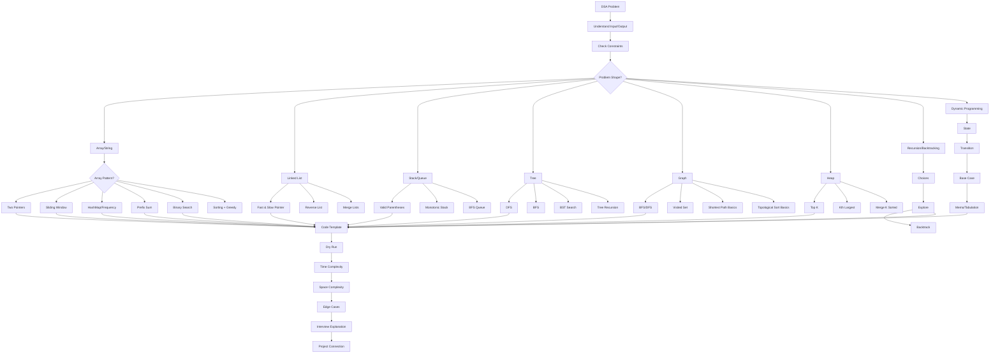

---

# 3. One-Line Mental Shortcut

## DSA shortcut

```text
DSA = Problem Shape → Constraints → Pattern → Data Structure → Template → Dry Run → Complexity → Edge Cases
```

Or even shorter:

```text
DSA = Identify Pattern → Apply Template → Explain Complexity
```

For interview speaking:

```text
First I understand constraints, then choose the right pattern, implement using suitable data structure, dry run edge cases, and explain time-space complexity.
```

---

# 4. Topic Breakdown Using Mental Model

| Mental Model Block | Meaning                                                     | Why It Is Important            | Project Usage                                                  | Interview Focus                      |
| ------------------ | ----------------------------------------------------------- | ------------------------------ | -------------------------------------------------------------- | ------------------------------------ |
| Problem Shape      | Identify if problem is array, string, tree, graph, DP, etc. | Decides the pattern quickly    | Search, filtering, pagination, tree category, dependency graph | “How did you identify the approach?” |
| Constraints        | Input size, time limit, memory limit                        | Helps reject brute force       | Large API result sets, DB result processing                    | O(n²) vs O(n log n) vs O(n)          |
| Pattern            | Reusable solving approach                                   | Reduces memorization           | Sliding window for rate limit, HashMap for lookup              | “Which pattern applies here?”        |
| Data Structure     | Array, Map, Set, Stack, Queue, Heap, Tree                   | Core tool for solving          | Caching, deduplication, queue processing                       | Internal working and complexity      |
| Template           | Standard code skeleton                                      | Makes coding faster            | Java implementation confidence                                 | Clean Java code                      |
| Dry Run            | Test with sample input                                      | Finds logic bugs               | Prevents production bugs                                       | Interviewer checks thought process   |
| Complexity         | Time and space analysis                                     | Shows seniority                | Performance of backend APIs                                    | Big-O explanation                    |
| Edge Cases         | Empty input, duplicates, overflow, nulls                    | Avoids wrong answers           | API validation and defensive coding                            | “What if input is empty?”            |
| Optimization       | Improve brute force                                         | Shows problem-solving maturity | Slow API optimization                                          | Brute force to optimal               |
| Project Connection | Relate DSA to backend work                                  | Validates experience           | REST, DB, microservices, caching                               | “Where have you used this?”          |

---

# 5. Visual Notes for Each Important Subtopic

## 5.1 General DSA Problem Solving Flow

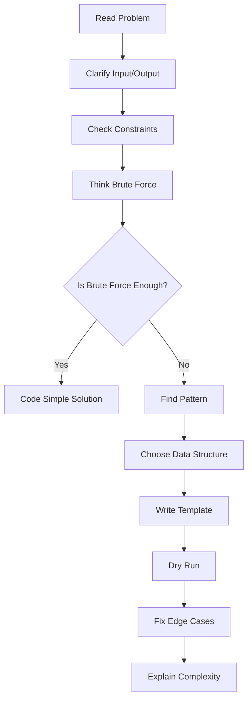

Interview line:

> “I usually start with brute force, check constraints, then optimize using the correct pattern.”

---

## 5.2 Pattern Decision Tree

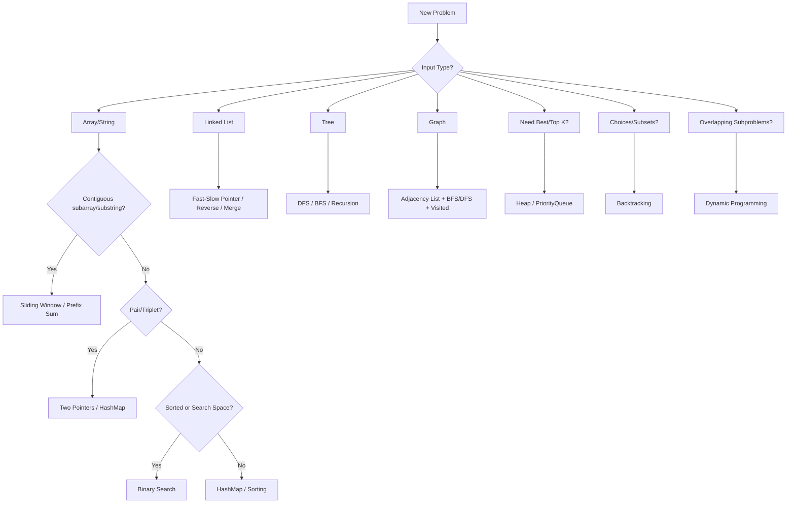

This is the most important diagram for DSA.

---

## 5.3 Arrays and Strings Mental Model

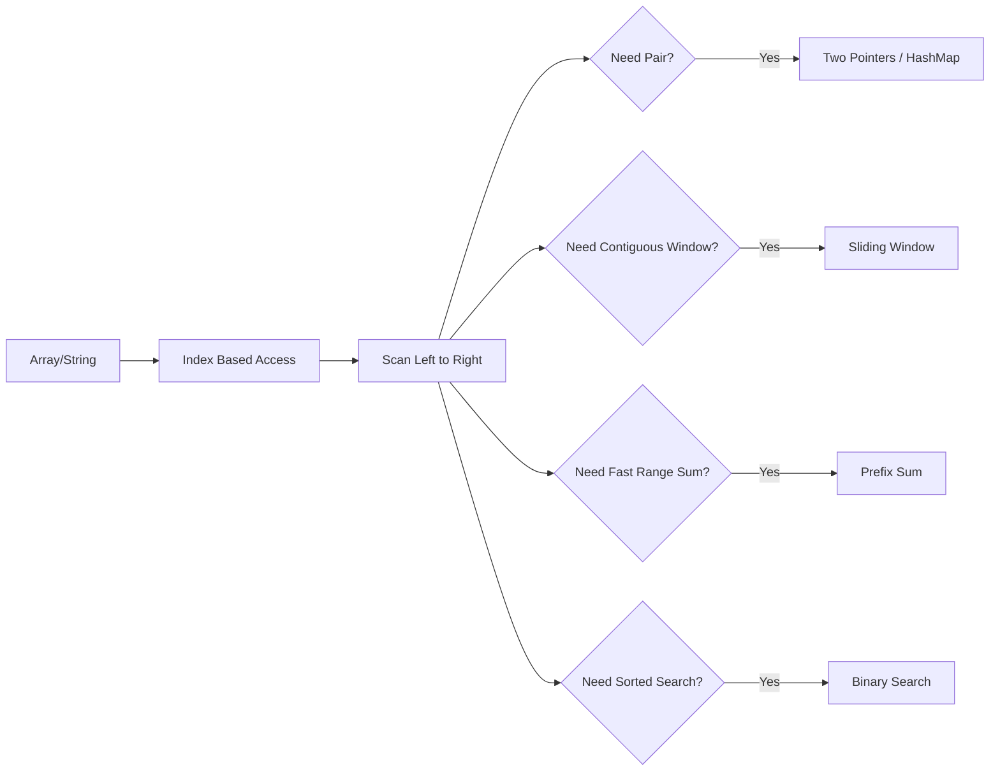

Must-code examples:

```text
Two Sum
Best Time to Buy and Sell Stock
Move Zeroes
Maximum Subarray
Longest Substring Without Repeating Characters
Subarray Sum Equals K
```

---

## 5.4 Two Pointers Flow

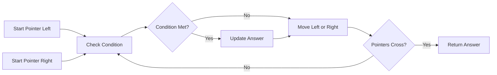

Used when:

```text
Sorted array
Pair sum
Palindrome
Reverse array/string
Remove duplicates
Container with most water
```

Mental shortcut:

```text
Two Pointers = Left + Right → Compare → Move smarter pointer
```

---

## 5.5 Sliding Window Flow

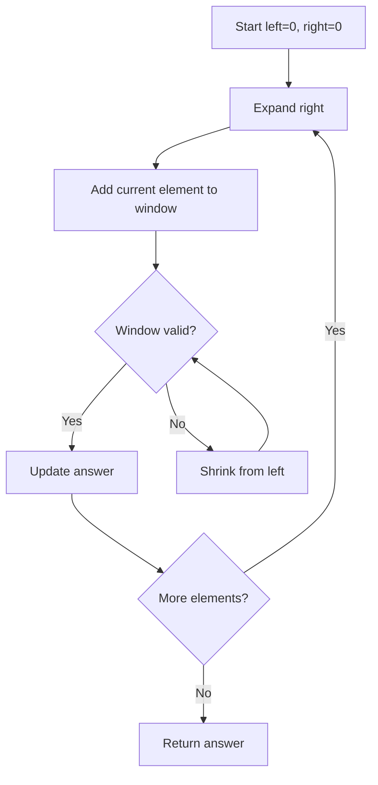

Used when:

```text
Longest substring
Maximum sum subarray of size K
Minimum window substring
Rate limiter logic
Contiguous subarray/substring problems
```

Backend project connection:

> Sliding window is also the mental model behind API rate limiting: maintain requests in a time window and reject if threshold exceeds.

---

## 5.6 HashMap / Frequency Map Flow

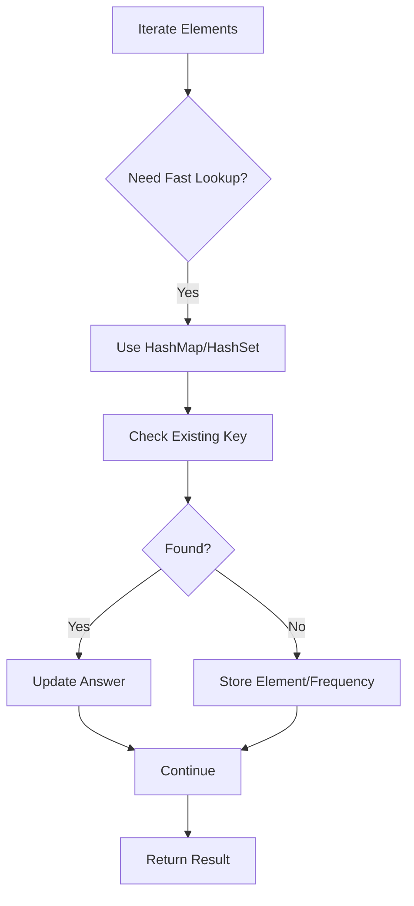

Used when:

```text
Two Sum
Anagram
Frequency count
Duplicates
Subarray sum
First non-repeating character
```

Project usage:

```text
Deduplicate records
Count category frequency
Group response data
Cache lookup
Token/session lookup
```

---

## 5.7 Prefix Sum Flow

```mermaid
flowchart TD
    A[Original Array] --> B[Build Running Sum]
    B --> C[Store prefixSum]
    C --> D[Range Query]
    D --> E[sum L to R = prefix[R] - prefix[L-1]]
```

Used when:

```text
Range sum
Subarray sum equals K
Count subarrays
Difference array
```

Mental shortcut:

```text
Prefix Sum = Convert repeated range calculation into O(1) lookup
```

---

## 5.8 Binary Search Flow

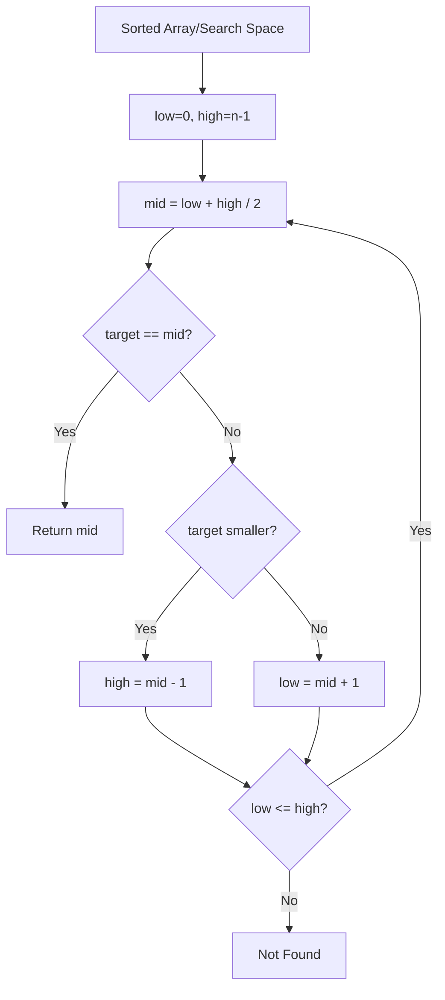

Used when:

```text
Sorted arrays
First/last occurrence
Search insert position
Minimum in rotated sorted array
Search on answer
```

Important interview point:

> Binary search is not only for arrays; it is also used when the answer space is monotonic.

---

## 5.9 Stack Flow

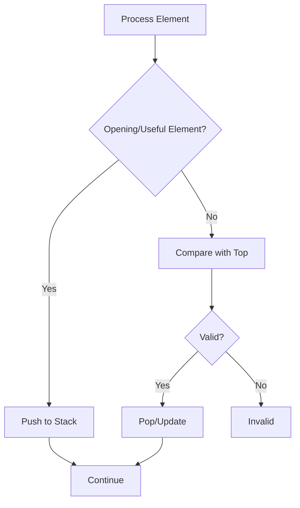

Used when:

```text
Valid parentheses
Next greater element
Min stack
Monotonic stack
Undo operations
Expression evaluation
```

Project usage:

```text
Function call stack
Undo/redo feature
Expression parsing
Nested JSON/XML validation
```

---

## 5.10 Queue / BFS Flow

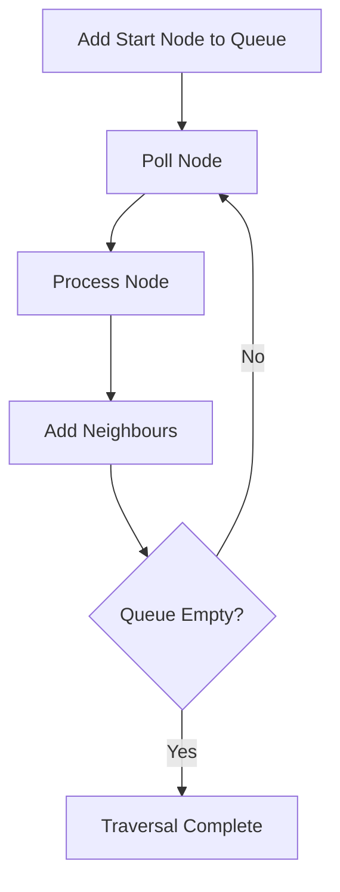

Used when:

```text
Level order traversal
Shortest path in unweighted graph
Message processing
Task scheduling
```

Microservices connection:

> Queue-based processing is similar to Kafka/SQS consumer flow: add work, consume work, process, retry/fail if needed.

---

## 5.11 Linked List Pointer Model

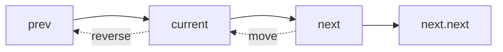

Important patterns:

```text
Reverse linked list
Detect cycle
Find middle
Merge two lists
Remove nth node from end
```

Mental shortcut:

```text
Linked List = Manage prev, current, next carefully
```

---

## 5.12 Tree DFS Model

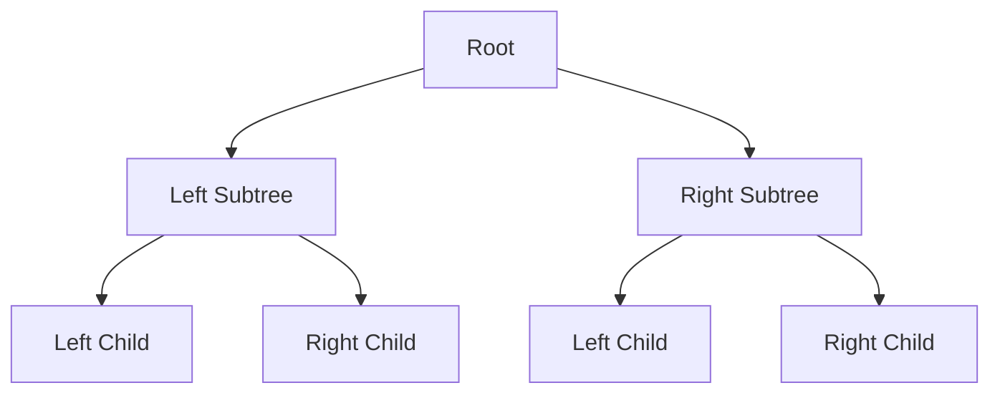

DFS traversal:

```text
Preorder  = Root → Left → Right
Inorder   = Left → Root → Right
Postorder = Left → Right → Root
```

Interview focus:

```text
Height of tree
Diameter
Balanced tree
Lowest common ancestor
BST validation
Path sum
```

---

## 5.13 Graph Traversal Model

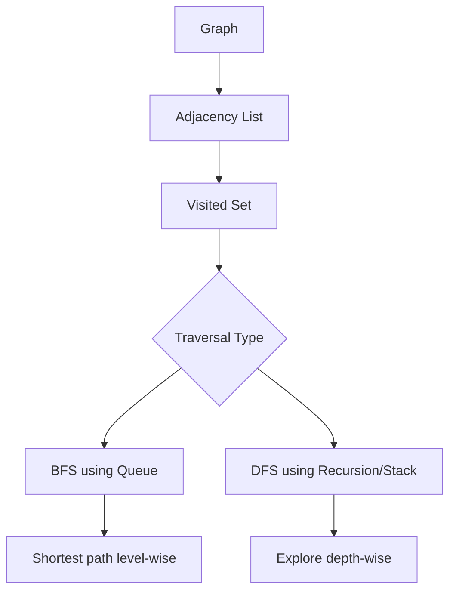

Must understand:

```text
Visited set prevents infinite loop
BFS is level-wise
DFS is depth-wise
Graph may be directed/undirected
Graph may have cycles
```

Project usage:

```text
Service dependency graph
User connection graph
Workflow dependency
Build pipeline dependency
```

---

## 5.14 Heap / PriorityQueue Model

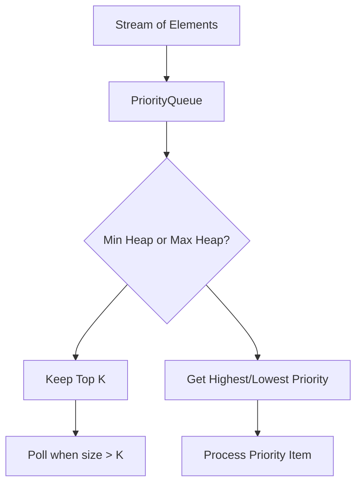

Used when:

```text
Top K frequent elements
Kth largest
Merge K sorted lists
Task scheduling
Priority processing
```

Java class:

```java
PriorityQueue<Integer> minHeap = new PriorityQueue<>();
PriorityQueue<Integer> maxHeap = new PriorityQueue<>((a, b) -> b - a);
```

---

## 5.15 Recursion / Backtracking Model

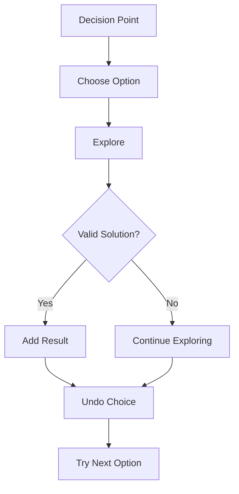

Used when:

```text
Subsets
Permutations
Combination Sum
N-Queens
Word search
Generate parentheses
```

Mental shortcut:

```text
Backtracking = Choose → Explore → Undo
```

---

## 5.16 Dynamic Programming Model

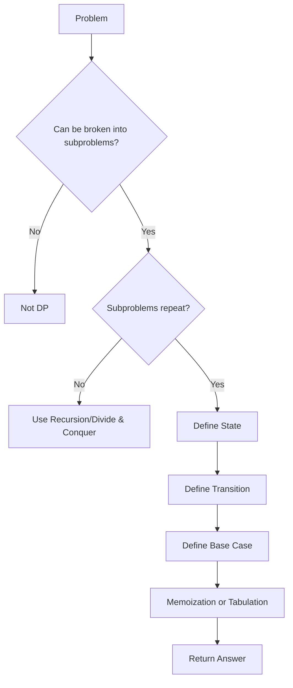

Mental shortcut:

```text
DP = State + Transition + Base Case + Memoization
```

Common beginner DP examples:

```text
Fibonacci
Climbing stairs
House robber
Coin change
Longest common subsequence
0/1 knapsack basics
```

For your current interview target, learn DP basics, not advanced hard DP first.

---

# 6. Theory Required Behind the Mental Model

## 6.1 Big-O Complexity

| Concept    | Simple Definition            | Why It Matters              | Interview Explanation                                | Project Example                            |
| ---------- | ---------------------------- | --------------------------- | ---------------------------------------------------- | ------------------------------------------ |
| O(1)       | Constant time                | Fastest                     | Accessing array index or HashMap lookup average case | Fetching cached user by key                |
| O(log n)   | Reduces search space by half | Efficient search            | Binary search                                        | Searching sorted data                      |
| O(n)       | Single pass                  | Usually acceptable          | Loop through list once                               | Filtering posts                            |
| O(n log n) | Sorting level complexity     | Common optimal for ordering | Merge sort, quick sort average                       | Sorting API response                       |
| O(n²)      | Nested loops                 | Dangerous for large data    | Pair comparison brute force                          | Comparing every post with every other post |
| O(2ⁿ)      | Exponential                  | Usually backtracking        | Subsets/permutations                                 | Avoid for large input                      |
| O(n!)      | Factorial                    | Very expensive              | Permutations                                         | Only small input                           |

Interview line:

> “I first check input size. If n is around 10⁵, O(n²) is risky, so I try O(n log n) or O(n).”

---

## 6.2 Arrays

Definition:

> Array is a contiguous memory structure with index-based access.

Why it matters:

```text
Fast access: O(1)
Insertion/deletion in middle: O(n)
Good for scanning and sorting
```

Java:

```java
int[] arr = new int[10];
```

Project example:

```text
Processing list of post IDs
Sorting comments
Pagination result processing
```

---

## 6.3 String

String in Java is immutable.

Why it matters:

```text
Repeated string concatenation creates new objects
Use StringBuilder for modification-heavy problems
```

Interview example:

```java
StringBuilder sb = new StringBuilder();
sb.append("abc");
```

Project example:

```text
Building slug from blog title
Validating request parameters
Parsing JWT token sections
```

---

## 6.4 HashMap and HashSet

Definition:

> HashMap stores key-value pairs for fast lookup.

Why it matters:

```text
Average lookup: O(1)
Worst case: O(log n) in Java 8+ for treeified buckets
Used for frequency, lookup, grouping, caching
```

Interview line:

> “I used HashMap because I needed constant-time lookup instead of scanning repeatedly.”

Project example:

```text
Map userId to user details
Deduplicate category names
Count post frequency by category
```

---

## 6.5 Stack

Definition:

> Stack follows LIFO: Last In First Out.

Used for:

```text
Parentheses
Undo
Recursion
Monotonic problems
```

Java:

```java
Deque<Character> stack = new ArrayDeque<>();
```

Prefer `ArrayDeque` over old `Stack`.

---

## 6.6 Queue

Definition:

> Queue follows FIFO: First In First Out.

Used for:

```text
BFS
Task scheduling
Message processing
```

Java:

```java
Queue<Integer> queue = new LinkedList<>();
```

Project example:

```text
Kafka/SQS style processing
Background jobs
Batch item processing
```

---

## 6.7 Recursion

Definition:

> Function calls itself with smaller input.

Required components:

```text
Base case
Recursive case
Progress toward base case
```

Risk:

```text
StackOverflowError if recursion is too deep
```

Interview line:

> “Tree problems naturally fit recursion because every subtree is itself a smaller tree.”

---

## 6.8 Dynamic Programming

Definition:

> DP is used when a problem has repeated subproblems and optimal substructure.

Steps:

```text
Define state
Define transition
Define base case
Store result
```

Interview line:

> “I chose DP because the recursive solution recalculates the same subproblems.”

---

## 6.9 Graphs

Definition:

> Graph has nodes and edges.

Core components:

```text
Adjacency list
Visited set
BFS/DFS
Cycle detection
```

Project example:

```text
Microservice dependency graph
Workflow pipeline
Build dependency
User relationship network
```

---

# 7. Code / Program Mapping

| Mental Model Concept | Code/Program Needed? | What To Implement                        | Why It Helps                       |
| -------------------- | -------------------- | ---------------------------------------- | ---------------------------------- |
| Two Pointers         | Yes                  | Pair sum / palindrome                    | Builds pointer confidence          |
| Sliding Window       | Yes                  | Longest substring / max sum              | Very common in interviews          |
| HashMap              | Yes                  | Two sum / frequency count                | Most used DSA tool                 |
| Prefix Sum           | Yes                  | Subarray sum equals K                    | Handles range/subarray problems    |
| Binary Search        | Yes                  | Search / lower bound                     | Must know for optimization         |
| Stack                | Yes                  | Valid parentheses                        | Easy but commonly asked            |
| Monotonic Stack      | Later                | Next greater element                     | Medium-level pattern               |
| Linked List          | Yes                  | Reverse / cycle detection                | Pointer handling                   |
| Tree DFS/BFS         | Yes                  | Max depth / level order                  | Core recursion and BFS             |
| Graph BFS/DFS        | Yes                  | Number of islands / connected components | Important for mid-level interviews |
| Heap                 | Yes                  | Top K frequent                           | Common backend-style problem       |
| DP Basics            | Yes                  | Climbing stairs / house robber           | Basic DP confidence                |
| Backtracking         | P1/P2                | Subsets / permutations                   | Asked but not always               |
| Advanced DP          | Later                | LCS / knapsack                           | Learn after core patterns          |

---

## 7.1 Two Sum Using HashMap

```java
import java.util.*;

public class TwoSum {
    public int[] twoSum(int[] nums, int target) {
        Map<Integer, Integer> map = new HashMap<>();

        for (int i = 0; i < nums.length; i++) {
            int required = target - nums[i];

            if (map.containsKey(required)) {
                return new int[]{map.get(required), i};
            }

            map.put(nums[i], i);
        }

        return new int[]{-1, -1};
    }
}
```

Mental model:

```text
For every number, check whether its required pair already exists.
```

Complexity:

```text
Time: O(n)
Space: O(n)
```

---

## 7.2 Two Pointers: Check Palindrome

```java
public class PalindromeCheck {
    public boolean isPalindrome(String s) {
        int left = 0;
        int right = s.length() - 1;

        while (left < right) {
            if (s.charAt(left) != s.charAt(right)) {
                return false;
            }
            left++;
            right--;
        }

        return true;
    }
}
```

Mental model:

```text
Compare both ends and move inward.
```

---

## 7.3 Sliding Window: Longest Substring Without Repeating Characters

```java
import java.util.*;

public class LongestSubstring {
    public int lengthOfLongestSubstring(String s) {
        Set<Character> set = new HashSet<>();
        int left = 0;
        int maxLength = 0;

        for (int right = 0; right < s.length(); right++) {
            char current = s.charAt(right);

            while (set.contains(current)) {
                set.remove(s.charAt(left));
                left++;
            }

            set.add(current);
            maxLength = Math.max(maxLength, right - left + 1);
        }

        return maxLength;
    }
}
```

Mental model:

```text
Expand right, shrink left when duplicate appears.
```

---

## 7.4 Prefix Sum: Subarray Sum Equals K

```java
import java.util.*;

public class SubarraySumEqualsK {
    public int subarraySum(int[] nums, int k) {
        Map<Integer, Integer> prefixCount = new HashMap<>();
        prefixCount.put(0, 1);

        int prefixSum = 0;
        int count = 0;

        for (int num : nums) {
            prefixSum += num;

            if (prefixCount.containsKey(prefixSum - k)) {
                count += prefixCount.get(prefixSum - k);
            }

            prefixCount.put(prefixSum, prefixCount.getOrDefault(prefixSum, 0) + 1);
        }

        return count;
    }
}
```

Mental model:

```text
If currentPrefix - oldPrefix = k, then subarray sum is k.
```

---

## 7.5 Binary Search Template

```java
public class BinarySearch {
    public int search(int[] nums, int target) {
        int low = 0;
        int high = nums.length - 1;

        while (low <= high) {
            int mid = low + (high - low) / 2;

            if (nums[mid] == target) {
                return mid;
            } else if (nums[mid] < target) {
                low = mid + 1;
            } else {
                high = mid - 1;
            }
        }

        return -1;
    }
}
```

Important line:

```java
int mid = low + (high - low) / 2;
```

Why?

```text
Avoids integer overflow compared to (low + high) / 2.
```

---

## 7.6 Stack: Valid Parentheses

```java
import java.util.*;

public class ValidParentheses {
    public boolean isValid(String s) {
        Deque<Character> stack = new ArrayDeque<>();

        for (char ch : s.toCharArray()) {
            if (ch == '(' || ch == '{' || ch == '[') {
                stack.push(ch);
            } else {
                if (stack.isEmpty()) {
                    return false;
                }

                char top = stack.pop();

                if ((ch == ')' && top != '(') ||
                    (ch == '}' && top != '{') ||
                    (ch == ']' && top != '[')) {
                    return false;
                }
            }
        }

        return stack.isEmpty();
    }
}
```

Mental model:

```text
Opening bracket waits in stack until matching closing bracket appears.
```

---

## 7.7 Linked List Reverse

```java
public class ReverseLinkedList {

    static class ListNode {
        int val;
        ListNode next;

        ListNode(int val) {
            this.val = val;
        }
    }

    public ListNode reverseList(ListNode head) {
        ListNode prev = null;
        ListNode current = head;

        while (current != null) {
            ListNode next = current.next;
            current.next = prev;
            prev = current;
            current = next;
        }

        return prev;
    }
}
```

Mental model:

```text
Save next → reverse pointer → move prev/current.
```

---

## 7.8 Tree DFS: Maximum Depth

```java
public class MaxDepthTree {

    static class TreeNode {
        int val;
        TreeNode left;
        TreeNode right;

        TreeNode(int val) {
            this.val = val;
        }
    }

    public int maxDepth(TreeNode root) {
        if (root == null) {
            return 0;
        }

        int leftDepth = maxDepth(root.left);
        int rightDepth = maxDepth(root.right);

        return 1 + Math.max(leftDepth, rightDepth);
    }
}
```

Mental model:

```text
Depth of tree = 1 + max depth of left and right subtree.
```

---

## 7.9 BFS: Level Order Traversal

```java
import java.util.*;

public class LevelOrderTraversal {

    static class TreeNode {
        int val;
        TreeNode left;
        TreeNode right;

        TreeNode(int val) {
            this.val = val;
        }
    }

    public List<List<Integer>> levelOrder(TreeNode root) {
        List<List<Integer>> result = new ArrayList<>();

        if (root == null) {
            return result;
        }

        Queue<TreeNode> queue = new LinkedList<>();
        queue.offer(root);

        while (!queue.isEmpty()) {
            int size = queue.size();
            List<Integer> level = new ArrayList<>();

            for (int i = 0; i < size; i++) {
                TreeNode node = queue.poll();
                level.add(node.val);

                if (node.left != null) {
                    queue.offer(node.left);
                }

                if (node.right != null) {
                    queue.offer(node.right);
                }
            }

            result.add(level);
        }

        return result;
    }
}
```

Mental model:

```text
Queue holds current level nodes.
```

---

## 7.10 Graph DFS

```java
import java.util.*;

public class GraphDFS {
    public void dfs(int node, Map<Integer, List<Integer>> graph, Set<Integer> visited) {
        if (visited.contains(node)) {
            return;
        }

        visited.add(node);
        System.out.println(node);

        for (int neighbour : graph.getOrDefault(node, new ArrayList<>())) {
            dfs(neighbour, graph, visited);
        }
    }
}
```

Mental model:

```text
Visit node → mark visited → visit neighbours.
```

---

## 7.11 Heap: Top K Largest Elements

```java
import java.util.*;

public class TopKLargest {
    public List<Integer> topK(int[] nums, int k) {
        PriorityQueue<Integer> minHeap = new PriorityQueue<>();

        for (int num : nums) {
            minHeap.offer(num);

            if (minHeap.size() > k) {
                minHeap.poll();
            }
        }

        return new ArrayList<>(minHeap);
    }
}
```

Mental model:

```text
Keep only K largest elements in min heap.
```

Complexity:

```text
Time: O(n log k)
Space: O(k)
```

---

## 7.12 DP: Climbing Stairs

```java
public class ClimbingStairs {
    public int climbStairs(int n) {
        if (n <= 2) {
            return n;
        }

        int first = 1;
        int second = 2;

        for (int i = 3; i <= n; i++) {
            int third = first + second;
            first = second;
            second = third;
        }

        return second;
    }
}
```

Mental model:

```text
Ways to reach step n = ways(n-1) + ways(n-2)
```

---

# 8. Project Usage Mapping

| Concept        | How I Can Use/Explain It In My Project                                     | Interview Line                                                                                                                     |
| -------------- | -------------------------------------------------------------------------- | ---------------------------------------------------------------------------------------------------------------------------------- |
| Array/List     | Used in REST responses like list of posts, comments, categories            | “In my blog application, API responses often return lists, and I handle filtering, sorting, and pagination on collections.”        |
| HashMap        | Useful for quick lookup, grouping, frequency counting, DTO mapping support | “For fast lookup and grouping logic, HashMap is useful because average access is O(1).”                                            |
| HashSet        | Used for uniqueness validation                                             | “For duplicate detection like unique category names or unique tags, Set-based lookup is efficient.”                                |
| Sorting        | Used in pagination and sorting posts by date/title                         | “Pagination and sorting are common in REST APIs, and internally sorting is usually O(n log n).”                                    |
| Binary Search  | Useful when searching sorted data or optimizing monotonic answers          | “Although DB handles most search, binary search is useful when working with sorted in-memory data.”                                |
| Sliding Window | Can explain rate limiter in API Gateway/microservices                      | “Sliding window is useful in rate limiting where requests are tracked within a time window.”                                       |
| Queue          | Similar to async processing and Kafka consumer model                       | “Queue follows FIFO and is similar to how background jobs or message consumers process events.”                                    |
| Stack          | Useful for nested validation and function call understanding               | “Stack is useful for problems like valid parentheses and also helps understand recursion internally.”                              |
| Tree           | Category/subcategory hierarchy                                             | “If categories become hierarchical, tree traversal can be used to fetch parent-child category structures.”                         |
| Graph          | Microservice dependency graph                                              | “In microservices, service dependencies can be visualized as a graph where services are nodes and calls are edges.”                |
| BFS/DFS        | Service dependency traversal or category tree traversal                    | “DFS/BFS helps when we need to traverse connected components or hierarchical structures.”                                          |
| Heap           | Top posts, top categories, top K search results                            | “For top K style problems, PriorityQueue is better than sorting entire data.”                                                      |
| DP             | Less direct in CRUD apps, but useful in optimization problems              | “DP is more common in algorithmic interviews than typical CRUD code, but I understand it using state and transition.”              |
| Complexity     | API performance discussion                                                 | “As a backend developer, I always consider whether logic is O(n), O(n log n), or O(n²), especially for large response processing.” |

---

# 9. Scenario-Based Mental Models

## Scenario 1: Given an array, find two numbers with target sum

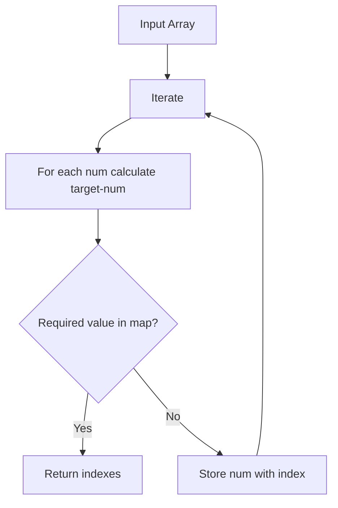

| Part                  | Explanation                                                                |
| --------------------- | -------------------------------------------------------------------------- |
| Flow                  | Iterate once, store visited numbers                                        |
| Problem               | Brute force takes O(n²)                                                    |
| Root Cause            | Checking every pair repeatedly                                             |
| Fix                   | Use HashMap for O(1) lookup                                                |
| Interview Explanation | “I optimized pair search using HashMap, reducing time from O(n²) to O(n).” |

---

## Scenario 2: Longest substring without duplicate characters

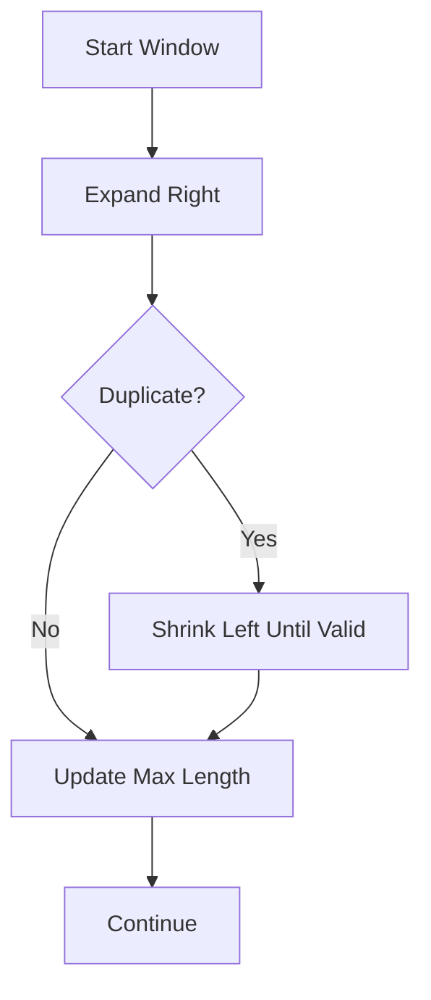

| Part                  | Explanation                                                                 |
| --------------------- | --------------------------------------------------------------------------- |
| Flow                  | Maintain valid window                                                       |
| Problem               | Rechecking substrings is expensive                                          |
| Root Cause            | Brute force generates many substrings                                       |
| Fix                   | Sliding window                                                              |
| Interview Explanation | “Since the problem asks for a contiguous substring, I used sliding window.” |

---

## Scenario 3: Search in sorted data

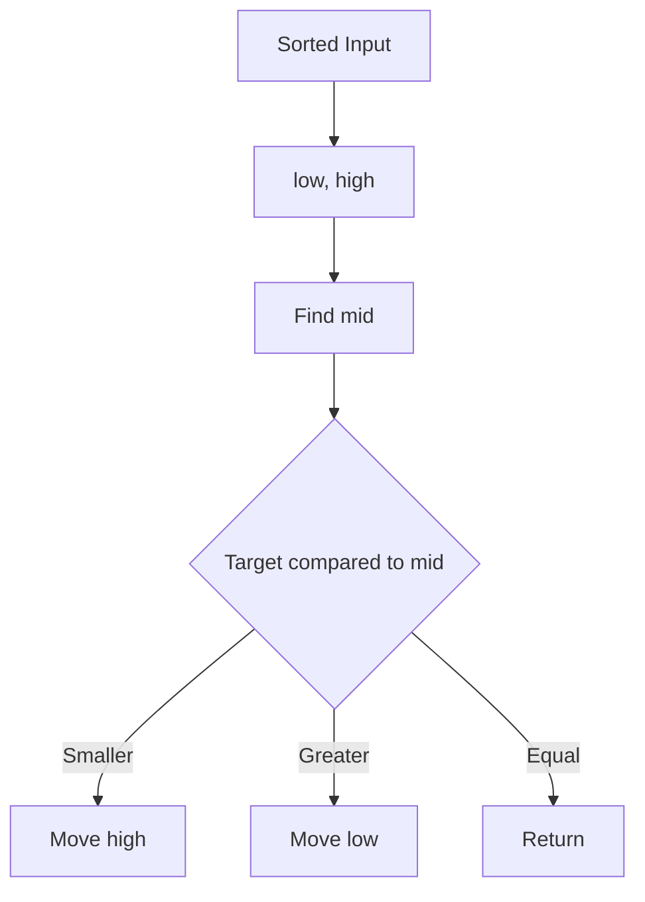

| Part                  | Explanation                                                                  |
| --------------------- | ---------------------------------------------------------------------------- |
| Flow                  | Divide search space                                                          |
| Problem               | Linear search is O(n)                                                        |
| Root Cause            | Not using sorted property                                                    |
| Fix                   | Binary search                                                                |
| Interview Explanation | “Because the input is sorted, binary search reduces complexity to O(log n).” |

---

## Scenario 4: API rate limiter using sliding window

```mermaid
flowchart TD
    A[Incoming Request] --> B[Get User/IP Key]
    B --> C[Fetch Request Timestamps]
    C --> D[Remove Old Timestamps]
    D --> E{Count within window < limit?}
    E -- Yes --> F[Allow Request]
    E -- No --> G[Reject 429]
```

| Part                  | Explanation                                                                                             |
| --------------------- | ------------------------------------------------------------------------------------------------------- |
| Flow                  | Track requests within time window                                                                       |
| Problem               | Too many requests overload API                                                                          |
| Root Cause            | No throttling                                                                                           |
| Fix                   | Sliding window / token bucket                                                                           |
| Interview Explanation | “For API rate limiting, sliding window keeps requests within a time window and rejects extra requests.” |

---

## Scenario 5: Find cycle in linked list

```mermaid
flowchart TD
    A[Start slow=head, fast=head] --> B[slow moves 1 step]
    B --> C[fast moves 2 steps]
    C --> D{slow == fast?}
    D -- Yes --> E[Cycle Exists]
    D -- No --> F{fast reaches null?}
    F -- Yes --> G[No Cycle]
    F -- No --> B
```

| Part                  | Explanation                                                                                   |
| --------------------- | --------------------------------------------------------------------------------------------- |
| Flow                  | Fast pointer catches slow pointer if cycle exists                                             |
| Problem               | Infinite traversal possible                                                                   |
| Root Cause            | Linked list may point back                                                                    |
| Fix                   | Floyd cycle detection                                                                         |
| Interview Explanation | “I used fast and slow pointer because if a cycle exists, both pointers will eventually meet.” |

---

## Scenario 6: Category hierarchy traversal

```mermaid
flowchart TD
    A[Root Category] --> B[Child Category 1]
    A --> C[Child Category 2]
    B --> D[Subcategory]
    C --> E[Subcategory]
```

| Part                  | Explanation                                                                                                         |
| --------------------- | ------------------------------------------------------------------------------------------------------------------- |
| Flow                  | Traverse category tree                                                                                              |
| Problem               | Need parent-child hierarchy                                                                                         |
| Root Cause            | Flat category list is not enough                                                                                    |
| Fix                   | DFS/BFS traversal                                                                                                   |
| Interview Explanation | “If my blog categories become hierarchical, I can model them as a tree and use DFS/BFS to fetch nested categories.” |

---

## Scenario 7: Microservice dependency traversal

```mermaid
flowchart TD
    A[API Gateway] --> B[user-service]
    A --> C[post-service]
    C --> D[category-service]
    C --> E[file-service]
```

| Part                  | Explanation                                                                            |
| --------------------- | -------------------------------------------------------------------------------------- |
| Flow                  | Services call other services                                                           |
| Problem               | Need to understand dependency chain                                                    |
| Root Cause            | Multiple service interactions                                                          |
| Fix                   | Graph model                                                                            |
| Interview Explanation | “In microservices, services can be modeled as graph nodes, and dependencies as edges.” |

---

## Scenario 8: Top K most viewed posts

```mermaid
flowchart TD
    A[Post View Counts] --> B[Min Heap of size K]
    B --> C{Heap size > K?}
    C -- Yes --> D[Remove smallest]
    C -- No --> E[Continue]
    D --> E
    E --> F[Top K Posts]
```

| Part                  | Explanation                                                                          |
| --------------------- | ------------------------------------------------------------------------------------ |
| Flow                  | Maintain only K top items                                                            |
| Problem               | Sorting all posts may be unnecessary                                                 |
| Root Cause            | Need only top K, not full order                                                      |
| Fix                   | PriorityQueue                                                                        |
| Interview Explanation | “For top K problems, I use heap to reduce complexity from O(n log n) to O(n log k).” |

---

## Scenario 9: DP problem like climbing stairs

```mermaid
flowchart TD
    A[Step n] --> B[Can come from n-1]
    A --> C[Can come from n-2]
    B --> D[ways n-1]
    C --> E[ways n-2]
    D --> F[ways n = ways n-1 + ways n-2]
    E --> F
```

| Part                  | Explanation                                                                          |
| --------------------- | ------------------------------------------------------------------------------------ |
| Flow                  | Current answer depends on previous answers                                           |
| Problem               | Recursion repeats calculations                                                       |
| Root Cause            | Overlapping subproblems                                                              |
| Fix                   | DP memoization/tabulation                                                            |
| Interview Explanation | “I used DP because the same subproblems are calculated multiple times in recursion.” |

---

# 10. Debugging / Production Issue Flow

| Issue                               | Possible Cause                      | Where To Check              | Fix                                      | Interview Explanation                                              |
| ----------------------------------- | ----------------------------------- | --------------------------- | ---------------------------------------- | ------------------------------------------------------------------ |
| Code gives TLE                      | O(n²) or worse                      | Nested loops, constraints   | Use HashMap, sorting, two pointers, heap | “I checked constraints and optimized brute force.”                 |
| Memory Limit Exceeded               | Storing too much data               | Extra arrays/maps/recursion | Reduce space, use in-place logic         | “I optimized space from O(n) to O(1) where possible.”              |
| Wrong answer in sliding window      | Not shrinking window correctly      | left/right movement         | Maintain valid condition carefully       | “Sliding window needs a clear valid/invalid condition.”            |
| Binary search infinite loop         | Wrong low/high update               | mid calculation             | Ensure low/high always move              | “Binary search bugs usually come from boundary handling.”          |
| Stack empty error                   | Popping without checking            | Stack condition             | Check `isEmpty()` first                  | “Before popping, I validate stack state.”                          |
| NullPointerException in linked list | Accessing `next` without null check | Pointer movement            | Check current/fast/fast.next             | “Pointer problems require careful null checks.”                    |
| StackOverflowError                  | Deep recursion                      | Recursive function          | Use iterative BFS/DFS                    | “For deep trees/graphs, iterative approach avoids stack overflow.” |
| Duplicate processing in graph       | Missing visited set                 | BFS/DFS traversal           | Add visited set                          | “Visited set prevents cycles and repeated processing.”             |
| Wrong DP answer                     | Bad state/transition                | DP formula                  | Redefine state clearly                   | “DP should start with state definition.”                           |
| Slow top K solution                 | Sorting all data                    | Sorting logic               | Use heap                                 | “Heap is better when only top K results are needed.”               |

---

# 11. 60–70% Most Important Interview Coverage

| Priority | Topic              | Mental Model Needed        | Code Needed | Scenario Needed                 | Interview Weight |
| -------- | ------------------ | -------------------------- | ----------- | ------------------------------- | ---------------- |
| P0       | Big-O Complexity   | Constraint → complexity    | Yes         | TLE optimization                | Very High        |
| P0       | Arrays             | Scan/index model           | Yes         | Filtering, max/min, duplicates  | Very High        |
| P0       | Strings            | Character scan             | Yes         | Palindrome, substring           | Very High        |
| P0       | HashMap/HashSet    | Fast lookup/frequency      | Yes         | Two Sum, Anagram                | Very High        |
| P0       | Two Pointers       | Left-right movement        | Yes         | Pair sum, palindrome            | Very High        |
| P0       | Sliding Window     | Expand-shrink window       | Yes         | Longest substring, rate limiter | Very High        |
| P0       | Binary Search      | Divide search space        | Yes         | Sorted search, search on answer | High             |
| P0       | Stack/Queue        | LIFO/FIFO processing       | Yes         | Parentheses, BFS                | High             |
| P0       | Linked List        | prev-current-next          | Yes         | Reverse, cycle                  | High             |
| P1       | Tree DFS/BFS       | Recursive traversal        | Yes         | Category hierarchy              | High             |
| P1       | Graph BFS/DFS      | Node-edge-visited          | Yes         | Service dependencies            | Medium-High      |
| P1       | Heap/PriorityQueue | Top K priority model       | Yes         | Top viewed posts                | Medium-High      |
| P1       | Recursion          | Base case + recursive case | Yes         | Tree recursion                  | Medium           |
| P1       | DP Basics          | State-transition           | Yes         | Climbing stairs, house robber   | Medium           |
| P2       | Backtracking       | Choose-explore-undo        | Yes         | Subsets/permutations            | Medium           |
| P2       | Greedy             | Local best choice          | Yes         | Intervals, jump game            | Medium           |
| P2       | Trie               | Prefix tree                | Later       | Search autocomplete             | Low-Medium       |
| P3       | Segment Tree       | Range query tree           | Later       | Advanced range queries          | Low              |
| P3       | Advanced Graph     | Dijkstra, Union Find       | Later       | Network/path problems           | Low-Medium       |
| P3       | Advanced DP        | LCS, knapsack variants     | Later       | Hard problems                   | Low-Medium       |

## For your immediate interview preparation

Focus this order:

```text
1. Big-O
2. Array/String
3. HashMap/HashSet
4. Two Pointers
5. Sliding Window
6. Binary Search
7. Stack/Queue
8. Linked List
9. Trees
10. Graph basics
11. Heap
12. Basic DP
```

This will cover most mid-level Java backend DSA rounds.

---

# 12. Revision Format

## Master shortcut

```text
DSA = Problem Shape → Constraints → Pattern → Data Structure → Template → Dry Run → Complexity → Edge Cases
```

---

## 5 key diagrams to memorize

### 1. Pattern decision tree

```text
Array/String?
  → Pair? Two pointers/HashMap
  → Contiguous? Sliding Window/Prefix Sum
  → Sorted? Binary Search
  → Frequency? HashMap
Tree?
  → DFS/BFS
Graph?
  → BFS/DFS + visited
Top K?
  → Heap
Repeating subproblems?
  → DP
Choices?
  → Backtracking
```

### 2. Sliding window

```text
right expands → add element → invalid? shrink left → update answer
```

### 3. Binary search

```text
low/high → mid → compare → discard half
```

### 4. DFS/BFS

```text
DFS = Go deep
BFS = Go level by level
```

### 5. DP

```text
State → Transition → Base Case → Memo/Tabulation
```

---

## 10 must-remember points

1. Always check constraints before choosing approach.
2. Brute force is okay to explain first, but optimize quickly.
3. HashMap reduces repeated lookup.
4. Sliding window works for contiguous subarray/substring.
5. Two pointers often needs sorted input or opposite-end movement.
6. Binary search needs sorted data or monotonic answer space.
7. BFS uses queue; DFS uses recursion or stack.
8. Graph traversal needs visited set.
9. DP needs repeated subproblems.
10. Always explain time and space complexity.

---

## 10 common interview lines

1. “I will first clarify input, output, and constraints.”
2. “The brute force approach would be O(n²), but we can optimize it.”
3. “Since we need fast lookup, I will use HashMap.”
4. “Since the problem asks for contiguous substring, sliding window fits here.”
5. “Since the array is sorted, binary search is better.”
6. “For top K elements, heap is more efficient than sorting everything.”
7. “For tree traversal, DFS is natural because each subtree is a smaller problem.”
8. “For graph traversal, I will maintain a visited set to avoid cycles.”
9. “This problem has overlapping subproblems, so DP can be applied.”
10. “The final complexity is O(n) time and O(n) space.”

---

## 10 common mistakes

1. Jumping to code without understanding constraints.
2. Not explaining brute force.
3. Forgetting edge cases.
4. Wrong binary search boundary.
5. Not moving sliding window left pointer correctly.
6. Using `Stack` instead of `ArrayDeque`.
7. Forgetting visited set in graph.
8. Not checking null in linked list.
9. Confusing subsequence and substring.
10. Not explaining space complexity.

---

## 5 debugging flows

```text
TLE → Check nested loops → Use map/window/sorting/binary search
Wrong binary search → Check low/high/mid update
Sliding window wrong → Define valid window condition
Graph infinite loop → Add visited set
DP wrong → Redefine state and transition
```

---

## 5 project explanation points

1. “In my Spring Boot APIs, I use collections like List, Map, and Set for response processing.”
2. “For pagination and sorting, understanding sorting and complexity helps.”
3. “For duplicate validation, HashSet/HashMap-based lookup is efficient.”
4. “For microservice dependencies, graph traversal is a useful mental model.”
5. “For API rate limiting, sliding window is a practical DSA concept.”

---

# 13. Interview Answer Templates

## Answer 1: General DSA approach

> “I usually start by understanding the input, output, and constraints. Then I think of a brute force approach and check if it fits the constraints. If not, I identify the pattern, like HashMap, sliding window, two pointers, binary search, DFS, BFS, heap, or DP. After that, I write clean Java code, dry run it with edge cases, and explain time and space complexity.”

---

## Answer 2: HashMap usage

> “As per my project experience, HashMap is useful when we need fast lookup or grouping. In interview problems like Two Sum or frequency count, HashMap avoids repeated scanning and reduces time complexity from O(n²) to O(n). In backend applications, the same idea is useful for lookup, deduplication, grouping DTOs, or caching-like behavior.”

---

## Answer 3: Sliding window

> “The flow starts from maintaining a window using left and right pointers. I expand the right pointer to include new elements. If the window becomes invalid, I shrink it from the left. This is useful for contiguous subarray or substring problems. In production systems, a similar concept is used in API rate limiting where we track requests inside a time window.”

---

## Answer 4: Binary search

> “If the input is sorted or the answer space is monotonic, I prefer binary search. It reduces the search space by half in every step, so the complexity becomes O(log n). I also take care of boundary conditions and calculate mid using `low + (high - low) / 2` to avoid overflow.”

---

## Answer 5: Stack

> “Stack is useful when the latest element needs to be processed first. For example, in valid parentheses, every opening bracket is pushed, and when a closing bracket comes, it should match the top of the stack. In Java, I prefer `ArrayDeque` over legacy `Stack`.”

---

## Answer 6: Tree traversal

> “For tree problems, I usually think recursively. A tree is naturally divided into root, left subtree, and right subtree. For DFS, recursion is clean. For level-wise traversal, I use BFS with a queue. If categories in my blog application become hierarchical, the same tree traversal model can be used.”

---

## Answer 7: Graph traversal

> “In graph problems, I represent connections using an adjacency list and maintain a visited set to avoid cycles. BFS is useful for level-wise or shortest path in unweighted graphs, while DFS is useful for deep traversal and connected components. In microservices, service dependencies can also be visualized as a graph.”

---

## Answer 8: Heap / PriorityQueue

> “When we need top K elements, sorting the full list is not always required. A heap can maintain only K elements and reduce complexity to O(n log k). In Java, I use `PriorityQueue`. For example, top viewed posts or top frequent categories can be solved using this approach.”

---

## Answer 9: DP

> “I identify DP when the problem has overlapping subproblems and optimal substructure. My first step is to define the state, then the transition, then base cases. For example, in climbing stairs, ways to reach step n depends on ways to reach n-1 and n-2.”

---

## Answer 10: Project + DSA connection

> “In my Spring Boot blog application, most DSA concepts appear through collections, filtering, sorting, pagination, duplicate checks, and lookup operations. In the planned microservices version, graph thinking helps explain service dependencies, queue thinking helps explain async processing, and sliding window helps explain rate limiting.”

---

# 14. Final Learning Strategy

## Step 1: First memorize the master diagram

Memorize this:

```text
Problem → Constraints → Pattern → Data Structure → Template → Dry Run → Complexity → Edge Cases
```

And this:

```text
Array/String → HashMap / Two Pointers / Sliding Window / Prefix Sum / Binary Search
Tree → DFS/BFS
Graph → BFS/DFS + visited
Top K → Heap
Choices → Backtracking
Repeated subproblem → DP
```

---

## Step 2: Then understand each block

Do not start with 300 LeetCode questions.

Start with patterns:

```text
1. HashMap
2. Two Pointers
3. Sliding Window
4. Prefix Sum
5. Binary Search
6. Stack/Queue
7. Linked List
8. Tree DFS/BFS
9. Graph BFS/DFS
10. Heap
11. Basic DP
12. Backtracking
```

---

## Step 3: Then write small programs

First code these 20 problems/templates:

| Pattern        | Problems to Code First                                       |
| -------------- | ------------------------------------------------------------ |
| HashMap        | Two Sum, Valid Anagram, First Unique Character               |
| Two Pointers   | Palindrome, Move Zeroes, Remove Duplicates                   |
| Sliding Window | Longest Substring Without Repeating, Max Sum Subarray Size K |
| Prefix Sum     | Subarray Sum Equals K                                        |
| Binary Search  | Binary Search, First/Last Occurrence                         |
| Stack          | Valid Parentheses, Min Stack                                 |
| Linked List    | Reverse List, Detect Cycle                                   |
| Tree           | Max Depth, Level Order Traversal, Validate BST               |
| Graph          | Number of Islands, Connected Components                      |
| Heap           | Kth Largest, Top K Frequent                                  |
| DP             | Climbing Stairs, House Robber                                |
| Backtracking   | Subsets, Permutations                                        |

---

## Step 4: Connect with project examples

For every pattern, prepare one project line.

Example:

```text
HashMap → fast lookup/deduplication
Sliding Window → rate limiting
Queue → async processing/Kafka model
Tree → category hierarchy
Graph → microservice dependencies
Heap → top K posts/categories
Sorting → pagination/sorting APIs
Complexity → slow API optimization
```

---

## Step 5: Practice scenario questions

Practice explaining:

```text
Why HashMap?
Why sliding window?
Why binary search?
Why heap instead of sorting?
Why visited set in graph?
Why DP here?
What is the time complexity?
What are edge cases?
How will this fail?
How will you optimize?
```

---

## Step 6: Revise using shortcuts

Daily quick revision:

```text
15 min: Pattern decision tree
30 min: 2 problems
15 min: Dry run + complexity explanation
10 min: Project connection lines
```

---

# What to learn first

Start with:

```text
Big-O
Array/String
HashMap
Two Pointers
Sliding Window
Binary Search
Stack/Queue
Linked List
Tree BFS/DFS
```

This is enough to start most Java backend interviews.

---

# What to code first

Code these first:

```text
Two Sum
Valid Anagram
Longest Substring Without Repeating Characters
Binary Search
Valid Parentheses
Reverse Linked List
Detect Cycle
Max Depth of Binary Tree
Level Order Traversal
Top K Frequent Elements
Climbing Stairs
```

---

# What to skip initially

Skip these in the beginning:

```text
Segment Tree
Fenwick Tree
Advanced DP
Hard graph algorithms
Trie advanced problems
Bitmask DP
Advanced math problems
Competitive programming tricks
```

---

# What is enough to start interviews

For Java Backend / Full Stack Java roles, you are interview-ready for DSA basics when you can confidently do:

```text
Array/String: easy-medium
HashMap: easy-medium
Sliding Window: medium basics
Two Pointers: easy-medium
Binary Search: easy-medium
Stack/Queue: easy-medium
Linked List: easy-medium
Tree BFS/DFS: easy-medium
Graph BFS/DFS: basic-medium
Heap: basic top K
DP: basic 1D DP
```

You do not need FAANG-level hard DSA before starting interviews for most mid-range product/service-plus-product companies.

---

# What to continue later in parallel

After interviews start, continue:

```text
Advanced DP
Backtracking medium
Graph topological sort
Dijkstra basics
Union Find
Trie
System design + DSA mixed scenarios
Java collection internals
Concurrency-related coding
```

---

# Final DSA Mental Model Summary

```text
DSA is not memorizing problems.

DSA is:

1. Recognize problem shape
2. Identify constraints
3. Select pattern
4. Choose data structure
5. Apply template
6. Dry run
7. Explain complexity
8. Handle edge cases
9. Connect to real backend usage
```

For your profile, speak like this:

> “As a Java backend developer, I approach DSA from a practical optimization perspective. I first check constraints, then choose the right data structure or pattern. In real projects, these same ideas appear in API filtering, pagination, deduplication, caching, rate limiting, queue processing, category hierarchy, and microservice dependency flows.”
