# MySQL Mental Model for Java Backend Interviews

---

## 1. Best Mental Model for This Technology

MySQL is best understood through a combination of four connected models:

1. **Query execution pipeline**
2. **Index and storage structure**
3. **Transaction and concurrency flow**
4. **Production architecture and troubleshooting flow**

The primary mental model is:

> **Application Request → Connection Pool → SQL Parser → Optimizer → Execution Plan → Index/Table Access → Transaction/MVCC/Locks → Storage → Result**

### Why this model suits MySQL

MySQL interview questions are rarely isolated theory questions. Most questions eventually become:

* How does MySQL execute this query?
* Why is this query slow?
* Why is the index not being used?
* What happens during a transaction?
* What happens when two requests update the same row?
* How do you prevent duplicate records?
* Why did a deadlock occur?
* How would this database behave under high traffic?
* How is this handled from Spring Boot/JPA?

Therefore, MySQL should not be memorized as a list of SQL commands. It should be visualized as the **journey of a query through the database**.

### The four-layer MySQL mental model

```text
Layer 1: Application Integration
REST API → Service → Repository/JPA → JDBC → Connection Pool

Layer 2: Query Processing
Connection → Parser → Optimizer → Execution Plan → Executor

Layer 3: Data and Concurrency
Indexes → Pages → Buffer Pool → MVCC → Locks → Transactions

Layer 4: Production Operations
Replication → Backup → Monitoring → Scaling → Recovery
```

For a seven-year Java developer, the expected level is not only:

> “I know JOIN and GROUP BY.”

The expected level is:

> “I can design the schema, select appropriate indexes, understand the execution plan, define transaction boundaries, identify concurrency risks, and troubleshoot slow or blocked queries.”

---

# 2. Master Mental Model Diagram

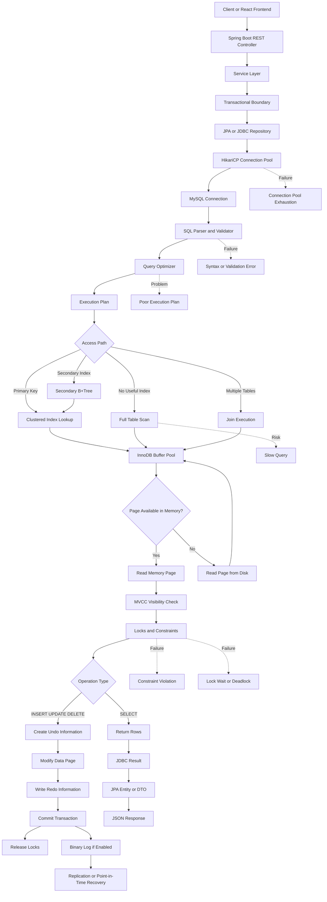

## How to explain this diagram in an interview

> “In a Spring Boot application, a request reaches the service and repository layer. The application borrows a database connection from HikariCP and sends SQL to MySQL. MySQL parses and validates the query, and the optimizer creates an execution plan. The executor then chooses an access path such as a primary-key lookup, secondary-index lookup, range scan, join, or full scan. In InnoDB, pages are normally accessed through the buffer pool. MVCC decides which row version is visible, while locks and constraints maintain consistency. For write operations, undo and redo information support rollback, concurrency and durability. After commit, the connection is returned to the pool and the result is mapped to an entity or DTO.”

---

# 3. One-Line Mental Shortcut

> **MySQL = Connection → Parse → Optimize → Index/Scan → MVCC/Lock → Read/Write → Commit → Result**

A more detailed shortcut:

> **Spring Request → HikariCP → SQL → Optimizer → Execution Plan → B+Tree/Page → Transaction/Lock → InnoDB → Response**

For performance questions:

> **Slow SQL = Query Shape → Index → Execution Plan → Rows Scanned → Locks → I/O**

For transaction questions:

> **Transaction = Begin → Read/Modify → MVCC/Locks → Undo/Redo → Commit/Rollback**

---

# 4. Topic Breakdown Using the Mental Model

| Mental Model Block    | Meaning                                           | Why It Is Important                                                      | Project Usage                                | Interview Focus                           |
| --------------------- | ------------------------------------------------- | ------------------------------------------------------------------------ | -------------------------------------------- | ----------------------------------------- |
| Schema design         | Tables, columns, relationships and constraints    | Incorrect design causes duplication, inconsistency and difficult queries | Users, posts, categories and comments tables | Normalization, PK, FK, unique constraints |
| Connection management | Application-to-database connections               | Creating a new physical connection for every request is expensive        | Spring Boot uses HikariCP                    | Pool sizing, timeout, connection leak     |
| SQL parser            | Validates SQL syntax, tables and columns          | Invalid SQL fails before execution                                       | Repository queries and native SQL            | Syntax errors, invalid columns            |
| Query optimizer       | Selects an execution strategy                     | The same SQL can have different performance depending on its plan        | Post search, filtering and pagination        | Cost-based optimization, statistics       |
| Execution plan        | Describes how tables and indexes will be accessed | Main tool for diagnosing slow queries                                    | `EXPLAIN` on post listing queries            | Access type, key, rows, filtered, Extra   |
| Primary index         | Identifies rows and organizes InnoDB data         | Efficient lookup and relationship reference                              | `users.id`, `posts.id`                       | Clustered index behavior                  |
| Secondary index       | Provides alternate lookup path                    | Prevents scanning every record                                           | Email, category, author and date indexes     | Composite and covering indexes            |
| Join processing       | Combines related tables                           | Most business queries use multiple entities                              | Posts with user/category/comments            | Join types and indexed join columns       |
| Aggregation           | Summarizes multiple rows                          | Required for reporting and dashboards                                    | Post count by category                       | `GROUP BY`, `HAVING`, aggregate functions |
| Transactions          | Treats multiple statements as one unit            | Prevents partial business operations                                     | Create post, update category count, audit    | ACID and transaction boundaries           |
| MVCC                  | Maintains multiple row versions                   | Allows consistent reads with less blocking                               | Concurrent reads and updates                 | Isolation and snapshots                   |
| Locks                 | Protects conflicting data changes                 | Prevents inconsistent writes                                             | Concurrent update/delete of posts            | Row locks, gap locks, deadlocks           |
| Constraints           | Database-level validation                         | Protects data even when application validation fails                     | Unique email, non-null title, valid FK       | PK, FK, UNIQUE, CHECK                     |
| Redo and undo         | Recovery and rollback information                 | Supports durability, rollback and MVCC                                   | Internal InnoDB transaction handling         | Difference between redo, undo and binlog  |
| Binary log            | Records logical database changes                  | Supports replication and point-in-time recovery                          | Production backup/replication architecture   | Binlog versus redo log                    |
| Pagination            | Retrieves data in pages                           | Prevents loading an entire table                                         | Blog post listing                            | Offset versus keyset pagination           |
| Replication           | Copies changes to another server                  | Read scaling and availability                                            | Future production architecture               | Replication lag and stale reads           |
| Backup/recovery       | Restores data after failure                       | Replication is not a backup                                              | AWS-hosted MySQL recovery strategy           | Full backup plus binlog                   |
| Monitoring            | Observes slow queries, locks and connections      | Required for production troubleshooting                                  | Actuator plus DB monitoring                  | Slow query log, performance schema        |

---

# 5. Visual Notes for Each Important Subtopic

## 5.1 Relational schema mental model

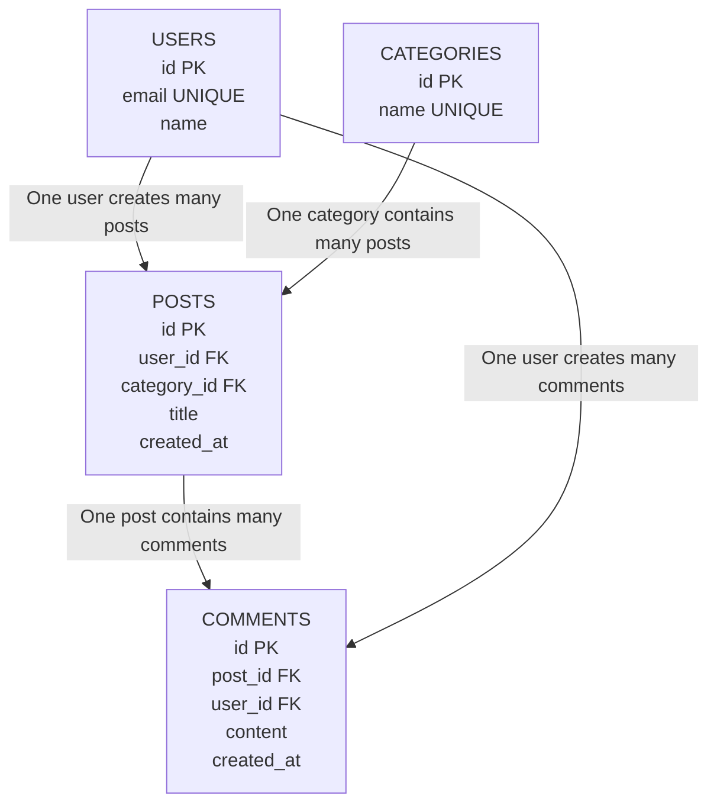

### Memory rule

```text
Entity relationship:
User 1 ---- N Post
Category 1 ---- N Post
Post 1 ---- N Comment
User 1 ---- N Comment
```

### Interview focus

* Primary and foreign keys
* One-to-many relationships
* Unique constraints
* Cascading behavior
* Indexing foreign keys
* Preventing orphan data

---

## 5.2 Query execution flow

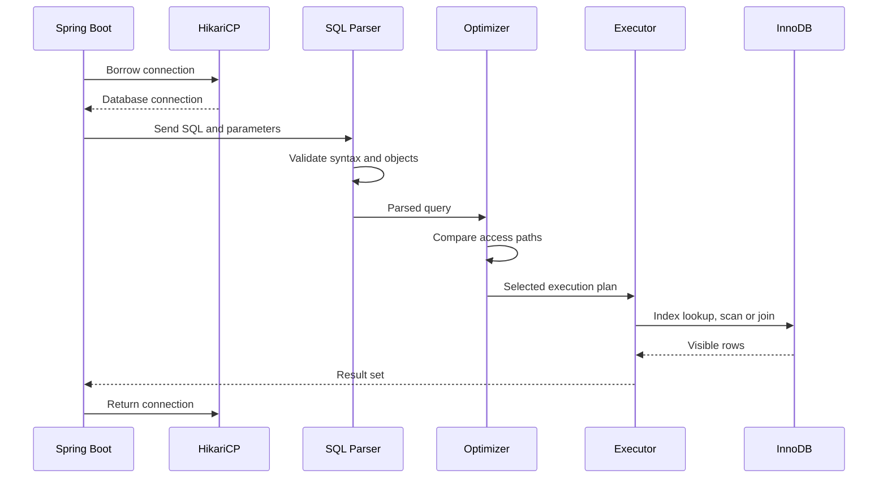

### Interview explanation

The optimizer does not directly return the data. It chooses the plan. The executor follows that plan and asks the storage engine to access the required rows and pages.

---

## 5.3 InnoDB primary and secondary index model

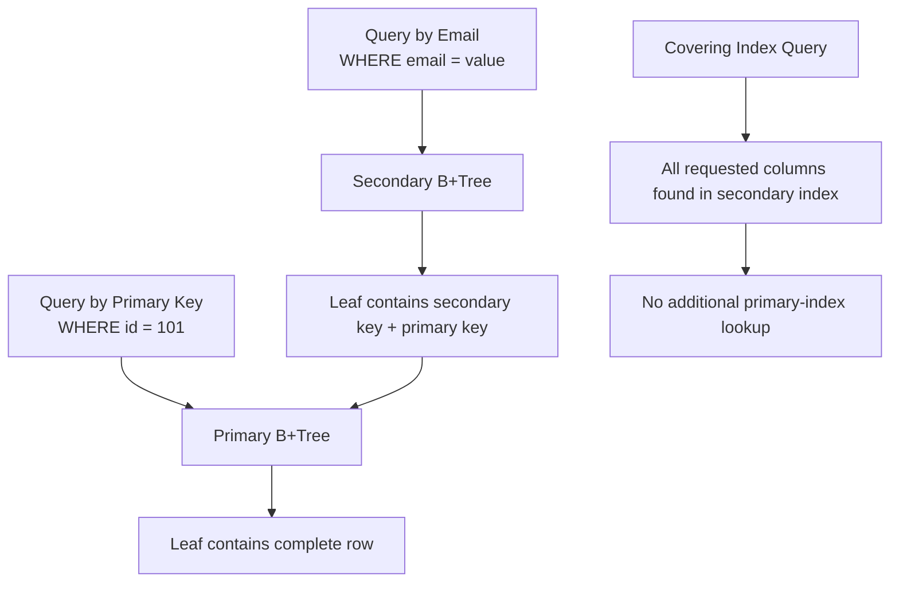

### Key mental model

In InnoDB:

* The primary key is generally the clustered index.
* Clustered-index leaf nodes contain the complete row.
* A secondary-index leaf generally contains the secondary key and the primary-key value.
* A secondary-index lookup may require another lookup into the clustered index.
* A covering index avoids the second lookup when all required columns are available from the index.

### Example

```sql
SELECT id, email
FROM users
WHERE email = 'danish@example.com';
```

An index on `email` can locate the matching primary key. MySQL can then retrieve the row from the clustered index.

With an appropriate covering index, fewer page lookups may be required.

---

## 5.4 B+Tree lookup mental model

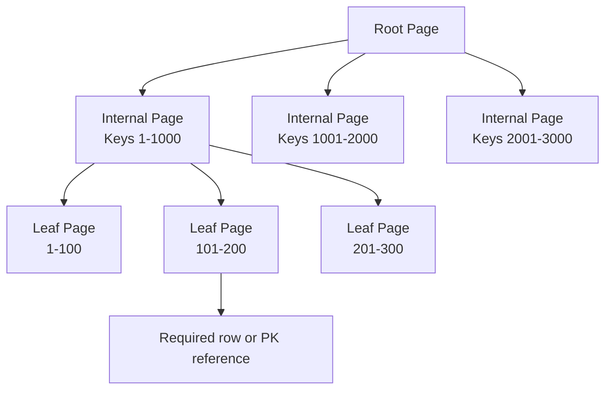

### Why B+Tree is used

* Tree height remains small.
* Search does not inspect every row.
* Leaf nodes are ordered.
* Range queries are efficient.
* Sequential leaf traversal supports `BETWEEN`, sorting and pagination.

---

## 5.5 Composite index and leftmost-prefix model

Suppose the index is:

```sql
INDEX idx_posts_category_status_created
(category_id, status, created_at)
```

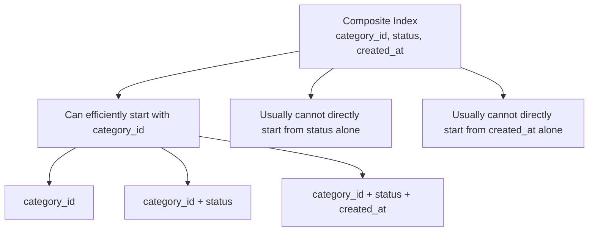

### Supported query shapes

```sql
WHERE category_id = ?
```

```sql
WHERE category_id = ?
  AND status = ?
```

```sql
WHERE category_id = ?
  AND status = ?
  AND created_at >= ?
```

### Less suitable query shape

```sql
WHERE status = ?
```

The leading `category_id` portion is missing.

### Index-order shortcut

> **Equality columns → Range column → Sorting/grouping requirement → Selected columns for coverage**

This is a heuristic, not a universal rule. The execution plan must still be checked.

---

## 5.6 Buffer pool and disk flow

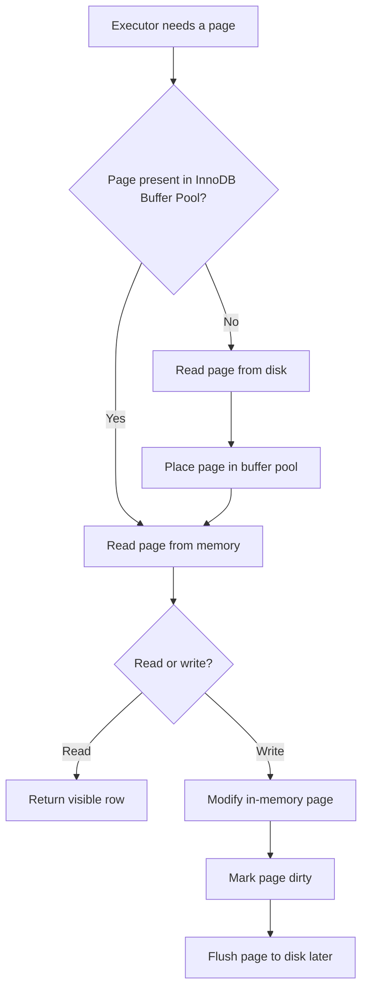

### Important distinction

A committed transaction does not necessarily mean that every changed data page has already been written to its final table file.

Durability is supported through transaction logging. Dirty pages can be flushed later.

---

## 5.7 Transaction lifecycle

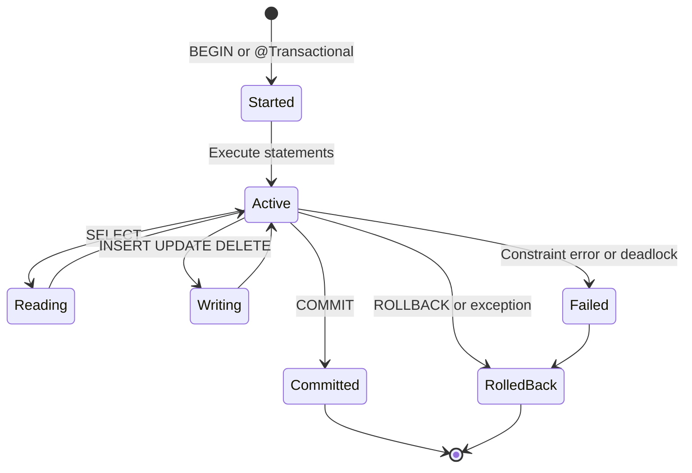

### Spring mapping

```java
@Transactional
public PostDto createPost(CreatePostRequest request) {
    // All participating database changes belong to one transaction.
}
```

---

## 5.8 Simplified commit internals

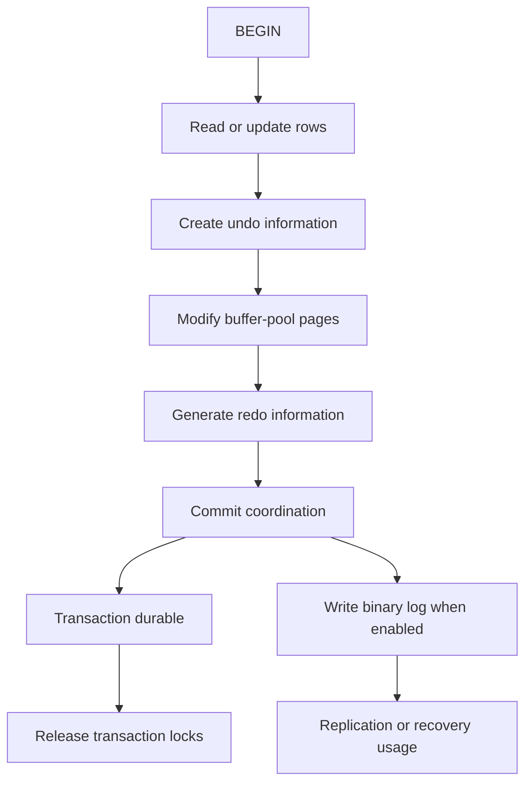

### Remember the three logs

| Mechanism  | Main purpose                                    |
| ---------- | ----------------------------------------------- |
| Undo       | Rollback and previous row versions for MVCC     |
| Redo       | Crash recovery and durability of InnoDB changes |
| Binary log | Replication and point-in-time recovery          |

Do not say that the binary log and redo log are the same thing.

---

## 5.9 MVCC visibility model

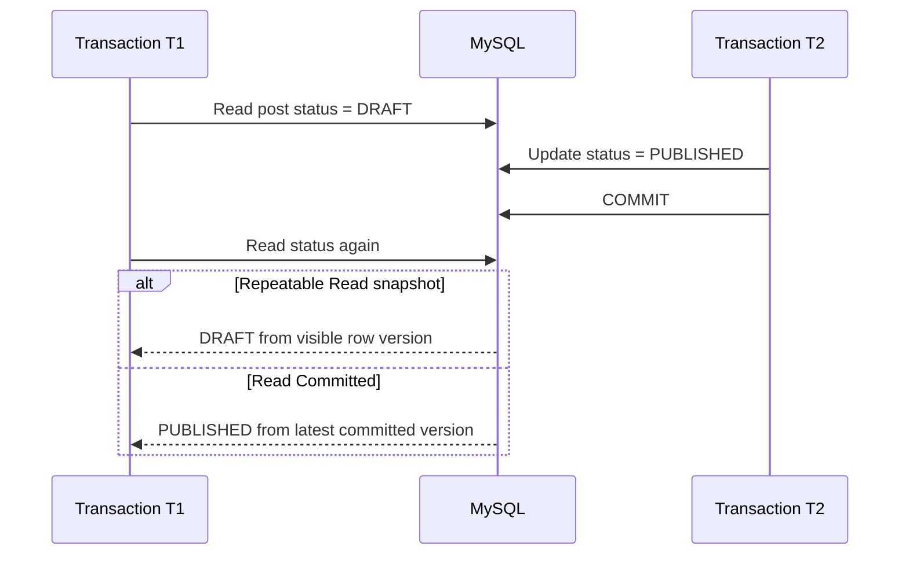

### MVCC shortcut

> **MVCC = Current row + old row versions + transaction visibility rules**

MVCC helps normal consistent reads avoid unnecessary blocking, but writes can still require locks.

---

## 5.10 Isolation-level model

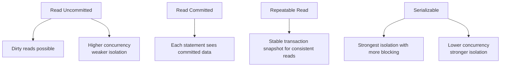

| Isolation level  | Dirty read |                     Non-repeatable read |                                       Phantom protection |
| ---------------- | ---------: | --------------------------------------: | -------------------------------------------------------: |
| Read Uncommitted |   Possible |                                Possible |                                                 Possible |
| Read Committed   |  Prevented |                                Possible |                                                 Possible |
| Repeatable Read  |  Prevented | Prevented for consistent snapshot reads | Stronger protection through InnoDB MVCC/locking behavior |
| Serializable     |  Prevented |                               Prevented |                 Prevented through stronger serialization |

Avoid answering isolation questions only by memorizing the table. Explain the business tradeoff between consistency and concurrency.

---

## 5.11 Locking model

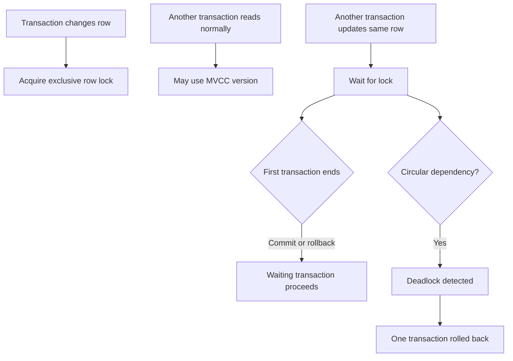

### Lock types to understand

* Shared and exclusive concepts
* Record locks
* Gap or next-key locking concepts
* Intention locks
* Metadata locks
* Explicit pessimistic locks using `FOR UPDATE`

You do not need to memorize every internal lock structure initially. You must understand how row access order and transaction duration affect blocking.

---

## 5.12 Join execution model

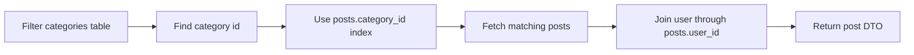

### Common join query

```sql
SELECT
    p.id,
    p.title,
    u.name AS author_name,
    c.name AS category_name
FROM posts p
JOIN users u
    ON u.id = p.user_id
JOIN categories c
    ON c.id = p.category_id
WHERE c.id = ?
ORDER BY p.created_at DESC
LIMIT 20;
```

### Interview rule

Foreign-key and join columns generally need appropriate indexes.

A join does not automatically become fast simply because the SQL is syntactically correct.

---

## 5.13 `WHERE`, `GROUP BY`, `HAVING` and `ORDER BY` flow

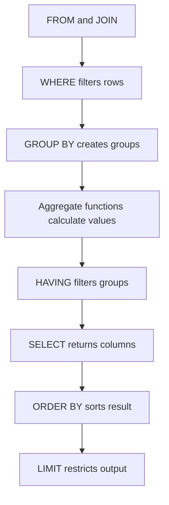

### Example

```sql
SELECT category_id, COUNT(*) AS post_count
FROM posts
WHERE status = 'PUBLISHED'
GROUP BY category_id
HAVING COUNT(*) >= 10
ORDER BY post_count DESC;
```

* `WHERE` filters individual rows before grouping.
* `HAVING` filters groups after aggregation.

---

## 5.14 Pagination model

### Offset pagination


```sql
SELECT id, title, created_at
FROM posts
ORDER BY created_at DESC
LIMIT 20 OFFSET 1980;
```

### Keyset pagination

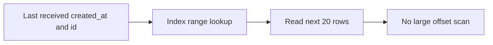

```sql
SELECT id, title, created_at
FROM posts
WHERE
    created_at < :lastCreatedAt
    OR (created_at = :lastCreatedAt AND id < :lastId)
ORDER BY created_at DESC, id DESC
LIMIT 20;
```

Recommended index:

```sql
CREATE INDEX idx_posts_created_id
ON posts(created_at, id);
```

Offset pagination is simple and supports arbitrary page numbers. Keyset pagination is usually better for large, continuously changing datasets.

---

## 5.15 Connection-pool model

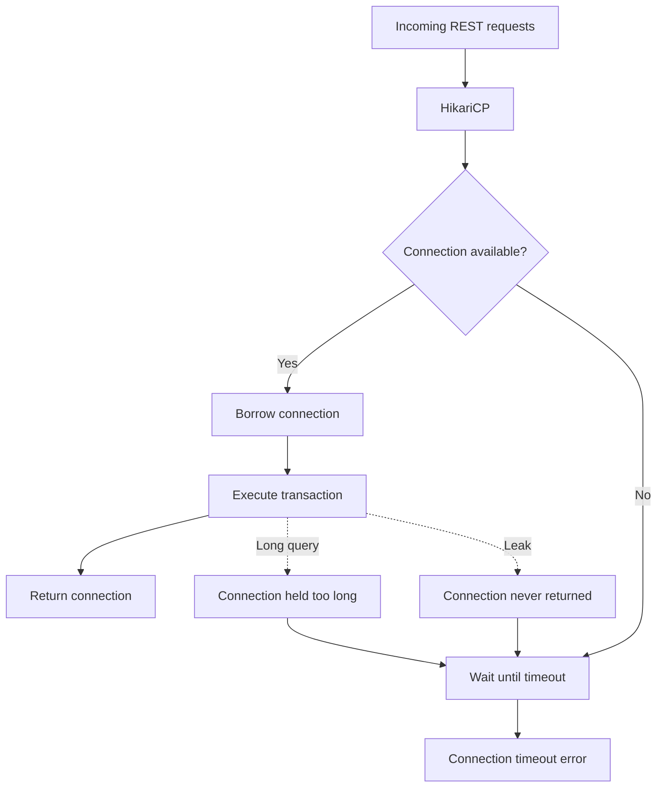

### Pool-sizing warning

A database pool should not be made extremely large without analysis.

More connections can mean:

* More memory consumption
* More concurrent DB work
* Increased lock contention
* Increased context switching
* Greater risk of overwhelming the database

---

## 5.16 Replication mental model

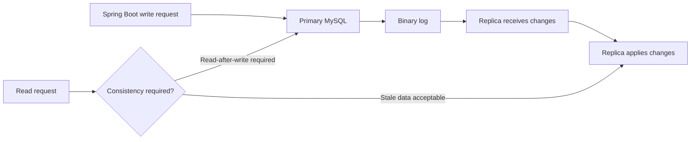

### Main risk

Replication can be asynchronous, so a replica may temporarily return older data.

This matters for:

* User updates profile and immediately reads it
* User publishes a post and immediately opens it
* Payment or order confirmation
* Security and permission updates

---

## 5.17 Slow-query debugging model

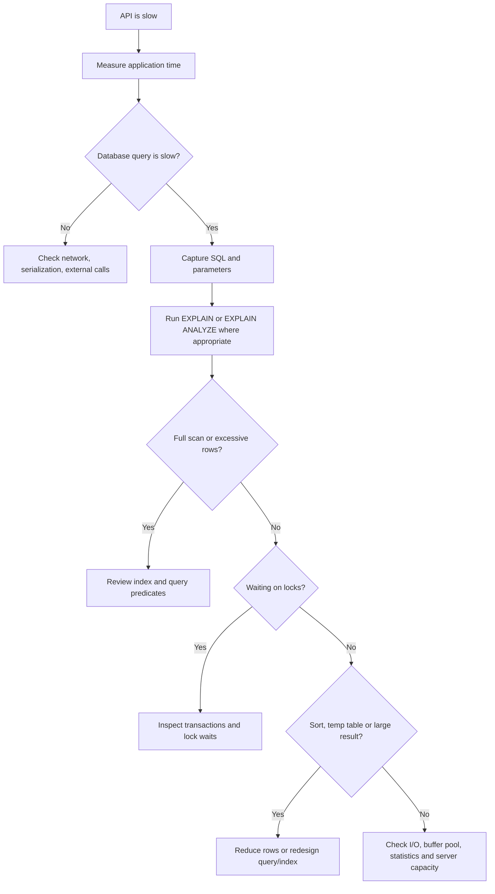

---

# 6. Theory Required Behind the Mental Model

## 6.1 Database, schema, table and row

### Definition

A relational database stores structured data in tables. A table contains rows, and each row contains column values.

### Why it matters

The schema defines:

* What data is allowed
* How entities relate
* How data is located
* How consistency is enforced

### Internal working

Table data and indexes are stored in database pages. MySQL accesses pages rather than independently reading arbitrary individual fields from disk.

### Interview explanation

> “I first model the business entities and relationships, apply appropriate normalization, define primary and foreign keys, and then design indexes based on actual query patterns.”

### Project example

* `users`
* `posts`
* `categories`
* `comments`

---

## 6.2 Primary key

### Definition

A primary key uniquely identifies a row.

### Why it matters

It provides:

* Uniqueness
* Stable references
* Efficient row lookup
* Relationship support

### Internal working

In InnoDB, the primary key normally defines the clustered organization of rows.

### Interview explanation

> “I prefer a stable, compact and non-changing primary key because secondary indexes contain the primary-key value, so a very large primary key increases secondary-index size.”

### Project example

```sql
id BIGINT PRIMARY KEY AUTO_INCREMENT
```

---

## 6.3 Foreign key

### Definition

A foreign key ensures that a child value refers to a valid parent row.

### Why it matters

It prevents orphan data.

### Internal working

During insert, update or delete, MySQL verifies the referenced relationship.

### Interview explanation

> “Application validation improves the error message, but the foreign-key constraint provides final database-level integrity.”

### Project example

`posts.user_id` references `users.id`.

---

## 6.4 Normalization

### Definition

Normalization organizes data to minimize unnecessary duplication and dependency problems.

### Practical levels

* **1NF:** Atomic column values
* **2NF:** Non-key columns depend on the complete key
* **3NF:** Non-key columns do not depend on other non-key columns

### Project example

Do not store complete category details repeatedly inside every post row.

Use:

```text
posts.category_id → categories.id
```

### Senior-level explanation

> “I normally start with a normalized design for data integrity. I consider controlled denormalization only when an identified read-performance problem justifies the consistency cost.”

---

## 6.5 Index

### Definition

An index is an ordered data structure that provides a faster path to matching rows.

### Why it matters

Without a useful index, MySQL may need to inspect a large part of the table.

### Internal working

B+Tree indexes support:

* Equality lookup
* Range lookup
* Ordered traversal
* Prefix matching
* Some sorting/grouping optimizations

### Interview explanation

> “I do not create indexes for every column. I design composite indexes according to the main filter, join and sort patterns, and then validate them using the execution plan.”

---

## 6.6 Selectivity and cardinality

### Definition

Selectivity indicates how narrowly a condition filters the table.

### Example

An `email` column is highly selective because values are mostly unique.

A Boolean `active` column may have low selectivity.

### Why it matters

An index on a low-selectivity column may not reduce the number of rows enough to be useful.

### Important qualification

Low selectivity does not mean an index is always useless. A low-selectivity column can still be useful as part of an appropriate composite or covering index.

---

## 6.7 Covering index

### Definition

A covering index contains all the data required by a query.

### Example

```sql
CREATE INDEX idx_posts_category_created
ON posts(category_id, created_at, id);
```

```sql
SELECT id, created_at
FROM posts
WHERE category_id = ?
ORDER BY created_at DESC;
```

The query may be answered from the index without retrieving the complete row.

### Tradeoff

A wider index consumes more space and increases write cost.

---

## 6.8 Query optimizer

### Definition

The optimizer selects an execution plan.

### It considers

* Available indexes
* Statistics
* Estimated row counts
* Join order
* Filtering conditions
* Sorting and grouping cost
* Temporary-table cost

### Interview explanation

> “SQL is declarative. We specify the required result, and the optimizer decides how to retrieve it. I use `EXPLAIN` to verify what plan was selected.”

---

## 6.9 `EXPLAIN`

### Important fields

| Field           | Meaning                                        |
| --------------- | ---------------------------------------------- |
| `type`          | General access strategy                        |
| `possible_keys` | Indexes that might be usable                   |
| `key`           | Index actually selected                        |
| `key_len`       | Portion of index used                          |
| `ref`           | Columns or constants compared with index       |
| `rows`          | Estimated rows examined                        |
| `filtered`      | Estimated percentage remaining after filtering |
| `Extra`         | Additional operations or information           |

### Simplified access-type order

Often, but not universally:

```text
const / eq_ref → ref → range → index → ALL
```

`ALL` usually means a full table scan.

A full scan is not automatically wrong for a tiny table or when a large percentage of rows is required.

---

## 6.10 Sargability

A predicate is sargable when the database can effectively use an index to search for matching values.

### Less index-friendly

```sql
WHERE YEAR(created_at) = 2026
```

### More index-friendly

```sql
WHERE created_at >= '2026-01-01'
  AND created_at <  '2027-01-01'
```

### Other common problems

```sql
WHERE name LIKE '%khan'
```

```sql
WHERE CAST(user_id AS CHAR) = '100'
```

```sql
WHERE LOWER(email) = 'danish@example.com'
```

Functions, implicit conversions and leading wildcards can prevent a normal index range lookup.

---

## 6.11 Transactions and ACID

### Atomicity

All operations succeed or all are rolled back.

### Consistency

Data moves from one valid state to another valid state.

### Isolation

Concurrent transactions should not produce invalid interaction.

### Durability

Committed changes survive a crash according to the configured durability guarantees.

### Project example

Creating a post may involve:

1. Validate user
2. Validate category
3. Insert post
4. Insert tags
5. Update related metadata

These steps should be committed together when they belong to one business operation.

---

## 6.12 MVCC

### Definition

Multi-Version Concurrency Control stores information required to present the correct row version to each transaction.

### Why it exists

It reduces read/write blocking while maintaining isolation.

### Internal idea

* Transactions have visibility rules.
* Old row versions are represented using undo information.
* A consistent read can reconstruct or access an older visible version.
* Locking reads and writes behave differently from normal snapshot reads.

### Interview explanation

> “MVCC allows a normal read to see a transactionally consistent version instead of always waiting for the latest writer, while conflicting writes still need locking.”

---

## 6.13 Optimistic versus pessimistic locking

### Optimistic locking

Assume conflicts are rare. Detect them when updating.

```sql
UPDATE posts
SET title = ?, version = version + 1
WHERE id = ?
  AND version = ?;
```

If zero rows are updated, another transaction changed the record.

### Pessimistic locking

Lock the row before changing it.

```sql
SELECT *
FROM posts
WHERE id = ?
FOR UPDATE;
```

### Selection

| Technique   | Better when                                      |
| ----------- | ------------------------------------------------ |
| Optimistic  | Conflicts are rare, transactions should not wait |
| Pessimistic | Conflicts are likely and work must be serialized |

---

## 6.14 Deadlock

### Definition

Two transactions hold resources that the other transaction needs.

### Example

```text
T1 locks Post 10
T2 locks Post 20
T1 requests Post 20
T2 requests Post 10
```

### MySQL behavior

The database detects the deadlock and rolls back one transaction so the other can continue.

### Fixes

* Lock rows in a consistent order.
* Keep transactions short.
* Use selective indexes.
* Avoid user interaction or external API calls inside transactions.
* Retry deadlock victims safely.
* Avoid updating more rows than required.

---

## 6.15 Constraints

| Constraint  | Purpose                           | Project example           |
| ----------- | --------------------------------- | ------------------------- |
| PRIMARY KEY | Unique row identity               | `posts.id`                |
| FOREIGN KEY | Relationship integrity            | `posts.user_id`           |
| UNIQUE      | Prevent duplicate business values | `users.email`             |
| NOT NULL    | Mandatory value                   | `posts.title`             |
| CHECK       | Domain-level validation           | Valid status values       |
| DEFAULT     | Default value                     | Creation timestamp/status |

Application validation and database constraints should complement each other.

---

## 6.16 Joins

### Inner join

Return only matching rows.

```sql
SELECT p.title, u.name
FROM posts p
JOIN users u ON u.id = p.user_id;
```

### Left join

Return all rows from the left table, even when no right-side match exists.

```sql
SELECT p.id, COUNT(c.id)
FROM posts p
LEFT JOIN comments c ON c.post_id = p.id
GROUP BY p.id;
```

This includes posts with zero comments.

### Interview focus

* Inner versus left join
* Join order
* Indexing join columns
* Duplicate rows due to one-to-many joins
* `ON` versus `WHERE` behavior with outer joins
* N+1 problem from ORM

---

## 6.17 Subquery, join and CTE

Do not claim that one is always faster.

The optimizer may transform queries. Choose based on:

* Correctness
* Readability
* Reusability
* Execution plan
* Data volume

A correlated subquery can become expensive when repeatedly executed for many outer rows, but actual behavior must be verified.

---

## 6.18 Pagination

### Offset pagination

Good for:

* Small datasets
* Admin screens
* Direct navigation to page numbers

Problems:

* Large offset
* Duplicate or missing results under concurrent inserts
* Work increases for deeper pages

### Keyset pagination

Good for:

* Feeds
* Timelines
* Infinite scroll
* Large tables
* Stable next-page navigation

Requires:

* Stable ordering
* A cursor containing ordering values
* Matching index

---

## 6.19 Connection pooling

### Why it exists

Opening a physical connection requires network and authentication work.

A pool maintains reusable connections.

### Key settings

* Maximum pool size
* Minimum idle connections
* Connection timeout
* Idle timeout
* Maximum lifetime
* Leak detection when diagnosing issues

### Interview explanation

> “The pool size should be based on database capacity, query latency and application concurrency. A larger pool is not automatically faster.”

---

## 6.20 Replication and backup

### Replication

Used for:

* Read scaling
* Disaster-recovery architecture
* Failover options
* Reporting workloads

### Backup

Used for:

* Accidental deletion
* Data corruption
* Point-in-time restoration
* Disaster recovery

### Important line

> “Replication improves availability, but replication alone is not a backup because accidental changes can also be replicated.”

---

# 7. Code / Program Mapping

## Concept-to-code map

| Mental Model Concept | Code/Program Needed? | What To Implement                         | Why It Helps                         |
| -------------------- | -------------------: | ----------------------------------------- | ------------------------------------ |
| Schema design        |                  Yes | Blog tables with PK, FK and constraints   | Demonstrates relational modeling     |
| Composite index      |                  Yes | Category/status/date index                | Builds index-order understanding     |
| Query plan           |                  Yes | Run `EXPLAIN` before and after index      | Shows measurable optimization        |
| Transactions         |                  Yes | Multi-step service using `@Transactional` | Connects Spring with ACID            |
| Optimistic locking   |                  Yes | JPA `@Version` field                      | Solves lost-update scenario          |
| Pessimistic locking  |                  Yes | Repository method with write lock         | Handles high-contention operation    |
| Pagination           |                  Yes | Offset and keyset query                   | Demonstrates scalability             |
| Aggregation          |                  Yes | Count posts by category                   | Covers grouping                      |
| N+1 prevention       |                  Yes | Fetch join or DTO projection              | Connects Hibernate and SQL           |
| Connection pool      |        Configuration | Configure and observe HikariCP            | Covers production integration        |
| Deadlock             |     Small simulation | Two transactions locking in reverse order | Builds troubleshooting understanding |
| Replication          | Conceptual initially | Primary/read-replica routing design       | Production architecture discussion   |

---

## 7.1 Interview-friendly schema

```sql
CREATE TABLE users (
    id BIGINT PRIMARY KEY AUTO_INCREMENT,
    name VARCHAR(100) NOT NULL,
    email VARCHAR(255) NOT NULL,
    password_hash VARCHAR(255) NOT NULL,
    created_at TIMESTAMP NOT NULL DEFAULT CURRENT_TIMESTAMP,
    CONSTRAINT uk_users_email UNIQUE (email)
);

CREATE TABLE categories (
    id BIGINT PRIMARY KEY AUTO_INCREMENT,
    name VARCHAR(100) NOT NULL,
    CONSTRAINT uk_categories_name UNIQUE (name)
);

CREATE TABLE posts (
    id BIGINT PRIMARY KEY AUTO_INCREMENT,
    user_id BIGINT NOT NULL,
    category_id BIGINT NOT NULL,
    title VARCHAR(255) NOT NULL,
    content TEXT NOT NULL,
    status VARCHAR(30) NOT NULL,
    version BIGINT NOT NULL DEFAULT 0,
    created_at TIMESTAMP NOT NULL DEFAULT CURRENT_TIMESTAMP,
    updated_at TIMESTAMP NOT NULL DEFAULT CURRENT_TIMESTAMP,
    CONSTRAINT fk_posts_user
        FOREIGN KEY (user_id) REFERENCES users(id),
    CONSTRAINT fk_posts_category
        FOREIGN KEY (category_id) REFERENCES categories(id)
);

CREATE TABLE comments (
    id BIGINT PRIMARY KEY AUTO_INCREMENT,
    post_id BIGINT NOT NULL,
    user_id BIGINT NOT NULL,
    content VARCHAR(1000) NOT NULL,
    created_at TIMESTAMP NOT NULL DEFAULT CURRENT_TIMESTAMP,
    CONSTRAINT fk_comments_post
        FOREIGN KEY (post_id) REFERENCES posts(id),
    CONSTRAINT fk_comments_user
        FOREIGN KEY (user_id) REFERENCES users(id)
);
```

---

## 7.2 Practical indexes

```sql
CREATE INDEX idx_posts_category_status_created
    ON posts(category_id, status, created_at);

CREATE INDEX idx_posts_user_created
    ON posts(user_id, created_at);

CREATE INDEX idx_comments_post_created
    ON comments(post_id, created_at);
```

### Query supported by the first index

```sql
SELECT id, title, created_at
FROM posts
WHERE category_id = ?
  AND status = 'PUBLISHED'
ORDER BY created_at DESC
LIMIT 20;
```

---

## 7.3 Execution-plan practice

```sql
EXPLAIN
SELECT id, title, created_at
FROM posts
WHERE category_id = 5
  AND status = 'PUBLISHED'
ORDER BY created_at DESC
LIMIT 20;
```

Check:

* Which index is selected?
* How many rows are estimated?
* Is sorting required?
* Is a temporary structure used?
* Does the query retrieve unnecessary columns?
* Does the index column order match the predicates?

---

## 7.4 Transaction in Spring Boot

```java
@Service
@RequiredArgsConstructor
public class PostService {

    private final PostRepository postRepository;
    private final UserRepository userRepository;
    private final CategoryRepository categoryRepository;

    @Transactional
    public PostDto createPost(CreatePostRequest request, Long userId) {
        User user = userRepository.findById(userId)
                .orElseThrow(() -> new ResourceNotFoundException("User not found"));

        Category category = categoryRepository.findById(request.categoryId())
                .orElseThrow(() -> new ResourceNotFoundException("Category not found"));

        Post post = new Post();
        post.setTitle(request.title());
        post.setContent(request.content());
        post.setStatus(PostStatus.DRAFT);
        post.setUser(user);
        post.setCategory(category);

        Post saved = postRepository.save(post);
        return PostMapper.toDto(saved);
    }
}
```

### Mental-model mapping

```text
@Transactional
    ↓
Connection borrowed
    ↓
Transaction started
    ↓
User/category reads
    ↓
Post insert
    ↓
Commit if successful
    ↓
Rollback if runtime failure occurs
```

Do not keep network calls, file uploads or long-running processing inside the transaction unless there is a specific reason.

---

## 7.5 Optimistic locking with JPA

```java
@Entity
@Table(name = "posts")
public class Post {

    @Id
    @GeneratedValue(strategy = GenerationType.IDENTITY)
    private Long id;

    @Version
    private Long version;

    private String title;

    // Other fields
}
```

When two users update the same entity version, the later conflicting update can fail with an optimistic-lock exception.

### Interview line

> “I use optimistic locking when concurrent updates are possible but conflicts are uncommon. The version column prevents silent lost updates.”

---

## 7.6 Pessimistic locking

```java
public interface PostRepository extends JpaRepository<Post, Long> {

    @Lock(LockModeType.PESSIMISTIC_WRITE)
    @Query("select p from Post p where p.id = :id")
    Optional<Post> findByIdForUpdate(@Param("id") Long id);
}
```

```java
@Transactional
public void publishPost(Long postId) {
    Post post = postRepository.findByIdForUpdate(postId)
            .orElseThrow(() -> new ResourceNotFoundException("Post not found"));

    post.publish();
}
```

Use this carefully because waiting transactions reduce concurrency.

---

## 7.7 DTO projection to reduce unnecessary loading

```java
public record PostSummary(
        Long id,
        String title,
        String authorName,
        String categoryName
) {}
```

```java
@Query("""
    select new com.example.dto.PostSummary(
        p.id,
        p.title,
        p.user.name,
        p.category.name
    )
    from Post p
    where p.status = :status
    order by p.createdAt desc
    """)
Page<PostSummary> findPostSummaries(
        @Param("status") PostStatus status,
        Pageable pageable
);
```

This can avoid loading complete entities when the API only needs summary data.

---

## 7.8 Keyset pagination repository query

```java
@Query("""
    select p
    from Post p
    where p.status = :status
      and (
          p.createdAt < :lastCreatedAt
          or (
              p.createdAt = :lastCreatedAt
              and p.id < :lastId
          )
      )
    order by p.createdAt desc, p.id desc
    """)
List<Post> findNextPage(
        @Param("status") PostStatus status,
        @Param("lastCreatedAt") LocalDateTime lastCreatedAt,
        @Param("lastId") Long lastId,
        Pageable pageable
);
```

---

## 7.9 Safe parameterized SQL

```java
String sql = """
    SELECT id, title
    FROM posts
    WHERE category_id = ?
      AND status = ?
    ORDER BY created_at DESC
    LIMIT ?
    """;

try (PreparedStatement statement = connection.prepareStatement(sql)) {
    statement.setLong(1, categoryId);
    statement.setString(2, "PUBLISHED");
    statement.setInt(3, pageSize);

    try (ResultSet resultSet = statement.executeQuery()) {
        // Map rows safely.
    }
}
```

Do not concatenate user input into SQL.

---

## 7.10 HikariCP configuration example

```yaml
spring:
  datasource:
    url: jdbc:mysql://localhost:3306/blog_db
    username: blog_user
    password: ${DB_PASSWORD}
    hikari:
      maximum-pool-size: 15
      minimum-idle: 5
      connection-timeout: 30000
      idle-timeout: 600000
      max-lifetime: 1800000
```

These values are examples, not universal production recommendations. Pool settings should be based on measurement and database capacity.

---

# 8. Project Usage Mapping

| Concept            | How I Can Use/Explain It In My Project         | Interview Line                                                                                                                |
| ------------------ | ---------------------------------------------- | ----------------------------------------------------------------------------------------------------------------------------- |
| Relational design  | Separate users, posts, categories and comments | “I modeled the blog domain using normalized tables and one-to-many relationships.”                                            |
| Primary keys       | Numeric IDs for entities                       | “Primary keys provide stable entity identity and efficient joins.”                                                            |
| Unique constraint  | Ensure email and category name uniqueness      | “I validate duplicates in the service, but the unique constraint is the final consistency guarantee.”                         |
| Foreign keys       | Post belongs to a valid user and category      | “Foreign keys prevent orphan posts and comments.”                                                                             |
| Composite indexes  | Optimize category/status/date filters          | “I design indexes from actual API query patterns rather than indexing every column.”                                          |
| Pagination         | Page and sort post results                     | “For normal screens I use pageable offset pagination; for a large feed I would consider keyset pagination.”                   |
| Transactions       | Create/update post consistently                | “I define transaction boundaries at the service layer for complete business operations.”                                      |
| JPA/Hibernate      | Entity mapping and repository access           | “Hibernate manages entity state, while MySQL still executes the generated SQL and enforces constraints.”                      |
| N+1 handling       | Posts with author and category                 | “I inspect generated SQL and use fetch joins or DTO projections for list APIs.”                                               |
| JWT user lookup    | Find user by unique email/username             | “A unique index supports fast and consistent authentication lookup.”                                                          |
| Optimistic locking | Concurrent post editing                        | “A version column can prevent one editor from silently overwriting another editor’s changes.”                                 |
| Query optimization | Optimize post search APIs                      | “I use `EXPLAIN`, rows examined and index selection to validate query performance.”                                           |
| HikariCP           | Reuse DB connections                           | “Spring Boot uses a connection pool, so I monitor pool usage and avoid holding connections during external calls.”            |
| Docker             | Externalized DB URL and credentials            | “The application container connects using environment-driven configuration instead of hard-coded values.”                     |
| Kubernetes         | Secrets, service discovery and pool limits     | “Database credentials are supplied securely and application replicas are considered while sizing the total connection count.” |
| Jenkins            | Migration and application deployment           | “Schema changes should be version-controlled and executed as part of a controlled deployment process.”                        |
| AWS                | Hosted MySQL/RDS-style architecture            | “For production I would use backups, monitoring, private networking and a managed database where appropriate.”                |
| Microservices      | Database ownership per service                 | “Each service should own its data model rather than allowing uncontrolled cross-service table access.”                        |

## Realistic microservices framing

Do not say:

> “I implemented a complete production database-per-service architecture.”

A professional, honest explanation is:

> “My current blog application is a monolith using MySQL. In the planned microservices version, I would separate ownership so user-service owns user data, post-service owns post data, and category-service owns category data. Cross-service consistency would then require API or event-based coordination rather than direct joins across every service database.”

---

# 9. Scenario-Based Mental Models

## Scenario 1: A query is slow

### Flow

```text
API slow
→ Identify SQL
→ Capture parameters
→ Run EXPLAIN
→ Check index/access type
→ Check rows examined
→ Check sorting/temp table
→ Check lock wait
→ Optimize
→ Measure again
```

### Problem

The post listing API takes several seconds.

### Possible root causes

* Missing composite index
* Function applied to indexed column
* Leading wildcard
* Large offset
* Fetching large content column unnecessarily
* N+1 queries
* Lock wait
* Stale statistics
* Very large result set

### Fix

* Add or redesign index
* Rewrite predicate
* Select only needed columns
* Use DTO projection
* Use keyset pagination
* Reduce transaction duration
* Validate with execution plan

### Interview explanation

> “I first separate application latency from database latency. After identifying the SQL and parameters, I inspect the execution plan, rows examined, index usage, sorting and lock waits. I make one controlled change and compare the result rather than immediately adding random indexes.”

---

## Scenario 2: Two users register with the same email

### Flow

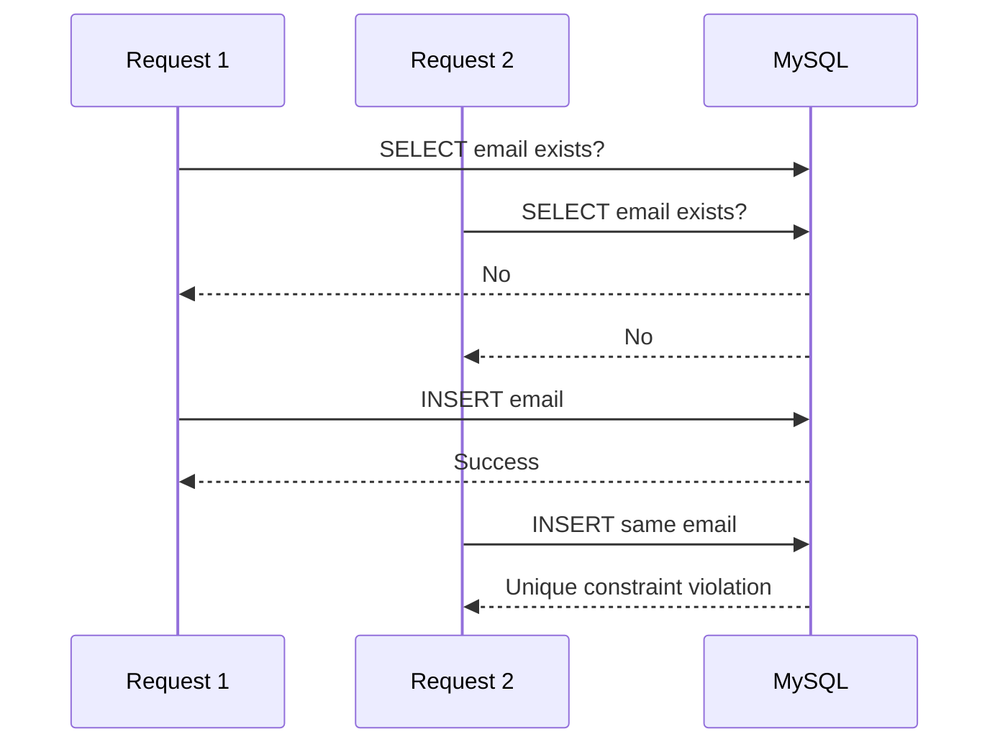

### Problem

Application-level “check then insert” has a race condition.

### Root cause

Both transactions can pass the existence check before either inserts.

### Fix

* Add a unique database constraint.
* Catch and translate the constraint exception.
* Keep the application check for a friendly message, but do not rely on it for correctness.

### Interview explanation

> “The database unique constraint is required because application-level duplicate checking is not atomic under concurrency.”

---

## Scenario 3: Lost update

### Flow

```text
T1 reads version 4
T2 reads version 4
T1 updates and creates version 5
T2 updates old state and overwrites T1
```

### Problem

One user’s changes disappear.

### Root cause

No concurrency check during update.

### Fix

Use:

* Optimistic locking with a version column, or
* Pessimistic locking for highly contended operations

### Interview explanation

> “For normal content editing, optimistic locking is preferable because conflicts are rare. The update succeeds only when the version still matches.”

---

## Scenario 4: Deadlock

### Flow

```mermaid
sequenceDiagram
    participant T1 as Transaction 1
    participant T2 as Transaction 2
    participant DB as MySQL

    T1->>DB: Lock Post 10
    T2->>DB: Lock Post 20
    T1->>DB: Request Post 20
    T2->>DB: Request Post 10
    DB-->>T2: Deadlock victim, rollback
    DB-->>T1: Continue
```

### Problem

One transaction receives a deadlock error.

### Root cause

Rows were locked in different orders.

### Fix

* Use consistent lock ordering.
* Keep transactions short.
* Ensure filters are indexed.
* Retry safely.
* Do not call external services while holding locks.

### Interview explanation

> “A deadlock is not simply a long-running query. It is a circular wait. MySQL resolves it by rolling back one participant, so the application should use safe retry where the operation is idempotent.”

---

## Scenario 5: Database transaction fails halfway

### Flow

```text
BEGIN
→ Insert post
→ Insert tags
→ Update metadata
→ Metadata update fails
→ ROLLBACK
→ No partial post operation remains
```

### Problem

A multi-step operation partially succeeds.

### Root cause

Statements were executed outside a single transaction or rollback was not triggered.

### Fix

* Place the complete business operation within a transaction.
* Configure rollback behavior correctly.
* Avoid swallowing exceptions inside the transactional method.
* Avoid self-invocation problems with Spring proxies.

### Interview explanation

> “The service layer owns the business transaction. If any mandatory step fails, the complete operation is rolled back.”

---

## Scenario 6: Large page number becomes slow

### Flow

```text
Page 1 → OFFSET 0
Page 100 → skip 1,980 rows
Page 100,000 → skip nearly 2 million rows
```

### Problem

Deep pagination becomes expensive.

### Root cause

The database must locate and skip many earlier rows.

### Fix

Use keyset pagination for next-page or feed-style navigation.

### Interview explanation

> “Offset pagination is suitable for moderate admin-style datasets. For deep feeds, I use stable ordering and a cursor so MySQL performs an index range lookup instead of skipping a large offset.”

---

## Scenario 7: Connection pool is exhausted

### Flow

```mermaid
flowchart TD
    A[Many incoming requests] --> B[All pool connections borrowed]
    B --> C[New requests wait]
    C --> D[Connection timeout]
    B --> E{Why held?}
    E --> F[Slow SQL]
    E --> G[Long transaction]
    E --> H[External call inside transaction]
    E --> I[Connection leak]
```

### Fix

* Identify slow queries.
* Check active transactions.
* Remove external calls from transaction boundaries.
* Ensure resources are closed.
* Apply reasonable request timeouts.
* Size the pool using database capacity.
* Consider total connections across every Kubernetes replica.

### Senior-level point

Ten pods with a pool size of 30 can create up to approximately 300 application connections, not 30.

---

## Scenario 8: API returns old data after an update

### Problem

A read replica returns stale data immediately after a write.

### Root cause

Replication lag.

### Fix

* Route consistency-critical reads to the primary.
* Use read-your-write routing.
* Wait for an appropriate replication position when supported.
* Accept eventual consistency only where the business allows it.

### Interview explanation

> “Read replicas improve scale, but they introduce consistency tradeoffs. I do not send an immediate payment or permission confirmation read to a potentially lagging replica.”

---

## Scenario 9: JPA generates many queries

### Flow

```text
Load 20 posts
→ Access post.user for each post
→ 20 user queries
→ Access post.category
→ 20 category queries
```

### Problem

N+1 query issue.

### Root cause

Lazy relationships are accessed repeatedly outside the original query.

### Fix

* Fetch join
* Entity graph
* Batch fetching
* DTO projection
* Query-specific repository method

### Interview explanation

> “I diagnose N+1 by inspecting generated SQL and query count. I do not globally make every relationship eager because that creates other performance and cartesian-product problems.”

---

## Scenario 10: High load increases

### Flow

```mermaid
flowchart TD
    A[Traffic increases] --> B[Application instances scale]
    B --> C[Total DB connections increase]
    C --> D[Query concurrency increases]
    D --> E{Database bottleneck}
    E --> F[CPU]
    E --> G[I/O]
    E --> H[Locks]
    E --> I[Memory]
    E --> J[Connection limit]

    D --> K[Optimize queries/indexes]
    D --> L[Cache safe reads]
    D --> M[Read replicas]
    D --> N[Batch writes]
    D --> O[Rate limiting/backpressure]
```

### Senior-level explanation

> “Application horizontal scaling does not automatically scale the database. I consider aggregate pool size, query efficiency, caching, read replicas, batching and data ownership before simply adding application pods.”

---

# 10. Debugging / Production Issue Flow

| Issue                                | Possible Cause                              | Where To Check                       | Fix                                         | Interview Explanation                                        |
| ------------------------------------ | ------------------------------------------- | ------------------------------------ | ------------------------------------------- | ------------------------------------------------------------ |
| Slow query                           | Missing/wrong index                         | `EXPLAIN`, slow query log            | Redesign query/index                        | “I validate rows examined and access path.”                  |
| Index not used                       | Function, conversion, poor selectivity      | SQL predicate and plan               | Rewrite predicate, update statistics        | “An existing index is not necessarily usable.”               |
| Duplicate email                      | Race condition                              | Constraint and exception logs        | Unique constraint                           | “Correctness must be database-enforced.”                     |
| Deadlock                             | Inconsistent lock order                     | Deadlock details, transaction SQL    | Consistent ordering, retry                  | “One transaction is rolled back to break the cycle.”         |
| Lock wait timeout                    | Long/open transaction                       | Active transaction and lock views    | Shorten transaction, fix blocker            | “A timeout is different from a deadlock.”                    |
| Connection timeout                   | Pool exhausted                              | Pool metrics, thread dumps, slow SQL | Fix slow/leaked connections                 | “Increasing pool size alone can overload DB.”                |
| High CPU                             | Large scans, sorting, expensive expressions | Execution plans and server metrics   | Index/filter/rewrite                        | “Reduce database work per request.”                          |
| High disk I/O                        | Low cache hit, large scans                  | Buffer pool and I/O metrics          | Add memory where justified, optimize access | “The first fix is not always hardware.”                      |
| N+1 queries                          | Lazy association loop                       | Hibernate SQL logs/APM               | Fetch join or projection                    | “I optimize per use case, not global eager loading.”         |
| Large response time                  | Too many columns/rows                       | SQL and payload size                 | Projection and pagination                   | “Performance includes transfer and mapping cost.”            |
| Data inconsistency                   | Missing transaction/constraint              | Service boundary and schema          | Add atomic transaction/constraint           | “Application and database guarantees complement each other.” |
| Old data from replica                | Replication lag                             | Replica lag metrics                  | Route critical read to primary              | “Replica reads may be eventually consistent.”                |
| Deployment fails after schema change | App/schema incompatibility                  | Migration logs                       | Backward-compatible migration               | “Schema rollout should support mixed application versions.”  |
| `Too many connections`               | Pool multiplication across pods             | DB connection count, pod count       | Reduce pools, fix leaks, apply limits       | “Capacity is calculated across the whole deployment.”        |
| Slow `COUNT(*)`                      | Large filtered dataset                      | Plan and business requirement        | Index, approximate count, redesign UI       | “Exact counts may be expensive at scale.”                    |

## Five-step production debugging shortcut

> **Reproduce → Measure → Locate SQL → Inspect Plan/Locks → Change and Compare**

Never start with:

> “Let us add an index.”

First determine whether the actual issue is an index, lock, pool, query count, I/O or application behavior.

---

# 11. 60–70% Most Important Interview Coverage

| Priority | Topic                                 | Mental Model Needed | Code Needed | Scenario Needed | Interview Weight         |
| -------- | ------------------------------------- | ------------------: | ----------: | --------------: | ------------------------ |
| P0       | Joins                                 |                 Yes |         Yes |             Yes | Very high                |
| P0       | Indexes and composite indexes         |                 Yes |         Yes |             Yes | Very high                |
| P0       | `EXPLAIN` and slow-query optimization |                 Yes |         Yes |             Yes | Very high                |
| P0       | Transactions and ACID                 |                 Yes |         Yes |             Yes | Very high                |
| P0       | Isolation levels and MVCC             |                 Yes |  Small demo |             Yes | Very high                |
| P0       | Locks, lost updates and deadlocks     |                 Yes |         Yes |             Yes | Very high                |
| P0       | PK, FK, UNIQUE and constraints        |                 Yes |         Yes |             Yes | High                     |
| P0       | Normalization and schema design       |                 Yes |         Yes |             Yes | High                     |
| P0       | Pagination and sorting                |                 Yes |         Yes |             Yes | High                     |
| P0       | JPA/Hibernate SQL behaviour           |                 Yes |         Yes |             Yes | Very high for Java roles |
| P0       | Connection pooling                    |                 Yes |      Config |             Yes | High for senior roles    |
| P1       | Query execution pipeline              |                 Yes |   `EXPLAIN` |             Yes | High                     |
| P1       | Primary versus secondary index        |                 Yes |         Yes |             Yes | High                     |
| P1       | Covering indexes and sargability      |                 Yes |         Yes |             Yes | High                     |
| P1       | Aggregation, `GROUP BY`, `HAVING`     |         Small model |         Yes |             Yes | High                     |
| P1       | Subqueries, CTEs and query rewriting  |         Small model |         Yes |        Optional | Medium-high              |
| P1       | Optimistic/pessimistic locking        |                 Yes |         Yes |             Yes | High                     |
| P1       | N+1 query problem                     |                 Yes |         Yes |             Yes | Very high for JPA        |
| P1       | SQL injection and prepared statements |         Small model |         Yes |             Yes | High                     |
| P1       | Replication and lag                   |                 Yes |  Conceptual |             Yes | Medium-high              |
| P1       | Backup and recovery basics            |                 Yes |          No |             Yes | Medium                   |
| P2       | Views                                 |         Small model |         Yes |        Optional | Medium                   |
| P2       | Stored procedures/functions           |                Flow |  Small code |        Optional | Medium                   |
| P2       | Triggers                              |                Flow |  Small code |             Yes | Medium-low               |
| P2       | Partitioning                          |                 Yes |    Optional |             Yes | Medium                   |
| P2       | JSON columns                          |         Small model |         Yes |        Optional | Medium                   |
| P2       | Window functions                      |         Small model |         Yes |        Optional | Medium                   |
| P2       | Batch insert/update                   |            Pipeline |         Yes |             Yes | Medium-high              |
| P3       | Deep InnoDB page internals            |      Detailed model |          No |        Optional | Low initially            |
| P3       | Advanced replication topology         |        Architecture |          No |             Yes | Role-dependent           |
| P3       | Sharding implementation               |        Architecture |          No |             Yes | System-design dependent  |

## Enough to begin interviews

Complete these first:

1. Schema and normalization
2. Joins
3. Indexes
4. Composite-index order
5. `EXPLAIN`
6. Transactions and ACID
7. Isolation and MVCC
8. Locks, deadlocks and lost updates
9. Pagination
10. JPA-generated SQL and N+1
11. Connection pooling
12. Five strong project scenarios

This covers a large percentage of practical Java-backend MySQL discussion.

---

# 12. Revision Format

## 12.1 Master shortcut

> **Request → Pool → Parse → Optimize → Plan → Index/Page → MVCC/Lock → Commit → Result**

---

## 12.2 Five key diagrams to remember

### Diagram 1: Query lifecycle

```text
Spring Boot
→ HikariCP
→ Parser
→ Optimizer
→ Execution Plan
→ InnoDB
→ Result
```

### Diagram 2: Index lookup

```text
Secondary Index
→ Primary-Key Value
→ Clustered Index
→ Complete Row
```

### Diagram 3: Transaction

```text
BEGIN
→ Read/Write
→ Undo + Redo
→ COMMIT/ROLLBACK
→ Release Locks
```

### Diagram 4: Slow query

```text
SQL
→ EXPLAIN
→ Index
→ Rows Examined
→ Sort/Temp
→ Locks/I/O
```

### Diagram 5: Concurrency

```text
Concurrent Update
→ Optimistic Version Check
or
→ Pessimistic Row Lock
→ Commit
```

---

## 12.3 Ten must-remember points

1. SQL is declarative; the optimizer chooses the execution plan.
2. An index speeds reads but adds storage and write overhead.
3. Composite-index column order matters.
4. InnoDB primary keys are central to row and secondary-index access.
5. `EXPLAIN` is required to validate optimization assumptions.
6. MVCC provides transactionally visible row versions.
7. Normal reads and locking reads behave differently.
8. Database constraints are required even when application validation exists.
9. Transactions should be short and should not include unnecessary external calls.
10. Application scaling must account for total database connections and database capacity.

---

## 12.4 Ten common interview lines

1. “I design indexes according to query predicates, joins and ordering rather than indexing every column.”
2. “I validate index usage using `EXPLAIN` and rows examined.”
3. “The service layer defines the business transaction boundary.”
4. “MVCC reduces read/write blocking by providing visible row versions.”
5. “A database unique constraint is necessary to prevent concurrent duplicate inserts.”
6. “For rare conflicts I prefer optimistic locking; for high-contention operations I may use pessimistic locking.”
7. “I keep transactions short to reduce lock duration and connection usage.”
8. “I diagnose N+1 by inspecting generated SQL and query count.”
9. “Keyset pagination is more scalable than a very large offset.”
10. “Read replicas improve read capacity but can introduce replication lag.”

---

## 12.5 Ten common mistakes

1. Creating a separate single-column index for every field.
2. Ignoring composite-index order.
3. Selecting every column when only a summary is required.
4. Using functions on indexed columns without understanding index impact.
5. Relying only on an application duplicate check.
6. Keeping a database transaction open during an external API call.
7. Making all JPA relationships eager.
8. Increasing pool size without checking database capacity.
9. Assuming a replica is immediately consistent.
10. Optimizing based on assumptions without inspecting the execution plan.

---

## 12.6 Five debugging flows

### Slow query

```text
SQL → EXPLAIN → Key → Rows → Extra → Rewrite/index
```

### Deadlock

```text
Deadlock log → Statements → Lock order → Shorten/order → Retry
```

### Pool exhaustion

```text
Pool metrics → Active connections → Slow SQL/long TX/leak → Fix cause
```

### Duplicate data

```text
Race condition → Unique constraint → Exception translation
```

### N+1

```text
SQL count → Relationship access → Fetch join/projection → Measure
```

---

## 12.7 Five project explanation points

1. Blog entities are mapped to normalized MySQL tables.
2. Unique email and foreign keys protect data integrity.
3. Post listing queries use pagination, sorting and appropriate indexes.
4. Service methods define transaction boundaries.
5. Hibernate-generated SQL is monitored to avoid N+1 and unnecessary loading.

---

# 13. Interview Answer Templates

## Answer 1: How have you used MySQL?

> “As per my project experience, I used MySQL as the relational database for a Spring Boot blog application. The main entities were users, posts, categories and comments. I mapped these entities using JPA/Hibernate, defined one-to-many relationships, used unique constraints for fields such as email, and implemented pagination and sorting for post APIs. From a database perspective, I focus on schema integrity, query behaviour, indexes, transaction boundaries and the SQL generated by Hibernate.”

---

## Answer 2: How do you optimize a slow query?

> “The flow starts by identifying whether the delay is actually in the database. I capture the exact SQL and parameters and inspect its execution plan using `EXPLAIN`. I check the selected index, access type, estimated rows, filtering, sorting and temporary-table behaviour. I also check whether the query is waiting for a lock. Based on that evidence, I may redesign the index, rewrite the predicate, reduce selected columns or modify pagination. After the change, I compare the execution plan and response time.”

---

## Answer 3: How do you decide an index?

> “I derive the index from the query pattern. I first look at equality predicates and join columns, then range conditions, and then ordering or grouping requirements. For example, if posts are fetched by category and status and sorted by creation time, I would evaluate a composite index containing category, status and creation time. I also consider index selectivity, covering opportunities and write overhead, and finally validate the design using the execution plan.”

---

## Answer 4: How do transactions work in your project?

> “In my Spring Boot application, the service layer is the transaction boundary. For a create-post operation, user and category validation and the post insert belong to one business operation. I use `@Transactional` so that if a mandatory step fails, the database work is rolled back. I keep the transaction limited to database-related work and avoid holding it open during remote API or long file-processing operations.”

---

## Answer 5: Explain MVCC

> “MVCC allows MySQL to provide a transactionally valid row version without making every normal read wait for the latest writer. A transaction sees rows according to its isolation-level visibility rules, and undo information supports access to older versions. This improves concurrency, although write conflicts and explicit locking reads still require locks.”

---

## Answer 6: How would you prevent duplicate registration?

> “The application can first check whether the email already exists to return a friendly validation message, but that is not sufficient under concurrency. Two requests can both pass the check. Therefore, I enforce a unique constraint on the email column and translate the resulting constraint violation into a meaningful API response.”

---

## Answer 7: How do you handle concurrent updates?

> “The right strategy depends on contention. For normal post editing, conflicts are uncommon, so I would use optimistic locking with a version column. The update succeeds only when the expected version matches. For an operation where concurrent modification must be serialized, I may use a pessimistic write lock, but I keep that transaction short because other requests may wait.”

---

## Answer 8: What is a deadlock?

> “A deadlock occurs when transactions form a circular wait. For example, one transaction locks row A and requests row B, while another locks B and requests A. MySQL detects the cycle and rolls back one transaction. I reduce deadlocks by locking records in a consistent order, using selective indexes, shortening transaction duration and safely retrying the rolled-back operation when appropriate.”

---

## Answer 9: How does MySQL fit into microservices?

> “In the current application, MySQL is shared by the monolith. In a microservices architecture, I would assign clear data ownership, such as user-service owning user data and post-service owning post data. Other services should not directly modify that service’s tables. Cross-service workflows would use APIs or events, which means joins and ACID transactions across all services need to be replaced with explicit consistency patterns.”

---

## Answer 10: How do you handle database scaling?

> “I first reduce unnecessary database work through query optimization, correct indexes, projections, pagination and caching where appropriate. For read-heavy workloads, read replicas can help, but the application must handle replication lag. I also consider total connection-pool size across all application replicas. Only after measuring the bottleneck would I consider partitioning, data separation or sharding.”

---

# 14. Final Learning Strategy

## Step 1: Memorize the master diagram

Memorize:

```text
Request
→ Connection Pool
→ Parser
→ Optimizer
→ Execution Plan
→ Index/Table
→ Buffer Pool
→ MVCC/Locks
→ Commit
→ Result
```

You should be able to draw this without notes.

---

## Step 2: Understand each block

Learn in this order:

1. Tables, keys and relationships
2. Joins
3. Indexes
4. Query execution and `EXPLAIN`
5. Transactions and ACID
6. Isolation and MVCC
7. Locks and deadlocks
8. Pagination
9. JPA/Hibernate SQL
10. Connection pooling
11. Replication and recovery
12. Scaling concepts

Do not begin with deep storage-engine internals.

---

## Step 3: Write small programs

### Program 1: Blog schema

Create users, categories, posts and comments with constraints.

### Program 2: Join queries

Write:

* Posts with author
* Posts with category
* Posts with comment count
* Categories with zero posts
* Top authors by post count

### Program 3: Index comparison

1. Run a query without an index.
2. Capture `EXPLAIN`.
3. Add a composite index.
4. Run `EXPLAIN` again.
5. Compare selected key and rows examined.

### Program 4: Transaction

Write one `@Transactional` service with multiple database operations and force an exception to verify rollback.

### Program 5: Concurrent update

Implement JPA `@Version` and test two updates.

### Program 6: N+1

Generate N+1 intentionally, inspect SQL, and then fix it with a DTO projection or fetch join.

### Program 7: Pagination

Implement offset and keyset pagination.

### Program 8: Deadlock

Create two sessions that update rows in reverse order and observe the deadlock.

---

## Step 4: Connect every topic with the project

For each topic, prepare three lines:

```text
What the concept means
→ Where it appears in my blog application
→ How I would troubleshoot or improve it
```

Example:

```text
Composite index
→ Post listing by category/status/date
→ Validate using EXPLAIN and rows examined
```

---

## Step 5: Practice scenario questions

Prioritize:

1. Slow query
2. Duplicate email
3. Lost update
4. Deadlock
5. Transaction rollback
6. N+1
7. Large pagination offset
8. Connection-pool exhaustion
9. Replica lag
10. Database load increase

For every scenario, speak in this order:

> **Flow → Problem → Root cause → Evidence → Fix → Tradeoff**

---

## Step 6: Revise using shortcuts

### Daily 15-minute revision

```text
3 minutes: Master query flow
3 minutes: Index rules
3 minutes: Transaction/MVCC/locks
3 minutes: One debugging scenario
3 minutes: One project explanation
```

---

## What to learn first

Focus immediately on:

* Joins
* Indexes
* Composite index
* `EXPLAIN`
* Transactions
* ACID
* Isolation levels
* MVCC
* Locks/deadlocks
* Constraints
* Pagination
* JPA N+1
* Connection pooling

---

## What to code first

1. Schema with constraints
2. Five join queries
3. Composite index with `EXPLAIN`
4. Transaction rollback
5. Optimistic locking
6. N+1 and DTO projection
7. Keyset pagination

---

## What to skip initially

You can postpone:

* Detailed physical page layout
* Every InnoDB lock subtype
* Advanced replication topology
* Complex sharding implementation
* Deep optimizer trace internals
* Complex stored procedures and triggers
* Advanced partition-maintenance rules
* Database administrator-level server tuning

Know what these topics mean, but do not spend initial interview-preparation time mastering every internal detail.

---

## What is enough to start interviews

You are ready to begin MySQL interviews when you can confidently:

1. Design the blog schema.
2. Explain PK, FK and unique constraints.
3. Write joins and aggregation queries.
4. Design a composite index from a query.
5. Read the important parts of `EXPLAIN`.
6. Explain ACID and transaction boundaries.
7. Compare isolation levels.
8. Explain MVCC in practical terms.
9. Solve lost updates and deadlocks.
10. Explain offset versus keyset pagination.
11. Diagnose N+1.
12. Explain HikariCP and connection exhaustion.
13. Give five project-based answers.
14. Walk through a slow-query investigation.

---

## What to continue later in parallel

After interviews begin, continue with:

* Window functions
* CTEs
* Batch operations
* Views and stored routines
* Replication architecture
* Backup and point-in-time recovery
* Partitioning
* Read/write routing
* Database migration strategy
* Monitoring and alerting
* Caching patterns
* Sharding and distributed-data consistency

---

# Final MySQL Interview Mental Model

```mermaid
mindmap
  root((MySQL))
    Application
      Spring Boot
      JPA JDBC
      HikariCP
      Transactions
    Query Processing
      Parser
      Optimizer
      Execution Plan
      Executor
    Data Access
      Primary Index
      Secondary Index
      Composite Index
      Covering Index
      Table Scan
    SQL
      Joins
      Filtering
      Aggregation
      Sorting
      Pagination
    Consistency
      ACID
      MVCC
      Isolation
      Locks
      Deadlocks
      Constraints
    Storage
      Buffer Pool
      Pages
      Undo
      Redo
      Binary Log
    Production
      Slow Queries
      Connection Pool
      Replication
      Backup
      Monitoring
      Scaling
    Project
      Users
      Posts
      Categories
      Comments
      JWT Lookup
      REST APIs
```

## Final speaking shortcut

> “In my Spring Boot application, the database flow starts from the repository and connection pool. MySQL parses and optimizes the SQL, chooses an execution plan and accesses rows through indexes or scans. InnoDB uses the buffer pool, MVCC, locks and transaction logs to provide performance, concurrency and durability. In project discussions, I connect this flow with schema design, constraints, composite indexes, transactions, pagination, generated Hibernate SQL and production troubleshooting.”
