Below is a **mental-model-first Spring Security preparation guide** for your Java Backend / Full Stack Java interviews.

I’m choosing **request flow + security context + authentication/authorization decision pipeline** as the main model because Spring Security is not mainly a “class structure” topic like Design Patterns. It is mainly about **how every HTTP request is intercepted, authenticated, converted into an identity, stored temporarily, authorized, and then allowed/blocked**. Officially, Spring Security’s servlet support is based on servlet filters; `FilterChainProxy` delegates to one or more `SecurityFilterChain`s, and filters are ordered so authentication happens before authorization. ([Home][1])

---

# 1. Best Mental Model for Spring Security

## Best format

Use a combination of:

1. **Request Flow Diagram** — best for login, JWT, 401/403, authorization.
2. **Pipeline Diagram** — best for filter chain.
3. **SecurityContext State Model** — best for remembering authenticated user.
4. **Component Interaction Diagram** — best for `AuthenticationManager`, `ProviderManager`, `UserDetailsService`, `PasswordEncoder`.
5. **Troubleshooting Flow** — best for production issues.

## Why this is best

Spring Security is like a **security gate before your controller**.

The controller does not directly decide whether a request is valid. Before the request reaches the controller, Spring Security checks:

```text
Who are you?        -> Authentication
Are you allowed?    -> Authorization
Where is identity?  -> SecurityContext
What if invalid?    -> ExceptionTranslation / EntryPoint / AccessDenied
```

For your project, this maps perfectly to:

```text
React frontend
   ↓
JWT in Authorization header
   ↓
Spring Security filter chain
   ↓
JWT filter validates token
   ↓
SecurityContext stores logged-in user
   ↓
Authorization checks endpoint/role
   ↓
Controller handles posts/categories/comments
```

---

# 2. Master Mental Model Diagram

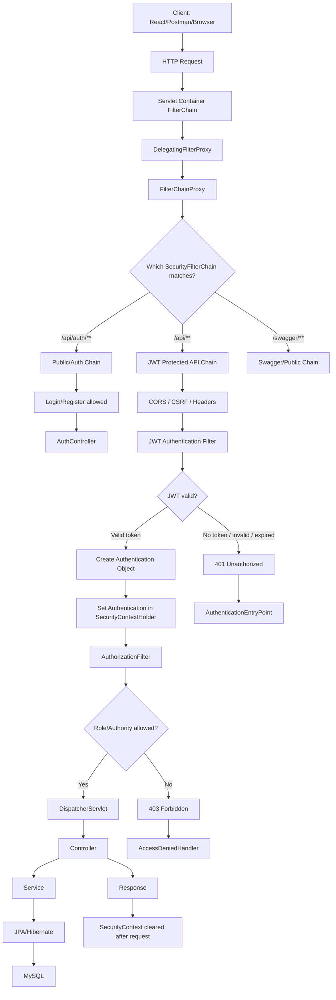

## Master interview explanation

“The request first enters the servlet filter chain. Spring Security is inserted through `DelegatingFilterProxy`, then `FilterChainProxy` selects the matching `SecurityFilterChain`. In a JWT-based REST API, my custom JWT filter reads the bearer token, validates it, creates an `Authentication` object, and stores it inside `SecurityContextHolder`. After that, `AuthorizationFilter` checks URL rules or roles. If authentication fails, we get 401. If authentication succeeds but permission is missing, we get 403. Only after that does the request reach the controller.”

Spring Security stores the authenticated user in `SecurityContextHolder`; the `SecurityContext` contains the current `Authentication`, and by default this is stored using `ThreadLocal`, which makes it available during the same request thread. Spring Security clears the context after request processing. ([Home][2])

---

# 3. One-Line Mental Shortcut

```text
Spring Security = Request → FilterChainProxy → SecurityFilterChain → Authentication → SecurityContext → Authorization → Controller
```

For JWT project:

```text
JWT Security = Login → Token Generate → Request with Bearer Token → JWT Filter → SecurityContext → Role Check → API Access
```

For interview:

```text
Authentication asks “Who are you?” Authorization asks “What can you access?”
```

---

# 4. Topic Breakdown Using Mental Model

| Mental Model Block     | Meaning                                          | Why It Is Important                              | Project Usage                                 | Interview Focus                                         |
| ---------------------- | ------------------------------------------------ | ------------------------------------------------ | --------------------------------------------- | ------------------------------------------------------- |
| Client Request         | Request from React/Postman/browser               | Security starts before controller                | React sends JWT in header                     | How secured API request flows                           |
| Servlet Filter Chain   | Java web filter layer                            | Spring Security is filter-based                  | Every API hits filters first                  | Why security runs before controller                     |
| DelegatingFilterProxy  | Bridge between servlet container and Spring bean | Allows Spring-managed security filters           | Auto-configured in Spring Boot                | Why Spring beans can act as servlet filters             |
| FilterChainProxy       | Main Spring Security filter                      | Central entry point for security                 | Debugging starts here                         | Difference between servlet filters and security filters |
| SecurityFilterChain    | Selected set of filters for request              | Different paths can have different rules         | `/api/auth/**` public, `/api/**` secured      | Multiple chains, matcher order                          |
| Authentication Filter  | Reads credentials/token                          | Converts request into identity                   | JWT filter reads `Authorization` header       | Custom JWT filter vs basic/form login                   |
| AuthenticationManager  | Authenticates credentials                        | Delegates authentication logic                   | Login API validates username/password         | `AuthenticationManager`, `ProviderManager`              |
| AuthenticationProvider | Actual auth strategy                             | Supports DB, LDAP, JWT, OAuth2                   | DAO provider checks DB user                   | `DaoAuthenticationProvider`                             |
| UserDetailsService     | Loads user from DB                               | Connects security with application user table    | Load user by email/username                   | User vs UserDetails                                     |
| PasswordEncoder        | Verifies password hash                           | Never store plain password                       | BCrypt password matching                      | BCrypt, DelegatingPasswordEncoder                       |
| JWT Service            | Creates/validates token                          | Stateless REST authentication                    | Token contains username/claims/expiry         | Token expiry, signature, claims                         |
| SecurityContextHolder  | Stores current authenticated user                | Later filters/controllers use identity           | Get logged-in user for post/comment ownership | ThreadLocal, context clearing                           |
| AuthorizationFilter    | Checks access rules                              | Authenticated user may still not have permission | ADMIN APIs, user APIs                         | 401 vs 403                                              |
| Method Security        | Service-level authorization                      | Protects business logic, not just URLs           | `@PreAuthorize("hasRole('ADMIN')")`           | URL security vs method security                         |
| Exception Handling     | Converts failures to 401/403                     | Clean API response                               | Custom entry point for JWT                    | AuthenticationEntryPoint, AccessDeniedHandler           |
| CORS/CSRF              | Browser and request protection                   | Common React + backend issue                     | React frontend calling backend                | CORS before security, CSRF for session apps             |
| Stateless Session      | No server session for JWT                        | Scales better for REST APIs                      | JWT sent on every request                     | `SessionCreationPolicy.STATELESS`                       |

`AuthenticationManager` defines how filters perform authentication; `ProviderManager` is the common implementation and delegates to one or more `AuthenticationProvider`s. `DaoAuthenticationProvider` uses `UserDetailsService` and `PasswordEncoder` for username/password authentication. ([Home][2])

---

# 5. Visual Notes for Each Important Subtopic

## 5.1 Spring Security Filter Chain

```mermaid
flowchart LR
    A[HTTP Request] --> B[DelegatingFilterProxy]
    B --> C[FilterChainProxy]
    C --> D[SecurityFilterChain]
    D --> E[CORS/CSRF/Header Filters]
    E --> F[Authentication Filter]
    F --> G[ExceptionTranslationFilter]
    G --> H[AuthorizationFilter]
    H --> I[DispatcherServlet]
    I --> J[Controller]
```

Memory:

```text
FilterChainProxy is the security gate.
SecurityFilterChain is the selected gate route.
Filters are the actual guards.
```

---

## 5.2 Login Flow: Username/Password to JWT

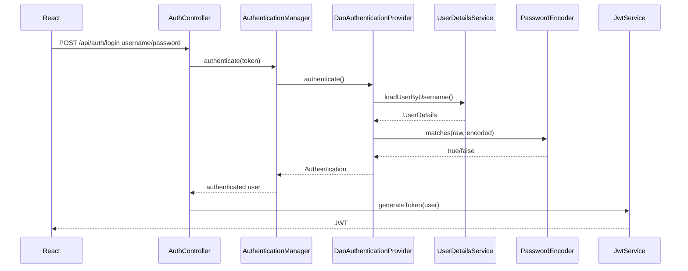

Interview line:

“In login, username/password is authenticated once. After successful authentication, the backend generates a JWT. Later requests do not send password; they send the token.”

---

## 5.3 JWT Request Flow

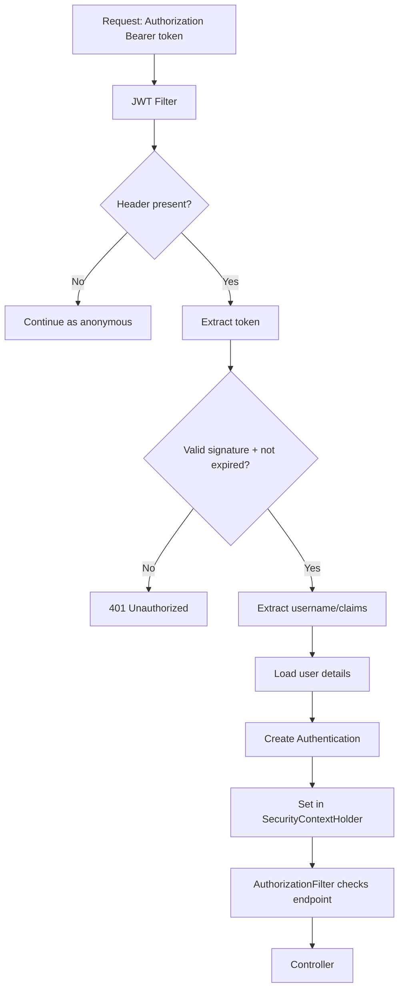

If using Spring Security’s built-in OAuth2 Resource Server support, Spring Security processes requests with `Authorization: Bearer` and validates JWT signature, timestamps like `exp`/`nbf`, issuer claim, and maps scopes to authorities. ([Home][3])

---

## 5.4 SecurityContext Lifecycle

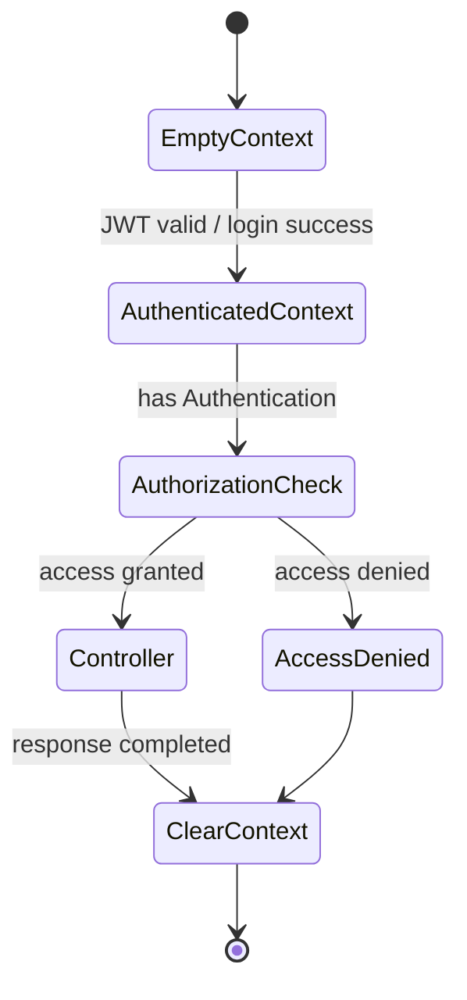

Memory:

```text
SecurityContext is not your database user.
It is the current request's authenticated identity.
```

---

## 5.5 Authentication vs Authorization

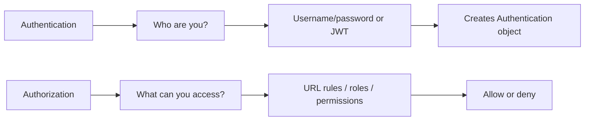

Example:

```text
Valid JWT but USER role accessing ADMIN API = authenticated but not authorized = 403.
No JWT accessing protected API = not authenticated = 401.
```

---

## 5.6 401 vs 403 Flow

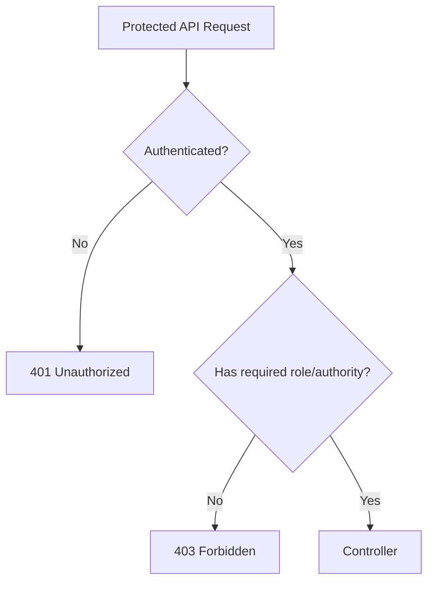

Interview shortcut:

```text
401 = I don't know who you are.
403 = I know you, but you are not allowed.
```

---

## 5.7 Authorization Rules Flow

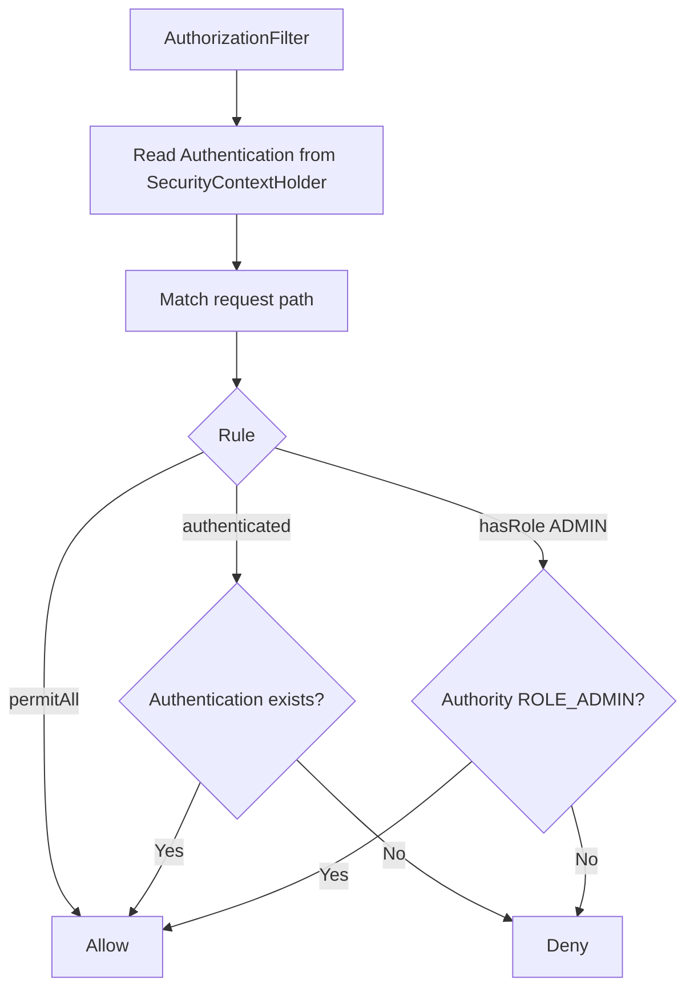

`AuthorizationFilter` gets the `Authentication` from `SecurityContextHolder`, passes it with the request to `AuthorizationManager`, and throws `AccessDeniedException` when authorization is denied. It is last by default, after authentication and exploit-protection filters. ([Home][4])

---

## 5.8 Method Security Flow

```mermaid
flowchart TD
    A[Controller calls Service Method] --> B[@PreAuthorize check]
    B --> C[Read Authentication]
    C --> D{Expression true?}
    D -->|Yes| E[Execute method]
    D -->|No| F[AccessDeniedException]
```

Example:

```java
@PreAuthorize("hasRole('ADMIN')")
public void deletePost(Long postId) {
    // only admin can delete
}
```

Spring Security supports method-level authorization through annotations like `@PreAuthorize`, `@PostAuthorize`, `@PreFilter`, and `@PostFilter` when method security is active. ([Home][5])

---

## 5.9 CORS Flow for React + Spring Boot

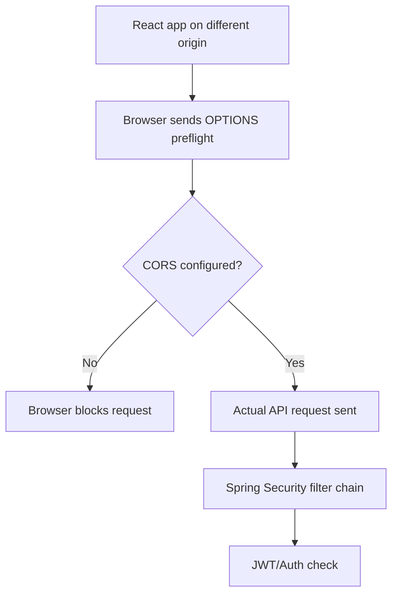

CORS must be processed before Spring Security because preflight requests do not contain cookies such as `JSESSIONID`; otherwise Spring Security may treat the request as unauthenticated and reject it. ([Home][6])

---

## 5.10 CSRF Mental Model

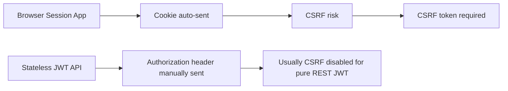

Spring Security protects against CSRF by default for unsafe HTTP methods like POST; for JWT stateless APIs, teams commonly disable CSRF because the API is not using server-side browser sessions. ([Home][7])

---

## 5.11 Microservices Security Flow

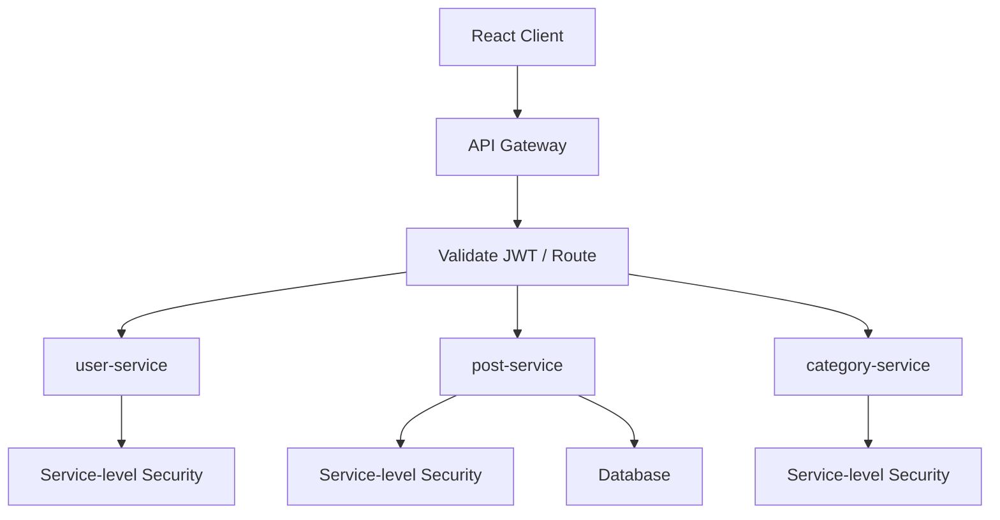

Project explanation:

“In microservices, the gateway can validate JWT and route requests, but each service should still protect sensitive endpoints. Gateway security is not a replacement for service-level authorization.”

---

# 6. Theory Required Behind the Mental Model

## 6.1 Filter Chain

Simple definition:
Spring Security is executed as filters before the request reaches `DispatcherServlet`.

Why it matters:
If your JWT filter is not registered correctly or ordered correctly, the controller may never receive an authenticated user.

Internal working:
`DelegatingFilterProxy` bridges servlet container and Spring beans. `FilterChainProxy` selects a matching `SecurityFilterChain`. That chain contains filters like CORS, CSRF, authentication filters, exception handling, and authorization.

Interview explanation:
“Spring Security is not directly inside the controller. It is a filter-based framework that intercepts requests before Spring MVC.”

---

## 6.2 Authentication

Simple definition:
Authentication verifies identity.

Why it matters:
Without authentication, Spring Security does not know the current user.

Internal working:

```text
Credentials/JWT → AuthenticationManager → AuthenticationProvider → Authentication object
```

Project example:
In your blog app, login authenticates email/password and generates JWT. For every later request, JWT authenticates the request.

---

## 6.3 Authorization

Simple definition:
Authorization decides whether the authenticated user can access something.

Why it matters:
A logged-in user should not access admin APIs.

Internal working:

```text
SecurityContext Authentication → AuthorizationFilter → URL/method rule → allow/deny
```

Project example:

```text
GET /api/posts              → public or authenticated
POST /api/posts             → authenticated
DELETE /api/posts/{id}      → ADMIN or owner
```

---

## 6.4 SecurityContextHolder

Simple definition:
It stores the current authenticated user for the request.

Why it matters:
Controllers/services can access the logged-in user without passing user info manually.

Internal working:

```text
JWT valid → Authentication object created → stored in SecurityContextHolder → used by authorization
```

Project example:

```java
Authentication auth = SecurityContextHolder.getContext().getAuthentication();
String username = auth.getName();
```

---

## 6.5 UserDetailsService

Simple definition:
Loads user security data from DB.

Why it matters:
Spring Security needs username, password, roles/authorities.

Internal working:

```text
loadUserByUsername(email) → UserDetails(username, password, authorities)
```

Project example:
Load user from MySQL `users` table by email.

---

## 6.6 PasswordEncoder

Simple definition:
Matches raw password with stored encoded password.

Why it matters:
Passwords should not be stored in plain text.

Internal working:

```text
raw password + encoded DB password → passwordEncoder.matches()
```

Spring Security uses `DelegatingPasswordEncoder` by default and supports password format identifiers like `{bcrypt}`; using `NoOpPasswordEncoder` is not considered secure. ([Home][8])

---

## 6.7 JWT

Simple definition:
JWT is a signed token used to carry identity/claims between client and server.

Why it matters:
It enables stateless authentication for REST APIs.

Internal working:

```text
Login success → generate token → client stores token → sends token in Authorization header → backend validates token
```

Project example:
React stores token and sends:

```text
Authorization: Bearer eyJhbGciOi...
```

---

## 6.8 Stateless Session

Simple definition:
Server does not keep login session for every user.

Why it matters:
Better for REST APIs, horizontal scaling, microservices.

Internal working:

```text
Every request carries JWT.
Backend validates JWT every time.
```

Spring Security stores the security context in the HTTP session by default, but this can be customized; stateless JWT APIs usually avoid server-side session storage. ([Home][9])

---

# 7. Code / Program Mapping

| Mental Model Concept     | Code/Program Needed? | What To Implement                | Why It Helps                         |
| ------------------------ | -------------------: | -------------------------------- | ------------------------------------ |
| SecurityFilterChain      |                  Yes | `SecurityConfig` bean            | Main configuration                   |
| Public vs protected APIs |                  Yes | `requestMatchers()` rules        | Understand authorization             |
| UserDetailsService       |                  Yes | Load user from DB                | Connect user table with security     |
| PasswordEncoder          |                  Yes | BCrypt bean                      | Secure password storage              |
| Login API                |                  Yes | `AuthController`                 | Understand authentication            |
| JWT generation           |                  Yes | `JwtService`                     | Token-based login                    |
| JWT validation filter    |                  Yes | `OncePerRequestFilter`           | Core JWT request flow                |
| SecurityContext          |                  Yes | Set Authentication manually      | Understand internal identity storage |
| Method Security          |                  Yes | `@PreAuthorize`                  | Service-level authorization          |
| 401/403 handling         |                  Yes | EntryPoint / AccessDeniedHandler | Clean API errors                     |
| CORS                     |                  Yes | `CorsConfigurationSource`        | React integration                    |

---

## 7.1 SecurityConfig

```java
@Configuration
@EnableWebSecurity
@EnableMethodSecurity
public class SecurityConfig {

    private final JwtAuthenticationFilter jwtAuthenticationFilter;
    private final AuthenticationProvider authenticationProvider;

    public SecurityConfig(
            JwtAuthenticationFilter jwtAuthenticationFilter,
            AuthenticationProvider authenticationProvider) {
        this.jwtAuthenticationFilter = jwtAuthenticationFilter;
        this.authenticationProvider = authenticationProvider;
    }

    @Bean
    public SecurityFilterChain securityFilterChain(HttpSecurity http) throws Exception {
        return http
                .csrf(csrf -> csrf.disable())
                .cors(Customizer.withDefaults())
                .sessionManagement(session ->
                        session.sessionCreationPolicy(SessionCreationPolicy.STATELESS)
                )
                .authorizeHttpRequests(auth -> auth
                        .requestMatchers(
                                "/api/auth/**",
                                "/v3/api-docs/**",
                                "/swagger-ui/**",
                                "/swagger-ui.html"
                        ).permitAll()
                        .requestMatchers(HttpMethod.GET, "/api/posts/**").permitAll()
                        .requestMatchers(HttpMethod.POST, "/api/posts/**").authenticated()
                        .requestMatchers(HttpMethod.DELETE, "/api/posts/**").hasRole("ADMIN")
                        .anyRequest().authenticated()
                )
                .authenticationProvider(authenticationProvider)
                .addFilterBefore(jwtAuthenticationFilter, UsernamePasswordAuthenticationFilter.class)
                .build();
    }
}
```

Interview line:

“I configured public endpoints like login/register and Swagger as `permitAll`, protected write APIs as authenticated, admin APIs with role checks, disabled CSRF for stateless JWT REST APIs, and added my JWT filter before `UsernamePasswordAuthenticationFilter`.”

Spring recommends the component-based `SecurityFilterChain` bean style; `WebSecurityConfigurerAdapter` was deprecated in Spring Security 5.7. ([Home][10])

---

## 7.2 AuthenticationProvider + PasswordEncoder

```java
@Configuration
public class ApplicationSecurityBeans {

    private final UserRepository userRepository;

    public ApplicationSecurityBeans(UserRepository userRepository) {
        this.userRepository = userRepository;
    }

    @Bean
    public UserDetailsService userDetailsService() {
        return username -> userRepository.findByEmail(username)
                .orElseThrow(() -> new UsernameNotFoundException("User not found: " + username));
    }

    @Bean
    public AuthenticationProvider authenticationProvider() {
        DaoAuthenticationProvider provider = new DaoAuthenticationProvider(userDetailsService());
        provider.setPasswordEncoder(passwordEncoder());
        return provider;
    }

    @Bean
    public AuthenticationManager authenticationManager(AuthenticationConfiguration config)
            throws Exception {
        return config.getAuthenticationManager();
    }

    @Bean
    public PasswordEncoder passwordEncoder() {
        return new BCryptPasswordEncoder();
    }
}
```

---

## 7.3 Login Controller

```java
@RestController
@RequestMapping("/api/auth")
public class AuthController {

    private final AuthenticationManager authenticationManager;
    private final JwtService jwtService;

    public AuthController(AuthenticationManager authenticationManager,
                          JwtService jwtService) {
        this.authenticationManager = authenticationManager;
        this.jwtService = jwtService;
    }

    @PostMapping("/login")
    public ResponseEntity<AuthResponse> login(@RequestBody LoginRequest request) {

        Authentication authentication = authenticationManager.authenticate(
                new UsernamePasswordAuthenticationToken(
                        request.getEmail(),
                        request.getPassword()
                )
        );

        UserDetails user = (UserDetails) authentication.getPrincipal();
        String token = jwtService.generateToken(user);

        return ResponseEntity.ok(new AuthResponse(token));
    }
}
```

---

## 7.4 JWT Filter

```java
@Component
public class JwtAuthenticationFilter extends OncePerRequestFilter {

    private final JwtService jwtService;
    private final UserDetailsService userDetailsService;

    public JwtAuthenticationFilter(JwtService jwtService,
                                   UserDetailsService userDetailsService) {
        this.jwtService = jwtService;
        this.userDetailsService = userDetailsService;
    }

    @Override
    protected void doFilterInternal(
            HttpServletRequest request,
            HttpServletResponse response,
            FilterChain filterChain
    ) throws ServletException, IOException {

        String authHeader = request.getHeader("Authorization");

        if (authHeader == null || !authHeader.startsWith("Bearer ")) {
            filterChain.doFilter(request, response);
            return;
        }

        String jwt = authHeader.substring(7);
        String username = jwtService.extractUsername(jwt);

        if (username != null &&
                SecurityContextHolder.getContext().getAuthentication() == null) {

            UserDetails userDetails = userDetailsService.loadUserByUsername(username);

            if (jwtService.isTokenValid(jwt, userDetails)) {
                UsernamePasswordAuthenticationToken authentication =
                        new UsernamePasswordAuthenticationToken(
                                userDetails,
                                null,
                                userDetails.getAuthorities()
                        );

                authentication.setDetails(
                        new WebAuthenticationDetailsSource().buildDetails(request)
                );

                SecurityContext context = SecurityContextHolder.createEmptyContext();
                context.setAuthentication(authentication);
                SecurityContextHolder.setContext(context);
            }
        }

        filterChain.doFilter(request, response);
    }
}
```

---

## 7.5 Method Security Example

```java
@Service
public class PostService {

    @PreAuthorize("hasRole('ADMIN') or @postSecurity.isOwner(#postId, authentication.name)")
    public void deletePost(Long postId) {
        // delete post
    }
}
```

```java
@Component
public class PostSecurity {

    private final PostRepository postRepository;

    public PostSecurity(PostRepository postRepository) {
        this.postRepository = postRepository;
    }

    public boolean isOwner(Long postId, String username) {
        return postRepository.existsByIdAndUserEmail(postId, username);
    }
}
```

Interview line:

“I use URL-level security for broad endpoint protection and method-level security for business rules like only post owner or admin can delete.”

---

# 8. Project Usage Mapping

| Concept             | How I Can Use/Explain It In My Project         | Interview Line                                                                                |
| ------------------- | ---------------------------------------------- | --------------------------------------------------------------------------------------------- |
| SecurityFilterChain | Configured public and protected APIs           | “I used SecurityFilterChain to define which endpoints are public and which require JWT.”      |
| JWT Login           | Login API authenticates user and returns token | “After login, the backend returns JWT and React sends it on later requests.”                  |
| JWT Filter          | Validates token before controller              | “Every protected request passes through a JWT filter before reaching controller.”             |
| SecurityContext     | Stores logged-in user for request              | “After token validation, I set Authentication in SecurityContextHolder.”                      |
| UserDetailsService  | Loads user from MySQL                          | “My custom UserDetailsService loads user credentials and roles from database.”                |
| BCrypt              | Encodes user passwords                         | “I store encoded passwords and validate using PasswordEncoder, not plain text.”               |
| Authorization       | Protects APIs by role                          | “Admin APIs can be restricted using `hasRole('ADMIN')`.”                                      |
| Method Security     | Protects business rules                        | “For owner-based checks, method security is better than only URL matching.”                   |
| React Integration   | React sends bearer token                       | “React stores token and attaches it in Authorization header.”                                 |
| Swagger             | Public documentation endpoint                  | “Swagger endpoints are allowed separately to avoid 401 during API testing.”                   |
| Actuator            | Protected operational endpoint                 | “Actuator should be restricted, especially in cloud deployment.”                              |
| AWS Lightsail       | Deployed secured REST backend                  | “On cloud, I ensure correct CORS, HTTPS, environment-based secrets, and protected endpoints.” |
| Microservices       | Gateway + service-level security               | “Gateway can validate JWT, but services should still protect sensitive APIs.”                 |
| Docker/K8s          | Externalize secret/config                      | “JWT secret should come from environment variables or Kubernetes Secret, not hardcoded.”      |
| Jenkins             | CI/CD                                          | “Pipeline builds and deploys the secured app; secrets must not be printed in logs.”           |

---

# 9. Scenario-Based Mental Models

## Scenario 1: What happens when a protected request comes with valid JWT?

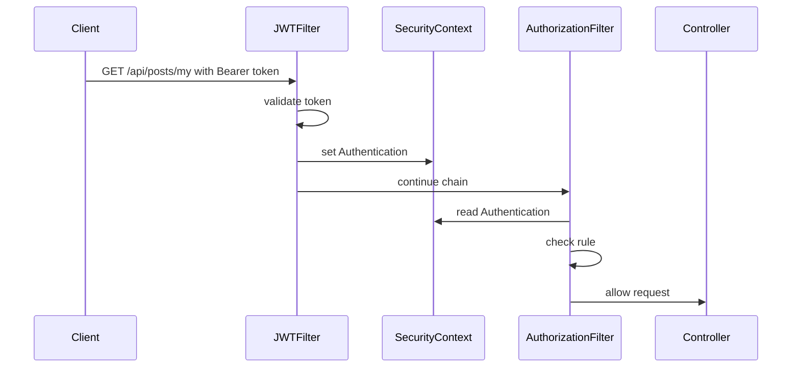

Problem: none.
Root cause: token valid and role sufficient.
Fix: not needed.
Interview explanation:
“The JWT filter authenticates the request, sets the context, and authorization allows the controller.”

---

## Scenario 2: What happens when request has no token?

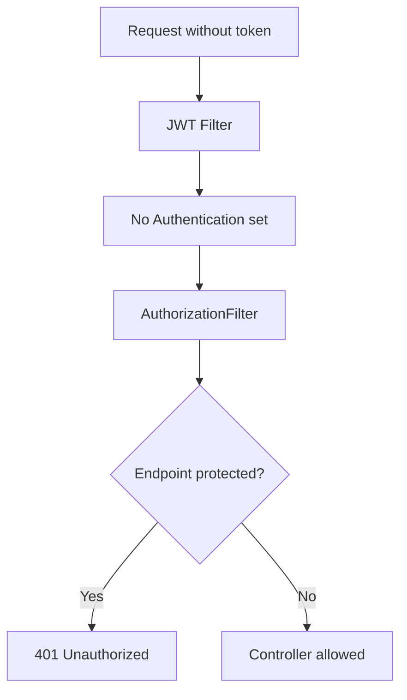

Problem: protected API returns 401.
Root cause: missing `Authorization: Bearer token`.
Fix: send token from React/Postman.
Interview explanation:
“If no token is present, the request remains unauthenticated. Public endpoints continue; protected endpoints return 401.”

---

## Scenario 3: Valid token but wrong role

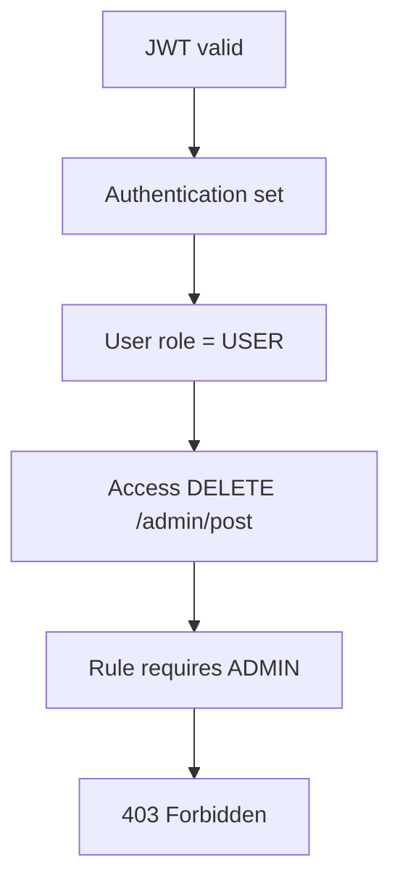

Problem: 403.
Root cause: authentication successful but insufficient authority.
Fix: assign correct role or change rule.
Interview explanation:
“This is authorization failure, not authentication failure.”

---

## Scenario 4: Login fails with wrong password

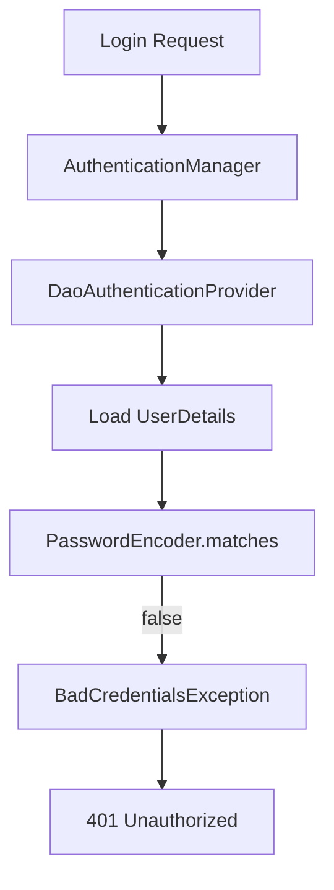

Problem: login returns 401.
Root cause: password mismatch.
Fix: check password encoding, registration encoding, login payload.
Interview explanation:
“The password is never decoded. BCrypt matches raw password with encoded password.”

---

## Scenario 5: CORS issue from React

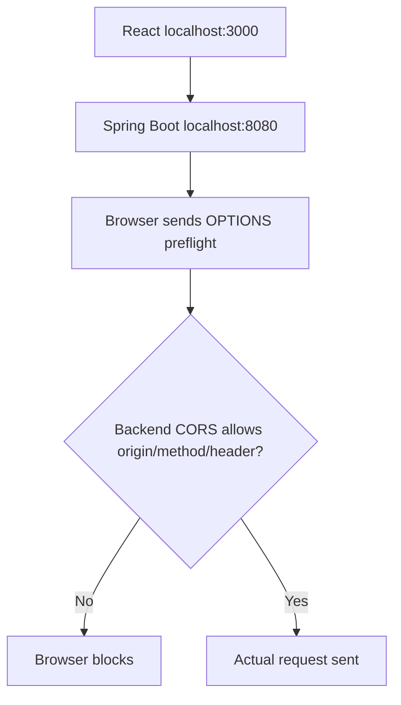

Problem: API works in Postman but fails in browser.
Root cause: CORS is browser-enforced.
Fix: configure allowed origins, methods, and headers.
Interview explanation:
“Postman does not enforce browser CORS. React does, so CORS must be configured for frontend origin.”

---

## Scenario 6: JWT expired

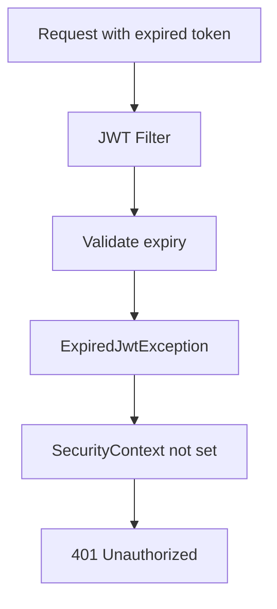

Problem: user suddenly gets 401.
Root cause: token expired.
Fix: re-login or implement refresh token.
Interview explanation:
“JWT is stateless, so expiry is checked on every request.”

---

## Scenario 7: User deleted but old JWT still exists

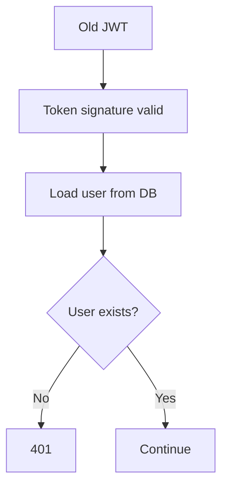

Problem: token structurally valid but user not allowed.
Root cause: user deleted/disabled.
Fix: check DB status during JWT validation.
Interview explanation:
“I validate token and also load current user details, so disabled/deleted users can be blocked.”

---

## Scenario 8: Microservices request

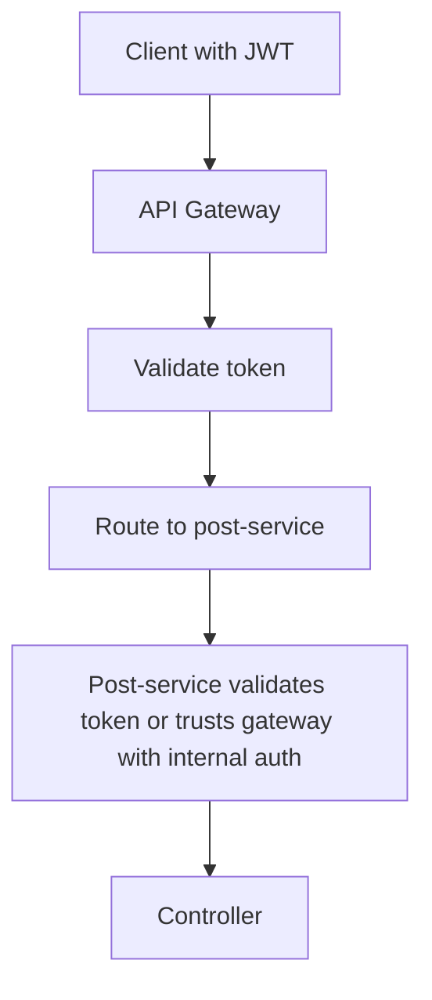

Problem: downstream service exposed directly.
Root cause: only gateway secured.
Fix: secure services too or restrict network access.
Interview explanation:
“Gateway security is useful, but services should not blindly expose sensitive endpoints.”

---

# 10. Debugging / Production Issue Flow

| Issue                  | Possible Cause                       | Where To Check                      | Fix                                                           | Interview Explanation                                    |
| ---------------------- | ------------------------------------ | ----------------------------------- | ------------------------------------------------------------- | -------------------------------------------------------- |
| 401 on protected API   | Missing token                        | Browser network tab/Postman headers | Add `Authorization: Bearer <token>`                           | “401 means authentication did not happen.”               |
| 401 after login        | Wrong password or encoder mismatch   | Login API, DB password format       | Use BCrypt consistently                                       | “Raw password is matched against encoded password.”      |
| 401 for Swagger        | Swagger path not permitted           | `SecurityFilterChain` matchers      | Permit `/swagger-ui/**`, `/v3/api-docs/**`                    | “Swagger is also behind filter chain unless allowed.”    |
| 403 on admin API       | User lacks role                      | JWT claims, DB roles, authorities   | Add `ROLE_ADMIN` or fix mapping                               | “403 means authenticated but not authorized.”            |
| JWT filter not called  | Filter not registered/order wrong    | Security logs, filter chain debug   | Add filter before `UsernamePasswordAuthenticationFilter`      | “Custom filter must be inside security chain.”           |
| CORS error in React    | Origin/header/method not allowed     | Browser console, preflight request  | Configure CORS                                                | “CORS is browser-side; Postman may still work.”          |
| CSRF 403 on POST       | CSRF enabled for stateless API       | Security config                     | Disable CSRF for JWT REST API                                 | “CSRF is mainly needed for browser session-cookie apps.” |
| Token expired          | `exp` claim passed                   | JWT parser logs                     | Re-login or refresh token                                     | “JWT expiry is checked every request.”                   |
| `SecurityContext` null | JWT not validated or context not set | JWT filter                          | Set Authentication correctly                                  | “Authorization depends on SecurityContext.”              |
| Role not working       | Missing `ROLE_` prefix               | Authorities mapping                 | Use `hasRole('ADMIN')` with `ROLE_ADMIN`, or `hasAuthority()` | “Role and authority mapping must be consistent.”         |
| Actuator exposed       | Endpoint not protected               | Actuator config/security rules      | Restrict or expose minimal endpoints                          | “Operational endpoints should be secured in cloud.”      |
| Secret leaked          | JWT secret in code/logs              | GitHub, env, Jenkins logs           | Move to env/K8s Secret                                        | “Secrets should not be hardcoded.”                       |

---

# 11. 60–70% Most Important Interview Coverage

| Priority | Topic                           | Mental Model Needed        | Code Needed                    | Scenario Needed           | Interview Weight   |
| -------- | ------------------------------- | -------------------------- | ------------------------------ | ------------------------- | ------------------ |
| P0       | Filter chain                    | Request pipeline           | SecurityFilterChain            | Request before controller | Very High          |
| P0       | Authentication vs Authorization | Decision model             | Login + role rule              | 401 vs 403                | Very High          |
| P0       | JWT flow                        | Token pipeline             | JWT filter + service           | Expired/missing token     | Very High          |
| P0       | SecurityContextHolder           | State model                | Set Authentication             | Context null              | Very High          |
| P0       | UserDetailsService              | Component interaction      | DB user loading                | User not found            | High               |
| P0       | PasswordEncoder                 | Password matching flow     | BCrypt                         | Bad credentials           | High               |
| P0       | URL authorization               | Rule decision tree         | `requestMatchers()`            | Admin/user APIs           | High               |
| P1       | Method security                 | Service guard model        | `@PreAuthorize`                | Owner/admin check         | High               |
| P1       | Exception handling              | Failure routing            | EntryPoint/AccessDenied        | Custom 401/403            | Medium-High        |
| P1       | CORS                            | Browser preflight model    | CORS config                    | React blocked             | Medium-High        |
| P1       | CSRF                            | Session-cookie risk model  | Disable/enable wisely          | POST 403                  | Medium             |
| P1       | Stateless session               | Token-per-request model    | Session policy                 | Scaling API               | Medium             |
| P1       | OAuth2 Resource Server          | Bearer token standard flow | `oauth2ResourceServer().jwt()` | IdP/JWK validation        | Medium             |
| P2       | Remember-me/session fixation    | Session model              | Optional                       | Session app               | Low-Medium         |
| P2       | OAuth2 login                    | External IdP flow          | Optional                       | Google/GitHub login       | Medium             |
| P2       | ACL/domain security             | Fine-grained model         | Optional                       | Object-level permission   | Low                |
| P3       | SAML/LDAP                       | Enterprise auth model      | Optional                       | Corporate login           | Low unless JD asks |

For interviews starting soon, cover **P0 + selected P1** first.

---

# 12. Revision Format

## Master shortcut

```text
Spring Security = Request → FilterChainProxy → SecurityFilterChain → Authentication → SecurityContext → Authorization → Controller
```

## 5 key diagrams to memorize

### 1. Main request flow

```text
Client → FilterChainProxy → JWT Filter → SecurityContext → AuthorizationFilter → Controller
```

### 2. Login flow

```text
Login Request → AuthenticationManager → DaoAuthenticationProvider → UserDetailsService → PasswordEncoder → JWT
```

### 3. JWT flow

```text
Bearer Token → Validate → Load User → Create Authentication → Set SecurityContext
```

### 4. 401/403 flow

```text
No identity → 401
Identity but no permission → 403
```

### 5. React CORS flow

```text
React → OPTIONS Preflight → CORS Check → Actual Request → JWT Check
```

## 10 must-remember points

1. Spring Security runs before controller.
2. It is filter-chain based.
3. `FilterChainProxy` is the main Spring Security filter.
4. `SecurityFilterChain` decides which filters apply to a request.
5. Authentication means identity verification.
6. Authorization means access permission.
7. JWT filter sets `Authentication` inside `SecurityContextHolder`.
8. `SecurityContextHolder` is usually request-thread based.
9. 401 means unauthenticated; 403 means unauthorized.
10. Passwords are matched using `PasswordEncoder`, not decoded.

## 10 common interview lines

1. “Spring Security works mainly through servlet filters.”
2. “The request reaches the controller only after passing authentication and authorization.”
3. “In JWT, the server does not store session; every request carries the token.”
4. “I use `SecurityContextHolder` to store the authenticated user for the current request.”
5. “`UserDetailsService` connects my user table with Spring Security.”
6. “`PasswordEncoder` validates raw password against encoded password.”
7. “`AuthenticationManager` delegates to an `AuthenticationProvider`.”
8. “401 and 403 are different: one is authentication failure, the other is authorization failure.”
9. “For React integration, CORS must be configured properly.”
10. “For business rules like owner-based access, method security is better.”

## 10 common mistakes

1. Confusing authentication with authorization.
2. Forgetting `Bearer ` prefix.
3. Not adding JWT filter before username/password filter.
4. Not setting `SecurityContext`.
5. Using plain-text passwords.
6. Role prefix mismatch: `ADMIN` vs `ROLE_ADMIN`.
7. Blocking Swagger accidentally.
8. Ignoring CORS for React.
9. Disabling CSRF without understanding why.
10. Hardcoding JWT secret in code.

## 5 debugging flows

```text
401 → Check token header → JWT validation → UserDetailsService → SecurityContext
```

```text
403 → Check authenticated user → roles/authorities → URL rule → method security
```

```text
CORS → Check browser preflight → allowed origin → allowed method → allowed headers
```

```text
Login fail → Check user exists → password encoder → DB password hash → exception
```

```text
Swagger fail → Check permitted paths → `/swagger-ui/**` → `/v3/api-docs/**`
```

## 5 project explanation points

1. “My blog app uses JWT-based stateless authentication.”
2. “React sends JWT in the Authorization header.”
3. “Spring Security validates JWT before the controller.”
4. “I used DB-backed users with `UserDetailsService`.”
5. “For microservices, I would validate JWT at gateway and protect services too.”

---

# 13. Interview Answer Templates

## 1. Explain Spring Security flow

“As per my project experience, Spring Security works like a filter-based gate before the controller. In my Spring Boot application, every request first passes through the security filter chain. For protected APIs, my JWT filter extracts the bearer token, validates it, loads user details, creates an Authentication object, and stores it inside SecurityContextHolder. After that, authorization rules check whether the user can access the endpoint. Only then does the request reach the controller.”

---

## 2. Explain JWT authentication

“In my Spring Boot blog application, I used JWT for stateless authentication. The user logs in with email and password. If credentials are valid, the backend generates a JWT and returns it to the React frontend. For every protected request, React sends the token in the Authorization header. The backend validates the token on each request and sets the authenticated user in SecurityContext.”

---

## 3. Explain 401 vs 403

“The main difference is authentication versus authorization. 401 means the system does not know who the user is, usually because token is missing, invalid, or expired. 403 means the user is authenticated but does not have the required role or permission. For example, a normal user trying to access an admin API should get 403.”

---

## 4. Explain `UserDetailsService`

“In my application, `UserDetailsService` acts as the bridge between my users table and Spring Security. During login or token validation, Spring Security needs user information like username, password, and authorities. My custom implementation loads the user from MySQL and converts it into a `UserDetails` object.”

---

## 5. Explain `PasswordEncoder`

“I do not store plain passwords. During registration, the password is encoded using BCrypt. During login, Spring Security uses `PasswordEncoder.matches()` to compare the raw password with the encoded password stored in DB. The password is not decrypted.”

---

## 6. Explain `SecurityContextHolder`

“`SecurityContextHolder` stores the currently authenticated user for the current request. Once my JWT filter validates the token, it creates an Authentication object and sets it in the SecurityContext. Later, authorization filters, controllers, or services can use that authentication information.”

---

## 7. Explain Spring Security in microservices

“In microservices architecture, I would usually validate JWT at the API Gateway for common authentication and routing. But I would still secure individual services because internal services should not fully trust that every request always comes through the gateway. Service-level authorization is important for sensitive operations.”

---

## 8. Explain CORS issue with React

“In my React + Spring Boot setup, CORS becomes important because frontend and backend may run on different origins. Browser sends a preflight OPTIONS request before the actual request. If allowed origins, methods, or headers are not configured properly, the browser blocks the request even if the backend API works from Postman.”

---

## 9. Explain why CSRF disabled in JWT REST API

“In a stateless JWT REST API, I usually disable CSRF because the server is not using browser session cookies for authentication. The client manually sends the token in the Authorization header. But if the application uses session-based login with cookies, CSRF protection should be considered.”

---

## 10. Explain your project security professionally

“In my Spring Boot blog application, I implemented JWT-based authentication with Spring Security. I configured public endpoints like login, register, Swagger, and some GET APIs, while protecting write operations. I used custom `UserDetailsService` for DB-backed users, BCrypt for password encoding, JWT filter for request authentication, and role-based authorization for restricted APIs. This helped me understand the complete flow from frontend login to secured backend API access.”

---

# 14. Final Learning Strategy

## Step-by-step preparation order

### 1. First memorize the master diagram

Memorize this first:

```text
Request → FilterChainProxy → SecurityFilterChain → JWT Filter → SecurityContext → AuthorizationFilter → Controller
```

Until this becomes natural, do not jump randomly into OAuth2, SAML, LDAP, etc.

---

### 2. Then understand each block

Study in this order:

1. Filter chain
2. Authentication vs authorization
3. `SecurityContextHolder`
4. `AuthenticationManager`
5. `AuthenticationProvider`
6. `UserDetailsService`
7. `PasswordEncoder`
8. JWT filter
9. URL authorization
10. Method security
11. 401/403
12. CORS/CSRF

---

### 3. Then write small code/programs

Code in this order:

1. Basic `SecurityFilterChain`
2. Public/protected endpoint rules
3. BCrypt registration/login
4. Custom `UserDetailsService`
5. Login API with `AuthenticationManager`
6. JWT generation
7. JWT validation filter
8. Role-based endpoint
9. `@PreAuthorize`
10. Custom 401/403 response

---

### 4. Then connect it with your project

Use your blog app examples:

```text
User login
JWT generation
React token storage
Create post API
Delete post API
Swagger access
MySQL user table
AWS deployment
```

Do not claim huge production-scale security ownership if you did not do it. Say:

“I implemented this in my personal Spring Boot project and understand how it would be extended in production.”

That sounds honest and senior enough.

---

### 5. Then practice scenario questions

Practice these first:

1. What happens when a request comes with JWT?
2. Why 401?
3. Why 403?
4. Why CORS error from React?
5. Why Swagger blocked?
6. Why login fails?
7. How roles are checked?
8. How to secure microservices?
9. How to refresh expired token?
10. Where to store JWT secret?

---

### 6. Then revise using shortcuts

Daily revision shortcut:

```text
Login → AuthenticationManager → Provider → UserDetailsService → PasswordEncoder → JWT
Request → JWT Filter → SecurityContext → Authorization → Controller
Failure → 401 if unauthenticated, 403 if unauthorized
```

## What to learn first

Focus first on:

```text
Filter chain
JWT flow
SecurityContext
AuthenticationManager
UserDetailsService
PasswordEncoder
Authorization rules
401/403
```

## What to code first

Code this minimum:

```text
Login API
JWT generation
JWT filter
SecurityFilterChain
Role-based endpoint
```

## What to skip initially

Skip for now unless JD specifically asks:

```text
SAML
LDAP
OAuth2 login with Google/GitHub
Remember-me
ACL
Advanced session fixation
Custom authorization managers
```

## Enough to start interviews

For Spring Security, enough means you can confidently explain:

```text
How request flows
How login works
How JWT works
How SecurityContext works
How role authorization works
Why 401/403 happens
How React sends token
How CORS/CSRF affect APIs
How this is used in your blog project
```

That covers the majority of Java Backend / Spring Boot interview questions around Spring Security.

[1]: https://docs.spring.io/spring-security/reference/servlet/architecture.html "Architecture :: Spring Security"
[2]: https://docs.spring.io/spring-security/reference/servlet/authentication/architecture.html "Servlet Authentication Architecture :: Spring Security"
[3]: https://docs.spring.io/spring-security/reference/servlet/oauth2/resource-server/jwt.html "OAuth 2.0 Resource Server JWT :: Spring Security"
[4]: https://docs.spring.io/spring-security/reference/servlet/authorization/authorize-http-requests.html "Authorize HttpServletRequests :: Spring Security"
[5]: https://docs.spring.io/spring-security/reference/servlet/authorization/method-security.html "Method Security :: Spring Security"
[6]: https://docs.spring.io/spring-security/reference/servlet/integrations/cors.html "CORS :: Spring Security"
[7]: https://docs.spring.io/spring-security/reference/servlet/exploits/csrf.html "Cross Site Request Forgery (CSRF) :: Spring Security"
[8]: https://docs.spring.io/spring-security/reference/features/authentication/password-storage.html "Password Storage :: Spring Security"
[9]: https://docs.spring.io/spring-security/reference/servlet/authentication/session-management.html "Authentication Persistence and Session Management :: Spring Security"
[10]: https://spring.io/blog/2022/02/21/spring-security-without-the-websecurityconfigureradapter?utm_source=chatgpt.com "Spring Security without the WebSecurityConfigurerAdapter"
